# P52：L8.2- 逻辑回归损失函数 - ShowMeAI - BV1ub4y127jj

Allright， let's now take a look at how we compute the loss function for the logistic regression model。

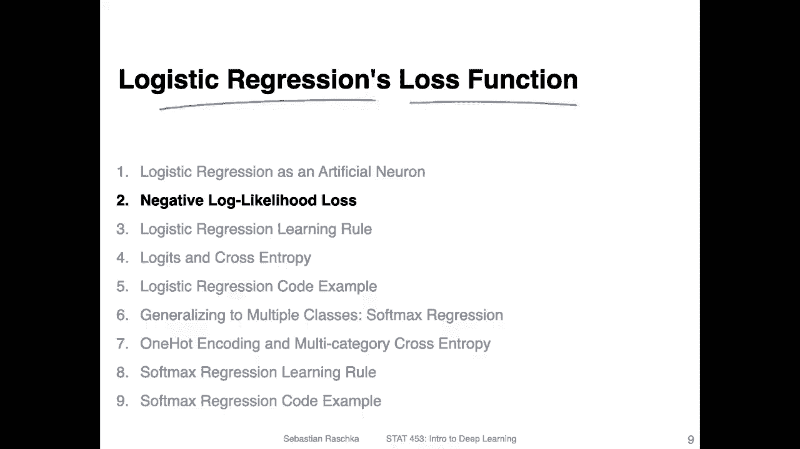

The so called negative look likelihoodness。So here。

 that's just the slide I already showed you at the end of the previous video。

And I just want to recap some of the main aspects here。

 So there are two things going on on this slide。 So one is how we compute this probability。

 And here at the bottom is what we want this probability to be。

So let's take a look at what we want first in this case。 So we want this probability。

 the class membership probability for class 0 to be。1， to be maximized。If the true label is indeed 0。

 So this is on the left hand side， this is the class membership probability。 We want this to be。

As high as possible。4 equal 0， if the true labels indeed 0。RightAnd vice versa。

 we want the class membership probability here for class1。To be as high as possible。

 also approaching one。If the true label is one， right， so。

Given us what we want is we want to maximize the probability for the given label， for the true label。

Now， how is this probability computed。That is what is shown here。 So here again。

 this is how we compute these probabilities， so。The class membership pro for y equals one。 So here。

 this is not really the true label。 You think of， you can think of it as。um。

As this one in this function here， so。We compute the class membership probability for y equals 1。

So this one here at the bottom。By just the activation。 So this is simply the activation。

 So the logistic sigmoid。Applied to the。Net input。And for the second case。

 So this one can be computed by one minus the activation。So， this would be。This one here。Okay。

 so this is just like a brief recap。 Now we can actually rewrite this piecewise function here。

 how we compute this class membership probability using this more compact notation。 So this combines。

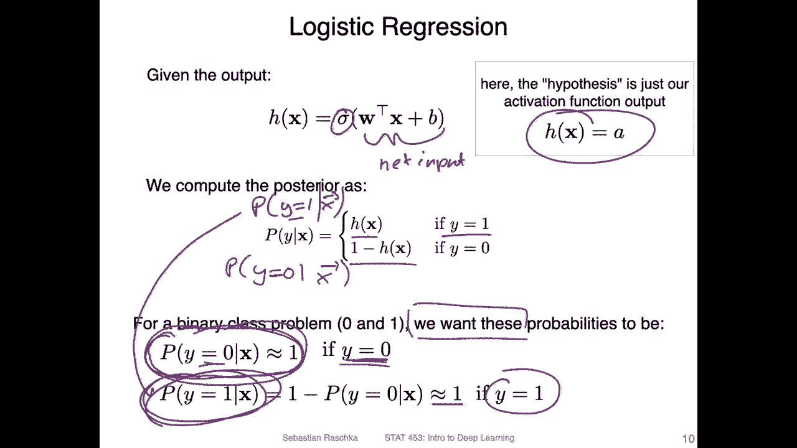

Or this essentially summarizes this piecewise function in one line or one equation。

 So how it works is yeah， let's just plug in some numbers。 Or first。

 let's let me clarify what what this a here means。 So this a is yeah the activation。

 it's just instead of writing H of x， it's just abbreviated with a letter a。

 It's like nicer to look at or look simpler。Now， let's consider the case where we have the class membership probability for class 1。

Given the feature vector X。So， if。Y equals1。Then。Yeah， this term。Remains as a， and。This one。😔。

Nothing happens here。 This one becomes one right and 1 minus-1 is 0 so。Yeah， this cancels。

Well becomes 0 essentially。 and something to the power of0 is  one， right？ So this whole term here。

Becomes one。 So this whole equation here reduces two just。嗯。Right， so a is equal to H of x。

So this one here。 So we satisfy this first term here。 So this。

 I'm just showing you right now that this function indeed summarizes the piece of s linear function。

 So now consider the case。Well， oops。Y equals 0， given the feature x to x。So here now consider。

 let me erase this a little bit so we have more space。So we are looking now。😔，This one here， so。

Where y is equal to 0。 So if y is equal to 0， then this is a 0。 So this whole。Thing becomes one。And。

What we have is this becomes a 0。 So this term here becomes one。So what we have。

 then what remains is。1 minus a， right， which is this one。

 So you can now see that this equation here at the bottom summarizes this piece ofwise linear function here。

Just a different notation。

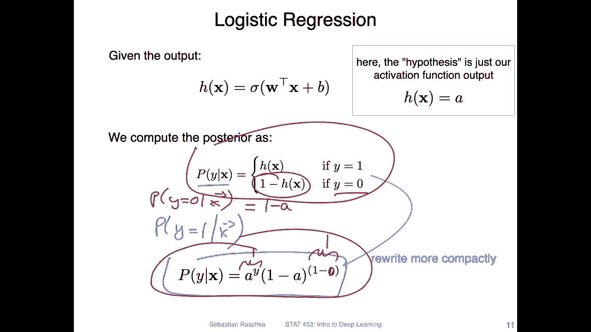

Now， yeah， what we want is we want to maximize the class membership probabilities。 So。

 and usually in a data set， we not only have one single data point， we have。And data points。

 So this is the size。O。Training。Said。And yet， we want to maximize the class membership probabilities for all these examples in the training set。

So you can think of it as， yeah， the probabilities here multiplied。 So the conditional probabilities。

 and we want to find， yeah， the。Model parametersters， because。

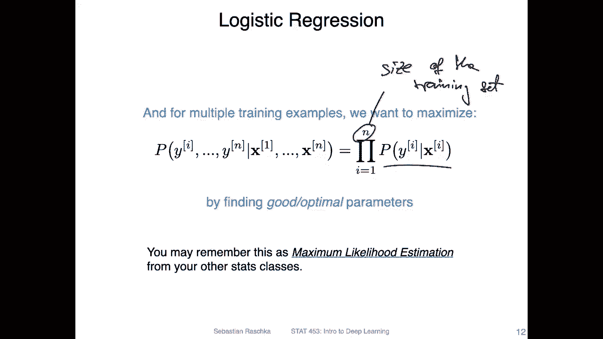

Yeah， it depends here on our model right。 So the probability here。

 the prediction probability here depends on our model parameters。

 that's how we compute these probabilities。 So we want to find good parameters that maximize the class membership probability for the right class。

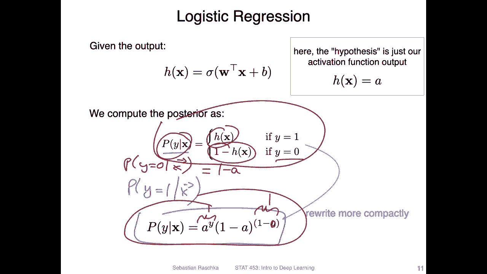

So this concept is also known as maximum likelihood estimation。

 So the we want to maximize the likelihood， the probability of observing the data given the model parameters。

And yeah， you probably know this from other statistics classes。

 so I don't want to go into too much detail about maximum likelihood estimation here。

 So just assume now we want to maximize this term here。

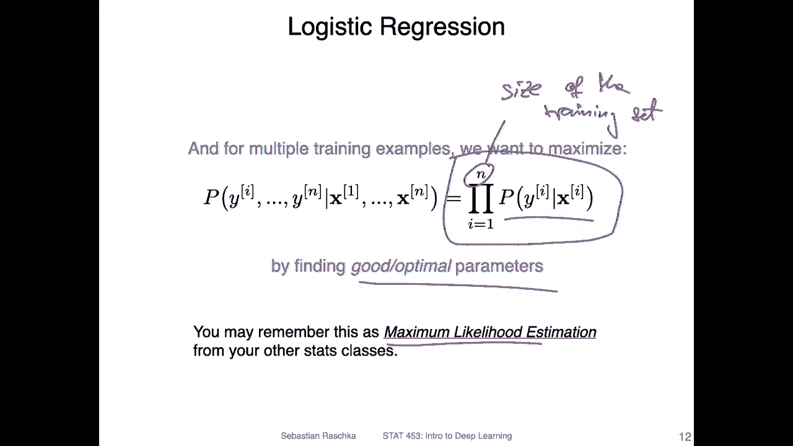

So here what I'm doing is I'm just rewriting this with we the simpler notation I showed you before。

So if I go back to slides。

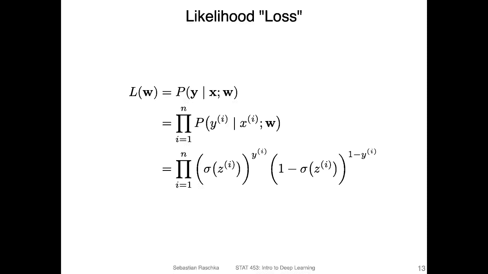

So。This notation here at the bottom。

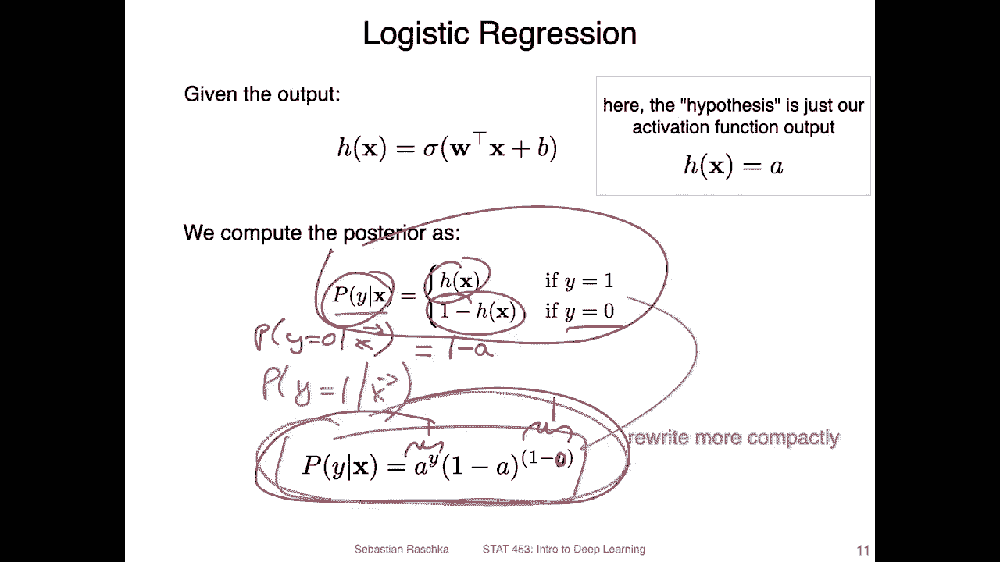

That's what I'm doing here。 So I'm replacing this。Right。

 this is something you have seen before on the previous slide I just showed you。

 I'm replacing this now with this more compact notation here where。Before I I rebb it as a。

 I don't know why I expanded it here again。 I I think I just wanted to show you how it's computed。

Where a is we have the logistic regression model， where this is sigma is logistic activation function and Z is the net input。

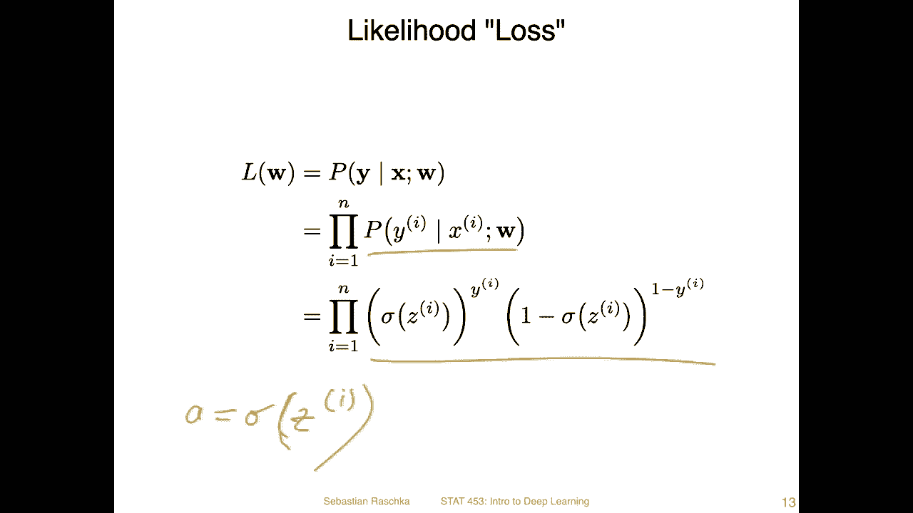

All right。So。You can think of it also as the loss function。 then so as the logistic loss。

 which we computers follows the probability over the whole training set。

And I said we want to maximize this， right， We want to maximize the class membership probabilities。

In practice， it's actually easier to maximize the natural lock of this equation。

 which is also called the lock likelihood function。So why is that if we apply the lock here。

 then we can replace the product。By a sum。AndAlso here in this multiplication。

 we can replace it with a sum and numerically on a computer this is just more stable to implement it more more stable when we use。

 for example， gradient descent。But you can think of it also as maximizing the。

L likelihood also maximizes the likelihood。 So it's like the same kind of the same thing as if you maximize one。

 you also maximize the other。 So in that way， this is why we can do that。

So we here at the bottom is the。Lock and was just taking the lock of this party at the at the top。

 So we have now。Why is the true label times lock the activation。

So this is the cast membership probability。So。Those made for completeness， this would be。Y given X。

 and， of course， also the model parameters， But I'm omitting the model parameters here just for simplicity。

And yeah， this is the lock likelihood loss。

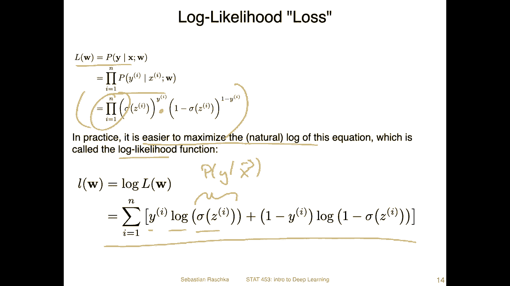

I mean， it's not。Quite the likelihood inness， because there's one more modification。 So in practice。

 also， when you recall from the pytor code that I showed you。

 we have the stochastic gradient descent。And in stochastic。

 gradient descent that me bright us may be known。Schastic。😔，Grilliant。Sent， we want to minimize。

So this is process when we。Minimize something。 If we wanted to maximize something。

 we would have to use stochastic gradient。esscent。That is like the other way around。 we want to。

 we would maximize something。So what we don't want to。

 so if we think of it maybe as a loss function so， or as a function。

 So grain and descent would be like this where we go down this hill。And great essencecent would be。

This way， where we go up that hill。Now， in Ptor or many other libraries。

 it just happens just for simplicity。Theres an implementation of gradient descent where we minimize something。

 So in that way。IfWe would just give it a look likelihood function as the loss function to optimize。

 then yeah， it would actually max minimize this loss， which would actually very bad。

 So we we would get as very small class membership probabilities for the correct labels。

 So what we can do now is just to turn around this problem。 So instead of。嗯。

Maximizing the look likelihood， we can minimize the negative look likelihood。

 just putting a negative here in front。 And then we turn this maximization problem into a minimization problem。

 And then we can just use the stochastic gradienting descent implemented in Pytorch。😊。

So it's just like a little trick we do by flipping around the sign here and another trick we can do in code is that we usually add a one over end scaling factor。

Here to scale yeah over the number of data points in the training set or the batch size。

 the mini batch size。 So last time we also talked about mini batches。 so we can also excuse me。

 so we can also consider the mini batch size here。

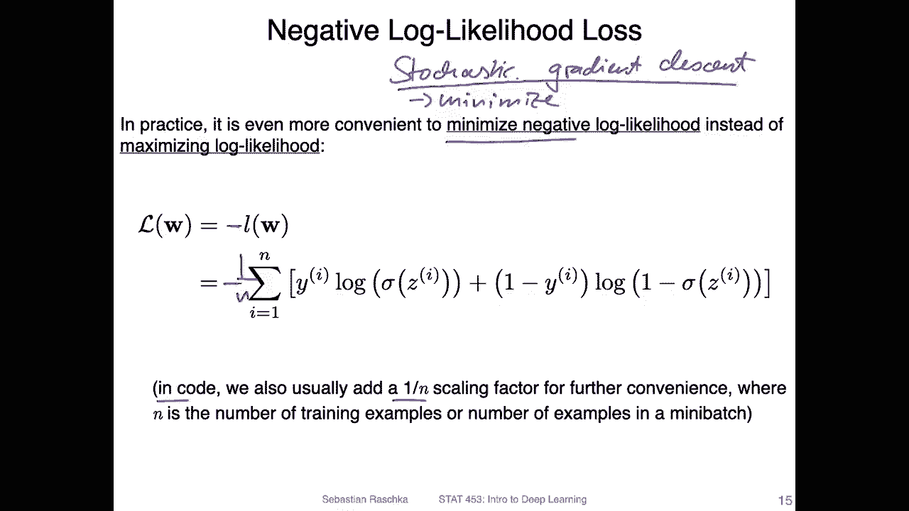

That it makes the training yeah， numerically more stable。Yeah。

 so do just have a little checkpoint here to summarize。 so doing logistic regression by that。

 I mean a training logistic regression。Is actually similar to what we have done before in Adeline in Adeline。

 recall， we minimize the mean squared errors。Here， but yeah。

 the difference is that in logistic regression， we maximize the likelihood。

Because it's numerically more stable instead of maximizing the likelihood。

 we can also maximize the lock likelihood。But likea mentioned。

 the tools that we usually have available are developed for stochastic gradient descent so that we don't have to rewrite those tools。

 we can just yeah turn this maximization problem into a minimization problem so we can minimize the negative look likelihood。

 which is the same as maximizing the look likelihood。So yeah。

 it was probably a lot of information in this short video In the next video。

 I will talk a little bit more about this training and how the loss function actually looks like。

 I think this will probably clarify some yeah thoughts that you might have。

 So if you have some questions right now maybe don't think about it too hard。

 maybe watch the next video and then if you have questions then yeah maybe think about it more。

 but I think the next video could potentially clarify some points。

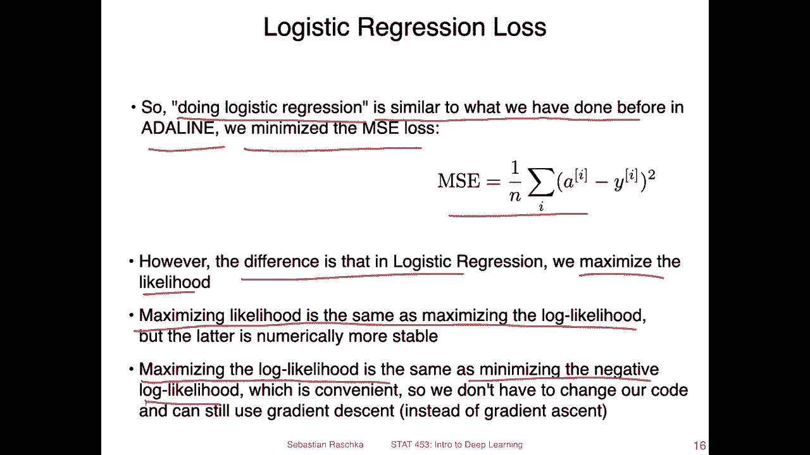