# P53：L8.3- Logistic 回归损失导数和训练 - ShowMeAI - BV1ub4y127jj

Yeah let's now take a look at how we train a logistic regression model。

 by that I really mean now computing the gradients of the loss function with respect to the weight and bias parameters in the logistic regression model so that we can then use gradient descent to update the model and then in a later video we will see how we implement that encode to the actual practical training。

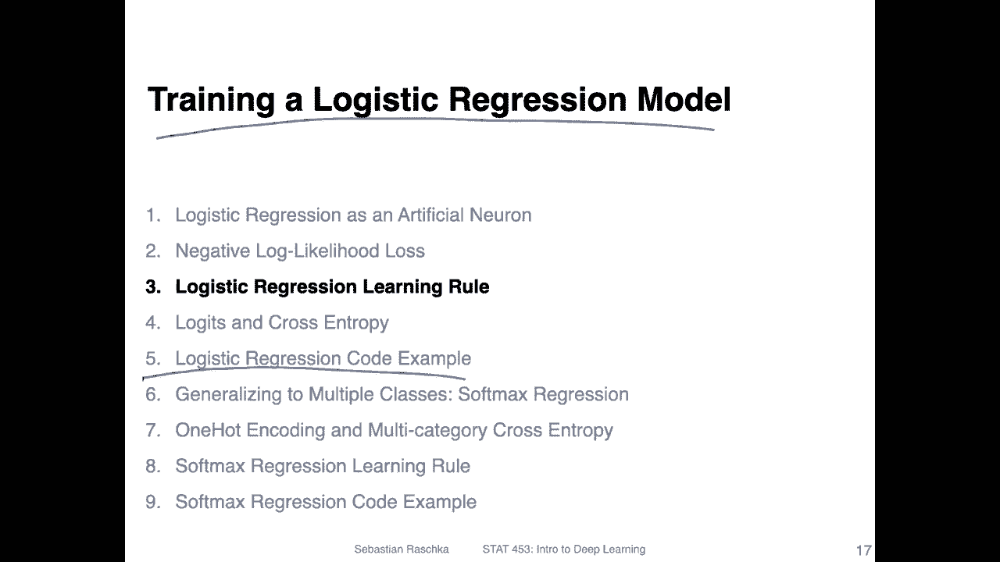

So yeah， let's take a look at the logistic syigmoid function again。 so here on the left hand side。

 that's the logistic syigmoid activation function that we talked about before where we have the net input on the x axis and the output on the y axis。

 it has this syigmoided shape。And you can already see。Just by looking at this function。

 what the gradients might be。 So you can see here the function on the ends it's relatively flat。

 so the gradient should be also very flat like0 around that region and the steepest part is here。

 so this should also be where the gradient is the largest or let's say the partial derivative with respect to the input is the largest。

Now。😔，Yeah， on the left on the right hand side， I was yeah。

 computing the derivative of the sigmoid function with respect to its input。So， yeah， if you， yeah。

 use the simple calculus rules。 So it's how you would compute the derivative of this part， right。

 because you have the derivative of the。What is it called numerator？

Which is E to the power of minus z， the one cancels。

 And then you have this square term in the denominator。And when you solve that。

 I'm not doing it here。 So when you solve that， if you're interested。

 I've done that in the Python machine learning book， I think it's in chapter 12 somewhere。

 but I can also share that if you are really curious about that。

 but you can probably also find examples of on the Internet。 It's quite involved。

 It will take you a few sheets of paper， I guess。But what the result is is this one here on the right hand side that's the derivative of the logistic sigmoid function。

 And you can see it's relatively simple， right， it's just the sigmoid function times one minus the sigmoid function right So that's what I mean。

 it has nice derivatives。 That's actually one little yeah not so nice part about this activation function or it's derivative。

 we will talk about that in a future lecture。 So what's not so nice about it is actually that yeah these these parts here are of the derivative are actually 0。

 So here we don't have any yeah power to update the function。 So if these terms are0。

 this might be a problem when we have multilayer neural networks and then yeah have a chain rule where part of the chain rule is0 because then the whole。

Loss gradient becomes 0。 but this is something we will talk about later。

 So let's now just focus on how this function looks like。 So in the right lower side here。

 I have the derivative of this logistic sigite function。

 And you can see like by S with our intuition here， this part。Where has e is 0。

That's whether gradient is the highest or the partial derivative is the highest。

 You can see the partial derivative is 0。25， the largest value。

 And then for very negative and very positive inputs the derivative goes down to yeah 0。 It's yeah。

 you can see that here where it's also very flat， right。

 So this is how the logistic sigmoid derivative looks like。

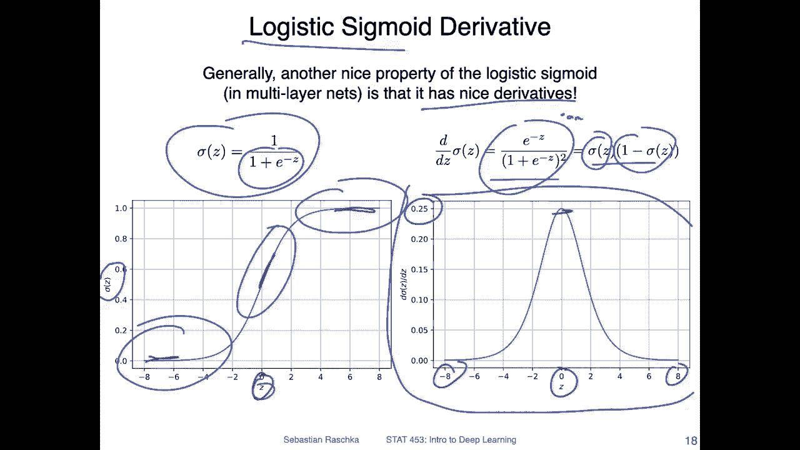

So and here is how the loss function looks like。😔，So， at the bottom。Here。This is， again， my。Negative。

L， likelihood。Loss I talked about in the previous video。 and me， like we talked about before。

 there are two parts， really， of this loss function。

 You can really think of it as the part when the class label is one and the part when the class label is 0。

 So here we really talk about the。True label in the dataset， the label of the training example。

 And this is yeah also the true label。 So these are the true labels provided in the training dataset。

 Again， we only compute， I mean， this might trivial， but just to recap it。

 We only compute the loss function。 during training， not during prediction。

 right when we have a test set or something and do a prediction。 we don't use the loss。

 It's really just to find the weight parameters of the model。

 So we are given these true labels from the training set。So what happens if？The true label is one。

 let's let's consider this scenario of the true label is one。

 We have a one here right on on the bottom and we have one here and here if we have a one here on the right hand side。

Then the whole term here becomes0， and then we have0 times something。 So this whole term cancels。

 So if the true label is one， we really only focus on this part here。If the true label is one。

 then our loss function is minus lock。And I can just write this part as a， the activation。

Its minus lock of the activation。No。If my label is0。Then。

Let me erase this as maybe a little bit messy here。We set minus log of a。

 and for this right hand part， if y is 0， then this part will be 0，0 times something cancels。

Here we have a 0。 So this will be one。 So if。The true label is0， then the loss function is。

Minus lock。1 minus。P。Now let's take a look at the shape of this curves here。If we let me use。

 I should have maybe used yellow minus lock。1 minus a。 So it matches this orange or yellow line here。

 So you can see for the value here of the sigmoid function。

 So this is really like the logistic sigmoid， the class membership probability。

 And recall this one is for。Maybe use maybe the black color。This is for。The class table equals one。

 so the class membership probability for one。Last one。 so this is really like this probability here。

So if what we want so what we want is。This probability to be high if the true label is1。

And we want this probability to be low if the probability is 0。 so。

 but we can also write this as1 minus。Y equal equal0。This is it's easier to think about。嗯。So let's。

 let's take a look at now what happens if this probability here is high。

 So if this whole term is high， this means。If we have a low probability， that this is indeed class 0。

So， if we have a。Term here， we have a low probability for this one。

This one will have the whole term with a1 minus included will have a large probability。

 and you can see。We have a high loss in this case， so if we have a probability for class1。

 so really like the class。One probability。If this is high at one， then we have a very large loss。

 you can see that， so the loss approaches infinity。If we have a high probability。Vice versa。Thelo。

Approaches0 if we have a low probability right， so you can see that。On the closer。

 I get to a low probability。The closer I get to a low probability that the classable is one。

The smaller the loss， because a low probability for class 1 means a high probability for class 0。

 which is what we want。So， here。If the true， if the true label is indeed zero。

 we want a low probability for class 1。So here we have a zero loss。

 if we have a zero probability for class 1 because then the probability for y equals0 will be large because of this relationship here。

The same way now， let's take a look at。Let's use the blue color。

 the case when the class table is one the same way when we have a low probability for class membership one。

We have a high loss it approaches infinity， right？Becauseuse。I mean。

 we will never really have a probability of 0。 We will hopefully perhaps something like。Very。

 very small because otherwise it will crash our lock function。 or yeah。 so we will have。

Lock of minus log of。0， right。 So will be a very small number。 And then this approach oops。

This loss approaches infinity， basically。If we have a low probability and we have a high loss。 sorry。

 we have a high。If we have a high probability， the loss will be very low。 That's what I want to say。

 So the takeaway here is really， that is how our loss function looks like。

 What we want is we want to have a high probability for the right class and a wrong probability。

 like a low probability。For the right class or a high probability for the wrong class。 consequently。

 will result in a very large loss。 And you can see it's like steeply increasing here。

 So that's the takeaway。 So there's a large penalty for making a wrong prediction。

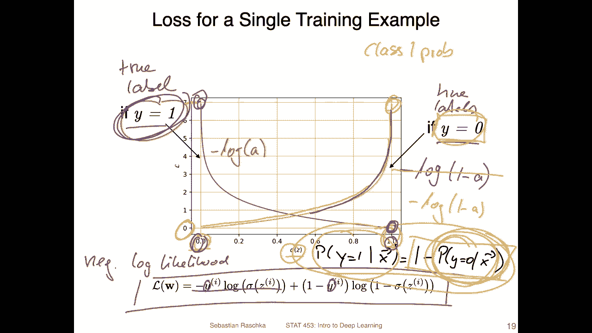

Yeah， how does the learning rule now look like， I mean。

 this is the same gradient descent rule that we used before when we trained a linear regression model or add a line using gradient descent for that one。

 what we needed was the derivative of the loss function。With respect to the weights。

 So that's the partial derivative of the loss function， with respect to the weight。

 And we also compute the partial derivative of the loss function with respect to the bias。

 It's the same concept。So in order to do that， we can compose it into three terms。

 It's the same as we done we have done for adeline and linear regression。

So we compute the derivative of the loss with respect to the output of the activation function。

Then we compute the derivative of the activation function with respect to the input for Adeline。

 this was just one because the activation function was yeah identity function。

And then what we also compute is the derivative of the net input with respect to the weight。

 And that was just x， right， X J similar to Adeline。So here， the bottom。I've written this out。

 So all these three terms。 So this one， by the way， this is yeah， the negative look likelihood。

What loss that we talked about in the previous slide， and if you look at this。

 the only thing that's really different from Adeline is。That these and these values are， of course。

 different because we have a different loss function in a line。We had the ME， right。

 where the derivative。 I saw the ME was， for example。Written like this。

Let's say like this with a one half in front。 And we can also do the one over n， if you like。But。

Okay， so let's do it。 And then。We bring the to up front for the derivativeive， so it's。2 over to n。

 So the two cancels。So， we just have。1 over。And。Times。Yeah， just my my mine。 sorry， it should be。

Y hat minus y， so that would be the derivative of our MSE。Now， of course， we don't have an MSE。

 We have this negative log Ne for which we have the following derivative with respect to the activation function。

With respect to its input and。This one for Adeline。What's one。

And this one is the same because the net input is the same。

Now the only thing we have to do really is to put those together， right。

 we have to just multiply them using the chain rule so it's the same like for Adeline for Adeline just looked simpler。

 but yeah for Adeline we just had one over n。Times way head。That's y times。X J， right？

 So there was one for L line for the logistic one。 It may look more complicated because we have now this term in this term。

 However， theres something nice that's happening。

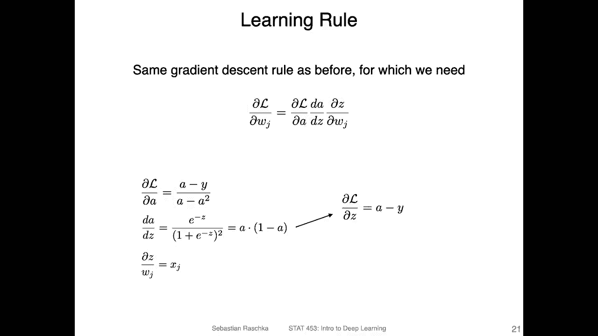

So， we can actually。I'm not sure what I've done here， we can actually simplify this。This part。

 and this part， when we put them together。It simplifies。To this one here。

 So you can work out the math if you like。 But it's yeah a simple， very simple derivative of here。

 So you can see that these cancel each other nicely。 And this is why I said。

That the logistic regression or the sigmoid functions has nice derivatives。That's because。

Things cancel here nicely。And then we just add the x to it and you can see actually this looks exactly like the Adeline learning rule right。

 This looks exactly like the linear regression one right。

 isn't that quite cool So here is just from the previous slides that we had on aline and linear regression So this was the stochastic gradient descent learning rule here where we had the initial weights。

 the follow loop over the training epochs and then the follow loop of the training examples that could also be for mini batchs then we compute the prediction。

😊。

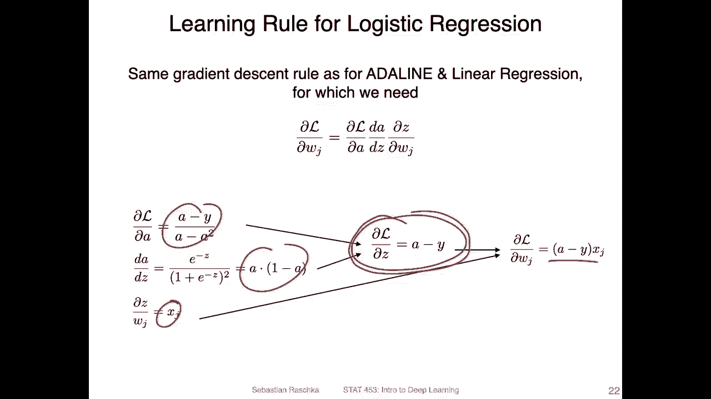

The gradients here。And then we do the update here， and then we have the learning rate etta here。

We can use exactly the same。Rule for logistic regression Also note there was also a discussion on Piazza。

We can actually write， rewrite this because I think I've done it the other way around in code。

 We can actually rewrite this as。Of course， like y hat minus y， right。

' the same thing because with minus and minus。

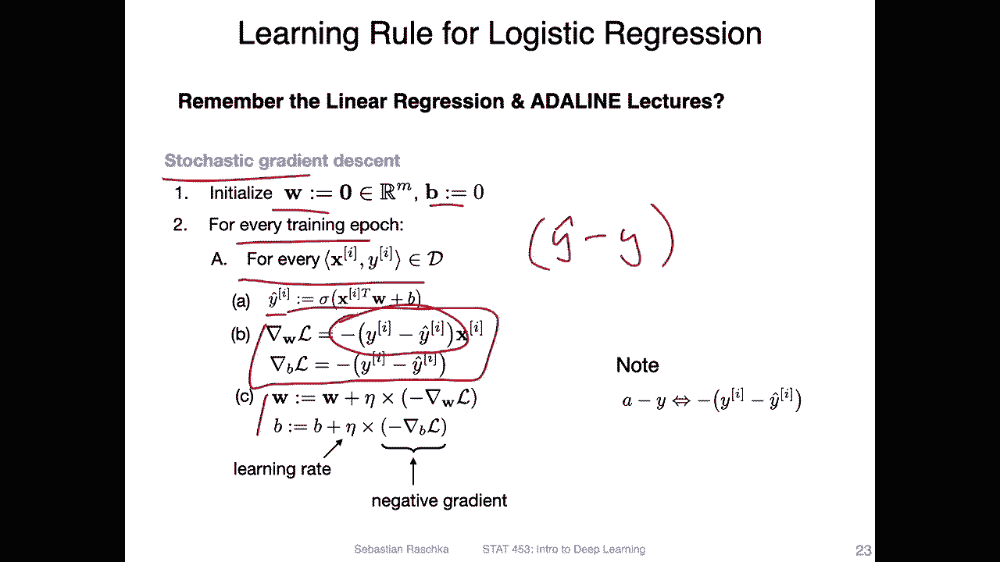

And that is what I had in the previous slide。 If I go back， I have a minus y instead of y minus a。

 So I should say that a is。

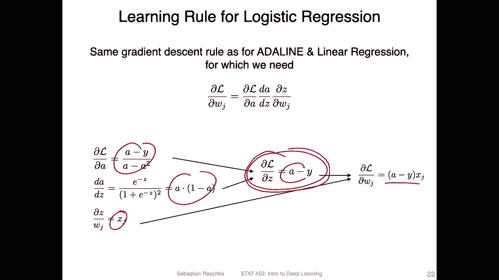

Equal to y head here。 so that's the output of the logistic regression model。所以。😔。

And my head are the same thing here。So let me write just a here。😔，So。But I mean。

 we can also write this， maybe it's if it's more clear。I can't erase more。

Let's maybe you write this as。A minus。Wei。😔，Extreme。And this one should be just。え思います。😔。

So this is exactly the same learning rule as for Analine。

 What's the difference now why is this logistic regression Well the big difference here is that a is computed differently right So a is now computed by。

Non nonlinear function， whereas for linear regression， it was or Adeline。

 it was just computed as the identity function。 So in the case of Adeline or linear regression。

 this was the net input。So， but yeah， that is， again。

 why I said it has nice derivatives because we don't even have to change our learning rule。

 The only thing we have to change is how why head or。Basically， a is computed。

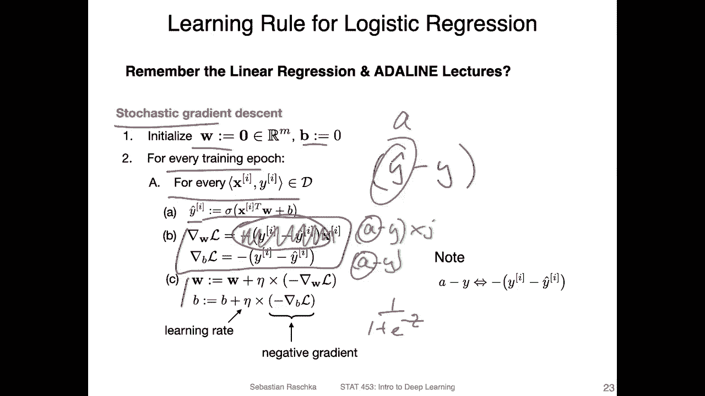

Alright， so few last things about this。 So here we can think of this as the whole computation graph again。

 this is our logistic regression computation graph。 We haven't talked about this output yet right so。

We do the training。Here， so here's。Where we compute the error。 So we have a true。Let's say。😔。

A true labeled。It's called that true level y。That goes in here。And。😔，Here。😔。

What comes out is our A or Y hat。 Let's call it Y hat。

It's actually a probabilityba that it's maybe more clear to call it a。 So we have our a。And oh while。

True why。 And from that one， we compute the negative log likelihood。 Comp the gradients。

 the gradients or the pressure of the loss with respect to each。Weight and also the bias。

 So you am actually not showing the bias I just see。 so it should be technically also a bias unit。

So we compute that one， and then we update the weights and the bias units with that one。

And this right part here this comes after training。 this is just for the prediction。

 So for that one we can use a threshold function similar to Allline。

 so in logistic regression we can use the following threshold function。

Here to compute the real Y hat。 So I should have maybe be more consistent。

 say Y hat is the predicted class label and a is the probability。 class me probability。

 I will be more yeah careful of that when I write the code for the next video anyways。

 so we can say with a threshold function of the probability。So this is a， if this is greater than 0。

5。Then return class label1。And otherwise， return class label 0。 Actually。

 we can do it even more computationally efficient during prediction。

 We can even skip the activation function。 we can just operate with Z。

 We can say if the net input is greater than point or if it's greater than0， then the label is one。

 Otherwise it's 0。 Why is that。

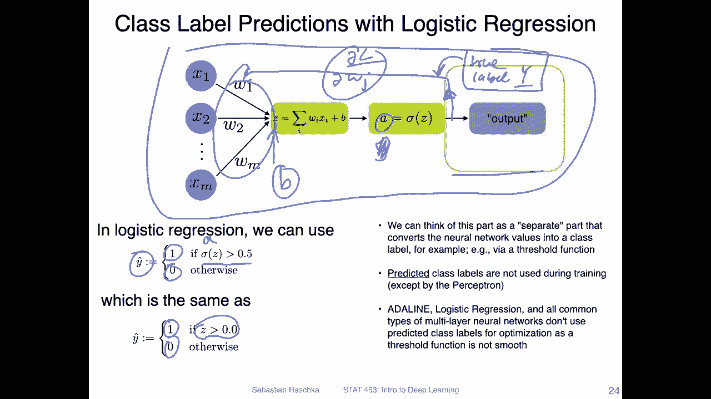

If we take a look at the。Logistic sigmoid function again。 So here that's the net input at 0。So at 0。

 the output is 0。5。 so we know so we， we can say everything above here， above 0。5 is class label。1。

 say Y hat。Class A1 and below here。Y hat S class。0， but we know。If we have the threshold 。5。

 it corresponds to a net input of 0。 so we can also just say if the net input is greater than0 greater than 0。

 then it's class label 1， if it's smaller than 0， then it's class label 0。

 So that's just what I wanted to say about logistic regression。

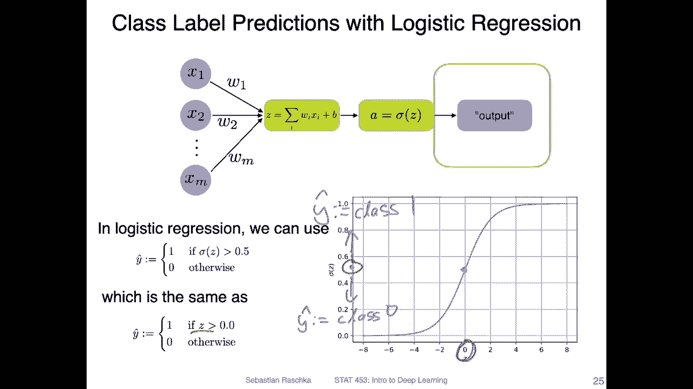

Yeah， in the next video， I want to talk a little bit about the logics and cross entropy。

 These are just two。I would say。Jargon words about or regarding logistic regression logicits and cross entropy。

 I will just briefly discuss what those mean。 And then I will show you logistic regression in a code example。

 And if everything in this video goes a little bit fast and confusing。

 I think the code example will probably clarify that because then we will put everything together。

 we will。Do the forward pass， compute the gradients and update the weights。

 So what I mean is we will really。

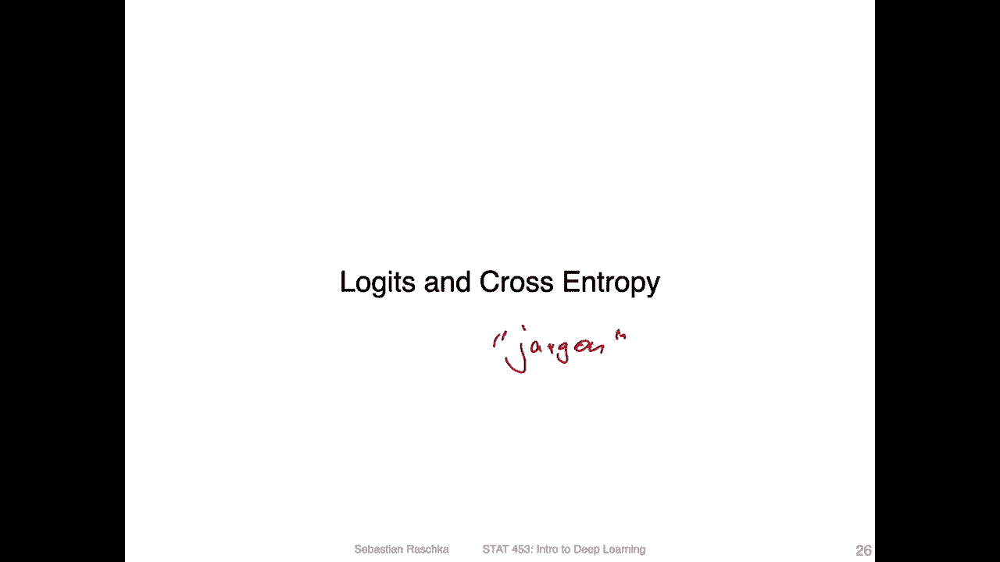

Implement this whole stochastic， gradient， decent learning rule in code and that I hope clarifies everything。

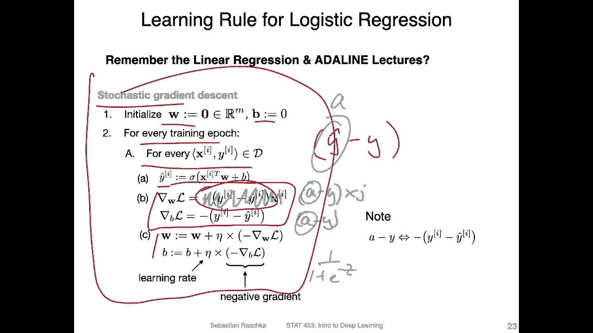