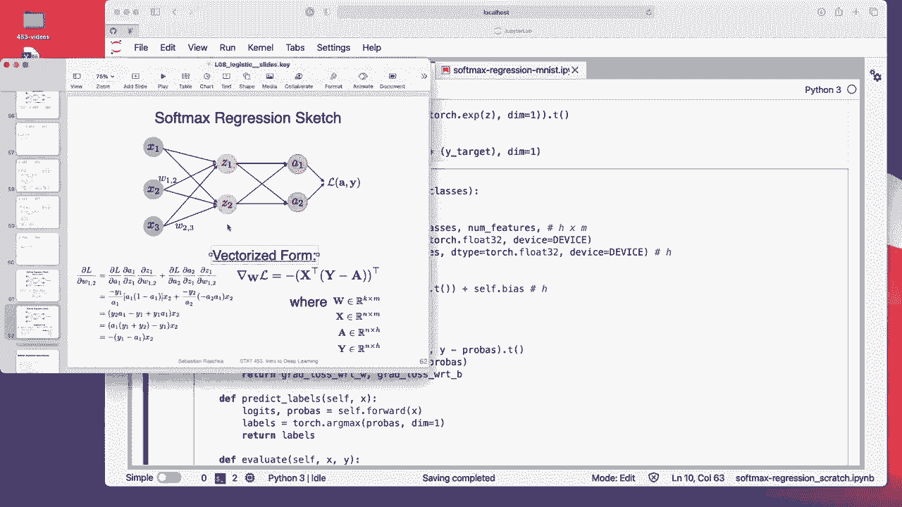
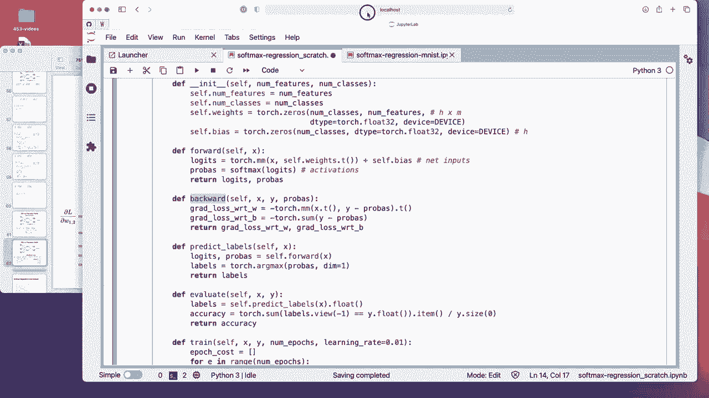
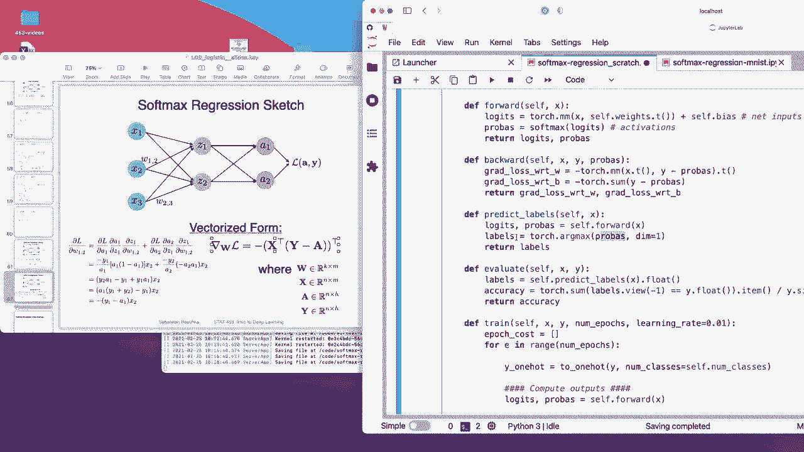
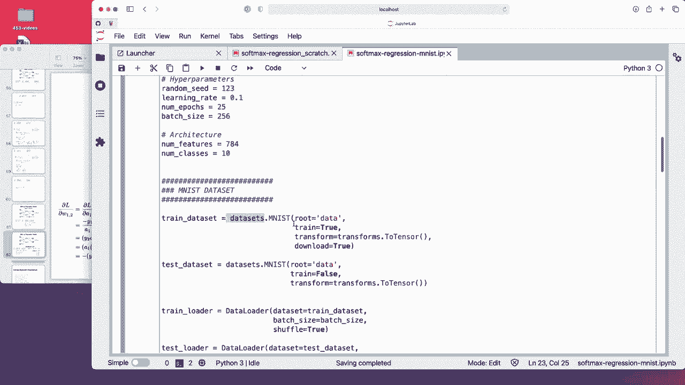
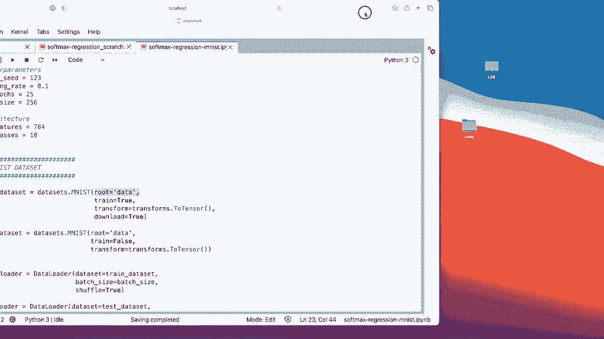
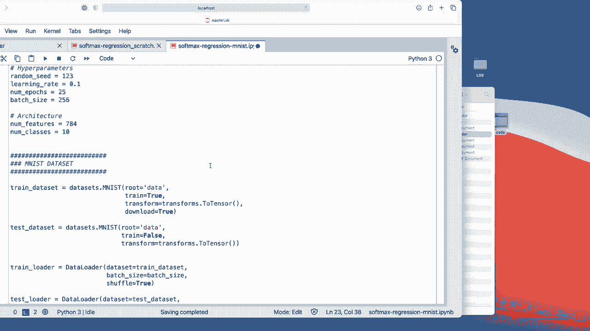
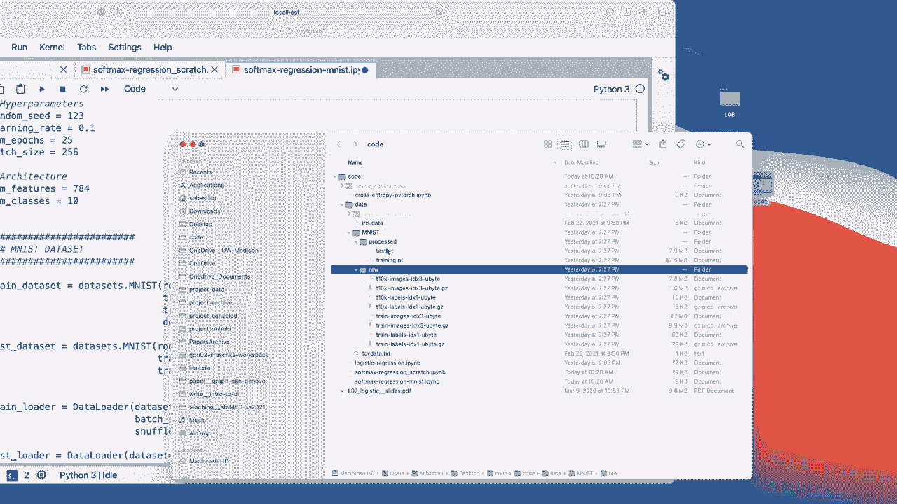
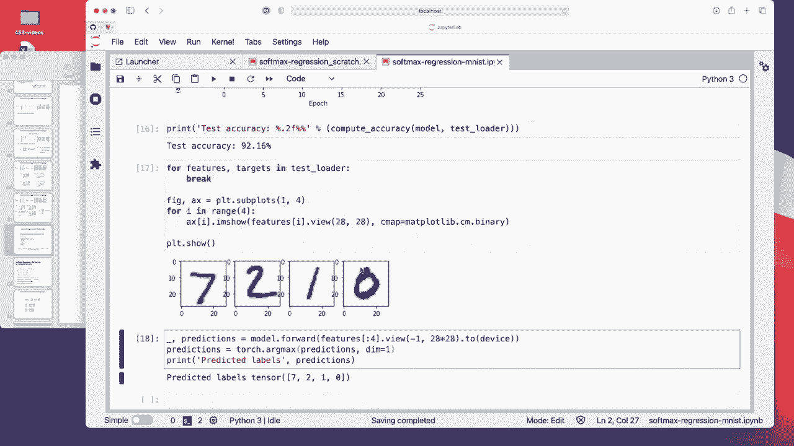

# P60：L8.9- 使用 PyTorch 的 Softmax 回归代码示例 - ShowMeAI - BV1ub4y127jj

As the last video for this lecture， let me now show you a code example implementing the softm regression model from scratch。

 using this vectorized form that I showed you to show you that it indeed works。 Actually。

 I have two code notebooks here。 One is the from scratch implementation using a simpler Irish data set。

 And then I will also， because I mentioned that before in the lecture。

 I will also show you the Mist example because I'm sure you were all waiting for it。 Al right。

 so let's execute the boiler platelate here first。Get it getting it out of the way。 And here。

 So the data loading。There's nothing really new going on。

 It's the same code I used for these toy datasets and the simple iris data I used before。

 so I don't want to really spend too much time on discussing this again。

 It's essentially the same only that this time we are using three classes instead of two。

So we have now these circles， upside down triangles and the squares。

 So left hand side is the training set yeah， and the right hand side is the test set。

In the other notebook I will show you also the Pytorch data loader。

 So that is then usually how we load data because in deep learning we usually don't use CV data sets。

 so we usually don't do this procedure。 We usually yeah use the data lot I will show you in the next。

Could not book how that looks like。Yeah， so。Starting with our low level from scratch implementation。

 computing them gradients manually。 So here I just defined some helper functions。

 one that converts the class label to a one hot format。

 a softmax function and the cross entropy as the loss function know that you don't have to implement any of that when you use Pytorch regularly。

 I mean， the regular version of how people implement code in Pytorch because。Pyarch will。

Do the one hot encoding yeah internally kind of implicitly when we compute the loss。

 I will show you how that would look like later。 And also。

 it has the softm and cross entropy function already implemented。

 so you don't have to worry about this yourself。But yeah I'm just doing it here to really show you that the mathematical concepts from this lecture really translate one to one into code and it actually all works。

So similar to logistic regression， we start with defining a class。 So in the init constructor method。

 we construct the weights and the bias。 So we initialize them here to all zeros and notice that weights in contrast to logistic regression in this such mixed regression context。

 it's now。Matrix， right， So we have the matrix numb classes， numb features。 So is。嗯。We used age。

 I think， for the number of classes， H times m matrix。

 And because we have also two net inputs for the two outputs， we also have now the bias as a vector。

 right， So this is H dimensional vector now。So age is the number of classes。And here。

 here's the forward method。 So the forward method is computing the net inputs。

 So I call them logicts。 But yeah， these are。 you can think of them as the net inputs。 It's just。

 yeah， the。Multulplication between the inputs and the weights plus the biofactor。

 So this would be an age dimensional。Net inputs。 So these are our Z values here。

Then I'm applying the softmax to get the probabilities。 So the probabilities here with that。

 I mean these units， a， A 1 and a2 are activations。 So we can also call them the activations。

 And these are our。And I'm returning both here。 and yeah here that is the interesting part。

 the backward method， that is where we compute our gradients。 and yeah。

 instead of doing everything with a for loop for each weight individually。

 we can actually use the vectorized implementation I showed you and let me move this over。

 I'm implementing it really one to by one here or I mean like literally it's not making any change we use our x transpose。

Times。So with a matrix modification times y minus probability。 So Pro is really the activations here。

So this part is essentially this part and the parentheses and then also the transpose again。

 and this is exactly the same as I'm showing you on the slide。For the bias unit。

 it's a little bit simpler because the derivative doesn't include the X terms， so we can just。

So this is a vector， right， so we can just compute this sum。Alright。Yeah， this is it。

 So here in the predict labels thing， I'm just applying the arcm to get the index of the highest probability in the activations。

 So that's also what I explained to you earlier。

Can actually move that back。Alright， so this is， yeah， all， all that's new here。 really。

 the rest here is the same。 So the evaluate function， that's the same as。

The one for logistic regression and the training is also the same。

 Notice the only difference here for the train function。 What I did is train method。

 What I did is I added this one hot encoding here to get the one hot encoded class tables。But again。

 yeah， we call forward， and we call backward to get the gradients。

 and then we update the weights by applying the negative gradients of minus。

So minus the gradients times the learning rate。 I'm also normalizing by the size of the mini batches because I told you that it's yeah。

 easier to find a good learning rate this way。And here this is just for logging again to show our yeah accuracy and loss during training。

 But yeah， again， this is actually not too complicated， right， I mean。

 if we look at the backward method， it's really just two lines of code here。

 if we use the linear algebra compact vectorized form。Aesha actually mention this is not so trivial。

 of course， to think about what should go in here。 It looks very simple。

 but it might take you hours and hours to think about it。 So personally in the first pass。

 if I would ever implement something from scratch， I would implement it at Python 4 loops and then go to the linear algebra。

Yeah， implementation。 I think that's more maybe easier for me。

 Other people may find it easier to think about in these matrix matrix matrix modification terms。

 I personally， it's not my， my quite a my thing。 I like things simpler。

 even they can be mobile robust， but I'm using this， of course， because it's。More compact。

 It's very information dense。 Lots of things going on here。 It's more compact， though。

 and computationally more efficient。But again， also， I should say in practice。

 no one really implements this by themselves anymore because we can use Pytors auto grant。

 which has some computational facilities to do this automatically。 Alright， so let's train this then。

Alright， so we can see after the first e， we already got a pretty good training accuracy。

 It actually goes down， which is interesting。 But yeah， more interestingly， the。

Cost or the loss here goes also down。 So I think this is really due to noise that the training accuracy goes down。

 It's probably overfitting here。 But yeah， we see the loss goes down。It's our result。

 And let's take a look at。How it looks like。So here we can see the loss goes down。

 maybe training it more would be even better。And then it's compute test accuracy， it's 80%。

Let's take a look at how it looks like。So yeah， I'm using function decision regions。

 We have seen that briefly in 36451。 if you recall that。

 but you don't have to know this or remember this because in practice。

 we will actually never really work with two dimensional data sets。

 So we never really have yeah the luxury of plotting it。 I'm just using a very simple dataset。

 which is why it's possible here。So here's how the decision regions would look like。 So you can see。

Yeah， the softm regression classifier is able to deal with three classes by classifying them relatively well。

 It's not great in this region here。 could have maybe been improved if。

The line would be more like this。 but yeah， it's hard to tell。

 it's actually not a trivial problem for a linear classifier。

A non nonlineara classifier may have an easier time here with in this region。嗯。Now。

 but this is also not the point。 Now let's take a look at how we would implement it using Pytor's module API。

 So the module API makes many things easier， like I said before， so we can use this linear layer。

 which is our yeah net input computation here。 So actually we don't need all of this part in a real application。

I'm just doing this part so that we can compare this implementation to our from scratch implementation because above I also used zeros。

 so if I go up。I initialized the weights to zeros。 So otherwise， if I don't do that。

Here at the bottom。It will have small random numbers。

 The small random numbers are good for multi layer networks， but yet， it would make it hard to。

 of course， compare than this implementation with our above if we have different starting weights。

 so。Yeah， we just add this， but in a real case， you would just run it like this。Alright。

 but we will also talk more about weight initialization in a later lecture。

 I think like I would say maybe in in two weeks， I will have a lecture on how we can initialize weights and what these random weights are。

 And there's also， there are some computational tricks to choosing good weights。All right。Yeah。

 the forward method is now very simple。 We can use the。Oops。The net input computation here。

 via the linear layer， which we defined here。 And then here。

 the softm is our softm activation function。 We use that from Pytorch now。 So F is from Pytch。

 I think I。Iported it at the very top。 Let me steam。Yeah， so here this is the torch functional API。

 So an N stands for neural network， and this is the functional API instead of typing it all the time。

 instead of writing， let's say this dot。Softmax and do the same for other functions。

 People usually implement the function API S F just to make it shorter。

 So you only have to type F softm， basically。So that's just a convention when you work with Pythal code。

Okay。So yeah， and that is basically it。 we are using the stochastic gradientding descent optr here。

 optimizing the parameters of that model。And yeah， this is all。 all there is to it， really。

When you use patrony。And training it now， you can see test accuracy is also 80%。 And actually。

 if you would scroll up， you look at this decision region plot and。This one。

 it looks almost identical。 S some slight numerical difference。 If I think if you look at。

These values 0。558 and minus0。12。LetMe just copy them， maybe。Theres some slide。Maybe not great。

 really even。 Yeah， this， this is one iss a little bit different。 You can see。

 but it's only like three digits after the decimal point。 This is just a numerical rounding error。

 I would say， because we implemented lots of things from scratch， like softm and。

The cross entropy function and things like that。 And we have the vanilla implementations。

 There are also some numerically more stable implementations of softmax by adding or multiplying the nominator denominator and numerator by C So adding lock C look constant to the exponent that would make it more stable。

 but then it would change the numbers slightly think these differences are because of that。 Yeah。

 of course， in practice you don't want to implement softmax and cross entropy yourself because it's numerically not as stable as not as fast as the implementations that are already provided。

 but yeah， overall， we get exactly the same results。 I mean， with small rounding differences。Now。

 this is how we do Som regression and Pythrch。 Let's now take a look at the same thing for the Mnes data set。

 because yeah， I already showed you the Mnes data set in the lecture。 And so just for completeness。

 we will actually be working with this more when we talk about multilay perceptioncepts in the extension。

So what's new now is I'm using a data loader and this is usually how we load images in Pytorch on other types of data。

 So here are just some settings for my model and here the Ms data is already provided in a library let me screw up again in a library called Torch vision it comes with number of datasets So if you install Pytorch it will also if you use the installer via the website it will automatically install Torch vision so you don't have to install it separately it usually is included in the command that you executed when you install Pythtorch。

So。We use this em data set from Torch vision from the dataset sets sub moduleule。

 This is just specifying where to store the data。 so it will create。

If I go here， it will create a data folder in next to my notebook here， because I call it data。

 but you can actually change this to whatever you can change it to desktop。

Data or something like that really doesn't matter just where it keeps the data so temporarily。

 So if you go here inside， you will see it will。

Keep。😔，Copy of that。

对头。All right。Then it has a test test and a training set。 So train true test。 this is for testing。

 if you say train faults。 I will actually show you。

 it's a bit unfortunate that Mnes doesn't have a validation split。

 but I will show you in the multi layer perceptioncept lectures how we also can create a validation split for that one。

 This one is kind of required its。Because Mnes is images and they come in a。

 I think it's a P I L Python imaging library format。 and you want to convert them to Pyth ten source。

 so。This one is converting the yeah image representation in Python to a Pythage tensor representation。

 but we will also see later we can use other data augmentation here like randomly flipping or cropping images。

 so we will talk about this also more。When we talk about convolution networks， also。

 I should say that2 tensor normalizes， it normalizes。The pixels to 0，1 range。

 So it's dividing them by 255。So I should mention that。

 So we don't have to do our data normalization ourselves。 Of course。

 we could actually do something better。 We could standardize them for colour images。

 Sometimes people standardize using the mean。And the start deviations from Imnet。

We could technically also do that for colour images for here。

 something like endlessnes it doesn't matter at all， to be honest。

 there's probably no difference in the performance of the model because it's a very simple optimization task here with stochastic gradient descent。

 Allright， so。This is defining the training data set， this is defining the test dataset set。

 the difference is really that we set train fault and here to true。

 we only need to download at once right so I don't have a download here。Then， we。Using the data。

 we define data load。 So here。I am defining a data lot for the training set。 I can set my batch size。

 I set it here above。 That's my mini batch size。 I set it to 256。

And then whether we want to shuffle or not。 So this is shuffling before each epoch。

 shuffling the data set。 notice that。嗯。Here， I'm not shuffling the test set because it doesn't really matter。

 I'm loading the test set in batches。 It's also not really necessary because we don't do any training and stochastic grain incent on the test set。

 But in， let's say if we work with real image data sets like imagenet。

 the test set can be quite large and it might not fit into memory。 So we can also load it one by one。

 Basically， that's what I'm doing here。Here just for completeness。

 I'm this is more like for verifying that everything looks good。

So here I'm just having a follow loop over。The images and labels in the training order just to make sure everything looks okay。

And you can see it's loading the images in this。N， H， sorry， N C， H W format the patch size。

 the number of colour channels。 we only have one colour channel because M this is black and white。

 And then we have the height and the width here。 and the labels， of course。

 are a vector because yeah， thiss just the numbers。And I should also tell you， okay。

These labels are not one hot encoded。So you can see that they are just the numbers， the class labels。

 the 1 class labels。It's not necessary to1 hot encode them because Pytoch does it automatically when we call the cross entropy loss。

 Allright， so here is now my implementation。 This is the same as in in this from scratch here。

 So there's nothing really different。Same thing。Yeah， so also notice。 So yeah， the accuracy。

 I'm computing it using a for loop over the data load。I don't have to go through this。

 I think this is something you could copy and paste if you need it。嗯。Yeah。

 so the interesting part what I wanted to show you is because I don't want to make this video too long I mean I could discuss everything。

 but if you have questions， maybe ask on Piazza， we can discuss this more。

 I don't want to spend too much time on things that are not that important right now。Yeah。

 so the important parts are here that we are concatetnating。

So that goes back to what I've showed you。Here， so this would be how I am。

Image looks like it's 3D tensor， one image is a 3D tensor 28 by 28。 and then the color dimension。

 So if you don't think of the color dimension， it would be a matrix， a 28 by 28 matrix。

 but we need a feature vector is input。 So we would concatennate it to a very long vector a 28 times 28。

 So 784 dimensional vector。 So that's what I'm doing here。 So I'm。Concatenating it to a vector。

 I can maybe show you。that would it look like for one given。Let's say， we take。One image。

So this would be the one colour channel and 28 by 28。 Actually， you can also， I mean， okay。It's fine。

 I think so view。min-1。28。😔，To8。 so you can see now it's a one long vector basically。So in this case。

 I think it's a matrix because we have the first dimension， but。So about the same thing applies。

 so here。Yeah， we do that for the。So actually， this would be for the batch dimension one more time。

 Sorry， images。So this should be 25， 256。Times。7，84 dimensional。Matrix。

So this is for the is or basically， this is like how our design matrix looks like it's then。

And n times。M dimensional matrix now where M is the features， and is the batches。It got rid of。

 notice it got rid of the color channel here。 there is no colour channel because we only define two a's。

If we do it like this， it would have a colour channel。 but yeah， we don't want a colour channel here。

Yeah， and then we call our model， known as when we use Pythrch。

 we don't use dot forward because it's actually better to just call it like like this。

 it will internally call forward， but it will do some extra checks before it calls forward。

 as I explained in an earlier lecture。And now the interesting part is how we compute the cross entropy cost or lost。

Here。And notice that is important that it uses the logicts as input。

So it's not using the probabilities。 It's using the logics。

 This was what I explained in the in a previous video。 This is like the slightly confusing part。

 I plain explained it in， in this。Other previous video。

 So we have to pay attention that we provide the los and not the probabilities here。Yeah。

 and then we zero the gradients to the backward。We are just， yeah。Averaging the costs， here。

Don't know why I did that。Don't need that。 Oh， I okay， I see。I have。

I compute the average cost over the epoch， I see。Yeah， so then I'm plotting it。Okay。

 I need to execute this part。So this cost is the average cost per epoch。

I could technically compute the cost by。Calling forward on doing。哦。This one for the whole data set。

But it would be more work， right。 So you would have to load the whole data set。

 So I'm just computing the average。It might take a while。It's not too bad， though， it's like。Poin。嗯。

int4 minute，04 minutes。Per。😔，那不。😔，It's not even。 I don't know if these numbers make sense。

 One that makes maybe sense。Alright， so。Now， yeah， this is how the loss looks like。

 You can see it goes down as expected。 Let's take a quick look at test accuracy。92。

16 iss actually pretty good， right。 I mean given that this is an image data set and we only have a linear classifier。

 we don't even use a neural network， I mean a multilayer neural network。

 we already get a pretty good performance。 And personally。

 I also recommend you when you work on classification tasks。

 always to run also logistic regression classifier or softm regression classifier as a baseline just to get a feeling of how difficult the classification problem is。

 right So if you train let's say convolutional network and you've got only 94% with a。

Convolutional network， you would say， okay， this is such a complicated convolutional network model。

 Why does it only get 94% when I get already 92% with logistic regression。

 Maybe my model with 94% isn't that good， after all。

So it's always a good thing to run also logistic regression as a baseline。Yeah。

 here's just an example。Learning three random images from the data，7，2，1， and 0。

 And then here I'm doing my predictions。So calling this one on the feature vectors and then the arc max next to get the class labels。

 right， because。This one would give us just the probabilities。

You can see so we are taking the arc mix。 So for the first one， let's take a look。

Should be this one should be the highest0，1，2，3，4，5，6，7。

This is the highest it actually yeah yeah should be the highest one。 So in this way。

 we compute the class tables here just to show that these are indeed correct， alright， so。With that。

 yeah， this is all I think I have for this from implementation。 and then in the next lecture。

 I will talk about multi layer perceptionceptrons。

