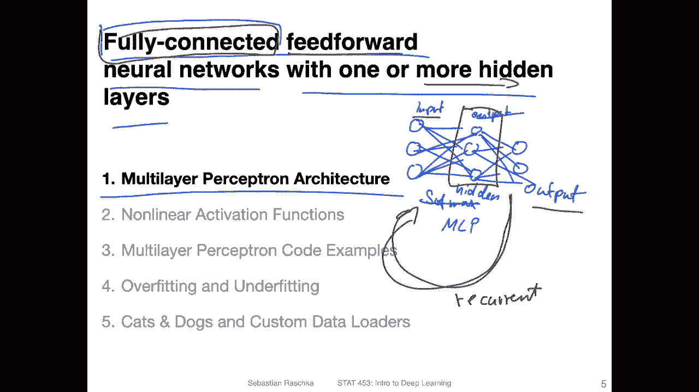
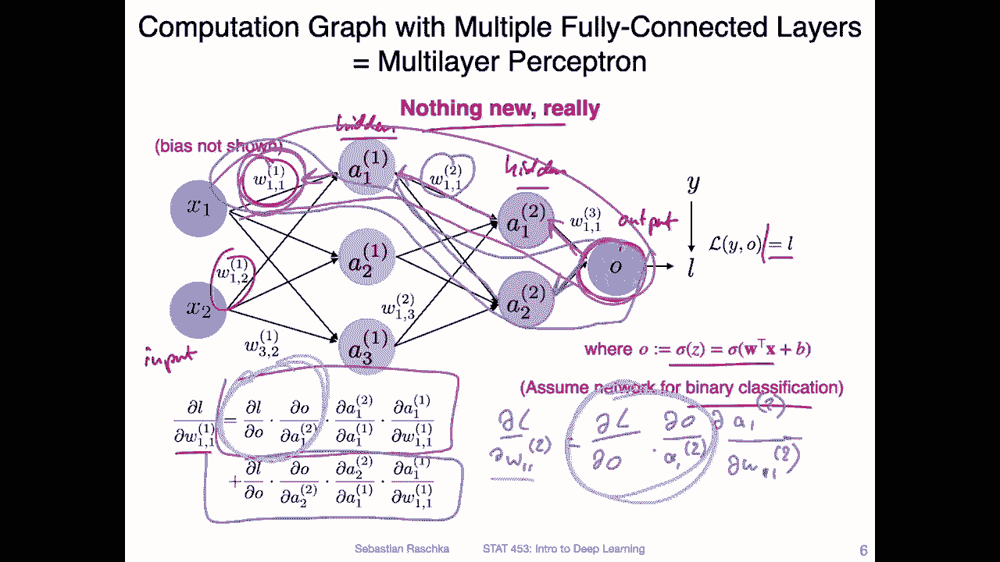
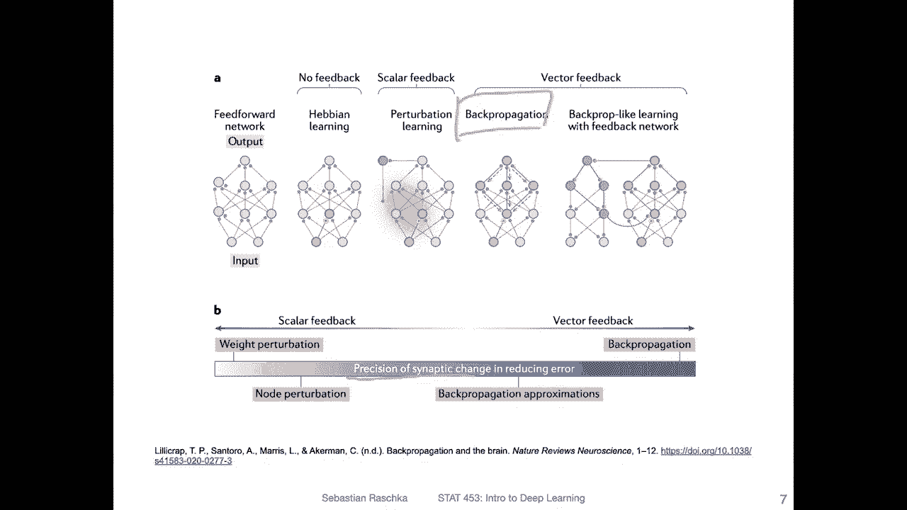
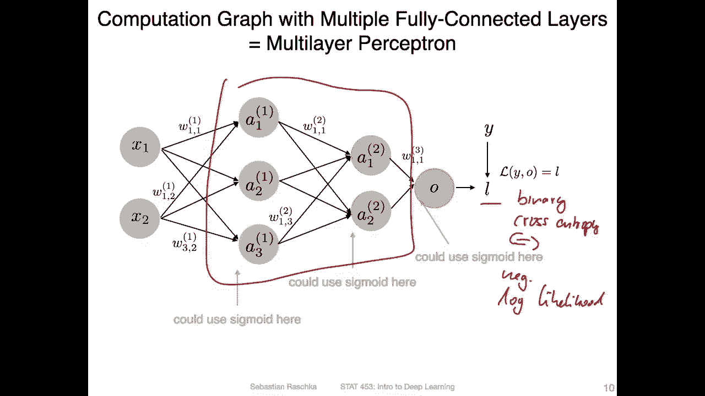
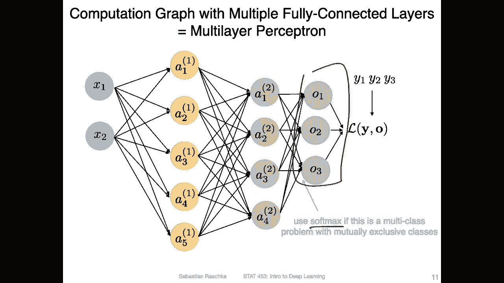
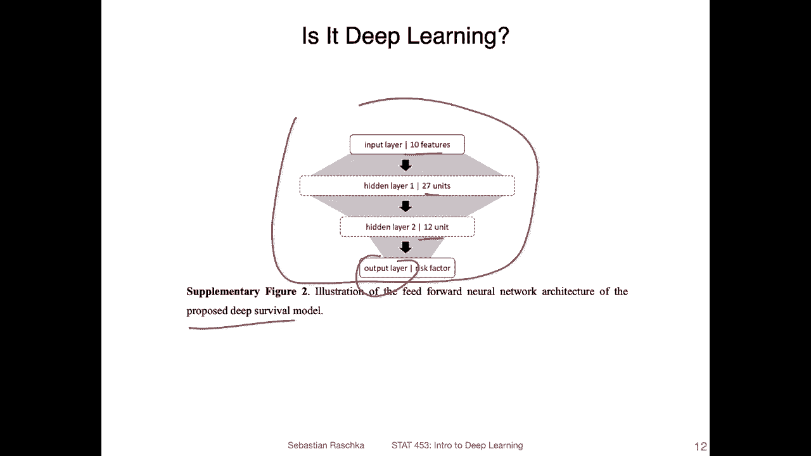
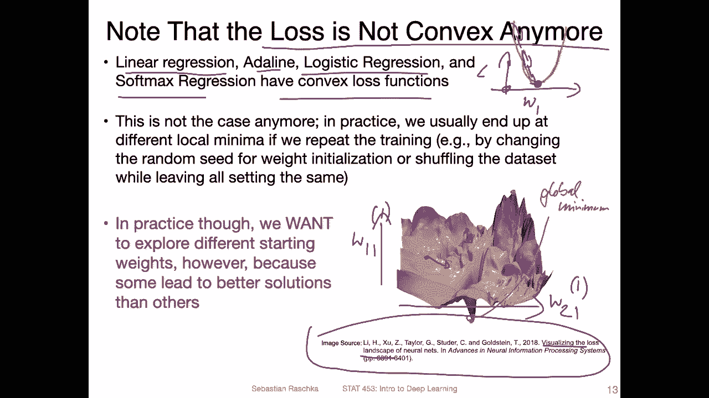
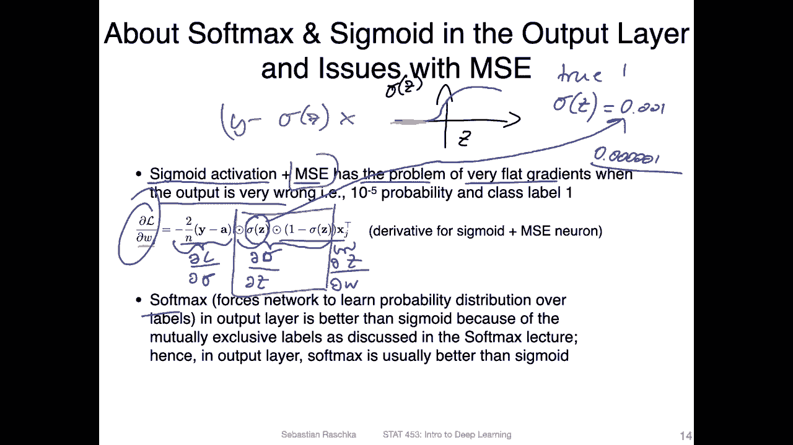
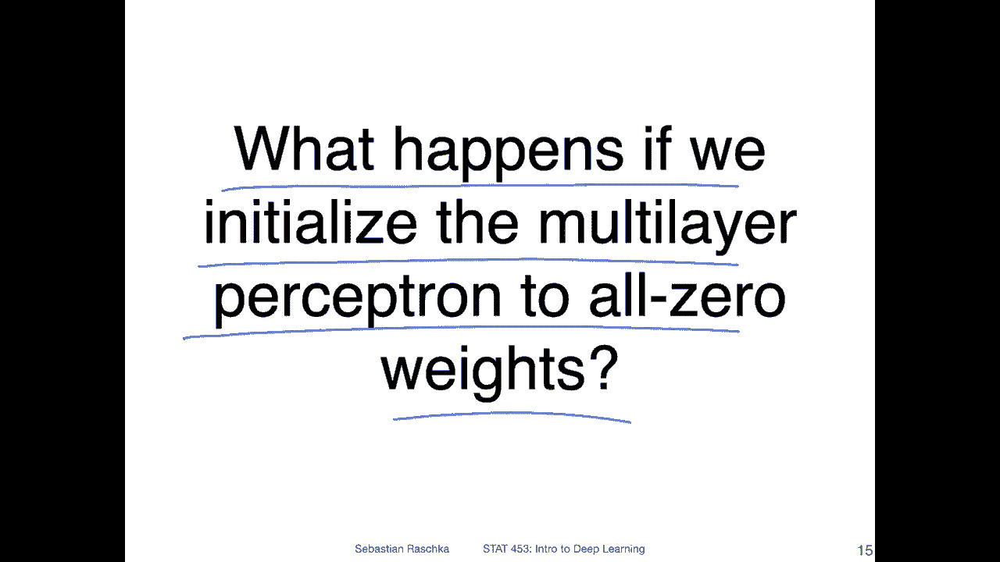
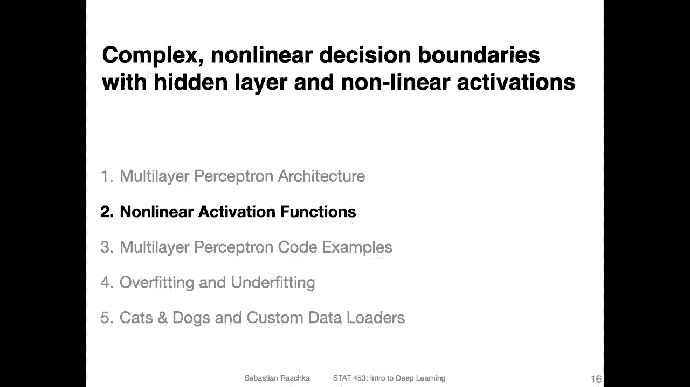

# P63：L9.1- 多层感知器结构 - ShowMeAI - BV1ub4y127jj

Yeah， now it's finally time that we talk about multi layer perceptioncepts。

 So what is a multi layer perceptionceptron。 So multi layer perceptioncepts are fully connected。

 feet forward neural networks with one or more hidden layers。

 So what does the fully connected mean here。 So fully connected means that if you have a given layer。

 each unit in that layer is connected to。All the other units in the next layer。 So， for instance。

If you have a layer， let's say like this， an input layer。 And then you have another layer。

 let's say with only one unit， then。Each input is connected to that one。

 It's actually similar to logistic regression in that way。 So in a logistic regression context。

 we also had yeah， everything in the input layout being connected to the next layer。

 Or if we had multiple outputs， we had also。This setup。 And this is actually similar to a， yeah。

 multi layer perceptron， except。Where in soft mixed regression。We had an input。And an output layer。

LetMake maybe one more。Now， what we have is we have。A hidden layer。

 So that means there is another output layer， for example， like that。

 So instead of being soft mixed regression， we have no multi perceptron。

 And in the minimal in the middle here， we have a hidden layer。

 And now this one becomes a new output layer。 So again， everything is connected here。

 So that's why it's called fully connected。Yeah， and the main difference between。

A multiceptron and soft mixed regression is that we have this hidden layer here。Also。

 we use a learning algorithm called be propagation。

 which is actually yeah just gradient descent using the chain rule。

 it's essentially very similar to what we have done in the last lecture when we talked about softm regression。

Except again， that we have no hidden layer。Alright， so yeah， another term here is feed forward。

 So feed forward refers to the fact that we go into one direction from。

 yeah from left to right in this particular drawing。 But essentially from the input to the output。

 So that means feed forward。 later， we will see other networks that are not feed forward。

 for example， there are recurrent neural networks where we have。Recurrent。Layer where yeah。

 you go essentially backwards as a time dimension。I should also say。

Not all networks are fully connected。So later in this course。

 we will also see convolutional networks which are not fully connected。Alright， but yeah， Im。

I'm way ahead of my slides here。 I just see I explained almost everything already because yeah。

 I made actually some nice figures。 So let's take a look at these figures。

So here I'm showing you a multi layer perceptron with two hidden layers。

 So we have on the left hand side， the input layer， then a hidden layer。Another hidden there。

 and then the output。Layer， and because we only have one output unit similar to logistic regression and different from softm regression。

 this one would be。A binary classification problem。 And so for the output。

 we can actually use a sigmoid function similar to yeah logistic regression。Other than that。

 there is nothing really new here。 I mean， this is just like softm regression。

 except that we have now these hidden layers， right， So in that way。

 there's actually not that much to explain because， yeah。

 we have also the same way these weights connecting each unit between the layers。

And when we then compute the partial derivatives for yeah training this network。

 we can also use the chain rule， the multivariable chain rule。 So for instance。

 if we would want to compute the derivative， the partial derivative of this loss function or the loss here with respect of with respect to one of the weights。

Then yeah， we would also use the chain rule to go backwards and then the multivariable chain rule to combine the output from different units。

 So what I mean is if we have the output here。Then we go backward。 So we are interested。 Again。

 we are interested in this weight W 11。Just as an example。 So I'm just highlighting all the paths。

 So there's one path that goes here。 You can see it here， right， And the other path is this one here。

So in in purple， what I'm showing you is this one here at the top。And then， in。

Here for the multiparable channel， this is。This path here。 So there are two paths， actually。Yeah。

 and， and that is actually it。 That's how we would train or update this weight。

 Notice that there are， of course， multiple weights and actually multiple weight layers。

So here we have， for example， the weight in the second layer。 We will train those also， of course。

 So in this case， yeah， the rule would be a little bit of different。 So in this case。

 let me just take a look。 We have。Let me write this down， maybe so we have the partial derivative。

With respect to this one， which should be。Los with respect to the output， and then。

The output with respect tool。The one。2， right， then a1。Torue， with respect to。We were saying1，1，2。😔。

So in this way， you can see this path here is actually。Well， let's see。This。

 this party is actually shared。With。😔，This path here， right。

 So actually you can reuse if you compute this one first， you can reuse this part。

In order to compute this part for back propagating further。 So also。

 when you implement this in practice， yeah， there are some tricks to avoid recomputing things or gradients here。

 But fundamentally， that's the same concept that applied to soft mixed regression。

 So here really what I wanted to say there' is nothing new， really。

Yeah， here's a figure we looked at earlier in this course。

 these different types of learning algorithms and this algorithm that we use for training the weights and multi perceptioncept that I just showed you。

Based on the partial derivatives or gradients that's yeah called back propagation。

 that's one type of learning。 And yet it remains still as the most precise learning algorithm。

 So there was this paper in 2020 where the authors proposed an an alternative algorithm that may be more similar to what's going on in the brain。

 but the back propagation algorithm is still the most efficient one for training neural networks。

So now let's talk a little bit about the nomenclature。 So here that's the same figure as before。

 And notice that I'm using these round。Bracktets or parentheses here。

 So before when we had something like this。With a square brackets。

 this must usually referring to the。First activation for the I。Training。😔，Example。Here。

 the round parentheses， they don't。 or this doesn't mean this is the first training example。

 This really means here the first hidden layer。 So the round braces here。 sorry。

 the parentheses refer to the。Hidden。Layer index。So here we have two hidden layers。

 So you can see this is the first hidden layer。 And then here we have the second hidden layer。

 And I could also， instead of writing output here， I could also write activation。With a。

Prenhees here 3， because the way the output is computed。

 if we use a sigmoid function is the same way as these activations are computed。 So， for example。

 if you have one activation here。Let's say the one in the first。Hidden there。

 this is really computed as the activation。Based on， let's say， some net input Z。

 where Z is computed as yeah， the net input。Here， so I'm not showing， I should say。

 I'm not showing the biases so that should also。Be a bias。For each。Actation。

So I was not drawing it because the figure was already so crowded。 See。

 it's a little bit messy So let me remove this again。

 but there should be a bias also for each activation。Okay。And this is。For this unit here。

 But now if we take a look at this one。So for this one， we would compute it the same way。

Except now that we， instead of， so we still have Z。 So let's just use the same matter Z。

 But Z is now not， of course， involving the x directly。 It's based on。The previous layer activations。

 So in this case， you can think of it as the previous layer。Activations。So。W transpose。Plus B。

 I'm not using indices here for the weights， but this would be， of course。

 these would be the weights from the previous layers respectively。

 So here I was just focusing on what the inputs are for this。Second one here。

 we have the activations of the previous layer， which act as the inputs to that layer。

 if that makes sense so。For this layer， we have the excess S input。And for this layer。

 we have the activations from the previous layers input。

Actually the main point here I also wanted to make is how we count the layers so it's quite common I've seen that couple of times referring to the input layer as the first layer in the network then the first hidden layer is the layer number two the second hidden layer is the layer number three and the output layer would be layer number4 we could do that but then yeah it would be a little bit weird when we talk about logistic regression because then logistic regression is a two layer network which is kind of weird because usually you think or we think of logistic regression as a single layer neural network。

So what I mean is。Yeah， if we count like that， if we then。Remove these hidden layers。

 We have an input layer and an output layer， like in logistic regression。

 This would be a two layer network。 And that is a little bit weird。 So in this way， we usually use。

The in DC is a little bit differently。 So this is like the input layer sometimes also called the zeroth layer or。

Just input layer and the first hidden layer is the first layer。

 the second hidden layer is the second layer and the output layer in this case would be the third layer。

 So that's a little bit more intuitive if we think of logistic regression as single layer neural networks。

So yeah， like I said， we can use the sigmoid， the logistic sigmoid function here everywhere as activation function。

So。Then it would be really like logistic regression。

 except that we have these hidden layers in between。

 But the loss function could also be the negative look likelihood that we talked about or。

We can also call it binary。Cross entropy。Which is here equivalent to。The negative。Look。Likelihood。

 actually for classification in neural networks， that's also the most common loss function。

And that is， again， why we spend so much time on logistic regression and softm regression。

 Because fundamentally， things are very similar。

Yeah， and also like in softm regression， if we have multiple output units。

Instead of using sigmoid functions here， we can use the softmax function。 But yeah。

 I don't have to explain how softmax works again。 if you forgot how softmax works， then yeah。

 we have lecture 8。 So you the nice thing about lecture recordings is that you can revisit lecture 8。

Yeah now an interesting question is is this really deep learning I mean multilayer perceptrons have been around maybe for 50 years already。

 so is this really deep learning if we have the same multilayer perceptron that has been around for such a long time and yeah how is it different from a neural network onces the difference？

Yeah， now the interesting question is， is this really deep learning， I mean。

 multi layerer perceptrons have been around， I would say， for 50 years， approximately so。Yeah。

 can we really call that multi layerer perceptionceptron we just saw deep learning。

 So according to the recent trends， when I look at recent papers。

 it's more and more common to call these multi layerer perceptrons deep learning。

So here is just a figure I saw recently in a paper I don't want to reference this paper in this case because I think I don't know I don't want to blame anyone for calling this deep that I want to call out certain people here。

 but here in this paper I read for example there was this figure of a multilayer perceptron where there were only 10 inputs very small numbers of hidden units and then one output。

So output unit。 So here they call it yeah， deep learning and。

Essentially proposed this deep survival model。 So yeah， like I said。

 it's more and more common to call these multilayer perceptrons deep learning。

 traditionally when the term deep learning was coined， like I mentioned in the introductory lectures。

 it usually you referred to the yeah feature learning by using certain tricks that are a little bit about beyond the regular multilayer perceptrons。

 where we had certain algorithmic improvements of neural networks that make the learning more efficient。

 But yeah， nowadays。A multi layer perceptron， I would say， is already deep learning， in a sense。

Yeah， another very important point is that now in a multilayer perceptron the loss is not convex anymore。

 so linear regression， adeline， logistic regression and soft mix regression we had convex loss function so for example。

 for linear regression if we recap or the loss look like let's say with respect to one weight because it's easier to draw。

 it would be something like this bowel shape here。Where let's say we start with an arbitrary weight value here。

 or let's say we start with weight 0 here。 So the loss would be。So very high when we start。

 and then we go down with gradient descent till we reach this global minimum。Yeah， now。

 in the case of multi layer perceptronance， it's not that simple anymore。

 we don't have such a nice convex loss function where there's only a path downward to the global minimum。

So in fact， these are highly non convex lost surfaces now。

 so I found a nice paper that is about visualizing the lost landscapes of neural networks。

 So here this is for if you have or consider two weights in a neural network。

 So if we have let's say。W1 and W 2。Let's say W 1。1 W2 1。 And let's say in the first hidden layer。

 because there are many， many weights in the neural network。 but you can see。

That this loss is highly complex。 There are many， many local minima going on here。 And here。

 I think that should be the global。Minimum。So if we find the values of the weights that we are here at this point for this loss。

 So here， the loss value， let's say。The higher。 So this is the maximum， the higher， the larger。

 the loss and the lower， the lower the loss。 So if we are at this global minimum here。

 then we would have minimized the loss function with respect to the weights， however。

Depending on what our starting weights are。 So technique typically in the context of neural network training。

 we start with small random weights。 So one ray reason is。

Why we start with small random weights is that we want to try different configurations。So。

 for example， if we have configuration。Of weights we may start here。 We could start here or here。

 depending on what our initial weights are。 And it's not uncommon that we get stuck in a local minimum。

 So we reach one of these local minima， and then the algorithm gets stuck。 in practice。

 it's actually。Almost， I would say impossible to find the global minimum。

 So you never know whether you reach the global minimum。

 Usually common knowledge is that you will end up in some of the local minima。 And it's not uncommon。

 because of that to start the net neural network training multiple times worth different random seats。

 So sometimes you have a better random seat for a given network than other times。

 So sometimes you will notice that you will have a better performance just by changing the random seat。

 So in papers， it's that also not uncommon to， let's say， run a network training 5 or 10 times。

 then take maybe the best three runs and then average over them and report the standard deviation and things like that。

Yeah， so we deal now with this highly non convex lost surface and in the next couple of lectures we will also talk about tricks for learning rate choosing learning rates。

 choosing initial weights and choosing optimization algorithms that can help jumping out of these local minima once we get stuck so there are certain yeah tricks and improvements to make the learning more efficient compared to the traditional stochastic gradient descent version。

Yeah， and beyond choosing good starting weights and good learning rates and good optimizers。

 it's also very important to choose good activation functions and combinations of activation and loss functions。

So yeah here， I'm just want to illustrate a problem with certain activation and loss functions。

 and in the next videos， we will talk about， let's say， alternative activation functions。

 which are nowadays a little bit better for training multi layer perceptrons。

 So here for this example， consider we have a logistic sigma activation and the mean squared error function loss function。

 So。One problem we may encounter is that we may end up with very flat gradients。

And especially then if the output is very wrong。 But if you think about it。

 if we make a very wrong prediction， we want to actually have large gradients because then we can update the weights more if the gradients are very flat。

 then there's almost zero yeah weight update。 and then we can't fix our problem or the wrong prediction。

 So recall how the logistic sigmoid function looks like。So， if we have a。

Logistic Sigoid function like this with a net input。Then。Recall it was like this S shaped function。

 And let's say。The true class label。Is one。But we return a very low probability， like， let's say。

 oops。The probability class membership probability is 0。001 or something like that。 right。

 So if you look at this。A low， very negative net input and a low probability will result， of course。

 in these very flat gradients。So。If you then look at the derivative of the loss function with respect to the weights。

 So here we have。The derivative of the mean squared error。With respect， let's say to the activation。

 it's called it just sigma， just sigma here。And then。This is。

partialial derivative loopops of sigma with respect to the net input。And then。😔，The last term。

 remember， is。The derivative of the net input with respect to the weight。 So here we are。

 again using the chain rule。 But if we have these。The derivative of the sigmoid here。 And now C。

 combined with the MSE， doesn't cancel so nicely。 So when we had the binary cross entropy and the sigmoid activation。

 things canceled nicely that we ended up with this nice。Learning rule， right。

So we had this nice learning rule。 where we didn't have this problem。 But if we use， for example。

 a means square error function combined with these sigmoid activations。

 we end up with this derivative here that。Has the problem。That。😔，It has this term itself。 Now。

 if this term。It's very small。 So if we make a very wrong prediction。 let's say 0。001。

 maybe even smaller。 let's say 0。000001。 Then we multiply this very small value with all the other values here。

 So the whole derivative will become very low or very small。

 And then we will almost update our weights by nothing。 So in that way。

 we can't fix this wrong prediction。 So it's kind of also important to think a little bit about。

What types of activation functions we combine with which types of loss functions。

Here's another point I made， but here， this point is really I was just saying if you have a multilay network。

 of course， you would use a softm activation if you have mutually exclusive classes instead of sigmoid activations in the last layer。

 but the same problem would still exist。 so that doesn't really solve all problem I just wanted to add this as a small note。

Alright， so the next video I will show you then different types of activation functions that are a little bit yeah better than logistic sigmoid functions in the multilayer perceptron。

 but MIA as an ungraded homework exercise or piazza discussion point I wanted to I wanted you to think about little aspect about multilayer networks。

 So I have a question here for you what happens if we initialize the multilayer perceptron to all zero weights。

So before I mentioned we use different small random weights to escape these local minima or just to have different starting points。

 so we may end up finding better local minima if we run this multiple times with different random starting weights。

 but now consider the case where we set all the weights to0 it's just。

Unrelated to these local minima， I just wonder if you can think of what happens if we choose all the same values for the weights。

 because you may think， okay， why do we use small random values。

 Why don't we use just small numbers and have the same number for each weight or have all the weights at 0。

So that's maybe something to think about。 And then。In the next video。

 we will talk about linear activation functions。

