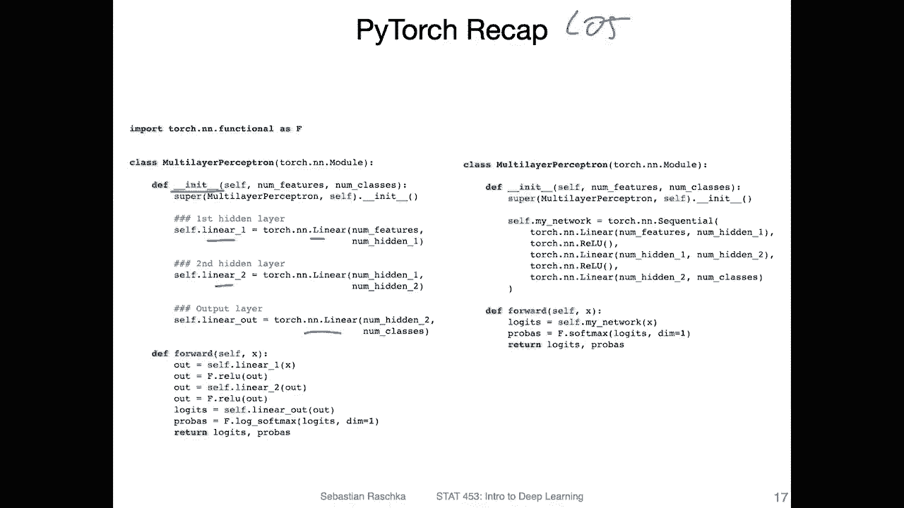
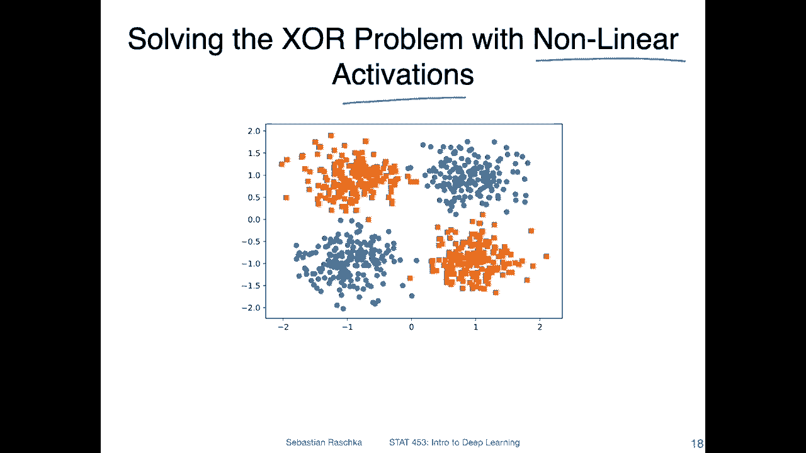
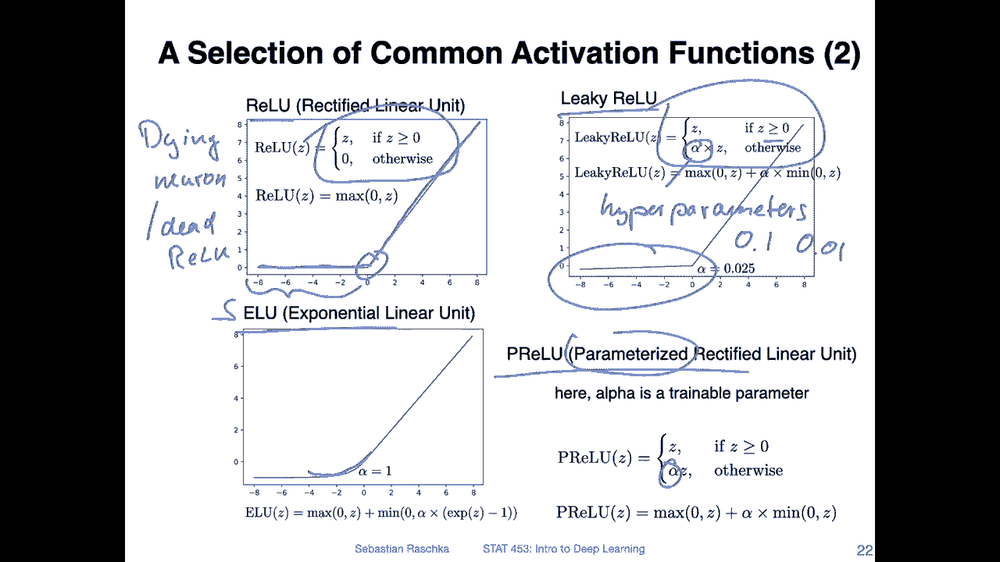
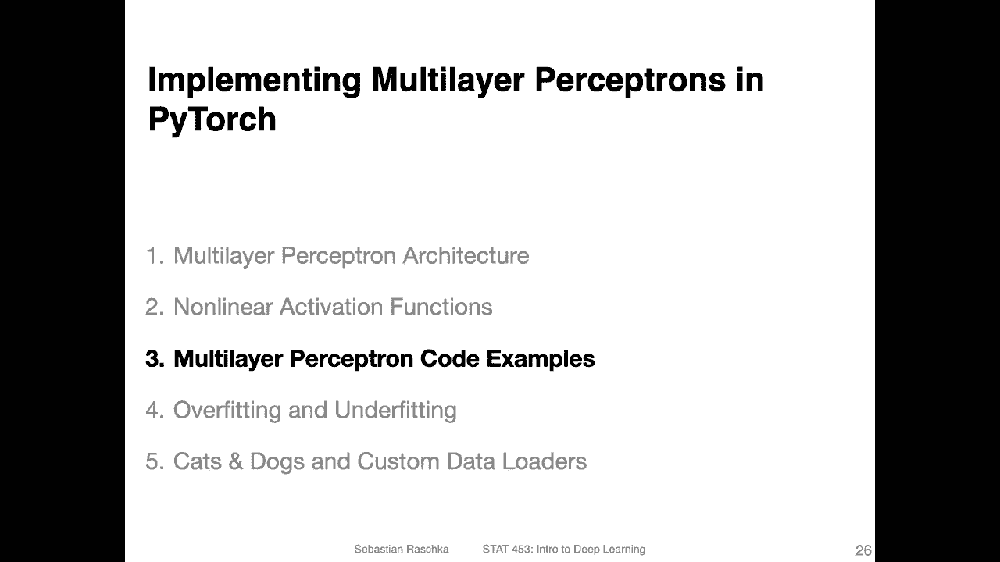

# P64：L9.2- 非线性激活函数 - ShowMeAI - BV1ub4y127jj

Yeah， let us now get to these nonlinear activation functions So why are we interested in these nonlinear activation functions Yeah。

 together with the hidden layers， they allow us to model complex nonlinear decision boundaries。

 so with that we can solve complicated problems complicated classification problems， for instance。

So but before we take a look at these nonlinear activation functions more closely。

 let us briefly recap the Pytorch API， So this is something I just copy and pasted from lectureture 5。

Where we already had a multi multilayer perceptionron just to illustrate how the Pythtorch API works。

 So on the left hand side， yeah， this is like the regular approach。 So where we have in it。

Constructor。 And here this is a multi layerer perceptron with two hidden layers。

 I called them linear 1 and linear 2 because linear， because the layer is called linear。

 it's computing the net input， right， So these are our。Layers that we use and one output layer。

 So this is essentially the setup that I showed you earlier in the slides。 So if I can just go back。

So this is essentially this setup where we have one hidden layer， second hidden layer。

 and an output layer。

Alright， so this is how it looks like。 and in the forward method。We use these actual layers。

 So we apply the first hidden layer。 Then we have our linear。Actation here is' a re function。

 We will。Revisit this in a few slides。 Then another。Ne input， another activation function。

 another net input。 And then usually we would compute the softm。 in Pyth。 recall。

 we use this cross entropy loss， which already yeah computes the softm for us。

 So we don't have to do it ourselves。 So here we apply this logofm function。On the logics。

 So there's also a softm function。 But here yeah， we computers based on the。

 we use the lock softmax because it's numerically more stable if we were to use。

The negative look likelihoodless。This is really the only if we want to use the negative log likelihood loss。

 otherwise we would just use softmax if we are interested in the probabilities， to be honest。

 now looking at this， I don't know why I used log Somax。

 I think in the big code example when I created lecture 5 I had the negative log likelihood here。

So also technically you don't have to compute the probabilities within this class。

 you can do this separately if you care about because technically you never have to use the probability if you use the cross entropy function and Pythtorch for optimization。

 but again this will become more clear when we look at the concrete code example in the next video。

On the right hand side， the main difference is that I'm using the sequential API。

 which can be a little bit more would say easier to read more compact。

 So it's exactly the same network except that here we define it and it sequential can actually also run it So we don't have to put it explicitly in the forward method it will already it for us if we call here My network。

 I just call it my network。 So it is in a way a little bit more convenient。

 So what's more convenient in particular is that we don't have to。

Yeah define these steps in the order these are used ourselves and we can also just read right now from here how these layers are executed。

 they are executed from top to bottom。 This is also the case here， but for example。

 if I want to know what the linear one is， I have to go up and look it up here。

 So it's a little bit more， I would sayarrow prone whereas on the right hand side。

 we define it and we also directly use it in that order。

 So it's a little bit mores it's a little bit safer， I would say。So yeah。

 so the flow is we apply a linear layer， a non nonlinear activation， a linear layer。

 non nonlinear activation， and a linear layer。And that will produce our logics。

 And then if we interested in that， the probabilities。 But again。

 Pyrage and cross entropy already applies the softm for us， so we don't have to do it ourselves。

So technically， we can skip the softmax step and don't have to use that。

It's just like I usually like to include the probabilities because I sometimes also print out the results from a model and analyze it with plots and probability plots and stuff like that。

 so in that way I sometimes find it helpful to have the probabilities available so I usually save my results but you don't have to worry about this really。

Alright， so with that， we can then solve the X O problem using these non nonlinear activation functions。

 So the non nonlinear activation functions let us。

Make complex decision boundaries， like I just said。 So here。

 this is like a toy data set I made just two features。X 1 and x 2， just for simplicity， two classes。

 these orange ones and these blue dots。So the orange squares and the Budts on the left hand side here。

Just for fun， I was applying a。Mulil layer perceptron with one hidden layer and a linear activation function。

 So recall the linear activation function looks like that。So you can see。That on the left hand side。

 that it's a linear decision boundary， even though we have a hidden layer。 by the way。

 I don't want to open the code notebook right now because then I have to switch the screen again。

 But if you're interested after watching this video。

 you can double check here under this link that this is indeed the code is indeed correct。

 so you can reproduce these results if you don't believe me， but in any case so you can see。

On the left hand side， this is a linear decision boundary， even though we have a hidden layer。

 so what happened here？So because in logistic regression。

 we had a non nonlinear activation function and no hidden layer。 It was a linear decision boundary。

 Now， we have a hidden layer。And no non linear activation。

 We also have a decision boundary that is linear。 So let's recap logistic regression。No。

 hidden there。Plus。No linear activation。Gives us a linear boundary。MlP。With。With。😔，linnyang。

Activation。Plus。Hidden there。Also， linear boundary。So from that， we can deduce neither。The。

Hidden layer， which we have in the multideceptionron， nor the。

None nonlinear activation function alone are sufficient。For making a nonlinear decision boundary。

 they are necessary， but they are not sufficient for making a nonlinear decision boundary。 In fact。

 we need both。 We need both the hidden layers and the nonlinear activation functions to make a nonlinear decision boundary。

 So on the right hand side。I have now the same multiap perceptron with one hidden layer。

 the same number of weights， the only difference is that I'm now using a non nonlinear activation function here I'm using the relative function。

And you remember， this is very simple。 It's actually just threshold at 0。

 So if the input is negative， the output is 0， otherwise， it's an identity function。

 So it's almost an identity function， but not quite。 And this is。Suffic。

 together with the hidden layers to make a nonlinear decision bar。

 You can see this decision bar is now nonlinear。 You can see it's solving this X O problem， so。

It can now classify these data points correctly。So why is this working and why is this not working？

 So why is the linear decision on the linear activation function not sufficient and produces a linear decision region。

 That's because if you think about it。Even though we have a hidden layer。

If we have a linear activation function， what happens is that we have essentially a combination of multiple linear functions and the combination of multiple linear functions is still a linear function。

 So if we don't use nonlinear activation functions。

 then we don't really gain anything by using a hidden layer。

 so we need actually both hidden layers and nonlinear activation functions to produce these complex decision boundaries。

Actually， there are way more than just relu functions。 Redlu just happens to be popular because it's。

It's quite simple and quite fast to compute and has also some other nice properties。

 which I will also briefly talk about in a few minutes。 So， but yeah， traditionally， these are also。

 yeah one of the most popular activation functions in multi perceptioncepts with that， I mean。

The logistic sigmoid that we already encountered in the context of logistic regression。

 So back in the day， I would say even the sigmoid was maybe the most popular activation function in multi epicirons。

But again， it has this problem that these gradients saturate here。

Another very popular activation function for a while was the 10 H function。 It's also a soidal。

So both are smodal functions。 It's also smodal functions， So S shaped。

But this hyperbolic tangent function。Looks a little bit different。

 So you can see this one the logistic sigmoid function is centered around 0， and the output is 0。5。

Whereas this one is centered at 0， and the output。At 0 is also0。

 So it's producing positive and negative values， which can be an advantage。There' is also a heart t。

 which is essentially very similar to 10 h， except that it's threshold here， similar to Relu。

So what is the advantage of， let's say， the 10 h over the sigmoid activation？

So the average of 10 Hs reallyda that we have this centering。At 0。

So that we have positive and negative values and you can also see it's steeper。

 So here the it's steeper than this one。 so we have larger gradients。

It has also a very simple derivative 1-10 H。 recall for the logistic sigmoid。 The derivative was。

Like this。So itself times 1 minus itself。 So the。The relative is slightly smaller because it's， yeah。

 multiplying。2 numbers， smaller than。One with each other。 So where series of 1 minus this one。嗯。

But then yeah， you have also the squared here。 So it's actually not that different okay。Yes， so。

 but both have the problem that if you make a wrong prediction。

 it's both if you make a right or wrong prediction， but in both cases。

You hear and hear So you saturate it so that that can be a problem if you make a wrong prediction。

 you end up with a very small partial derivative。With， with respect to its well derivative。

 with respect to its input。 And then when you compute the partial derivatives in the chain rule。

 then yeah， you will get very small gradients and the learning will be very slow。

 which can be a disadvantage。Or maybe one more thing about why it's good to have。

Negative and positive values that just gives you more combinations。

 So imagine you initialize your weights from， let's say a small or from a random normal distribution。

 standard normal distribution， let's say or a scale standard normal distribution。

 so you initialize your weights such that they are centered at0。

 So you can have positive and negative starting weights。

 And if you also use this 10h which can have positive and negative values。

 you get just more combinations of possible values。

 whether you combine a positive with a negative number。

 a negative with a positive number to a negative numbers or to positive numbers。

 you have four different ways you can combine these signs。

 whereas if you have a activation function that can only produce positive numbers。

 you a little bit more limited。So I would say that 10 H is a little bit more expressive。

 It allows you a little bit more。 Yeah， expressivity， if that's a word。But yeah。

 I think also in practice when I use them and I recall。

 I only saw a minor difference using one over the other。

 really if you use a re function that gives you a better bang for the buck usually。

So here are some more non nonlinear activation functions， including the Redou function。

 So the Redlu function here。 that's something you have seen before。 It's。

 I would say still the most widely used activation function in deep learning。

 I think it's maybe 10 years old by now， something like that。 But when you look at recent papers。

 People still use a Reddo a lot。 It has really nice properties。 It's simple to compute， really。

 And you have always。Yeah， that derivative。 The derivative is one。

 So if you use the chain rule and your derivative is one， if the inputs are positive， then。Yet。

 you don't diminish the product in the。General， okay， but it can also be0， which can be a problem。

 So if you have negative inputs to this activation function， your， your output would be 0。

 which will then basically cancel the weight update for that corresponding weight corresponding to this activation or connected to this activation。

 So that can be a problem if you always have very negative input。 So there is a problem called。Dying。

Neurons or dead。R loose that happens usually when you have somehow updated the weights such that you will never come into the positive region anymore。

 And then yeah， you will never be able to update your weights again because the derivative will always be zero。

 that can be a problem。 However， in practice， some people argue it can also be an advantage because it can help with pruning let's a unnecessary neurons。

 like if you have an excessive number of neurons。 this way you can get rid of some of them and it may help with preventing overfitting。

A version of Re that some people find。To perform sometimes a little bit better is the leaky relu。

 which doesn't have the problem of these dying neurons。 So here， the difference is that we have。

 So if we look at the simplified notation， the。Pace ofwise linear I function here。嗯。

What you can see here or the Pwise function。 sorry。

 what you can see here is that the only difference is that we have now this alpha here。

 which is a slope。 If the input is smaller than 0。 So for the negative region here。

 we have now a slope。 what value we can choose for the slope， it's a hyper parametermeter right。

 So hyper。Permence is something that you， as the practitioner， have， has to choose。

 So there's no way。You， it's say can know what's a good value if it's a habit right。

 It's something you have to try out and practice and change and see what performs better。

 I have seen all kinds of values for this negative slope here or for the slope in the negative region。

So in Kas that's API for Tensorflow， I believe they use 0。3 as the default value in Pyr。

 I don't know exactly the default。 I usually specify myself。 I usually use something like 0。1 or 0。

01 but yeah there are different values that work well for different problems。

 in practice you will only see a slight small difference。

 So it's not something if your network let's say doesn't perform very well than choosing a different value here probably won't make a big difference。

 So you have probably bigger problems to fix。But it can give you maybe1，2。

3 percentage points in terms of accuracy if you are lucky。

I said hyperpar cannot be like automatically learned from gradient descent， however people designed。

Parameterterized version of the leaky Relu。 It's called Perlu parameterized Relu basically And here this is essentially the same as buff。

 but here the people made it made alpha a trainable parameter。

 so it's a parameter that can be also updated with gradient descent。So in practice。

 I honestly never really。I have never really seen this being used。

 I'm not sure if this is really that useful。There's also an L an exponential linear unit。

 So it's getting around this kink here。 It's like more like a smooth version here in this kk。

 So there are different types， really， many， many different types of non nonlinear activation functions。

 There's also， I recall there's a。Slu， I've seen that quite often recently。

 It's I think it stands for self normalizing exponential linear unit。

 So it has some nice properties also。 But yeah， again， there are lots of different flavors。

 Usually people still use the relu a lot because it just performs well。

Yeah， related to the topic of nonlinear activation functions I saw this paper here last year called Sth adversarial training。

 I bookedmarked it because I knew it would become handy when I teach a class on the burning so。

Adversarial training， just briefly what is adversarial training。

 adversarial training is yeah exploiting deep neural networks or more like fooling deep neural networks it's if you have let's say an image or some data point and your network makes a prediction。

 let's say you have an image of a cat， it predicts CA。

There's some way you can exploit the network by just changing the image very slightly。

 making like a few pixel changes， but you find these pixel changes that are able to fool the network to。

 let's say now， think that the image is a dock instead of a cat。

 So it's like exploiting weaknesses in the network。So like the authors say。

 it is commonly believed that networks cannot be both accurate and robust。

So usually if you want to make your network more robust towards these advers and examples。

 you usually trade it off by yeah by suffering in terms of accuracy。

 so the accuracy is usually lower in these more robust networks。So like I say。

 gaining robustness means losing accuracy， However， yeah， let me just read it。

 our key observation is that the widely used relu activation function significantly weakens adversarial training due to its non smoothth nature。

 So it sounds like yeah the Relu is like a little bit of a disadvantage for adversarial training。😊。

Hence， we propose smooth adversarial training in which we replace Redlu with its smooth approximations to strengthen adversarial training。

 So the authors argue that if you replace this Redlu here in red with this non smooth。

Point here with a smooth version， for example， the permit soft plus function。 Then yeah。

 you can strengthen it because now maybe it has something to do with the gradients because here you have this big difference whereas here you have also something in between。

 So now this is maybe helping with this adversarial training。 So based on the experiments。

Yeah， and the second reason why I like this paper is because they have a nice summary of the smooth approximations of the non smooth relu function。

 So on the left hand side， this is how the activation functions look like。

 they call it here the forward path。 And then here are the derivatives for the backward path on the right hand side。

 So yeah， you can see these are all slightly different。

 but they are all kind of approximating the the relu in some way。😊，In practice yeah in practice。

 this has a big implication apparently for the adversarial robustness， but also like I said。

 choosing different activation functions that are relatively similar。

 it doesn't make a big impact in practice， so also what they see here。

 it's just one percentage point， so one percentage point between Relu and the others。

So it helps a little bit。 These， some of these others perform actually better， a little bit better。

 It's not huge， but it's a little bit better。 So it's， in a way， it doesn't hurt using them。

 But on the other hand， you can see there's a huge advantage in terms of adversarial robustness from 33% up to。

42% is almost there 10%。10% difference in terms of adversarial robustness。 So given that， I mean。

 it's not much work to just replace Relu with one of these non other non linear activation functions。

Given that's not much work， why not doing it， right？ So it's actually quite interesting。

Yeah， and because activation functions are quite boring。

 I have a quite fun visualization here I just saw today coincidentally so that's these dance moves of deep learning activation functions。

 With that I want to enter this video and then in the next video we will talk a little bit more about multilayer perceptrons and in particular coding it up in pywach and training it。

😊。

