# P68：L9.4- 过拟合和欠拟合 - ShowMeAI - BV1ub4y127jj

Yeah， now we have seen simple models like logistic regression and more complicated models like multi layerer perceptrons。

 So I think that's a great time now to talk about topics like overfitting and underfitting。

 So in particular problems with models that are too simple like logistic regression and problems with models that fit the data too well。

 maybe multilay perceptrons。 So the big problem with models that are too simple is that yeah。

 we don't get a good performance all of them。 for example。

 when we used logistic regression on Ms we got a 93% whereas when we used。😊，Yeah。

 now that we have seen a selection of models like logistic regression as a simple model and multilayer perception as a。

 I would say more complicated model， it's I think a good time to talk about overfitting and underfitting in particular。

 problems that arise with models that are too simple like logistic regression apply to am listeded data and models that fit data too well。

 for example， multilayer perceptioncepts with too many features。So yeah， with that。

 let's talk about some of these topics。 but I also wanted to start this video with a small。

 let's say， quiz。 So here I'm showing you some images from the Amnes data。 And yeah， the question is。

 what image or what number do you think this is。所要呃。True label is actually an8。

 The model predicts a4。 I can kind of see how it predicts a4， though。 It mean， if you look at it。

 it could be almost like。Something like this， right， so。Something like this。 So it's actually an aid。

 but it doesn't look that far away from a for， to be honest， it's actually a pretty tricky case。

 Or take a look at this one。 What would you think this image is。So yeah， as you may have thought。

 it's a2， but also it's actually not too far away from a 7 right， if you think of a 7 like this。

 it's actually not too far away。 And in fact， that the model predicts a7 here。Or this， this one here。

 What would you think this number here represents。So according to the labels， this is actually a5。

 but I also can see how this might be a three almost right， So in that way， another ambiguous case。

Last one， so what do you think this one represents？Yep， it's a 6。 but yeah， also。

 it could be very well be a zero。 So like like this， maybe maybe someone。Was writing the0 like this。

 So you can see it's not always very obvious what this number represents。 And that way。

 it's probably even impossible to get a 100% prediction accuracy on that data set。Oops。

 I have one more example here。 So yeah， can you think what。

Well can you guess what these numbers here are in terms of the true labels and the predicted labels？

So on the left hand side， we have a true label 2 on the right hand side， also a true label2。

 so both these numbers。Represent the digit2。 but you can see they look very different from each other。

 And also yet a model in the left hand side the left hand side predicts0 on the right hand side predicts a 7。

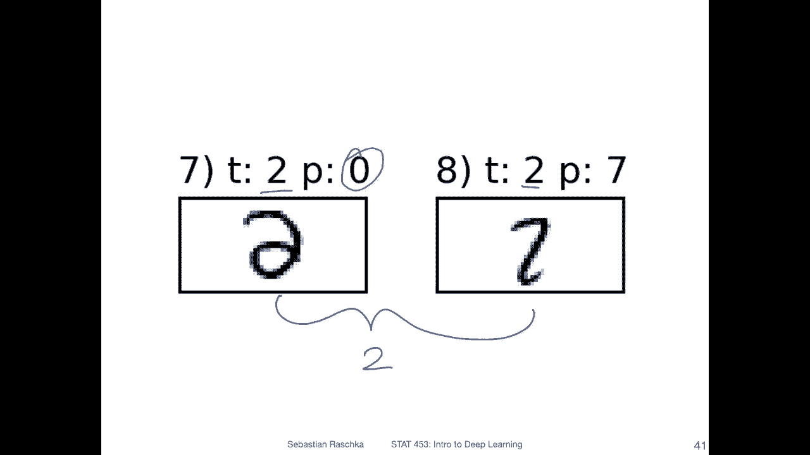

Yeah， so here's an overview of some of the failure cases of a multi layerer perceptron trained on Mnesist。

 So here I was yeah using a not so good model it was like a logistic。

Sigmoid activation and output layer。And I used the M E squared arrow。 So I only got 93% accuracy。

 But that is really， besides the point。 So the point here is really， it's useful。

To visualize some of the failure cases。 So if you train a network on a dataset set it's always good to look at the wrong prediction because sometimes you may also find there' is just a mislabelling issue in the data that you may want to fix。

 So in that way， sometimes yeah you get additional insights about your data like issues with your data by just looking at it。

So yeah here it's just interesting to see what the model here predicts， for example。

 like I mentioned in Germany we write the7 like this in the US it's common to write a 7 like this in Germany it's common to write the one like this in the US it's common to write the one like this so I can see a model may confuse。

American 7 with a German one， for example。I can't see this issue here in this dataset set。

 but what I can see is that for example， this7 here is mistaken by a3 because a3 also has this thingy here in the middle。

 this little yeah I would what would we call it， I don't know。

 but you can see this is maybe confusing the model thinking it's a three while in truth， it's a 7。

So here， just the bottom line is it's useful sometimes to take a look at your training data and the wrong predictions。

So talking now about overfitting and underfitting， so overfitting refers to the issue when the model memorizes details in the training set that are only very specific to the training set but don't generalize to the test set。

So。Here， for example， what I'm showing you is a plot where I have thearrow on the Y axis。

And the model capacity on the x axis。 So what do we mean by model capacity， So with model capacity。

 I mean in a way the number of parameters or complexity of the model think of it for yeah for simple or for simplicity。

As the number。Of parameterss。Or the ability of the model to fit a complex data set。

 So a model with more hidden layers compared to a model with fewer layers。

 a model with more hidden layers as a larger capacity or a model with wider layers also as a larger capacity to a model compared to a model with fewer or smaller hidden layers。

 So usually the more layers you have or the wider the layers are the higher your model capacity。

Alright， so what I'm showing you here now is the training error first。

 So let's focus on the training arrow in orange。 So the error usually goes down as the model capacity increases。

So that means if we have more layers or， I mean， this is like， of course。

 not generally true because then we have issues like vanishing and exploding gradient。

 So let's say if we have a wider layer。 So if we have， let's say。um。Mti hyperperceptron。

Where this represents a arm。Hidden there。If we make this hidden layer wider。Like this。

 doubling the size， for example， we increase the capacity of that model to fit a complex data set。

So usually for the training set， the larger the capacity， the smaller the error。

For the tests at though。What we usually observe is first， if we have。

 so let's say we start with a very simple model here on the left hand side。

 like only one hidden unit or something in the hidden there。

 then the model is too simple to capture the trends or patterns in the training data。

 So we start with a large  error。 But then as we make。The hidden layer wider。

 we see that the arrow goes down。But then let's say， we make the。We are too large。

 too many parameters to learn what we often observe is that the test that a goes up again because you know the model has so many parameters that it's not memorizing certain patterns in the training set that don't generalize to the training set so for example。

 in terms of pattern like's say individual positions of pixels that instead of more general shape it would pay too much attention to a particular pixel or something like that。

And with generalization error， this is， I mean， this is like the performance on。New data。For example。

 as measured。Often， it's measured。W。😔，At test set an independent。Test set。

 So usually we use the test set to estimate the generalization error。Yeah。

 one more thing under fitting。Underfitting usually means if the model is not complex enough to capture the trends in the data。

 so here in this region， we can maybe say that this is underfitting。

And here on the right hand side this would be overfitting so overfitting is usually if you how you would quantify this usually by looking at the gap between training and test set performance。

 that is usually one way to assess the degree of overfitting。

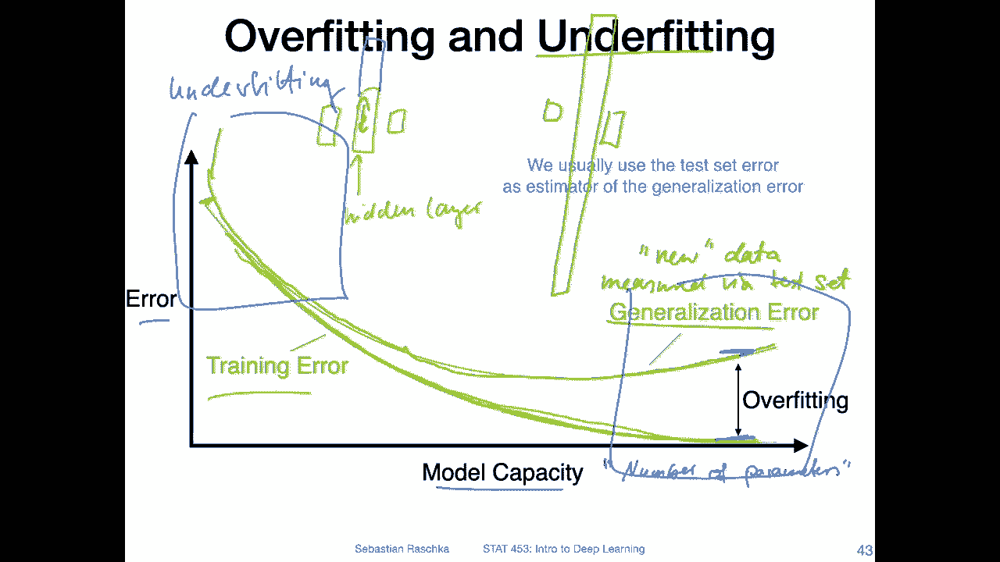

Yeah， in practice， you will sometimes also hear people saying a model has high bias or a model has high variance。

 So I want to briefly go over yeah， the concept of the bias variance decomposition and how it relates to overfitting and underfitting。

 However， this is just a very brief rundown。 It's not。

 I would say the most important thing here in this course。 So this course about deep learning。

 And because we have only so much time we won't to talk about。

 let's say model evaluation techniques in too much detail。

 There is a simple technique that most people use， I will。

Talk about this a little bit after these slides and also we'll show you how that works in， yeah。

 in code examples。 So but just let's just focus on biasvariancy composition。

 If you' are interested in more model evaluation aspects。

 I cover more of this in the 451 introduction to machine learning course。

 which I usually teach in fall semester。 So， but here because like I said。

 we only have so much time in deep learning。I don't want to cover this in too much detail here。

 but I think it's useful to have a basic understanding of what bias and variance means in that context。

 because you will probably read about this in a paper at some point in your career， so。

Let's say we have a model for regression because it's simpler in this context。

 Let's say we have a regression。Model， and this is some value for a given data point that we want to estimate。

 Let's say， call that value or prediction theta。 Let's， let's say this is a， the true。True value。

 And we want to estimate this。 Let's say， by predicting its value using a a regression。Model。

 and the regression model produces this theta head here。 So theta head is the。Prediction。And。Now。

 so think of everything here in the context of the squared。Scrd。😔，Arrow。

So here we talk about the bias varianceancy composition of the squared as。And now， think of。

Having like a large number of training sets， why we have this large number of training sets is a weird interesting question。

 It's like a weird scenario， usually in practice， we only have one training set。

 but just assume for the sake of this example that we have a very large number of training sets。

 Let's say we have1 million training sets。So every time we train a regression model on a training set。

 we get a slightly different model because the training sets are not identical。

So now think of training one。Million。Mods。And each model makes the prediction on the same data point。

Let's call this So the data point corresponding to the theta here。 Let's call this data point I。

 There's a prediction for the data point I。And then we average over them。

 So we average over this prediction for that data point。 So here。

 the expectation is over the training sets。 So we are predicting。The yeah。

 data point for these well using these different models， so。Then we get this average value here。

 this expectation and the difference between this expected value。

Of this expectation of the theta head here of the estimated parameter。

 the difference between those two。 This is our bias。 This is how on average。

 how far are we off from the true value。In contrast， so the variances。

 you are just two different ways of writing the variances。

 You've probably seen that in other statistics course。 But。

 the main point is the variance is defined a little bit differently's。

How spread out these predictions are。 So if you have a prediction by a particular model。

And then you take the average prediction。 So this is really like here。V。😔，Average。Prediction。

How far or how spread are they how far are these apart squared so there's no positive or negative value So how far are they apart and then taking the expectation so how far oh how scattered our predictions on average basically so because this is like very weird to think about conceptually I find it easier to have some drawing so I took this actually from 451 so students will have taken 451 have seen my little drawing here so that's a person with a bow and arrow and。

Let's say the person wants to hit some target here。There's also usually some noise around the target。

 so in the data， so here for simplicity， maybe ignore the noise。

And the goal is for this person here to hit the target with an arrow。嗯。If。

 so you can see all the arrows fly short here。 So the difference between。So this party。

 let's say the average here， this would be the expectation in the middle if you take the average of all these。

A rows here， this would be the expectation。 You can see the difference between this one and this one。

 This would be the bias。And。How scattered or how spread these arrow are that would be the variance。

So why why am I explaining this So usually people relate bias and variance to overfitting and underfitting personally I find it easier to think just of overfitting and underfitting。

 but yes some people like to talk about models in terms of bias and variance so a model with a high variance if you would train that model with different training sets。

 this would mean that a large variety of these predictions of the models a model with high variance is also more likely to overfit。

And a model with high bias means that it's kind of far off from the target。 So in that way。

 a model with high bias is usually， yeah not， not complex enough。 So it's usually underfitting。

 So high bias is usually underfitting and high variance is usually overfitting。

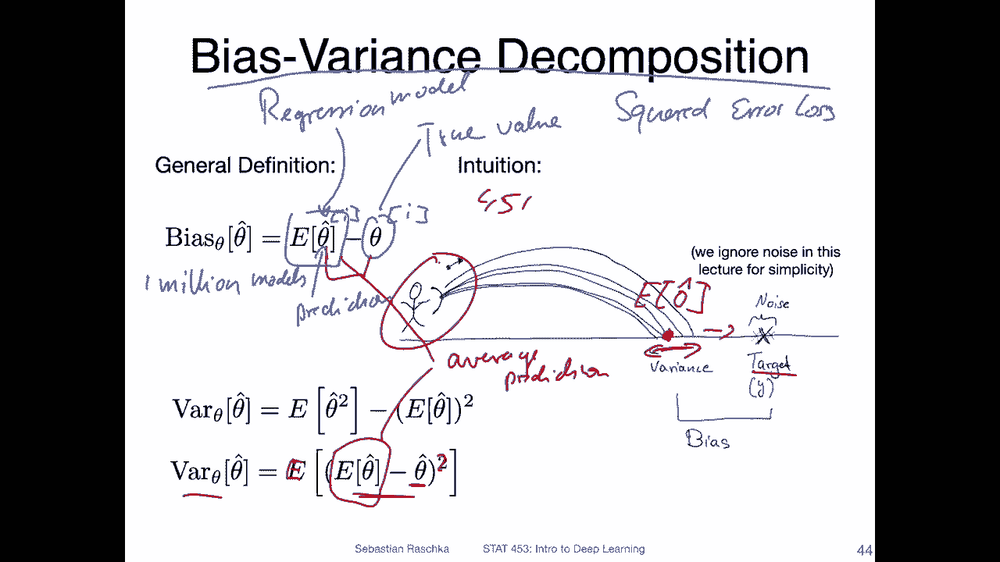

So I try to summarize that here in this plot。 So again， we have our error and the model capacity。

 So the training error and generalization error is what I've shown you before on the left hand side。

 when we have a high error for both training and test data or high。Let's say。系。😔，Arrow， oops。

Surprisingly difficult to talk and write at the same time for me。 I don't know why。 Hi error for。

Both。😔，Training。And generalization。Let's say on both higher training and generalization。

It should be in let's say， in terms of in。Both string and translation arrow。

 So if we have a high arrow， this is usually underfitting and。If we have a high generalization error。

 but a low training error， then this is usually the difference between。The green one here。

 the orange oops on the orange one。This is usually overfitting。

And variance and biasers relates to that。 if we have a very simple model， low model capacity。

 it usually has a low variance。 So even if I fit the model on different training sets。

 the results are usually quite stable because it doesn't memorize the data too closely。

 and then the variance。Goes up。As we increase the model capacity。 So in that way。

 the variance increases， and this is usually also correlated to increasing degrees of overfitting。

Similarly。With a bias， so model that is too simple has usually a high。Bas。

 because it can't fit the data too well。 It will always。

 let's say provide do very simple predictions that are always very similar。 It's not yeah。

Complex enough to fit the data。 And you can see， though， as you increase。

 the capacity bias goes down。 So a high。Bas model is usually relatedd to underfitting。 So again。

 for more details， I cover this in 4，51。 but yeah。More more detail。

 you don't really have to know for this course for the focus here on deep learning。

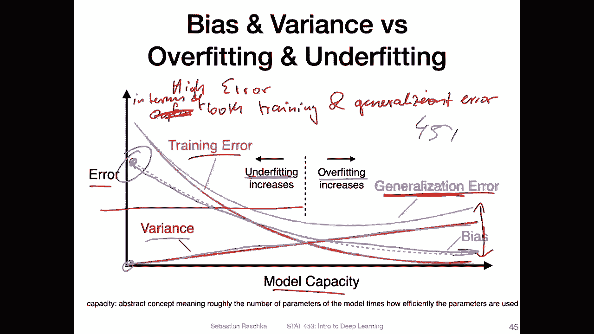

So。Yeah， like I said， a more detailed understanding is not mandatory for this class。

 I won't ask you make any more details， let's say in quizzes or exams than we just covered。

 So it's just like a briefly a brief overview In practice。

 there are different ways we can evaluate models。 there are like in 451 there are。

Cross validation tests， we used bootstrapping and all types of different approaches。

Deep learning when we have very large data sets， we usually use the hold odd method where we have three data sets。

 a training， a validation and a test set。 So that is usually sufficient because yeah we usually a very large test set So estimating the performance on a test set should be quite robust。

 given that we don't reuse our test set multiple times。

 So the focus is here really that our test set remains independent。

 So by that what I mean is usually we have a validation set。That we look at when we tune the model。

 So what we do is usually we。Fit the model on the training data。 Then during training。

 we look at the validation performance。 and then once we are finished we get the final performance estimate on the test set that's the usual approach。

 Yeah， and that is something we will also be using in in the code examples。

 So there's nothing really you have to pay particular attention to right now in this class。

 So for this class， we use this threefold holdout method。

 which is also common in the context of deep learning If you look at literature。However。

 if you are interested in more details about model evaluation and best practices， well。

 we cover this in 451， which you probably either have taken or not taken。

 you don't have to know any of this for this class。

 but if you are interested I have put up an article here on archive summarizing basically my lecture notes this is like different。

Here different techniques， statistical tests， cross validation， K， cross validation。

 Woodt estimates and so forth。 So yeah， you are welcome to check out this article if you are interested。

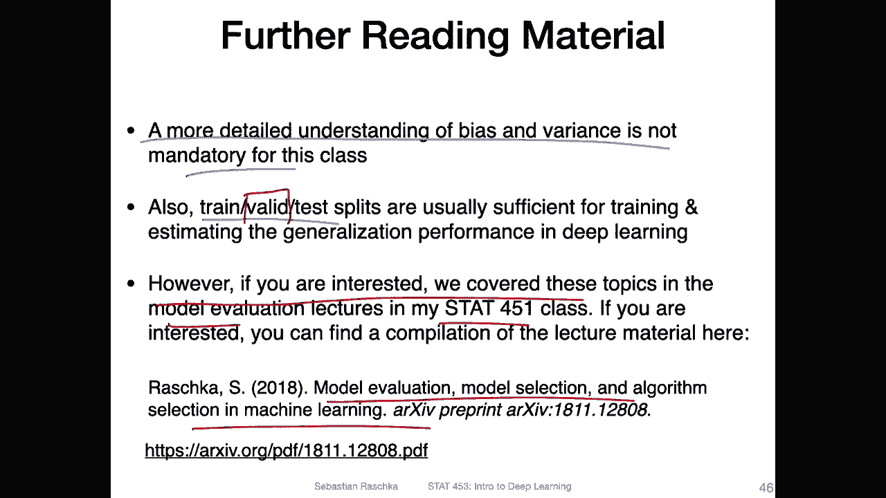

Yeah， one aspect also about deep learning is that deep learning works best with large data sets。

So here I have drawn another conceptual plot related to the generalization error and here the training data set size。

 So if we have。The comparison between traditional machine learning， for example， decision trees。

 random forests support vector machines things like that compared to deep learning。

 usually if we have a small data set。Yeah， traditional machine learning will perform better。

 so the gization error for traditional machine learning will be lower。However。

 as the data set size increases， usually we will find that also， yeah。

 traditional methods will perform better， but。Yeah， for deep learning there's actually， yeah。

 a really steep。 yeah， steep decline of the error with increasing data set sizes compared to traditional machine learning。

 so。Especially deep learning works well with and really even requires large data sets to perform well because yeah we have large models。

 there are a lot of parameterss and to fit to parameterize the model well， we need sufficient data。

Yeah， so this is the traditional view， usually the more data we have， the better。And also。

 this is something if you find that your model doesn't perform well。

You may end up tuning some hyperparmeters。 You might may find that hyperparmeter tuning helps with improving the performance a little bit。

 but there will be probably a point where you can't even make any difference no matter how many hyperparmetertor values you explore。

 and that might be a point where more data could be helpful。

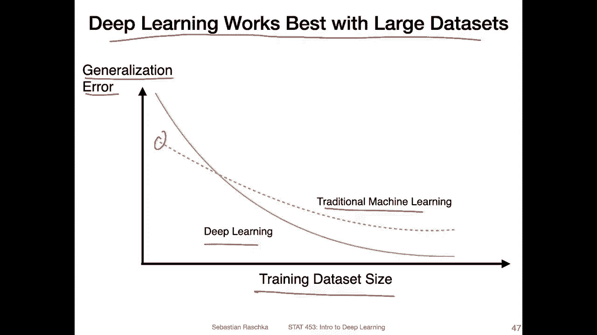

So， but yeah， interestingly， I recently saw the paper on double descent。

 so there was the paper on double descent that came out in December 2019。

 So that's an observation that is quite interesting and it's quite different from the common belief。

 So here。What the researchers did is they looked at CNN architecture， standard and renets。

 so standard CNNs and residual networks， both are things we will cover later in this course and transformers which will also cover at the end of the course so I'm not sure if that the insights here generalized to other models like recurrent neural networks and multilayer perceptionceptrons because they haven't looked at those。

 but at least this was very interesting in the context of CNNs。

So all the models were also trained with cross entropys here。Yeah。

 there is this phenomenon of the double descent。 So what does that mean。

 What does a double descent means I mean， So here， what you can see is。Like expected。

Training error goes down as the model complexity increases。 So here you can think of。X X S model。

Capacity， which we have looked at before。 so that is expected at some point， though。

 if we make the model too large， we will see that the error goes up。

 So here the solid line is a test error trained error goes still down。But the test  error goes up。

 So this is what we talked about。 This is the overfitting。Now， the surprise is that it goes up。

 but at some point it goes down again。 So what's going on here。

 actually people don't know quite know yet why this happens。So there are some theories。

 I will share one of them in a later slide。 But yeah。

 so what is interesting here is this double descent that it first goes down。

 But it's the first descent。 and then it goes down again after going up。 This is the double descent。

 So they observe it with four different model capac。 So if you make the model larger。

 you can observe this double descent。

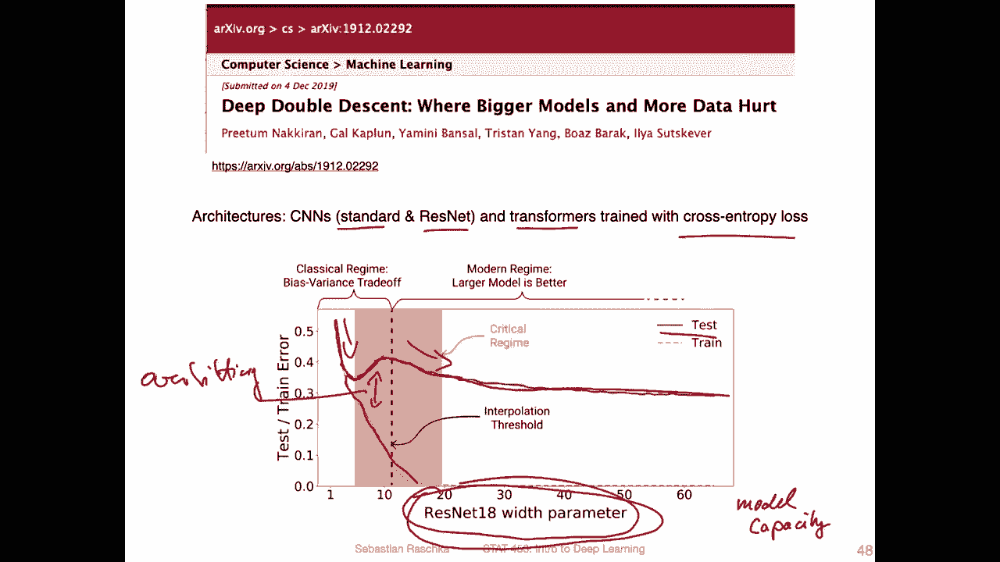

And you can also observe it if you train for more epochs。 So here again。

 is a test error they have here on the left hand side， three models， a small model。

 an intermediate model and a large model。 you can see when you train a small model for more epochs。

You don't have this， you go basically down， the generalization error goes down。

 so the model is improving， the more epochs we train it。For the intermediate model。

 you can see it it goes down。But then at some point， it goes up again。

So here the model performs actually worse when we train it longer， so in this case。

 for this intermediate model it would be good actually to stop the training early to stop let's say training here and in the next lecture I will also yeah talk more about early stopping as a way of regular regularizing the model like improving the performance preventing overfitting。

And for the large model you observe it goes down， then it goes up similar to the intermediate model。

 but then it goes down again， so that's also this double descent here。So that's quite interesting。

Yeah， on the right hand side is the same。 visualize it or the same thing just visualize differently for。

The model parameter size on the X axis and the number of epos on the Y axis。

 So there are a couple of yeah thoughts about that from the paper or theories， so。

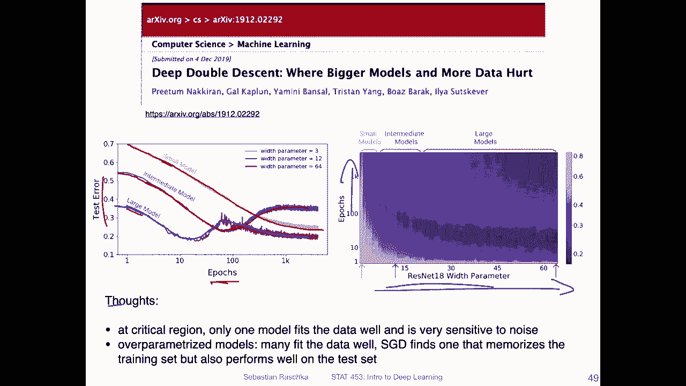

At that。Critical regions。 So with critical region， they mean。This region here in the red region。

 the reason why we might may find that it goes up here is。

That。They think its only one of the models fits the data well and is very sensitive to noise so with one model imagine you have a residual neural network and when you train it there are many。

 many different hyperparmeter model weights that you can define to fit the data well so there are multiple possibilities and there's only one that fits the data well there's a particular combination of weights that fits the data well。

But it's very sensitive to noise。 So if you have small perturbations in a training set as you train。

 it's very sensitive。 It's not guaranteed to find it。

 And also it's really sensitive to the inputs So if there's a slight perturbation and the inputs the model may make the right prediction of wrong prediction in that way it's not so good in terms of generalizing but if you have an overproempterized model if a model is very large。

 there are many ways you can fit the data well So you have a lot of weights。

 and you only let's say maybe need a subset of those to perform well。

 and there are many different ways you can find a good subset of the weights。 and they。

Theorize that satorcchastic gradient in descent finds one of these weight combinations。

That fits the training set well， but also performs well on the test set。 So in that way。

 oops if I go back， so the。

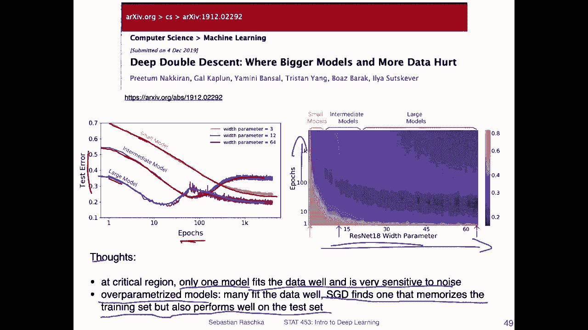

Claim is basically that here the model that is learned is very sensitive to noise， whereas。

In this region here， yeah， we found a model that performs well on the training set。

 but also on the test set。There are more experiments in that paper also experimenting with different degrees of noise。

 So if you are interested in that， yeah I recommend reading the paper here。

 I only yeah took a very small number of figures to just illustrate this double descent phenomenon。

 So there's also。

Yes's the same as I saw。 Oh yeah， this is also an interesting figure。

 It shows both the number of epochs and the width。 So there's essentially a model wise double descent and epochwise double descent。

 So there are these double descent curves for both different sizes of the model。

 So if you have more parameters and also for longer training。

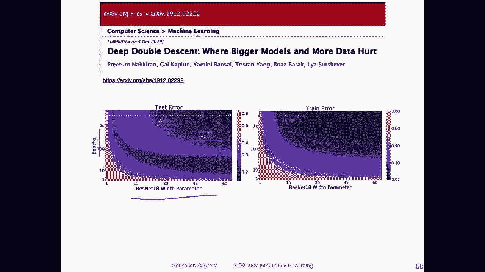

Lastly， there's also， yeah something they observed with。The number of training examples。

 So if you increase the data set size， there are also some， yeah little surprises。

 But I wouldn't say， so they describe them in the paper as surprises。

 but I wouldn't say it's a big surprise。 The general trend is。So if you have here， the error。

From lowest to highest。 so you have the lowest error in this region here where you have a large model and a lot of data or a small model and a large model of data data。

 But what is weird is here in between if you have an intermediate model。

 more training set or larger training sets are actually worse。

Compared or these models are worse compared to the small models and big models。 And also。

 when you look at this closely。Let's say here， for example， you can see that。

Increasing the number of training examples from here to here improves the generalization error。

 But then from here to here， it becomes worse again。 and then it becomes better again。

 So if you would plot that， you have a。It's a high generalization or。 it drops。

 and then it becomes worse again。 So that is also a little bit weird here。 That's some surprise。

 But in general， you can see more training。Data helps and also more larger models perform better。

 So a good combination is large training set and a large model。 So， yeah， again， so this is， yeah。

 just interesting。 If you're interested， you can read about this more， Why the double decent。

Phenomeeno happens， I think that is not quite clear。 Some people， let's say so in some forum。

 even debate that this might be just some buck in the code or things like that so。Many people。

 though， I can say， have observed this independently， so it's probably a real thing。

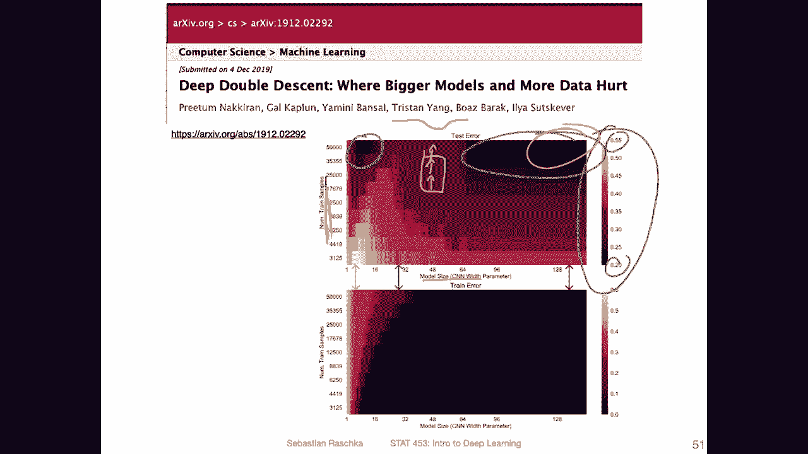

But why this happens yeah， it's not quite clear yet。 So but yeah moving on。

 So this was just a very brief video actually it was longer than I expected。

 but still a very brief video in the grand scheme of things like on overfitting and underfitting and in the next video I will show you how we can use multilay perceptrons with custom datasets because so far we only have worked with MNs but yeah chances are for your class project you will want to work with your own dataset So that and the next video I will show you how we can do that。

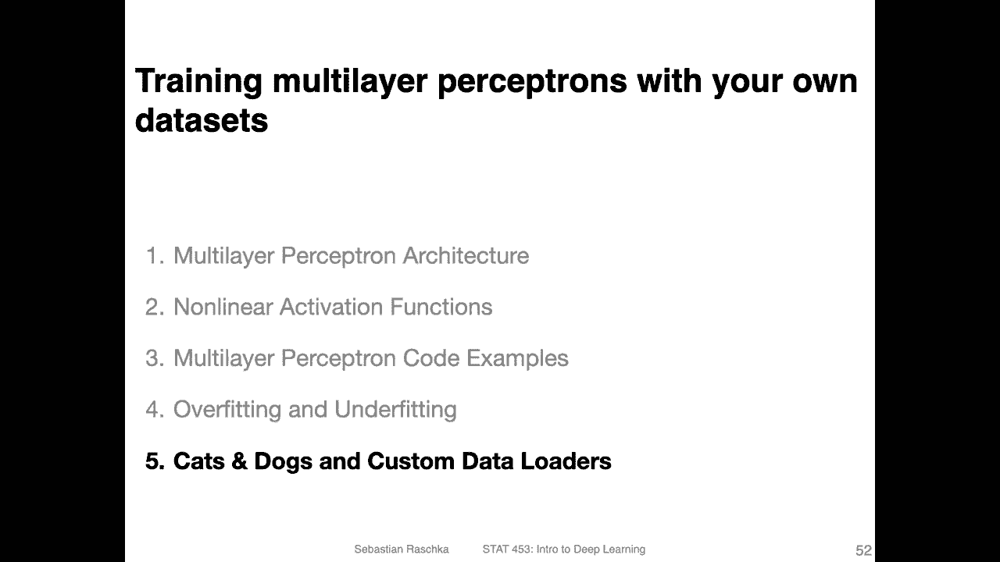