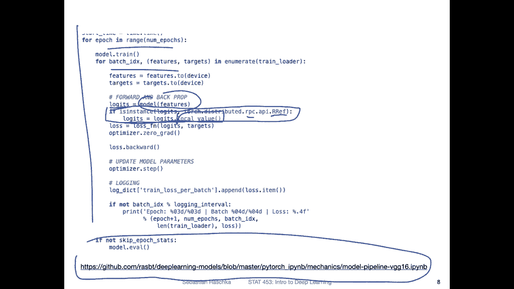
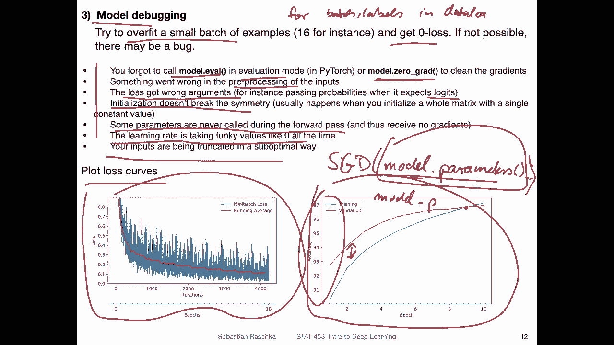

# P71：深度学习新闻 #6，2021 年 3 月 7 日 - ShowMeAI - BV1ub4y127jj

Yeah， hi， everyone。 So this week， I have a bunch of handson stuff related to neural network training。

 So， first of all， there was the new Pytorch release， which I want to briefly talk about。 And also。

 I saw a really cool article regarding tips for training neural networks。

 And since I'm currently grading your class projects。

 I thought it might be a good opportunity to go through some of these tips and tricks for yeah。

 helping with neural network training。 So with that。

 let me get started with a stuff in the news for this week。😊，Yeah。

 probably the coolest thing that happened in the context of deep learning this week was that there was a new pytorch released this week。

 So I usually every like that if there's a new version that comes out。

 it's maybe every half a year or so， because yeah， there are usually a lot of cool new features and improvements that are useful in practice。

 And since this class is also focused on Pytorch， I thought it might be worth while mentioning some of these new additions。

😊，So theres an article that they put together with the highlights in this new 1。8 release。

 So if you're interested this one summarizes most of the relevant changes。

 a more detailed list listing all the changes and additions is on Github so you can go here if you want the more detailed list。

 but it's a long list I think there were about 700 commits like feature changes of feature editions and things like that。

If I were to highlight a few， I have these three as I would say， my personal highlights。

 So one is that they know， yeah， make it easier to use。M D GPus。

 So competition is always good for business， right。

 So it's good that also other cards other than than videodia are supported， which I think。

It's nice for those people who have， let's say， a gaming PC or something like that with an M D graphics card。

 So now you can also use those graphics cards。 So this is supported by a library called Rom。

 It's like Kuda， but for AM D GPUus。There was support for AM M D GPUus before。

 but it was like a little bit of a hassle you had to compile Pytorch yourself and was not so easy。

 And now what's new is that they are。Making the binaries directly available from the installer menu so you can now also yeah set it up more conveniently。

Now it's also possible to fit larger models onto GPUs without any external libraries。

 so recall last week we talked about fair scale and Microsoft Deeppe。

Which were two libraries Yeah providing functions to distribute a model across multiple GPus。

 So there were already something like a data parallel in Pythrch。 So one is。Data parallel。

And one is distributed。Data perroll。 Let's just call it a D P。 And these were methods for splitting。

Many batches across multiple GPus and then training in parallel。

 But this wouldn't help with a problem where a model is too big for a given GPU。

 One method that we discussed was this checkpointing。

 but the checkpointing would be using a single GPU。

 Now there's a way that you can conveniently put a single model onto multiple GPus and then run it in parallel。

 I will show you an example。 So that's actually pretty cool。

 So you don't need any external libraries for that。

 There are now some features that yeah support it directly in Pytorch。

And then also what's kind of nice or what will be nice in practice is that the torch Ln Allk module got extended。

 I think in this release it was even created。 I was using a pre release version。

 so I'm not sure if it was actually created here or just modified。 but in any case。

 so there are no additional。Yeah， linear algebra functions that are usually only Ny。

 So now we don't have to switch so often between Ny and Pi to and we train on neural networks。

 If you need something like determinants or eigenvalues and so forth。

 So that's also making life more convenient。

So regarding the pywa fineries for M D GPU support。 I checked actually， the installer menu。

 So good news is， like I said， it's available now， it does not seem to be available yet though for Mac and Windows only for Linux right now。

 But I think still， this is pretty exciting because I'm pretty sure these will be also added over time。

 So it's probably just a matter of time。 So things are developing in a nice direction where。😊。

You can now yeah， directly install。The wheel my a pip for。

Rockm AMD support if you are on Linux at least， and I'm pretty sure Mac and Windows will probably also follow some time。

By the way， I updated one of my computers with Pych 1。8 the other day。 And yeah， this。

 I was just looking at this。 I was really surprised about the size。 It's now 2。48 GB。

 so it's kind of impressive what's all in that library。

 So one thing I I'm not sure if I mentioned that in class， but。😊，So when you install Pythr。

 the GPU or kuda version， it will bring its own kuda， which is done to make things more convenient。

 So before that。When I used， I mean， like that was like 2015 things like that when I used Tensorflow before Kuda was bundled。

 you had to yeah install kuda on your graphics card and then link it when you install it。

 and that was usually very flak。 It took a lot of effort to somehow make sure that。Yeah。

 the library is using the right kuda version on your computer。 So this way。

 buttonling the installer here with the ka version the Quda toolkit here。

Makes it a little bit more convenient to install that。

 So you don't have to manually blink the the Pytoch library with Kuda and K D and N。

 But that also has the downside that this is rather large。 I was just noticing it。Anyways。

 so regarding the distributed training that I mentioned。

 where you can run multiple one model on multiple GPUus。

 So there are some MI additions that are listed here。 There were a few more。

So they have the pipeline parallelism that I mentioned last week where yeah you just put a model on different you use a sequential model and then you put different parts of that model on different GPUus。

 and there's a utility to make that more convenient。 I will show you in the next slide。

 So that looks like we already saw yeah last week a version using the fair scale。

 And there are also for data for distributed data parallel。 there are also some additions。And also。

 theres zero redundancy optimizer， making the optimizers more efficient。 So last week。

 we also mentioned briefly these types of things。 and they also got added directly to。Yeah。

 to Pytorrch to the main library。So here here's just a brief overview of this model parallelism using multiple GPUus it's kind of related to yeah the pipeline version。

 So how that works is that you put different parts of a model。

 So if you split your model into four parts， let's say you have four layers。

So here the F represents the forward pass。 So let's say you。Run the first layer on GPU。

 or you keep it on GPU 0。 This one on GPU 1， GPU 2 and GPU 3。 So this way。

 you avoid exceeding the memory of GPU 0 because you have each layer on a different GPU。I mean。

 for a single or simple multi layer perception， that's probably。Not necessary。

 but if you later have larger networks， I will show you an example that might make sense。嗯。Yeah。

 and so here we have then one layer per GPU。 and then F， I think。

 is supposed to stand for forward pass。 And then you yeah， you have the backward pass similarly， but。

One downside of this approach is that you can see， so。

This one runs So the second GPU needs the results from this GPU， right， So then。It's kind of。

GPU0 is keeping or staying idle while GPU1 runs and so forth。So in that way。

 where everything here under the area under the curve here。

This is like idle time for some of the GPus。 So in this way you don't utilize three out of the four GPUus。

 and that it is basically kind of inefficient because things are sitting there。

 So one improved version is to use these types of micro batchches。 So this is like illustrated here。

 So this already starts running while these finish up basically on different micro batchches。

 and then they are passed to the other GPU。 And that way you kind of run certain things somewhat in parallel。

 Of course， theres still this bubble here， what they call bubble where there is inefficiency。

 but this is at least small improvement over the regular model parallelism。

 So this is kind kind of called pipeline execution。 I don't know why。The word pipeline is used。

 but it might be because the tool， I think the original one was called a G pipe。 but yeah。

In any case， if you want to learn more about this， you can visit this link here and it will bring you directly to this website where I got this from。

Actually， I was kind of curious and wanted to try it and practice yesterday。

So I implemented a VG G16 network。 It would actually fit onto my into a single GPU。

 But just for the sake of the example， I just chose that model because it had different blocks。

 or I yeah coded it up in different blocks。 And then I was putting it onto。

Or into this pipeline here。So what I did is I was writing up these blocks。 So this is one。

Block in my model， I have five of these blocks。And one block is one convolutional layer， then a relu。

 another convolutional layer， another re in the max pooling layer。

 We will talk more about that in the convolutional network section。

 But so you can what the main takeaways you can see here is that there are multiple things in one block。

 it can be pretty large if you have maybe even more channels。 This would be I mean。

 not really large too large for your single GPU。 but again， it's just for the sake of this example。

 So at the bottom now I'm showing you how I use this new pipe in torch distributed pipeline sync。

There are actually a few more。Set up steps that I'm skipping here because they didn't fit on the slide。

 But if you' are interested in checking out this code that I was， yeah playing around with。

 I put it here up on Gitthub so you can actually check that out and see the full code and how it looks like。

 So what I'm doing here is。I'm putting the first block on the first GPU。 So Kuda 0 is the first GPU。

 I was actually running something else on GPU 1。 So I was skipping it and I was putting things on GPU2 here。

 GPU 3， and then the classifier back on to GPU 0。 Why did I do that。

So one of the reasons is that you have to have the data。

And the code that you're running on the same GPU。 So if you have your input data on GPU 0。

 you should also have your first block on GPU0。 And then if you have your class labels for computing the accuracy on GPU 0。

 Then you also want to have the output of the model on GPU 0。 That is what I was doing here。

 So I didn't have to rewrite any of my other code， I could just plug that in into my existing code。

So then yeah I'm using so I'm having these blocks now on different GPUs it has nothing to do with the pipe yet and what I'm doing is I'm using the sequential in torch to merge these blocks into one model and then I'm using just this model inside the pipeline here with8 microbetches and then I'm providing it here for Adam or to Adam as the parameters and this is essentially it and then this one would actually then run。

The pipeline mechanism， like putting it every everything together and work kind of smoothly。And yeah。

 it worked well in practice。 I must say the training time in this case was about half as slow compared to running everything on a single GPU。

 But again， speed is not the goal here。 So we are not using this pipeline mechanism to speed up the model。

 We are using it because we assume that this single model would not fit onto a single GPU。

 So this way we make possible a training of models that are exceeding a regular GPU memory。

 So I think this is actually pretty cool and I will。

Pretty surely use that in one of my research projects。

Yeah， okay， there was one more modification I had to make to the code。

 So the modification is in these two lines。 So this whole thing is my training follow over the epochs and over the mini batches。

 And here I had to add just this line because now the model is not returning the logicts。

 It's returning R ref。Reference， a reference object to this R PCC thingy。 And I you just had to。

 yeah。Get the local value， and then everything else should work。 Again。

 the full code example is here if you are interested to check， check it out。

Alright， so this was just a few highlights from this Pytoch 1。

 a release some other topics I saw this paper on archive this week virus AmnesIS。

 So I just thought it might be a cool new fun simple data for benchmarking yeah deep learning models。

 So if you are just interesting in developing a new model anyone to see how well it performs and different data sets Amness is one Scipher is one nowadays also imagenet and things like that so but I thought this is here a interesting approach because I haven't seen anything like that before。

So。This is an emist like dataset set。 So if people say something ems。

 they usually mean a data that is approximately 10 classes and 50000 or 60000 training images。

And here， what they have is a data set concerning virus data or malware so。There are 10 classes here。

 So class label 0 and 9。 There's only one class that is not malware。 It's called bannerware。

 iss like the good stuff here。 that's just like a regular ex file。 I guess putty。

 I think it's I think it's a terminal。Program for Windows， but I'm not sure anyways。

 And then there are。Some other viruses here， I think X windows。And。Instead。

 so they had like a C Z file and some information about that。 And instead of putting that。

Up as the CV file， what they did is they。I mean， it's at least what I understood is they。

Converted to grayscale images using the intermediate net B PM text format。

 And then they created AskI raw images and some did something else to make it or to create Jpe files。

 So how it looks like is this one。 So you can see basically these yeah， JpeEC images of these files。

 And this one would be， for example， the good one and all the other ones are examples of malware。

 I haven't seen like approach like this where people yeah， kind of convert text。 I mean。

 code is essentially text。 or here， I think they used。The check sums of the files。 But yeah。

 there was an interesting idea like converting， let's say text or a string into an image so that they can use convolutional networks。

 I'm actually not sure if that makes it better。 So if you have a text file and was some weird。

Input format that doesn't look like a tableular dataset， but also not like anything else。

 not sure whetherre converting into a JPEG really is meaningful。

 but I thought that was interesting they actually got pretty good performance or acuracies on that dataset。

 so I think it's probably working。

Yeah， I also saw this cool article this week called Simple considerations for Simple People Building fancy neural networks。

 So this is an article highlighting some of the things you should think about when building a model or also when debuing a model。

 And since you are now working on your class projects。

 I thought it was a nice summary really that I wanted to share with you like explaining going over some tips in practice。

 So the first step would be putting aside machine learning and simply focusing on your data。

 So before you start applying a model to your data。

 just take a look at your data and get a feeling for it。 for example。

 looking at whether the labels are balanced like getting a feeling for that。

 whether they're balanced or not like on the same ratio for the class labels。😊，Same proportions。

 So and are the gold labels that you are there gold labels that you don't agree with。

 So gold labels here， they mean ground truth。 So are the test set or training set labels that are provided making sense。

 Are there are some maybe that are wrong。 Do you agree with them。Then also。

 it's always useful to know how the data was obtained， whether， for example。

 there could be possible sources of noise in this process。 So it can tell you an anecdote。

 for example， there was for， I like it was like one or two years ago。

 There was a face image data set from IBM。 I think it was called the I。F or something like that。

It was yeah， a phase data set shared by I IBM。 and I applied to get access to this data set。

 and I was very excited to get it。 but then。😊，I wrote I read the readme file and was actually pretty disappointed because they shared a lot of yeah attributes that can be used for developing machine learning systems。

 but then all these attributes were not assigned by a human like not labeled they were actually predicted using another machine learning model So if you develop a machine learning model based on labels predicted by another model you would assume you can never actually do better than an existing model and that I find not very useful for the development of machine learning methods necessarily so in a way it's also good to think a little bit about or find out how labels were obtained。

And yeah， then also thinking about the preprocessing steps。

 maybe there are some things that were not ideal。s just good to yeah think about these how diverse are the examples And also what rulebased algorithm would perform decently on this problem。

 So like， can you think of a rule-based algorithm in terms of simple decisions that you might think of that can actually perform well and then you can implement these simple rules as a baseline because you want to see that the model that you are training performs better than any simple baseline。

 for example， So for example， rule-based algorithm on email spam data could be。

If the subject header is capitalized in all caps， then it's spam， something like that。

 something simple， maybe。

Yeah， so while the previous slide focused on understanding the data set so the second recommendation is about yeah understanding how difficult the task is。

 so how well would standard baselines perform on that task， for example。

 a classification task So if you are working on a classification task it's always a good idea。

To also include a simple baseline like logistic regression as a linear classifier because let's say you suppose you develop a fancy neural network。

 let's say a convolutional network that gets 95% accuracy on MNS。By itself。

95% might sound super impressive， but then let's say you run logistic regression。

 And usually if you do that on Amness。You would see you will get around 93% performance already well accuracy already。

 so 93% accuracy and 95% accuracy that's not very different in that way。

 maybe the CNNN is not as good as you might think So having a baseline like logistic regression is actually a good idea because maybe even you find if you train CNNN or multi perceptron it's like only 90% And if you only know the number 90% accuracy and you tell someone I have a model that can predict let's saywritten digits and Mist with 90% and a person doesn't know Ms just looks at some examples person might be super impressed but then。

If you think about a logistic regression as a linear model already being able to do that。

 then it's actually not that impressive after all。Yeah， so just going through these points here。

 how would a random predictor perform， especially in classification problems and the data sets can be unbalanced I'm actually a little bit confused by this point I think the main point here is asking how well a random predictor might perform that is actually something I also always ask myself So if you have a binaryclass problem yeah the a random prediction would be 50% right and for three classes it's 33% so it's always good to keep that in mind by a random prediction might look like。

嗯。What I'm a little bit confused about is this point if the data set is unbalanced。 I mean。

 this shouldn't really affect the random predictor， right， so because。If you have， let's say。90%。

Sam and 20%。Not。Sm， and this is your data set。Binary data。

 the random prediction predict predictor would be 50% accurate right because for each email it would either randomly predict spam or not spam so you get a 50% accuracy And if the data is balanced。

 it's also 50% for random prediction， so it should always be 50% if you have a binary data set or around 50% let's say。

I think what the person here was more interested in in terms of data set can be unbalanced is majority。

Class。Predicctor。Because then it gets interesting， for example， on a balanced binary data set。

 a majority class predictor would get 50% accuracy， but if you have a data set like that。

 where you have 80% spam and 20% not spam。Then some classifier that would always predict the majority class if the test has these tables。

 you would already get。80% accuracy， just by always predicting spam。 So in that case。

 if you develop a machine learning system that gets， let's say。82% accuracy。

 that's not very impressive because by always predicting the majority class， you can already get 80%。

 So that's actually also something worthwhile to think about when you develop a model。

So then the next thing is， what would the loss look like for a random predictor。

So this is also related to。One of the quiz questions I had last week recall when I asked you to compute the cross entropy for the worst case scenario which was yeah infinity。

 but let's say if you have a case in where you always yeah predict randomly so random classifier。

Would have a loss of。1 over the number of class labels， right。

So this would be the maximum or the worst case。 and if you don't have an infinity a0 in the lock。

The totally random prediction would be。Actually， it should probably let's say， number of classes。

Times minus lock one over the number of classes。 So this would be a totally random prediction。

 I think it's for binary。 it's around what would it be like 2。3 something。

 but I'm not sure I would have to double check。But it's always good to double check these numbers when you do training and you see the loss gets stuck at a certain point。

To see what would be the loss for a random prediction。 And this way。

 you can find out whether the model was learning something at all or not。Yeah。

 some other points are what are the best metrics for measuring performance， for example。

 precision recall accuracy。Yeah， and。yeah， the last one is also interesting。

 Are there architectures in my neural network tool box that would be good to model the inductive bias of the data。

 Inductive bias， we briefly talked about this。 It's like one of these machine learning jargon terms。

For example， yeah that goes actually back to the previous point understanding the data set。

 so for instance， if you have time series data it might be better to use a recurrent neural network or if you have image data it might be good to use a conversion network and so forth。

 so also youre understanding your data set。

Yeah， assume now you understand the data set and also the difficulty of the task。

But you find that the model is not performing well， for example。

 the loss that you observed during training the cross entropy loss is the one that you would expect for a random prediction。

 So there might be something wrong with your code and that might be a good opportunity for doing some model debugging to see whether there is some error。

 So one common thing is usually if you have a learning rate that is way too large or way too small。

 then you will probably see that yeah the model is not learning well。If you。Personally。

 that's what I try first。 If you tweak the learning rate， though。

 but and you still find things are not performing well。

 what I also like to do is I try to overfit a small batch of examples。

 There was actually really helpful in a recent research project where we had actually an issue where we used this technique to diagnose it。

 so。When you only do training on a single mini batch。

 what you would expect is that the model should overfi to this mini batch。

 and you should get like a small loss like around 0。 So how you can do that is just by adding。

When you do in the data load， if you do like for。Let's say。Btch and。Labels。In。Data lot。

When you do that and after the first。Training loop， I would add a break at the end。 So in this way。

 you only do it once， and then you do it for multiple epochs。 And this way。

 you can try to overfit to a single mini batch。 And you should get around zero loss。 If not。

 there is something weird， usually。 So here are achieved from that article。 few things to look into。

For example， one could be you forgot to call model evil in the valuation mode。

 We will talk more about this。 actually when we talk about dropout this week。

 But yeah that would be one case or when you have。Well you forgot to model0 grad。

 so you will otherwise yeah accumulate if you do， if you don't do that。

 you will accumulate the gradients from the previous rounds。

 And then if you update that could also be some issues because you don't do gradients you do something with accumulated gradients。

Or there's maybe something wrong with the preprosing of the inputs。

 maybe you forgot to normalize them。Another common one is using the wrong arguments in the loss。

 So recall when we said that the cross entropy loss in Pywach yeah works with the logicits。

 So if you provide it with the softm probabilities it will give you very weird results。

 so that's also one thing to check for。Well here initialization doesn't break symmetry that is related to the question I asked you when I said why don't we initialize all the weights in a neural network to0 that is because we have symmetry that was actually a nice piazza post by one of the students who answer this question so I recommend you to check out this post because yeah it was very well written and essentially explaining the problem very well so that is actually a symmetry if we initialize the network with all zeros or all small numbers that are the same So what we want is we want to have small randomly different numbers to initialize the network to break this symmetry。

Or here another one is some parameters are never called during the forward pass。

 so if you don't use them during the forward pass， they won't be updated because they are not part of the computation graph。

Another one that happens often to me is if I have two models simple in a single script。

Actually happened to me when I was implementing this pipeline parallelism。 So I had my atom。

Optimizer， or let's say， I think we， yeah， we haven't covered Adam。

 let's say we I had my SGD optimizer。 We will cover Adam later。

 and you pass it the model parameters like this。And。I had two models in that notebook。

 I had just called it model。 And the other 1， I called model。Parallel。

But when I was training the parallel model， I used。Slow model parameters in the SGD。

 So it was not actually updating the right model parameters。 And then the training didn't work。

 And I was wondering， why is this model not training。 And then I saw， oh， I。

 I didn't give it the right parameters。Yeah， another one here is the learning rate is taking funky values like zero。

 so there's something called learning rate schedule。

