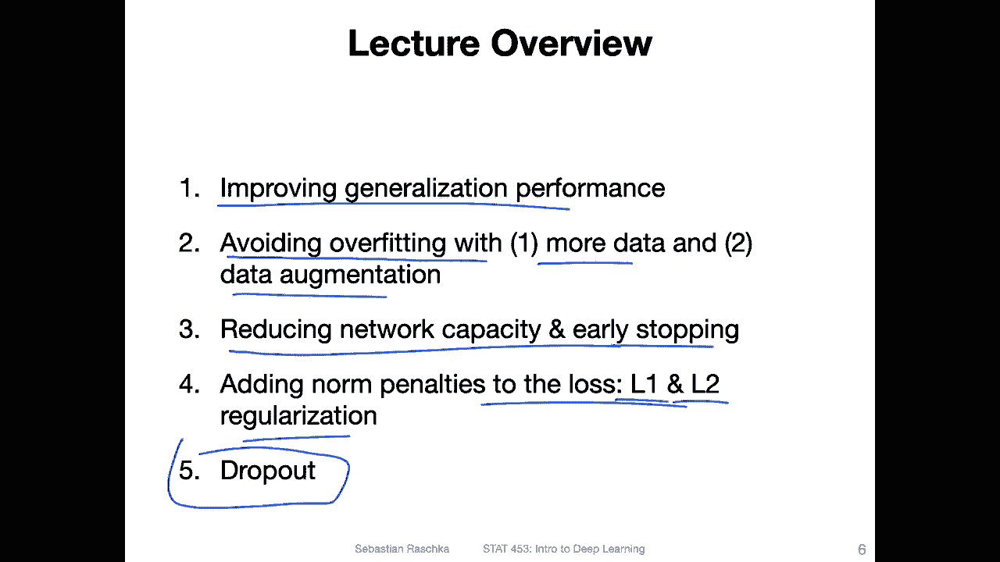
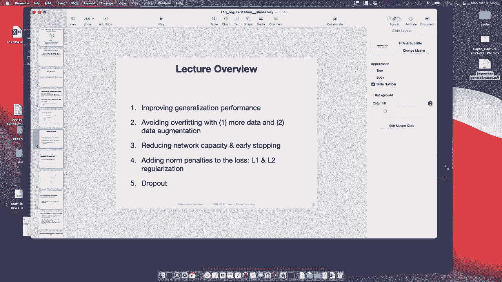

# P72：L10.0- 神经网络的正则化方法【课程概述】 - ShowMeAI - BV1ub4y127jj

Yeah， hi everyone。 So in the last lecture， we covered multilayer preceptrons。

 So you are hopefully now able to train deep neural networks。 Yeah。

 that brings us also to the topic of how do we make neural network training better。

 So how do we produce better models。 Last lecture， I talked briefly about the problem of overfitting And now in this lecture。

 I want to yeah present you with some techniques to tackle overfitting。 So yeah。

 if you recall last lecture。 we talked also about the custom data models。 And yeah。

 putting two things together the first topic I want to talk about today is yeah augmenting training data points。

 So in that way we there are some capabilities that say that allow us to modify， for example。

 image data very conveniently in in the context of custom data models For example。

 what we can do is we can randomly rotate the image little it to the left or to the right And with that we can very cheaply produce new new training examples and help the model to become more robust。

To yes， small perturbations in a data set。Then after that I want to talk about a bag of techniques called regularizations and with regularization。

 I mean like making also or reducing overfitting， making the model less sensitive to also small perturbations in the dataset so one technique would be early stopping or stopping the training early。

 however， I think this is something I wouldn't maybe recommend really in practice anymore。

 considering the double descent phenomenon that I explained to you in the last lecture。

So there are other techniques for regularization that we can use， for example。

 one is L2 regularization， So you have probably already heard about L1 and L2 regularization in other statistics classes。

 it's basically shrinking the weights。 So you probably have heard of it in the context of lasal regression or rich regression。

 So in this lecture I want to show you also that we can use the same concept for neural networks。

 And then I will introduce maybe one of the most common and popular techniques for regular regularizing neural networks and that is called dropout。

So in dropout， we randomly drop units in a neural networks。 So in the hidden layers。

 And with that we yeah help prevent the network from becoming too reliant on particular neurons。

 So by randomly dropping some neurons during training。

 the network will learn to use other neurons or to not rely on particular neurons so much and that also helps helps with making the network more robust。

 Of course， there are many other techniques to improve neural network training。

 we will talk about this in later lectures， for example。

 yeah different weight initialertization schemes， batch normalization also choosing different optimizers and so forth。

 So these are just techniques I'm presenting right now that affect the structure of the neural network or not the structure。

 but let's say the weights。But yeah， later on， we will also use techniques that modify the optimizer and also affect yeah the normalization of the input samples or hidden layer activations with that。

 yeah， let me not make the introduction too long and let me just get started with the lecture。Yeah。

 one of the goals of this particular lecture is to reduce overfitting。

 So we haven't talked about this in too much detail。 But in the last lecture。

 I briefly mentioned the bias variance decomposition。 So， for instance， imagine。

You have a prediction or label。 Let's say a continuous target。 Y let's consider a regression problem。

And some input feature X。 So this is。Essentially， the model prediction Y。

So there might be some true underlying data， though， let's all function。

 let's say this is a true function f of x。 but in practice we only have access to a training dataset that that has been sampled from the from a distribution。

 for example， and there's usually also some noise。 So for instance。

 the data that we may have access to is。Looking like this。And。We then usually train a model。To yeah。

 get a0。Eror or 100 percent accuracy on the training set。

 But there's usually also have some noise in the training set。

 It doesn't fully represent the or capture the true underlying data because there's usually some noise。

 So a model that we might learn could look like。This， and yeah。

 this would be a model that has maybe too much complexity。 So in that way， it's maybe too flexible。

 there's too much variance， because if I would collect a slightly different data set。For example。

 it's considered a data set。Like this。From the same sampled from the same true function。

 from the distribution， underlying this function。 But there's。

 let's say a little bit of a different noise。 I mean， the noise is the same。 It's constant noise。

 but just due to randomness， the data set， the training dataset may look a little bit different。

 And now let's say the model might look like。This。So you can see these are yeah very different models。

 Let's say I use the same exact same algorithm。 If I do this many， many times。

I may end up with many different models。And yeah， this has， we can think of it as a large variance。

 If I have a lot of these models， though， let's say infinitely many。 and I average over these models。

 I should get though， should get。This function here， if I would average over infinitely many models。

 However， each model itself has a high variance。So in this lecture。

 we will learn about techniques that can reduce this variance。 So， for example。

 instead of on this red line that I was showing you， that was relatively complicated。

 we may learn a simpler model that may look like this that has。Smaller or lower variances。

For instance， if we also consider the other one。Well， actually， I can't do。 yeah， this way。

So also for this one。It can maybe consider a simple model that is not so exaggerated， like。

 like this。So these techniques kind of simplify the model， but of course。

 we want don't want to simplify it too much because then it might not even fit the training dataset set well enough anymore。

 for example， if I make the model too simple， if I constrain it too much。It may end up looking like。

This。And this might be a model that is too simple， but it really depends。 So here in this case。

 I can tell it's too simple because this is more like a quadratic function， the true underlying data。

 whereas I now have a linear model。 So let's say like logistic regression。

 So that's usually a sweet spot。 We want to reduce the variance to， yeah reduce overfitting。

 But then we also don't want to make the model too simple。

So there's an umbrella term called regularization， so regularization broadly means yes。

 the process of adding information or changing the objective function to prevent overfitting。

 So what I mean by changing the objective function if you heard about L2 normalization that is usually a constraint that we add to our loss function we will talk about this in this lecture。

So yeah， broadly speaking， it's making changes to the learning process to prevent overfitting。

So there are many different techniques for that for having oil yeah。

Regularizing models or having a or adding a regular rising effect。

With a goal had to reduce overfitting。 So the common techniques that are commonly used as are early stopping L1 and L2 regularization。

 actually， L1 is not that common。 L2 regularization is a bit more common。

 but also not that common anymore in the context of deep learning because most people usually use a technique called dropout。

 which we will also talk about today。Yeah， while the traditional。

Definition of regularization is the process of adding information in order to solve an illpost problem or to prevent overfitting。

 of course， like with so many other things， machine learning and deep learning have special。

 I would say altered uses of the same term that's always yeah interesting to see how terms get adopted in the context of machine learning。

 So in the context of machine learning。People also sometimes refer to regularization as any modification one makes to a learning algorithm that is intended to reduce its generalization error。

 but not its training error so I just wanted to yeah mention that yeah the term is it's kind of related but not quite the same so here we are basically in this lecture interested just in yeah lowering also the generalization error。

So the techniques are the topics I wanted to cover here in this lecture。Outline here。

 so there will be five main topics， one is essentially just an overview of different techniques for improving generalization performance so I just had a spontaneous brainstorming session and wrote on of some of the methods that came to mind because we can't cover all of them in this course because there are just too many of them but they might be useful to you and you are working on your class projects so I wanted to mention them。

And yeah， then we will talk about。Avoiding overfitting with。

One also the first point would be adding more data。

 and the second point would be by modifying existing data that is also usually， yeah。

 very worthwhile。And then yeah we will talk about reducing the complexity of the model like reducing the network capacity and early stopping。

 So that means stopping the training process early when we observe that we have a good validation performance and further training would make the performance worse。

Then we will talk about a classic technique called L2 regularization。

 also a little bit about L1 regularization， although it's less commonly used。

And then these just briefly， these are methods here for modifying the loss function like adding a penalty and then finally we will talk about the probably most common method that is currently used in deep learning I mean that of course also other methods but dropout is still one of the most common methods。

 It's essentially a method for randomly dropping neurons and we will see how that can help network performance or the neural network training performance and generalization performance。

Alright， so then let's get started with this overview and then we will cover these other topics。

