# P74：L10.2- PyTorch 中的数据增强 - ShowMeAI - BV1ub4y127jj

Yeah， in practice， one of the best ways you can improve the performance of your model is really just to focus on the dataset set itself before you yeah do anything more fancy。

So in this video， I want to briefly talk about two ways for improving the performance by focusing on the data。

 one is by collecting more data， and the other is by commenting the data that you already have。

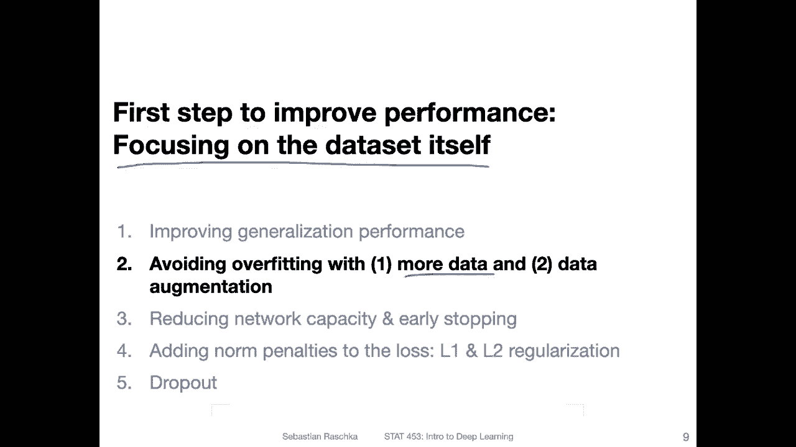

So how do you know whether more data could be good for your model。 So there's a technique called。

Learning curves or the techniques。 let's say。The method。It calledia making a learning curve。

And how does that work。So here I'm showing you an example where I made an learning curve for Softmax classifier。

Using the M or a subset of the Mnes data set。 So why the Somax classifier that was。

 yeah when I made this it was just quick because Somax is faster to train than a multi layerer receptionceptron。

 So that was more like for efficiency reasons， but this should work for any type of neural network to help you find out whether more data is useful。

So what you can see here is on the X axis's on different training set sizes。

 so I was changing the size of the training set that I used for training the Somax classifier。So。

 I was。Varying it from here。It's maybe around。100 training examples up to here。

 it's around 3500 training examples。 I was changing the size of the training set。

But I was keeping the test set size constant。 So I was using the same exact same test set。

Just different models， because the training set sizes were different， so。In the beginning。

 so let's just briefly talk about the training set accuracy to get it out of the way so you can see that the training accuracy goes down when we add more data So why is that。

 I mean， this is like a little bit unintuitive and this does not always happen I think here it's just because it's such a simple model So if you have a very small data set actually it's easy to overfit the data So you will always find if you have a very small data set that you have high accuracy and then it goes down。

 but usually it also it might go up again if you have more data。

So I wouldn't pay too much attention here on the training set accuracy。

 what's actually more interesting is。That the tested accuracy goes up。Right。

 so that is what we want to see。 And here you can also see here。

 the gap between training and test set performance shrinks。 So whether。

The training accuracy stays constant or not， doesn't really matter whats remembering is that a test set accuracy goes up。

 and just by that fact， even if the training set here would be constant， we would reduce overfitting。

So that way。We don't know really what happens beyond 3500， right？

 So we have no idea what's going happen in。Let's say， in this region between。

3505000 or even beyond that。 But just by looking at this slope here， if you just look at that slope。

 you can， yeah， you can just argue or imagine that。嗯。

Performance might even improve improve further beyond here。

 So here it might just be a good idea to just collect more data。 So， for instance。

 if this is like really what's going on， then by just collecting。Thousand more training examples。

 You could already increase yeah， the。Performance from， let's say，'s yeah，91% to。

Maybe up to 93% here。So it's 2% points in this very high region here already。 But， of course。

 this is only speculating。 but yeah， sometimes。Adding more data helps and this can be diagnosed by making such learning curves。

 One thing I should say， though， is maybe you shouldn't use the test set for doing that because you should only use the test set ideally once at the very end instead of using the test set you may want to use the validation set。

 So in the previous lectures， you always use the validation set during training。

 it's usually a better idea to not use the test set So just want to clarify that。Okay。Yeah。

 that would be one way of finding out whether more data helps。 The other topic for this video is。

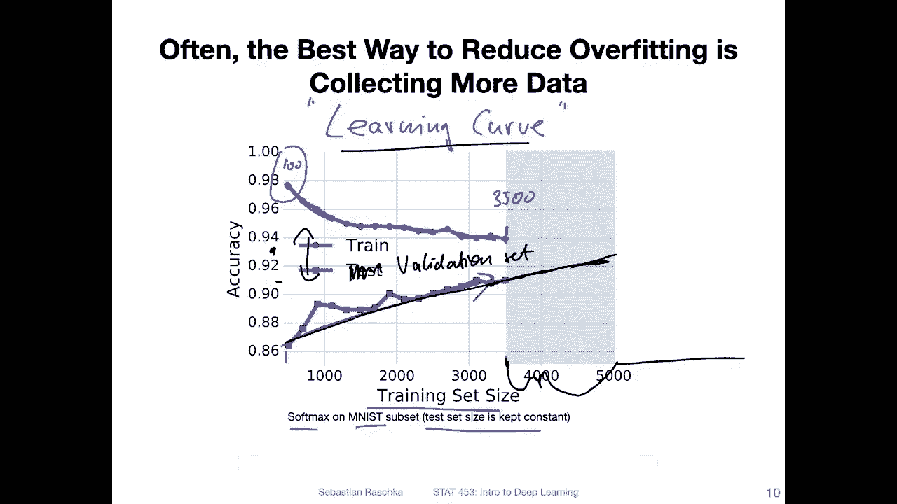

Looking at data augmentation， like modifying the data that you have already。So here at the top。

 I'm showing you again a snapshot from ML。So here are just some example images from M list。

 And at the bottom， I'm showing you randomly augmented versions of that。

 So what you can see is here they are slightly zoomed in。But moreover。

 you can also see this one is slightly rotated to the left compared to this one。

 so these are really pairs。This is slightly rotated to the right and so forth。

 So I'm creating modified versions。 So why would I do that， So those can really help the network。

To not memorize exact pixel locations， right， because for instance， it might memorize， I know。

 these two some locations here， just memorizing them， but if you randomly rotate it。

 it can't exactly memorize these locations。 it has to learn more than just these locations。

 it has to more learn the shape or at least a couple of more locations， right。

 because it can't always rely on these positions， it has to learn the relationship between these positions。

So that way， data augmentation can be a cheap way of helping with a generalization performance。

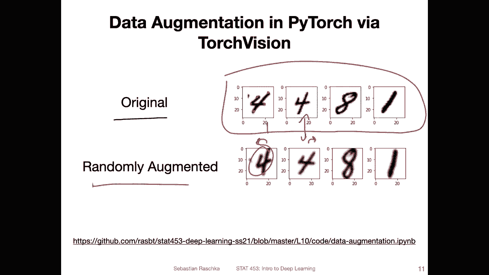

So I don't want to go into too much detail， I mean like making a new video for the code notebook because yeah。

 I would maybe take too much time and it's not necessary because it's actually pretty straightforward and I can describe this here。

 I think on that single slide。If you want though， I have the whole code example here on GitHub。

 which you yeah should be able to run just from there， I will also post the link on Cans of course。

So recall in the last week's lecture we talked about these custom data loaders where we used the data set。

So here Im showing you again the data set。 So but last week， when we did that， we used。

A simple transformation here is the argument for transform。We used two tensor。

 which was just converting an image into a Pytoch tensor。

 Now we are using a fancier version let's call it， let's say we call it training transforms and training transforms is shown here on the top So let's discuss that first。

So we are using a library called Torch Vi for that and this one should already be installed when you installed Pytorch。

 So if you go to Pytorch。org and execute the installation command。

 you may have noticed that it already included Torch vision。So here。

 what you can see is that we are using To vision， the transforms sub moduleule。 and there's a。

Compose class， which lets us chain different or multiple transformations。

 So here I'm just showing you a selection of those， but there are， of course。

 more of them that you may find online here on this website as's a whole bunch of those。

 So here I'm using resize random crop， random rotation。 And then to tensa and normalization。

 So let's talk about them 1 by one。 So resizing。 So Mnes images are 28 by 28。 here I'm resizing it。

 making them slightly larger。 and then cropping them back to 28，28。 This is essentially。Yeah。

 zooming in or cropping a random region from that image。

So why am I doing that I mean it's not always helpful in the case of Ms it's maybe not always such a good idea because I mean it's not technically necessary。

 but if we do that consistently for both the training and test set if we zoo in both。

 then this is essentially similar to translating the image so moving it slightly to the left and to the right and top and bottom。

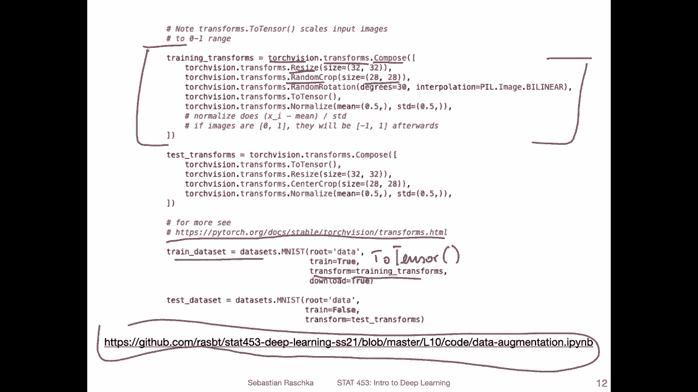

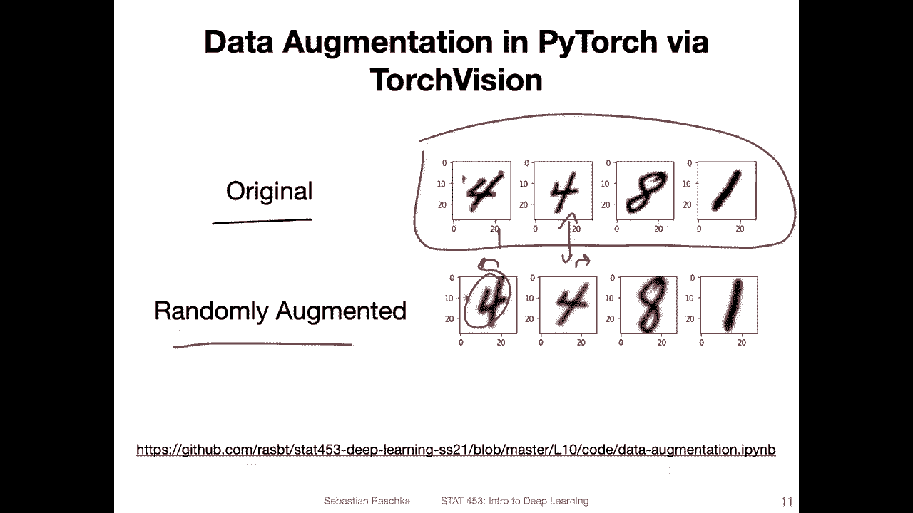

Because yeah， I should say for it。 We'll talk about the test transformation in a second。

 Let's finish the training set。Transformation there we do the resizing the random crop。

Then I do also a random rotation。 So here up to 30 degrees。 So30 degrees to the left。

 up to -30 degrees to the right。 So this is randomly。 Sometimes it's a small value。

 Sometimes there may be no rotation。 So it's really random。

 So this helps us like really almost creating infinitely many new flavors of our existing images。

 I'm using this interpolation here。 It's， I would say it's， it's not ideal either。

 but it's better than the default。 So you can see it it looks a little blurry。

 but it also something to do with zooming。

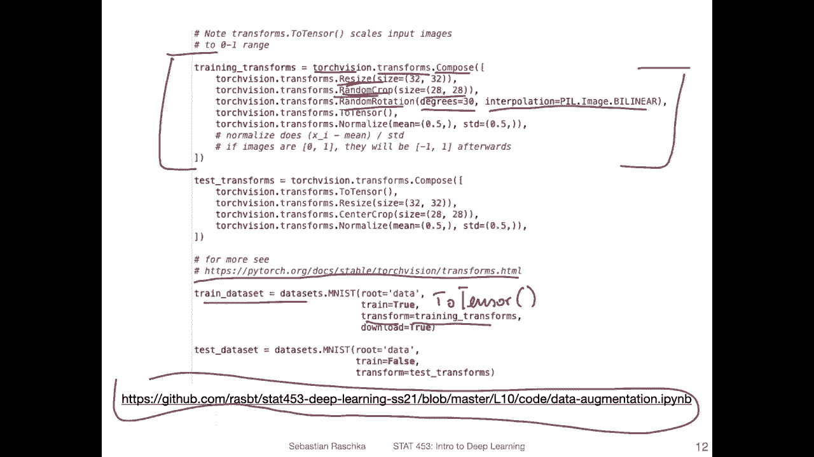

But if you don't do that， you will see these images are a little bit more， I would say jagged。

 So the edges are a little bit more jagged。 So in that way there's no idea way I find this one is slightly better than the default。

 but this is really up to you which one you use， you can also actually ignore that if you like。

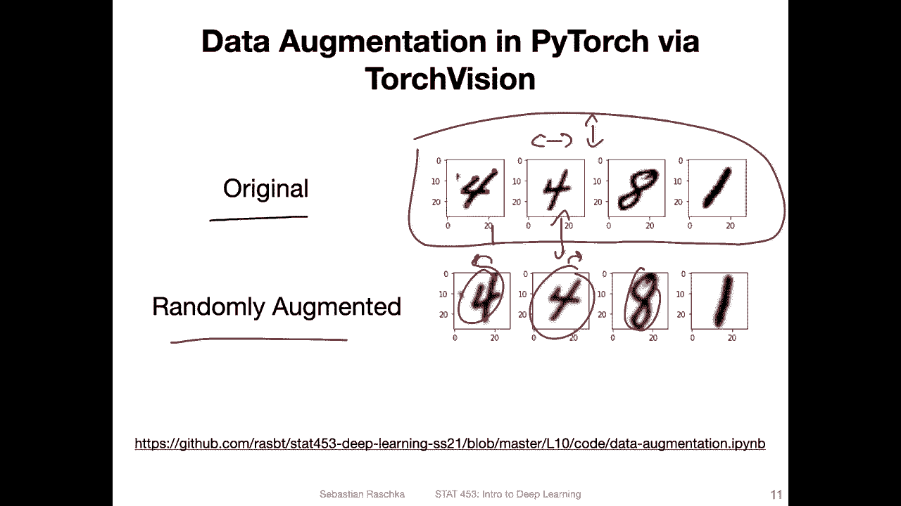

Yeah， then we are converting。 So here during these steps， the data is still in an image format here。

 it's then converted to a Pyt tensor and。By default to tensa will， like we discussed。

 will normalize the images such that they are in a 0，1 range。But for gradient and descent。

 it might be better to have unit variance and0 mean。 So having them stand standardized。

 So how can we do that， So there's a normalizedize。

Transform here so where we can choose a mean and a standard deviation。So in this case。

 because we know the data range for each feature， it's the same。

 It's the pixel values between 0 up to 255。 or in that case， if we normalize them between 0 and 1。

What we can do is we can choose 05 as the mean and 0。5 as the standard deviation。

 And then the images will be afterwards in the -1 to1 range。

 So why is that standardization works like that if we have。An input feature。

 as let's say this is our normalized feature。 It's a pixel position， and then。We subtract。

For this given。Pixel， the mean。Over the pixels， over all the pixels and the data set in this position。

So let's call that feature J。嗯。This is the mean for feature J。

 and then we divide it by the standard deviation for feature J。

And this will give us yeah unit variance and zero mean。

 so standard deviation of one Here we are choosing these values such that we have a zero mean。

But third deviation。Also of one， sorry， yeah。So that is what we are going to do here。

 So the images will be in the range-1 to1， because the largest value is one。 So one。

Let's slowly1 minus0。5。Yes。5。Divided by。Po5。This is one， right。So， and if。The input pixel 0 0 minus。

5 divided by 。5 is1。 So they will be in the range between minus and1 in this case。 Alright。

 so this is how we could augment our input images。For the training。

 but we have to be careful now for the test set。 we don't want any randomness in the test set， right。

 So here we are doing things randomly。 we don't want any random， as usual in the test set。

 So here I was actually for the test transforms。 I was removing all the random parts。However。

 because I used resizing and random crop。I also should use them in the test set to have things consistent。

Otherwise， all the tested images will look smaller than during training， which might not be ideal。

 So here I'm using the resize， but I'm using a center crop。

 so it's cropping the region in the center rather than randomly。

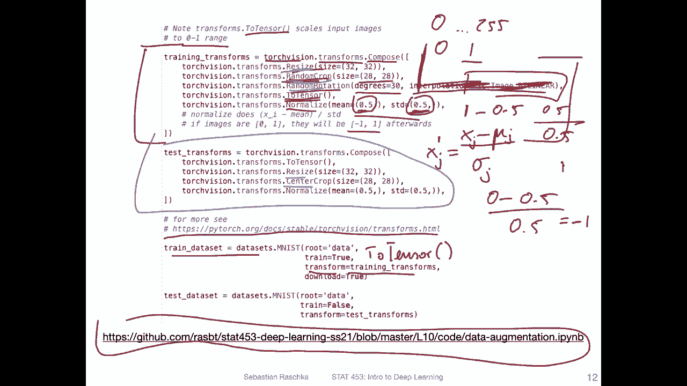

So if I go back one slide。嗯。For instance， it's hard to see here， but they are。

 they are almost like center crop here。 But so this one is maybe slightly。To the left。

 So if that was a testing image， it would might be more to the left here。

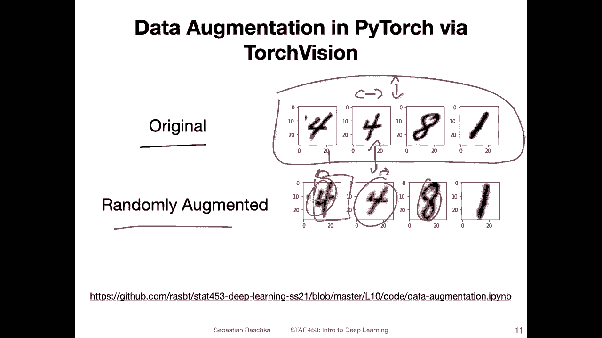

So in that way we avoid randomness here Okay yeah and like I said。

 we are providing the train transforms to the data set here and the test transforms to the test set here。

 and we would also use the test transforms for the validation set。

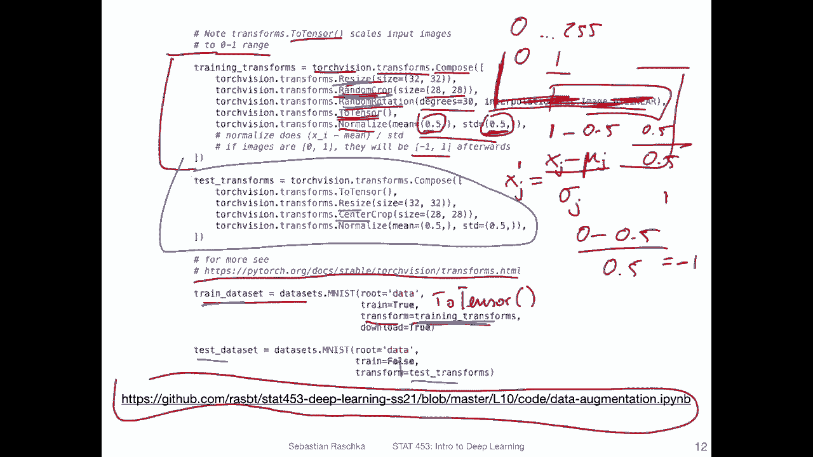

Alright， so yeah， I should maybe also add we only have one colored channel for MN。

 So if we work with RGB images， we want to also make sure that we do the standardization for each color channel。

 So if we have RGB。We would have。Three of these values in practice。

 people also sometimes compute the mean and deviation over the whole data set by themselves。

 basically for each channel。But that is a little bit more work so you can do that。

 Sometimes people also use these statistics from the imagenet data set。

 but in practice I find it makes only a small difference whether you use the actual mean and sat deviationation of the data or you just use these placeholder values。

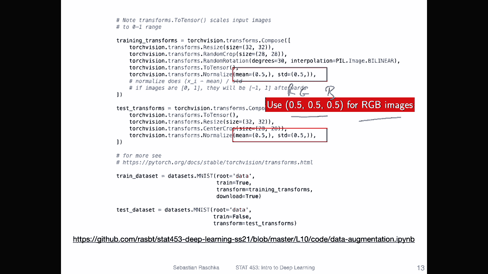

Alright， so these were like two ways you can improve the performance by just looking at the dataset that is by plotting these learning curves and augmenting existing data in the next video I want to show you yeah how early stopping works I mean。

 just illustrating the concept of early stopping we have briefly seen that or discuss that or in the previous pick when we talked about double descent。

 but yeah I just want to recap for completeness how early stopping works。

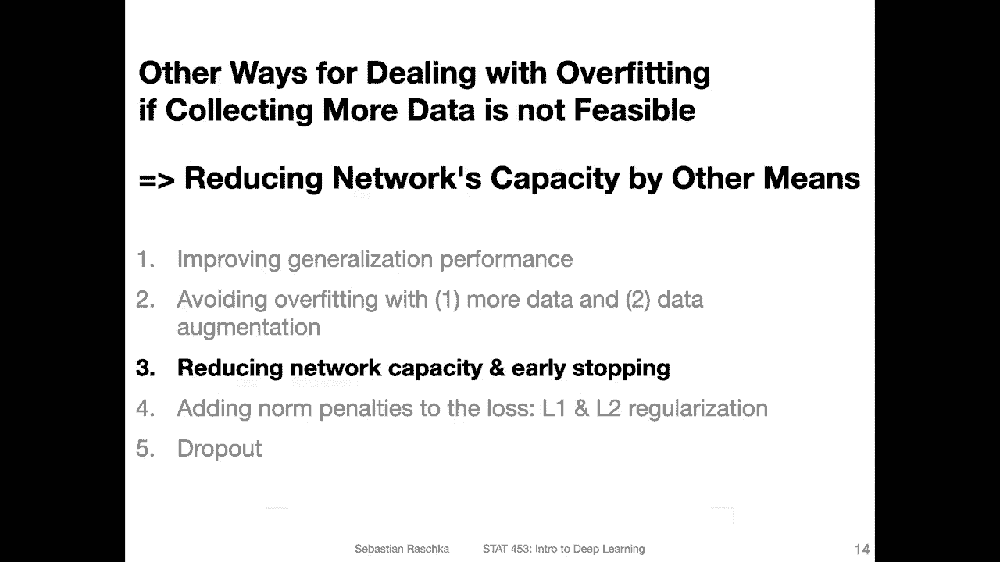