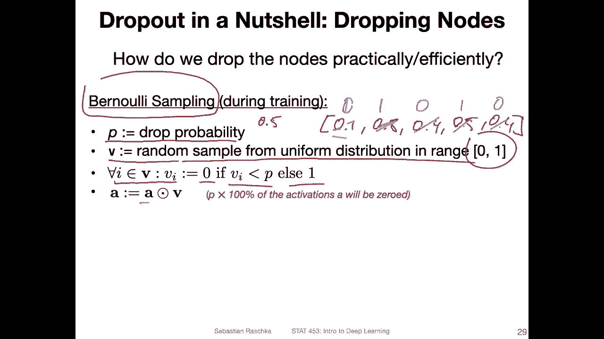
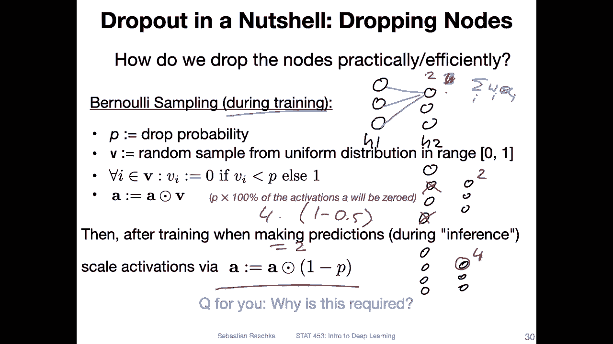
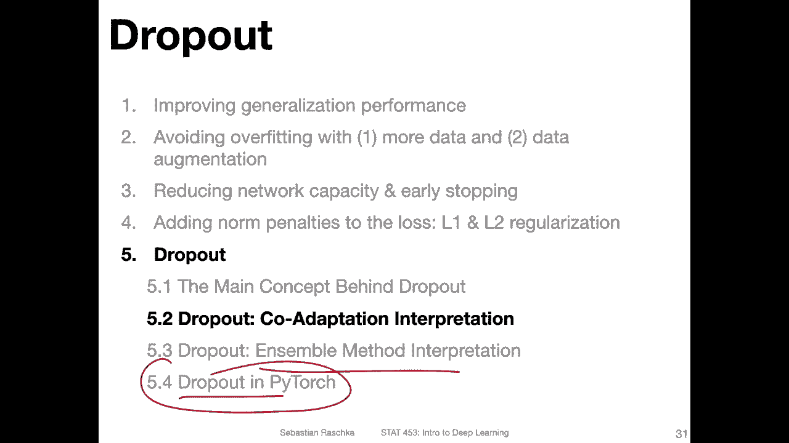

# P77：L10.5.1- Dropout 背后的主要概念 - ShowMeAI - BV1ub4y127jj

Yeah， no， we are finally getting to the more interesting part of this lecture， talking about dropout。

 Or at least that's what I find a little bit more interesting because it's a method specifically developed for neural networks and not just an extension of generalized linear models。

😊，So to keep things a little bit organized， I split this topic into four sub topics。 However。

 don't worry， these will be probably very short videos。 So there are not many slides per topic。

 but I thought it's just simpler to organize it this way。 So in this first video。

 I want to just give you the brief big picture overview the main concept behind dropod。

 and then we will talk about the co adaptation technique not a technique interpretation of dropod。

 And then we will talk about the ensemble method interpretation。

 And then we will see how we can do that in Pytorch。

So for reference， if you're interested， you can later also check out these papers。

 They are pretty nicely written and not too complicated。So these two papers， as far as I know。

 are the original papers proposing dropout。 So one goes back to 2012。

 It's entitled Iroving neural networks by Preventing Co adaptation of feature detectors。

 So like I mentioned， we will see what this core adaptation interpretation means。 later。

 And that's also another。Interpretation， it goes back to this second paper Dout。

 a simple way to prevent neural networks from overfitting。

 This is like the more like the ensemble interpretation。 But yeah。

 we will talk about this in more detail。 I just wanted to give you these references for these methods。

 So if you want to check out more details， you can find them here。

So what is the main concept behind dropout。 So in a nutshell， it's yeah about dropping notes。

 So suppose you have a multi data perception here。 That's a very small one。

Essentially it's doing training randomly dropping node。 So for example， here， as shown。

 you would randomly drop this node with a certain probability so。

If you say the dropout probability is 0。5 like 50%， then during training for each note。

 you would say with 50% probability， I will just delete it during the forward pass。

And in each training forward pass， it will be， yeah， different nodes that will be deleted。

Because it's a probability。 So you randomly create different models。 So one。

Forward path might delete。This one， another forward path would have these two deleted。

Another forward past may have。This one deleted and so forth。 So why that is useful。

 There are a couple of theories， and we will talk about this。

 here' just like the big picture overview how it works。 I mean， like what the main， what。

 what's happening basically。 And then why that helps that is a topic for the next video。

Yeah， now the question is， how can we implement that efficiently。

 So how can we implement a dropout without having to make any major modifications to our neural network architecture like deleting nodes or something like that。

 So how can we just do it conveniently。 So one way would be by implementing a beulli sampling procedure？

 So for that， we can define a drop probability P。So for example， this could be 50%。Wow， let's see。5。

 that's our drop probability。 So with that probability for each given node。

 the it's the probability that we drop that node。Now。We create a vector here。

 So it's like a random vector， a random sample from a uniform distribution in the range 0 and 1。

 So this vector will have the same number of elements as the size of the hidden layer that we want to apply dropout to。

 So dropout is only applied to hidden layers。 It's not applied to the output layer。

So now let's say we have done that。 We have， let's say， five units in our hidden layer。

 So we have five numbers between。0 and1。I'm just writing down some arbitrary numbers here。Oops。

Like this。And。Now， that is when we apply basically a benoli sampling where we say for each value in that vector for each value V。

We set this value to 0。 if this value is smaller than a drop probability， otherwise we set it to1。

So we are modifying this now that it is a binary vector。 So this one is smaller than 05。

 So we set it to。One， this one， oh， sorry， should be0。 This one is greater。So we set it to one。

 This one is smaller。 so we set it to 0。 this one it's on the border。 we have defined smaller。

 so let's set it to one。And then this one would be also。0， so we have now this binary vector。

And then we can simply model or multiply the binary vector with our activations a。

 So these are the activations in our hidden layer。 And then now we have effectively cancelled activations and。

Yeah， that's it。 That's how we can apply dropout during training。

Okay， so but there is one little thing we have to adjust if we want to use our model for inference。

 like making predictions on new data or even computing the test set accuracy。So， yeah。

 the reason is we don't want to have any randomness when we make real world predictions， right。

 So it would be a little bit awkward if let's say we predict some， let's say credit scores。

 but sometimes random nodes get dropped。 So the customer would on different days get different credit scores。

 although nothing else has changed。 So that way， we don't want to have any randomness during testing。

 So the dropboard is only applied during training。So what effectively。

 what it means we don't do any removal of the nodes during testing。 However。

 there's one additional thing we have to do when we want to remove the dropping of the notess and that has to do with the scale of the activations。

 So assume I have a multi layer perceptron。With multiple hidden layers。

 let's call that hidden layer H1 and this hidden layer H 2。

 And they are fully connected to each other， like always。

So now if I drop one of the nodes though in H1 by a dropout， let's say I do it like this。 Well。

 let's say。Let's say it like this。 Each value here is the same。 The weights are all one。

 and the activations are all one just to keep things simple。So。If this is the case。

The activation at that given note here is 1 times 1 plus 1 times 1。Plus1 times 1， it's 3。Right。

 so if I have the。Some over。The widths。And。Activations from the previous layer， I sum that up。

 the net input。 Let's say the net input is 3 because all the weights and all the activations are one just for simplicity now。

If I drop one of these nodes during using dropout。Then now I only have two inputs。 So the value。

Now is only two instead of three， because I only have two incoming。

Activations when computing the net input。Okay， so that means， I mean。

 this doesn't have any or is not a problem during training， Of course， I mean。

 this is just like some arbitrary numbers I'm showing you here。

 but now if you don't do any dropout during testing。All the activations will be larger right。

 so during testing， we don't have any dropout。So， the values。

Are actually larger than during training。 During training， we had a value of let's say2。

 and during testing， we will have a value of 3。However。

Everything in the network is kind of has learned to work with these smaller values。 So the threshold。

 let's say， in the last layer for the prediction would not really work for。

For these larger values now， because yeah， we have all now throughout the whole network。

 larger values because we don't drop any node。 and that could be awkward。

 So what we do is we just scale these activations。 That's like a very simple trick to deal with this problem。

 So let's say。We have a drop probably of 0。5， and we have an activation of three， one let's say。

We had two during training。Because this one node got randomly dropped。 I mean。

 this is just a simplification。 And then doing testing。

 the value here that comes in here is 3 because there is no dropping of any node。

 So we have now this problem that this too large。 So how can we do it get it smaller。

 we can just scale it by one minus the drop probability。 So in this case， okay。

 this doesn't make quite sense because this is not an even number。Let's。

 let's do it proper properly here。Sorry， so let's do a network where we have 1，2，3，4 and one，2。

3 nodes here。 same thing applies during training， we drop 50%， so we drop。Two nodes randomly。

 So the value during training we get is2， but during testing。We don't。Drop anything。

 So the value we may get at this note here is no 4。So how do we scale it。

 We can scale it by  one minus the probability， for example， can have then 4 times 1 minus。

5 which is 4 times 0。5 which is essentially 2 So in this way we scale all the predictions during training testing sorry so that's like a simple trick to deal with these activations that might be too large during testing and yeah this is essentially how dropout works。

So in the next video， I want to talk about the core adaptation interpretation。

 So one way to interpret， drop out why it might work in practice。

 Then there's an alternative interpretation looking at。Dropout as an ensemble method。

 And then I will show you how we can do dropout in pyrch。

 And there's also a concept for that called inverted dropout， which will be interesting。

 It's a slight modification of what I just talked about。 It's called inverted dropout。

 I will call talk about that when we yeah talk about the implementation。

