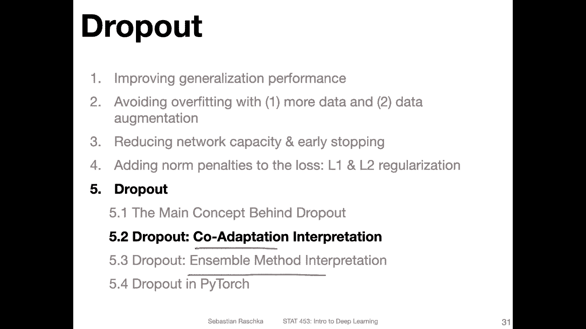
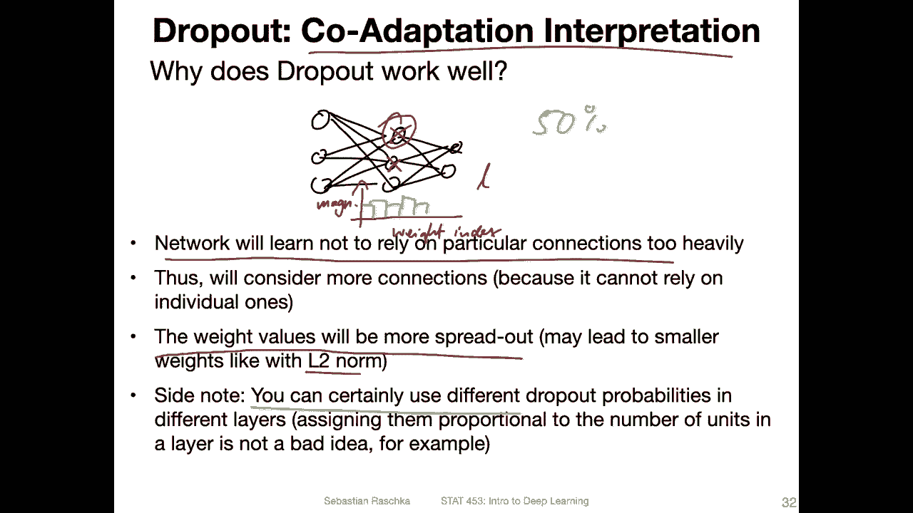
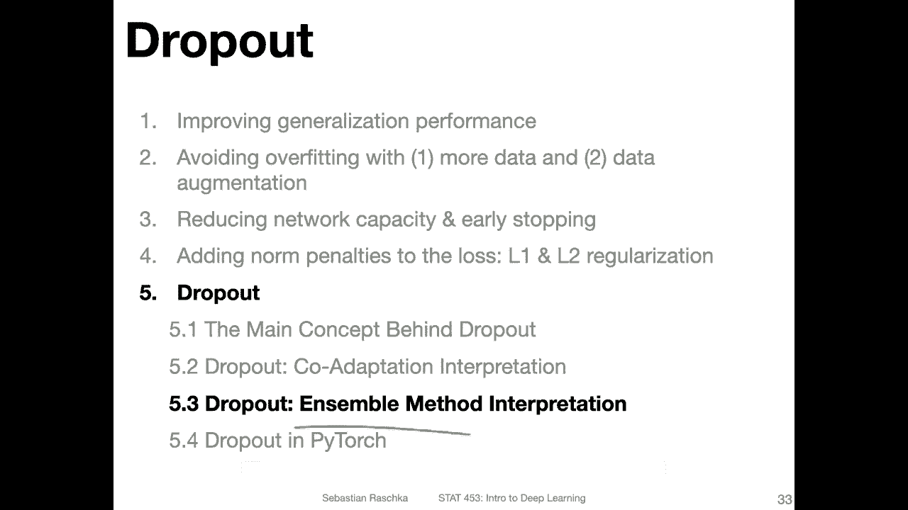

# P78：L10.5.2- Dropout 共适应解释 - ShowMeAI - BV1ub4y127jj

Yeah， now let's try to understand why dropout might work well in practice。 So why would it help。

 Yeah， making the network perform better in terms of generalizing better to new data， For instance。

 the test set data。 So one， yeah， one interpretation is this co adaptation theory。

 So we will talk about this briefly。 And then the next video will。Talk about the ensemble method。

 interpretation。

So yeah， the core adaptation interpretation refers to the fact that now the network will learn not to rely on particular connections too heavily。

 so with that， I mean if you have a multiplayer perception like that。And everything is like。

 always connected to。Everything else。So if we have something like that。

Then if let's say this neuron is not there during training just randomly。

 then the network will rely more on these neurons compared to this one single neuron。 And vice versa。

 for example， if this is not here， the network will use these two。 And during training。

 it's always a different neuron or there are different neurons that are canceled。 It could be one。

 it could be none of them， it could be two of them things like that。

 So there are always different combinations of neurons being canceled， So the network can't rely。

On one neuron too heavily。 And in that way， it will consider the others more。

 And this could cause the weights to be more spread out， like that it will try to put。

Weights on all the neurons instead of having a large weight for let's say。

 one neuron and small weights for the others because it can never count that this particular neuron will be there。

 So in that way， it does make sense to put too much weight on that neuron。

So and let's this could have then a similar effect as the L2 norm。

 where the weights will be more spread out and more uniform rather than being like yeah non uniformly distributed。

 It might be actually interesting， I'm not sure if someone has done that before。

 but just plotting the distribution of the weights for each layer。 So for instance， if we have。

Let's say magnitude here on the Y axis。And the weight。Index on the X axis。

 And then if we have different layers that's say this is for layer L。 maybe before dropout。

 we see something like where the weights。Not evenly distributed。 And after dropout。

 maybe we see something where the weights are more。More uniform。

 I'm not sure if someone has looked at this yet。 That might be something interesting to do。 Yeah。

 Also， what I wanted to say just as an add on， you can certainly use different drop out probabilities for the different layers。

 So you don't have to use 50% for every hidden layer。 You can use 20%，80% and so forth。

 it's also another hyperparameter to choose。 So how you have to choose this。

 It's depending on some experimentation。50% was like the original value。

 if I recall correctly that they used in the paper。 but nowadays， people also use 20% or 80%。

And that might be something yet to experiment with。 Okay。

 so this is just like one explanation why dropod may perform well。

 So it's putting nest I would say emphasis on particular notes。

 and then it makes it maybe more robust to fluctuations in the input。 So in the next video。

 I want to briefly talk about another explanation concerning the ensemble method interpretation。

