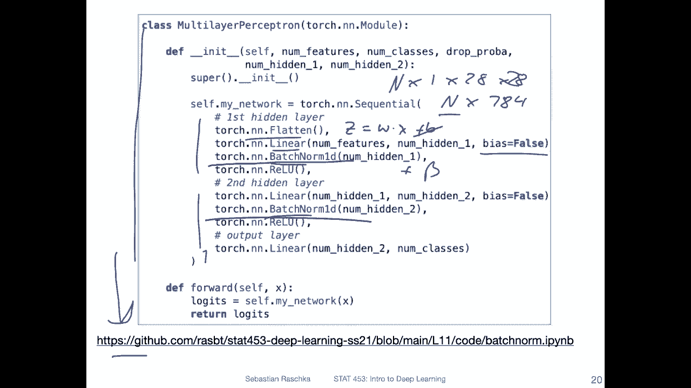
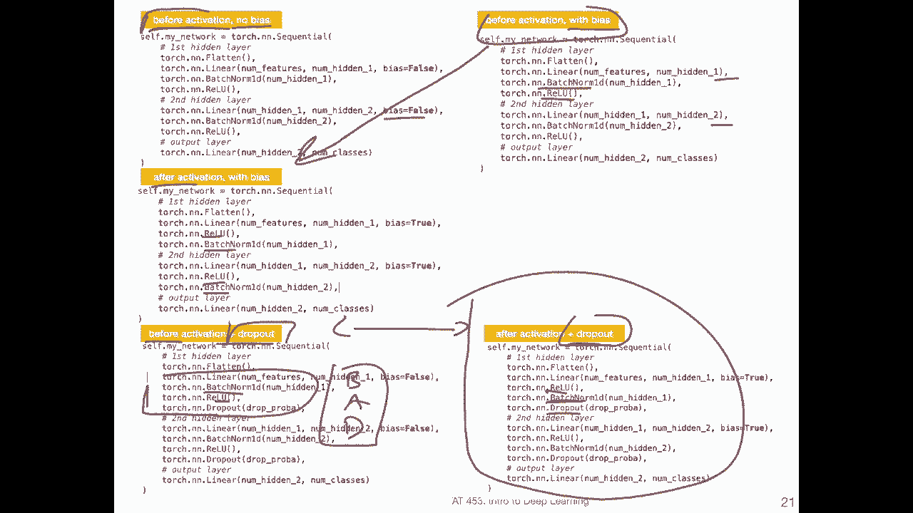
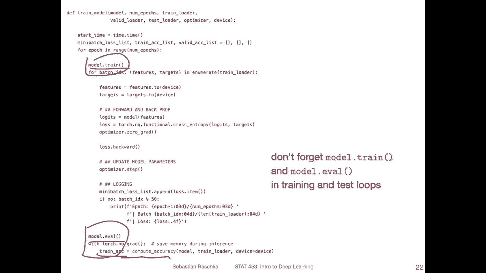
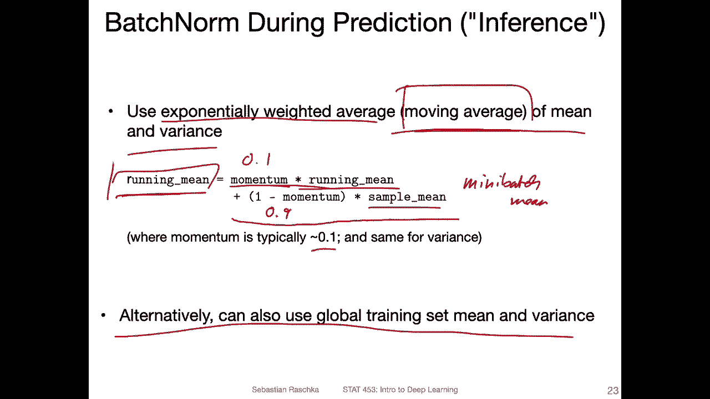
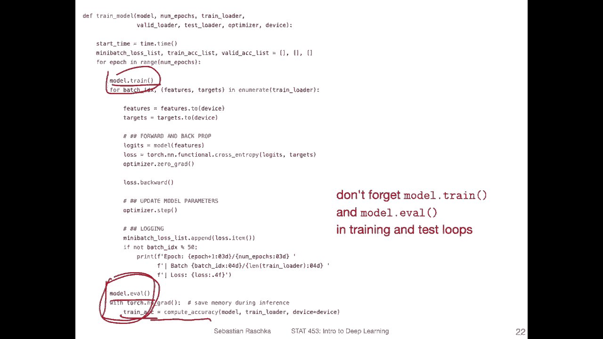
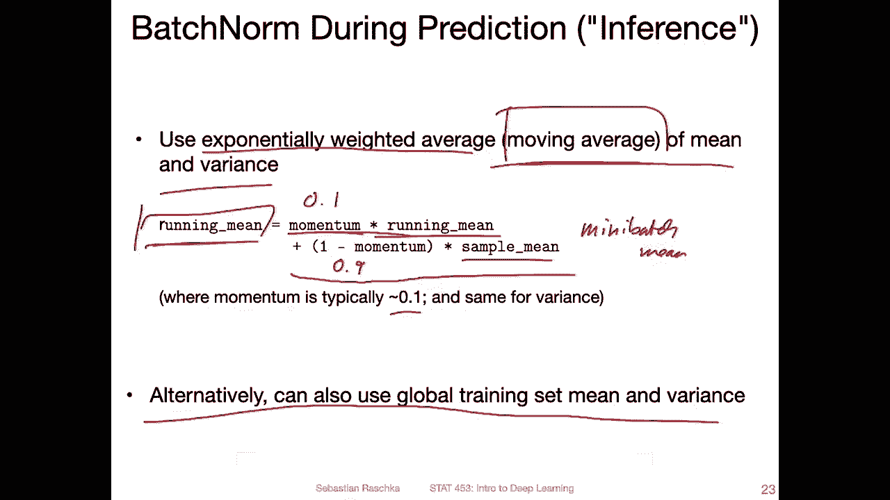

# P84：L11.3- PyTorch 中的 BatchNorm - ShowMeAI - BV1ub4y127jj

Alright， let's now talk about how we can use batch norm in practice。 And also。

 we will talk briefly about how batch norm behaves during inference because， yeah。

 you know that during training， we have mini batches。

 but that's not necessarily the case if we want to use our network for prediction。

 Sometimes we only have a single data points。 So how would that work。So but yeah， first。

 let me show you how patronon works when we use Pytorch。

I've actually just used the code from last week where I implemented dropout and just made a slight modification where I removed dropout and added a batch layer。

 So I was just accept that reusing the same code。 So I don't want to walk through this in detail。

 but you can find the code here on Giub。 And yeah here I'm showing you。The main code。

 the multiceptron that we have to modify and。Yeah so what we have here is1。

2 hidden layers and the output layer at the bottom and first notice that I'm using again flatten that's because I was working with MN and Mnes is on n times 1 times 28。

Times 28 dimensional， and flatten will essentially flatten this to a vector to n times 784 dimensional vector where n is the batch size。

 and then it will work with a fully connected linear layer here。

So yeah I here insert batchome after the linear layer notice that there is a 1 d。

 It may be confusing Why is there a 1 d That's because there is a slightly different version of batchome for convolutional networks。

 we will discuss this in the convolutional network lecture where this would be called beome 2 d for the convolution networks。

 So to keep them apart， This is called beome 1D。 This is essentially just the beome that we discussed here in the previous videos。

 So the 1 d is just yet to keep them apart。Yeah and he am doing the same thing in the second hidden there。

Also， yeah notice that I set the bias to fault because yet it would be redundant right。

 because if we compute the net input as let's say the weight times the feature plus B and then in batch we had this plus Bita values。

 in that way the bias becomes kind of redundant， so it's not necessary。

 but you can have it there it doesn't really matter。

 I ran it with and without it I didn't notice any difference in this case。Okay， so this is how， yeah。

 batchome looks like a full code example can be found here， but there's really nothing yeah。

 nothing really to talk about because it's just two lines of code here。

Yeah， so I was also just for fun running some experiments。

Without the bias that I just showed you and having patched on before the activation。

 that's usually how yeah that was originally how it was proposed in the paper。

But sometimes people also nowadays， it's even more common to have it after the activation。

 I will talk more about that in the next video。 I found some benchmarks。

 some more sophisticated benchmarks I wanted to show you。 So but here in this case。

 when I ran the code of the multilay perceptioncept that I just showed you， I enabled the bias。

 So I'm actually not showing it here， I don't know why I deleted it。 but by default。

 bias is true if you don't set anything。 and。I found it was the same performance。

I then also inserted peton after the activation instead of before the activation like here or here。

 So I now instead of here having it before the activation， I now have it。

After the activation in both cases。 and I also didn't notice any。Yeah， any difference really here。嗯。

Yeah， and then I also ran experiment with dropout。 in this case。 Also。

 I didn't notice much of a difference， except now the network was not overfitting anymore。

 The test accuracy for both dropboard cases was slightly lower compared to no dropout。

 I think I use just too much dropout。 But I could at least see there was no overfitting anymore。

 But yeah， the comparison here is。嗯。Inserting。Ptch on before the activation and then drop out。

 and then。After the activation and then drop out。 And I also did not notice any difference here in practice。

 people， nowadays， it's more common to actually recommend if you use dropout to recommend having beome after the activation。

 And yeah one little fun memory aid to remember that is if you。😊，Consider this case。So we have Peon。

Then you have the activation and then you have dropout。 You may call it bad。

 and it might be better to have beome after the activation。

 That's typically a little bit more common。 In this case， I didn't notice any difference。

 It may make a small difference in other types of networks like convolution networks。 So I would。

 if use drop out。 I would probably go with this variant。 But yeah， of course， it's something。

 It's a hyperparmeter essentially to experiment with。

Allright， so I have one more thing about dropout and Pythtorch。

So when we look again at our training function here。

 this is exactly the same training function that I used last week in dropout。 but again。

 this is again highlighting。Train and evil are important here that we during training。

 set our model into training mode， because that's where beome will compute the running mean and the running variance。

 I will talk about this in the next slide。 So here。

Bchome will actually yeah compute some running statistics during training。

And these running statistics are then used in the evaluation mode when we evaluate a model on new data。

 So during an evaluation， you have to imagine that you are mimicking the inference scenario and an inference you may only have a single data point right。

 so let's say you have the Google search engine and there's just one user running a query and you have a network that has batch So you have to normalize。

But you don't have a batch of users。 So only for one user。 So how do we deal with that scenario。

So there are two ways to deal with that scenario。 The easy one would be to use。

A global training set mean and variance。 So you would compute these means。

For the features and the variances for the features， for the whole training set。

 that's something you would also usually do or could do when you compute the input standardization。

But this is actually not very common in practice。 for some reasons。

 So what's more common is to use an exponentially weighted average or a moving average is just a different name for that。

 So usually。Practice people keep a moving average of both the mean and the variance during training。

 So you can think of it as also as the running mean。 how it's computed is by having a momentum term。

 It's usually a small value like 0。1。 And this is multiplied by the running mean from the previous。

Epoch。sorry， previous mini batch。And then what you so you have this this term。

 this is like the running mean times the momentum term。 This is a 0。1 value。

 And then you have 1 minus the momentum。 This is like a 0。9 value， then。Plus， yeah， plus。

9 times the current sample mean。 So that's the mini。Bch mean。

 and you this do the same thing also for the running variances。So here， essentially。

 this is just like a moving average or a running mean。And you do the same thing for the variance。

 That's what you keep。 And then during inference， you use that one to scale the data point that you do a prediction on。

 You yourself don't have to do that。 Yeah yourself， by the way， by using model evil。

 it will actually happen automatically。

But yeah， here's just like the explanation what's gone happen under the hood。Okay， so yeah。

 that is how batchchome works in Pytorch。

And in the next video， I want to briefly go over yeah， some very， yeah， brief。

 a brief rundown of all the types of literature that try to explain how batchaginome works。

