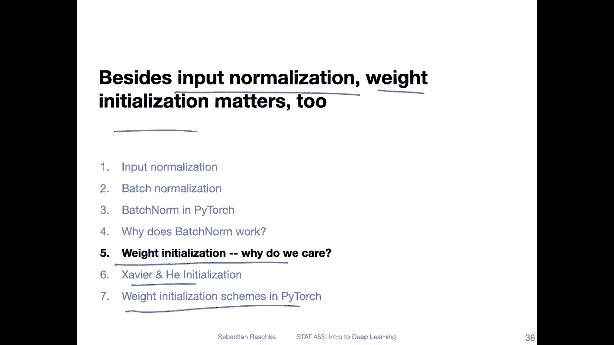
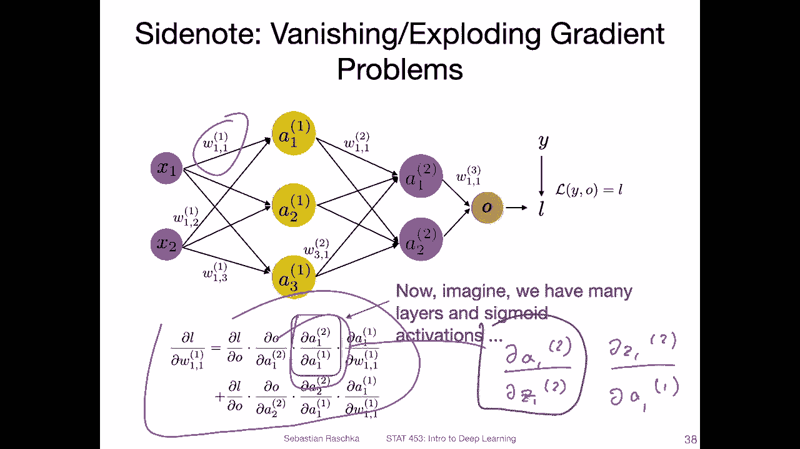
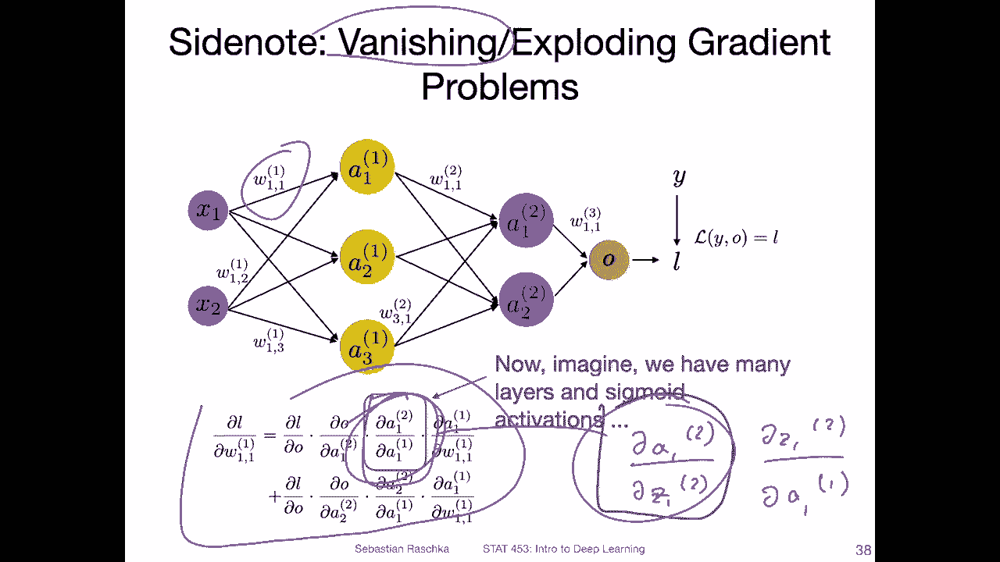
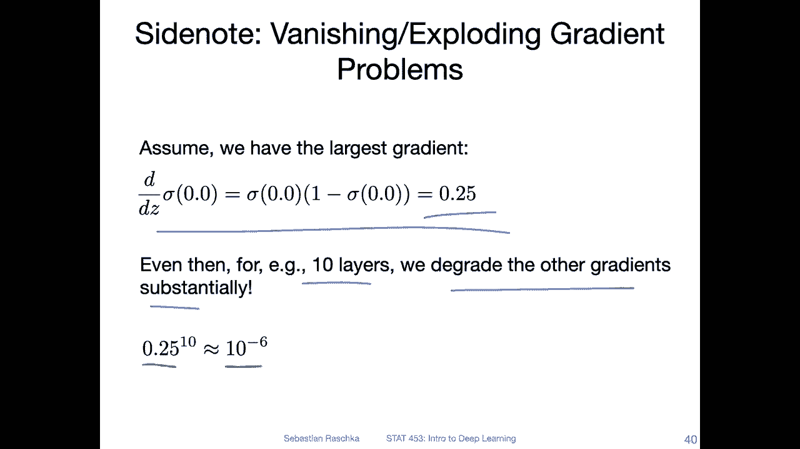
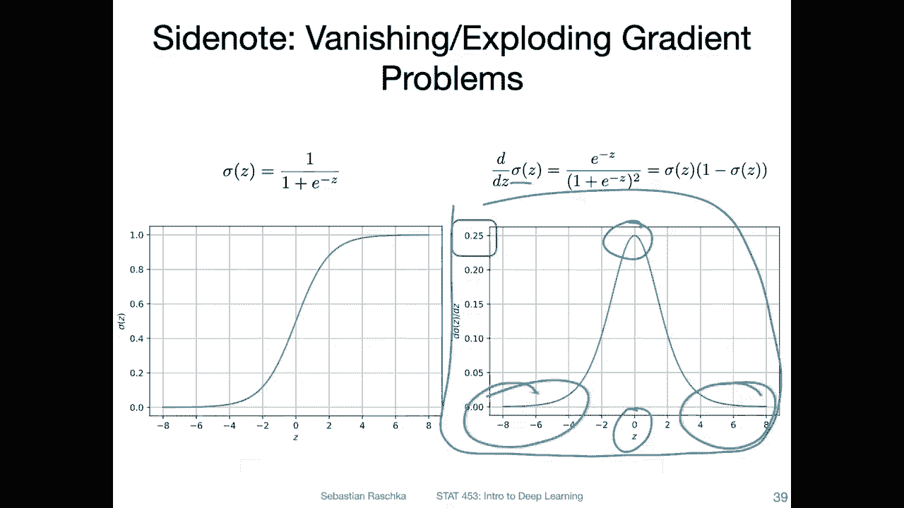
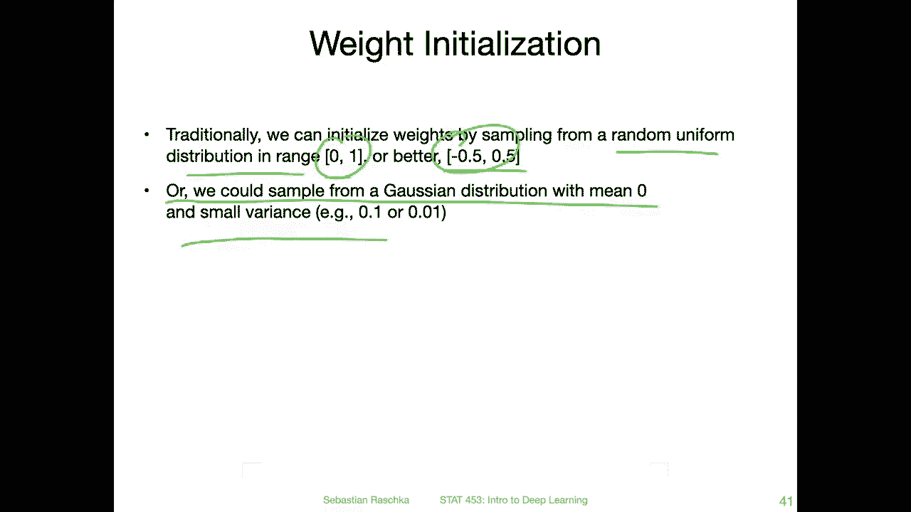

# P86：L11.5- 权重初始化 - 我们为什么要关心？ - ShowMeAI - BV1ub4y127jj

Yeah， previously， we talked about input normalization。

 but weight initialization matters too to have everything on the right or on a good scale。

 No pun intended here， though。 So now we are briefly motivating why we care about when weight initialization。

 and then I will show you。Two common ways to initialize weights。

 And then we will see how we can do that in Pytorch or whether we even have to bother about that in pytorch。

So yeah previously we discussed that we want to initialize weights to small random numbers to break a symmetry in the multilay perceptron。

 so I gave it to you as a question to think about and yeah we discussed this on Piazza if you have still questions about that。

 there was a good answer on piazza on that。So， yeah， but besides having small。

 random numbers to break the symmetry， we also want the weights to be relatively small， right。

 So that is another thing to think about。 But it has， yeah。

 something to do with what I showed you earlier in an earlier video here about input normalization。

So just to yeah kind of explain or motivate this a little bit。

 think of the multi layer perception again where we here have the multivariable channel for yeah updating one particular weight。

 So this is something I just copy and pasteed from a previous slide， nothing new here。

But I want you to focus briefly on this part here where we have the derivative。

Of the activation with respect to the activation in the previous。There， so actually we could。

Expand that。To let's， should have written it like this。So let's do like this。The 1。2， and then。

I'm just expanding it here。So what the critical part here is。

Its this part where we compute the derivative of the activation with respect to the input。

 particularly for example， if we have something like the logistic sigmoid， right。

 because if we have a logistic sigmoid， if you recall the。

Yes， the partial derivative of the logistic sigmoid with respect to its input， so。

The derivative is largest if the input is 0， right？ And also， even if it's 0 is just 025。

So， if we have。Something like this here where we have this term。

 we have a number that is always smaller than one， right？ So in this case。

 this can lead to a so called vanishing gradient problem。

Because then we multiply a number。With a number smaller than one multiple times。

 if we have many layers。 of instance， if we assume this is the largest gradient or partial derivative we can get for the logistic sigmoid function。

 And then if we have 10 layers， we have a multiplication with a value。That is at most，0 to5。

And that yeah will degrade the other gradients as well substantially， right。

 Because if I go back one more time。 So we have all these， these other terms here， right。

 So the term。

Here， here and here。 It's all multiplied with this one， right， So this is small。 Then well we。

We degrade the whole， the whole update here， the gradient here。 and this is only for two layers。

 If we have more layers， we have more of these terms in in there if we use the logistic sigmoid。

So in fact， then we would， if we have 10 layers， we would degrade the value by about 10 to the power of-6。

 so the gradient will be so small that the network will probably not learn much anymore。

So。You， because of that， it's， yeah， usually a good idea to use other types of。Activation functions。

 you can also kind of regulate that with the learning rate。

 But this is one of the motivations why it's important to initialize the weights Yeah， centered at 0。

 for example， if you use a logistic sigoid function。

 because then you will have at least the maximum gradient， right， so。

If I go back， if you have inputs or the net inputs that are small。

 let's say in this range or large in this range， then the gradient will be even smaller， right？

 So in this way， you want to have something that is at least are centered at 0 so you can initialize your weights。

 for example， from a random。

No from a random uniform distribution， for example， for example， in the range0，1。

 But if you use the logistic sigmma， for example， it might be better to do it in a range between。

5 and 。5。Or maybe even smaller，-005 and。0。05。So。You can also choose a positive range。 I mean。

 if you have a relu function， it probably doesn't really matter that much。 However。

 this gives you more combinations if your inputs are also negative and positive right so in that way yeah you can do either or if you have a relu or you can also yeah just what's very common is to initialize the weights from a random Gaussian distribution with mean0 into small variance。

But these are just some， I would say， some suggestions that have been used in the past。 Nowadays。

 it's actually more common to use either。

Something like the Xavier Gate initialization or Kming her initialization。

 So we will talk about this in the next video。

