# P88：L11.7- PyTorch 中的权重初始化 - ShowMeAI - BV1ub4y127jj

Okay， let's now finish up this video by talking about how Pytorch handles weight initialization and how we can change it if we wanted to。

So I looked at the current source code of Pythtorch because yeah the weight initialization that they do by default changed over the different version over time。

 so currently in version 1。8 they use the Kingha uniform weight initialization so I found the source code the relevant one here if you want to check it out yourself and this corresponds to the fully connected to the linear layer。

For the convolutional layer I saw it's the same though。

 so they use the same weight initialization now for both the fully connected and the convolutional layer in previous versions they had a slightly different weight initialization。

Yeah， and now looking at this here， you may wonder。Besides climbing uniform。

 what these different things are。 So here this math square root 5。 this is， I think。

 for the leaky relu。 So that is if you， yeah if you use a leaky re， you would add that number。

 So they are assuming that if you use a fully connected layer that you also use a leaky re activation。

In practice personally， I tried also using the0， which is usually what people would put in here for the regular re。

 if I used the regular re and I didn't really notice any difference。

 So it might be better yeah to use this for the leaky Re and set it to0 for the normal re。

 I will show you in the next slide how we can do that more conveniently than modifying the source code。

 but in practice personally， I didn't notice a big difference。

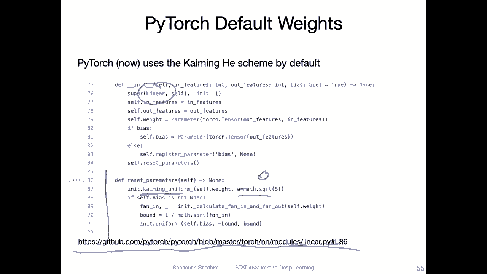

So yeah， here's an example of how we could manually override the。

Yeah initialization that is done automatically because if we initialize these layers。

 it will basically execute this one to do the king initialization， but if we wanted to。

 we can override it。 So how I like to do this， I mean， there are multiple ways you can do it。

 but how I like to do it is I like to put this fall loop after my sequential loop。

 So here what I'm doing is I'm iterating through all the modules in the network。

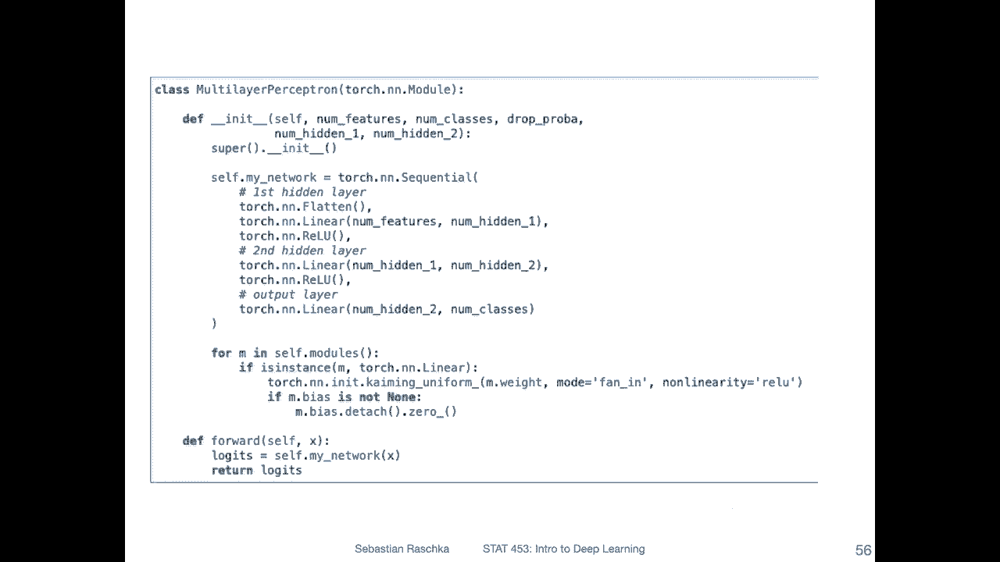

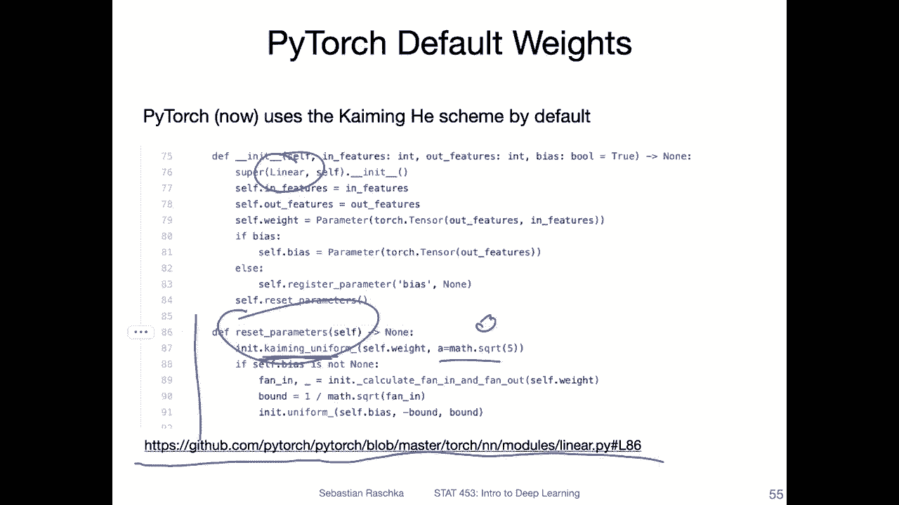

However， here I'm only interested in the fully connected modules not in let's say relevant things like that。

 so here I'm pulling out essentially only the fully connected ones and then I'm using torch in it kmic uniform。

And provided with the corresponding weight。 So the weight corresponding to n， the linear layer。

 and I'm setting it to fan in and non nonlinearity re。 So this is essentially the default by the way。

 too。 So this is what is done by default。 Oh no actually。

 that's not true by default it should be leaky re。 But fan in that's the default。

 And usually that's by default leaky re I'm changing it to relu personally。

I don't notice any big difference。 Another thing if you wanted to。

 you can set the bias to0 or you can use the initialization scheme they use here。 Also for that。

 personally， I didn't notice any difference。 but I just trust that the Pywach developer did a lot of testing and also yeah considered community feedback。

 So I think this one is probably better than this one。

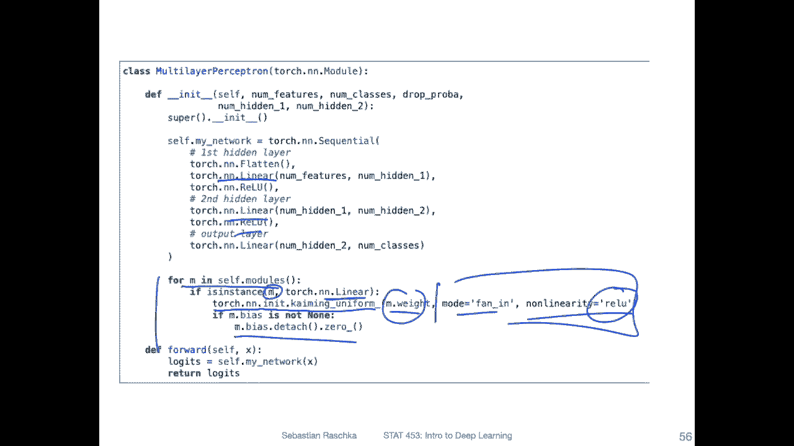

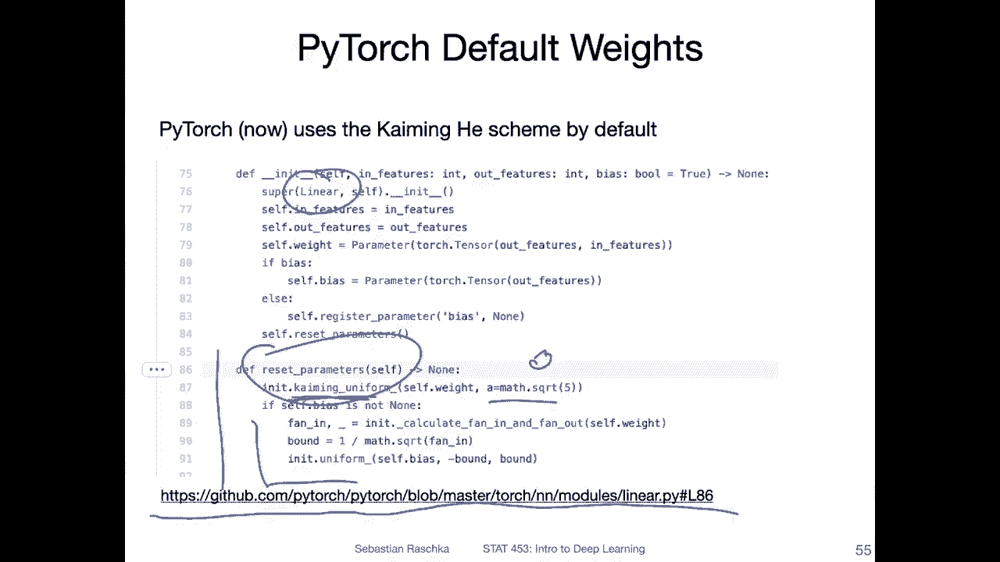

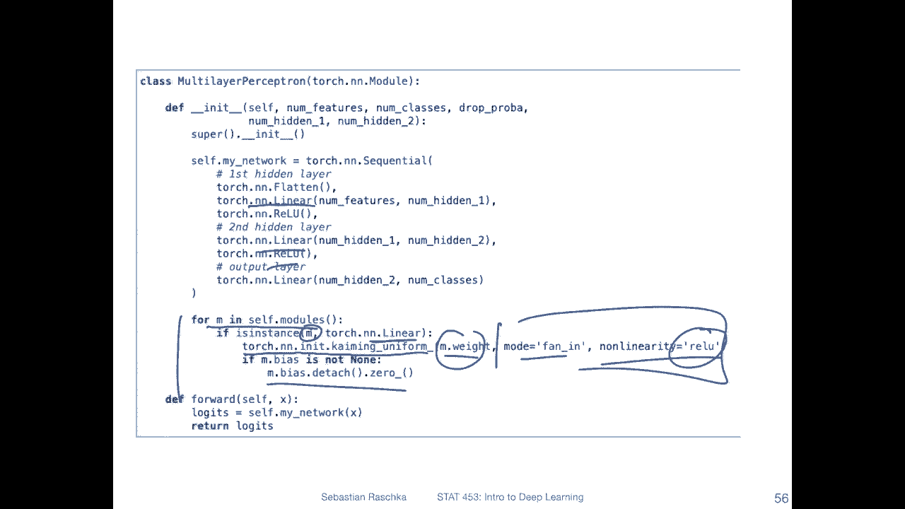

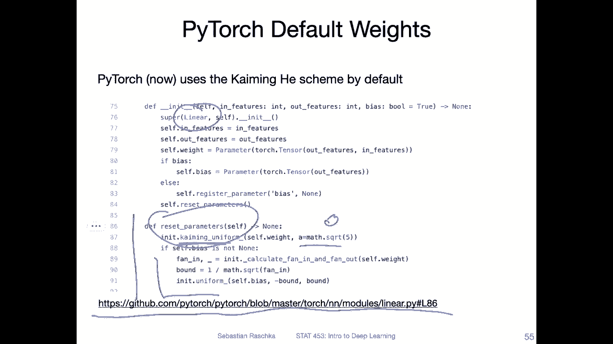

Except， of course， yeah， the other one on the previous slide is more give get towards liy Reello and I have a regular re here。

But yeah， anyways， your mileage may vary， and there's another thing I also wanted to say at the end of the video why this may matter less than you might think。

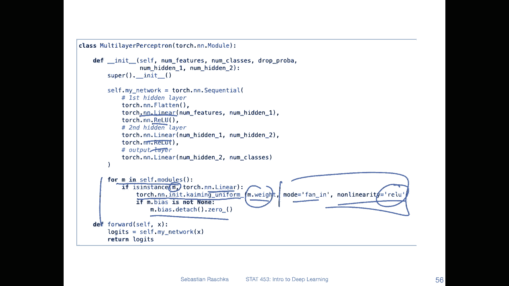

So yeah， another example here is the normal initialization， so using Gaussian distribution。

 so same concept now Im setting the weights here to yeah values from a Gaussian distribution。

 so with mean 0 and sanit deviationation 0。001。So why am I using the detaach here。

 I also already used that in the previous slide if you have noticed here。

 so what is the deach so that is because when we initialize something that has weight parameters so linearia has parameters so let me go back to slides。

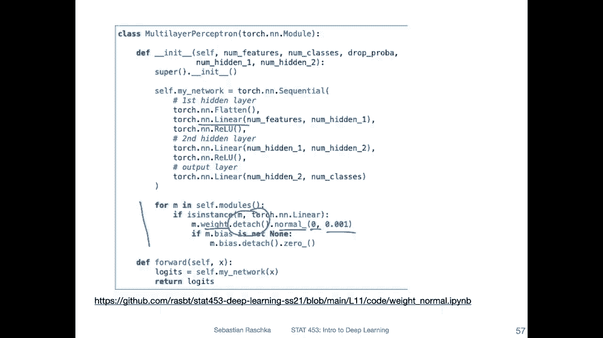

So in Pyt， there is a thing called parameter。 and these are all the learnable parameters。

 and they have the gradient attribute activated by default。 And so what happens is that for that。

Part for weight and bias， Pych will track the gradients when we do computations。

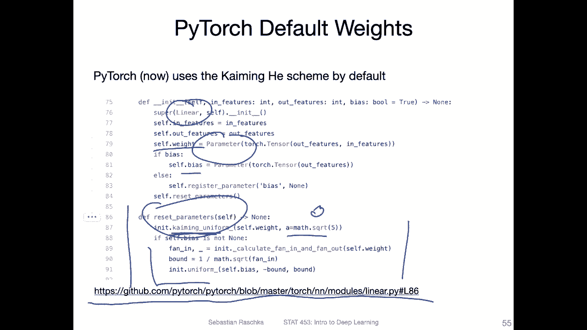

However， we don't want to have the weight enertization be part of let's say a computation graph or the gradient computation。

 so here by detaching it from the computation graph。

 I kind of prevent that for this part a gradient is computed so it's just like for convenience or not convenience I think otherwise it might not even work。

Because it's kind of， yeah， a weird operation to include in the computation graph because it's just this should be essentially our starting point and not part of the computation graph。

Okay， so yeah， here's the how we could then also initialize it from a Gaussian distribution。

 And actually when I run this， I get got like some really funny results。 So on the left hand side。

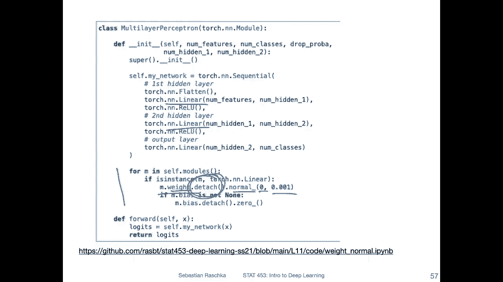

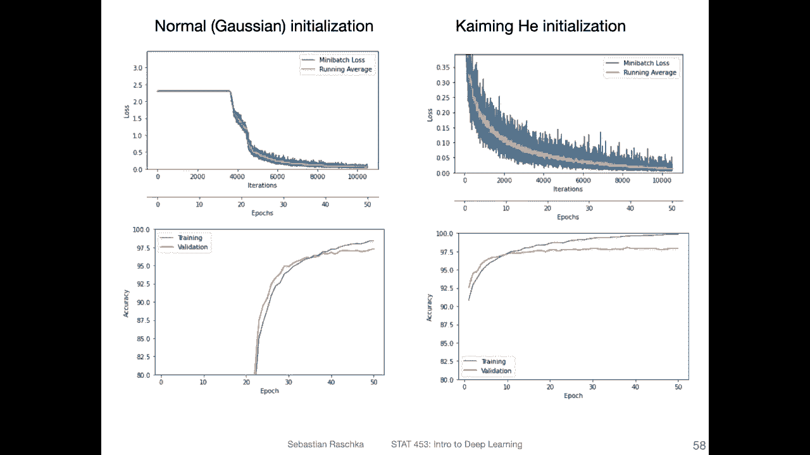

So if you want to replicate that， by the way， here's all the Github code。

 So there are also the other ones if you go here。

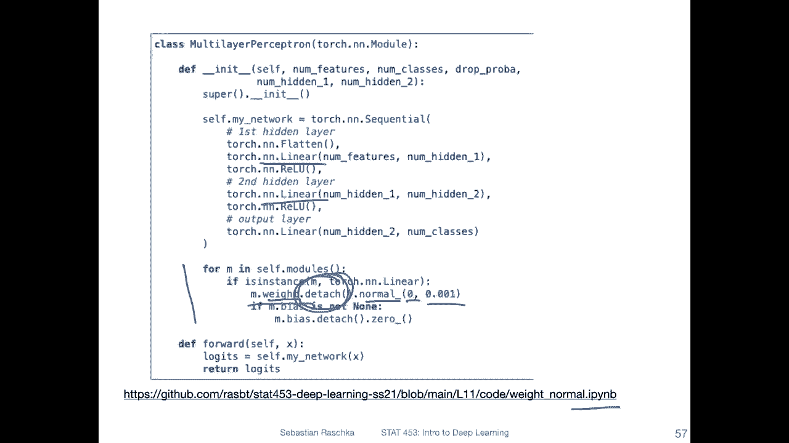

So when I was training this network I noticed that nothing happened for a while so for about like almost 20 epochs and yeah then suddenly I don't know it got a push or something and then the loss started to go down so it started training after Epoch 20 or so which was funny I've never seen something that weird。

 but usually also I would stop the training if it doesn't stop start learning after a few epochs。

So anyway， so that was kind of funny。 it eventually learned to perform pretty well。

But that was here still interesting for the king her initialertialization that trained pretty well Yeah to begin with was not such an issue。

 so that looks actually much better。 And this is yeah why we would， for example。

 use chiing her initialertialization for network with Re activations。

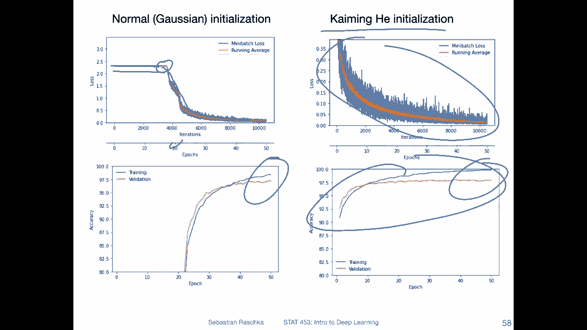

I should say， though， what I mentioned earlier is that we use， if we use batch norm。

 then actually this initial feature weight。weight choice is less important than you might think。

 So because， yeah， the batch normalization normalizes on the activations anyway。 So in that way。

 it's less important what type of weight initialertization we choose， at least in my opinion。

 So when we try or when I try this in practice。 So we can see now。

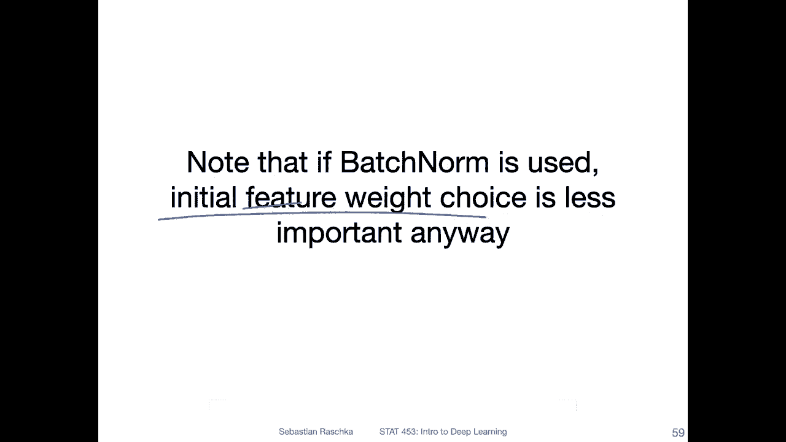

That on the left hand side， I'm showing you the Gaussian initialization with batchome that things train also well for this case。

 So actually， yeah， with beomem， it trains even faster than climbinging her without batchchome。

Alright， so yeah， this is just。A brief overview of different weight enertialization schemes。

 It's maybe something you might want to consider， but the Pythtch defaults are yeah reasonable if you use the re activation。

 if you use different types of activation functions you may want to see whether there is a better weight enertization scheme。

 but also again with batch norm things are quite robust。 Alright。

 so this is yeah the lecture on batch norm and weight inertization then and next week we will cover optimization algorithms。

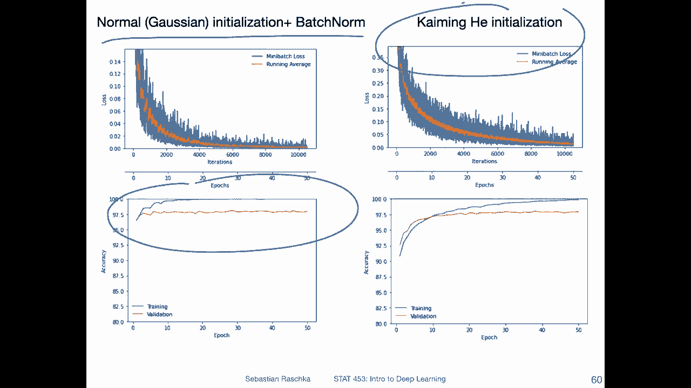