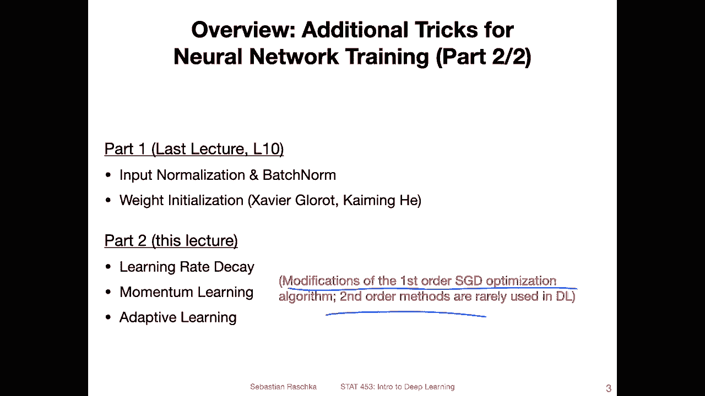
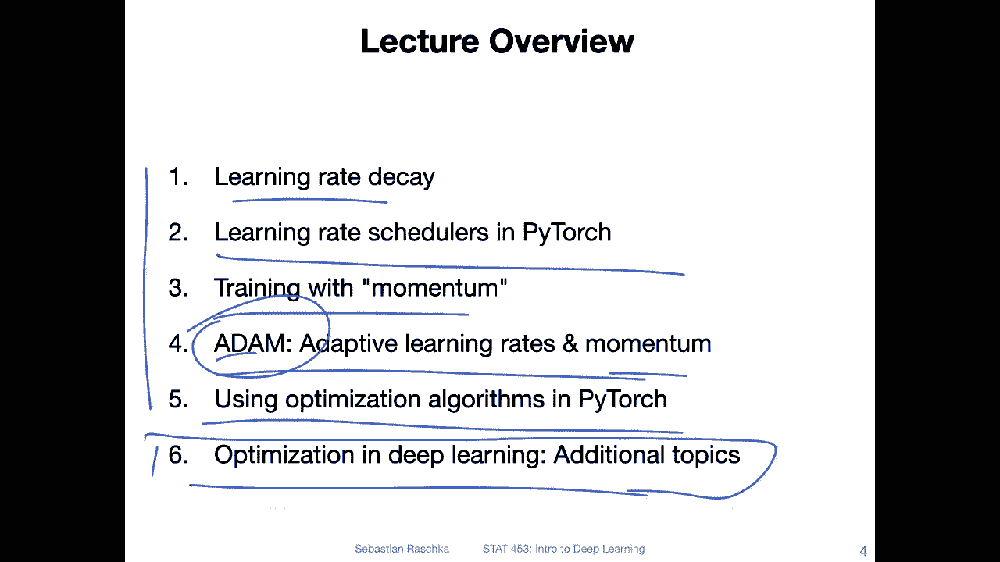
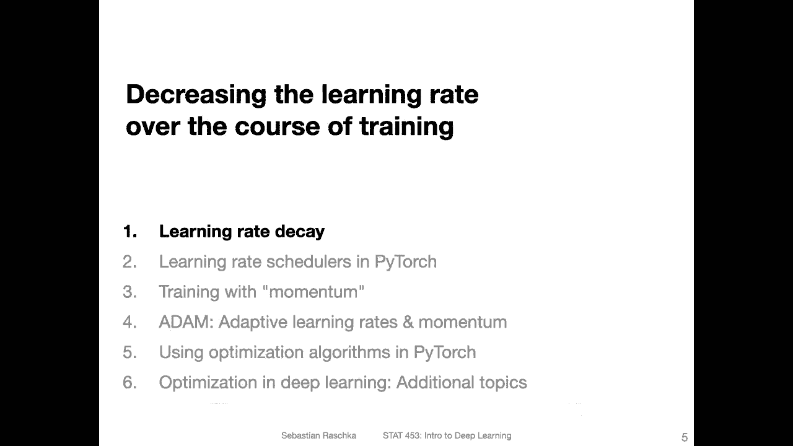

# P90：L12.0- 改进基于梯度下降的优化【课程概述】 - ShowMeAI - BV1ub4y127jj

Yeah， hi everyone。 I hope you had a nice weekend。 So today is the last time I want to dedicate a whole lecture to just yeah techniques for improving generalization performance in neural networks。

 So in the upcoming lectures， I will yeah talk about new neural architectures， for instance。

 convolal networks， recurrent neural networks， autoencos generative adversarial networks transformers and so forth。

 So yeah today is really the last time we will just talk about improving generalization performance and in particular。

 the topics I have in mind are yeah optimization related。

 So there's one topic called learning rate schedules。

 So it's how we can improve stochastic gradient in descent learning by decreasing the learning rate over time during the course of training。

 and the other topic is yeah replacing stochastic gradient in descent by modified versions of stochastic gradient in descent For instance。

 there is a momentum term that we can add。😊，And there's also something called adaptive learning rates。

 So we will learn about an algorithm called atom， which combines adaptive learning rates and momentum to yeah make learning。

 I would say， easier。 so you have to do less fiddling with hyperparmeters。

 but also it can converge faster。So I should say though。

 everything we talked about so far in terms of these tricks like batchome， dropout and so forth。

 activation functions today， the optimization algorithms， they also apply to all the architectures。

 we are going to cover in future like just。 So it's all kind of relevant。

 I thought it's just like yeah nice to get that out of the way。

 And then when you learn about new architectures you are already familiar with these tricks and you don't have to think about what these different terms mean when I show you some implementations of those that make use of these tricks。

 So with that yeah， let's get started。 And yeah， and by the way。

 if you are watching this on Wednesday。 also yeah happy send pertex day。Yeah。

 in the past couple of weeks， we already covered a bunch of topics related to improving neural network training。

 For example， we talked about regularization to reduce overfitting examples of that included L2 regularization。

 what we call also weight decay， or yeah dropout and then last week we discussed how we normalize our inputs and hidden layer activations for instance。

 yeah， the input standardization and batch normalization。

And there were some other tricks like weight initialization schemes like Saer Gode and caingha。

 which can also improve neural network training。 So in this lecture we will yet discuss tricks related to the optimization algorithm。

 so there will be a section on the learning rate decay， momentum learning and adaptive learning。

I should say these are all techniques that concern your first order methods for optimization。

 stochastic gradient descent， so they are essentially all modifications of stochastic gradient descent。

If you are familiar with more advanced optimization techniques。

 you may wonder why we don't talk about second order methods。For example。

 if you consider the Hassian matrix and yeah the partial the second order partial derivatives。

 So the reason is， yeah， people， many people tried using those techniques。

 but it just turns out they don't work very well in practice。 They are either way too expensive。

 but also don't really result in faster training in terms of your epochs and。Better performance。

 So usually， even maybe if you find that it requires fewer epochs。

 these methods are computation is still so expensive that you don't gain anything by using second order methods。

 Or at least I haven't seen up to this day convincing。Yeah。

 method that really is widely used in practice。But maybe， I mean， never， never say never。

 So it doesn't mean there won't be any technique in， in the future that may work well。

 It's just like that we don't have them yet。

So the topics we are going to cover today are these six。

 so first I want to talk about learning rate decay。

 so a very simple topic concerning the learning rate and yeah reducing it over the course of training to reduce the noise and stochastic gradient in descent。

 I will show you then how we can do that in Pythtorch。And then， we will talk about。

A momentum term that we can add to our gradients to help accelerate gradient descent in the right moments and slow it down in other moments or steer it better in that way。

Yeah， there is also a topic of adaptive learning rates， so adaptive learning rates。

 especially coupled with momentum are commonly used nowadays there's one algorithm called atom which is probably the most widely used optimization algorithm I use it all the time because it works very well out of the box。

 you can get good results with stochastic gradientdescent and momentum too。

 but in my experience at least it requires more hyperparmeter searching over the learning rate and atom is usually more robust and works often better out of the box it requires less work in a sense。

I will then show you how we can use these algorithms in Python and there are also so many other algorithms besides let's say atom and momentum that have been emerging in the recent years。

 I have a huge list of these topics that I find also sometimes relatively interesting where I do some reading here and there about yeah latest trends。

 so I will make a separate video outlining some of these advanced studying topics So you don't have to yeah。

You won't have to know these things in detail， but for those who are interested to in reading a little bit more。

 let's say beyond the scope of the class， I will just include some references here that you may want to check out in the future and on your own。

 for example。

Alright， so let's get started then with the first topic， learning rate De。

