# P91：L12.1- 学习率衰减 - ShowMeAI - BV1ub4y127jj

Yeah， our first topic today is learning rate decay that is decreasing the learning rate over the course of training。

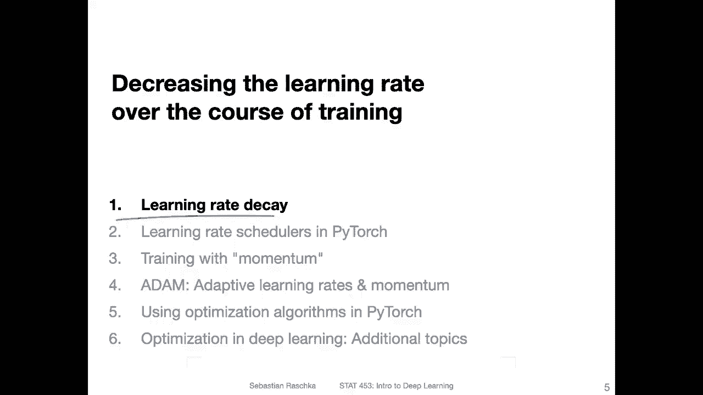

So just to briefly recap what is again， mini batch learning So mini batch learning is a form of stochastic grain and decent where we draw mini batches from the training set。

 So each mini batch can be considered as a sample drawn from this training set where the training set itself is in turn a sample drawn from a population right So the training set is just what we have access to like a sample from a distribution that we train on and during mini batch learning we use yeah subsles or smaller samples。

 each mini batch is a sample of。The training set， which itself is a sample。

 and then we do the forward and backward pass。On each mini bench。

So if we draw these small mini batches， these small samples。

 we will actually get noisier gradients compared to using the whole training set， but this can have。

 yeah advantages and disadvantages using these smaller mini batches compared to the whole training set for computing the gradient so it can lead using mini batch mini batches instead of the whole training set can lead to noisier gradients。

 but yeah they can actually be quite good because they can help us to escape local minima So here on the left hand side。

I am showing you the loss surface for cost surface for a convex loss function， where the。Yeah。

 the center here is the global minimum that we want to reach Yeah， there are the two weights。

 it's just a simple model。 you can think of it as let's say a linear regression model。

 but in the context of deep learning we have a non convex loss function and actually this noisier gradient can help us to escape。

Yeah， local minima where algorithm may get trapped。

 but the problem is that it can lead to oscillation。

 So let's say in this case here on the left hand side。I take steps perpendicular to the contours。

 If I use the whole training set。But I have like these noisier updates here， if I use。Mini batches。

So this can be， yeah， quite， yeah， I mean， it， it's not so bad， but it， is's， of course。

 not as good as the direct path， right？ So there are。Pros and cons of using mini batchche learning。

 Today， we will learn also about a technique。Like momentum that can help help with that。

 but also one way you can help with this oscillation is yeah。

 by having decreasing the learning rate that it is not so big that the algorithm doesn't take very large steps in the wrong direction。

 but also by collecting more representative samples like having larger mini batches can also reduce the noise。

But yeah， before we talk about that。What is also another advantage of mini batch learning so we talked about the convergence speed because compared to regular stochastic a gradient decent where we only have one training example per update。

 mini batchch gradientdescent is actually faster and it's also it can be faster than doing the updates compared to the whole training set and if you。

Maybe don't recall why that is， we covered this in an earlier lecture but it maybe just be a good idea to just think about this again。

 why is mini batchch gradient in descent faster than stochastic gradient descent with only one training example per update and why is Min batchch gradient in descent faster than gradient in descent using the whole training set？

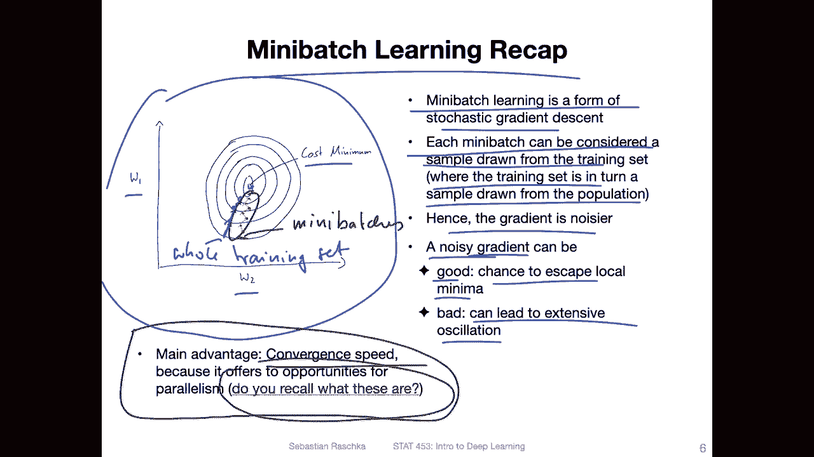

Okay， but yeah moving on heres another example of this oscillation。

 I was drawing this with a tool available on this website。

 which is essentially a visualization tool for different optimization algorithms it's actually a pre neat tool。

 So here on top I'm using SGD with a very large learning rate you can see that。

If the learning rate is too large， we can also have we increase the noise or we have this big oscillation basically。

 where we are overshooting so。If the minimum is here in the center。

 if if I have a large learning rate， then I may overshoot so I go too far。

 my first update goes maybe I should use the yellow here。

 my first update goes until here it overshoots and then we have to go back for a second update and then see that's very inefficient So a large learning rate is actually bad but if we yeah how can we fix this probably we can use actually a small learning rate。

That is shown here at the bottom， what you can see here at the bottom though。

 And functional is that it takes a long time to converge。 So here we have a lot。

A lot of baby steps till we converge。 And one problem is， yeah and。The context of deep learning。

 we have these。Non convex loss function。 So if this is my loss for， let's say， given weight。

 they are。You non convex and something like that。 And they may get trapped。 So let's say。

My global minimum is here， and I am currently here。

 I do an update here and then it gets trapped here because here the gradient in is0 and it can't get over this hum because my learning rate is too small。

 So sometimes a noisier update can actually help overcoming these local minima。

 So noise is not necessarily bad too So that is essentially a sweet spot between having too little noise and too much noise So in the beginning of the training。

 it might be good to have large noise to overcome some of the local minima but then over time to decrease this noise and this is essentially what learning rate decays yeah intending to do Yeah。

 but before we talk about learning rate decay， let me give you one more practical tip for many batch use。

 So usually it is recommended to use large mini batches。

 some people recommend small mini batches because they find that it helps with generalization but usually another recommendation is choosing batch sizes that are reasonably。

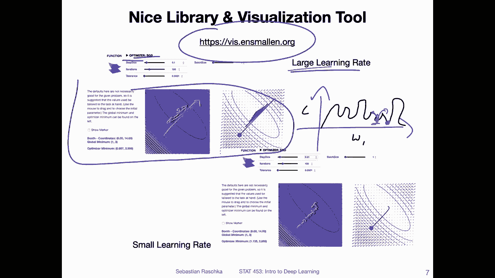

largege let's say 256， 512，1024， something along that on size。 Why is that。

So it has also something to do with yeah utilizing the GPU well。

 but then also with having not updates that are too noisy because if you have a data set。

 So that's what I'm trying to illustrate here。 if you have a dataset like this I data it's just showing the distribution of the three classes here and then you split it into smaller samples。

 So here's the training set with size 100 and here with 50。

 So what I wanted to show is that if we have a larger sample we kind of roughly maintain the distribution。

 or at least we maintain the distribution better compared。To a smaller sample like here。

 you can see that the distribution here and here is yeah， kind of different。 So it's not a big deal。

 If the distribution differs。 I mean， we have multiple mini batches and the noise can be good。

 but if it differs to too much， that's maybe not ideal。

 So having larger batch sizes will stabilize that a little bit。 So in that way。

 having batch sizes also somewhat proportional to the number of classes in the data set is also a good idea。

 For instance， if you only have two classes， maybe a batch size of。

128 and what 256 is a good number if you have more classes。

 maybe you choosing 512 mini a mini batch size might be better for example。

 so here I ran an experiment on MNIS just yeah illustrating how training with different batch sizes looks like。

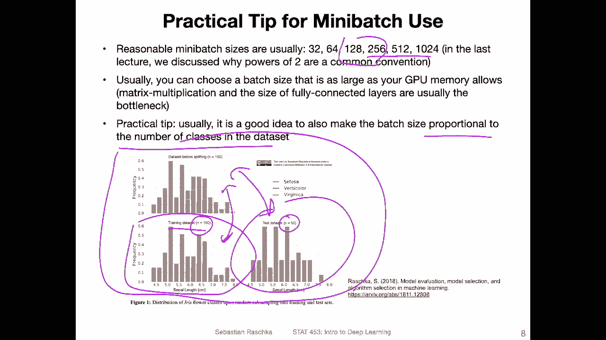

So on the left hand side I used 101024 examples per mini batch on the right hand side I used 64 examples。

 you can see the performance in the end is yeah it's about the same it's almost identical here。

You can see here on the left hand side， though， that this one is way less noisy than this one here。

 which is expected right because on the left hand side you have these larger mini batches。

I trained for the same number of epochs，100。And you can see that the smaller one converges faster。

Because yeah， we have simply more updates。 So here we have 80000 iterations。 So 80000 updates。

 And here on the left hand side， only 5000 updates。

 And you can see based on the training and validation accuracy here。

 it converges kind of faster compared to here here it takes a little bit longer to converge。

 it doesn't even converge until it still improves。 So having larger batch sizes helps stabilizing training。

But also。It can actually run faster overall because it has something to do with utilizing yeah the computer better by having fewer large updates in that way here。

 So here yeah this training finishes faster it may finish even faster if I use a larger batch sizes it's not quite clear because maybe I have to run it then for more epochs。

 but here 1024 seems to be actually a good tradeoff。So， but like I said。

 if we want to just reduce the noise。One way is choosing larger batch sizes。

 another way is decreasing the learning rate over the course of training。 I can actually do both。

 I can use a large batch size and decrease the learning rate。 That's another possibility。

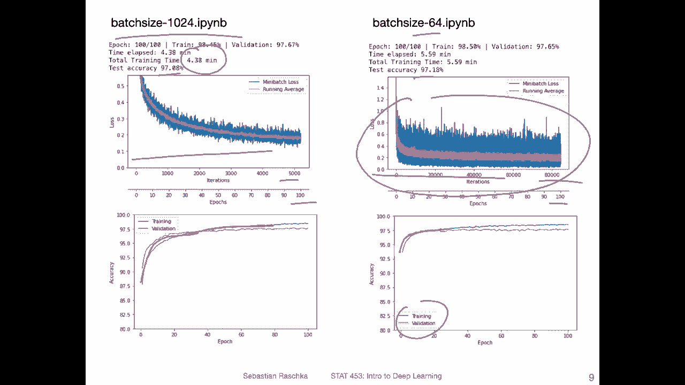

So yeah， let's talk now about learning rate decay。 Like I mentioned before we can get these so called batch effects where the mini batches are samples of the training set。

 and then yeah， the mini batch loss and the gradients are approximations of the full gradient that we would compute on the full training set。

 So here in red this line would or should symbolize the。Loss on the whole training set。

 And when we use these mini batches， it's yeah， usually。Much noisier。And。Usually we still， I mean。

 the farther we go， the smaller the loss will become。

 so the oscillation will somewhat become smaller because yeah the network。

Lears well and the loss is just smaller so the gradients will be smaller and then the updates will be smaller but usually we still get these oscillations here at the tail end and if we want to decay or dampen these oscillations we can use a decaying learning rate so we can shrink the learning rate once we are reaching this point so making the learning rate instead of having the noisy。

 making it like smoother like this。Let me use a different color。Like this。So and then stabilizing。

 stabilizing the training。 But like I'm drawing here， there's actually one danger with that。

 It's if we decay the learning rate too early， we may stop the network from learning too early。

 So maybe。If I let me go back so if I have this oscillation and adapt the learning rate at this point。

 then maybe a it too much and then the network stops updating so the loss stays here at this point and this is also not ideal。

 So in practice what I usually recommend is training a network first without learning rate decay。

Then saving this performance as a baseline and then adding a learning decay method and see whether you can improve over that baseline。

 because what happens to me is when I use learning rate decay。

 I usually decay too much and then actually the performance is worse compared without learning rate decay。

 It's like a yeah real possibility to decay too much。

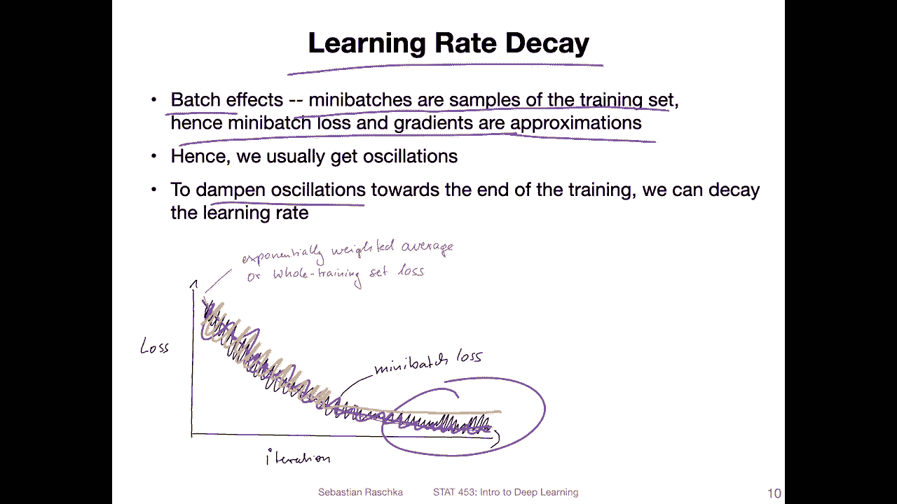

Yeah， so let me show you some common ways we can decay the learning rate。

 So one of the most common variants of learning rate decay is the exponential decay where here at a 0 is the initial。

Learning。😔，Rate， and。T here in itta T T would be the time set step either the iteration。

 but most often the epoch。 So we do an update every， let's say epoch。 but you can also say。

 do an update every 10th epoch。And then， yeah， we are decaying by multiplying this learning rate。By。

😔，termerm E to the power of minus k where k is the decay rate times the epoch。 and yeah。

 I was plotting this on the right hand side。 And if you update after each epoch。

 you can see if you choose a decay rate of 0。1 0。1 yeah。

 then you would see that the network essentially stops learning at。

Epo 40 if you start with an initial learning rate of 0。5。 So it really yeah depends。

 So you can basically do 40 updates with this learning rate decay rate and then the network will essentially stop learning。

 So you have to also factor this And if you want to have more updates more small updates。

 maybe choose a decay rate of 0。01。 So here this will decay slower。

 And this is also another hyperparameter， which is why I recommend just doing doing the training first without learning rate decay and then adding it later to see whether it improves it or not but it's yeah it's just another thing to worry about in deep learning training。

 So there are lots of little things to tune and change to see how it affects the performance。

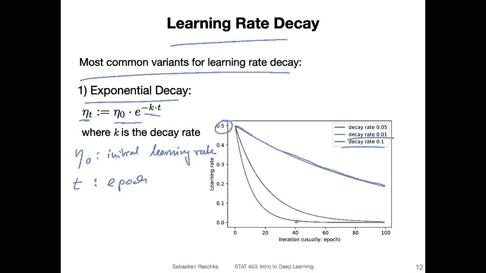

Another common variant for learning rate decay is hlving the learning rate so that is usually something yeah I use most often practice so you basically update the learning rate after each step T so could be each epoch or each10th epochs I will show you another modification of that that I personally use in practice but yeah so essentially you are hallving the learning rate every let's say teeth。

Iterational epoch。And then there is also in inverse decay。

 which is essentially similar to the exponential decay， it's just computed slightly differently。

 So again here on the right hand side， I'm plotting this here for reference。But essentially。

 it's yeah， very similar to the exponential decay。

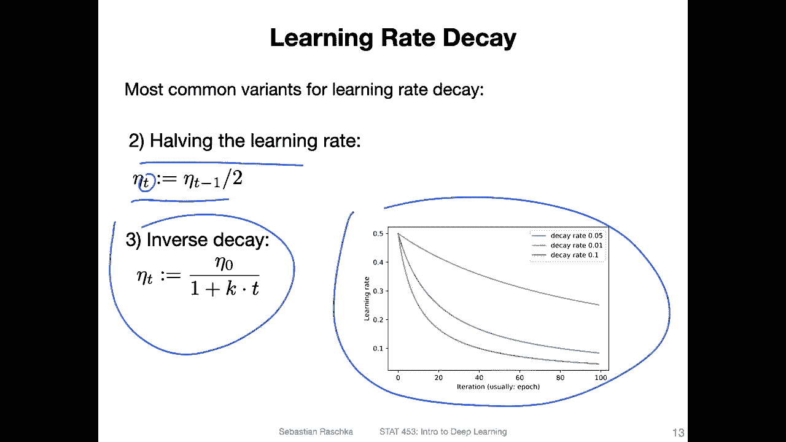

There are also many other types of learning rate decay schedulers。

 So this topic is also sometimes called learning rate scheduling。And here there was a paper。

 for example on a cyclical learning rate， I mentioning it because I also see many people using that in practice personally I haven't had success with that。

 but I hear often from people that it can improve things。

 So here essentially the cyclical learning rate it's increasing the learning rate and decreasing。

 increasing， decreasing and so forth， so it's going up and down and yeah that it's just an interesting interesting technique。

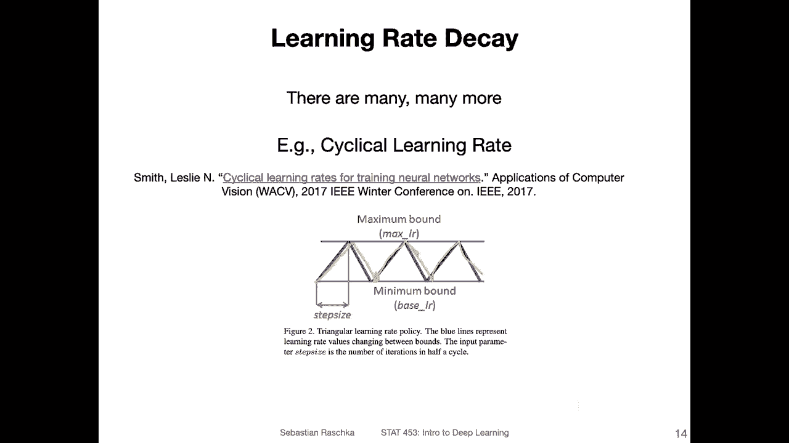

There's also another paper。 I think it's actually the first for the same author as the author who worked on the cyclical learning rate so。

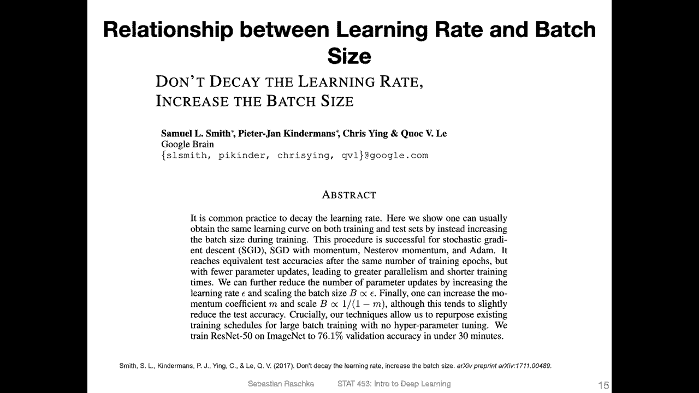

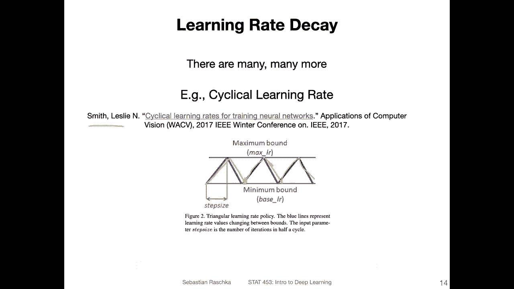

Here， the author or authors on this paper recommend essentially instead of doing a learning rate decay。

Increasing the batch size because it can have a similar effect。

So here they are saying it reaches equivalent test acraies after the same number of training epochs but with fewer parametermeter updates leading to greater parallelism and shorter training times。

 so essentially yeah increasing the batch size can have the same positive effect as decaying the learning rate but could be more efficient。

 it's also quite interesting。

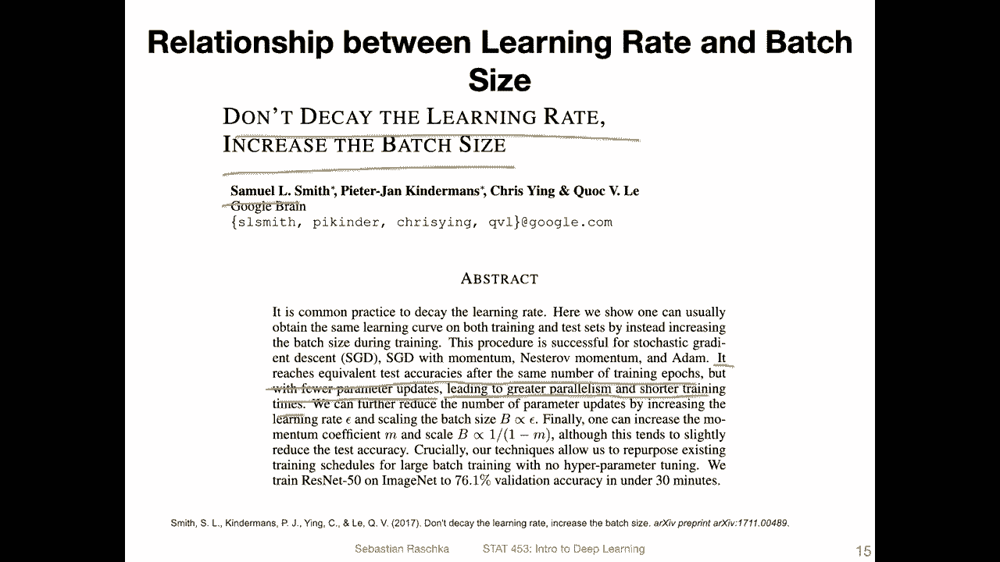

So yes， a simulation of that。 So where on the left hand side， they have two decaying learning rates。

That's give the validation set accuracy or the number of epochs。

 And here they have the increasing batch sizes。 And you can see， essentially。That in the end。

 they approximately reach the same performance and。On the right hand side。

 they show that with a larger batch size， you have your parameter updates， Yeah。

 just because your mini batches are bigger。

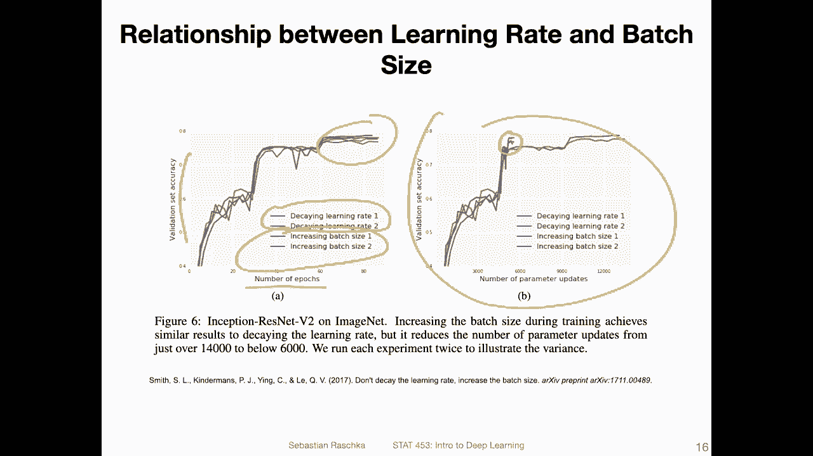

So yeah， that was essentially a learning rate decay in a nutshell in the next video I will show you my favorite way of doing learning rate decay。

 so it's like a version of having the learning rate。😊。

And I will also show you how you can do that in practice。

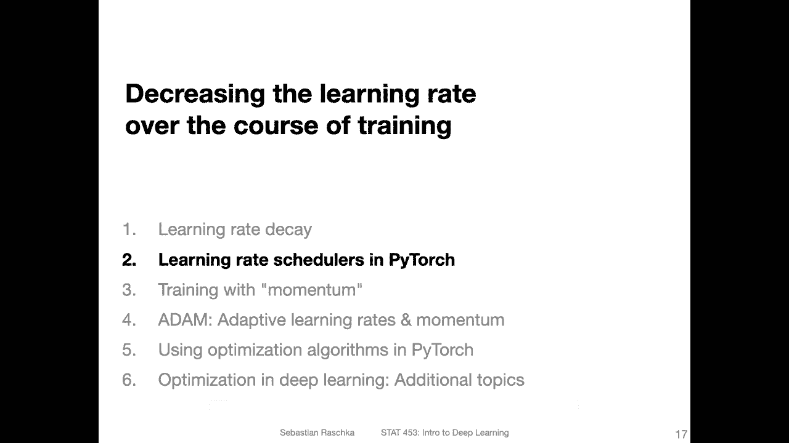