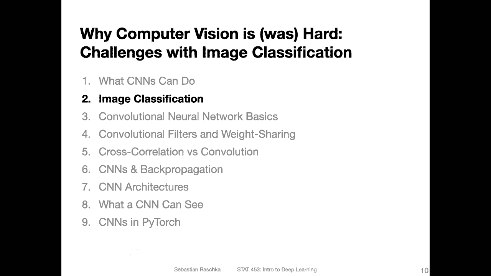
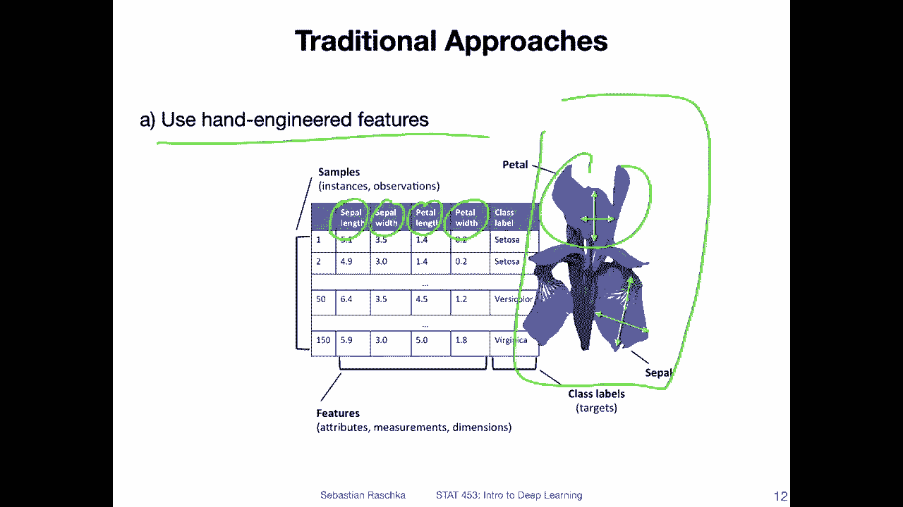
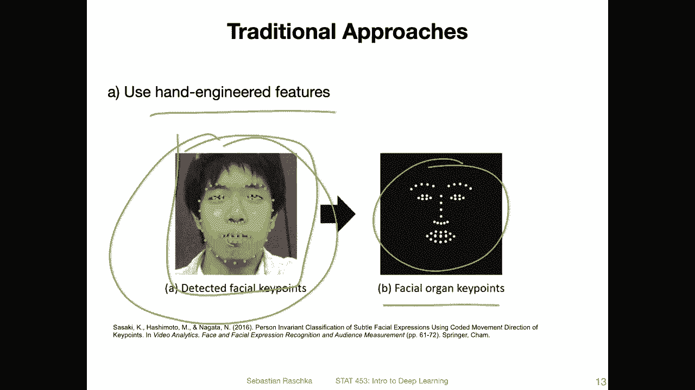
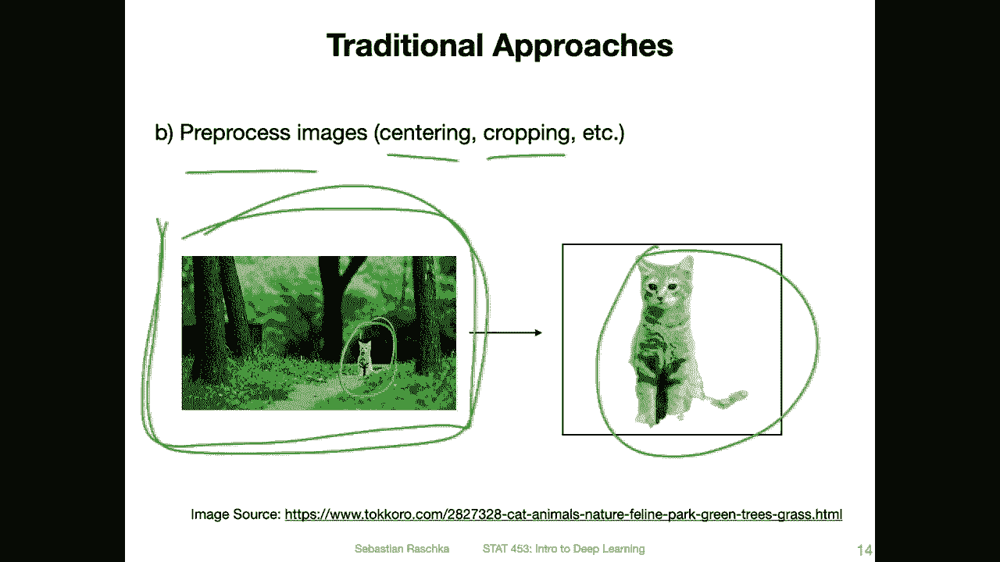
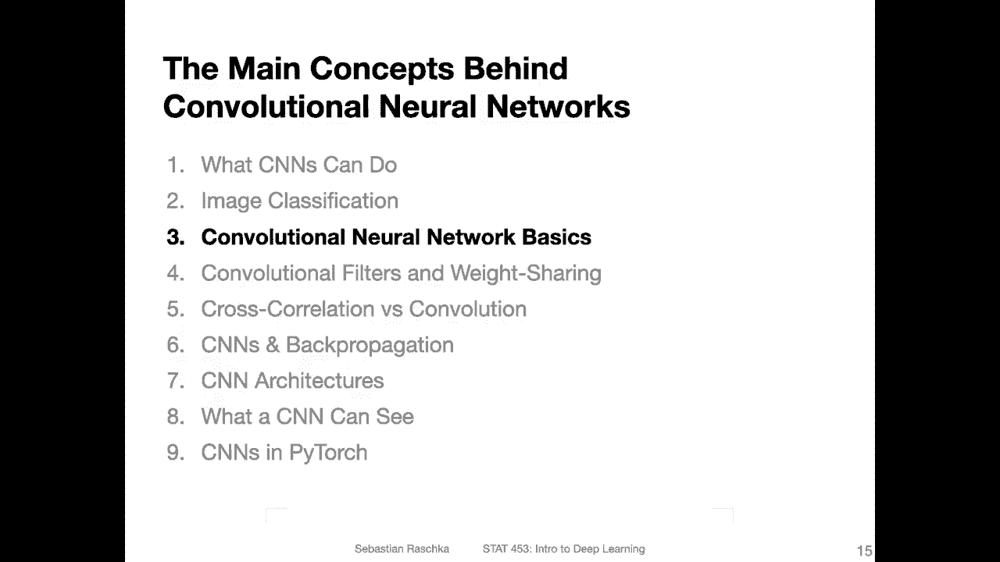

# P99：L13.2- 图像分类的挑战 - ShowMeAI - BV1ub4y127jj

Yeah， but before we dive into convolutional neural networks。

 I actually wanted to motivate the problem of computer vision and image classification first because it's actually a pretty hard task and I think you don't maybe fully appreciate the good performance of convolutional networks before you thought about how difficult computer vision and image classification actually is。

So for instance， if you take a look look at this cat image here so。It's the same cat。

 And you as a human， you probably have a easy time telling that this is the same cat in the same cat picture。

 right， But for a computer or for let's say， standard neural network。

 it's actually a pretty difficult task。 So why is that。I mean。

 if you remember how you used multi layer perceptrons， you were essentially concatenating these。

Image rose into a one long vector， right， so。If I have， let's say this is the first。Row。

 and this is the second row。 And this is the third row。

 So usually how that would look like it would create this。Long。😔。

Beectctor as input to the multi layer perceptionron， then。You have your。First。

 hidden layer and everything is fully connected， right， So， and I want to draw all of it。

 but it would be。Pretty。😔，Dense network。 So there are some other challenges with that。

 But if you recall how you would compute the activation here， it's essentially。Awaitted。

Some of the weights and the inputs plus bias here。 So in that way。

 you are essentially summing up the feature values， right， Then if you have an image like that。

It's the same image as the one on the right hand side， but everything is darker so。

What happens here is that all the activations will actually be lower compared to this one here。

 if you have， because if image is darker， the pixel values are lower。 So that way。

 also when the lighting and contrast and everything like that changes， it will severely affect。

The network performance。 So one thing， of course， it's important to normalize the images。 But also。

 even if you take care， let's say of the lighting and contrast， Other issues are。

 it might happen sometimes that the image is just like a little bit un distortistorted， right。

 So here you can， as the human still tell， it's the same cat， right。

But if you take a look at this sum again so。Now， for instance。Let's say on the left hand side。

 when you take a look at this pixel region， this pixel region might be contained here。Higher up here。

 right。 So if I have my vectors。 but then the same region is lower here on on this side。

 so it might be actually somewhere here。 So in that case， it would fall here and。Here and here。

 there are vastly different weights involved when you compute the activations， right。

 So everything has every every line here is a different weight。

 So you would compute totally different activations again。

 depending on where the object is located in the image。

 So image classification is actually a pretty hard task if you think about it in the context of a multilayer perceptron。

 So how do we make sure。That we get good performance。 Of course， yeah， for that。

 one solution would be the convolutional network， But before convolutional networks were invented。

 what were some other strategies。 So a classic strategy was， for example。

 doing feature extraction manually。 So by that， I mean， instead of providing the input image。

As the input to the network， for instance， instead of having iris flower as the image input。

 what people would do is they would study these flowers or think about these flowers and think about what are some features that we can extract from these flowers。

 and then we can just work with these manually extracted features。

 So in the case of the iris flowers， these features would be， for example， the sepal length。

 sepal width petal length and petal width。 So here you essentially had a domain expert。

 Someone who really understands these flowers and might have a hypothesis and say， hey maybe。

These different iris classes， they differ， yeah by the dimensions。 But another person also， I mean。

 might say it is maybe the colour。 So you could also， for instance。

 think about describing the colour as a potential feature。 But yeah。

 the the bottom line is we would use these hand engineered features。

 we would think about the image instead of just giving it as input and extract some features manually。

And another traditional approach would be also， for instance， for face images。To yeah。

 to get these or extract these facial landmarks。 So that is also a traditional technique where people。

 instead of when they did face recognition provided the full images input。

 they would develop an algorithm that maps these points to the eyes。

 the nose and the mouth and then do a comparison based on these facial key points。

 that's another hand engineered， I would say， hand engineered feature technique。

Yeah， and also one other traditional technique it's also kind of beneficial though still for convolution networks is to preprocess the images so for instance。

 if you think back of the MT dataset in the Mnes dataset。

 all the digits were already kind of cleaned from background。

 if you imagine someone is writing on piece of paper the piece of paper background was removed it was just the image of the digit and also they were all pretty centered in the center of the image。

 but if you take a look at real worldorld images。Usually you don't just have the object of interest in that image you have a lot of other stuff there。

 so for instance here you have like this cat in the park or forest here。

And in traditional computer vision， people would manually extract or also develop some background removal tools to to first extract the image before doing classification because that makes the task simpler。

 so basically yeah extracting， centering and cropping and things like that。Of course。

 this can still be beneficial for convolal networks， especially if the data set is small。 nowadays。

 however， if you have a really large data set， millions of examples。

Conary networks can also perform well on these if all the other things are included。

 because if you have a large amount of images， then the network will learn how to focus on the important parts。

 For instance， if the task is let's say animal classification， it will。Learn how to， yeah。

 focus on the animal region in these images。 It will essentially learn。The it will learn。

How to extract these objects there will be an implicit feature extraction inside the conversion network we will see that later in this lecture I will show you some examples of how conversion networks learn and how they are able to learn these feature extractors essentially so in that sense it's also why we call deep learning sometimes feature learning or automatic feature learning so。

Deep learninging is essentially capable of implicitly learning how to extract features instead of doing this manual feature extraction。

So in the next video I want to then now finally talk about how these conversion networks work。

 so I will zoom in into one of the would say earliest architectures and then describe to you all these components step by step。

