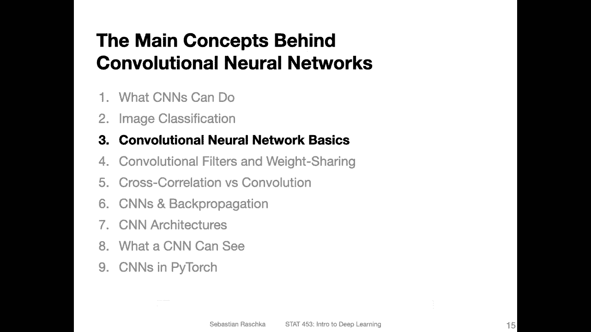
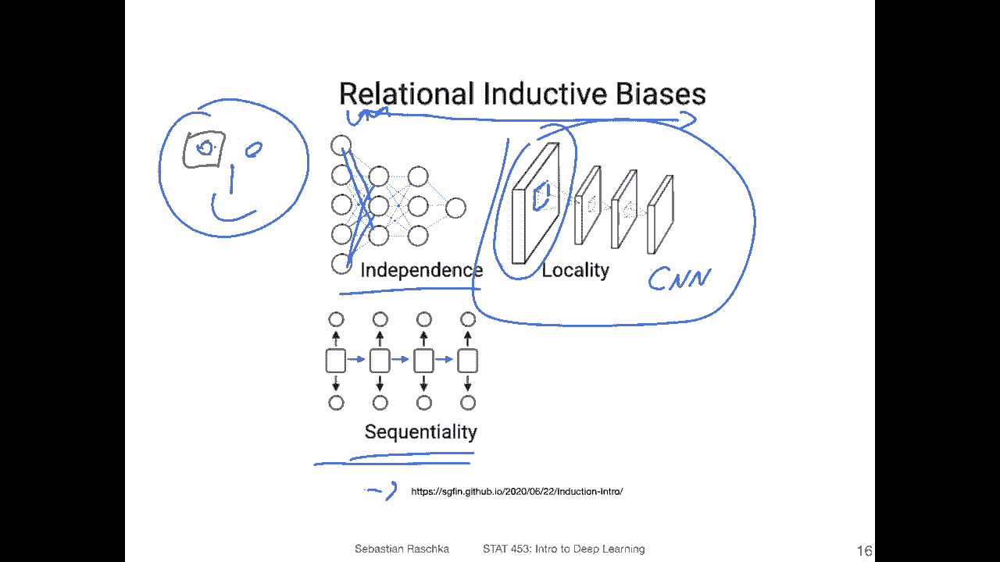
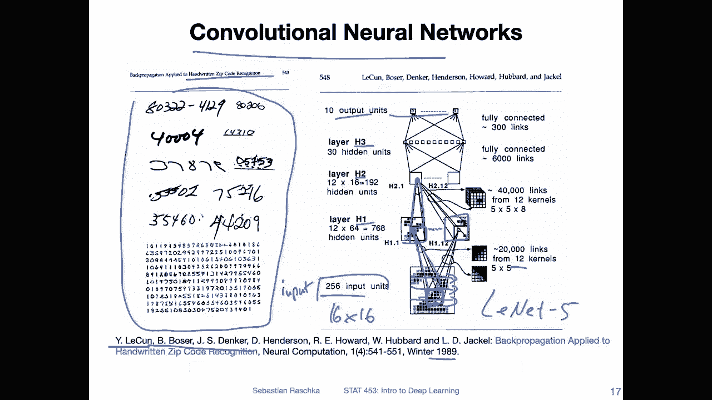
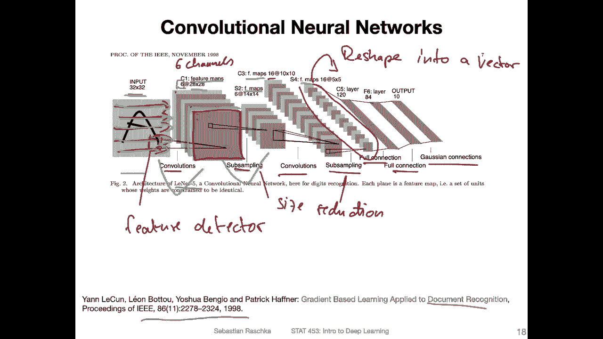
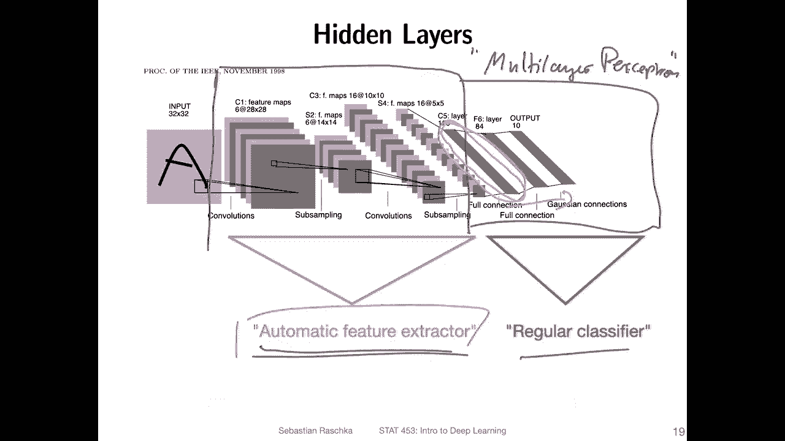
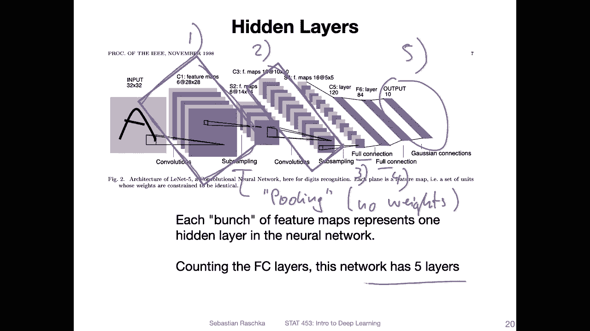
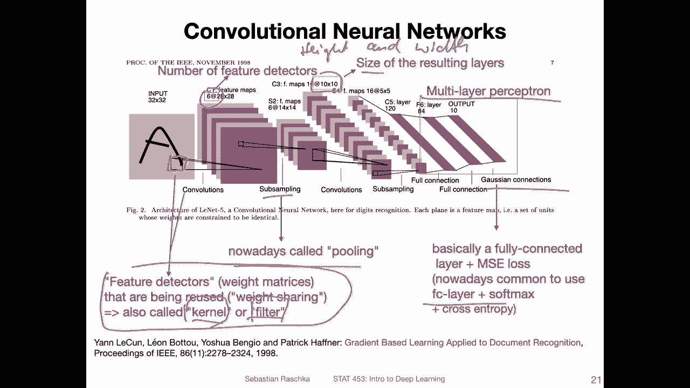
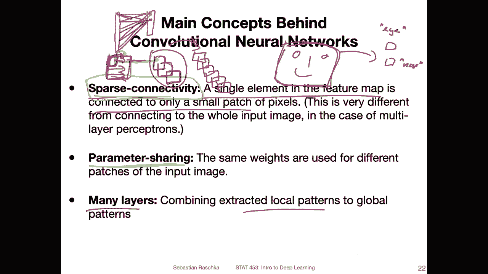
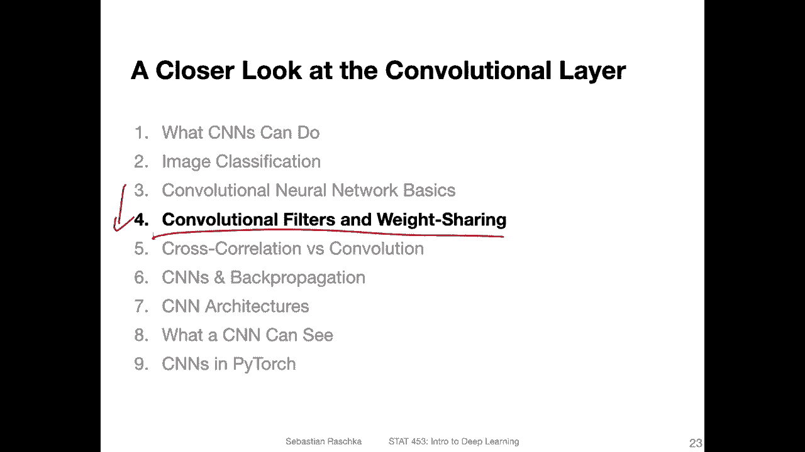

# P100：L13.3- 卷积神经网络基础 - ShowMeAI - BV1ub4y127jj

Allright， let's now talk about the basic concepts behind convolutional neural networks。

So I showed you this figure before it's from an article you can find here if you're interested。

 I thought that was actually a very nice summary figure of the different assumptions that neural networks make。

 So， for instance， the multilayer perceptron assumes that the features are independent。

 So that's the basic assumption behind the multilayer perceptron architecture。 I just see。Actually。

 this should be fully connected， usually in a fully connected or multiceptron anyways。

 So another one is that we have a time dependency or sequence。

 And that is something we will talk about when we talk about a recurrent in neural networks。

 So if you think about text。 So here we have。Essentially， a sequence dependency。

 if you want to analyze text from left to right or something like that。

 or you want to do stock market predictions on something where you have a sequential component to the data that would be something for recurrent neural networks for convolutional neural networks。

 we have this locality assumption。So this is what we are going to talk about and specifically this is for two dimensional convolal networks。

 You can technically also use one dimensional convolal networks to analyze text but here we are going to focus on the two dimensional case for simplicity that is image analysis。

 So here imagine this is our input image here and how what the conversion network is doing。

It's assuming essentially that these patches here， the pixels in a certain neighborhood。

 they are connected to each other or they are related to each other。 And it makes sense for instance。

 if I draw a face as let's say my my image， you know that if you take this region。

 these are all the pixels for the eye that have a relationship to each other。 So that way。

 these pixels here in the eye region， they are not independent， they have some。

 yeah some local dependency， right。So， and that is what the CNNN is trying to capture。

So here is an illustration of one of the earliest convolutional neural networks。

 at least that's the one， I think that was the first published version of it。

 So this is yeah by Yan Lekun and coaus back in 1989。

 So it's a long time ago actually but this is still relevant。

 It's still I would say the main architecture for image classification， I mean。

 not this particular architecture， but the convolutional neural network architecture in particular。

 I think this one is actually called Lynette。5， there might be other variants of lineard 5。

 And I will yeah also show you how to implement that in Pytht and how to apply to M N。 But yeah。

 let's focus on the big picture here first， so。Here。The authors used input images。

 handwritten digits， similar to Mnes。 So heres an example of how they look like。

 And the goal back then was， yeah， here in that case， handwritten zip code recognition。

And the inputs were 256 times 256。 I think that's 16 by 16 smaller than Nest。And you can see。

 like I showed you on the previous slide， there are these。

Image patches or these patch regions that are analyzed。

 And you can see what is going on here is that。Well what's illustrated is that piglets from this patch region go into。

Here into some will become a pixel in the next layer。 So if you have multiple layers like。Input。

Hidden layer 1， hidden layer 2， hidden layer 3。 And then here， the output。

Then you can see there is always a patch that is analyse and it goes into the next layer。

 and the same thing is going on。Here， so that way， there's some feature extraction going on。 And。

 in fact， also this is only aesthetic image。 What you would do is you would slide this patch here over the image。

 So you would start in the left corner and then move it to the right and so forth。 So you。

Essentially， move this。嗯。You move this around like this from left to right and then from top to bottom。

But this will become clear。 I will show you， of course， additional， yeah。

 illustrations where this will be more， I would say clear here。

 This is a very old figure and some things are maybe not so easy to see here。 Another thing。

 for instance， to highlight here is。That there are two， two of these。 and actually， in fact。

 there are 12。 So then they are dotted between。 So there would be 12 of these so called yeah feature maps。

 And let me just maybe forward because I have another illustration of the same architecture that is a little bit more clear。

Yes， so here is another illustration of that architecture， except that yeah。

 the inputs a little bit larger。 They are 32 by 32。

 It's from a slightly newer paper where they apply this to document recognition instead of just zip code recognition。

 So here this also includes letters and not only digits。 But here， again， the same concept applies。

 And I think this is a little bit easier to yeah to interpret。 And this is， yeah。

 this is than lineette 5。 And I will show you a code implementation in Pytage。

 I yeah just implemented that also in code。So。What's going on here is essentially that we have these what we call convolutions。

 this operation where you take a patch from the input。And then project it up to here。

 And how does this compute， I will， of course， explain it to you for now。

 Just assume somehow these pixels get。Summarized into a single pixel， which goes into the next map。

 These are the so called feature maps。So here I have one，2，3，4，5，6。6 of these。

Fhiatureips thats this number here。And。The input is 32 by 32 and if I do this if I start on the left corner。

Then， compute the first。Pixel here。 and then I move。

This by one pixel to the right and then compute the next pixel here。

And then move this again to the right and compute the next pixel。 My output would be 28 by 28。

 because that's just because of the cutoff， because if the kernel here in this case is 3 by 3。

 or I think it might be actually bigger。 You cut off something on the left and on the right hand side。

 But this is a detail that we will discuss。in a later video， I think this is actually a 5 by5 corner。

 then it makes sense here。 So if we have a 5 by5 corner， we would on each side， cut off two pixels。

 So we lose two pixels of the input。 So which is why it's 28 by 28 and not 32 by 32。 But again。

 we will discuss that in a future video。How exactly things got calculated and cut off。

 So here that just the big picture is that we go from the input to these feature maps。

 and then we go to another。Feature maps thing here， another and another and so forth。

 So we extract these feature maps。 And what you can see is。First of all， this is。

Here a step where we add channels。 So， in fact， there are now6。Channels here，1，2，3，4，5，6。

And we do that by using different， different of these feature detectors。 Let's call that。Ficon。

Detectctor。And we have six of these feature detectors in each feature detector we slide。

Over the image。 So let's say we have this red feature detector that we slide over the image to produce this feature map。

 And then we do the same here with the green 1。The green one would be。Another feature detector。

 then it produces this feature map。 And just to see me， we have six of these。

 And here there is a so called sub samplingling operation。 We will see later。

 This is also called max pooling。 And here， what we do is we just reduce the size。 So this is like。

So this first is the convolution and the sub sampling。 you can think of as。Let's say， size。Reduction。

And then again we do another convolution。 Now we have 16 feature maps。

Then we do another sub samplingling， another size reduction。And then。We end up with this year。

 and this year， they get now reshaped so we can say reshape。In if you will see the code later。

 it will also become way more clear。 So that's just the reshape operation to reshape that into。

vectorctor。And。For instance， when we have this reshaped  one。

 we can then use a fully connected layer and another fully connected layer to compute the class labels。

 the outputs， so。

I illustrated this here in this slide。 This is essentially the main， I would say。

 the main idea behind convolutional networks。 Besides using these local filters。

 it's that we have automatic feature extractor。 This is essentially the deep learning part about it。

 So instead of having a human manually extracting features from input images。

 Theres now this automatic feature extractor， the convolutional layers。

So the convolutional errors are doing automatic feature extraction that is learned by using back propagation。

 And then in the end， part of the convolution network is here this。Fully connected part。

 Or you can think of it as the multi。There。Perceptron。Part。

 and this is then essentially just like a classifier。So here when it gets these fully connected。

sorry， the vector， the reshaped vector。 This is essentially then here like a regular classification。

 And this is a feature vector that was automatically extracted using these convolutional layers。

Yeah， and each convolutional layer here， you can think of it as one hidden layer in this network。

 So if we are counting the number of layers， we have five networks， five layers in this architecture。

 So the first convolution here。 So it's the first convolutional layer here。The sub sampling there。

 it's essentially just。It's also sometimes called pooling。It doesn't have any weight。 Per us。So。

 there is no real。Learning going on。 So we usually don't count those as layers。

 We only count the layers that have weights。SoSo in this case， first layer。Second layer。

 the other convolution layer。 And then we have1，2。To fully connected layers。 So that's3。

For these are essentially hidden layers。And then we have this output layer。 This is another one。

 It's output fifth layer。 That's why the network here has five layers。

Yeah， so here is an annotation of everything I talked about in a previous slide。 So yeah。

 the this first number here represents the number of channels。

 this the second and third number represents the height and width。 So the size。 So let's say height。

Whi。Like I said， this last part is a multi perceptron part。The sub samplingampling nowadays。

 is usually called pooling。And yeah， these are the so called。Feature detectors nowadays。

 also we call them kernels or filters really depends on kind of who the author is and who let's say wrote the libraries So some machine learning or deep learning libraries use the word kernel。

 some use the term filter and nowadays they are pretty much interchangeable。

I most often happen to use kernel， but I also recently try to use the fill a term filter。

 more often it's a little bit more modern。Here's one more。A note about the Scussian connections。So。

 this is essentially。What they did here is they used fully connected layer together with a minquadarrow loss this was usually called a Gaussian connection and nowadays。

 as you know in multilayer perceptrons it's more common to use the fully connected layer with the softm activation and the cross entropy loss。

So here is a summary of the three main concepts behind convolutional networks so based on what I just showed you in the previous slides。

 so there's one aspect that's the sparse connectivity so that means that a single element in the feature map is connected to only a small patch of pixels which is very different from fully connected neural networks so just to illustrate what I mean again so if I have my input image here。

Then， I have my own。😔，My feature map here。In the next there。 And we use these kernels。

 like I explained to， So tocent essentially focus on a small region and then project this as a。

Let's say activation into the next layer。 That is what we do in the convolution network。

 If you recall in the multi layer perceptionceptron， we didn't have this sparse connectivity。

 We had a full connectivity。 That means。When we had an input image。

 we were usually reshaping it into a long vector， right？This one here。

Would become like a long vector。 And then how this worked was for all the inputs。

 So the whole thing when became a activation in the next layer。 So the whole。

Maybe do this differently， so。In the next activation in the next layer， this is our next layer。

 all the。All the inputs are connected so in that sense。

 it would be similar to using a kernel that has the same size as the whole image and then projecting it here right so if we had a full connection so sparse connectivity。

 that's one aspect behind convolution networks， but then there's also the aspect of parameter sharing。

So what that means is that we use the same， exactly the same filter here or kernel。

Or feature detector that we slide over the image。 So once I compute this one here。

 I move it by one position to the right。 Let's say like this。

 And then I compute it for the for the next position。 But I'm not creating a new filter。

 I'm using the same filter and just move it by one position up to the right。 So that way。

 I'm doing a parameter sharing here。 I'm reusing that。 again， in a multi layerer perceptron。

 we would have。A completely different set of weights for each hidden activation， right。

 So for this second one， I would have a completely new。Set of weights。

 which is not the case for the convolutional network， for the convolutional network。

 we just slide the same weights over by one position and reuse that。

So this is why you can think of it as a very general purpose feature extractor that should work for all regions in that image。

But。Yeah， what we have is we have multiple of these feature detectors so we can have multiple to produce these different feature maps。

 right， so there could be three feature maps so I can have three of these filters。

 but for each feature map I'm reusing the same one that I'm sliding here。Yeah。

 and another aspect is that we have many layers。 so when we do the convolution here。

 we construct feature maps and we do this many， many times and over time this is essentially over many layers。

Usually， what we do is we。Create more channels when we go from one to the next layer。

 And this is essentially to extract patterns。 And it will， I will show you an example later。

 What effect that Ha has is that it is。Basically， essentially。

Trying to extract local patterns from the global ones， so。You have a big picture I mean。

 big in terms of the size of the pictures relatively large。 But then yeah。

 over or the course over the training， it will from this global picture， extract local images。

 So information about the eye and the nose and things like that。

 So it will instead of just regarding this whole thing as one image， it will then have one。

Feature map that represents。Let's say， I and one that represents。ns and so forth。 So in that way。

 it's learning based on more local patterns from this global image。

Okay， so this was really the big picture overview a view。

 I can imagine there was a lot of new stuff going on in this video so things might be unclear instead of maybe rewatching this video I recommend you maybe for now to keep going and watch the next video because I will go into a little bit more detail about the convolutional filters and the weight sharing and I think this might clarify some questions you have and if things are still unclear after that then maybe revisit these two videos but right now I would say。

If things in this video were unclear， keep going before you rewatch this one because the next video really might clarify some things。

