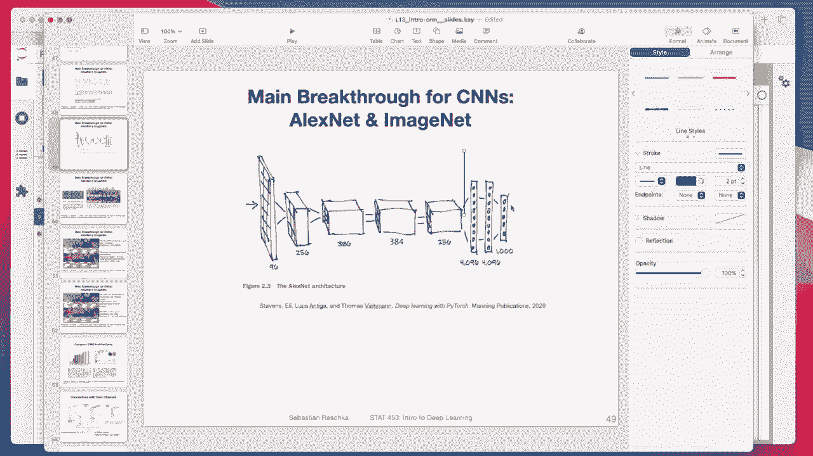

# 【双语字幕+资料下载】威斯康星 STAT453 ｜ 深度学习和生成模型导论(2021最新·完整版) - P109：L13.9.3- PyTorch 中的 AlexNet - ShowMeAI - BV1ub4y127jj

All right， in this video， let's now talk about Alex Nt trained on Cypher 10。

 So just to recap how Alexnett looks like， It's this architecture where we have。

Its input 96 channels， then 256 going from 90s。 So the input images， first of all。

 are 224 times 224 times3。The first， after the first conversion， it's 96 channels。Then 256 channels。

386， I think there should be 384 like I mentioned I think this was a typo， then another 384。

 256 and then these fully connected layers and you can see these fully connected layers are really huge so there's 40964096 and then 1000 class tables I shortened the first layer of it from 96 to 64 but overall I try to keep the same architecture that I implemented notice that we are not training it on imagenet we are training it only on Cypher 10 images which are smaller so。

And that way， I made some small adjustments to yeah account for the smaller size of the input images。

So， here。

Everything should be the same as before。 I'm actually not rerunning this now because this might take a while。

 I will show you at the end how long it took to train this architecture， so。

I renders on a GPU， also。So first of all， I let me only go through the changes that are different from the Lyette that I showed you before。

 One change is that we now have Cypher 10 images instead of amist images。

 So what I'm doing here also is I'm making the Cypher 10 images larger than they really are。

 So Cypher 10 is 32 times 32。 But I'm making them larger， like 70 times 70。

 because otherwise I get problems with the dimensions。

Because otherwise， we go back to the overview here。 Otherwise here at this point。

 the height and width will be too small。Essentially， they will be nonexistent， basically。

 So in that way。

I have to resize the input images to make this network architecture work on Cypher 10 and what I'm doing is also to make the network a little bit more robust towards overfitting。

 All I'm doing is I'm doing a random crop。So I'm randomly cropping a 64 by 64 region from the 70 times 70 input。

 that's during training。 And every time I'll be a different random crop。Then yeah。

 the regular totensor thing。 And then here I'm normalizing the channels。

The color channels to be the pixels to be centered at 0。

 you could technically also compute the standard deviation and mean from the actual image data。

 but here what I'm doing is I'm just yeah normalizing them in a very simple way that the pixels are centered at 0 and have in the range between -1 and1 that is the same as I did with MN before。

 but now I have three color channels So that's why I'm doing it like this if I just go back to my MN1 I only had one color channels so I only had 0。

5 here。

All right。Notice that I'm only doing this random crop for the training。

 I don't want any randomness when I apply my model to， let's say。

 new data during prediction and validation and test data。

I' mimic mimicking new data because I use that data to evaluate how well my model might perform on new data。

 and it wouldn't make sense to have some random cropping for new data。 if you have。

 let's say customer， let's say at the airport or you want to do face recognition to see whether the person at the airport is the same as in the passport or something like that。

 you do don't want to just do random。Crops and predictions。 you just want to do center crop。

 So the random crop is just to make the model more robust towards small perturbations。嗯。

Yeah， so here we use then the center crop instead of this random crop。

The rest is all the same as before。I have my images my batches are 256 in size， three color channels。

64 pixels high and 64 pixels wide。

And also have 10 classes。Here's the Alexnet architectureect， so。

Can maybe be。Highlight the blocks。 So this is one convolutional block。

And there's another one。Just separating them out here。

So， these are。The convolutional box here， I only have max pooling， essentially。Oh， sorry。

 what I did was not ideal。 I should have done it like this max pullinging。

 comfortably re max pullinging。Noticed here is。No pulling in between。

So yeah， just yeah， separated them in two。

Blocks。You can't see it here might be visible here so you can see。Max pulling， max pullinging。

 Max pullinging， but no pullinging here。

Try to implement that here。

So that is how the Alexnet looks like。 That is now the feature extractor part。

 So this whole part here is the feature extractor part。 So I call it again features， so。

It's essentially that part。Up to。Up to here。And then the right side here is the multily perceptioncept part。

So here， I call it again classifier。 I also have an adaptive average pooling here。

 So what that will do is it will。Take whatever。Size that is， whatever size comes out of here。And。

Poulls it such by averaging such that the output feature met will be 6 by 6。

 So in that way I can rely on that that what comes in here in the linear is 256 times 6 times 6 because here I know that the number of channels that comes out of here is 20256。

 So if I go back here， that's 256， and I know the size is 6 by6。

 I'm saying it by average pooling So if I give it larger images if I give it images that are I 150 times 150。

 It will also work the same way。 I don't have to adjust my code。 However。

If I have images that are smaller， than whatever I have as input。Like the original Se 10。

 this will not work because。At this stage， we may have a three by3 or something like that。

 and this doesn't upscale。 It only downtscales， but it doesn't upscale。

 So what I'm saying is if I would change it to 30 times 30 everything we have to also change that to something like smaller than 30。

 would you get the idea if this is smaller than 70 times 170。

This will fail because what comes out of here is not 3 6 by 6。 It might be 3 by 3， for instance。So。

 adaptive average pullingdding will。Downsize something to a common size。

 And this will allow me then also to receive larger inputs。So in that way。

 the architecture is not so picky towards the exact resolution。

If I wanted to train it'd say on a different data set。Okay， so。Here， that's my fully connected part。

 So I'm using dropboard in between Did they use dropod actually， or did I。

 I think I just edit it because I had the overfitting。

Yeah， I think so。

I don't think they had it in the paper， but I would have to double check。 I can't see it here。

 I would have to double check in the paper， but I am pretty sure that something I did because I was having massive issues with overfitting。

 I will show you next。

Alright， so here we have the features。Then we have this average pooling that brings everything down to 6 by 6。

 And then here， this is my。

Fully connected 1。 I could have used a flattening， actually， could have used。The where is it。

Could have used the flatten。But well， I didn't。 I think the flatten is also relatively new。

 So I sometimes forget to use it because it's just recently added。And then I'm calling my classifier。

 which gives me my predictions。 And that is， then here， everything is the same as before。

I'm using again， the same SGD with momentum。Running rate scheduler。

Same thing。 But now it takes much longer to train。 So it took， I was running it for 200 epochs。

 and it took long time。

Took approximately， yeah， three hours， almost。And what was also interesting is。

 so usually what I do is when I train the network， I take a look at at this output here。

 So it's maybe also as a tip for your homework 3。 When you train the network。

 you want to see that the validation goes up and you want to see that the loss goes down here it's going up。

 I would give it maybe sometimes a little bit more time， sometimes it goes a little bit up。

 but you want to see at least maybe45，6 epochs。

That the loss decreases。 if you see it does not increase or it even increases。

 I would actually stop the training because then it's usually that you have a learning rate that is too large。

Or other issues。

So but yeah here I saw， okay， it's training well。 and then I saw， okay， what's going on，68，66。

67 what something' is weird here。 And somehow I honestly almost wanted to stop it here。

 but I was busy with other things and I just let it continue training because even down to 62。

 I didn't stare at it the whole time because I was like 25 minutes。

 I was doing something else in the meantime。 And then I was quite surprised when I looked at the plot。

I had actually this double descent phenomenon that I talked about in a previous lecture。 So。

 first of all， the loss went down and then wind went up again and then with this double descent over the epoch。

 So the epochwise double descent， I saw it went down again。

And then it stayed here。 So you can also see the same thing for the training validation accuracy。

 It improves， then it comes worse， and then it improves again。 But overall。

 you can also see the huge degree of overfitting 20% that's I had already drop out。

 but it didn't help that much。 And that's yeah still overfitting。

 So one thing that might help is maybe adding more dropout or also adding more data augmentation。 so。

If you go here。If you go here， instead of just random cropping。

 you could also yeah do something with a colour jitta and rotation and things like that that might also help with the overfitting。

 So in practice， if you find overfitting like that。 But yeah。

 I was a little bit under time pressure to get this code finished for the lecture。

 And it already took a long time。 So I didn't want to rerun everything to reduce overfitting。

 might be an interesting exercise， if you are interested to try this out。 Okay。

 so then Im just looking at some results。 So I visualize them。

So notice here I'm doing， I'm using this unnmalized function that I implemented somewhere in my helper function。

 I think I have it here。

YouSee。😔，Let me maybe double check where I implemented that and let me scroll up。

Unorized data sets。

Right here。 So here the un normalmalizing is essentially undoing my normalization with this 0。5。

 So here I do the normalization。

And here， Im undoing my normalization so that I can plot the images。 So I'm essentially multiplying。

By the standard deviation。And then adding the mean。 And I do that for every channel。

 That's just a very compact way of writing this。 You don't have to understand this in detail。

 It's just very efficient。 I mean， I wanted to just write this in one line， instead。

Writing too much code here。 Alright， so essentially， this will anize。

So I have to provide the information that I used for normalising。 So I provide them。

The same way And just as the same thing as the normalizing， but inverse like。Reeversing it。All right。

 so。

Then I give it also the class dictionary with the names so that in my plot here， my show examples。

 but I can actually see the names， the predictions。 can see actually， And this looks cool here。

 it's funny。 it actually it gets dogs and cats wrong。

 So the predict label is dog and the true labor as a cat。

 which I think justifies the fact that so many people work on cats versus dog classifiers because it's actually a challenging problem。

 Okay。😊。

And then again， my confusion matrix here just to look at what they get。Currently wrong。

 You can see it's kind of interesting。 The dog versus cats is a category that is often almost often wrong in this data set。

 It's kind of funny。

Also， ship an airplaneplan here。And frorog and cat Oh， fck and cat。 I mean， not that similar。

 but okay。

Yeah， so that is how Alex networks。 And it's essentially overall， it's the same as Lyette。

 except that we have no color channels and the network architecture is， of course， bigger。

 So if I can screw up again， takes longer to train and it's， yeah I can see it's。

 it's much bigger than our Lyette before which was just yeah， smaller network。 Allright。

 that's it then for the lecture。 I mean okay， let me just briefly go to this one because I have it。

 So here I。

Trained another CNN。

If you're interested， try to get better accuracy。But it is just a， yeah。

 see an end with patch norm and leaky Relu and to drop out trying to reduce the overfitting。

But yeah， you can see it was not that much better。 It gets some， somewhat better accuracy。

 It trains only 3030 minutes instead of three hours， which is also an improvement。

Doesn't have this double descent， but it's still overfitting by a lot。

 It gets 10% training accuracyc though， which is quite surprising。 So okay， yeah， it's another。

Network， it gets confuses a deal with an airplane。 It's also interesting。 Also。

 the cat where the stock is wrong here again。

Yeah， also cat with stock。 It's apparently a challenging， challenging category。 Alright。

 so that's it then for this lecture in the next lecture。

 we will take a more detailed look into different neural network architectures。 I mean， these two。

 Lynette and Alexnet。

Ire really like beginner architectures。 They are quite old。

 but there are more powerful architectures。 And yeah， that's the topic of the next lecture。

