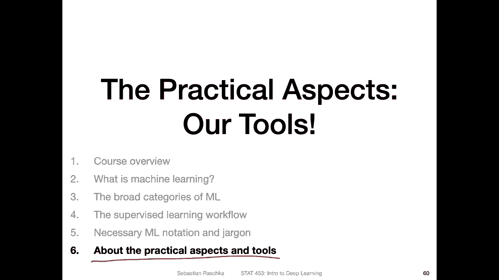

# 【双语字幕+资料下载】威斯康星 STAT453 ｜ 深度学习和生成模型导论(2021最新·完整版) - P10：L1.5- 机器学习符号和专有名词 - ShowMeAI - BV1ub4y127jj

Yeah了。Yeah now let me go over some of the necessary machine learning notation and jargon。

 something that we will be using in this class over and over again and that is also commonly used in the machine learning and deep learning communities。

So yeah， on revisiting the term supervissed learning， What is supervissed learning。

 It's about learning a function that maps some input X。To some output Y。

 where x are the features and y are the targets。 So， yeah。

 like you remember from the previous videos， the features， or we also call them。Observations。

They are usually vectors or yeah for example， the flower dimensions， sal length。

 sal width petal length and petal width or pixels of an image and so forth， by the way。

 if I write a vector， I would then if I do or use handwriting。

 use this a little error to denote a vector and I will try to use if I don't forget an underscore and a capital letter to refer to a matrix。

And X， if I don't use any of this would be a scalar value。 So here， though。

 I was just writing x as a scalar， but features in practice can be also vectors。 So anyways。

 we are getting ahead of ourselves here a little bit。

 So the next term here on this slide is structured data， which we discussed us in the previous video。

 So the term structured data usually refers to data in the format of yeah tables can also also think of it as。

Tular。😔，Data usually comes in the form of databases， like if you know SQL databases， for example。

 or if you think of Excel spreadsheets or CSV files。

 this would be a typical example of a structured data。Then yeah unstructured data。

 this is usually what we refer to as the raw data， for example， images， the pixels and image。

 audio signals or text sentences like documents， and this is usually something that yeah deep learning works with。

So and before deep learning， we usually needed extensive feature engineering， as I explained before。

 where we extracted features from raw data sources。So here on the right hand side I。

Just wanted to show you another example of yeah raw image input versus。

Something that requires feature engineering。 So， for example， here you have a portrait of image。

 And let's say the task is。Face recognition where you want to。Match multiple faces。

 So here I don't have multiple people where we want to compare whether it's the same person or not。

 So we don't have really face recognition matching。 However。

 what I'm illustrating here is that we can extract features from this image。

 So here this is a traditional method。 using like facial key point extraction。

 So or extracting so-called face landmarks。And on this would be a feature engineering step like simplifying the image such that it only now contains these key points。

 I think there are around 67 or so key points。 So we reduced the complexity of the dataset by having a high dimensional data set。

 So if this is， for example，200 by 200 pixel image。We would have。40000 pixels or 40000 features。

 including background and everything。 and we here we just simplified it and only have。

 I think it's 67 features I could be wrong you would have to double check。

 so here this is actually a function I implemented based on。Lirry called Deup。

 which implements this face extraction。Here I'm just yeah I implemented a Python Reper function to make it a little bit simpler to use any case。

 so here this would be an example of manual feature engineering。

 like reducing the complexity of the problem by extracting a smaller number of features from this raw input。

Okay， so moving on so here on this slide some more terminology。

 so a training set we usually refer to it as D and a training set comes in pairs of these observations the so-called training examples or features and the target labels and like I said I will be using this error notation。

 if I do handwriting to refer to vectors so in if I don't do handwriting like in the slides using computer font I will make them bold。

And yeah， for scalrs， I won't use。Bt front。Then a training data consists of n training examples。

 so that's the number of examples in a training set。And I will be using the square。

Brackt notation here as a superscript to refer to the training data points index。

 So if I write something like。10。Then this means that's the 10th yeah， training feature。

Feature vector in the training sets， I'm referring to the10th training example to the feature vector of the 10th training example。

So。Then in practice， so usually the data set， the training data comes from some data generating distributionion。

 something could be a natural physical phenomenon that has created our data and so forth。

 so there exists some unknown function that associates our feature vectors with some label。

And the goal in machine learning is yeah in supervised learning is to yeah predict the labels。

 So how we do that is by approximating this unknown function。 and yeah。

 traditionally this is called the hypothesis nowadays I think the hypothesis term is a little bit dated we can just call that model we don't have to use fancy terms like hypothesis we can just call that a machine learning model So it's like a more common way to refer to it。

 So you can think of the machine learning model as a function that approximate approximates this unknown function。

 So it will， for example， in the classification example return predicted label So we can write the predicted label as y head for example or we can just call it target target t or output O always maybe a little bit tricky because it almost looks like a zero but yeah these are all equivalent notations。

 So in this way is age you can think of。It is the machine learning model。Yeah。

 and classification again。 So we have the model， which here is a function that maps some M dimensional input vector。

 So this would be our features mapping those。Yeah to some targets here。

Where the targets in the term in the context of classifications are class tables。

 so we can have up to k class tables。 So usually K is larger or larger equal to two。

 We have at least two classes in the case of the iris dataset set that I've shown you earlier。

 There were actually three possible classes on Cosa。Vsy color。And orica， for example。 But yeah。

 of course。Really depends on the dataset set。 there is no limit to the number of classes you can have。

 Also， yeah in regression， we have a input vector that is m dimensional。

 and we map that to a continuous to real valued number。Yeah， more about the feature vector。

 So I said before the feature vector is n dimensional。 so if you think back。Of the Iis example。

 where we had the Sepal。leength。S Paul。With。Pol。leength。And pital。With， so we had。For features。

And then， if I look。At the training at at the index。Let's say。focuscus in on the。Thirdhir。😔。

Training example， I would write it down as。th3。And then it's a vector。

 So it's a third feature vector。 So in this case， we have a vector of consisting of。For values。

 So this is what I'm showing you here as the vector representation。So yeah。

 we have an m dimensional vector， and I will use the subscript。

Notation to refer to the feature index。 So if I write something like。3 here。

 this would refer to the third， the 123 to the petal length of the third。Training example。

Now in Python we start zero indexing， so if we do Python coding。

 it might be a little bit more complicated because we should we start indexing at0 in contrast to r。

 So in in Python notation this would be actually the fourth。Training example and the fourth feature。

 like petal width。Yeah， moving on and now here I have a feature vector again。

 just as on the previous slide。 However， in practice， we usually have multiple feature vectors。

 So one feature vector per training example。 So if you think back of the iris data set where we had up to 150。

Training examples。 Let's use the letter N here over the rows to refer， yeah， to the training。

Data points。 And then for each one， we had a feature that's called it feature 1， feature 2。

 feature 3 and feature 4。So we have this table here。 So you can also use。Let's see。😔，Dot dot dot。

 feature。嗯。So。Then each data point， So each。Observation is a feature vector。

 So in linear algebra notation， we usually yeah write a vector as a column。 However。

 we arrange the vector here as like a row vector。 So a row vector would be referring to one data point as one observation。

 So we use a transpose on that one to。I'll refer to this one here as the first。Yeah。

 data point in the table。 It's a little bit confusing the way I've written it here。

 because now I'm using the sub。 This is just because I have the trans post here。

 And then it's a little bit， yeah， a little bit。Squied， so actually。

 I could have written it as transpose。One， for example。

 it would have been clear or maybe so maybe ignore this notation here on the right hand side。

 I have the more Yeah， extended notation where I'm referring。

With a superscript to the data point index。So this would be all the first data point in the first row。

And then the subscript refers to the feature index。So if I pick， for example， this case here。

 this would be， what is maybe， with unfortunate， Let me use this one here。 This is the。

Second feature of the n data point。 So this would be if I go right here， so would be this one here。

 So this scalar value。 So usually machinery will use a design matrix I will use bold letters and if I handr this I will try to use an underscore code to make sure to indicate that this is a matrix because with handwriting it can be unclear if I do an x it's unclear if I don't yeah deote it further whether it's a vector or matrix and so forth So again for vectors I will use this notation and for matrices this notation and I may forget。

 but I will try not to。Okay yeah just to summarize this is a structured data set how it would look like in machine learning in the first couple of lectures we will actually be using with structured data before we go into working with unstructured data so in the first couple of lectures just as a warm up using simpler deep learning related methods like single layer neural networks and then multilayer neural networks that are fully connected。

 they will be working with also structured data and then when we talk about convolutional networks and recurrent neural networks which are the real innovations in deep learning then we will be using unstructured data。

Alright， so yeah， just to recap M is the。Peture。嗯， numberumber。So we have up to M features。

 and N is the。Yeah。Number。Of training。Examples， so I think the reason why I left the blank here。

 I wanted to ask you on that as an exercise。 So in that way。I already did the exercise for you。

 So here， the row。 I think it was what I was referring to。Yeah， training examples。

Where the columns are along。Features。And this is our one class label column。All right。

 so it was not very exciting， but yeah I was just summarizing how we think of a data set in the context of machine learning。

😊，Now， if we have image data， how do we deal with that。

 How does it fit into our yeah concept of representing data。

 So images are actually unstructured data， as I mentioned before。

 but we can actually convert it into a structured data set and if you think of image like this。

 this is actually a 28 by。28 image， which should be 700。84 dimensional， so we have 784 pixels。

Pixels are usually in the range between 0 and 255， however here。Assume I normalized the data。

 we will talk more about why data normalization is useful。

I normalize it such that the pixel values are in the range between 0 and1。

 So we have a pixel like several hundred。Of this。There are 84 of these pixels here。

 so you can actually all。Can see this actually lower resolution one pixel here and one pixel here and so forth。

 So I think， yeah， you know what I mean by pixel。 So we can actually use that as input to a traditional machine learning method in terms of。

Thinking of this as a structured data set by concatetnating the rows so we can make a long feature vector out of this image because。

 I mean， this is a matrix， right？ So it's like。嗯。28 by 28 matrix。

 but we can convert this into a vector by just concatetnating。 So take the first row。

Let's see this first row here。And then we have the second row。And just add it here to the first row。

And then。Third row。Heading it here。 So and if I keep doing that， I get a very long vector， in fact。

 a 784 dimensional vector。 and that is what I am showing you here in the center。

 we're probably already wondering what these numbers are。 and these are the pixel values。 So the 0。

0 refers to a white pixel。 So you can see in the beginning here。The image is all white。

 So we have all the white 0。0s here。 and then yeah you have these gray scale and black pixels which are about here。

 So we kind of converted this unstructured data set into a feature vector that we can then use with traditional methods。

 and we will also yeah be doing that in。A context of deep learning using simpler methods like multi layerer perceptrons。

 fully connected neural networks， so we will start with a simple approach and then build up to it and then later use the unstructured data directly。

Alright， so yeah， like I said before convolutional neural networks。

 which will be a topic yet later on in this course， convolutional neural networks， they use。

The image data directly and usually the format for that is also a matrix more precisely it's actually a three or four dimensional tensor。

Here so there are two two common representations。 one is called NCHW。

 We will talk more about that later when the time comes。

 but maybe if you are curious what it stands for， H stands for the height。

W stands for the width of an image。 So we have here the H times W。 So this would be a matrix。

 However， there's usually also a color channel。So C stands for color in this case。

 we don't have color because it's a black and white image。 So in this case it's so there's a one。

 So actually I'm showing you here the dimensions。 So 28 by 28 height times width and then the color channel and then usually in deep learning what we do is we bundle a bunch of images together as input for the neural network。

 So in we have something called a batch size。 So here I have 128 images where each image is。

3D tensor。 So in that way， if I consider all of that， it's a 4D tensor。 So in that way。

We are representing the data as ten source and this is why we need some basic linear algebra for this course while I mean we won't be using fancy things just simple matrix multiplications and dot products and I will also talk more about that later so right now I don't want to go into too much detail because convolutional networks that is topic far ahead a few weeks ahead and I don't want to talk too much about this here。

 I have to be honestly a little bit careful with the time because like you noticed I always try I try to avoid it but I always end up going on tangents and talking about things in too much detail too early I think so let me move on then。

Yeah here lastly machine learning jargon part2， so somewhat terms we will be using。

 I think this is more like useful as a cheat sheet。

 like something you can maybe refer to later when certain terms are unclear so when we say for example training a model。

That is the same as saying， for example， fitting a model or parameterizing a model or learning from data。

Then he had the word training example。 it's synonymous to saying， for example。

 training record or training instance or training sample。However， yeah， for example。

 when I teach other statistics classes， I usually use often as staians we use the term sample。

 but I find sample can be a little ambiguous， especially in the context of deep learning because if we say training sample it's not clear really whether we are referring to a single training data point or multiple training data points。

 So for example when I was writing my python machine learning book in 2015 in the first edition。

 I used the term training sample as I remember， I mean it has been six years ago。

 but I think I used training sample throughout， and then sometimes I noticed it was a little bit confusing do I mean now a single data point or do I mean the training data as a training sample So I data also went back and changed everything to saying training example。

 if I refer to a simple or single training example and then also plural I would say training examples。

IThink this is a little bit more clear。 And this is also something most people in machine learning and deep learning nowadays use。

 So the term training example。Then yeah feature feature is also synonymous to observation or predictor。

 variable， independent variable， input， attribute， Covariate。

 So in other statistics classes we are often using the term， for example。

 predictor and things like that or even covariate so here in machine learning and deep learning we usually use the term feature。

Then yeah we have the term target， which is synonymous to outcome ground truth。

 output response variable， dependent variable in a specific context of classification。

 We also say class label or yeah， just label。So also， these are all the same thing。

 And then yeah lastly here output prediction。 And this is what the model produces。 This is different。

 Yeah from the target。 So the target is we want to predict the target。 So this is the ground。

Truth or something that is provided in the data set and the prediction or output is the thing that the model returns。

 and we want to usually match the target。Okay， so this is it forja jargon and the next video I want to briefly talk about a little bit more about the tools that we will be using in this course。

