# 【双语字幕+资料下载】威斯康星 STAT453 ｜ 深度学习和生成模型导论(2021最新·完整版) - P112：L14.1- 卷积和填充 - ShowMeAI - BV1ub4y127jj

Okay， let's now talk about patting。 So padding is a mechanism that allows us to control the output size。

 in addition to choosing the strideite。 So before we talked about only the simple case of a stride that equals one。

 and that means if we have an input image。 and then we have our kernel。

 then a stride of one means we move。One position to the right。 And then we do the convolution。

 And also then later one position to the bottom。 So we move by one pixel each time。

 So the whole kernel， we can choose a stride of two。 So in that way， we move by two pixels。

 each time。 And this would essentially approximately。Shrink the size of the output by half。

 So the output with a straight of two will be approximately only half as large as the input。

So the padding is kind of like an opposite to that。 it allows us to make the output larger。So。

 let's assume we， we have。This image here， and。We have this output， So input。And output。

So then again， we have our。Colonnel。Slilightdes over。The image input。

 the kernel is not really important here。 per se， I mean， it kind of is。

 But so what we are doing now is we are adding a row if we have a padding of one。

This would be patting with one， one on each side。 You can also actually control this more finely。

 you can say。1 for the top。1 for the right side， one for the bottom and one for the left。

 So we have a patting of one on each side。 that means we add one row of pixels on each side。So。

 it's essentially。Anying another。Rule of pixels。And essentially， usually， we set these to0。

 So they are usually just zeros。 So we are adding in this。Kind of empty。

artificialific border around here， which helps us to control the output size。 because now。

 instead of having the kernel like here in the center。

 the kernel would start actually here if we have a two back2 kernel， for example。 and then we。

Depending on the right would either slide by one or two positions to the right。 So by that。

 we can kind of make the output slightly larger。 Of course， this is like a patting of one。

 We can also generalize that have other values like patting of two rows around here。

 And if you have a non quadratic image， you can also。Compensate for that， by also making。

The padding only on the left， on the right hand side。

So this is like the basic concept behind padding。 it's essentially just adding a border around the image。

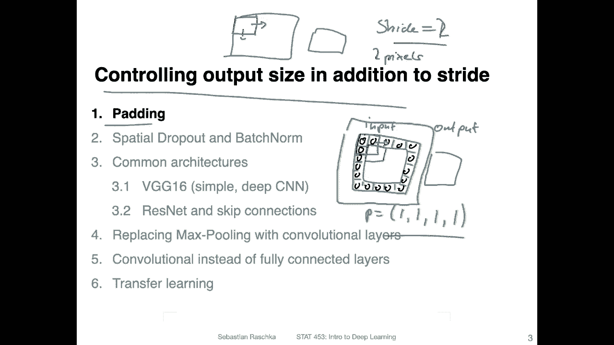

I believe I already showed you this equation last week。

 This is the equation for computing the output size of a convolution layer。 So last time， though。

 we regarded padding as p equals 0。 So we didn't have any padding。 So this term canceled last time。

 But yet now we can consider。This equation with a padding that is non0。

 So this whole equation allows us essentially to compute the output size for a given input size。

 or in particular if。Oh， the output is the output。widthth。

 so we can do the same thing with width and height。 and the same would also apply for the height。

We computed as the input width。Time a two times the patting amount minus the kernel size。

Divided by the strite。And then we are rounding this down。 So this is the floor operation。

 And then we add a one to it。 So this is how we compute the output size。

 So let's take a look at some of the examples of that。

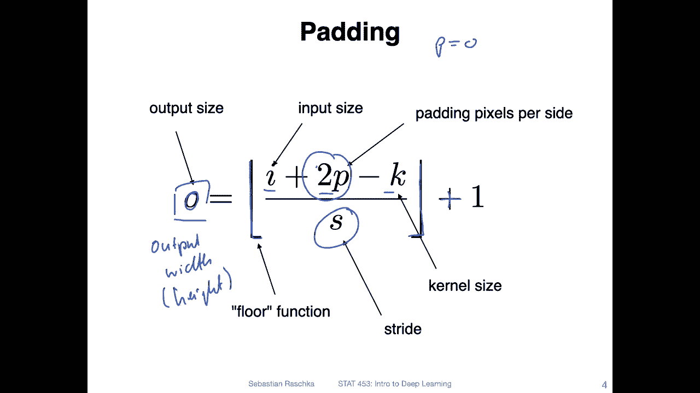

Yeah， so there's a relatively nice article called a guide to convolution arithmetic for deep learning。

 So I have some visualizations from that article here。

 and we will also revisit this article another time later on when we talk about deconvolution or the so-called transposed convolution in the context of convolutional autoentas。

 But for now let's focus on the regular convolutions。 So in the left hand。😊，Upper corner。

 I'm showing you an input of4 by4。Input。With a stride of one and no padding resulting in a two by two output when I plug in these values in the previous equation。

 So that's actually an animation so you can actually see how it looks like when we do the convolution so you can see how。

 yeah how that works。So we just move by one pixel position。

 And there you can see we actually lose one pixel on each side。 That is because， yeah， we。

 we don't go over the edges。 So in that way。The output will be by two rows and two columns shorter than the input。

So in the the next one， which one is it？Or the upper right one。 So here I have a paning of two。

And also here。 So each side has a padding of two。 And you can see now the kernel slides over the padding as well。

 So the paddings these are usually just zero， so they don't contribute anything to the computation right？

 So when you compute the convolution， it's in a way await weighted sum and these are zeros。

 So nothing really happens。 you don't you don't change any value so。What I mean is。When we have。

This case in the upper left corner。Only these values contribute， because these are essentially。嗯。

X times w as well， but the x is equal to0， so which kind of doesn't do anything。

 So here in this case， it will only focus on this corner here。Yeah。

 and this is how you can then control the output size a little bit so that you don't lose。

Pixels on each side。 So this is like an extreme case here。 The output is even bigger than the input。

Yeah， that is also kind of an artifact of the fact that kernel sizes4 by4。

 I why did I pick this particular example， That's just because there wasn' an animation for that one。

 Usually in practice， it's more common to use3 by three or5 by5 kernels。Last one left lower corner。

 and this is Str of two。 So if you had or were unsure how the Str of two works now as an example。

So in this case， also we get an output of two here， the input is5 now5 by5。Resulting in output of2。

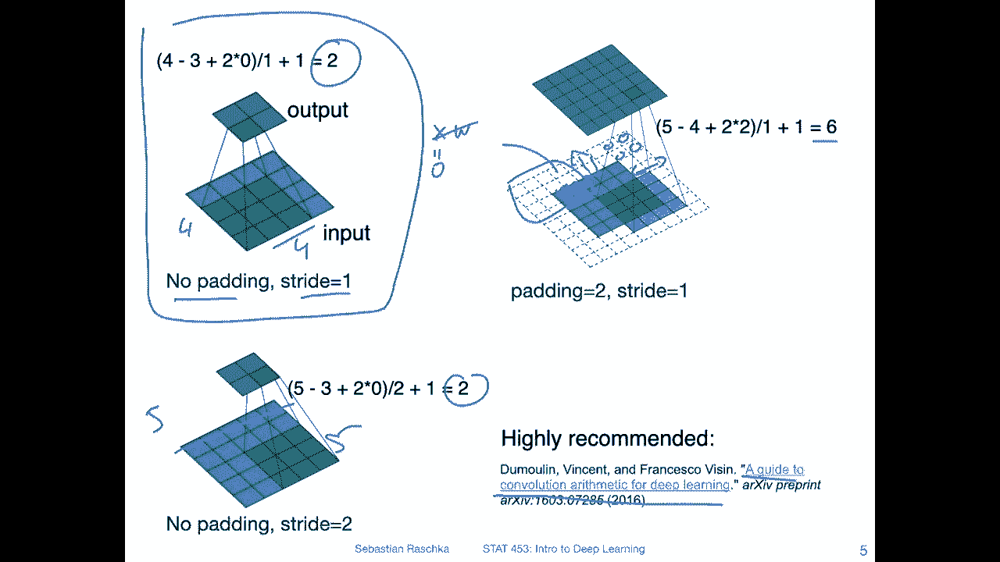

All right so。There are two。Main terms I briefly wanted to mention in Pythtorarch。

 they are not commonly used。 It's more like I would say。

 a more traditional wording that was kind of used in。Tsorflow。

 at least when I used Tensorflow back then。 So there's something called a valid convolution and the same convolution。

 These terms come from more traditional computer vision。

 and a valid convolution means essentially no padding。 And this can have as a consequence。

 the shrinking feature map。 So if I go back one slide。

So。This one here and this one here， These would be valet convolutions。

 So that means we are not going over the edge。Off the input。Why valid， I don't know why valid。

 but probably it's really referring to the fact that we stay within our boundaries here。

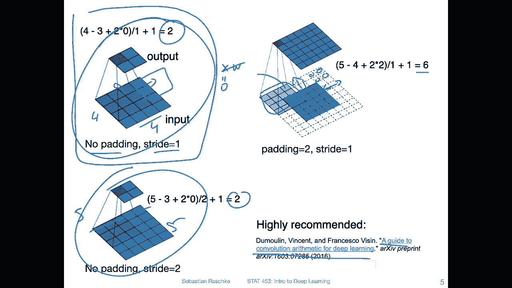

The other one？Is called same convolution。Same convolution means that we usually choose a padding such that the input and the output size are the same。

 So the output size equals the input size On the previous slide。

 I don't have any particular example of a valid sorry of a same convolution I should have maybe added one for the same convolution。

 we would have an example where the input size as exactly the same size as the output notice it's not always possible。

 So in this case， if we have to have a 4 by4 kernel， it's not possible to maintain this size。

 if I would have one row of padding also even then I wouldn't be able to get the same input size。

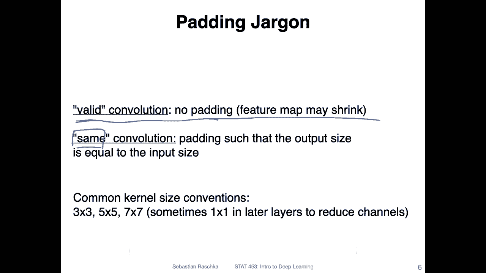

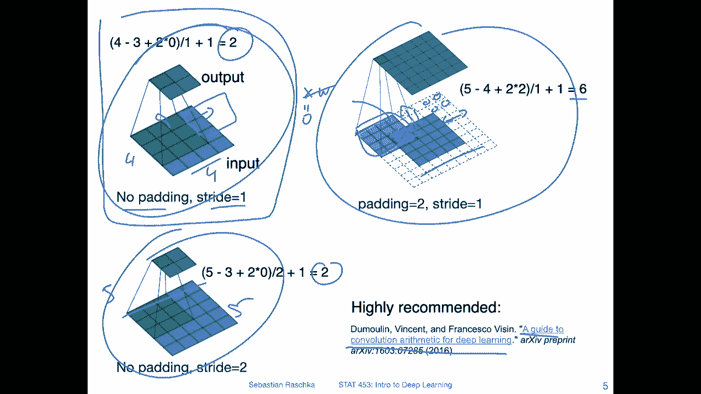

All right。Yeah， and this is maybe also why common kernel size conventions are3 by 3。

5 by5 and7 by 7 so that you can actually have a same convolution。

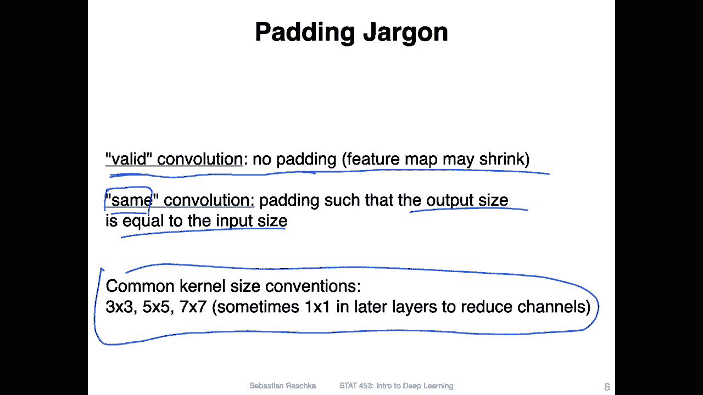

So how do we choose pitting so that we get same convolution？

So you can do this by rearranging things if you， for simplicity， now ignore the flow operation。

With a stride。 So if you only use a stride of one can cancel that and it simplifies to this form。

 So we just remove the floor and stride。And then yeah。

 you can just rearrange that and bring P to the left hand side， the O to the right hand side。

 and then divide by 2。So we can rearrange things and then we can simplify things。

 we want the input to be the same size as the output right。

 so because we want the input to be the same size of the output， we can cancel those。

So what remains is this one and this one allows us then to choose the straight sorry。

 the kernel size such that we have the same convolution， for instance， if I have。Of 4 by four kernel。

 then I would have one4 minus。1 divided by2， which is an uneven number of 1。5。 So I can see， okay。

 there is no way I can have。Ptting such that I have the same convolution。 The only solution。

 maybe let me clarify。 There is actually a solution where you add one。

Ro to the bottom but two rows to the top， for example， there would be one one solution。

 But if you want to have a symmetric padding， then there is no good way for that。However。

 if you use a kernel that is 5， you have5 minus1。Divided by 2。Which is42， right？ So in this way。

 you can choose a padding of two if my kernel。

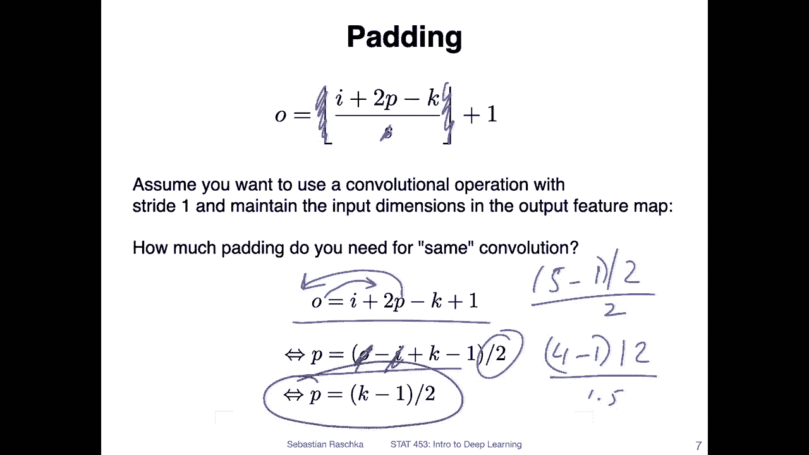

Size here was。5， then we would have ended up with a5 output。

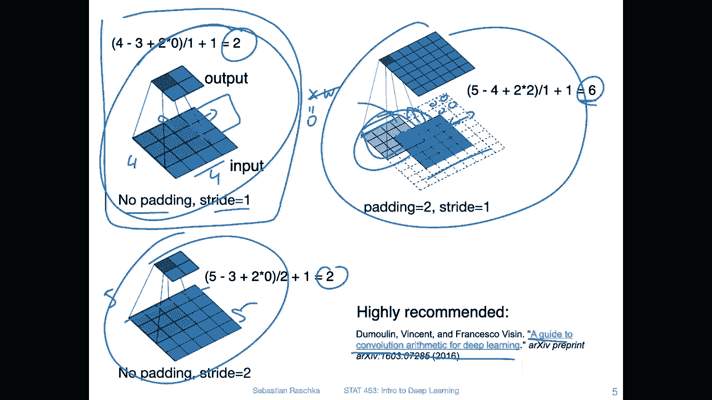

Okay， so this is just patting in a nutshell in the next slide or next video。

 I will talk about spatial dropout and spatial patch on。

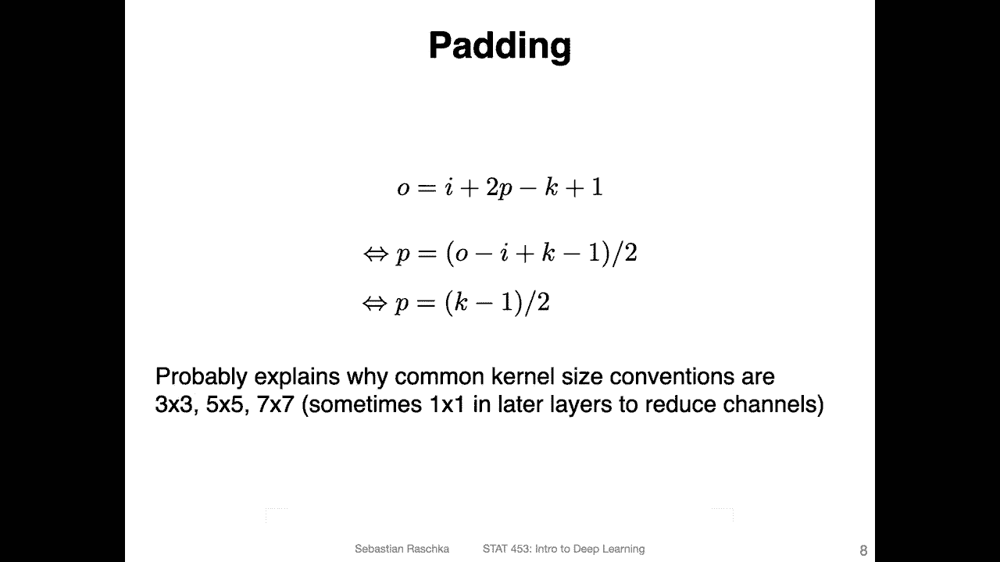

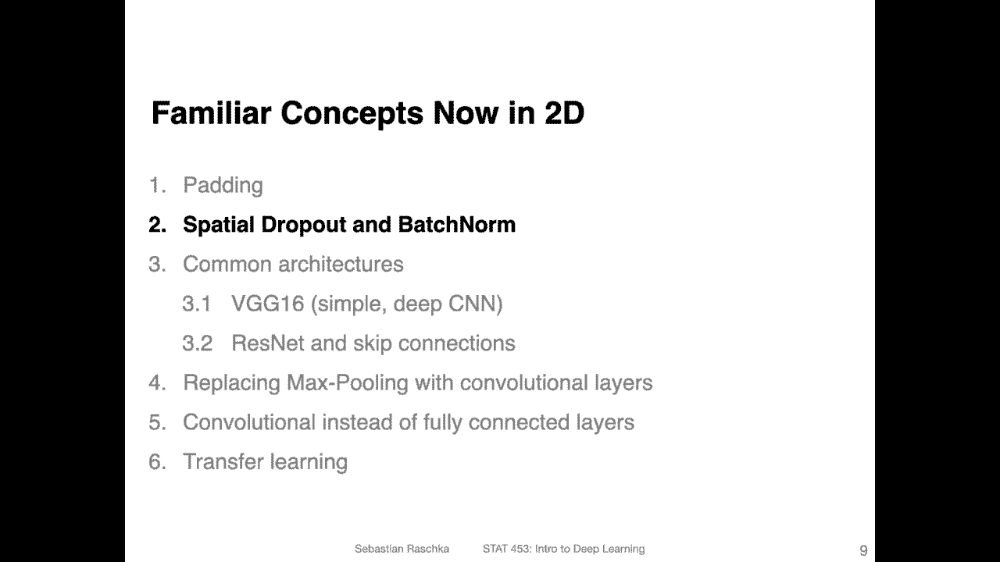