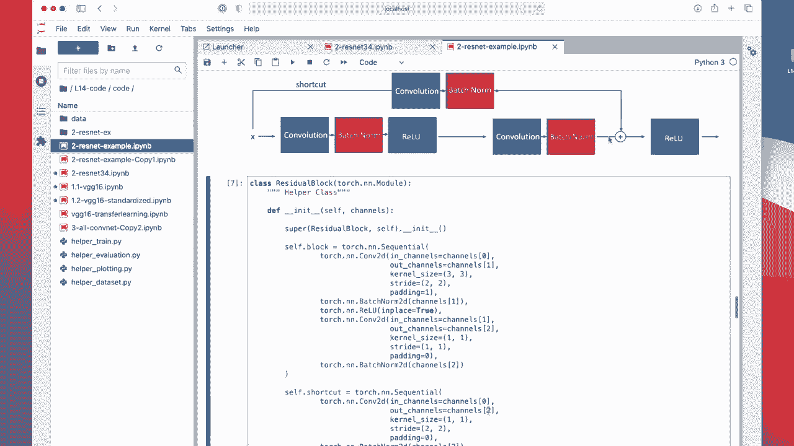
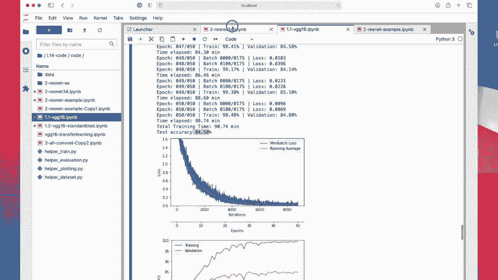

# 【双语字幕+资料下载】威斯康星 STAT453 ｜ 深度学习和生成模型导论(2021最新·完整版) - P118：L14.3.2.2- PyTorch 中的 ResNet-34 - ShowMeAI - BV1ub4y127jj

Alright， let me know show you how we can implement residual networks in Pytorch。

 So I will show you two notebooks。 First is a naive implementation I have made myself。

 And then I will show you a more sophisticated implementation of Resnet 34 from the Pytorch community。

 So in this first notebook now I will show you what we talked about in the last video these two different types of yeah residual blocks and then in the next notebook I will show you this residual network with 34 layers。

 So yeah， I'm not going to rerun this notebook， it didn't take too long。

 but yeah why waiting if if it's not necessary。 So I will show you just other results so。

Yeah， here， it's just the boiler plate importing torch and nuy。 the usual stuff for the data set。

 So I'm not using the helper functions here because yeah， it's really just very simple。 So I。

Didn't really focus on abstracting things。 I just coded the residual blocks。

 and this is a self contained notebook in that way。

 So here I'm using the Mnes data just for simplicity。

 because just wanted to have a dataset doesn't really matter which one。

 because this is not going to be a good conversion network It's just like more of a proof of concept how the residual block works。

So the data set really doesn't matter that much here。

So here I'm implementing now this yeah residual block。

 the one where the input has the same dimension as here， the。

Output from the residual part。

So how does it look like。

that one so。I implemented it using the torch module class just a regular confifin that I'm implementing here。

 I have a confin with two residual blocks， and each of those is one residual block。

 So you can see that this convolution here represents this one。

 So here I' amm starting with one channel for output channels。

Then， I have bechnom。Then I have Reou。 By the way， I haven't really explained what that1，1 means。

 I think I have used that before in some other code。 So in place equals true。 This just means that。

Pyto doesn't have to make a copy of that array internally。 So we could do something like that I mean。

 not here inside， but in general， we could do something like。Like this。Just。

 let's write it like this。 So this will create a new。A new tensor X。 and then overr this tensor X。

 So it's essentially over writing this tensor X。 But for a brief moment in time。

 when this gets executed， there are two arrays。 If this is an existing one， if I have some。

Previous computation here。 So this previous computation created x。 And then when I'm calling this。

 it will。Take an X and create a new version while X is still in memory。

 So for a brief moment in time， I have two arrays in memory。 it's not a big deal at all。

 but you have to， I mean， under the hood， allocate memory in the GPU and stuff like that。

 So it's kind of a little bit more expensive to do that compared to doing an in place operation and in place operation is essentially modifying something in place without creating a new array。

 So it's slightly more efficient。 It's not always possible to do that。 But yeah， if you can do that。

 it's actually nice。 So its essentially the difference between， let's say。

 writing this and x plus equals one in that sense， you are directly modifying something whereas here you are having creating a copy and then assigning the copy to it。

Anyways， it's a little tangent。 The results are exactly the same。 whether you do this or this。

 And in practice， you probably won't notice any difference anyway。 So it does not really matter。

 But yeah， why not doing it？ Allright， so small tangent So we have convolution batch norm and then this re。

 This is this part is really the first three and then we have another convolution and a batch norm。

 which is this part。 noticeice that I'm going from one to4， and then back from4 to1。

 It seems kind of weird why am I doing that Yeah， it's really like to match the dimensions。

 Otherwise， I will have more channels here then I have as an input So I would have four channels here。

 and then one input channel and it doesn't really work if we add them because then it's not an identity anymore okay。

Yeah， and we also have one fully connected layer。 This this just to make this classifier。So yes。

 and how I'm implementing this。 So here I was just。Defining or initializing these layers， the blocks。

 And here I'm calling them。 So in the forward pass is really where things happen。 So I。

Save X as the shortcut here。So I'm saving this here。Then Im calling my block。

So this part I highlighted here， this is really calling the whole block， right。

It's this whole block。

And actually， I could have。

These are kind of redundant I could have used the same。 Okay， but then， of course。

 the weights are different。 Anyway， sorry， so I call my block here。

 and then I have my re function and the re function is applied to x plus the shortcut。

 So this part really is。

This part。 So I'm， I'm adding inside， and then I'm applying the re So the re。

 that is what is shown here。 and here I have this addition。

Right， so this is essentially one residual block。 And then I'm repeating it。

 So why am I not using one here， Well， then it would be the same layer It's that wouldn't work really。

Okay。But the the shape is the same。 It's just， we have different weights， right。

 So it's just like having two convolutional layers after each other。

And then we have this linear here， which is turning this into a classifier。

Alright， so。So the linear Le has output the nu classes。 and here I am just。Flatening it。

 So I'm assuming what comes out of。嗯。This block 2 has a dimensionity 28 times 28 784。

Yeah， and then I'm running this just pasting my convenience functions that I usually have in my helper function。

 it's a slightly simpler versionca I'm not plotting anything I just want to show you that this actually runs。

 doesn't get great performance because， of course， it's a very naive implementation。

There's also only the training accuracy， the test accuracy is 92%。

So what I show what I mean is how do I know that this is the actual number。 I mean。

 I can think about it。 I can look at this。 but like I explained in the previous video。

 what I can also do is。

I mean， what most people do is just print X size。 then you can oops。

Let run everything here。

Then。Can run the training。 And then you will see the size。

 Of course you don't want to complete it because it's annoying to have it here。 So I just stopped it。

 I can see， oh， it's 1，282 times 28。 And that is what I can then copy and paste and then。

And go here and put it in here。

Right， so that's。Where this number comes from。 And it is also where this number comes from。Okay。

In practice， if you don't want to think about it too hard and you are debugging things。 I mean。

 it doesn't hurt to。 And so the print statement， it's what everyone is doing。

Okay。So we trained that。 No， of course， I interrupted it， but。

Suppose it trained， I mean， it trained before。 so if I fixed it it would train。

Now， the second part， now focusing on the more interesting part where we have this resizing here。

So I am implementing this a bit differently now， using a reusable unit。 I call that a residual block。

 So I am implementing my residual block here， and this one is implemented the same。

W， now it's a little bit more general。 I have something called channels here。

 This is the input channels， or let's say the first number of channels， the output channels。

And then here I have1 and2。 So I am going from 0 to 1 to 2。And。I can， I mean。

 I'm not defining what these numbers are。 I'm defining them later but I'm calling this。

 so I can maybe briefly skip ahead。 So I'm using this residual block。

 actually in my convolutional network here。 So I'm using it here。 And here I'm defining the channels。

 I'm going from 1 to 4 to 8。

So。Yeah， so that's what I'm doing here。 So I'm going from0。Also 1 to 4， sorry，1，2 4 to 8。

And then I have my shortcut， which goes also from 0。 sorry， from 1 to 8。 Otherwise。

 I wouldn't be able to edit because if， let's say this is one channel。

Outcomes。8 channels。 Then this also has to be 8 channels。 otherwise I can't edit。

So that's what's going on there。So。

My residual block is scrolling up again so we can see everything。 So my residual block 1，2，3。

 This is really this part， these three first blocks。

 and then like before these second blocks are this and this Now the difference is。

 yeah that I have different numbers of channels and I can also reduce the size。Right。

 so here I have a stride of two。 so that will reduce the size。 I have to do a stride of two here。

 too to match these dimensions。 So here I have to be a little bit more careful that the dimensions match also。

Yeah， and then as before I have my block I have a shortcut and both the block plus shortcut。

 they go into my re function。 So this is what I'm showing you here。

 this residual block is really this whole thing here。

Yeah and then I'm using my residual block， I'm initializing one residual block and another so I have a network with two residual blocks。

 the first one goes from 1 to 8 and the second one from 8 to 32 and yeah the number of the sizes here is seven times7 times 32 so it's because we are also havinglving the dimensions here half and half approximately。

So going from 28 times 28 to 14 times 14 and from 14 times 14 to 7 times 7。

Yeah， this is essentially it。So that's how we implement this。 So yeah。

Then we are training it。

Tins here。 and yeah it performs much better than our previous implementation。 But again。

 the goal of residual networks is really to go deep in the network in terms of the number of layers。

 So here we only have two layers。 So， I mean， this is probably not a great network to use for other datasets here we are just using Mn。

 So if we want to use the， I would say sophisticated data。

 I'm actually only using C 10 because it's simple to a lot。 But if you want to use a different data。

 Resnet 34 is a good choice。 So this is the one， the the deep one here。

 it performs pretty well going back here， it gets actually pretty good performance on。

An imagenet of one accuracy better than the G， for example。

And how does that work， So it's the same concept。

Thanks， Sean， sorry，Shown here， except more， I would say， more sophisticated implementation of that。

So I could have implemented it by hand， but there's always the chance to make mistakes at some point。

 So why not using what's already implemented。 So here this is， again， I'm using my helper functions。

 that's again the same that I explained for VG G16。 So everything is the same as for VG G16。

 So I don't have to discuss everything again。 the only new part here is really this part， the model。

 So here I actually copied the code from this website， which is an implementation。 yep。

 the official Pyr implementation which has different versions of resnet wide resnet。

 regular ressonnet，18 layers，34 layers，100 layers，1 or 52 layers and so forth。 I grabbed。

The code that is used to yeah initialize all of these networks。

 So they have written some code that can be reused for different types of residual networks。

 So here was copying it and simplifying it a little bit。 So it's not that long。

 And then they have something they call the bottleneck。

 It's kind of similar to what I call the residual block。

But we have here。 and then I mean， it's relatively complicated。

 I have to admit it would take me also a couple of us to really understand how that is implemented。

 The most important thing is that it works。 Many people are using it So I'm kind of trusting that this is indeed working。

 So they have like a make layer method here or function here that creates these layers。

 It's a little bit more sophisticated than than my version。

So and then in the forward method， you have these different layers。

 So each layer has also multiple convolutional layers。 That's how you get the number 34。 And yeah。

 we can also use the torch flatten function here。 That's actually something I should also maybe use more often。

 It's a more recent thing。 So I could actually technically replace。

Replace that one by flatten。So here， that could be replaced by flatten。

 but I still need to know this number anyways， because I have to put it here for the number of parameters。

 So even though we can put a torch flatten here， it's， it's not that much simpler。

Yeah。

So。Yep， that is essentially it。 So here I would have to know still this number in this millionaire the 512。

 So I could technically also write this as torch。

Not view。-1，512。 I think blocks expansion here is one。

 This is only used for the other types of networks， other residual net so。

Could technically also write it like this。 But yeah， we have this nicer flatten。

 thing what's nice about flatten is everyone knows what flatten that it has a meaning that is more intuitive。

 maybe than saying view-1 or something。

O。😔。

Yeah， and here it's also the same code that I used for the V G。 And now it's training。 Actually。

 we are using Cypher 10 here。

Let me open this one again。So here I have 70 by 70 images。

Scraning up， sorry。 Yeah， I have made it larger because otherwise the performance was very poor。

 I mean， all these types of networks are really implemented for bigger data sets， not Cypha 10。

 I'm just using Cypha 10 because then we don't have to download a separate dataset if you want to reproduce these results。

And I showed you how you can use your own data set too， So in the way。

Shouldn't be an issue for you， but if you have questions。

 you can always ask I'm happy to help with that。So here with Resnet， we get approximately 48%。

 which is not much better than what we got with midji G16 here it's also。

Kind of the same。 But notice， even though I use large images here， it was at least。

 at least faster to run 62 minutes versus 90 minutes。

Okay， as if I， if I would have made the images smaller here the same size。

 it would have probably finished in like 30 or 40 minutes。 Also overfitting。

 So here might be a case for adding more dropout。

So here we only have。Do we have actually droplets。

Not， not really。 we only have peton， so maybe could be added to could be adding drop。

Okay， so some the results get spurret and frog wrong。 What was the one that this one got wrong。

Deer and fck interesting。 So yeah， animal classes are still confusing。 You can also pro yeah。

 you can see again， the square where it makes misclassifications between different animals。

Again， the tech cats and dogs。 And yeah， this is resnet implemented here。

Honestly， if you implement networks， you don't have to implement things from scratch unless it's for educational purposes like for learning things。

 usually when you find a paper or read a paper with an interesting implementation thing you want to try usually what people do is they would go on Gitthub and search for the original authors providing the code for that paper and then adopting this code。

 so you would technically not run it one to one， you have to probably make some modifications so that it works for your data。

 but usually in practice once we are working with these more complicated datas。

 theres no it doesn't make sense to implement this Re 34。

 let's say completely from scratch it's only another source of making errors。

 I mean it's useful here as a thought exercise to do it with a simple case with two layers。

Where you have。Simple implementation with two layers， yet maybe makes sense to do that。

 But if you go deeper Renet 34， maybe use something that is， yeah， someone has implemented。

 saves you lots of time and pain in that way。 Alright， so okay， this is resnet。

 I think we are already at the 75 minutes。 So we will continue next week with。

Yeah， the all convolutional network。 I already implemented this somewhere here。

 and then we will also talk about transfer learning。 I have to still implement it anyway。

 No I have it here already so。We will talk about transfer learning also next week， All right。

