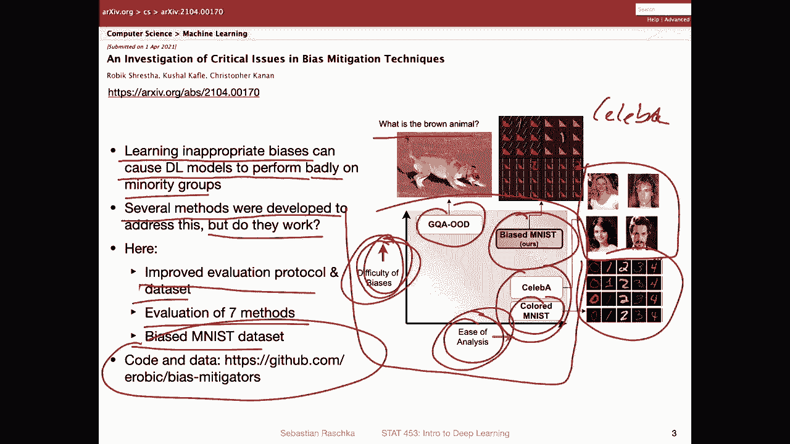
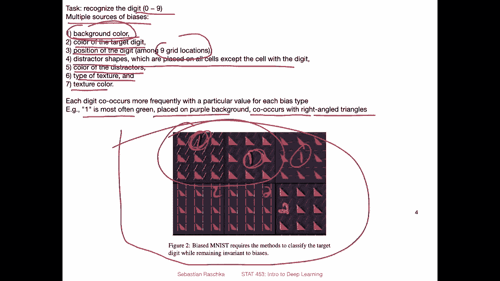
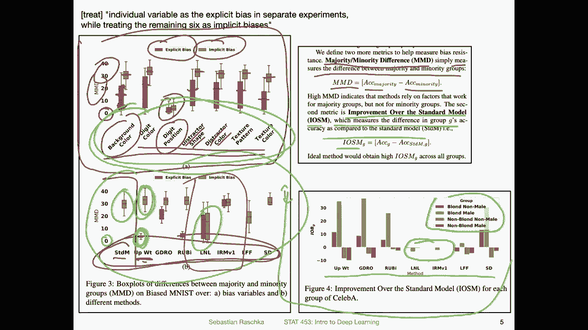
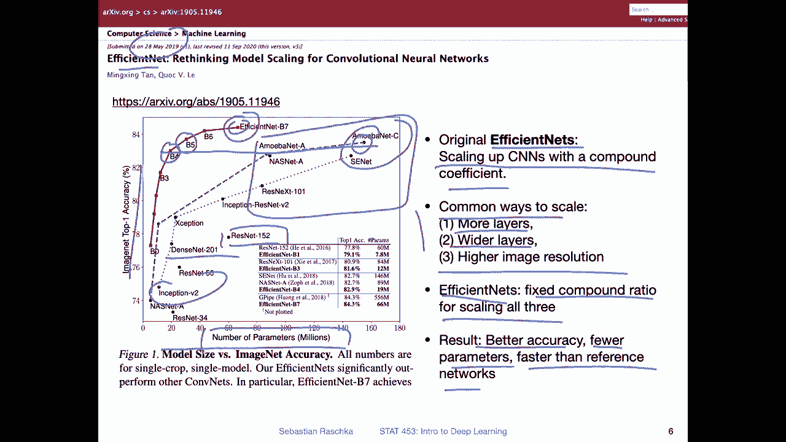
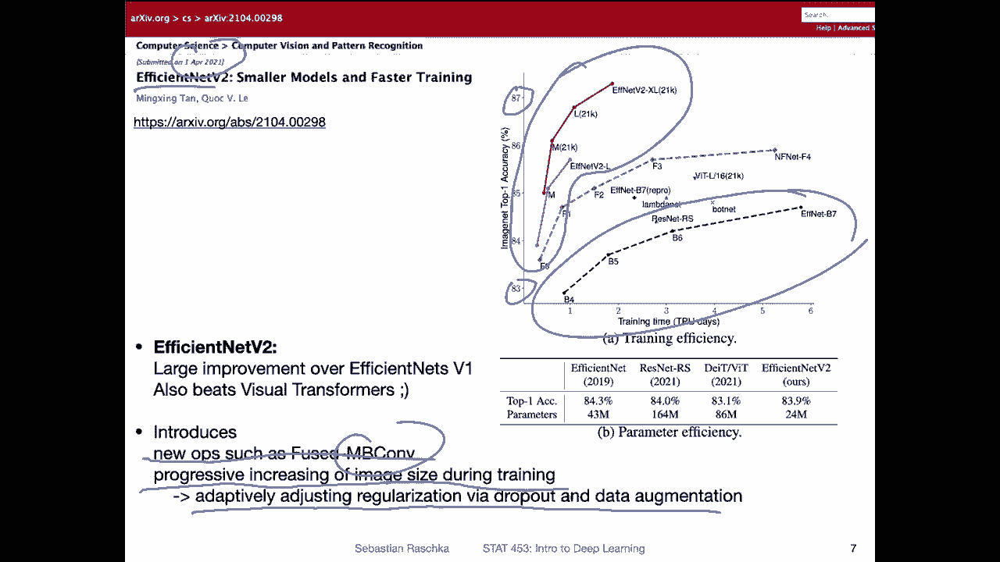
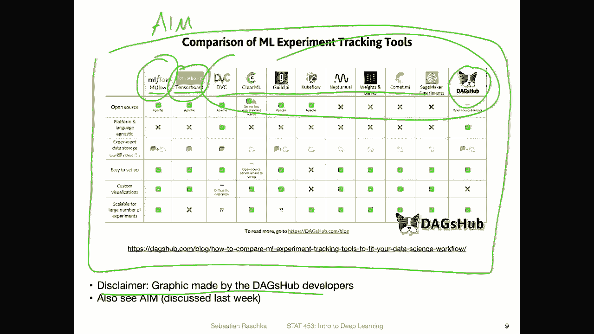

# 【双语字幕+资料下载】威斯康星 STAT453 ｜ 深度学习和生成模型导论(2021最新·完整版) - P119：深度学习新闻 #10，2021 年 4 月 3 日 - ShowMeAI - BV1ub4y127jj

Yeah， hi everyone。 So lots of exciting things happened again this week。

 So it's tricky to be selective and have to keep the number of topics small and manageable。

 So for this week， since we talked about convolutional neural networks this week。

 I selected a few topics related to that topic。 So one is a paper on analyzing the bias of different methods and also introducing certain type of mist data set for analyzing biases。

 And then I will also talk about a new convolutional network architecture that was introduced this week。

 which might be also interesting to you and also interesting in the context of your class projects。

 So with that let's get started。😊，Yeah previously we discussed that there can be big issues with bias when we apply deep learning to certain types of problems。

 for instance， this is something I took from a previous video when we discussed this particular system where people trained a deep neural network to judge job applicants and in particular the big issue here was that the system was rating job applicants substantially differently。

If there was a bookshelf in the background， and， of course， that's something that should not happen。

So this week， there was a paper on， yeah， evaluating different systems for mitigating such bias。

 So there are different techniques that were developed。 And the question is essentially。

 how good are they really so。The learning of these inappropriate biases can cause deep learning models essentially perform really badly on minority groups that's something we want to prevent or avoid and these methods that have been developed the question is essentially do they really work and how useful are they if you recall there was also a paper that I presented a few weeks ago where someone essentially said yes。

 these methods work but only like in a very stereotypical sense of fairness？But in any case。

 so I think yeah one or there are multiple problems。

 one is essentially does it even make sense or is it a good idea to even apply this model to a given type of problem the other one is then what methods can we use to yeah let's say reduce the bias and then also how can we assess that really whether these methods really work so that like these three different levels of questions we should ask。

So。Here what the authors did is they tried to improve the evaluation protocol and also yeah provide a new data set。

 they call it the biased MSnes dataia set and in particular they evaluated seven different methods and their code and data sets are available here on Gitthub。

So。Here's an overview from the paper how they kind of describe the problem of analyzing the biases。

 So there are different types of data sets。 There was this Q and A data set。

 and there's also the setup。A data set， which we may be using later in this class in the context of generative adversarial networks。

 also or variational autos， I will also make a few examples。But yeah， essentially。

 this Q And A data set， it's， it has difficult。Types of biases included。

And the ease of analysis is not good， though。 So it， even though this is a maybe good data set for。

Having a challenging task for neural network in terms of biases。

 it's not so easy to analyze and the S a data set and the colored Mnes data。

 which is essentially a version of Mness with colors。 they are both easy to analyze。

 but the biases to detect are too simple to really I would say or what they say is that simple to really assess the different methods for mitigating bias。

 So they develop this bias Mnes data set which they say is easy to analyze and also provides an adequate difficulty of these biases。

So the task in this biased M data set is as follows。

 it's also about yeah recognizing 10 different digits from0 to 9。 and these include 9 no sorry。

7 different sources of bias。 So one is the background color。

 the color of the target digit to be classified。 the position of the digit。

So they have nine grid locations。The distractor shape。

 So they have other shapes in that image to distract from the prediction。

 the color of these distractors， the type of texture and the texture colour。

 So that's essentially background。Also， in a way， I mean， they have the background color。

 but then they also have these background textures。 So here's an example。Of how this might look like。

 So in the top row is the digit one。 So we can see it here。 And they say， for instance。

That in this example， the one is most often green and is most often placed on a purple background。

 and it often occurs or co occurs with right angled triangles like you can see here。

 but sometimes they have a different color， for example。Making it red。 So this， in this case。

 when it's green， it would be the majority。 And if it's another color。

 it would be the minority class or group。 So that way， for each digit， they have。

Something that is common again， among the majority class and not so common in the minority class。

 for instance， changing the color or changing the background and these types of things So with that they try to assess how how sensitive the network is towards these things that are not the digit itself So how sensitive is the network towards changing the color of the distractor or the shape of the distractor and so forth and how sensitive with the network towards the placement。

 whether it's in the center here or on upper part and things like that。

 so they are different types of distractions that they try to analyze whether the network is yeah focusing on the digit itself or other things like color and so forth。

So here are some results from that paper。 I must say it's a little bit tricky to interpret。

 so I hope I understand this correctly。 it was not very or entirely clear from the paper。

 but based on my interpretation let me walk you through this So first let's take a look at this MMD plot here。

 So they define MMD as the majority minority difference。

Measuring the difference between majority of minority groups so they compute the accuracy of the majority class。

 for example， if you consider from the previous slide the Amnesty digit。

 the green one that would be the majority class and then the minority class would be when it's red。

 for example。嗯。So， yeah， so they have。The MMD here for different types of biases。

 the seven different biases that we talked about in the previous slide and they focus on one bias at a time that they call the explicit bias。

 and that is the one that the model is addresseding and the implicit biases are the ones that are not addressed and here the box spot is over when I insert correctly over the different methods。

 So we will take a look at it afterwards， but there are seven different methods listed down here。

 So the box spot is across the different methods。 So。For instance， what you can see here is methods。

Treat background color as an explicit bias。 You can see on average， or the the median here is lower。

Compared to the implicit bias。 so implicit biases are the ones not treated。

 and they look at it for the different types of biases as， as the explicit bias。

 And you can see in all cases， the explicit bias or the。The median here of the explicit bias。

Is lower than the mediumn of the implicit ones so the methods are essentially working to some extent in terms of lowering the bias of a target variable that you specify。

 for instance， distractor shape， distractor color and so forth for digit position we see there is not much of a difference it could be because convolutional networks are naturally somewhat equivalent to the position and people also often naturally use data augmentation already for random cropping。

 the inputs。But other than that， you can see there's a large difference between explicit and implicit bias。

 so the methods are working to some extent， but also at the other hand they are far away from zero。

 so they are not working very well and you can see for the ones that are implicit。

 the implicit biases they still exist and there's a huge difference between 30 and 40% is like a huge difference。

Between the majority and minority classes。So looking at these methods in more detail。Here。

 so what we can see here is seven methods。 This is SDDM。

 This is the what they call the standard method。And this is just the baseline model。

 You can think of it as the the baseline， and then they have。7 other methods they compared to。

 So let's say the up W T here。 So for this upWT， they are kind of was drawing over it。

 but there's this explicit bias。 you can see that so now the box but I also should also say when I understand it correctly。

 the box plot， now the range of the box plot is over these different types of implicit biases。

 So the range is now over implicit biases and you can see。Across these different biases。M。

In this case， you take a look at one explicit bias。It's。Close to 0， but the implicit biases。

 the other ones are still high。 So how I think they analyzed it is they considered all these biases。

Like a fall loop over the biases。 And then they treated each one as the explicit bias while treating all the remaining six ones as the implicit ones。

 and then averaging over that。 So that's how， on average， the method performs。When you wrote it。

What explicit and implicit biases are， and you can see。

This method is pretty good at dealing with these explicit biases if you specify it。

 but all the others are still a big issue， actually even bigger than in the standard model。

 So in that way， if you use that method， you may be fixing the explicit bias that you specify。

 but you make everything else worse。And overall， there's no real。

Method that can deal with all the implicit biases。 You can see， yeah。

 there are big issues everywhere。 Maybe this method here， it's for the explicit and implicit biases。

 the lowest。 I think really， the tricky part is the implicit biases because that's something that can be lurking in your data set。

 explicitlicit biases， you can be aware。 even if it exists， you can maybe tell people， okay。

 this is something to look out for。 But implicit biases， think that's maybe an even bigger issue。

 But yeah， you can see all these methods。They are not super yeah， robust to these types of issues。

 On the right hand side， there is a different evaluation。 They call it the IOSM。

 which is the improvement over the standard model。And this measures the difference in the group's accuracy compared to the standard model。

 And also here yeah， you can see that for most cases， these models or methods。Have issues。

 But for setup A， there are some methods where there is really low moral difference for these four types of biases。

 So there are methods that address this very well on simple dataset sets like setup A。

 But then when they look at this。Bed Ms， these issues still occur because you can see L and L and I am for these are these two。

 So these still have issues。 So yeah， with that， you can see maybe the biased Mnes data set is also something to consider when developing methods because the setup A data set on the。

Right hand side might be too simple。Alright， but yeah。

 this is I think still an active area of research。 I'm also no expert in this field I just thought this might be an interesting paper to look at in a new data set for evaluating potential methods for mitigating bias。

Alright， let's now talk about a convolutional neural network architecture。

 So in class we only talked about a few of them because we have timing constraints。 but yeah。

 there are always more interesting ones And one I mentioned was efficient nets。

 So just to recap or not recap but just to introduce them because we haven't even talked about them yet。

 there was yeah the efficient net architecture or family of architectures introduced about two years ago。

 so that's not news we will get to the news in the next slide， but essentially。

This is an approach for building efficient neural network architectures。

It's about scaling up convol networks using a compound coefficient。

 So traditionally there are three different ways we can scale convol networks。

 one is yeah by adding more layers， one is by making the layers wider and one is by changing the image resolution usually if we increase the image resolution the networks don't perform so well So we have to do also changes to the layers and the number of layers and the width of the layers so。

The idea behind efficiency efficient net is to analyze how the scaling kind of relates to each other。

 So here they are coming up with a certain formula to do the scaling of these three components and what they。

Found is that， yeah， by their approach， they can achieve a better accuracy with fuel parameters and also having networks that work or run faster than reference networks when they apply the scaling。

 So here on the left hand side。Its a comparison。 So you have， for example。

 renet 152 here is a big network， dense net， inception and so forth。 So here they are。

Ass the number of parameters。 So on the right， these are bigger of course and。

On the Y axis is the performance on imagenet， so。You can see that this efficient net is。

Smaller in terms of the number of parameters than other reference architectures appear。

 but it's also fast sorry， better performing。 So looking at the best performing network。Might be。

 yeah， this one。 Let's look at the best performing network that is not efficient It might be this one。

 So you can see that。This one might be comparable here before， if I go straight， so you can see。

They develop a much more efficient architecture that reaches the same accuracy as this a mobile net here。

 So that is actually a really interesting approach， that's efficient net。

Yeah the news here is though there is an efficient net version to no。

 which was released also on April 1， they were two April 1 papers。 and yeah。

 you have to be always a little bit careful with April 1。

 like you probably remember from my car network that might be sometimes not a true network it might be just a fun thing April's full joke but yeah。

 in this case it seems to be a legit paper and it's actually a pretty cool one。

 it's extending efficient net to perform even better。 So here。

They introduced new operations such as the fused and B convolution。

 We won't go into too much detail about that， but it's essentially about progressively increasing the image size during training so。

Usually when you increase the image size， the performance degrades， there's also more overfitting。

 it's probably just due to the fact that there are more pixels now。

And what they do is during training， they scale the resolution progressively。

 And then while they are doing that， they are adaptively adjusting the regularization using both dropout and data augmentation。

 So here they have now。A way to。Train with larger images while adaptively reducing the overfitting。

 which I thought is a cool idea， too。 And you can see。This is the。Actually。

 all of them are efficient net version to architectures。嗯。

And you can see they all perform better than much better than the efficient net version one here。

 So it's actually a huge improvement。 It's。83 to 874% points on INe and while still being efficient。

Yes， since we recently talked about different optimization algorithms。

 and we also had a quiz an exam question on that， I just wanted to introduce a new one。

 So there's now Matt Grt， which does not stand for Matt Grt student。 but yeah， it's。

 it's an modificationification， essentially of E Grt and Adam。 So。😊。

They say that Adam doesn't quite reach the goal of being a general purpose deep learning optimizer。

 and the mat Grd method is directly designed to address these issues。 So Adam and SD with momentum。

 they work well across different types of problems， but not all problems。

 So it's a little hard to see here on the left hand side， This is Adam here。

And on the right hand side。Adam is up here in the top performing form region。And for SGD。Let me。😔。

Underline this for SGD。Plus， momentum。I think。It's up here and up here， and you can see。

Sometimes M is better， sometimes S GD is better， and they have now currently in a new method。

 met Grd， which is always performing well， it's always。Somewhere。Up there。

 So that is maybe another interesting thing to check out。 So I haven't tried this in practice yet。

 And yeah， but if you are interested， it's another interesting thing to try， they have。

The code on Gitthub， I think it's also linked in that paper。

 So I haven't looked into detail into this paper， but it might be another interesting yeah method to consider。

So yeah， last week I briefly mentioned this new tool for tracking machine learning experiments called。

Aim aimim is for some reason， not on this list here。

 but yeah here is an interesting list of different experiment tracking tools。 Last week。

 I also mentioned M L flow and tensa board。 but yeah， here are a few more of these。

 So this graphic was made by the people at Ds hub， which is also on here。

 So you should take this graphic， maybe with a grain of salt。

 but it still maybe an interesting table。Where all you can find different。Yeah。

 alternatives for tracking machine learning experiments。

 which may be useful to you if you're working on your class project and you want to I would say take a more organized approach compared to let's say tracking the performances of your models in an Excel spreadsheet or using Matprolip personally I'm not extensively using these methods with a colleague we are using MLlflow right now。

 I sometimes use Tensor board but often I also don't use either of them。

 I think others are also pretty good。 it's really just a matter of taste and how big your experiments are and if you are doing a lot of experiments a lot of the time then of course it might be worthwhile investing in some of these it's essentially with everything like it really depends to find the sweet spot between not。

Using something that is kind of overkill for what you're trying to do。

 but also if you are doing something frequently and often and in a large scale。

Before reinventing the wheel and writing your own tool for tracking。

 maybe look whether there is something out there already that can solve your problem。Alright。

 so with that， that's it for this week， next week， we will be wrapping up the lecture on transfer learning and then we will talk about recurrent neural networks。

