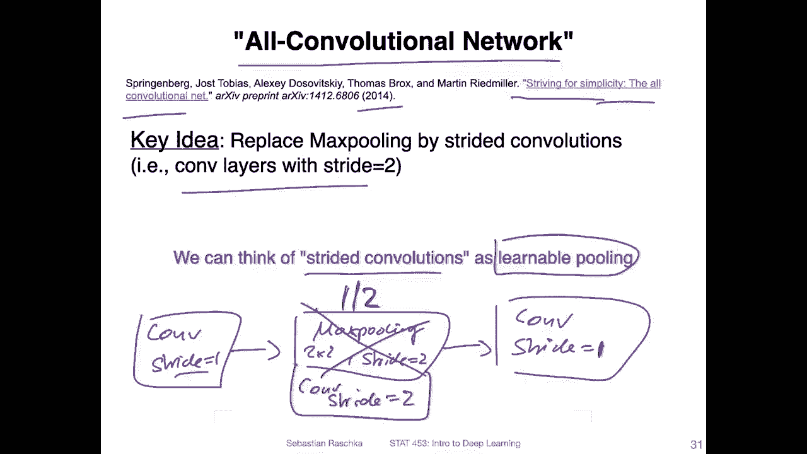
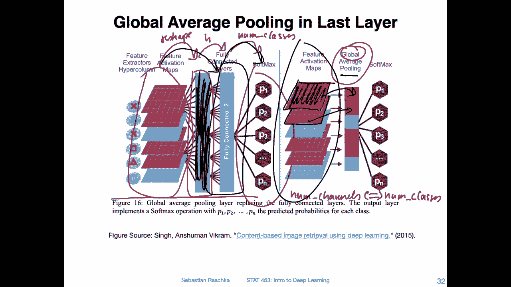
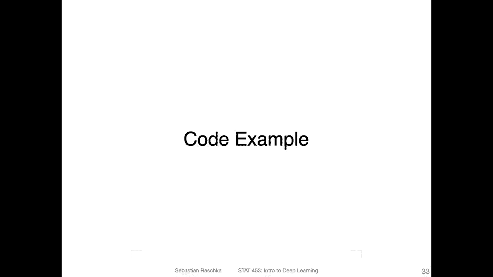
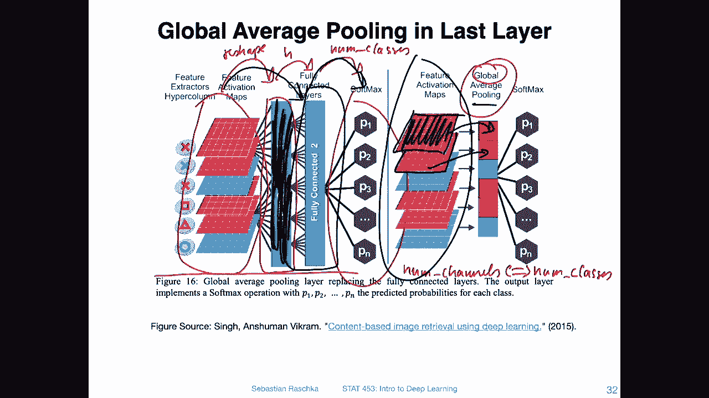

# 【双语字幕+资料下载】威斯康星 STAT453 ｜ 深度学习和生成模型导论(2021最新·完整版) - P120：L14.4.1- 用卷积层代替最大池化 - ShowMeAI - BV1ub4y127jj

Yes， so in the previous videos we talked about the VGG16 architecture and the residual network。

 Now I want to talk about a topic that is somewhat related to convolutional neural network architectures。

 it's not super important in terms of let's say implementing better performing convolutional networks。

 but I think it really helps like solidifying the understanding of how convolutions work。

 So the first topic I want to talk about is replacing max pooling with convolutional errors。

 and then in the with video after that I want to talk about replacing。

Fully connected layers by convolutional layers。 So both videos will be essentially about simplifying a neural network architecture by essentially getting rid of max pudding and getting rid of fully connected layers。

 It won't result necessarily in a better performance， but it is， I think。

 just an interesting thought experiment。

So the first video here or the this two video series it will be focused on replacing max pooling。

 So there's action architecture that is called the all convolutional network。

 It comes from a paper that is already seven years old。 It's entitled Striving for simplicity。

 The all convolutional network。 So here the authors proposed replacing max pooling with a convolution layer that has a stride of2。

 And this is sometimes also called strideed convolution。😊，So now， traditional。

Neurural network or convolution network。 We have usually a convolution layer with。Striide equals1。

 And then we have max pullinging。Usually to buy two max pooling。Also with a slide of two。And then。

 we have。A convolutional。Layer again with spread of one， and we。Continue like that。

 And usually the convolutional layers， they preserve the size because we have a straight of one。

And the max pooling will reduce the size twofold。 It will half the size。

 So the size that comes out of it is one half。 if we have， let's say。

 a two by two max pooling with a strip of two。And。You can maybe also write the stone。

So the kernel size is usually2 by 2 and。Just's right by two。

 And this helps us also yeah achieving a little bit of this location in variance。 However。

 it's not essential to have that， so。You can technically get rid of this and then just increase the stride here by two or here。

 and you will have the same effect that you reduce the size by one half。So。

I don't want to go into too much detail here， but if you look at the experimental results when I recall correctly。

 they found that the performance slightly decreases when you get rid of this max pooling， however。

 how you can get an even better performance than before is by replacing this max pooling by convolution layer。

 that mean get rid of this two here first。So we have a one here。

 and then you can have a convolutional layer here。With。Striide equals 2。

 And this will also have this one over half effect that it will yeah decrease the size by half。

 but instead of using the max pullinging。You have the convolution which has weight parameters and you can think of it as something like a learnable pooling at least that's what they argue here in that paper。

 So it will be of course a little bit more expensive because you have no more parameters but in that way you can also simplify the network in terms of yeah having it look s away just saying okay we only use convolutions we don't use anything else if that's desirable of course you still need the activation function but you don't need pooling layers for example。

I recall there was a talk by Jo Hinton。 I don't recall。Exact words。

 But I remember Jo Hinton said something along the lines of that Max pullinging was one of the biggest mistakes in computer vision in terms of convolal networks。

 personally， I think it's actually not that bad。 Max pullinging works quite well。

 Yes not necessarily urge to get rid of this。 So it's here more like a thought experiment how you can。

Potentially simplify a neural network architecture。

And then you talking about simplifying so you can also get rid of the fully connected layer using convolutions。

 I will talk more about that in the next video and another way to get rid of fully connected layers is by using global average pooling so。

I'm not sure if this was the paper that kind of proposed that in the first place。 I guess it was not。

 but this was nonetheless a nice figure。 So usually we use these fully connected layers。

 like shown here on the left hand side， we use these fully connected layers to map from the convolutional layer onto the number of desired class labels。

 So usually we have a fixed number of class labels。And。

In order to get from the other feature map size to the number of class table。

 we use these fully connected layers。So on the first fully connected here layer here would have would have as the input size。

 the reshaped feature app size。 So things this will become more clear when I show you the code example。

 This is something you have seen before。 It's not new。

 It may look a little bit different because I haven't shown that in， in a figure here。

 but this is essentially when we reshape。So that it matches。

The size here in the fully connected layer。And。What comes out of here。

 let's call that H like some hidden dimension。 It goes into the next fully connected layer。

 And here the output is then the number。Of classes。Of course， yeah。

 this fully connected part is usually very intensive in terms of lots of parameters。

You can simplify this by using global average pooling。So here what you do is essentially。

First of all， you assume that the number of channels。In the last。Con layer is equal to the number of。

Number of。Classes。And。Global average pooling works essentially like that。

 You have heard about average pooling， which is just taking the average value and global here means of the whole feature map。

 So you would technically just use the whole feature map here。And then average over all these values。

And this will be then the single value here。 And then you do the same thing for the next one。

 So you just average over the whole feature maps。 And that is also a way to get rid of fully connected layers。

And by the way， here on the left hand side， this is actually not necessary to have two fully connected layers。

You could technically， also reshape。Into this one and this one takes out the number of class tables。

It can be good to have a fully connected layer。 It's like additional parameters to learn。

 but it's also not essential。 You can just have all the parameters learned in this convolutional network。

And or con part。 and then have the global average pooling。

 And I will show you next code example how that works。 And in the next。

Video I will also show you how we can replace that。By an equivalent， convolutional operation。

 actually， there are two ways to do that。So personally， again。

 I would say there is no reason to get rid of the fully connected layers。

 They are just fine and many or even most architectures use fully connected layers。

 but if you wanted to， you could technically also get rid of it。 Allright。

 let me show you in the next video a code example of an implementation of this all con network。

 and I think this will probably make certain things a little bit more clear that I just yeah was drawing here。

 Allright。

