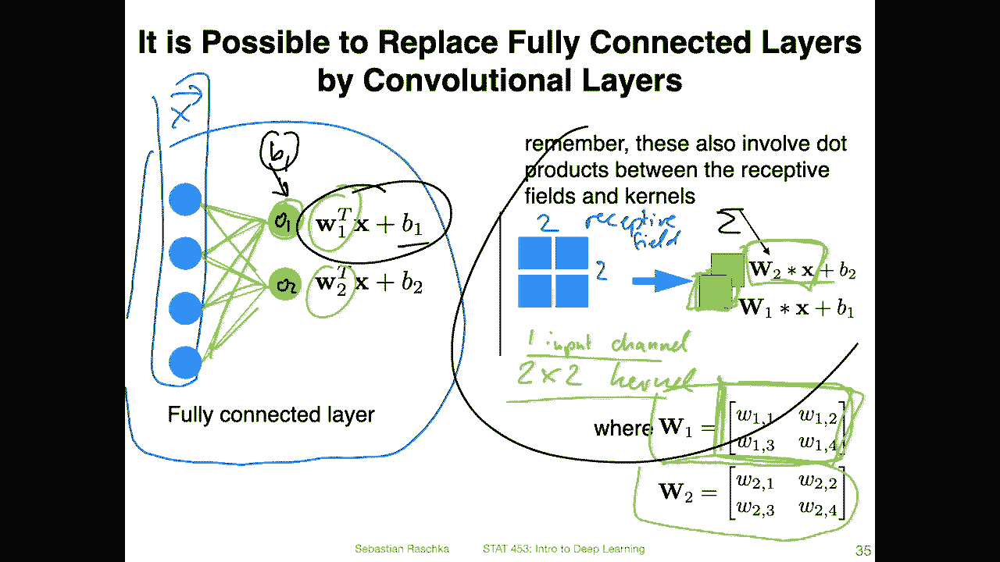
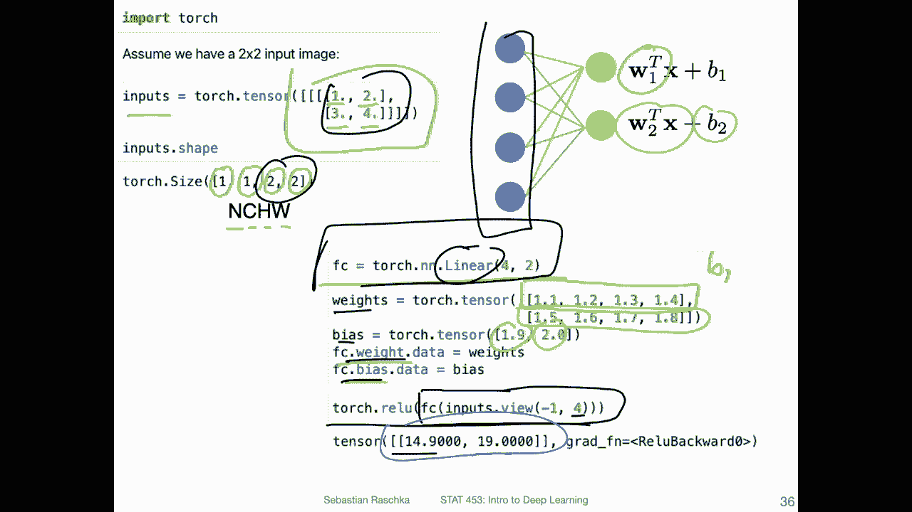
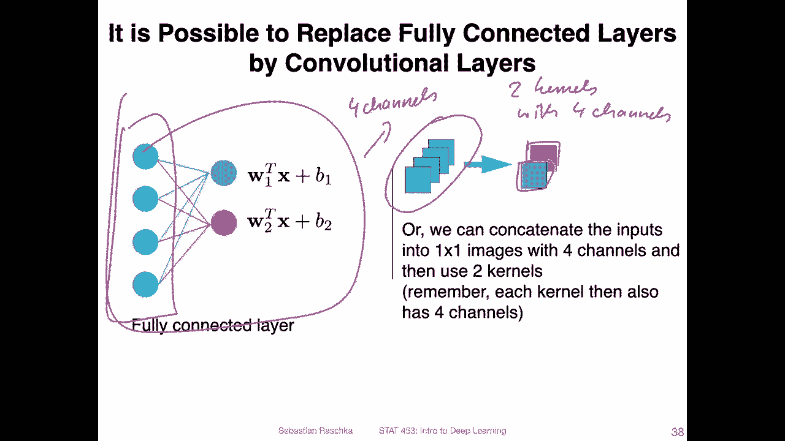
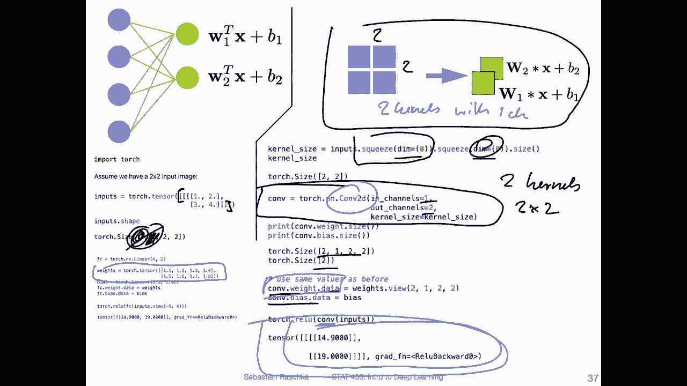
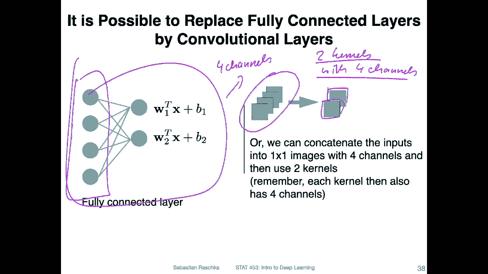
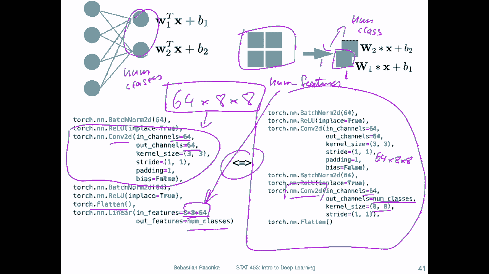
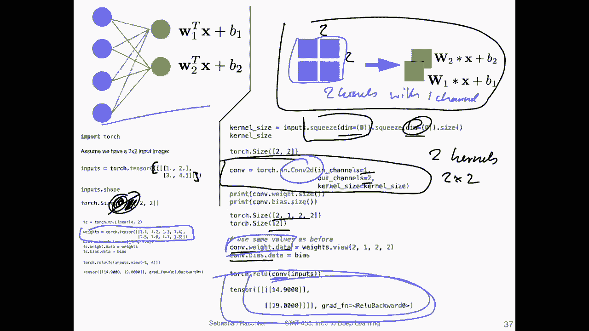
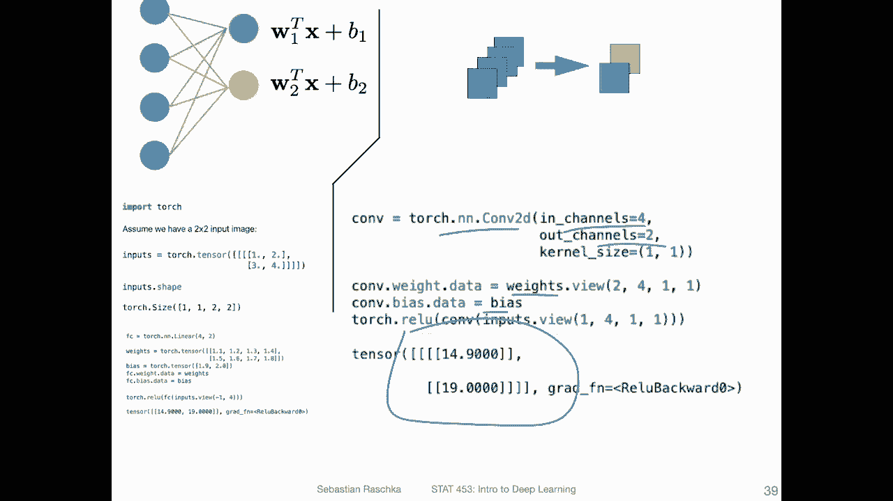
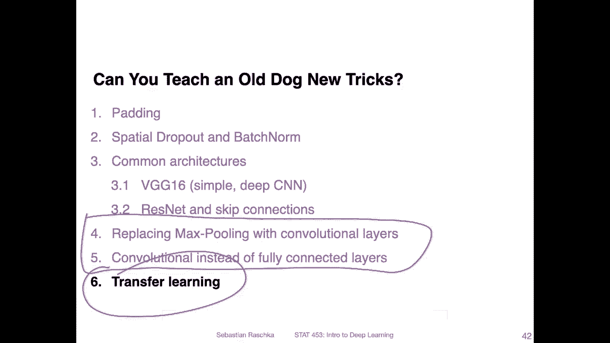

# 【双语字幕+资料下载】威斯康星 STAT453 ｜ 深度学习和生成模型导论(2021最新·完整版) - P122：L14.5- 卷积而不是全连接层 - ShowMeAI - BV1ub4y127jj

All right， now， just for fun， I will show you how we can replace a fully connected layer with a convolution layer。

 And because it's so much fun， there are actually two ways of doing that。

 So we will have twice the fun。 All right， let's start with the first one， so。😊。

On the left hand side， I'm showing you for reference a fully connected layer that we have seen before。

 So in order to fit it onto the slide， this fully connected layer has exactly four inputs and two outputs。

 So， yeah， you remember， of course， how we compute these right， so。Let's start with a green one。

 So hi green。All the connections in green。 These are one way vector。 Let's call that W 1。

 And the output here is。Yeah， the green dot。 And we multiply the weight vector， of course。

 with the inputs here。The input X。 And then we also have some bias unit。 The bias unit is not shown。

 but it's。Addded， Why not。 So that would be added here。 And yeah。

 this is how we compute the first output。 So let's call that maybe output 1。

 And then we have output 2， and we computed the same way。

 except now that we have these yellow connections， such as or W 2。And actually。

 we can do the same thing exactly the same computation using a convolutional layer。

 How does that work， So， yeah， we would arrange our for inputs as an image， let's say as a。

2 by two image here。Right， and then we can have a。let's focus on the green one。 now。

 we can have a kernel。That has one。Input channel。Counnel with a one input channel， and2 by 2。

Colonnel size and width。 So the kernel is2 by2 with one input channel。And。Here this would be O W 1。

 The first kernel， let's say the green one here。Allright， so this is one kernel。

And the second kernel could be this W2 here， which was， again。

 a kernel with one input size or one input channel。 sorry， and a2 by 2 kernel size。

 And if you recall how we compute。The convolution for， let's say。

The receptive field here doest a well。Receptive。Field， and this is here。In green。

 this is our Oh sorry， This is our output， of course， here in green。This is our kernel。

 So this one is essentially， you can think of this operation， essentially as。

Similar to a dot product， essentially， if you， you multiply those， right， it's the weighted。

 weighted input。 and then you compute the sum。そうです。Some over these。 And then you add the bias。

 And it's exactly the same computation as this one。

 And I will show you in the next slide with a code implementation that it gives you exactly the same results。

 So in the grand ski grand。Big picture scheme here。

 This would be a case where we would have a two kernels with one input channel and a kernel size of2 by2。

Alright， so it's maybe more complicated than it seems。

 so let's just take a look at a code example to maybe for those who prefer code examples to have another look at this。

So here again， this is our fully connected on setup， so。I'm defining here my inputs。

 I'm just using some made up numbers，1，2，3，4。And I'm shaping them here such that they are shaped in this N C。

 HW format that we usually use for convolution networks。 So we have one。Bch size of one。

One input channel， height is 2， width is 2。Then I'm defining my fully connected layer here。For。

Inputs。2。😔，Outputs。Here are my weights。So on the previous slide， this would be OW1。Here。

 so I can actually use the same colors， maybe。So let me，cause this was green。

 Let me use the exact same colours So。Green1。And this is。Your orangerange one。And the bias。

B2 is the yellow one。And here， the green one that's the。1。And。

Now I'm just assigning them to the weight and bias in the fully connected layer here and the linear layer Why am I doing that here。

 That is because when I call this function here， it will use random weights and I want to compare this to a convolution network。

 So in that way I'm using fixed weights and the fixed bias unit just for yeah。

 just for showing you that I can do the same thing with a conversion network so that the numbers are not a random here。

Yeah， then I am calling here the fully connected layer on my inputs。

 I'm reshaping this to a long vector of course， so I'm making so this is a2 by2 right 2 by 2 I'm just reshaping it such that is a long vector here with four units and then you can see the results of 14。

9 and 19。

Now I can do the same thing here with my convolutional setup。Soう。

The kernel size I'm going to use is2 by 2 because it's2 by2 here and。

I am just getting rid of the first dimension here。 This is all I'm doing， because in the inputs here。

 I have it on the left hand side。 For reference， I'm just getting rid of these dimensions。

 So the first squeeze， squeeze dimension 0 will get rid of the first one。 So first dimension。

This one will get rid of the second dimension so that I have met  two by two。 I mean。

 these dimensions were empty， right， These were essentially just these。Square brackets。

 I essentially was just getting rid of these square brackets。嗯。Yeah。

 and then I'm initializing my convolutional layer here， one input channel， two output channels。

 So I have essentially two kernels。And the kernel sizes2 by2。And here。Just printing out the sizes。

And here。I'm assigning the weights that I had on the previous night。So。

I'm assigning these weights here。To my convolutional weights。Why am I doing that。

 It's not cheating or something I'm just trying to use the same weights。

 Because when I initialize that， I will， of course， get random weights。

 And I don't want to do this experiment with random weights because then it's hard to compare， right。

 So we have to use the same weights。 So here I'm just using the same weights and the same bias。

 And then here I'm calling my convolution。 And you can see。

And get exactly the same results as with my fully connected layer， except， of course。

 the difference is that they are differently arranged because here we have。

Channels with a fully connected layer， we don't have channels。

 inputs and output channels so that dimension might look different。

 but the results are exactly the same。 So this is one way you can replace a fully connected layer with a convolutional layer。

Another way， this is the second way would be to take these。These fully connected。 sorry。

 this vector to here and stack it。 So we stack it with four channels。And then you can use。

4 kernel sorry， two kernels with four channels each。 So you have。Now。

 still two kernels because we will have two output maps or yeah two output feature maps。

 where can now use。Two kernels。With。For。Channels。To implement the same as we have implemented here。

Now going back here， I had two kernels。😔，With。😔，1 channel。

Each。Now I have to con with four channel each。 The difference really is only that I have them stacked here。

 whereas here I have them arranged in this two by two fashion。

 Both ways would result in equivalent results compared to the fully connected layer。

 If you don't believe me。 here's another example。 So here I'm now having my con layer with four input channels to output channels。

 So this is essentially the four。

Channels to kernels set up。Using my same weight so I can compare them and we will again get exactly the same results。

 So these are two different ways we can replace a fully connected layer with conversion layers。

So just revisiting our， all convolution network where we had this adaptive pooling。 So we can now。

 for instance， instead of using adaptive pooling。Could of course， use a fully connected layer。

 but we could also use our new idea of just using a convolutional layer here so to make this all convolutional network even more convolutional。

 So here now I will set the kernel size to 8 by 8 because we found out in the previous code notebook that here at this stage the feature maps will be 8 by 8 64 by 8 by8。

 So 64 the channels 8 by8 is the。height and width。 So that's why I'm setting it to8。

 And this if you run this， it will give you exactly， well no。

 it will not give you exactly the same results as the adaptive pulling because now we have more parameters。

 but it will run it white， even give you better results。

And here here's last thing for this video here is a comparison。

 a direct comparison between the fully connected implementation of a network and the fully the fully convolutional version of that。

 So on the left hand side。I have a convolution to D setup with 64 input channels and 64 output channels。

And then I'm flattening it。 So if these are 64。Times 8 times 8。

Here I'm flattening this so that this gets combined into the。Number of。Features。

That's what I have here。Z。Number of features。 And then my output is the number of classes。

 So this is my last layer。That that's how we would usually do it。 But if you have， for some reason。

 and aversion against fully connected layers， you could achieve the same thing using convolution layers。

 by the way， I also。Tried that a few years ago， just for fun with more serious networks。

 There's usually no no benefit。 I thought back in the day。

 it might be easier for the implementation in Kuda to achieve better performance with that。

 because you could probably leverage better parallelism with multiple GPU course。 But in practice。

 I found almost zero difference。 whether we use fully connected or convolutional layers in the last layer。

 So this is here really， what I'm showing you is really just more like a toy experiment or。

An example that we have the ability to do that to achieve the equivalent results。

 but it's not necessary。 so you don't have to worry about that or you don't have to do that。

 I'm just like illustrating this here。If you wanted to， I mean， it's more like， I think it。

 it could be technically be helpful to understand how convolutions work。 But again。

 you can even think of this video as entirely optional。So。Here on the right hand side now。

 I'm showing you the equivalent implementation where。

I am setting my con layer to the 64 input channels。It's like before and。The output is the 64 classes。

 So here， this is really。The number of classes in the drawing here。We only had two classes。

 but let's say in Cypher 10， we would have 10 classes。Alright， so。That's what I setting it to。

 And this is then here， the 8 by 8， because we had。64 by 8 by 8 in the previous layer。

 or were assuming that。 And for this to work， this has to have the size of。

The feature map of the previous layer， because we want to have a one。1 by one output here。

And you can run this and it will work。And it should give you equivalent results to the left hand side implementation。

 If you try that in practice and you find that results might be slightly different。

 that might have something to do with a random weight initialization。

 because every time you call a layer， it will create random weights。

 So this makes it hard to compare。 But in theory， it should give you the same results， because as we。

Seen before。

Here it's exactly， yeah producing the same results。 Okay， so these were just some。

Fun videos now are not fun， but I would say thought experiments how we could technically。

Get rid of non convolution layers。 If we have an aversion against fully connected or pooling layers。

 And in the next video， I will。Go back to a more important topic。

 transfer learning which I think will be very useful for your class projects because it helps us leveraging related data sets。

