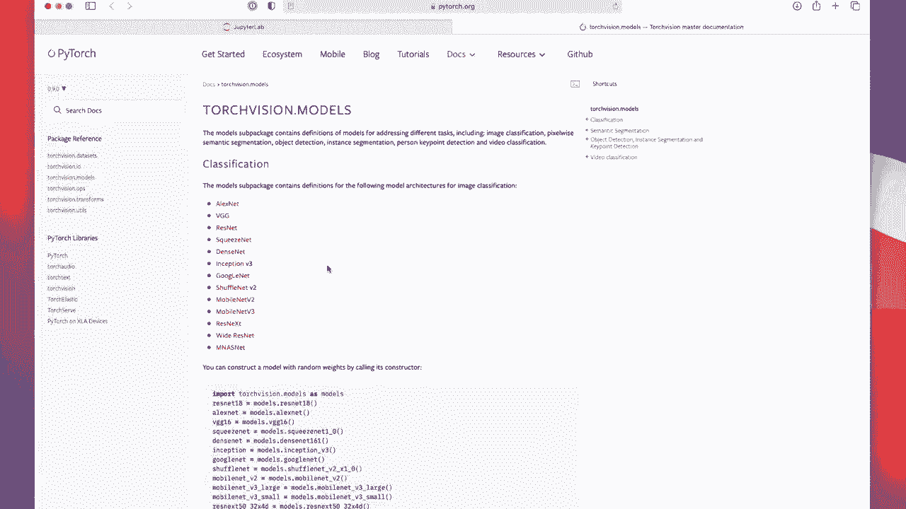
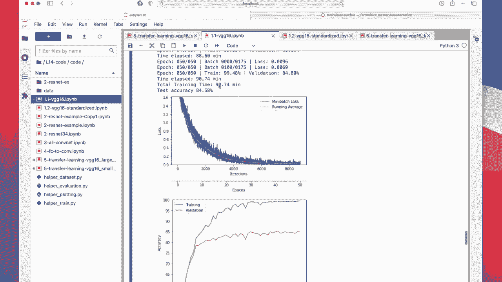

# 【双语字幕+资料下载】威斯康星 STAT453 ｜ 深度学习和生成模型导论(2021最新·完整版) - P124：L14.6.2- PyTorch 中的迁移学习 - ShowMeAI - BV1ub4y127jj

All right， let's now talk about transfer learning。 In particular。

 we are going to take a look at how we can use a pre traineded VG G16 that has been pre traineded on imagenet and then find unit on a target dataset set we are going to work with Cypher 10。

So in particular， we are going to freeze all the convolutional layers。

 we assume these are good feature extraction layers。

 and then we will only train the last fully connected layers and in particular well also replace the output layer。

Because an image net， the output layer has 1000 units， because in this particular case。

 it was fit to000 classes。But yeah， Cypher 10 only has 10 classes。

 so we are also going to have to replace that one。Allright， so let's take a look at the code example。

So， yeah， I actually made。

2 notebooks。 like， let's take a look at this one first， so。

Everything you can see here is the same as for the B G16 I showed you before。

 so I don't have to discuss any of that in detail again here。

It the same things， except it's too large， maybe except for。This line and this line here。

 So what are those。 So those are， again， the means and standard deviations for standardizing the inputs。

Why am I using these weird numbers and not 0。5 like before。

So that is because that was used when they trained。

Or pretrained the model on imagenets。 we are going to use a model from that Torch vision library or repository that has been pretrained on Imnet and they just happen to use these parameters。

 They derive them from the imagenet dataset set。

嗯。I should say we are going to use the V2 G16 here from this torch vision。Repository。

 and there are also other networks。 We are just talking about V G G16 because it's familiar。

 but when you are working on the class projects， also really good networks， I mean。

 actually all of them are good。 maybe except for Alexnet， it's a little bit dated。

 but yeah densesnet is a special version of Resnet that has each connect each layer connected to each other layer。

 So it's like why it's called denses， it's fully connected in terms of the layers whereas with Resnet。

 we only have some of these residual connections， mobile nets are really cool because they're very efficient。

And also give you very good performance。 So I probably wouldn't use version 2 if there's audio version 3。

Reest next is also like， I think it's more mobile friendly version of residual networks。 It's also。

 I think， a little bit faster。Whide dressnu can give you better performance if you have a large data set。

Inception is also really good architecture。 Google。

 you probably don't have to use Google Line because that's like an early version of inception。

In any case so there's a variety of things to use， all of them have been pretrained on Inet and here they say they derive this mean and standard deviation from Imnet and we are going to use the same values so that we make sure that our inputs are on the same scale as theirs in our Cypher 10 dataset set。

By the way， I also。So sometimes it's also recommended to compute these really from scratch from your dataset。

 That's because it might be that all your images are systematically darker or systematically brighter or things like that or less or more colorfulful and to account for that。

 it might also be a good idea to derive these parameters from your own dataset。

 So I have showed you this earlier in a previous video I actually have done that and implemented that here where we compute these from our data for the self 10 dataset。

But you can see they are essentially the same as for Inet and I try to run the VG G16 with either those or the parameterss that they propose on the website and I didn't find any meaningful difference so it's fine to use either or in a practical application if they are substantially different you want to try out both because there can be an argument made for either case so you can say you should use these because that's what they used and just to be consistent but you can also say it makes more sense to use your own parameterss because maybe your images have a systematic difference。

Compared to the imagenet images。Alright， so that was just like a long version talking about standardization parameters。

Moving on to the more interesting part， the transfer learninging part。

 So we are now loading this pre trained model。 So actually。

 you can load all the different models in a not pre trained version if that's useful to you。

 So you don't have to implement these。

From scratch， they are already available for you。 If you set pretrain to faults。

 it's essentially training them from scratch。So here we are talking about the transfer learning。

 So we are using a pre trained version， pre traineded on imagenet。

And this is how our， yeah VD G 16 looks like when we load it from the repository。

 So I'm calling model， which will just output the structure of the network。 so you can see。

There's one part。 It's called features here。 And this part is really like the convolution layers。

 like because。Like we said earlier。The convolution layers can be understood as automatic feature extraction layers。

 so this would be the corresponding part。 And then here this would be our classification layer here。

 So where we have our sequential layer。Alright， so this is yeah how it looks like。

 So between as adaptive average pooling， which is similar to global average pooling that we discussed in the previous videos。

 That is really just to make the bridge between the last layer in the convolal part and the first layer and the linear part to make sure that we have this number of features when we have seven times 7。

Times， whatever the sizes that comes out of here。

Alright。 so we said we are only going to train the linear layers。

 So what we have to do is So the easiest way I find。

That we can do that is by freezing the whole model first。

 So what we do is be iterate over all the parameters in the model。Like this。

 And then we set them to fault。 the requires gradient attribute。

 And this will essentially freeze the network。 so you can still run forward and backward。

 but it will not update the parameters。 They are now kind of fixed。

Alright， so this will freeze the model。 And then we want to fine tune the last three layers。

 So if I go back to my visualization。 So we are only going to fine tune this last part。

 So we have to kind of understand a little bit what this last part is。 So we know， okay。

 this is in the classifier here。 And there are different layers，0，1，2，3，4，5，6。 And we have to。

Pay attention to those that have parameters。 So， for instance， this linear one。

 drop out and reddo doesn't have parameters， Line， linear and linear。

 These are the ones that we want to yeah modify。

So here I'm setting the one corresponding to one。To true。And this one， also to true。

 this is the one corresponding to 3。 So I'm essentially saying these are now trainable again。

So we want to train those and we have to replace this one entirely because the output number of classes is 1000。

 but in Cypher 10 we only have 10。 so here I am providing my own linear layer。

So I'm just using the same number of input features，4096。

 but I'm just changing at the number of output features to 10。

And then it's training like usual。So I'm training it here。 nothing new。

 It's exactly what we have done before， but what's interesting is now you can see it already starts with a pretty good accuracy。

 So if I compared to our previous P D G16， this is our own implementation。

Can see。It starts with 35，50，53。 So here this is already more powerful in that way。

 It's already kind of warmed up in a way if you want， because it's y pretrained。

And then it's training。 But I found it doesn't give good performance here。 So you can see oh。

 it's only 77%。 It's not great。 So what's going on here。

 So the one explanation could be that imagenet is much bigger。 And they also say that here they。

Expect the height and width to be。At least 224。So usually networks are somewhat agnostic to the exact size。

 if you use adaptive average pooling like。

They have used。

Here， because it will make sure that whatever is before here will have the output size of 7，7。So。

 and then it will make then it this will have the right dimension here。

 because this is guaranteed to be 7，7。 But the problem is。

These layers before they have assumed that the images have a certain size and the objects have a certain size。

 So they have been really trained maybe on larger images。 So if the images are too small， yeah。

 the network performance might not be great。 So what I did is I had a second implementation here where I。

Just increase the size of the images to 224。

I mean， it's not ideal because Cypher 10 is a very small data set， and it will be very。

 very pixelulated。 but yeah， just for。

Trying it out。 So was doing exactly the same thing， except for the larger images。

 And you can see it has already better performance。 It goes even up to。

。

I know，84。9%。So in that way， yeah， that's actually a pretty good performance。

 given that this is a pre trained network that we just fine tuned a little bit。

 So we are only training the last three layers。

Yeah， but also because images are so large， it takes long time now。Alright。

 so what you can see also let's take a look at the small one again。

I was training it for。

50 epoch it took 38 minutes， and。

For the version that we trained from scratch， it was 90 minutes。 So it's probably because。

 first of all， it's probably a little bit more efficient implementation。

 but it's mostly because we froze the convolutional layers。

 So we are only training the fully connected layers here。

 So that also saves a lot of time one hour to be exact。 So yeah。

 so this is how you can do transfer learning。 But yeah， also， I， like I showed you。

Before how many layers to train it really depends。 So based on this paper， they found training。

3 fully connected layers results in the best performance， but it really varies from case to case。

 Sometimes it might be better to only train the last layer。

 Sometimes it might be better to fine tune all layers。 It's really， yeah， depending on。

 on the particular case。 But yeah， I hope this was useful。 Now you know how to do transfer learning。

And I think yeah this is also the last video for this lecture on Convol networks Next we will start a completely new topic talking about recurrent neural networks working with text data。

