# 【双语字幕+资料下载】威斯康星 STAT453 ｜ 深度学习和生成模型导论(2021最新·完整版) - P125：L15.0- 循环神经网络简介【课程概述】 - ShowMeAI - BV1ub4y127jj

Yeah， hi everyone。 So today we are going to talk about recurrent neural networks。

 What are recurrent neural networks Yeah， these are a special type of neural networks that can model sequence data。

 So one popular example would be natural language processing where you can think of a document as a series of words or you can think of each word as a series of characters or letters。

 So today we are going to take a look at the big picture of recurrent neural networks。

 how they work and at the end of this lecture I will show you a classification example。

 a document classification example so with that， if you recall the title of this class was introduction to deep learning and generative modeling。

 So with this lecture I hope to have finished the introduction to deep learning part So I'm pretty sure with that you have a very broad and good understanding of what deep learning is and the different problems we can apply deep learning to and that will be like your fundamental knowledge of deep learning。

And then we will be taking this knowledge。To the generative modeling part。

 which will be starting next week。 So next week， we will be taking some concepts like convolutional layers。

 And later， also the recurrent neural networks to generate new data。 in particular， next week。

 I'm planning to cover auto encoders and variational autoenrs。

 which are essentially specific types of networks for generating data。

 and we will be using convolutional layers to focus on image data。 After that。

 I will also yet talk first aboutjoative adversarial networks， which are very popular topic。

 as you may know。 And after that， we will be revisiting these recurrent neural networks for generating new text data。

 So here today， we are focusing on the big picture of recurrent networks。

And we will be focusing also on the classification example that I will provide at the end of this lecture。

 Then in approximately one or two weeks， I would say more like two weeks。

 we will be revisiting these recurrent neural networks for text generation。Alright。

 so now you hopefully know what's going happen next。 And yeah， the next。

Element in the sequence is getting started with this lecture because there are plenty of things to talk about。

Yeah so here are the topics I have in mind for today so if you are interested in text data working with text。

 of course RNNs are not the only way you can work with text data。

 so I will also briefly highlight some other ways we can use for working with text data but then after this brief overview we will dive more deeply into the RNNs the recurrent neural networks and look at how they work for sequence modeling。

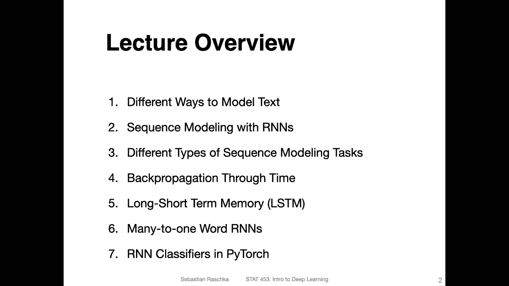

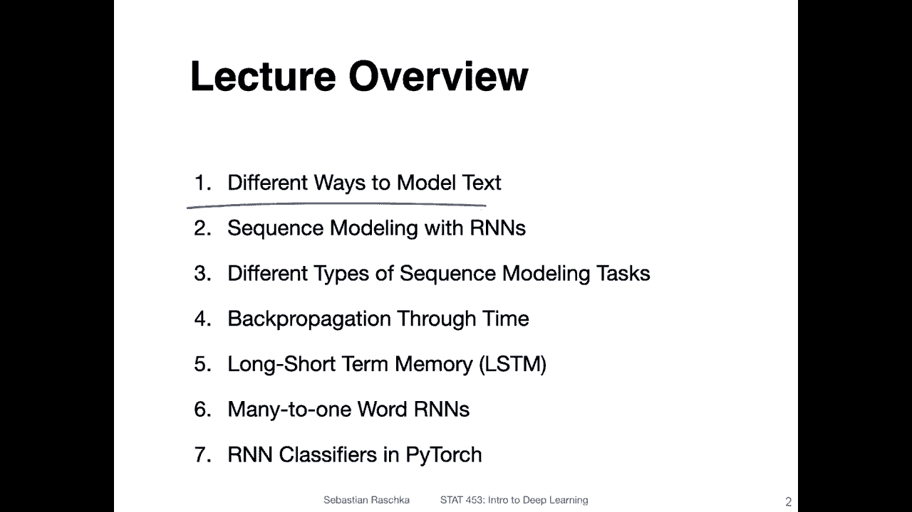

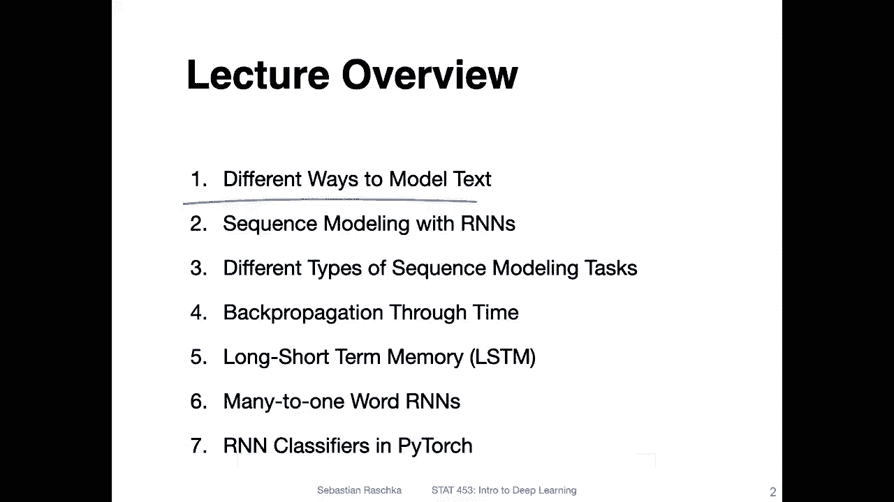

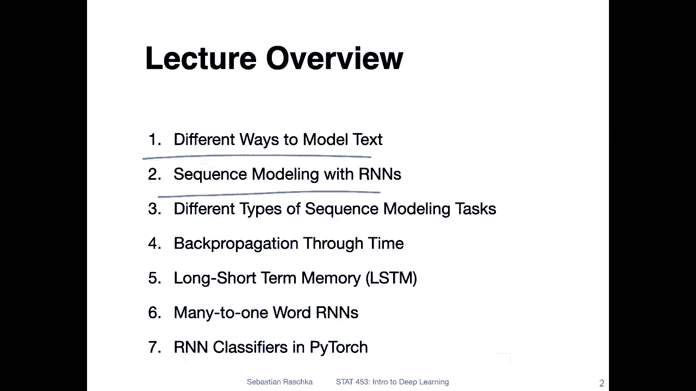

Then I will yeah discuss different types of sequence modeling tasks because there's more than just text classification and then we will talk about back propagation through time。

 this is like a modified version of the back propagation that we already talked about in the context of multilayer perceptrons and convolutional networks。

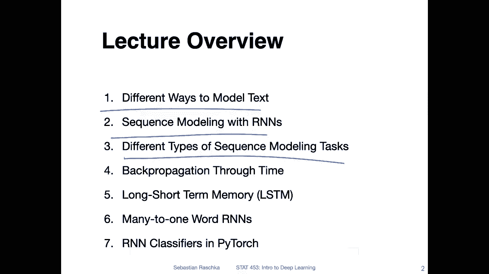

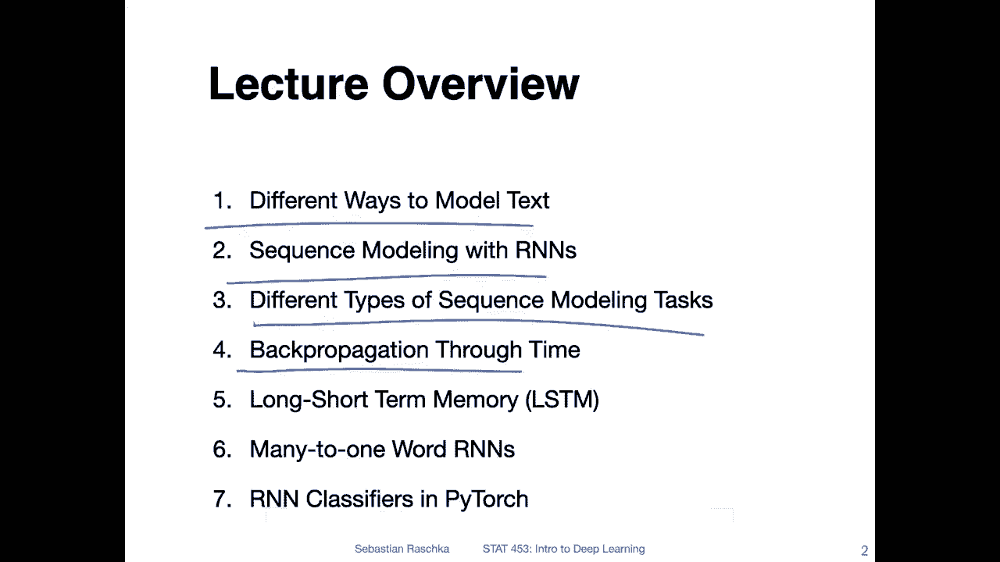

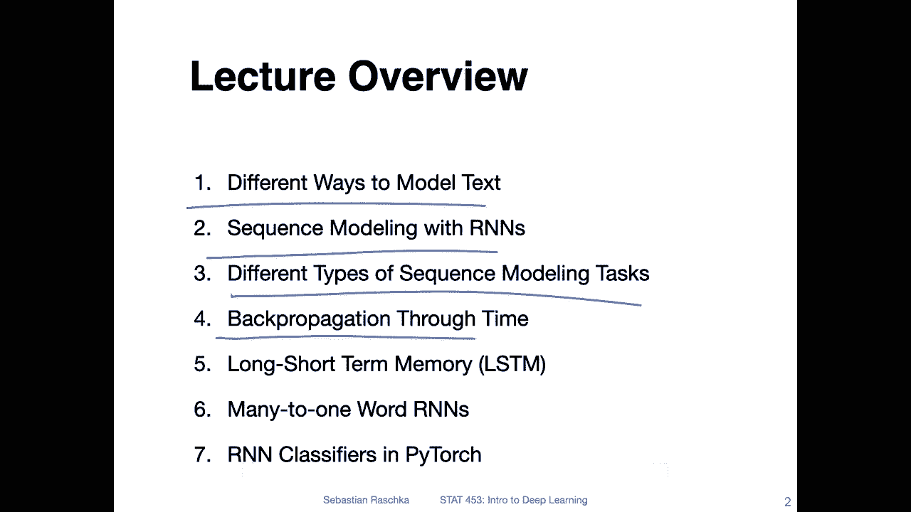

Then we will talk about the long short term memory。

 so these are specific cells for recurrent neural networks that help with yeah processing longer sequences。

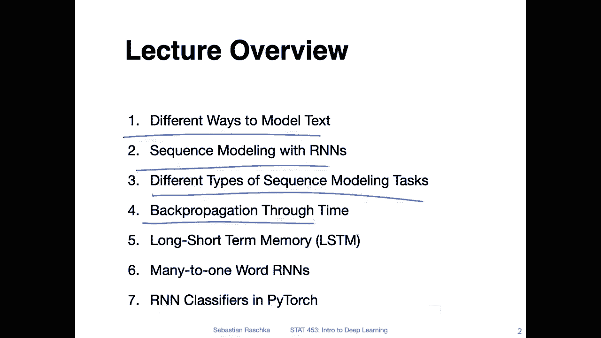

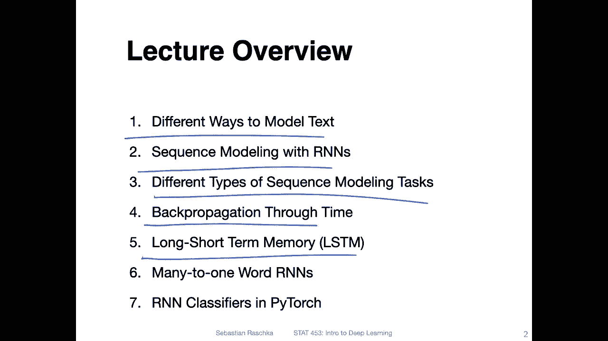

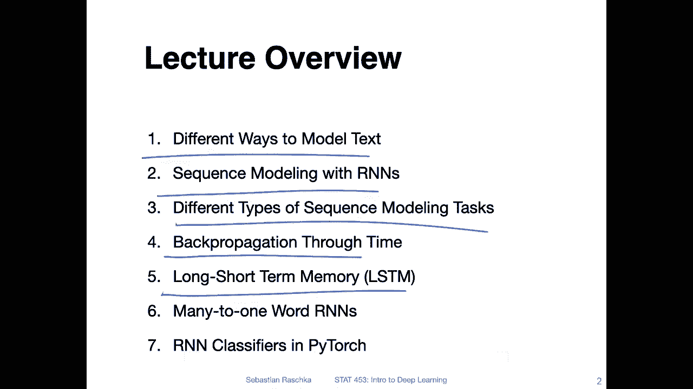

So then we will talk about many to one word R and ends。

 So this is just like a fancy way of saying that we are working。

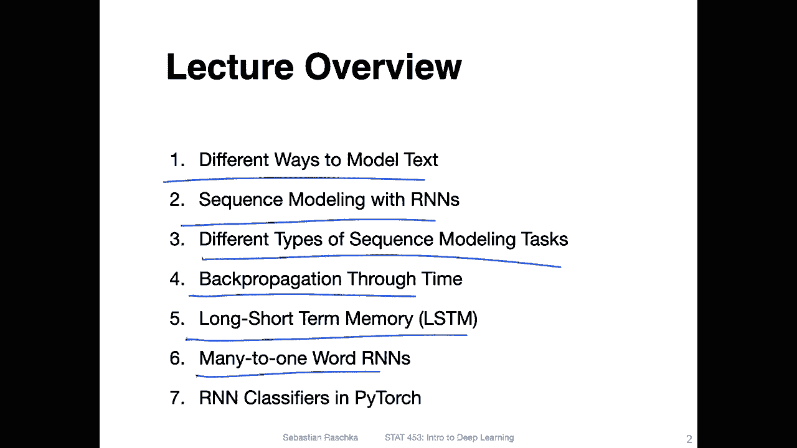

Or looking at an example when we have a text and we want to classify the text。

 So going from a sequence， which is。

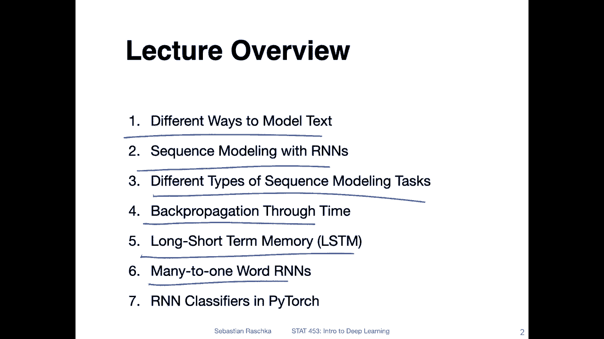

Many words to one output label and we will be using a word R andN here。

 so there are also I will discuss that later character R andN so character R andNs you process one character at a time and here we will be processing one word at a time。

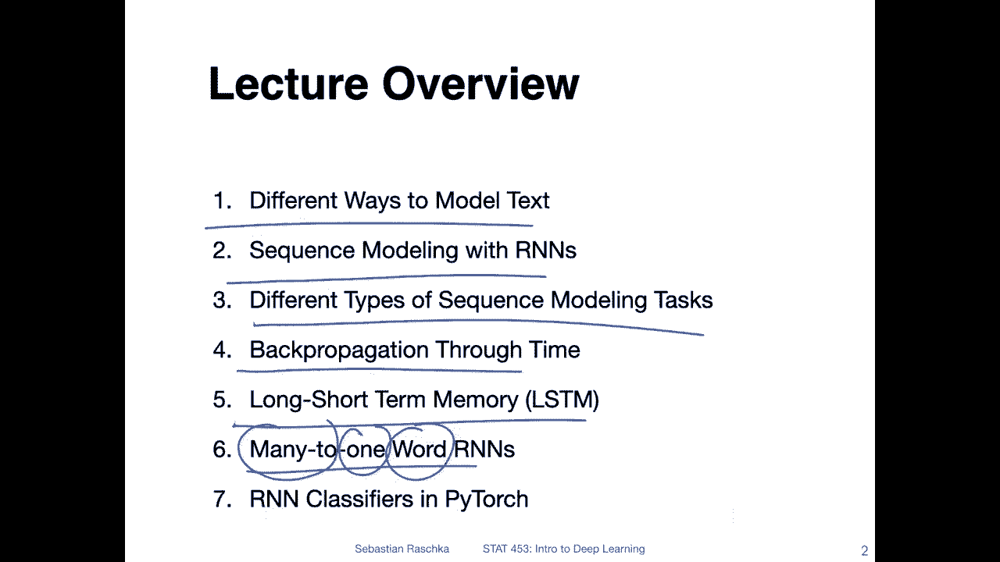

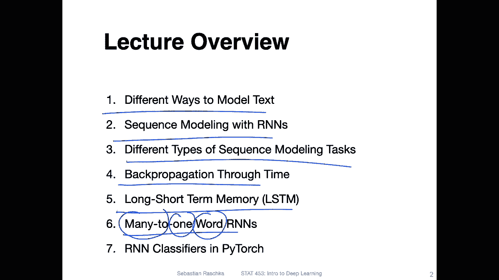

And then I will show you how we can implement those in Pythtorch。

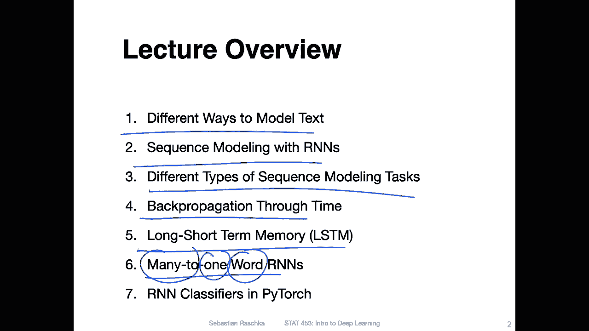