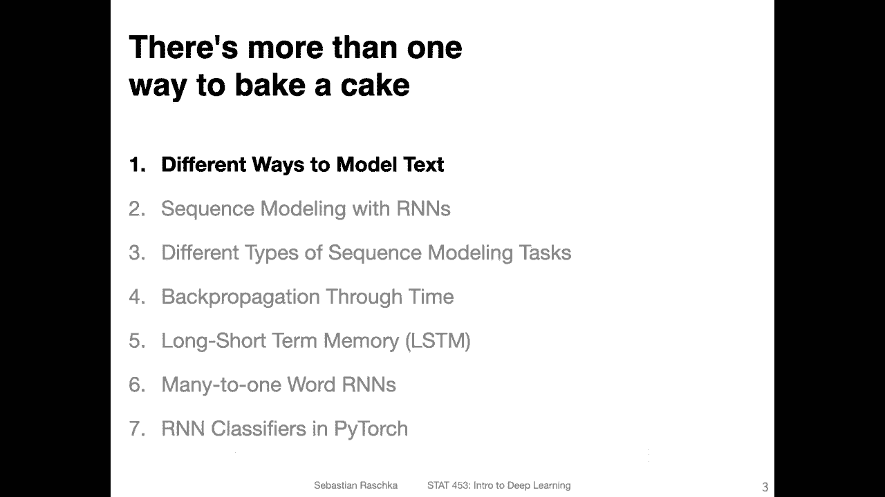
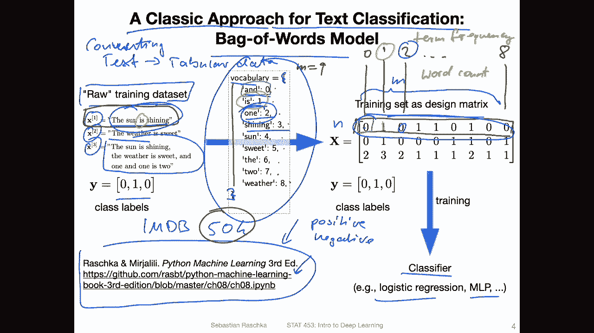
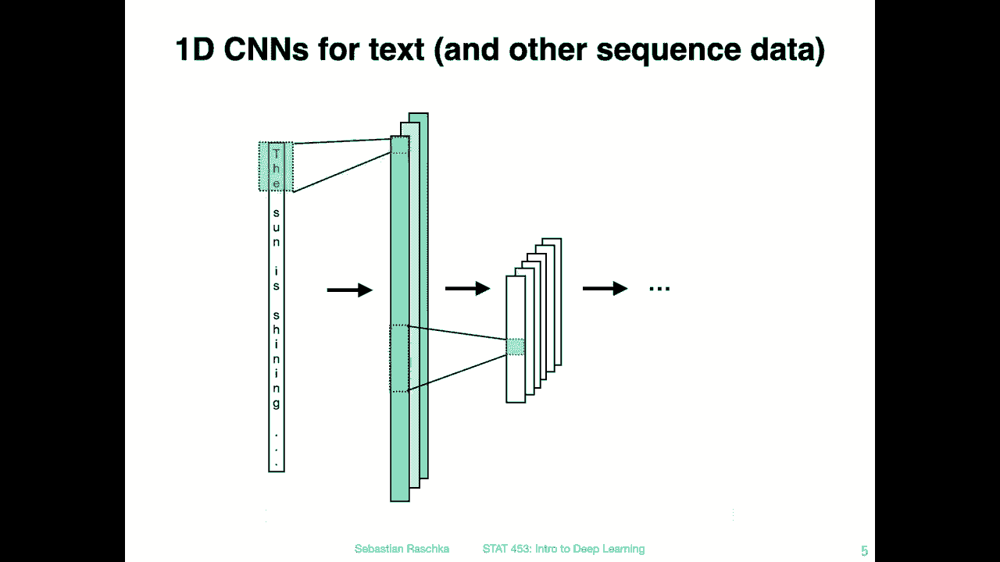
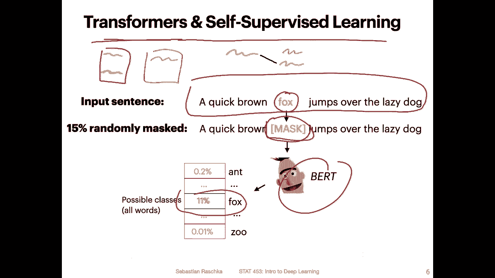
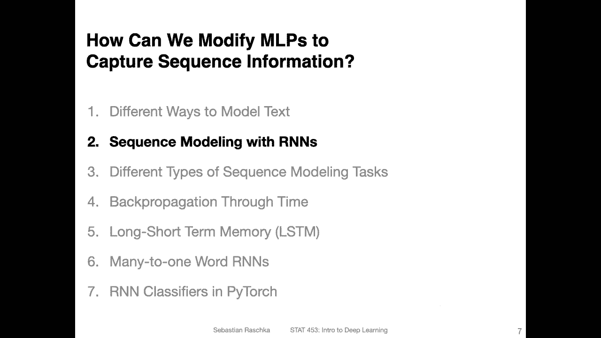

# P126：L15.1- 处理文本数据的不同方法 - ShowMeAI - BV1ub4y127jj

All right， before we talk more about recurrent neural networks。

 let me go over some other ways we can use for working with text data because I think that might be just useful for you just to have a big picture overview of different methods that exist for working with text。

So here that's the classic approach for text classification， it's the so called back of words model。

And in this class we won't be talking about this in detail。

 I just thought it might be useful to have an overview slide here。

 so it could also be useful if you work on your class project and your class project is centered around the text classification task and you are planning to use deep learning using such a back of words model might actually be helpful as a baseline model。

So if you are interested in that that type of model in chapter 8 of our Python machine learning book。

 we have a chapter on how this works and I also have a yeah code example notebook here on training such a deck of words model using a logistic regression classifier so the big picture here really is that。

We are converting。Text。To a tabular data set。So the downside of this approach is that it gets rid of the sequence relationship in a text between words。

 so this is more like a naive or simple approach to text classification， so how does it work？

So let's look at this， so on the left hand side， what I was writing down here is a raw training data set。

So just an example dataset set here consisting of three training examples， so X1。

 x2 and x3 these are three training examples and the first training example is a text for example the sun is shining。

 the second training example is a text， the weather is sweet and the third one is a text saying the sun is shining the weather is sweet and one and one is2。

So I just made this up， but this is like an example of a text data set。And for that we also have。

 let's say corresponding class labels， the class labels here are not important except of course this is a classification problem。

 but here we are only focusing on the features in the back of words model the class labels are treated like in any other classification example。

 so the first step using our raw data set the first step is to build the so-called vocabulary。

This is also something we will be doing later when we work with recurrent neural networks。

 so building the vocabulary means looking at all the possible words in a data。

So we take the whole training set。Enre training set and look at all the unique words。

 it's essentially a set。Of all the unique words， and we give each word an index so you can do that alphabetically。

 but it doesn't really matter。 So it's just that you have like a dictionary here that maps from word to some interten。

That's your index in which order you do that， like I said， doesn't matter。

 It's just that you have to keep this order。And that will be now your vocabulary。

And then what you do is you convert the raw text into a。Design matrix。

 So this is our regular design matrix and machine learning。

 where we have N training examples and M features。And notice now the M features here。

That's actually the length of our vocabulary。 So in this case， here。

 the vocabulary consists of one up to 9。 We have 9。But let's use a different color here。M with 9。

 because we have。M or9 unique words。And。We have these index position 0，1，2，3，4，5，6，7，8。

 and this is also corresponding to these index positions in this design matrix。

 So here in the first one， the let me like here， this is index position0， This is index position 1。

 index position 2 and so forth up to index position 8。And here。

This would be the first training example。X1 And this is really just a word count。Let's。

Write to stone。 It's a word。Count， I mean， sometimes people also call that term frequency。

And there are also normalized term frequencies， but here we are just considering the simplest case。

 just the word count or the regular term frequency。

And it is here just counting how often each word appears in a text。 So， for instance， the first。

Index is 0， right， So yeah， so the first index let me use pink here。 The first one。Corsponds to and。

 So is the we are checking essentially in this first training example， I that an and in the sentence。

 No， So we put a 0 there。 Then the second one， the second index here， this would be。

running out of colors。 this would be corresponding to is。 So is then is in my sentence。 Yes。

 there is。 So there's only one。 So I put a one here。And then。We use， maybe me use blue again。

 So for the。Third position here， This corresponds to a one。 So is the a one in my sentence。 No。

 there is no one。 So we put a 0 and so forth。 So we are just counting the number of times each word occurs。

 And then we have the so called a design matrix。 and this can be then used。

For training a regular classifier， for example， logistic regression or multilay perceptrons。

So we are here in the back of words model just converting text to a matrix to a training matrix or design matrix。

The only problem here or it's not a problem， it's just like an assumption。

 we assume that the order of words is independent on。Because。The order here。

In this matrix of the words really is just determined by the integers in the vocabulary。

 So in this way， there is no notion no of grammar or something like that。

 So there is no no relationship between the sequence of words， which can be。Downside。

 it's just a simple type of model。 It's not as sophisticated because it's not modeling sequence information。

 but it can still result in good performance。 So also in this book， for example。

 we were working with a so-called IMDB movie dataset。

 I'm also planning to make the last code example in this lecture about IMDB movie data。

 So it's a movie dataset。consisting of movie reviews of approximately 50000 movie reviews。

And they are either ranked as positive。Or negative， like。

 is a reviewer liking or not liking the movie。And using a B of words model。

 I got something around 83， 84% accuracy。And using a recurrent neural network。

 I also only got the same performance like 83，84，85%。

 So that's because 50000 is relatively small for our machine learning a deep learning context。

So this is， I would say， like the borderline where both machine learning。

And deep learning are equally useful if you go bigger if you have a bigger data set。

 then actually deep learning might outperform machine learning， but if you have something around 50。

000 or less data points using traditional machine learning， for example。

 this specck of Mertz model may even give you a very good performance。

Yeah， another way to work with text data would be to use a convolutional network which was a big topic a couple of weeks ago。

 but yeah previously we talked about convolutional networks for image data。 However。

 we can also use convolutional networks for text data so we have to use a special case of convolutional layers。

 the one dimensional convolutional layers This is actually can also give good results but it is not as common as using for example。

 recurrent neural networks when I look at some papers you can get kind of the same performance if the data is relatively small for bigger data sets usually recurrent neural networks perform a little bit better than one decoconvolutions。

 but it's again another approach it really depends on the type of data you are working with and that might be another thing to consider。

Yeah， here just a big picture overview how that works is that you are yeah。

 sliding the kernel over the text as a sequence rather than the image。 So before。

 when we had an image， we had our。Colonel that we were sliding。From left to right。

 And then we were moving down。Then sliding it again from left to right and so forth。

 So before we had 2 d convolution。And now we have a one dimension convolution where essentially we have only。

 let's say， one logging vector。 you can think of it like this or also like this。Was drawing it。

verticaltically for some reason， but it also would apply like this where we have this kernel like here and then just move to the right by oops one。

Let's say， one。Pixel。It's harder to see if I use one pixel。

 but we are moving it essentially also to the right。

 But there is no moving to the bottom because it's just one sequence where here we can also， yeah。

 move the kernel to the bottom。So for that here's another example the sun is shining as my input here and we would convert this text also get to numbers。

 for instance we can consider each letter as a yeah unique element in our dictionary we could also consider of course special characters so if we consider let's say the American alphabet or something we have 24 letters plus yeah punctuation characters and then we may map the T to let's say the position 20。

The age to 8。 So we convert this input to numbers。Right， so 28。4 and so forth。

 And then we have our kernel。That computes the， yeah， regular convolution。

And then we get a value here。So we have， let's say， W1 times 20。Plus， W2 times 8 plus W 3 times 4。

 And then we compute。The sum。That's how we get this value here。 And then in the next layer。

 we would do the same thing。 We would have， again， kernels sliding， let's say from top to bottom。

 So this one would。Here。And so forth。 And this is how we could use a one dimensional convolution network for working with text data。

The maybe more modern way right now to work with text data is using so called。Transform us。

So we will talk about transformers later in this lecture or sorry later in this class because I want to talk about recurrent neural networks first。

 so recurrent neural networks pretty useful and powerful and at some point and I think it was 2014 people added a so-called attention mechanism to recurrent neural networks and then later in 2017 people did experiments when they said okay let's maybe only used that attention mechanism to get rid of the R&N and they found actually that performs even better and this gave rise to the so-cal transformer models。

So when I mentioned that back of words models work well with small data sets。

Recurrent neural networks require larger data sets and transformers require even larger data sets。

 So usually when people use transformer models， they use billions of sentences as input and that is like a huge。

 it's usually when you look at the recent papers， they train on hundreds or thousands of GPUs and it takes weeks。

 And if you have watched some of the stuff in the news videos。

 we also talked briefly about how much it costs。 it's like between $20000 to a couple of million dollars just to train the model。

 So in this way， this is usually something only big companies really are capable of right now。

And of course you need large data and if you have or consider large data sets one problem is where do you get the labels from so usually transformers come hand in hand with self-supervised learning which is a concept of leveraging the input data to generate labels for supervised learning so in a text context。

 for example that is the so-called BRT model there are two selfsvised tasks。

So one is that they are masking 15% of the words and then are predicting them。

 so if you have a given sentence that looks like this。

 what they do is randomly 15% of the words are masked， for example。

 let's say they mask the fox in a given iteration and then they train the network to predict what word would go into here so the bird model then predicts。

Different words。 And there' is， of course， a vocabulary of。

Hundreds of thousands or millions of different words。

 and ideally it should give the highest probability to the one that was removed。

 So here they kind of leverage the training data inputs to generate labels。

 So the generated label is here just by removing a word and then predicting it back into the text。

And when I recall correctly in the specific case of B。

 they also have a second supervised task where they take a document and they take two sentences out of this document and then they have a second document where they take one sentence from。

 so let's say I。Maybe show this visually。 So they have one sentence and another sentence。

 and they have a second document。Let me use yellow here， maybe。 and they have a second document。

 and they take also a sentence， and they give this green sentence to the model。

 and then they should the prediction is whether。This purple or the yellow sentence comes from the same document so it's a binary classification task whether model has to find the correct pair of sentences that are coming from the same text so should be sentences that come right after each other oops so see that should be like this so they the model tries to connect or find the pair of sentences that comes from the same document and this is also a task that you can just where you can generate your data yourself because you should use unlabeled data to generate this labeling information。

But yeah， we will be talking about transformers more in a separate lecture later in this semester because yeah the transformers are kind of inspired by RNs where people added attention to RNs and then they remove the RN component and lend it on the transformer model without RNs and like I said it's a more I would say complicated or bigger effort to train transformers so this is something we will consider doing later not right now so right now working with RNs and usually to be honest RNs for most tasks in practice are still I would say the most relevant models because who can afford to train transformer models so this is actually not too bad to know about RNs。

Al right， so in the next video， I will then now finally talk about RNs know that you have seen different other ways to work with text data。

