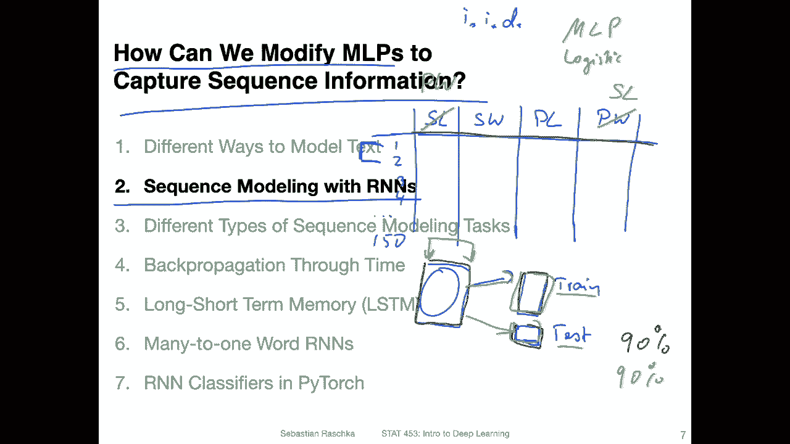
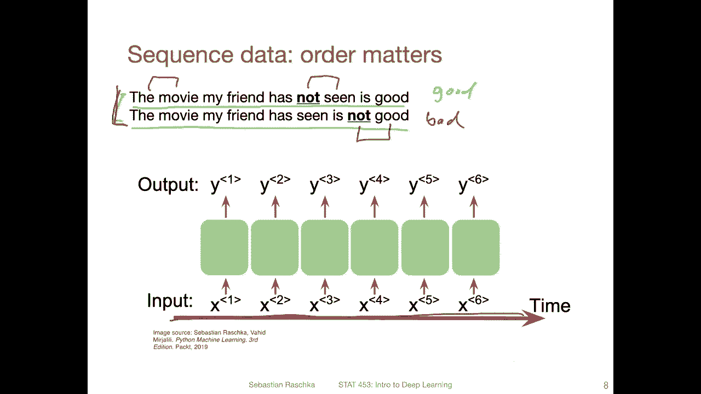
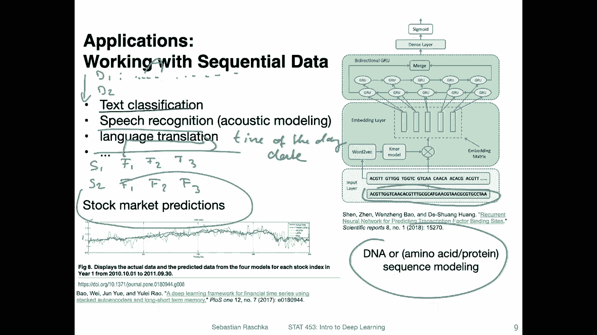
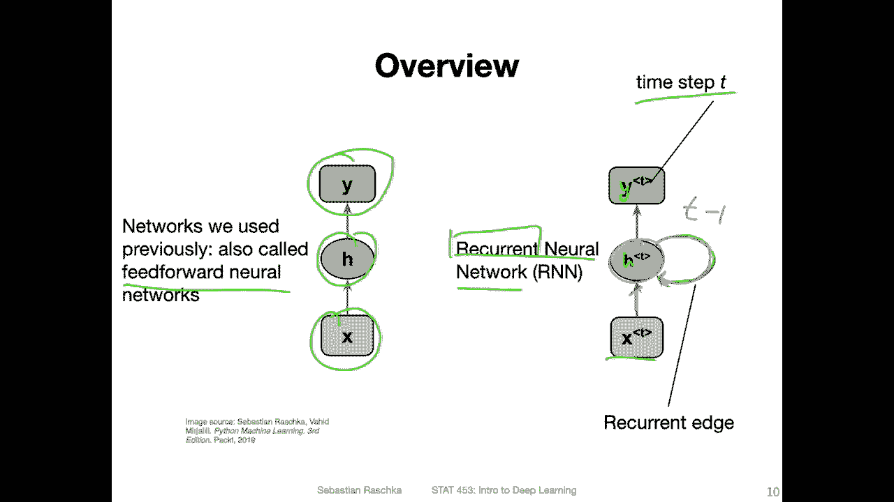
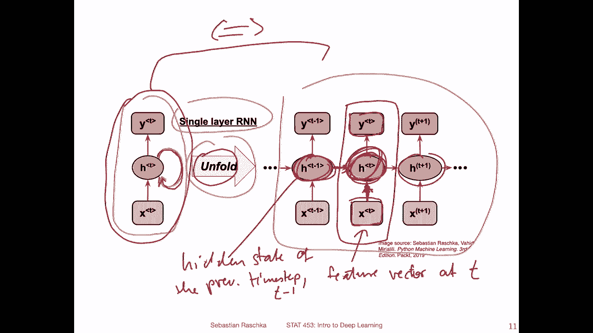
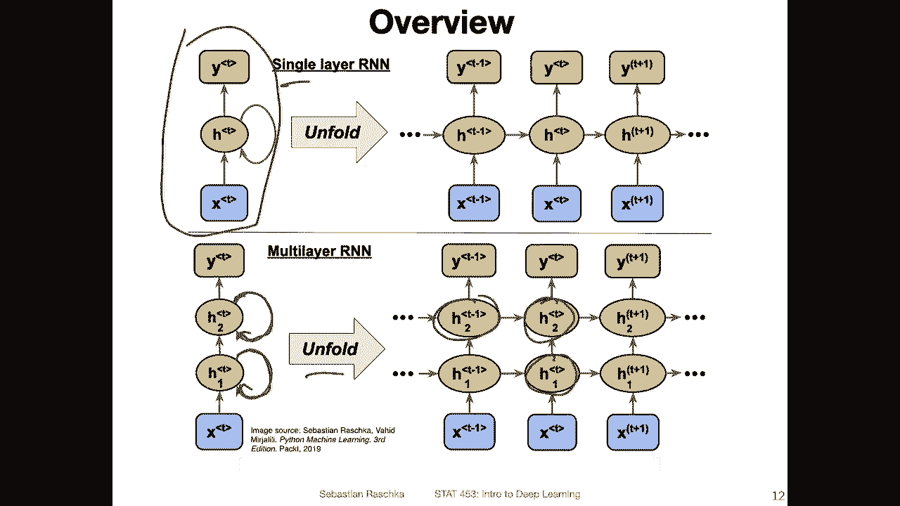
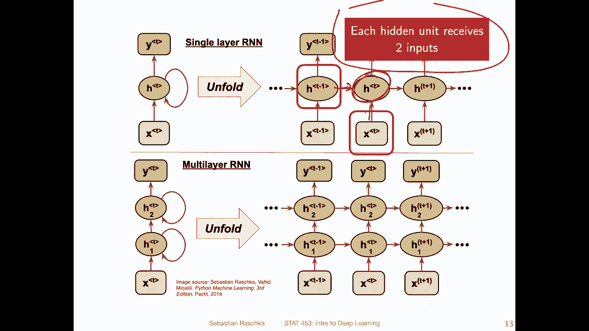
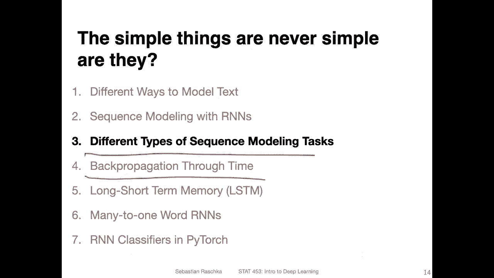

# P127：L15.2- 使用 RNN 进行序列建模 - ShowMeAI - BV1ub4y127jj

Allright， let's now talk about how we can modify multi layer perceptrons to capture sequence information so in particular we are going to talk about sequence modeling with recurrent neural networks。

So but before we get to that， how can we tell whether our model already uses sequence information。

 so for instance， if you think of logistic regression or multilay perceptrons。

 do these types of models actually use sequence information？

So the answer is no and how can you know I mean， there are two ways or two types of sequence information that might be encoded in our training set。

 One type is across the training example access and the other type is across the feature axis so maybe to illustrate that let's revisit the IIS data and now talking about IIS is a little bit boring。

 but I think it's a nice simple data set to illustrate these types of problems。So in Iris。

 what we had we had， let's call it setal length。S width。Paal length and petal width。

 So we have this tabular data set。And we have。The training example like 1，2，3，4， up to 150。No。

When you have this data set。And。So that let's say this is your data set and you split it into a training set and a test set。

And then。You train the model on this training set。 Its call it train。Test。You can shuffle， actually。

All the records in the test set。So you assume， of course， also， this is shuffled because you want。

before you split in iris usually you have the 51st floor are sattoa。

 the second 50 R rea and the third 50 R versica， so let's assume you split them in a way that they are equally distributed。

Now， in the training and test set。 But now， given the test set。

 you can actually shuffle all the records in the test set。

 And when you evaluate your model on the test set， you should still get the same performance。

 So this is kind of like a way of saying the model doesn't really use any sequence information。

 It regards the considers the data as so-called I I D。 I I D means。

That the data is independent and identically distributed。 So this means that each training record。

Is independent of each other。 So it has been sampled independently。

 And also it's from the same distribution。 So distribution of flowers or ir flowers so。

How to tell whether your model uses sequence information across the training access is really by。

 let's say。Doing this thought experiment of shuffling the test set。 And you can， of course， yeah。

 probably tell that whether you shuffle the test set or not。

The performance of the model should be exactly the same on the test。

 if you use multilay perceptrons or logistic regression。

Another type of sequence information might be encoded in the features， right so。

The order here of the fions。So what you can also think about is if what happens if you swap columns。

 So let's say you use this this original ir data set with these columns here。

Then you train the model on this dataset， and then you test it。 Let's say you get 90% accuracy。Now。

 let's say just out of fun， you are swapping these two columns here。

 like a sample length and pedal width。 Now in your modified data set。

 you have let's say petal width here and sample length here。And then again。

 you split this the same way into training and test like you did before using the same records for each data set。

Now， if you train the model and test it， you should get exactly the same 90% accuracy。

 You can try this in practice you will find the model performance should be exactly the same。

 and this is because let's say a multilay perceptrons and logistic regression。

They don't use sequence information。And across the features。

 they regard the features as independent here。 So in that way。

 they don't have to occur in a certain order。 And if the features occur in a certain order。

 this information is ignored。This is because， I mean。

 you can simply test this by swapping columns and then training the model on the dataset set with the swap columns and testing it on a dataset set with swap columns。

 and you will find there is no difference。

This can be a problem though， when you think back of our back of words model。

So the back of words model had this vocabulary。And it essentially gets rid of the word order in each training example in the feature vector。

 So if you think of。An example here where I have written down just a spontaneous sentence saying the movie my friend has not seen is good。

This is， of course， different than the movie my friend has seen is not good。

So two different meanings， so。First meaning is in the first sentence that the friend has not seen a movie which is good。

 And the second one， it has seen the friend has seen the movie， but the movie is not good。

 So here we have a good movie。 and here we have a not。 let's say。A bad movie。

 So two different sentences。 But if we would use the back of words model where we have the text as the word frequency。

This would get lost， because both。Both sentences would result in the exactly same feature vector。

So in this case， we have this。Between in the inputs here and the features。

 we have this ordering information that it really depends on。3 depends on which order words occur。

 So not seen。Is very different from。Not good。 Like the， the ordering really matters here。So。

 and recurrent neural networks can help us capture this ordering information。

Yeah and yeah some examples of sequence data， for example， text classification。

 which is something we will be focusing on in this lecture。

 especially at the end when I show you a pyarch example。

 So here in the text data set you can think of each so the time dimension over the words So you have text。

 let's say T1 T2 like it is a little confusing because it's T for time let's say document T1 document D2 and each document is a text So you have the。

Time dimension over the words， and then you have also had different training examples。

 so each document would be one training example for example。And yeah。

 also something like speech recognition there you have a sequence of sounds or language translation。

 which translates from one sequence into another sequence。There's also yeah stock market prediction。

 which is a common and popular problem。 So in stock market prediction。

 you can think of maybe each each stock at a data point as a training example。

 So you have stock  one， stock2 and then you have the prices or you have a feature vector。

 let's say a feature vector。Could be the price， but it could also be the sentiment or some news information。

 some， some type of feature vector。 It's called F1。F2， F3。one。To。3。

 so you have a feature vector for each time step right here， the time dimension。Would be， let's say。

The time of the day or something。Or the date day itself or the month or something like that。

 So the time dimension would be here really like literally time whereas in text data。

 the time dimension would be just the order of the words So time using time is a little bit loose so we can also just more think of it as as sequence。

Another example here would be DNA or sequence modeling。

 so instead of just thinking of text and words you can also think of a DNA sequence so here it's by character。

For example。

Alright， so these are just a few examples。 Now， let's get to the part where we actually talk about how an R and N looks like。

 So previously， we worked with so called。Feed forward neural networks。So， our。哦好吧。

Milaier perceptrons or conversion networks， logistic regression。

 they were all cases of feet forward neural networks， so we had usually an input vector。

 feature vector x， then some in a multiai perceptron case or conversion case。

 some hidden layers and then outputs。So now in the recurrent neural network setup up。

 that's why it's called recurrent。 we have this recurrent edge。

So what's new here is we have a time step T and we get a feature vector at a time step T。

 give it to the hidden state， and then it results in an output at time step T but。

In addition to that， instead of for this hidden layer only receiving the input here。

 but it additionally is receives， it's also receiving the input。From the previous time steps。

 for example， t minus1 and so forth。 So it's also youre receiving previous information from previous time steps。

So it's maybe a little bit more clear to show it like this。

 And this is also how it's usually implemented。 It's the unfolded state of this single layer recurrent neural network I was showing you on the previous slide。

 So this is again what I showed you on the previous slide and we have this recurrent edge and we can actually unroll this。

Network， so if we have a sequence。Let's say consisting of three time steps。

 then we can enroll it like this。So given a time step T。Let's focus。 Yeah。

 let's focus on this timecept T in the center。So it receives the feature vector at time T。

Which results in the hidden state， and this results in the output。 But in addition to that。

 this time step also receives。The input from the previous layer。not layer。

 sorry from the previous time step。You can see there is this time connection there are now two inputs。

 One input is from the sequence input from the X。 This is our feature vector here。At time step T。

And this is the。Hidden。State。Of the previous。Time step。Which is some T -1。

So here this allows the network being aware of the order of the sequence， right？And then this。

 this one here is passed then in the next step to t plus 1 and so forth。

So here on the right hand side， also both， both they are。

Equivalent so same network is just a different way of showing the network。

 this is just showing the compact notation with this recurrent edge。

 but in practice usually we use the unfolded version。

 the right hand side it's just a different way of showing it and that's also how we would implement it in code。

So。Here。😔，This was showing you in the previous slide a single layer recurrent neural network。

 but of course， we can also extend this concept to multi layer recurrent neural networks。

 I will also show you some examplesna and code。 So here we have now two hidden layers。

So the same concept applies that for each hidden layer， we have this recurrent edge here。

 So when we unfold it again。You can see this one here is receiving now the input from its previous hidden layer in the same time step and also the input from the same layer from t -1。

Yeah， and this is the general setup of how a recurrent neural network looks like。

Yeah， so just to emphasize again， each hidden unit receives two inputs。 So if we focus on this unit。

 it receives an input from here and from here。

Alright， so this is the general setup of how a recurrent neural network looks like and in the next video I want to show you also that we can use this architecture for different types of sequence modeling tasks and then after that video I will show you how the back propagation algorithm works for this type of model。

