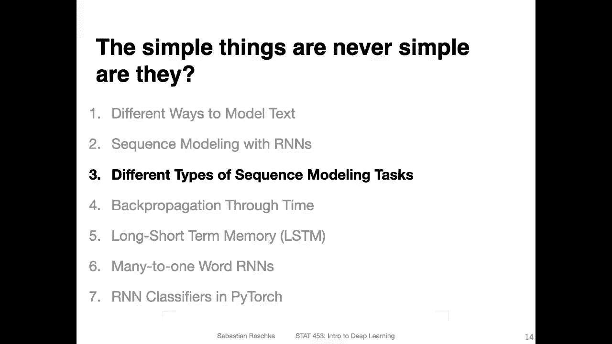
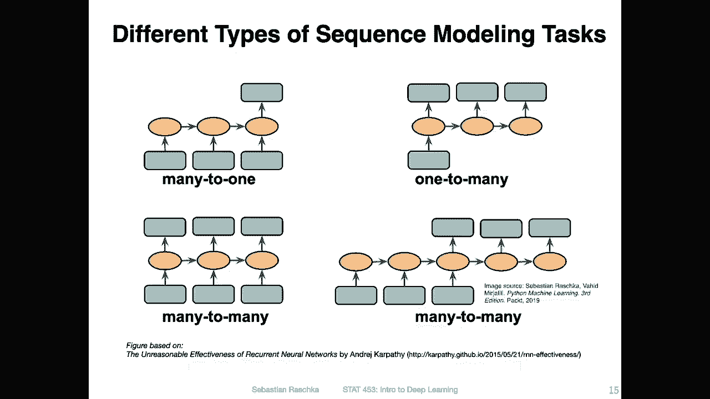
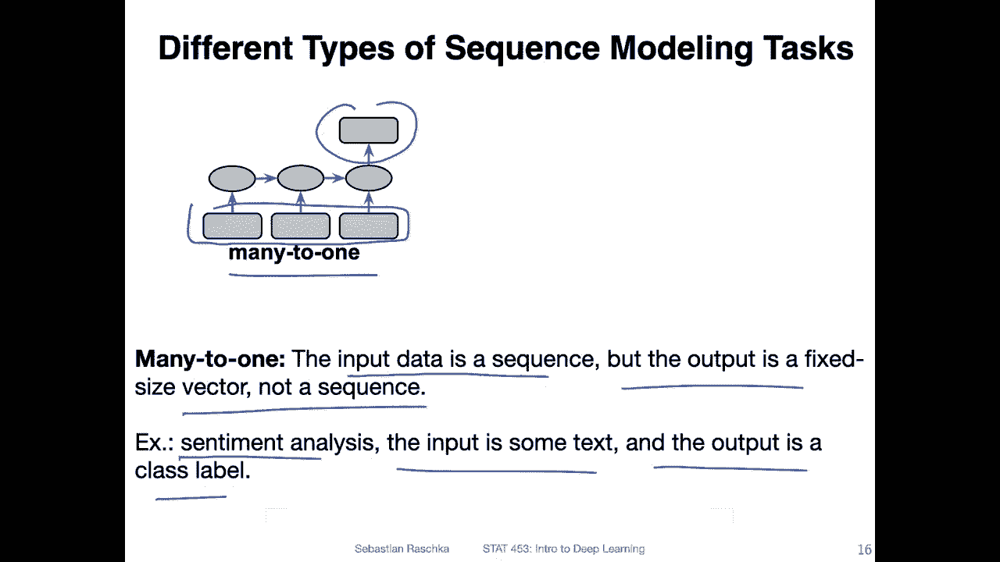
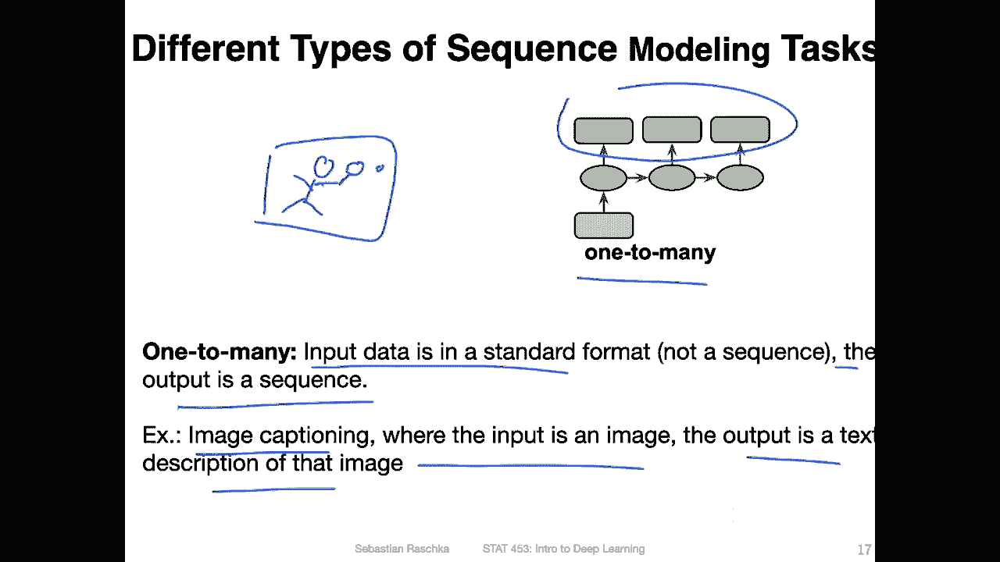
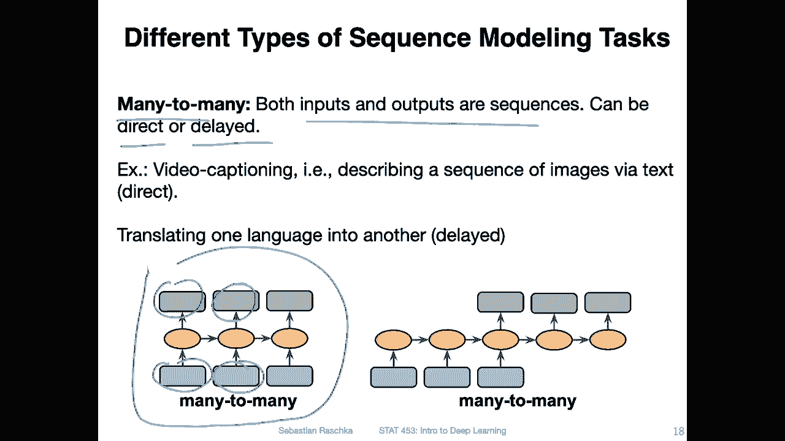
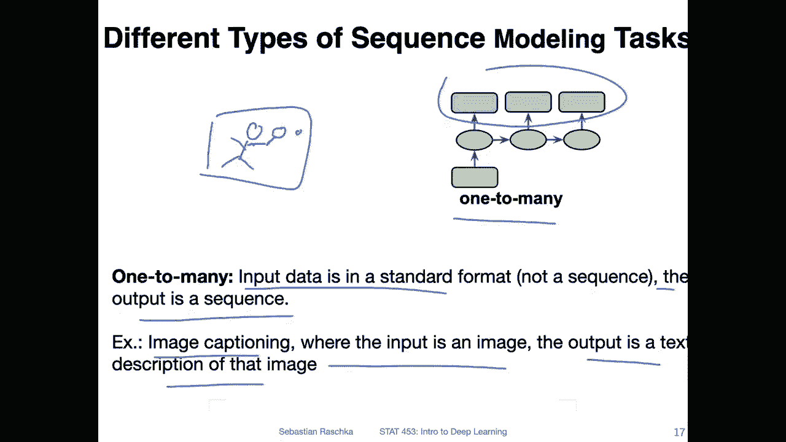
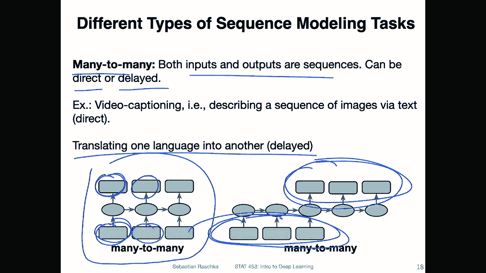
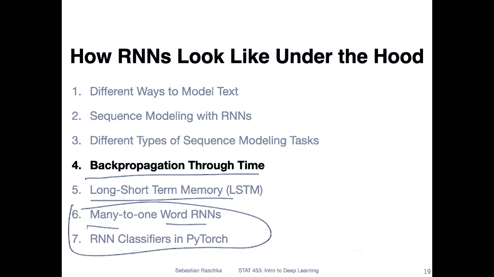
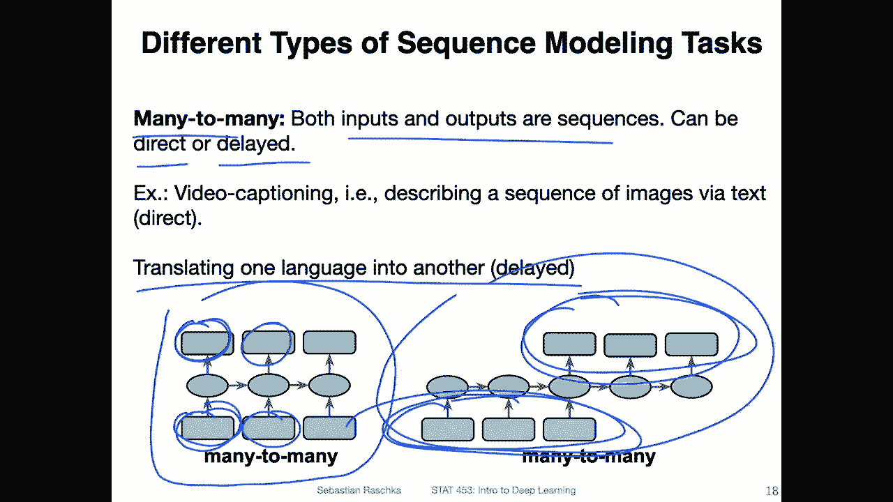
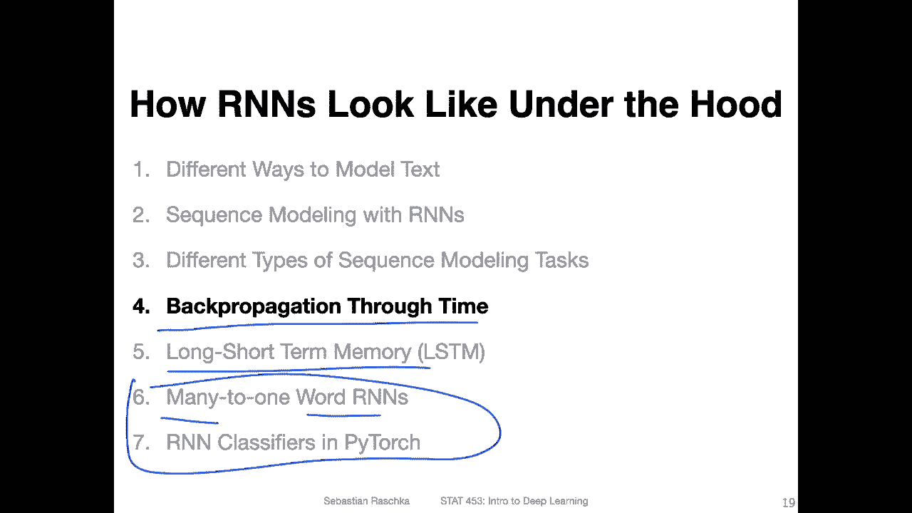

# 【双语字幕+资料下载】威斯康星 STAT453 ｜ 深度学习和生成模型导论(2021最新·完整版) - P128：L15.3- 不同类型的序列建模任务 - ShowMeAI - BV1ub4y127jj

Yeah， so in the previous video I showed you the big picture overview of how a recurrent neural network looks like。

 and now I want to show you that we can use this architecture for different types of sequence modeling tasks。

So on this slide I have an overview of the four common sequence modeling tasks。

 and I will walk through them step by step in the next couple of slides。

So starting with this many to one setting， that is when we have multiple inputs and one output。

 So the input data is a sequence， but the output is a fixed size vector or value， not a sequence。

 one example would be sentiment analysis where the input could be some text and the output could be a class label。

 whether the text is yeah positive or negative in terms of the sentiment， for instance。

 if you think back of the movie review example that I mentioned earlier。

 So each input could be a written review and the output could be whether the review thinks the movie is positive or negative。

Another one would be one to many， so this is another type of sequence modeling task where you could I mean。

 this is a little bit more beyond just standard R andNs。

 It's more like something that you could use together with CN andNs。

 so it's also of course possible to combine both networks。So here。

The input data would be standard input。 So， for example， an image。

 and the output would be a sequence。 And one example would be image captioning where here the input is。

 let's say an image of something。 and then the output is the text description matching that image。

 for instance， if you have a picture of someone who's playing tennis。 you can have a。Let's say。

An image like that。 And as a person。With。😔，Tennis racket or something like that。

 And the description based on that image could be the sequence of text。

 saying a person playing tennis or something like that。

Another type of task is many to many， and there are actually two flavors of that。

 So here in general in the many to many setup， the inputs and the outputs are sequences and。

It could be a direct or a delayed set up here。 So on the left hand side。

 this is like a direct one where we have an input here and an output there。

And then for the next element in the sequence and input and an output and so forth。

 and this could be， for instance， a video captioning。 So for instance。

 if you have a video which consists of multiple frames where each frame is an image。

 So if I go back one time。 So each frame would be a one to many task， but when you think of a video。

 you have multiple of these frames， it would be then generating a description for each input。

And a delayed task would be， for example， translating one language into another language。

 So you could have a sentence in English and then you， let's say， translated to German。So here。

 this would not be a good case for a direct setup because。You don't want to translate each word。

You don't want to translate the sentence word by word right because usually if you think of like just taking a dictionary and translating word to word from one language and the other。

 it usually doesn't give you very readable results because it's more complicated than that because different languages have different grammar rules so you can't just translate word by word。

 you have to first read the whole sentence and then you can generate the translation。

Alright， so this was just a quick overview of the different sequence modeling tasks in the next video we will take a look at back propagation through time。

 That is how we learn the parameters in the recurrent neural network then we will yeah talk about an improvement of the standard recurrent neural network setup and then we will take a look at examples here in these examples。

will be many to one examples using word R andNs where we will train R andN classifier and yeah later。

 later in this class Im planning to also have something on generating text。

 maybe we have to see how much time we have maybe also language translation。

Right right， so next let's talk about Beck propagation through time。

