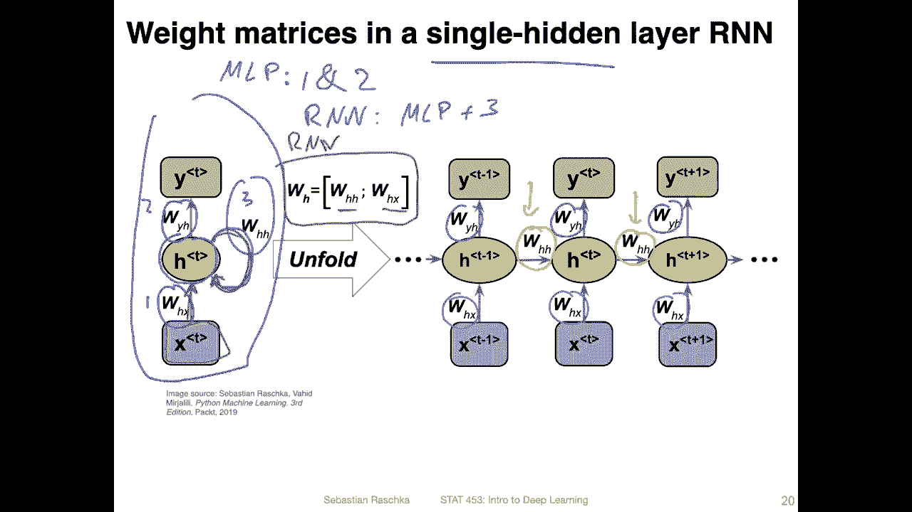
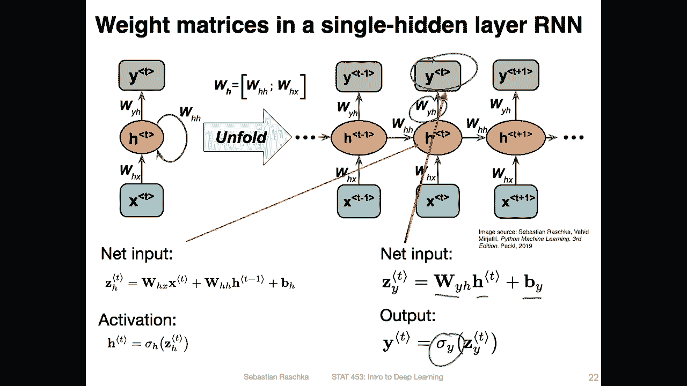
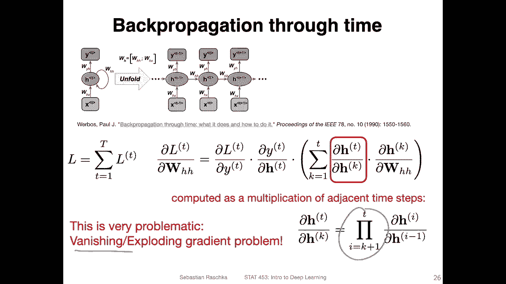
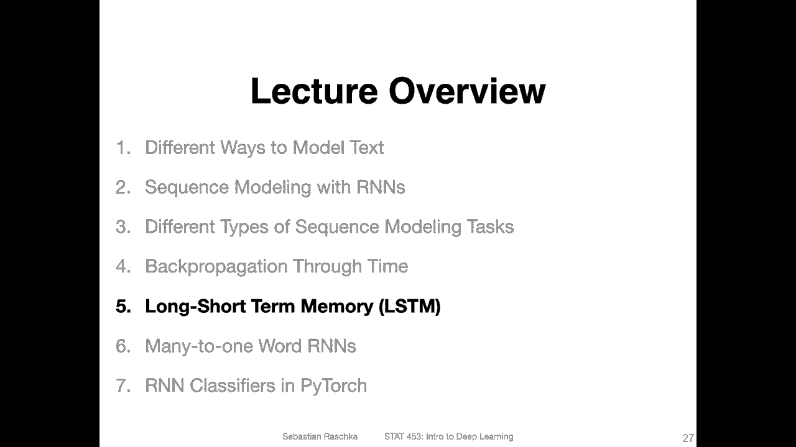

# 【双语字幕+资料下载】威斯康星 STAT453 ｜ 深度学习和生成模型导论(2021最新·完整版) - P129：L15.4- 时间反向传播概述 - ShowMeAI - BV1ub4y127jj

All right， let's now take a brief look under the hood of a recurrent neural network。

 So here we are going to talk about be propagation through time。

 This is essentially the be propagation algorithm we have seen earlier。

Except that we now take a look at how it might work if we have this time dimension and also don't worry。

 I won't ask any detailed questions about that in the quiz because yeah this is a complicated topic and here we are only really briefly looking at it so you don't have to know the details here it's just like to illustrate briefly that back propagation also applies to recurrent neural networks。

So here I'm showing a figure that is similar or looks similar to what I've shown you before in an earlier video。

 So here we have a recurrent neural network with a single hidden layer。On the left hand side。

 this is the compact notation where we only see。The input and the output here。

 and then we have the hidden layer here with this recurrent edge。However， compared to before。

 what's different now is that I have added these weight matrices that we use here。

 So there are three weight matrices， let's say1，2， and 3。That's let'srated like this， one，2 and3。

What we can see here is that one matrix connects the input to the hidden layer。

 and then there's one mate matrix connecting the hidden layer to the output layer。

These are weight matrices that you would find。 So one and two。

 they would you would find them in a regular multi layerer。Perceptron。However， now in the。Are an N。

We have。3， we have basically all the ones from the multicione plus this weight matrix3 here。

 which is the one from the previous hidden state。 So to summarize in a R and N here， we have two。

Matrices for the hidden layer， One is connecting。The input here。So， the input。

To the hidden there and the other one is connecting the previous hidden there to the current hidden there。

 which is this H H here。So on the right hand side is the unfolded version。

 and you can see so that we have。Oh， you can see also that we are reusing these matrices so at each time step we use the same matrix here for the input connected to the hidden state。

 and then we also use the same matrices here for each on time step so the same matrix connecting the hidden state to the next hidden state。

And then， we also have。This year。So what's really new compared to a multi layer percept is that we have。

These in green。 So this is new， and this is new。 These are weight matrices that we did not have in the multi layerer perceptron before。

So how do we compute？Now， the hidden state， I mean。

This is essentially very similar to computing the regular input， except that we have no。2， yeah。

 weight matrices and two inputs， so。Let's consider this case when we compute the net input for this hidden state here。

At time step T。So what we do is we like before when we computed the net input in a multiivatorceptron。

 we multiply this weight matrix here。With this input here。And that gives us the hidden state。

We also may write this differently。Like this， right。

 So we talked about this before in the linear algebra lecture。

 I don't know why I've written this in a different order， but it's the same thing。嗯。Yeah， and then。

This is one input， The other one is H H。From the previous hidden state， t -1， so。

Maybe to use different colors。This one is， of course。

 this one for So this is an net input for this hidden layer， and then。

This part is computing this part。And this part here is。Computing this part。

And then we add Osoya Allabias here。So the bias is for this hidden state here。Alright。

 so this is how it。Looks like how we compute the net input and then to compute the activation。

 we would just use an activation function like 10 H or the sigmoid or Relu function。And yeah。

 this is how we compute the net input now。How do we compute the net input for the output。

 This is exactly like what we do for a multi layer perceptron。 So we have one weight matrix here。

 the hidden state and then the bias。 And then again， we can use a activation function， for example。

Softm activation or the sigoid activation。 if we have a binary output or yeah or just a linear layer。

 if it's a regression output and so forth。 So here this is really the same that we would do for a Moperceptron。

Now what about the loss So yeah it really depends on what type of task or sequence modeling task we talk about。

 So if you only want to predict one label for a given text。

 you technically don't need these losses here。 you only need a loss。

A single loss from the last one here。 Some people argue it might be good though。

 to keep the intermediate losses as well。 it helps training the earlier layers。

 So I think I mean depending on who you ask some people keep these losses some don't if you when you compute also many to one sequencing problem and it is different though if you have many too many then you want to have multiple losses so let's take a and look at just the general case。

 so you can have different losses。Here， a loss for each time step and when you then want to compute the overall loss。

 you can just sum them up so that would be the overall loss。Yeah。

 so this would be just looking at the loss。 by the way。

 theres a paper on back propagation through time， what it does and how to do it。

 So here we are really just briefly scratching the surface。

 So this might be some resource to consult。And also there are probably many different tutorials on the internet also for doing that in detail for this class。

 given that we have several generative modeling topics still to discuss on here we are not going to spend too much time on these details。

But yet， soonnana to highlight one of the issues that are。Apparently。

 when we use spec propagation through time， let's just briefly focus on how the gradient of a particular loss at time step T is computed with respect to this。

W H H hidden matrix。 So here， let's assume we have loss。T at that layer here。

 So what will happen is that we do the back propagation， right。

 so we would compute the partial derivative root or gradient of this loss at the time step with respect to。

Wei。😔，T， so with respect to this one。 and then we would compute the gradient of。W。😔。

Tea with respect to。H。😔，T， so with respect to that one。 So here we covered this part。 But then yeah。

 so this is essentially what we would do for a regular multilay perceptron。

But then on on top of that， we have。This term here， which。

Is essentially the through time step where we have time steps from K1 to T。

 So from up to the very beginning。 So we have。Partial the reservoir gradient of H T with respect to the one in the very beginning。

 So summing them up。

And。Those themselves， we won't go into too much detail here， but those themselves are a product here。

 and the product is essentially what could cause problems like vanishing or exploding gradient problems。

 so don't worry about the details here too much。 so really the I would say the main point here is not really doing this by hand。

 because usually we have autograd implemented in Pywat and stuff like that。

 So we would not have to implement these types of things by hand。

But this highlights the main issue that if we have a lot of multiplications。

 we can have these vanishing or exploding gradient problems if we have very large or very small numbers that we multiply multiple times。

 So in the next video I will talk about the so-called long， shorter memory。

 which is one approach to yeah to mitigating this exploding or vanishing gradient problems。

