# P12：深度学习新闻 #1，2021 年 1 月 27 日 - ShowMeAI - BV1ub4y127jj

Yeah， hi everyone。 I decided to make a short bonus video stuff in the news。

 interesting things related to deep learning。 So here I'm just briefly talking about cool things I discovered in the news this week related to deep learning。

 And I think it's just fun to yeah talk about the recent developments in deep learning just to stay up to date with things。

 So I'm planning to release such a video every week if I have time。

 So it's also on the optional So you don't have to watch them So it's something just watch it if you're interested in if not don't worry about it。

 It's just like some fun additional video content for this class。 So then yeah。

 let me get started and let me tell you what happened in the world of deep learning this week。Yeah。

 let's start with a cool application of deep learning for CoVD 19 resource needs。

 predictions from a series of x rays。So this was a project by Facebook AI research in collaboration with medical doctors at NY U。

 And it's always cool to involve， yeah， domain experts。 I think that's super important。

 as I mentioned in the。😊，Lects， it's always a good idea to consult people who actually have some expertise in the data that you're working with。

 especially if it's an important application， like a medical application。 So in this case。

 the researchers trained three models to predict， yeah。

 patient deterioration and to help predict the resource requirements like oxygen， so。

Here in the first model， they predicted the deterioration of the patient from only one x ray image that did the same thing。

 the same prediction task now from also a series of x rays。

And the third model was predicting the oxygen supply needed。 Yeah。

 for helping a patient that was also based on a single x ray。 So of coursea。

 it's usually helpful to have multiple x rays that can also then yeah boost the performance if you have a sequence of x rays and you can yeah。

Tickle this as a time serious problem。 However， these models also work if only one single x ray is available。

So how they approached this modeling task was that they pretrained the deep neural network on a large noncoviId chest X- ray database。

 so they used a general Xray database， Why did they do that。

 That's because they had a larger dataset available this way。

 Because there are only limited numbers of X rays from COVID patients at this point。

So here they used selfsupvised learning。 remember from the lecture selfsvised learning is this new trend where you pretrain a model on a socalled pretext task and then you find unit to your targeted data set。

 So here they did the fine tuning based on a smaller CoVID-19 x- ray data set where they had 27000 xrays from 5000 patients。

And what was interesting is that yeah， these methods they developed outperformed human experts on some of the measures。

 So of course it's yeah not a good idea probably to replace humans。

 but I think developing these systems can be really useful to help humans because yeah。

 everyone is stretched very thin these days， especially do the large amount of patients at hospitals right now。

 So maybe。Yeah， the doctor's task can be done more effectively in the combination with deep learning。

 especially for example， if you think of medical staff that is maybe a little bit tired having a deep learning system taking also yeah a second look at these images X race could maybe help yeah avoid making mistakes。

So you can find the full paper here on archive and they also uploaded the pretrain models on GitHub if someone is interested。

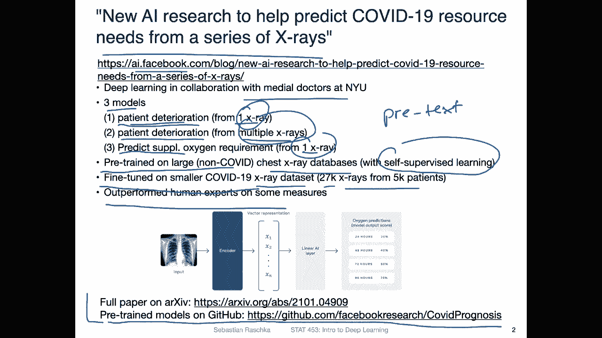

Yeah， regarding CoVd 19 research， so on archive， which is a preprint setup。

There's a large amount of thousands of papers or manuscripts， preprints uploaded regarding Covid-19。

 So this is a general preprint server for machine learning we have a lot of papers on this server。

 so I help moderating the machine learning categories and every day there are about 140 new papers about yeah deep learning and machine learning so it's like a huge amount of papers I think there are now in total like 140 million papers across different research domains。

In any case， you can use the search function to also search for。Yeah has specific research。

 And here I。Yeah try to search a keyword combination to also yeah bring up more Covid-19 related research with deep learning So what I showed you here in the previous sni was pretty cool but of course it's not the only approach using deep learning for CoVID prediction from chest x-rays So here using these search terms you can find many more works in this area。

 but yeah also you have to take this a little bit with a grain of salt because not of all of these papers have undergone peer review。

 So some of the findings maybe spurious or maybe less rigorous。

 so always take archive papers with a grain of salt。

 I will post a link so you can access these papers if you are interested in that， for example。

 for the context of your class projects。

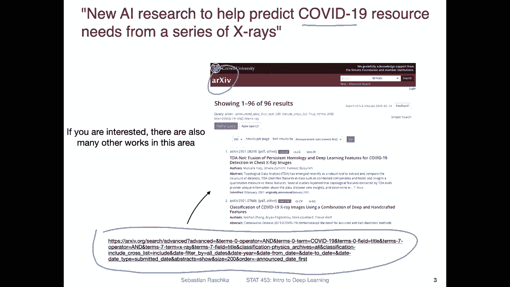

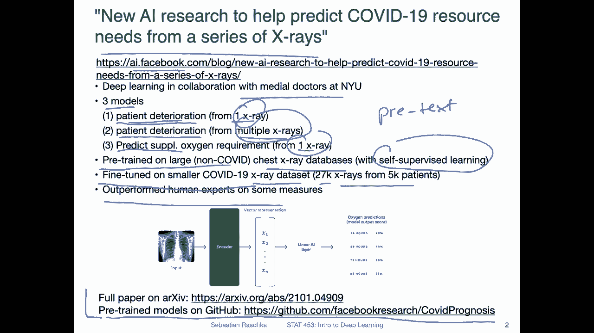

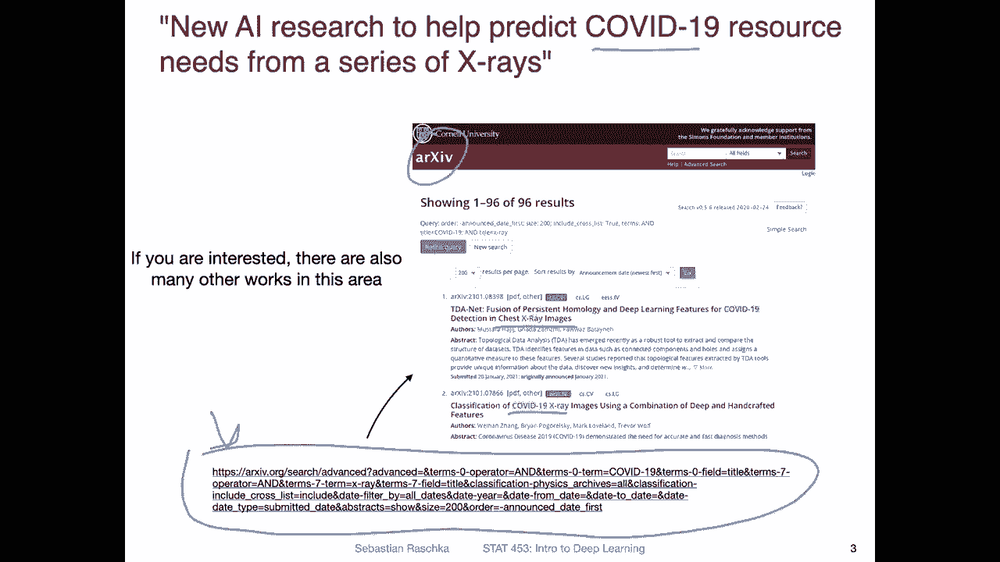

Yeah， there was another interesting research project related to Covid 19 was the learning of the language of viral evolution and escape。

 So this was an article where the researchers described the training of a bidirectional LSTM。

 So an LS LSTM stands for。Long。😔，Short term memory。It's a recurrent neural network of flavor。

 and it's a particular， yeah， you can think of it as a particular version of the R and N。

 and we will talk also about that more later in this course。

So here they trained a bidirectional LSDM bidirectional just means that they process a sequence from both ends from beginning to end and from the end to the beginning。

 and it's a language model。 So here they treat the amino acid sequence corresponding to a virus。

They treat this as a language model like text， for example。

 and they also draw some analogies from language modeling， for example。

 they consider the context of being grammatically correct as the biologically being correct。

 like is this like a correct sequence， a correct aminosic sequence， is it a plausible one。

And then also considering its semantic meaning， so here in context of a language。

 the semantic meaning would be at the meaning of the sentence here it's whether yeah the sequence causes immune responses or not。

And yeah， they got a pretty good performance。 They have a point85 A U。 A U C stands for。A are。

Another curve。Which is rather ambiguous because what curve do we mean here。

 if there's no context if you see something like Auc see in a paper。

 it usually means receiver a operating characteristic area under the curve。 So R O。

 It's a measure of false positive and true positive rates。 if you shift the prediction threshold。

 but it's maybe too much detail at this point。 So what's important is that a 0。5 is random。 So 0。

5 is a random prediction and 1。0 is a perfect model。

 So in this way they are yeah closer to a really good model than to a random or bad predictor。

 So yeah， that is another interesting Covid-19 paper moving on to the more like business side of AI or deep learning there was also something I found really interesting that interesting。

 but it was like quite a headline。 So there's like a project called human AI。

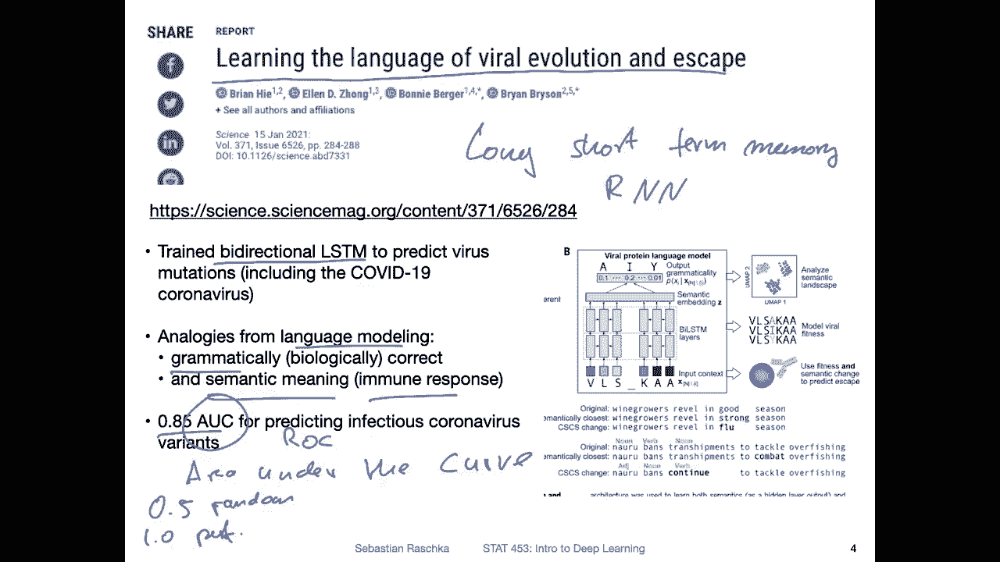

That just got a 3。2 million of funding to build a personal intelligence platform。

 So here that sounds very interesting。 So what it is about is that they are building an individual personalI that is secured by a blockchain to retain and recall information。

 so you have two buzzwords in here。 So you have the eye and blockchain。

So this is building a knowledge base in a way it sounds like it。

 but based on an individual's information。 so you can maybe also think of it as a second brain zone。

They say it's made possible through a convergence of neuroscience。

 natural language processing and blockchain to deliver seamless in the moment。

 recall G3 is built on the memories of the public Internet， While Luther。

 thats their system is built on the memories of your private self。

 So it sounds like yeah they are attempting to build a second brain or。

Digital copy of your brain that it kind of also reminded me of。

Of this movie seen here or actually TV show scene， it might be also fun to let me know if you know what the name of the TV show is as a little side quiz here。

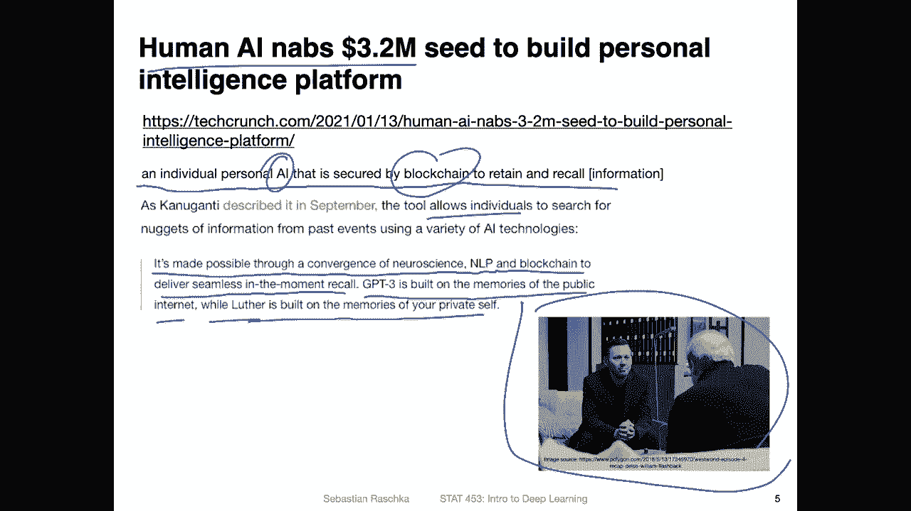

Anyways， moving on so regarding yeah access to data to make a transition here。

 there is also a cool initiative by Twitter。 So Twitter is opening up its full tweet archive to academic researchers for free。

 So they have been yeah projects before academic projects by people used Twitter data。

 but as I as far as I know it was a little bit tedious。

To access the data through the API because there were some limitations now yeah they say they want to make this easier and to give more access so they say for example。

 they are giving applicants approved applicants a higher monthly tweet volume cap of 10 million tweets so per month which is 20 times higher than what it was before。

And yeah， they also a allow more precise filtering to help researchers pinpoint tweets and other relevant。

Data to what they are studying， basically。 So in that way。

 of making research based on Twitter a little bit more convenient。 So what can you do。

 what what is Twitter data useful for， Why is， Why is that actually cool？

 So they are actually quite some projects involving social media data that are quite useful beyond just their simple sentiment analysis。

 So here I saw another news article where they are using a artificial intelligence to manage extreme weather events。

 So in this research。

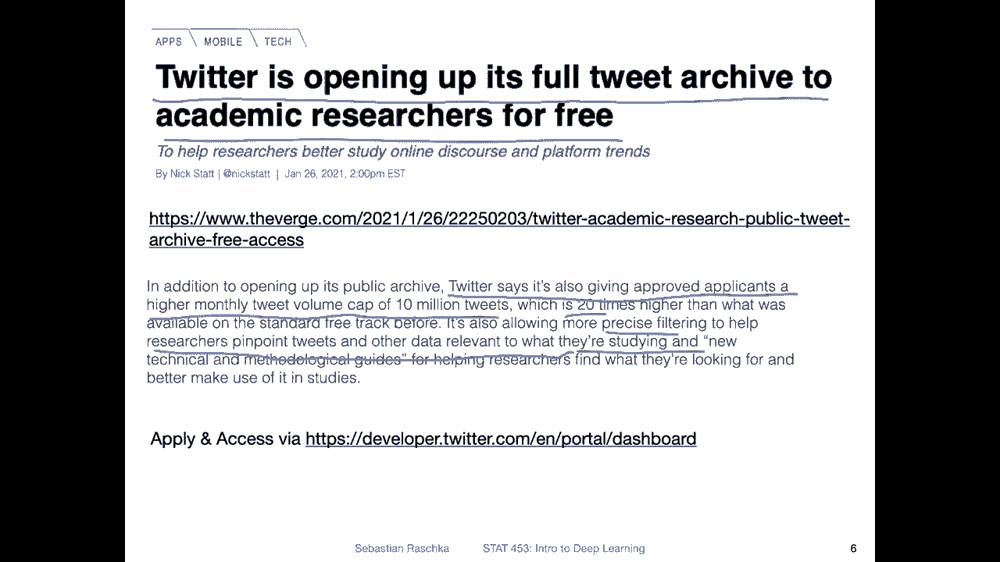

They use social media contributions， for example， tweets to more usefully manage crises。

 so they developed a noise reduction。Mechanism to filter for valuable information from social media to better SS trouble spots where there are。

 for example， floods or snowstorms and so forth。So。Yeah， that was another interesting。

Application of deep learning where information can be efficiently accessed to， yeah。

Help certain areas where there are problems。

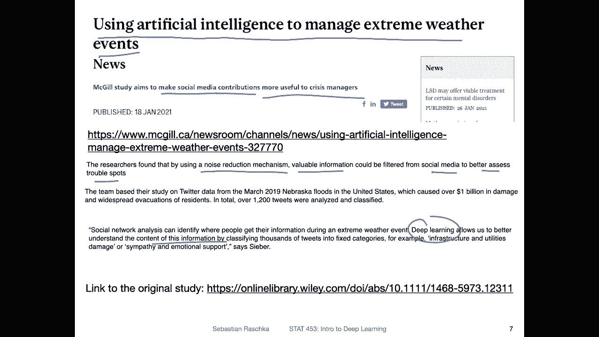

Okay， talking about data sets， large data sets。 So one data set that is very common in the deep learning community very commonly used as a benchmark is the imagenet data set。

 I think it's already， yeah。16，16，15 years old。 It has been released around 2005，2006。

 It's still very popular。 It's a very large data set， about 14 million images。

And it's usually used for evaluating the classification performance of image models like convolutional neural networks or now also visual transformers。

So the problem， though， is that， yeah， the image data set is kind of notorious for mistakes。

 and there are also incomplete labels。 So sometimes you have multiple object in an objects in an image。

 for example。As shown in here， you have a cow here and then a barn and。Some， yeah， I don't know。

 maybe also sky in the background。 So there are multiple things going on。 or actually。

 they call it an ox。 So they are。OhActually， no， it's it's the fence。 I just see it here。

 It's the fence here。 So there are multiple objects in this image。 And if you train a classifier。

 a regular classifier， usually it only gives you the most confident class label as the prediction。

 So if you have a classifier that predicts barn it may be wrong because the image was just labeled with ox here。

and in that way， that。The classifier may be correct， but you are counting it as a misclassification。

 So here in this project， the researchers are relabelling imagenet。

 So they are adding multiple labels to the image here。 So they are using。

Also machine learning to do that because yeah would take a lot of people or resources to look at these 14 million images and yeah to assign the correct labels so they make their life easier by also using deep learning for that so it's kind of like a chicken egg problem。

What comes first， the data or the model the model can then be used for labeling the dataset here what they do is they use a different data。

 They use 1 billion images from Instagram and they train a model called efficient net for for training this model to become a machine annotator to annotate the 14 million images in image net。

 they use crop regions for that So they are cropping different regions of the image So for example as shown here they are cropping the image into smaller regions and then apply a classifier to each of these smaller regions to obtain the class label and then have this multilabel context for each image that is also something I found actually useful and interesting。

Yeah， another project from Facebook AI research here。

 I also also thought that might be a cool application of machine learning and deep learning that has some。

 yeah， use for。The real world， so here。So what Facebook did is they used AI to improve photo descriptions for people who are blind or visually impaired。

 So they developed a smartphone app。That yeah， where you can take a picture and that app can then describe what can be seen in that picture。

 like an audio。Message so this system has been around， I think， for a couple of years。

 but they are just improved to make it more accurate。 So here they trained a resnt model on 3。

5 billion Instagram photos and the corresponding hashtags and they also are combined with a fast R C andN object detector to describe different aspects of this image。

 So for example， here in this example the description is it may be an image of one person standing on or at Machu Piccu。

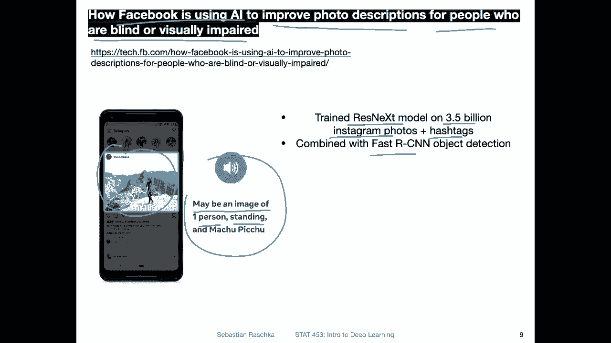

So going back here， this is kind of similar to these crop regions where people have these different crops of the same image and then assign a label here。

 it's a similar approach that you have， for example， person， Machu Piccu and so forth。

 but yeah the addition here is that there's also a text describing this or putting this into context。

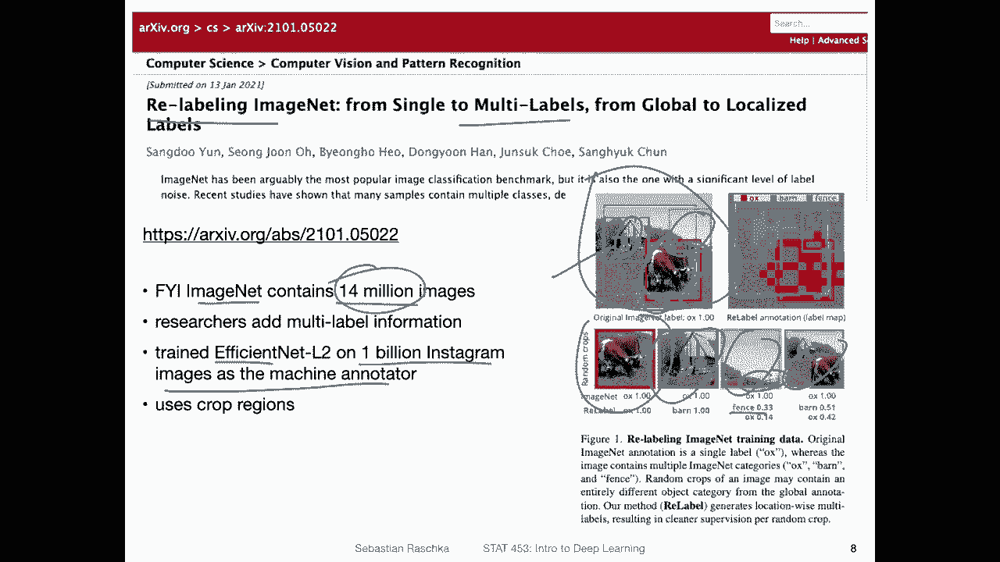

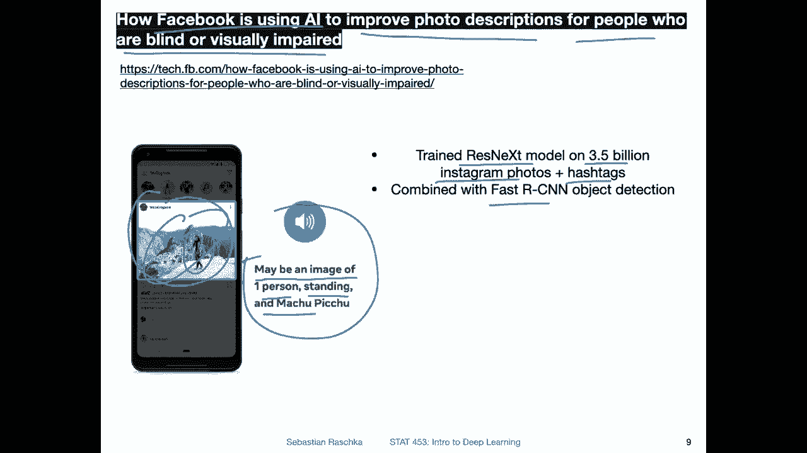