# 【双语字幕+资料下载】威斯康星 STAT453 ｜ 深度学习和生成模型导论(2021最新·完整版) - P130：L15.5- 长短期记忆 - ShowMeAI - BV1ub4y127jj

So in this video， we are going to talk about something called long shorter term memory LSTM。

 which is yeah for modelling long range dependencies in the LSTM cell。

 you can think of it as a modified version of a recurrent neural network。

So that is are particularly helpful for working with longer sequences and really kind of essential to get good performance out of an recurrent in network。

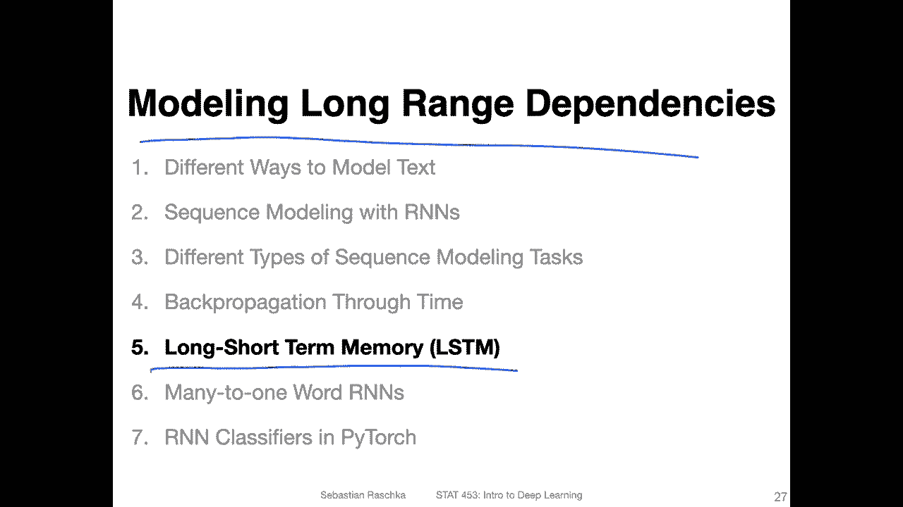

So previously we talked about other solutions to vanishing and gradient vanishing and exploding gradient problems so a long time ago we when we talked about multilay perceptrons。

 we talked about using the relu function instead of sigmoid functions like the 10h or the logistic sigmoid because it can help with mitigating or vanishing gradient problems so。

But even then even if we use a relu function instead sub sigmoid or 10 H。

 we may find that making a multi upperceptron deeper than one or two layers doesn't really work in practice。

 So if you have tried in the homework to have a multiepceptron， like with four or five hidden layers。

 it still didn't work very well。And yeah， that is still because there might be problems with vanishing gradients。

 So another technique that can help a little bit with that is batch normalization。

 So if you have batch normalization， you may find that you can have multiep with maybe three maybe maybe even four layers。

 but it's still it's not great。 in the context of convolutional networks because they are simpler。

 we found that having more layers might work。 So the PG G 16 networks with 16 layers but then going beyond 16 layers。

 even if we have batchnob again doesn't really help。

 So we we had to add another trick called skip connections and these skip connections in residual networks helped then with constructing networks more than let's say 30。

50 or 100 layers。 So there are multiple tricks that we can use to help with the back propagation when we might have vanishing or expodding gradienting problems。

So， but this was usually for the number of layers。 Now in this recurrent neural network setup。

 we also have to consider the time steps right so on the previous hidden states so。

Because here like we've seen in the previous video， there's this product that we compute。

 there might be another level of encountering， vanishing and exploding gradienting problems。

 So there are here three different techniques for dealing with these issues。

 So one is the simplest one is a gradient clipping。

 So that is actually a quite widely used technique also other context。

So this is essentially setting a maximum on minimum cut off value for the gradient。 So for instance。

 we can say never have gradients greater than let's say two or smaller than  two -2 and things like that so we can cut manually the gradient。

So that we don't have very extreme updates。 Another one is called truncated back propagation through time。

 And this is， yeah， just a simple technique for limiting the number of time steps during back propagation。

 So you， when you have long sequence。Let's say a avariine。sequence。Then these all go to the hidden。

Hidden layer and then to the output layer and so forth。 So for forward propagation， you may use。

The whole sequence here。So but then when you back propagate。For the hidden layers。

 you only maybe backproagade through the last 20 time steps or so so you don't back propagate through the whole sequence。

 This is called truncated back propagation through time， and it might work pretty well。 However。

 an even better way for working with longer sequences is the so-called long shorter memory which uses a memory cell for modeling longrange dependencies to avoid vanishing gradientding problems and this goes back to a paper from 1997。

 which was pretty influential proposing this type of memory cell。

 there has been another one called Gra U I will just mention it again maybe at the end of the video。

 which is。A simplified version of that slightly simpler。

But the LSTM is still widely used and both LSTM and GRU are approximately perform approximately similarly well。

 There are sometimes problems where LSTMs perform better， sometimes where GR use perform better。

 So none of the two is universally always better than the other。 It's just like another。

 let's say hyperpara to investigate whether we should use LSTM or GRU cells。 but nonetheless。

 LSTM cells， I think are still more popular than GRU cells are the most widely used R N memory cells。

 I would say。 And in this video， we are going to talk about these LSTM cells。And then also， yeah。

Later， we will also implement this in code using Pytorch。

 So what I'm going to show you in this video may look super complicated。

 if you don't understand it fully don't worry about it too much。 I mean。

 here we are really in this class in general， also for this R N lecture。

 just trying to get a big picture overview， this is still an introductory class。

 So most people find these LSDM cells very complicated。 So if you don't understand it like fully。

Don't worry about it too much if you want to learn about it more。 Yeah。

 you would have to probably spend more time reading these papers and maybe trying to implement it from scratch by yourself。

 So that might be probably taking multiple weeks or a month to really get a good feeling for how that works。

 So you can't expect really like from an overview you have to be an expert immediately so。

I'm trying to say when you see the next couple of slides， don't freak out。

 It looks more complicated than it might really be， but also。If you don't fully understandcend it。

 it's not the awful fault。 It's a complicated topic。

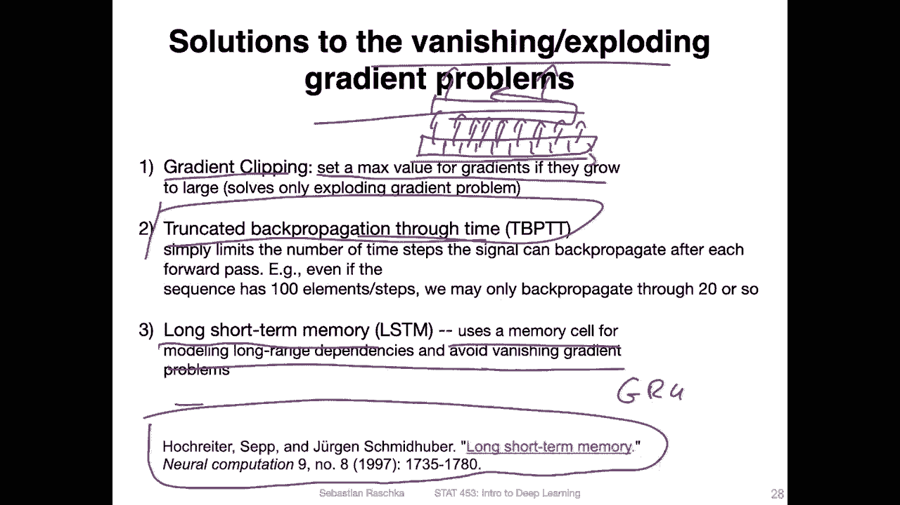

So here is how the LSTM cell looks like。 So there are many， many things going on。

 And in the next couple of slides， I will walk through this now step by step。

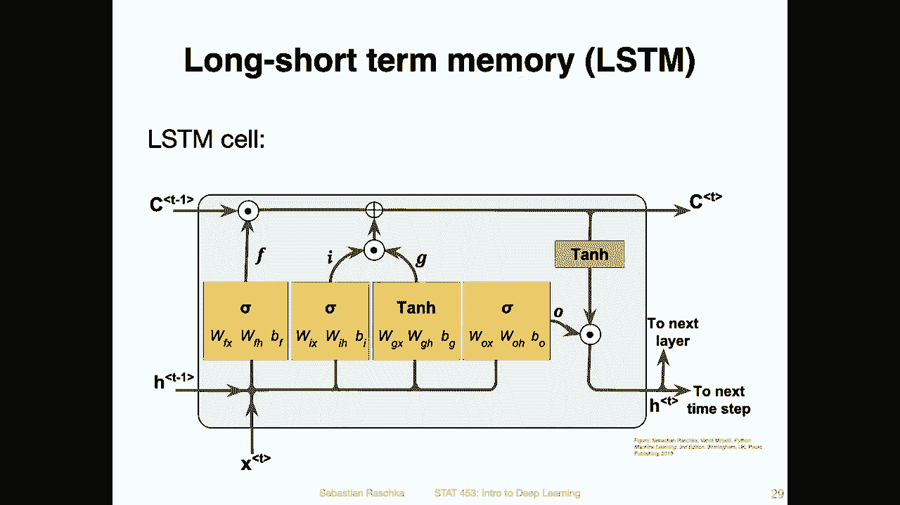

So。Where is this， before I explain all these letters and notations， where is this LTM cell located？

So you would actually put this L stem cell here。In the center。So it would have one。 I mean。

 you would use it for different time steps。 but if we would focus， let's say on this time step here。

 you would put it into the center here。For instead of having the regular hidden state or hidden layer。

 you would insert this NTM here。And if you have a multi layer or an N like that one。

 you would also have or you can have multiple LSDM cells， for instance。

 here you could have two LSDM cells。So how again this connects。 So let me erase this。

 So in blue here。This is。鞋子。Hidden state from the previous time steps， so。If you consider this one。

 this is here this input。 So if we think of。This whole thing。

Ass this red box here on the left lower side， this blue is resembling the input from the previous state。

Then there's something new we have。 That's the cell state。

 I will explain it in the next couple of slides。 So there's a cell state。And then。Here。

 the green one。I should have produced for the cell said something else that's red and black said cell。

And then here in green。That oops。Yeah， see， I will have explanations。 So， yeah， so here。

 this in green one， this will be the output to the next time step。 And then here in pink。

Or purple will be the output to the next hidden layer。

 So you can see this red one really would fit here into this R and N。

 So instead of having just a regular hidden layer， we would now have this， yeah LSTM memory cell。

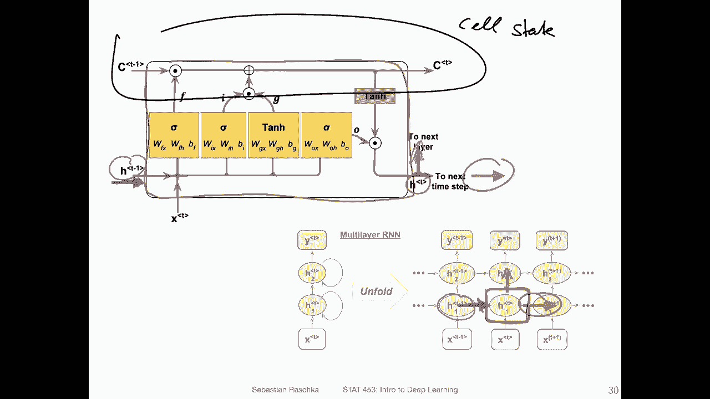

So。Yet， going through things step by step， we have this。Cll state at a previous time step。

 and then we update here in this whole computation。

 the cell state and pass it on to the next time step。 So there's this so called state of the LSDM。

And another thing we have is like I said before， we have the activation from the previous time step。

 So the hidden state from the previous time step。 and we will pass on the。

Actation computed from this memory cell to the next time step。Then， here for the。

Mainly for the memory for the cell state， we have two different operations。So， we have。

Here the element lies multiplication here we have an addition and these sigmas here。

 they represent logistic sigmoid activation functions。

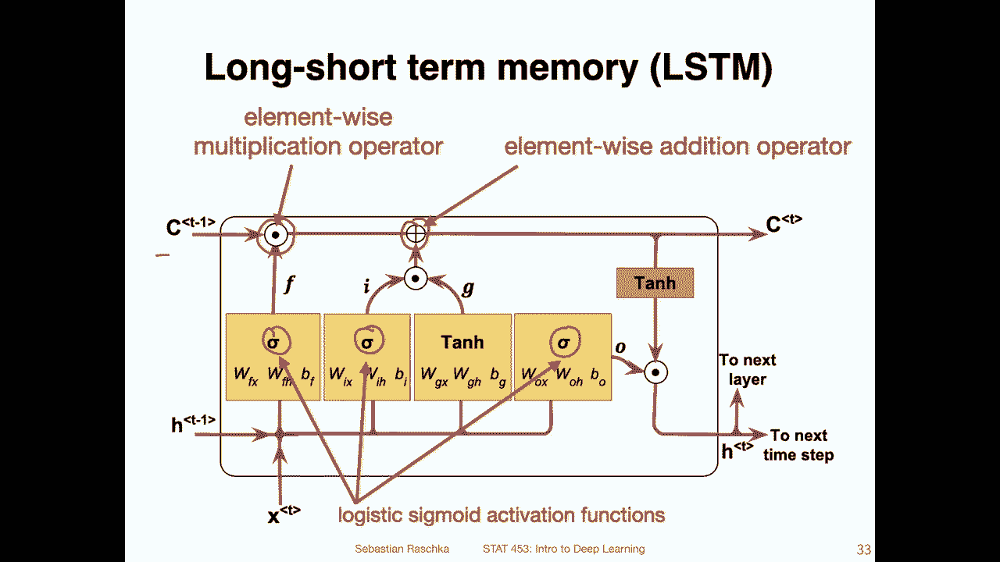

Now here we so there are three different gates， so talking now about the gates。So。

We have this forget gate here。 So it controls essentially which information is remembered and which one is forgotten and it can reset the cell state。

 So here。We receive the input at the current time step and we receive the input from the previous hidden state like an a regular R n layer。

 and then it goes through some computation here。And this one。

This computation is essentially involving two matrices like we had before。

 So we have before we had this matrix H H。Right， and on W。

H X here we are calling it for for get gate instead of H H， let's call it。F， H and。Effs。

And then we have also bias unit， B F。So I just see I have it actually here and this goes through a syigmoid unit。

 and you know that in a sigmoid， the output can be either or is between 0 and1。So if the output is 0。

 for instance。And there's a multiplication here。 element mice multiplication， we can essentially。

Erase the previous cell state。 So here at this time step， the network has the option to forget。

The cell state。 So in terms of not doing anything。From the previous so not including any information from the previous time step。

 or it could learn a one so it could fully use information from the previous time step。

So this is the so called for get gate， so which it's controlling which information is remote and which is forgotten so it can zero out the previous cell state。

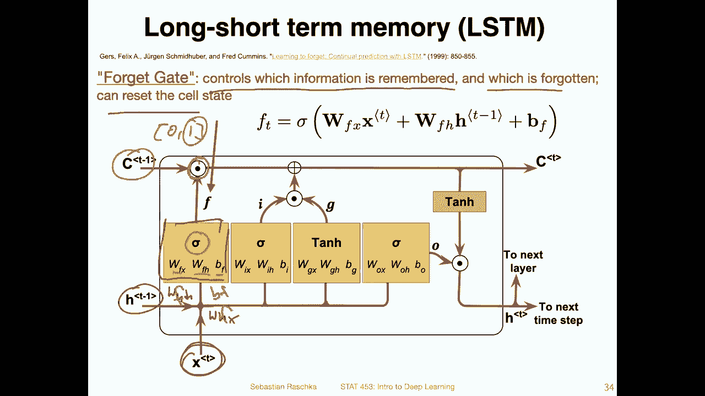

So then there is this input gate。So， here。The forget gate again。Is potentially erasing information。

 And here in the input gate， we are adding no information。 So there are actually two things going on。

There's a sigmoid and a 10 h here。There's an input node and an input gate。

 and they get element wise multiplied。And so this one can be 0 or1。

 and this one can be between minus1 and 1。And the output then can essentially also be between0 and between minus1 and1。

And。This gets added。To the previous cell state， which might be erased through the forget gate or kept。

And each of those， they are really， yeah， just computed like in a regular neural network where we have。

So here we have a plus， of course， So here we have w times x。And here we have this one， actually I。

Not that。That should。嗯。I think it's correct， sorry okay。Yeah， okay。 so this is our setup here。

 So that's how we compute this。 And then the same thing for the input gate。

 we have a logistic sigmoid instead of a 10 H now。And these are the values we compute。

 We multiply them and then add them to the cell state。And yet other this information comes also。

 of course。From the previous cell state and the input here。

Now， just looking at everything together， how we compute。

The output cell state for the next time step。 So again， just to summarize。

 we multiply the previous cell state by this forget gate。 Then we add the product。

Of the input node and the input gate。

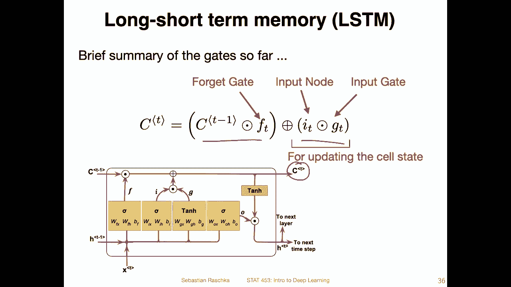

And then we also have a third gate。 that's the output gate。

 that's for updating the values of the hidden units。 So here。Before what we had。

 is this just for the cell state。But now the cell state here also goes through a 10 h。

And then gets multiplied so this can begin between minus1。And1。

And this gets multiplied with this output gate here。

 so the output gate itself is also computed like the previous ones。And。The product of。

This 10H output and this output gate。Goes then to the next time step and then also to the next layer in the neural network。

 So with that， I mean。

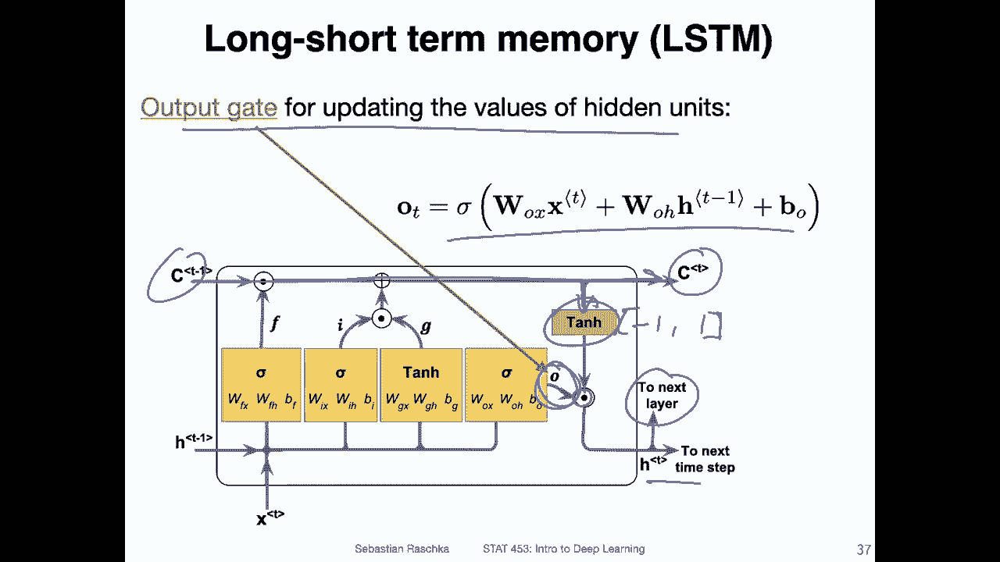

If I go back， up。It goes。Go here。我。Yeah， okay。 so it goes either here and here if we talk about this red one。

So this would be to the next layer here。

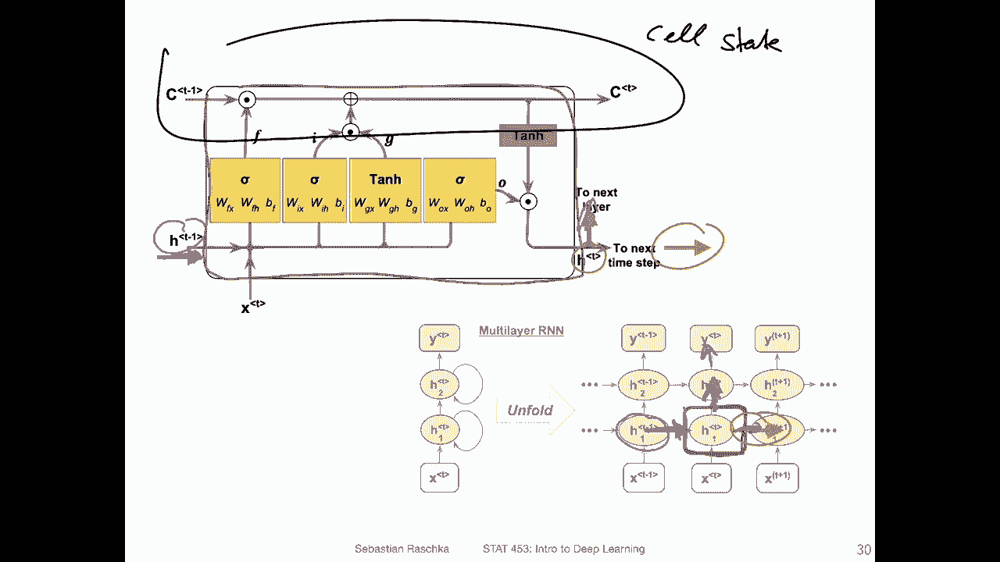

And this one would be to the next hidden state。

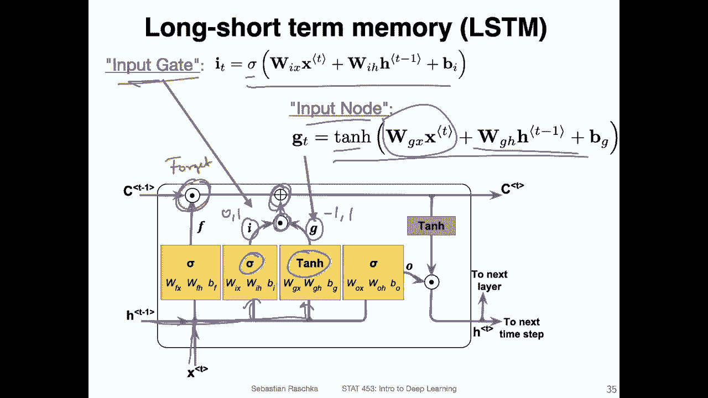

Forward again。Alright， so this is what we had， so that's the output gate。

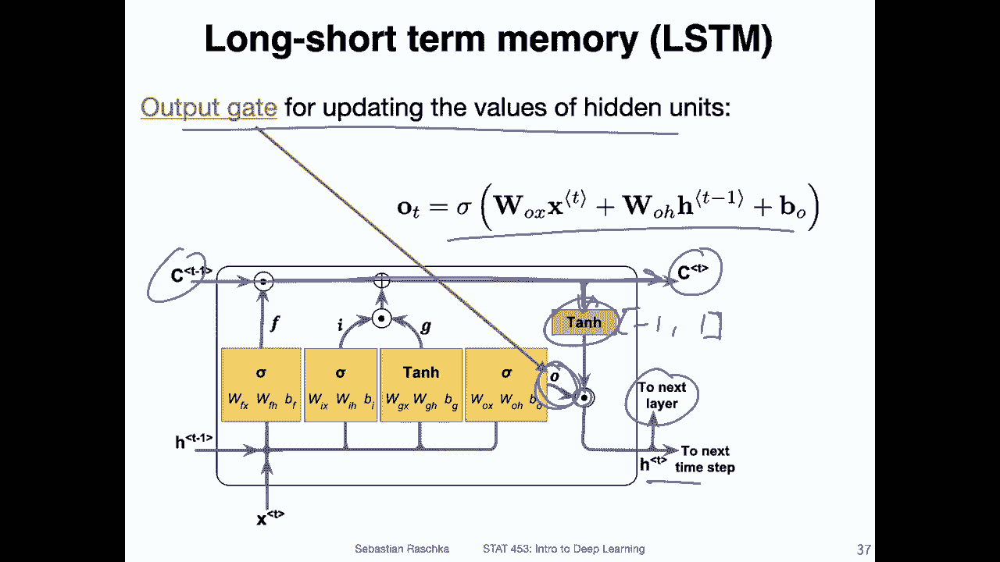

And yeah， here there's a whole。The next hidden state is computed。It's what I just mentioned。

 the output gauge times at an H or the cell state。And yeah this is essentially it and it's a pretty complicated setup it's kind of some justification behind it so that's embedded in the original paper if you're interested in reading about that so。

In practice， if， I mean， this sounds very obscure， I think， I mean， it works well in practice。

 So that's probably why it stood the test of time why people use it。

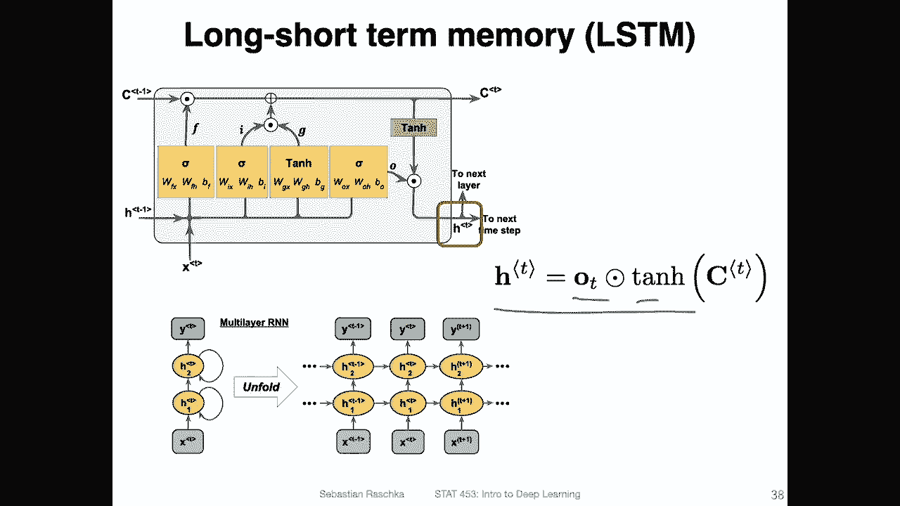

And yeah， like I said， it's so widely used and popular。

 but there's also a version where people try to simplify it a little bit。

So theres this gated recurrent unit， which is， I mean， it's not that recent。 It's also already 9 8。

Sorry，7 years old。 So it's not that new anymore， not that recent anymore。

 but it's also popular implementation of something similar that is a little bit simple。 It has a few。

It has fewer parameters and in practice yeah both like I mentioned before。

 may work well in practice because of yet time reasons we are not going to cover the gated recurrent unit。

 it's also not I would say super interesting in that way just to talk about it in the same way we talked about it before。

So it's just a snapshot of it。 And if you're interested。

 there's a nice article exploring both LCMs and comparing them to G use if you would like to read more about these types of architectures and get a feeling when they work well and looking at some applications of those Allright so again here in this lecture we are just trying to get a big picture of how recurrent neural networks work there are many other topics we wanted to cover so we are not going into too much detail about this particular architecture if you're interested I will post some reading resources on Piazza on canvas。

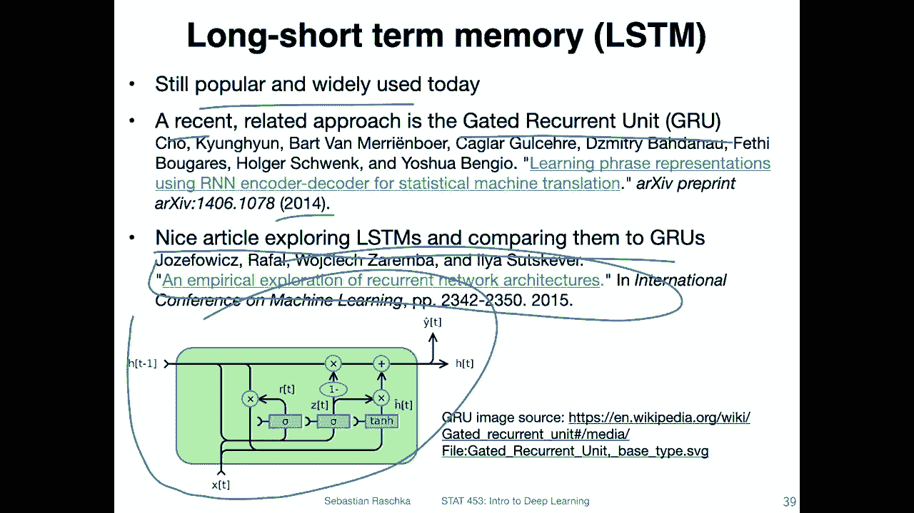

So in the next video， I will then talk about many to one。An ends。

On a work level for implementing a classifier。 So that will be our example。

 And then later in a later。Week in two weeks approximately we will be revisiting also recurrent new networks for many to many tasks for generating new text。

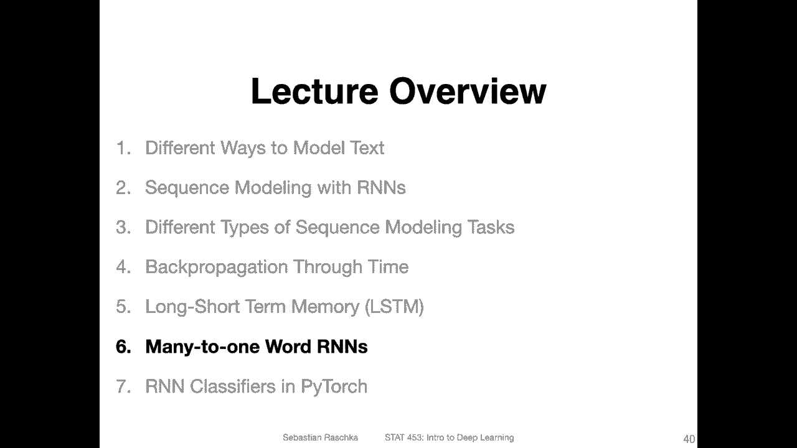