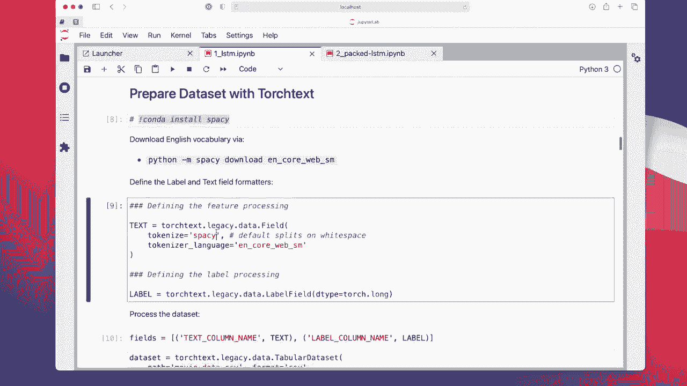
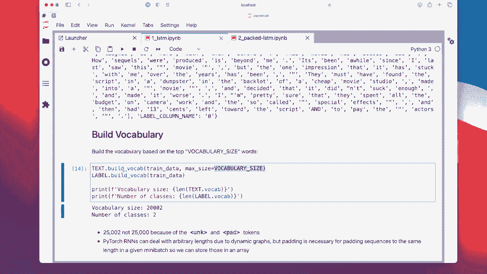
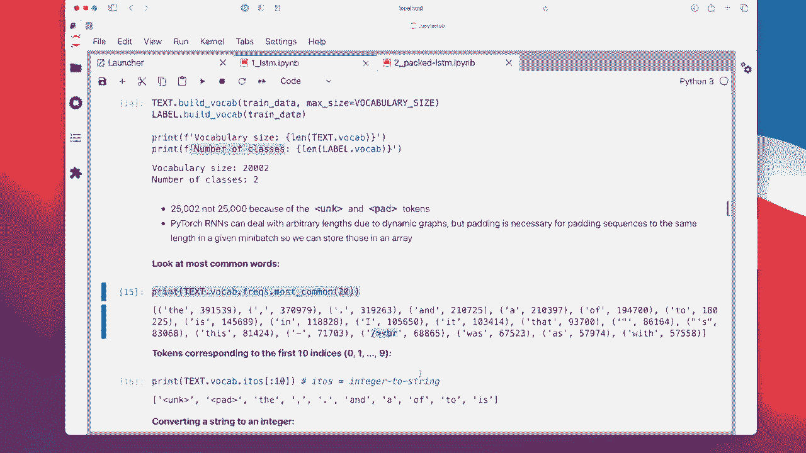
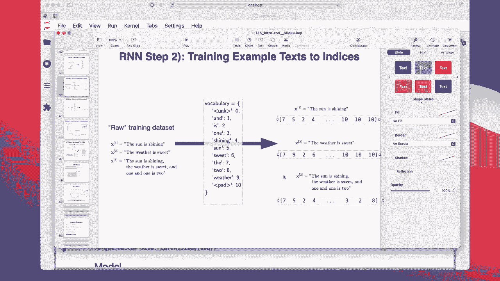
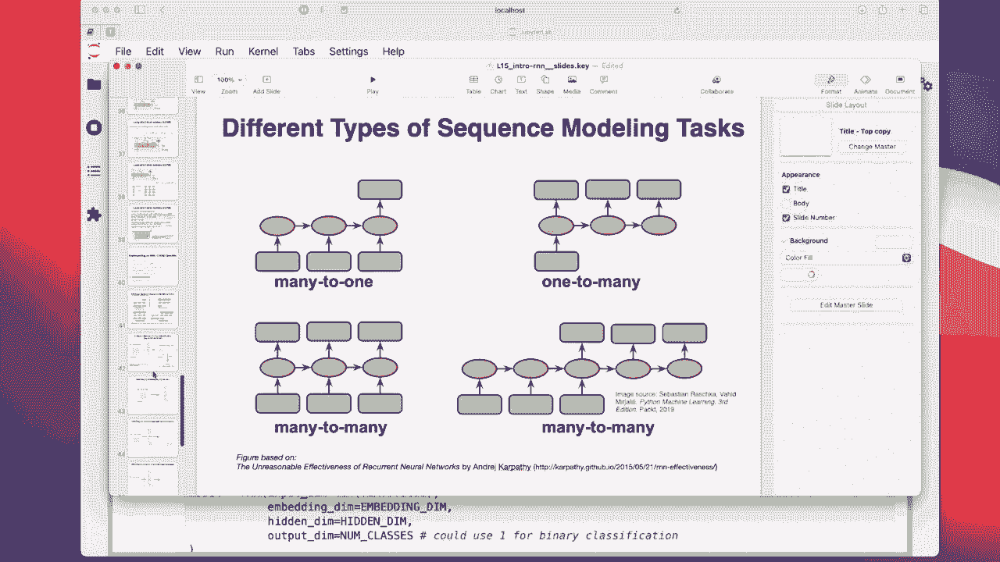
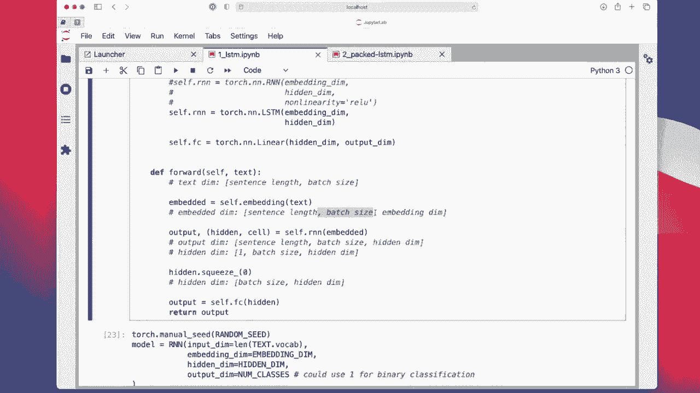
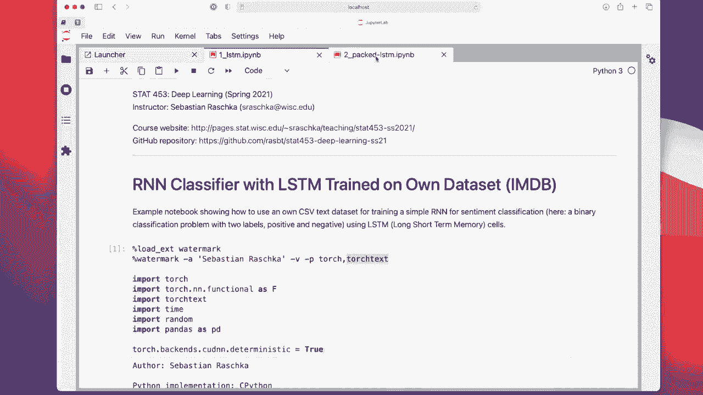
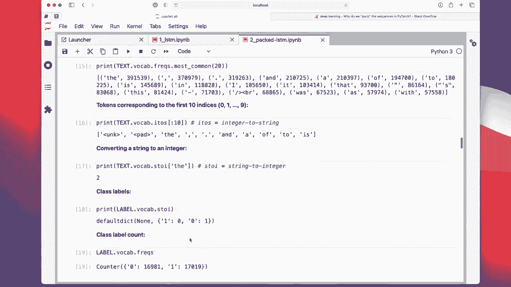
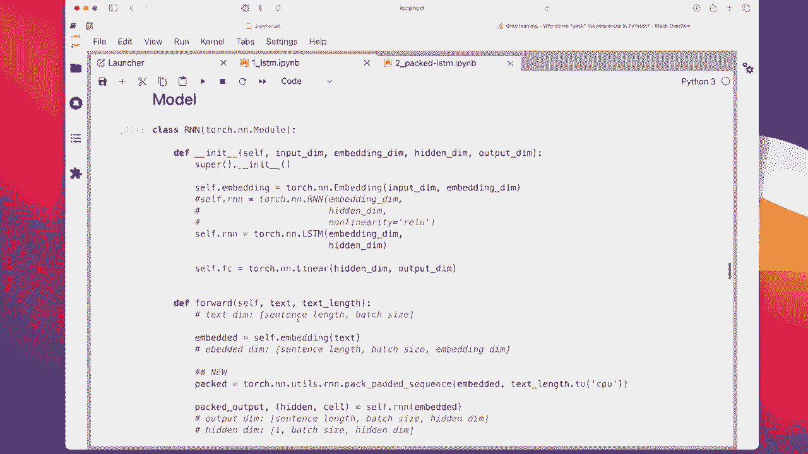

# P131：L15.7- PyTorch 中的 RNN 情感分类器 - ShowMeAI - BV1ub4y127jj

Alright， so this is going to be the last video in this lecture on recurrent neural networks。

 so we are now talking about implementing an R andR class R classifier in Pythtor。

 so the many to one word R andN that we just talked about in the previous video so it will be essentially this whole process from going from a text to building a vocabulary then this integer representation and then using an embedding to get this input to the R and N which will be when you recall this one many to one R andN where we have one sentence as an input and one classable as the output。

So I have actually two codes here。 One is an LCSDM and one is a packed LSDM。

 The packed LCTM is just a more implement more efficient implementation。 So let's just talk about。

MeI just。 let's talk about the regular LDM first， the regular approach。 So it took yeah。

 a couple of minutes to run this。 So I I'm not going rerun this。

 We are just taking a look at the results， and I will upload this。

To github， if you want to play around with that。 So we are going to use。

Torch or pyrch and torch text。So in particular， any version of Torch text that is 0。9 or higher。

Also notice I don't have any helper files here because yeah this is like a tricky concept to explain。

 I wanted to keep everything in this notebook to make it a little bit more yeah easy to explain by walking you through this instead of visiting different files。

 but yeah you could technically also use these helper files when code becomes larger。

 So here the training function will be very simple。

 I don't have any fancy training function this time。

 just to keep things simple because I think an RnN is already complicated enough。

 So compared to a convolutional network， these R ends are actually really tricky to implement at least in my opinion。

 I actually very much prefer working with convolutional networks。

So。

Here are some general settings， so we are going to use the vocabulary size capped at 20000。

The learning rate， batch size， number of epoes is something familiar to you。

 The embedding dimension that we will use is 1 or 28。 The hidden dimension will be 256。

 This is like on。

After that。And then the number of classes is 2。

So first， we are going to download the dataset， the IMDB movie review dataset。 So here。

In this， I in this part， we are downloading it from my book because， yeah， just for simplicity。

 because this will save us some pre processing steps。

 There is actually an I M D B dataset set implemented in torch text。But here， I'm also。

Explaining to you how you can use an LSDM on your own dataset。 So it's basically two steps in one。

And we are using this because it's a CV format that is already。

 I would say easy to use so we can skip all the pre processingsing steps of this particular dataset set so that we can more focus on how torch text works。

So this is just on downloading it。From the St repositorium。Then this is unziping it。

And then this is loading it into up。

Panda's data frame， because it's just a little simpler。

Thenhan using anything else。 So this is a CV file。 So we are using pandas to take a look at it。

 So it has， I think 50000 entries。 So yeah， these are the first five。 The review is the text。

 the input text and the sentiment is the class label。

It's kind of to personally， to me， a common gotcha to have the wrong names later in the code。

So here I'm using something called a text column name and label column name as the name for these。

 because。You will see that later。You have to provide。

Kind of like attribute access to these features in the training loop and the same for the labels， so。

Depending on the names of your columns in the pans data frame。

 your training loop might look different。 You have to rewrite it， and I find this very tedious。

 so I would give my panda data frame if I have different data sets always these names just to keep it simple。

 it could be something else， but I find it also capital letters。

Useful。 So it reminds me what this means or what this is。

 it's just easier to see it that screams out。 Okay， this is a column name here。

And this is important。 Alright， so I'm just giving it the generic name。

 text column name and the generic name， label column name here。

Alright， and then I'm deleting this again。 So here I was just essentially loading it。

 renaming it and saving it again。 And then here this is just for taking a look at it again that it looks okay and then I'm deleting it because I'm not using it here anymore。

Then we are going now to prepare this data set with torch text as input to the R and N。

For that， we are going to use a library that is called Spacey。

 Spacey is a very popular natural language processing library for Python。

And in particular， we are using the tokenizer。So by default。

 it would use tokenizer splitting on white spaces， but I heard from people working with real world datas that sometimes these are not very robust to。

 let's say weird characters。 So also HL characters and things like that。

 And this tokenizer also gets rid of certain formatting things you find in HL like these on。

These symbols here and so forth。 So it's like a little bit more sophisticated than just splitting on white space。

 So what this is doing is it's splitting yeah， a text。Into white space so that one token is one word。

And we are using here this。English language。 it's， I think it's stands for English core。

 web and something。 I'm not this is not for something。 I'm just saying something。

 I forgot what this means， but this is essentially a library or not a library dictionary for English words and web things encountered on。

 and on websites and stuff like that。 So this is usually useful。 If you， yeah。

 just work with a data like scrape from somewhere on the Internet。If you are just running this。

 it may be that you encounter will encounter an error。 So you have to run this one first， which will。

 you have to run this on the command I this will download this。Yeah， dictionary here。

And yet， to install a space here， I recommend Conda， but you can also lose Pip。

Pip install。Now， like I said before in the previous video， things have changed in Torch text。

 so we are going to use the old way called Torch text。t legacy。

But if you want to convert this to the new one， I actually spent a lot of time yesterday。

 and then it was not working very well。 So I。

We use the old way again。 but if you are interested here， there's a tutorial for migration。

On the slides。So to migrate to them newer way that it doesn't use this legacy thing。

Alright， so we are now defining a field for the text。 So this will be our features， our tokens。

 So this， this will be。 So if we have， for instance on。

Oops， if we have this text here， this will be something like a list containing of。

Containing these consisting of these words。Split by。Approximately something like the white space。

 but a little bit fancier than that。 But each entry in the list will be one word， essentially。

Using this tokenizer。Al right。 The second one is the label。

So this is for designating this label。Which will be a integer。 Long， long is just a 604 bit integer。

Here we are providing these fields。And。This is。So we are providing these fields which are the text that we have defined here and the label that we have defined here。

 and we are using a tabular data set which will read our CV file and then parsing out these things。

So that we will can then load them as a data load。 So here， this is why it's so here。

 this is important。 This name has to be。

The name that is actually here。 And personally， it's， that is why I always make mistakes。 So I。

 let's say， don't rename it。 If I don't rename it， I would have to put in like。

Oops。I would have to put in review here。And then sentiment here。 And then later。

 I have to also use these words。 And if I have a predefined training loop。

 I would have to rewrite certain things， depending on what data set I use。

 This is why at the beginning， I rename the column。

 So I can always leave it like it is right here now。 The only thing。I have to changes， of course。

 the path to my dataset。

Alright， And in this case， it doesn't have a header。 So you also have to check in this case。

 there is no header row。

There are only the colour names， but there's no， no particular header rule。 Oh， wait， Sorry。

 there is skip header。 There's no header rule。 It's skipping the header， okay。

So it's skipping， skipping these。 Sorry， what I meant is it has a header。 It has these column names。

 and it's skipping those。

Okay。So this is now the way we process our CV file into a data set。

Next。We want to have a training and a test dataset set。 So I'm using this split function。

 I'm splitting this dataset set into two a training and a test dataset set。 Actually。

 I try to split it into 3 directly。 It should technically support that。 So I had something like。7。

Pot1 and。2。 But it gave me some very weird results。 I think it's a bug。

 So because what happened was I had a validationation set like this。

Train data， validation data and test data。 For some reason。

 I don't know why the validation data was much bigger than a test data， which should be the opposite。

 And I tried many things。 It seems to be a bug。 So I do it in two steps。 First step is。Im splitting。

The training data or the data center for training data， 80% and 20% test data。

So I'm double checking here， so the dataset consists of 50000 data points，40000 will be for training。

10000 will be for testing。

And then I split the training data further into a training data set again and validation data。

 So in total， what I will have is 34000 training examples。

6000 validation examples and 10000 test examples。

Just to make sure everything looks okay， we are now taking a look at the first training example。

 So 0 index0 is the first training example。 and this is how it looks like。So。

 text column name that is。The tokenized。 So this is using the tokenizer。

 This is the tokenized review text。 You can see it keeps punctuation。 It keeps numbers。

So for some unknown reason，a seven years ago， I watched blah blah， blah， So you can see， yeah。

 this is now the tokenized text。 This is from using the spacey tokenizer。

And also， there's the can name here。 This is like the。This should be the class label。

Cre you not sure why this is。Not an integer。 Later， actually， doesn't cause any problems。

 So it seems to be okay， but feel like this should be without quotation marks， but anyways。Allright。

 so。Now， we have the。Data sets the training data， validation set， data and the test data。

What we are now doing is we are building the vocabulary。So here， build vocab。

I' am setting a maximum size for the vocabulary because we are to prevent overfitting。

 So we are only using the most used words， the 20000 most frequent words。

 So I define the vocabulary size here or somewhere at at the top can play around with that。

 can use 10002500，30000 depends a little bit on how big the training set is。

And how， yeah， how diverse the data points the texts are， how long the texts are。

 But 20000 is a good number to start with。

So， we are building。

This now。And for some reason， it's also called build wall cap here。 I think I'm doing it right。

So vocabulary size， what we all find is its 20。Thousand and2， not 20000。

 And this is because we have the unknown word。Token。

 So if we encounter an unknown word that it will not crash and then answer the ones for patting。

 And we have two classes，0 and 1。

Here I'm now showing the just to look at whether it makes sense。 Actually。

 I can see there is something that I feel like shouldn't be there。 as is this break character here。

I thought， to be honest， the spacey tokenizer would be a bit more robust that it would not have these types of things。

 but oh well。Happens。

It's probably not perfect。说。Here we are looking at the  trend0 most frequently encountered。

Words or or tokens。 So the is very frequent。 comm frequent point punctuation and so forth。

But yeah， this kind of bothers me。 This shouldn't be here。 So we would in an real world application。

 probably have to deal with that using a different tokenizer or maybe just stripping it out before we pass it to the tokenizer or something like that。

Alright， next tokens corresponding to the first 10 indices just to look at those。

 So we have a vocabulary that is of size 2000。 If I go back to my。

My slides。 So we have this vocabulary。And we are now looking 1，2，3，4，5。

 The different integer the strings correspond to。 So the first entry in my vocabulary is this unknown  one。

Second one is the padding， and then the command point and A O， F and so forth。

And just for I just making sure things work technically。

 so we will use that data for making predictions。 But later generally， we can also just take this。

Vocabulary for the text field and convert any word into this interteject corresponding to the dictionary。

The the according to this vocabulary， the word the is at index position 2， So 0，1，2。

So here we are putting it in and get the number 2。 So this is all we are here currently。

 this is not necessary。 We are just investigating what's going on just to make sure things look okay。

 Oh， yeah， I see。 So， yeah， we have now this class label vocabulary。 And I mentioned earlier。

 that shouldn't be strings。 I mean， this is probably because。

Yeah， we could have。

Here we could have put the word pause or neck for positive or negative。

 This is what's original in the movie review。Database。 So here I in， in my book。

 I converted it to 1 and 0 already and。The code thinks these are yeah， strings。

Kind of funny。 So it's mapping 1 to 0 and 0 to 1。 So we would have to keep that in mind when we later do the prediction。

So we could have just used words like pause and negative and stuff like that。 We could also。

Yeah， we could also change that if we wanted to。 it's just， yeah， it's just， I think。

 alphabetical order or something like that。

Well it can't be alphabetical， I think it's just。What it has encountered first or something。

 Or maybe it's even random。Just have to remember that the。

String  one in our label column corresponds to the class label 0 and and in the tensor later。

Then here is frequency count of the vocabulary。 sorry of the training data points。

So we have approximately 60000 corresponding to 0， and this one is actually negative。0 is negative。

 and one is positive and 70000 positive ones。

On。One more thing I wanted to say is let's， yeah here。

I am building the vocabulary only on the training data， not on the whole data， because as usual。

 we pretend that the validation and test data are unseen that there are new data sets。

 That's what we use for evaluating our model during training。 we pretend we don't know these。

 It's like independent data。 So we are only building。The voculary based on the known data。

 the training data。

Alright， so you can see it's really complicated to implement an R and are lots of steps involved。

 it's way more complicated than a convolutional network。

 So if you don't really understand everything the first time it's totally normal， it's just。

 it is very complicated。 People study this for many months to before they become comfortable using those things。

Now we are implementing the training validation and test load。

 we use something called the bucket iterator， which is a special iterator in Pytorrch torch text。

 which will group。The batches such that the sentences have。Similar length。

 And that reduces the number of pedding that is required。

Okay， here now we are testing whether those work。 Actually， these data load us and you。

Can see what I'm just doing is I'm like before in my other code examples。

 I'm just doing for batch and train order。 and then I。Print these。 and then I do a break。

 So it only shows the first batch。 I just want to see if， if it runs， okay。

So you can see for the first batch， it's actually pretty large， I should say。

The first value here is the sentence length。And the second one is the batch size。

 So this is a little bit different from the conversion networks， where we had the batch size first。

This is what makes I feel like everything also a bit complicated to understand。

 It's like that the sentence length here is。

First。And the sentence length is。

These integers here， this here。So I a better one here。

Yeah， this， this is basically the sentence。 Well， this is for one word， sorry。

嗯。

Yeah， I don't have a good one here in the lecture notes， but。So if you concatenate these together。

 this would be the sentence length。

And then this is the batch size。

I think yeah。

Alright。 so now the R and N here。

So， the R and N。

Okay， sorry， let's just have to。

Because a bit bigger here。 So the R and N。Looks like as follows， we're actually using an LTM。

 So there are。

Several things now。 we are using this embedding that provides the input to the LSDM。

Then the EsteM itself。And then the。Output layer。Hidden there。 sorry， the output layer。

 it's not a hidden there。This， you can think of of the LSDM。 you can think of as the hidden layer。

Whereas， yeah， okay， the embedding comes before that。 it's like preparing the input。For the hidden。

Actually， in the slides， I said it's this one， but then there would be another matrix。

 So it's technically a little bit confusing。 I should have actually not done that。

 I should have showed you。It is a embedding that comes before that that prepares these xs。 And this。

 this W technically belongs to the R and N hidden layer。

If we would implement this one here。

And the SDDM has a more complicated setup， as you recall from last time。

 So it has all these different types of hidden layers here。

Okay。嗯。No。

What we have here is the embedding that converts。The word into the real value vector。

 If I go back to my slides again， this is giving us this matrix here。 So this goes from text。

To this interteger vector， through these embeddings。

And then the LSDM takes in this embeddings and produces the hidden activations。

And then this is just like a classification layer， like in a multi layer perception or the last layer of a convolutional layer。

 This goes from the hidden dimension。

To the class labels， the output dim is the number of class labels。Now， these are defined here。

 We can't use easily a sequential like we did before。

 because there's a little bit the output looks a little bit different。So I'm also。

 maybe I should say you can technical use an R and N instead of the LSDM。

 but you will find the performance is relatively poor。 So you。Probably want to use an SDDM。

 but if you want to do some experiments， you can actually use the R and N instead of the LSTM。

 The LSTM is essentially， yeah， what I showed you before in the last2， two videos ago。

 the LSDM hidden layer。

Okay。The forward pass gets a text。 So this gets ready the text。 This goes through the embedding。

And then the embedding is the input to the LSDM。 So I call it R n， but's the LSDM。

And it outputs。The output， the hidden and the cell state。

So。嗯。mJust looking for a good slide here。 So we have this many21 here。And。The。

Should probably focus on many， one too many or many too many。 Okay， so let's。

 let's consider this many too many here。 When I call the LSDM， it will output。

So the orange  one you can think of as， as the LCDM， it will output。

Something that goes to the output。 I think Id a better slide somewhere here， Yeah， here。

 So it will output the y。

And it will output the hidden state for the next hidden layer。

So this is the output is the y。

This is the y。Hidden is what goes here in this arrow。 What goes to the next one。

And cell state is specific to the LSDM。 That's this LSTM state。

Okay。So。

嗯。We scroll here。So， we have。Cell state that is output here。 right？ So this one here， Then we have。

 this is the y here to next layer where it says to next layer， this would be the y。

This would be。The output。And H T， this would be the hidden。

And sell， this would be the C。

It is complicated。 So if that does make sense immediately， it is a complicated concept。So。

 since we have。Let me find a better representation yet again。Since we have many to one。

We are not going to use these here。 So we are not going to use this one and this one， so。This one。

 we are not going to use。 This one is not。 we are not going to use。

 and this one is kind of also included in this output。So to make things simpler， we are going to use。

 actually。Let me run arrow。 So what we are going to use here is we are going to use the hidden output from the last one。

 which is this hidden here。

And then， we will provide。Or own hidden there。Of our own output here。 instead of using this green 1。

 we will have our own。

Fooully connected here or fully connected there， this is。What we are doing here。

 So we are computing our own output。 We are。

Removing this， it's， let's say too complicated。 We don't want to use all， all these green ones。

We are going to only use。

The hidden one， which is the output of this orange here of the last orange。

 and then have our own fully connected layer to get this output here。 This is what's going on here。

Alright， I hope this makes somewhat sense。So。If we look at the。

Sizes we go from sentence length to batch size。 This is like what we had before。

 sentence length and batch size， the matrix of our input。Then this goes into the embedding layer。

 which produces a sentence length， batch size， embedding dimension。 This is our。

 I don't know why it is arranged like that， but it is our。

Let me delete this。 So we， so I don't save it later when I export it for you。 yeah。

So this will be， this is the this is the embedding。This is the embedding matrix。

 This is the embedding for one training example。

We have some。 we have multiple because we have a batch size and the batch size dimensions between the embedding and the sentence length。

 So the sentence length length would be the rows here。

Here， it's also the rows。 and the columns is here， not the embedding dimensions。 It's the batch size。

 So we have sent in flks batch size and embedding。 So you have to think there would be an additional dimension here。

And then this goes sentence length， batch size， hidden dimension。 This is。

The dimensionity of a hidden there。

We chose， I think 256。 and then we。What we output get is， there's only one。

So hidden is one because it's the last one， only the last one。

The dimension is batch size and hidden dimension。 This is usually what would go into the next hidden layer。

And we want to give it to our we， like I said， before we make our own output layer。

 Thiss a fully connected layer， this one。So we are removing here with squeeze。

 We are removing this one。 So we make this a batch size times hidden dimension。

 And this is something you have seen before all the time when we use the multilay perceptron and a convol network。

This squeeze is just， we are saying remove the first dimension。

 the one here so that it is compatible with our linear layer here。

Again， this is complicated stuff。 So if that doesn't make sense。

 you don't have to memorize any of this， I can totally understand if this is complicated。

 to be honest， I also spent several hours just implementing this。 it's it's not easy。

 it's complicated and。

If you really want to work with text， of course， watching this one lecture gives you just the introduction。

 It's normal to spend weeks or months or professionals spend years really doing all these things There are many。

 many aspects to working with text。 this is just the introduction so don't feel bad if this looks a little bit complicated to you。

 it naturally takes time to work with this and you to get a better grasp of what's going on here。

O， but moving on， as saw we。

Iitialize now our recurrent neural network。 the input dimension is equal to our vocabulary size is a 20002。

 So we use that here in hour to create our embedding matrix。

Then the embedding dimension， we had something like 1 of28。And the hidden dimension is 256。

 and number of classes we have。

2， we set it to two。 So if I scroll up to the top。We set it to。

Two here， we in a dimension 256 embedding 128。

We could technically use just one class and then use logistic sigmoid instead of softm function。

 and then we could use the binary cross entrobus instead of the regular cross entropios in Pytorch。

 I did that at first， but then I was thinking maybe you would like to use this code here as a template for some other classification problem。

 That is not a binary one。 And then you would have to rewrite everything。 So I。

Implemented it here with two output notes， although it's redundant。

 I implemented it so that you can adopt it to your own dataset set。

 So I thought it's more useful in this way， so you don't have to rewrite any code if you want to use that for your project。

Alright， so now。Let's get。 So this is initializing the model。 I'm just using Adamom。 Now。

 let's get to the part。

Well， we have the training。 So here's the accuracy function for computing the accuracy so。

Yeah， so yeah we are just computing the accuracy。 And here that's the training。

Interesting， I should have。 yeah， I could have also done it like that。 But so to be clear here。

 how this works is。

I have batch index and batch data。 So here I did it a little bit differently。 So yeah。

 already you unrolled this， it seemed to work。

But yes， so here I have batch index and batch data。 So it's the training loop。

 I iterating over the epos， setting my model to train mode。

 and then I'm iterating over the data load， and it gives me two things the text。

 which is batch data dot text column name。

And labels which dispatched data dot label column name。This is why I earlier renamed the columns。

Then I'm providing either logicts。 This is the output from the model。

 So we give the text to the model， and it will do the embedding for us。

And then run it through the SDDM。And ought come the logicits。

 which is just like the logicits in the multi layer perceptron or the convol network that we have seen before。

 And we have the labels here。 The labels is all sentiment。

And this is exactly how we've seen that before。 There's nothing new here。 And yeah， it trains。

Actually， I was training it， and I noticed， okay， it's not really working， right。

 you can see it doesn't really work。

And I was like really frustrated because I spent many hours implementing this。

 and then it didn't work。

But then for some reason， it picked up training here。

And the performance got really good。 So at the end， I had a test accuracy of 84%。

Then also to make sure I should have used the same dictionary。 I don't know why I didn't do that for。

Yeah， the tokenise anyway。 So here is just an example。 This I took actually modified it slightly。

 This is based on。

Based on the tutorial here。

Took it from here。 So modified it a little bit for this code。

 This is just like an example of the things we have to do in order to put something into our text。

 If we have new text。 So let's say I have my model and I have a new text like this is such an awesome movie。

 I really love it。😊。

And I want to know whether it what the probability that this is a positive review is。

It turns out it's 98% positive， which is what we would expect。So what did I do here。

 I put the model in evaluation mode。 I tokenized the text， so。Yeah。

 so I'm tokenizing a text using this LP tokenizer。 I should have maybe used the same as above this web dictionary。

 but it worked just fine。

Then， I'm getting the。Interjo。

Representation。The length I don't need here。 I need it for my other model。

 This is why I think I've just left it in here。 Then I'm converting it to a long ten tensor and put it onto the GPU。

 It's where my model is。 If it was on the GPU， otherwise， it will be on the CPU， if device is CPU。

Just an optional step if you' trained on the GPU。Yeah， so this' is the index tensor。

And this index sensorsor will go to the embedding。 So the embedding will not do the text into。

The embedding it will be two steps， so we have to prepare the indices。Yeah， and then。

That's the softm because we don't have any softm in our model ourselves。And yeah。

 this is just this predict sentiment function for。Putting in arbitrary text。

And here is the same phone。 the computing， the probability that something is negative。 It's just my。

1 minus this， right。So here， I really hate this movie。 It is a really bad movie on sucks。

 and you can see。Model also detects that this is indeed a negative one。

Alright， so this is how it essentially works。 So this is the LSTM， the regular LSTM。

 It's pretty complicated， as you have seen。

You can actually make it even co more complicated using this packed approach。

 So if you're interested in that， there is imp very good explanation here。 So essentially。

 it's about。

Ordering。

The sentences and the batches to minimize the number of computations。

 because we have to do a padding， right？ And if you just shuffle your data set。

 there will be randomly long and short sentences together， but。

It is inefficient because for some batches， you have to pad a lot。

 just because there are one or two long sentences。 So this packed approach。

 what we we will do is it will look at the whole training set and organizeise it such that it minimizes the number of padding required。

So there are a few changes that you have to make for that。So。

I highlighted them here。 so you have to include the length in the tokenizer and so forth。

 So some changes。

I think here we。The some。Sting within the batches also required。

Yeah， and then here that was what take took me a long time to figure out， you have to。

Use this R N dot pe dot padded sequences and then provide also the text length。

 took me literally hours to figure that out。

Was kind of frustrating， but。Anyways， okay， so。

And then I had to modify this a little bit in the accuracy function。

In any case， long story short， it trained。 It trained actually very well。

 I didn't expect it to train that well。 I'm not sure if there's a buck。

 but it trained so good actually or so well that it got。

99% test accuracy。 So essentially， this should be just the same as this one。

 but more efficient because it puts。

Or organize it so that we minimize the pedding。

And it is also faster because of that， you can see if I go here for one epo takes only 0。33 minutes。

 whereas here。

It takes almost more than two times as much。And yeah you can see it gets 99% test accuracy。

 I took a look at this。 I can't find any mistake or bug。

 I think it's just a great model here that trains well。

 It could be that there's a bug somewhere because this is a bit suspiciously good。

But yeah well I take it 99% doesn't sound too bad So yeah。

 so here you have two templates and based on what I've seen actually I think this one looked really good so here you will have some additional resources if you are really interested in working with text but again this is a very complicated topic and I don't blame you if this looks all complicated to you so you are just learning about it probably for the first time。

People who work with natural language processing spend many， many。Yeah days， weeks。

 months learning these types of things。 So here I gave you the overview。 I hope it's it's useful。

 Next lecture， we will now then finally get to the generative modelling part。

 So now I gave you the introduction to the general machine learning and deep learning concepts in the next lecture。

 we will take a look at deep learning models for， yeah， generating new data， auto encodes。

 variational auto encodes generative adversarial networks。😊，And if we have time。

 maybe also transform us。 All right， then see you on Thursday。

