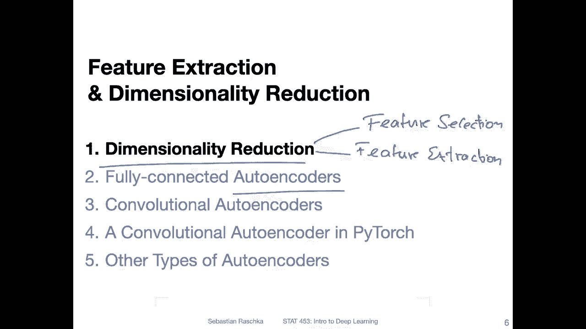
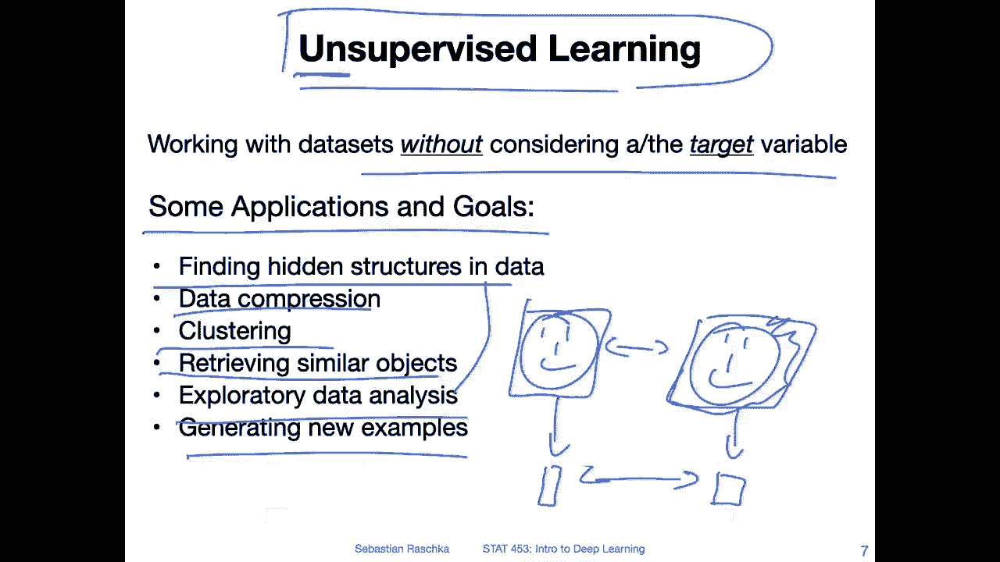
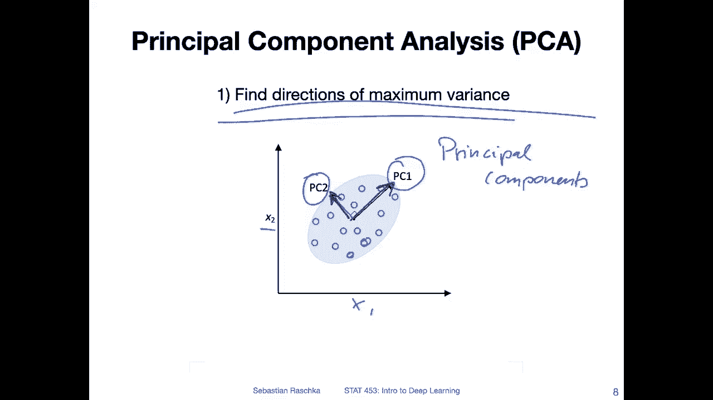
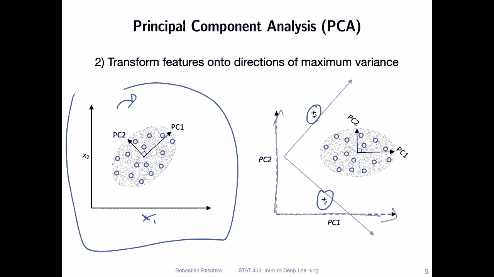
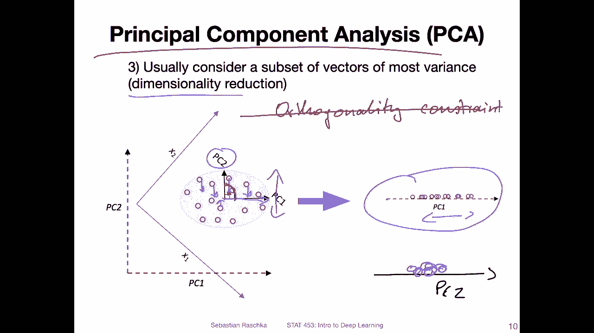
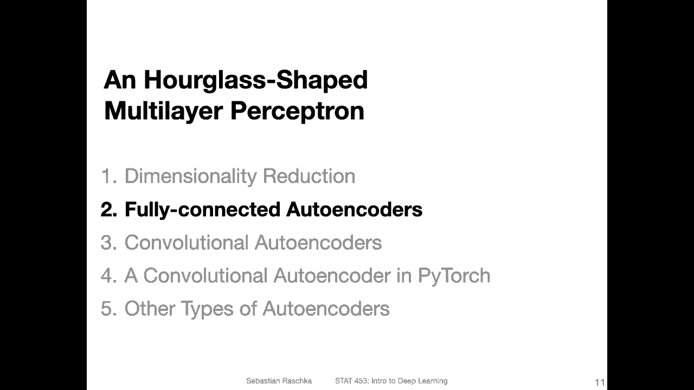

# P133：L16.1- 降维 - ShowMeAI - BV1ub4y127jj

Yeah， before we get to the topic of autoer encoders。

 let us briefly talk about dimensionality reduction。

 So dimensionality reduction is a broad term for describing the reduction of the number of features in a dataset set。

 So one subtopic of dimensionality reduction would be the feature。Selection。

So if you have a data set with a large number of features。

 you can select a subset of these features that would be feature selection and。There is also feature。

Extraction。So the difference between feature selection and feature extraction is that in feature extraction we don't necessarily keep original features。

 so usually feature extraction would be a combination of the features So for instance。

 linear or nonlinearar transformation and yeah we will I will show you an example of that in this video here and this is also the concept that analyzelies auto encoders so auto encoders can kind of be thought of as feature extraction algorithms。

So auto encoders are also the regular auto encoders at least are also falling under the umbrella of unsupervised learning。

 so you have heard about unsupervised learning before long time ago that was probably the first video of the semester where we talked about the three broad categories of machine learning。

The first category was supervised learning。 The other one was reinforcement learning。

 And the other one category I'm talking about here is unsupervised learning。

 So unsupervised learning， like the name suggests its。Supervised learning， but without labels。

 So it's unsupervised。 So we are only using the features， not the labels。

 We are ignoring the target variable here。 So there are problems where we simply don't have a target variable。

 So Sometimes we may have a target variable， but we may decide not to use it。

 So there are different types of applications and goals when we talk about unsupervised learning。 So。

 for instance， one goal could be finding a hidden structure in the data。OrCompressing data。

 let's say for storage needs。 or also， some machine learning algorithms are very susceptible to。

 let's say the course of dimensionality。 So in that way。

 we can just reduce the features and number of features to improve the performance。

One would be clustering。 so that is like grouping similar types of objects。

 It's essentially very similar to this point， retrieving similar objects。 So if you have two images。

 it would be very hard to， let's say compare the similarity between let's say two people。

 if you have a photograph of a person。And another photograph of that person and there'， let's say。

 different background and different types of things。

 it would be very hard to do a pairwise comparison of all pixels to determine whether in these two pictures it's the same person or not。

 but what we could do is we could extract a smaller dimensional feature vector。For both images。

And then， compare。These feature vectors， where we assume that。

Whatever method we use to construct this feature vector has yeah only focused on the essential information like the face images or the faces in the image and not the background。

 for instance。Another goal of feature extraction could be exploratory data analysis kind of related to finding hidden structure in the data。

 where for example， you want to plot a data set that is high dimensional so and humans。

 yeah we can't really visualize more than three dimensions。In a S plot for example。

 so you could think of an application of taking a high dimensional data set。

 doing feature extraction into like two or three dimensions and then plotting those。And finally。

 one big example would be generating new examples so we can somehow try to learn the dataset distribution and then we could sample from this distribution to generate new data and this will be the topic of next lecture when we talk about variational outens I will start by showing you an example already today where we sample new data but here this way would not be ideal a better way would be than in the next lecture the variational out encodetas。

Alright， but a long story short， let me continue before we talk about auto encoders with an example of dimensionality reduction。

I think many of you have already heard about this。 it's called principal component analysis。

We won't go into too much detail about principal component analysis in this class here because yeah it's not a deep learning topic。

 but just in a big picture view here， what's going on in principle component analysis is that we are essentially finding the directions of maximum variance so that would be the first step so if you have a data that like shown here where these circles represent your data points。

You have two feature xs， x1 and x2。And here， these PC 1 and PC 2 represent your principal components。

 So these are the principal。Components。And they are essentially。

 if you think of the data set here as a matrix as a two dimension matrix。

 these essentially represent the eigenvectors of this matrix。

So PC1 is the eigenvector associated with the largest eigenvalue and PC2 is the eigenvector associated with the second largest eigenvalue。

 So these are giving you essentially the directions of the maximum variance。

 so where the data is most spread。Out， so here， we are assuming。In this dimension， in this axis。

 the data is most spread out。 And then this one is the PC 2 is the one where it's。

The second most spread out。Alright。 So then once we have found these principal components。

 these directions of maximum variance。

So we are then rotating。 So we can， I'm not show why it was cut off here。 X 1， x2。

 This is our original。Feature space， So x1 and x2 our original features and。

Here now you can see I rotated this， so I rotated this to the right and I get two new feature xs when is this PC2 and when is this PC1。

 these are my new feature xs， so I'm aligning my dataset set in this new feature axis。

 It's essentially like a linear transformation can think of it essentially as a linear transformation and then。

I'm considering if I want to do dimensionality reduction。

I can consider only the direction with a maximum variance and then disregard the other one。

 So here I would reduce my data set from 2 into one dimension。 So， for instance。

 I would consider this first eig vector and just ignore the second one and then。What happens is。

 so yes， squish。 So if you remove the PC2 dimension。

 you are squishing the data so you can think of it just squishing everything down onto one dimension here。

RightAnd then this is how it would look like if I would project this data only onto one dimension。

And this is the principal component where。The variance is most spread。

 So if you would do the same thing with PC 2。 So if this would be my PC。2。

So you would then see that the data。 So in this direction would be less spread so So it would be more like somewhere here。

In the center。So， many would be。Over lipping。So this is just a big picture concept。 Of course。

 it's kind of boring。 like going from 2D to 1D in a real world case。

 we would have maybe hundreds or thousands of features and reduced that to a smaller dimensional space。

 So how many principal components should we keep。 This is topic where we would look at the cumulative variance retained or captured by the principal components。

 And this is really a topic kind of beyond this class because it's not really deep learning。

 I just wanted to show you a classic。On dimensionality reduction technique。 and， in fact。

 outer encodes do actually something similar。 So here there's one thing I haven't mentioned yet。

 There's something where we have orthogonality。Constraint。

Outer encoders do essentially the same thing they will give you these types of what kind of principle components。

 however auto encoders don't have this orthogonality constraint at least not explicitly but except that auto encoder with a linear activation function would be essentially like a principal component and。

 but of course in the context of deep learning。We are talking also about nonlinear activation function。

 So it's the old encoder we will see in the next video will actually be a little bit fancier than this principal component analysis。

 But yeah， this was just。

Shor overview of one classic dimension LT reduction technique in the next video I will show you actually how the auto encoder looks like。

