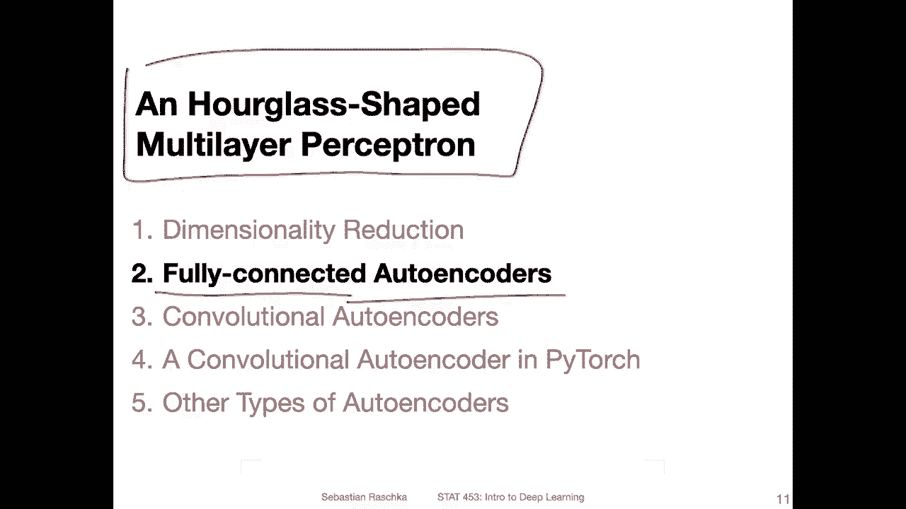
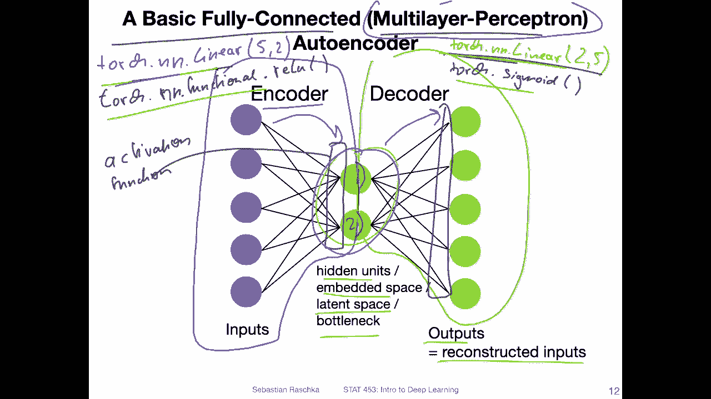
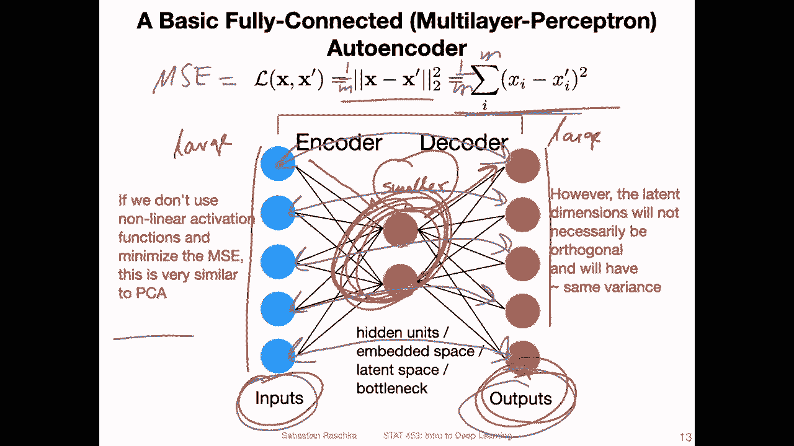
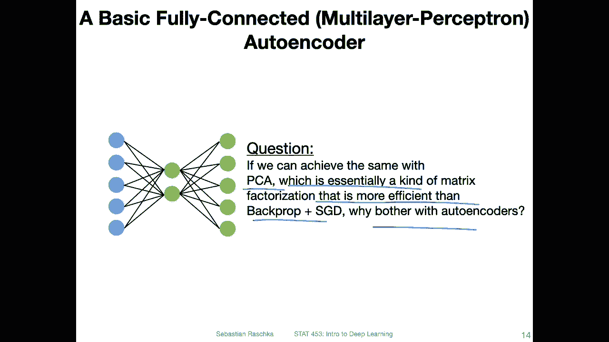
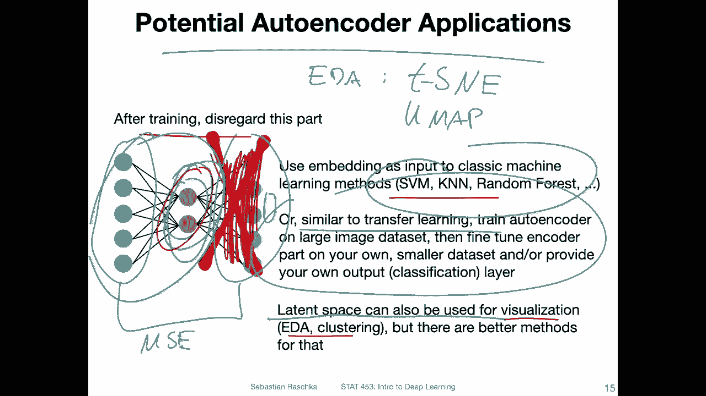
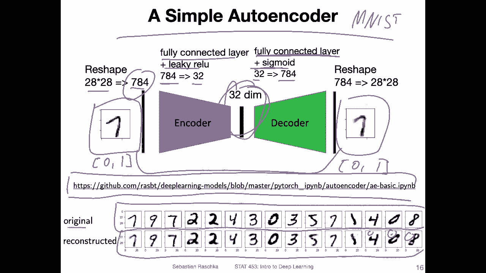
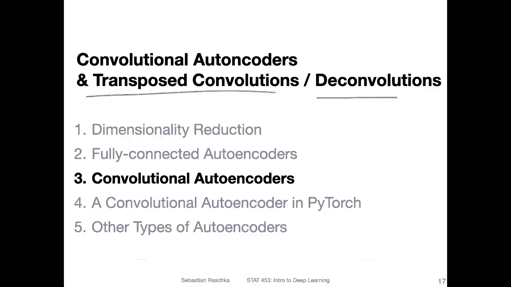

# 【双语字幕+资料下载】威斯康星 STAT453 ｜ 深度学习和生成模型导论(2021最新·完整版) - P134：L16.2- 完全连接的自编码器 - ShowMeAI - BV1ub4y127jj

All right， let's now talk about the auto encoders。 Now。 Finally。

 we are starting with fully connected auto encoders because， yeah。

 they are the simplest type of auto encoder。And you can think of such an autota as an hourlass shaped multilayer perceptron。

So here's a visualization of a very simple type of auto encode are fully connected。Outer encoder。

 So you can really think of it as a multi day upceptron。 So here。Let's start by。

Let's start by looking。Only8。What I circled here， this is the so called encode quota part。

Essentially， this is a fully connected layer。 So you can think of it in the context of torch by torch。

 you can think of it as a。Linear layer。For the connected layer with here of five inputs and two outputs。

And then on the other side here， we have。A decoder。

And the decoder is essentially also fully connected layer。Now， with the opposite。

2 inputs and five outputs。 So it's essentially reversed。 It's going back into the original dimension。

And。In between， we have something that we call。The hidden units are sometimes we also use the word embedded space or latent space。

 a latent representation， for instance， or a bottleneck because yeah it's it's like a bottleneck here and。

The outputs would be the reconstructed inputs。 So what we are doing is we are projecting。This。

Features into a smaller dimensional space。 And then we are reconstructing them。

I will show you in the next couple of slides why that's necessary here it's just the basic setup。

 I'm just showing how it looks like。And if we would have it set up like this。

 it would be identical to the principal component analysis that I showed you in the previous video。

Except with their difference。That here， there is no orthogonality constraints。 So there is no。

Explit way to ensure that feature1 here and feature 2 in the embedded space are orthogonal。

 so that would be different from the principal component analysis。

 principalnc component analysis has the constraint that the features are orthogonal because we are extracting eigenvectors。

Another difference here is。I said that。 We have。A fully connected layer and a fully connected layer。

 but of course， you know that would not be I mean， it would be kind of boring because then we only have a linear transformation here and in practice it would be more powerful to have a nonlinear transformation or the ability to yeah。

 learn nonlinear transformations。So in practice， we would have connected to this fully connected layer here when it's。

I'm not trying to visualize this exactly， but this should w， this is an activation。Function。Here。

 that should symbolize an activation function。 And similarly， here。

 we would have an activation function after the fully connected layer。 So。

 what I mean is we would have tor dot an n dot linear and then let's say torch。But。Ru。And。

 and I think it's an un functionalal。Fal。Relo。You could also see its a smaller case in a little。

So we would have linear layer。Non linear activation function， just like in a multireceptron。

 then again， a linear layer here。 And then we would have another。Activation function， let's say。

Tochdot thickm。I will explain to you why sigma here when we talk about the implementation later。

I don't want to explain too any things on this one slide because it's already a little bit crowded。

 But the bottom line is we have。A fullyly connected layer， a non nonlinear activation。

 fully connected layer， non nonlinear activation， and I'm showing you here something where we only have two units in the center。

 but this is like arbitrary。 It could also be more than two。And， of course。

 it could also be more than。One fully connected layer and only nonlinear activation I could have multiple fully connected layers the same way you can have a multi layer perceptron with one hidden layer。

 two hidden layers，3 hidden layers and so forth。 So the number of hidden layers is also arbitrary here I just try to keep it simple to fit it also onto the slide。

So。Yeah， like I said before， if we don't use the nonlinear activation function。

 this would be similar to principle component analysis。

 but in practice we would use nonlinear activation functions。

 so it's not like principal component analysis， it's actually more powerful than principal component analysis because we can learn nonlinear transformations。

Yeah， the one missing piece I didn't mention in the previous slide is what the point is of having the inputs and then the outputs。

 which are the reconstructed inputs。 This is so that we can learn this transformation。

So what what we are doing is we are computing the difference between the inputs and outputs。

 and we use that for back propagation so that the auto can auto encoder can learn to yeah。To a good。

Compression of the data。 So what happens is。The auto encoder goes from this large dimensional input to this small。

Representation to this embedded space map this is smaller。Let's say， this is large。This is smaller。

 and then it's large again。And。How do we learn that。

 How do we know that this is a good representation， I mean。

We could just arbitrarily come up with two numbers。

 How do we know it represents our original data well。

 How do we know that it's a good way of compressing this data。So， so this is why we。

Have to project it back here。 So we are projecting back into the original space。

 and then we can compare so then we can compare the outputs to the inputs。

 And what we want is we want them to be similar。And if they are similar。

 so if I have input data and I'm able to reconstruct this output data。

 or I have my output similar to the input， that means that my embedded space here。

 my latent representation has to have important information captured about my input data because if this in the center would not contain any useful information。

 then we would not be able to reconstruct the inputs via the outputs。

 So this is really the setup is to ensure that the auto quota is indeed able to retain the most useful information in this embedded space。

And there are different loss functions for that。 And， of course， yeah。

 the simplest one would be just the L2 difference or mean squared error。 So we are。

Just computing for each input here。 So we have five inputs and also five outputs。

 We would be compare comparing them one by one。So let me use a different colour， maybe。

Which colour should I use， It seems pink？So we would compare。This one， this one。This one。This one。😔。

This one。Sum them up。Here， and then we could also average like one over。M。

 let's say M for the dimensionality， like the mean squared error。If we would put it。as one over M。

Okay。Yeah， this is how the basic setup of an auto encoder looks like。

Yeah， so here have a question that if we can achieve the same thing that we can achieve with an out encoder。

 just using PCA， which is essentially a linear transformation kind of matrix factorization that is very efficient more efficient。

 in fact than let's say using back propagation with stochastic gradient descent to train the out encoder。

 why do we bother about out encoders in the first place well。I mean， like I said before。

 principle component analysis is a linear transformation and out ands can be more powerful than that。

 we can learn non nonlinearar transformations and for instance， if we work with image data。

 we can swap out the fully connected layers， let's say with convolution layers and so forth。

 So we have just more， let's say， opportunities to make good models for different types of data that is more complicated。

Alright， so also a potential applications of this auto encoder。 So in practice， of course。

 there is no point。 And let's say just reconstructing the image because， well。

 if we already have the input image， why would we be interested in that reconstruction。 So here。

 the reconstruction in the regular auto encoder is only used for computing the。

Means squaredarrow loss for learning。The embedding space here。And after training， we can。

 after the auto coder has been trained， we can。Yeah， we can remove this part。

 I will show you also in a code example later how that works。

 We can remove that part and then only use that embedding。As our extracted features。 So。

 for instance， some people， if we have a large data set may train。Outten on a large dataset。

 generate all the embeddings and then try out whether。

 let's say training a classifier on top of it helps like using traditional machine learning like support vector machines。

 Can neighborers random forests。 Of course you can also yeah use this directly like a multilayer perceptron with one hidden layer you have let's say you make this bigger and then you have the output layer。

 you can have a multilayer perceptron but if you don't want that you can also yet train the autoen on a large data where where you don't maybe have label information So you can apply this to a large unlabeled data because autoenderrs don't require label information whereas a normal multilayer perceptron would require that。

 So for instance， you can。Similar to transfer learning。

 train your auto and code on a very large data set。

Then it learns how to extract good features and let's say you only have a you have only labels for a subset of that data for that。

 then you can use， let's say， traditional methods and train those on the embeddings。

You can also use the latent space， so。The lower dimensional space for visualization purposes。

 If it's two dimensional， for example。 So， for instance。

 if you want to do exploratory data analysis in a S plot。But of course。

 it's not restricted to do dimensions。 you can also have a larger。 So for instance。

 if you want to be doing clustering or something like that and the original input space is too large for computing pairwise similarities。

 you may also want to consider， yeah using this for dimensionality reduction。 However， I must say。

That in a real world application， I would probably not recommend an auto quota for dimensionality reduction。

 for non nonlinear transform dimensionality reduction。 There are better techniques， for instance。

 if you are interested in。Visualization， let's say， in exploratory data analysis。

Converting your data into a two dimensional space for visualization is a technique called T distributed stochastic neighbor embedding Tni。

 Or there's also another technique called U map， which can be also used for dimensionality reduction。

 These are a little bit more， I would say， robust。 So these are better techniques for dimensionality reduction。

 But yeah， O codes are still very good techniques for。

Let's say learning on unlabeled large unname data and then having something as an input to traditional machine learning and classifier。

 but of course。There are many more interesting aspects and applications of auto encoderss。

 which we are not covering this first lecture， but in the next lecture， for example。

 we will be talking about variational out encoders and this out encoder here would yeah form the basic yeah basic model behind this variational out encoder would so learning about this out encoder here will help us understand how variational out encoder works next lecture。

So here's an implementation of a simple autoer encoder， just using fully connected layers。

 So using applying it to the。Emist data set。 So on the left hand side， I have a hand written digit。

 the handwritten digit 7。In Mnes， it's a 28 times 28 dimensional image。

 So I'm reshaping this to a 784 dimensional feature vector。

 And this goes into my fully connected layer that is followed by a leaky relu。

So this fully connected layer compresses the input image from 784 to 32 dimensions。

 so it doesn't have to be two dimensions。 it can also have more than two dimensions。Of course， and。

Then I'm having， or I'm using another fully connected layer that converts the 32 dimensional。Hidden。

Space here back into a 784 dimensional representation and this fully connected layer is followed by a syigmoid activation。

 Why sigmoid activation， that's because I normalize the input images。

 the pixels such that they are range between 0 and 1。

 So the syigmoid will also output values in range between 0 and 1。

 So I'm applying the sigmoid to get the same values as the input has。

This are the same range of pixel values。So this will also be 0 between 0 and 1。

 And then I can compute the mean squared error or minimize the mean squared error between。

The pixels here。So here is the or here a snapshot of the original am。

Images and at the bottom are the reconstructed ones。 and you can see they are not perfect。

 there are some artifacts here， but overall it looks pretty good。

 So our very simple auto encoder is able to retain enough information in this 30 dimensional space to reconstruct the original images。

 And if you think about it， 32 is approximately approximately like 20 times smaller than。

About 700 dimensional input。 So I was able to here reduce the side2 fold。

If you're interested in this code it's here I have it here on GitHub I won't walk you through this code because in the next videos I want to show you a convolutional auto encodeder which is slightly more interesting and I implemented some code for this class also to make this more interesting so we will be focusing one more interesting example of a convolutional auto encodeder。

 but if you're interested here you can also find the code for the simple auto encodeder which is essentially very similar to a multilayer perceptron。

Okay so in the next video let me then introduce some concepts about convolutional autoenrs。

 it involves transposed convolutions and deconvolutions。

 or it's just a different name for the same thing and then we will after this next video we will implement this in Pytch。

