# P136：L16.4- PyTorch 中的卷积自动编码器 - ShowMeAI - BV1ub4y127jj

Alright， let's now take a look at how we can implement a convolutional alender in Pytorch。

 So I have like always a couple of helper functions， which I will go over later。

 let me hide this view。 So we have more space in the center for the notebook here。

 So we start as usual by importing watermark。 So you know which pytorch version I used。

 We are later also going to use metpotlip for visualizing some outputs and also the training loss as usual。

 So the helper functions are some related to plotting。

 the data order is exactly the same that we used before。

 and this is the domestic setting that we also used before。

 I slightly modified the training function。 I will show you the modification later。

 but except that yeah I try to keep it very simple。

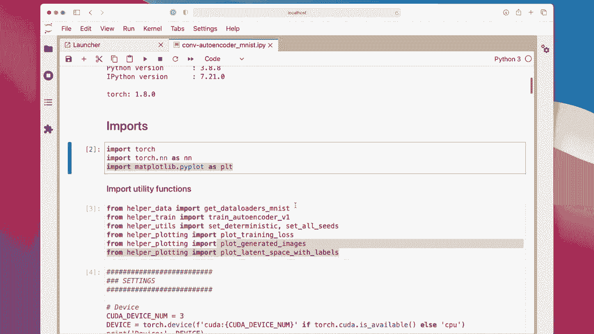

So we are going to yeah train for 20 epochs， batch size of 32， just some settings here。

Here I'm getting my data set。 Now， notice we are not using any validation data points。

We don't compute anything like accuracy here。 So here we are only looking at the reconstruction between the input and outputs。

 and for that， we just use the yeah training set。So。Just testing that the data lot work。

 you can notice validation set is empty now。Yep， so here that is our main model。In fact， okay。

 these are some helper functions for my main model。 But yeah here， these are my main。

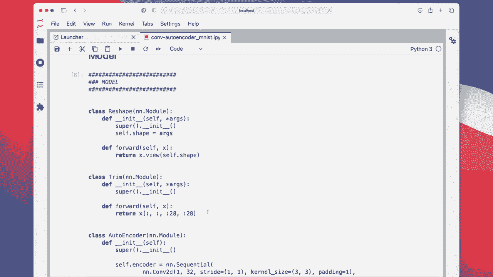

I mean once， so。I think you can see that。 So here this is my autor class。

 I will explain the other functions in a few moments。 The other classes I showed you。

 So we are implementing our autor using。2 sequential parts。

 That is because that makes it later easier to reuse the encoder as a feature extractor and to use the decoder as。

Something where we can reconstruct images from a latent representation。

 So I like to keep those two separate。 It's easier to read in my opinion， but also in that way。

 we can use them in a certain way。As you will see later， so。

Here I just implemented conversion layers， a couple of them。 So going from one channel to 32。

 So the M has only its gray scale。 so we only have one input channel， I go to 32。Colonnal size3 by 3。

 that's just the usual stuff。 Then I go from 32 to 64 and then I have just two conversion layers。

That keep the channels。 You could probably increase the channels。 This is just reducing the size by2。

 This is not doing anything except having more permit in my network might be redundant。

 You could be able to remove that。 Then we are flattening。This so this is。

 I don't know exactly the size， but this is something times something times 64。Which is， yeah， then。

Reshaped， flattened into a linear layer。 So it will be all combined into one dimension。

 like you are familiar with before from convolution networks。 So in this case， we get。

A 3136 pixel vector as the output from here。 And then I am compressing it into a two dimensional space。

 So only two hidden features。 It's very small。 This is。

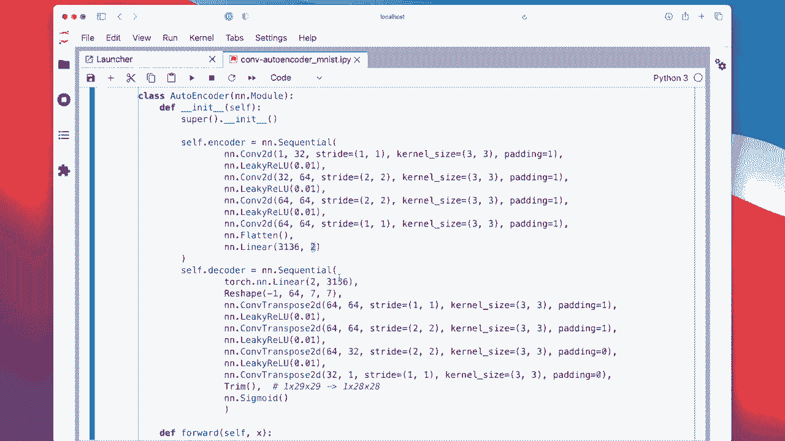

Let me go to my slides。

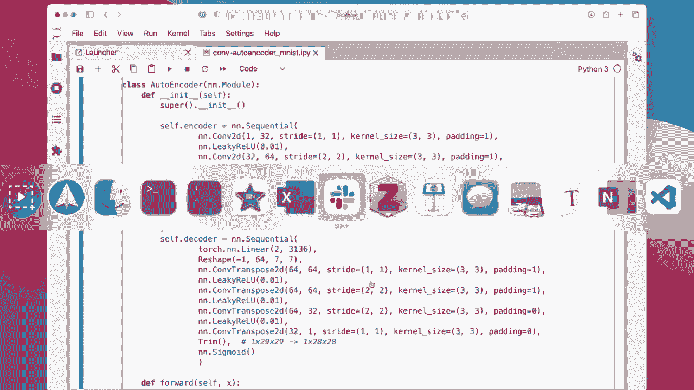

说的事实。Here， here。 So this is the fully connected one。 But for some reason， I。

I should have probably put something in。Here。So this in between would be only2。

 two pixels two dimensional。

O。Pick。So this is my encoder going from the 700。84 pixel Mnis to a two dimensional representation。

 so we are reducing the size here by 392 by a factor of 392， which is actually very impressive。

 in my opinion。And then we have the decoder and the decoder。Goes backwards。

 So it takes the two dimensional here， the two dimensional representation and。

Projects it into a 3136 dimensional representation。And then I'm reshaping this so that it has。

 yeah the dimensionity of the convolution as before。 So here the output now I remember。

 so the output here would be 7 times 7 times 64 or 64 times 7 times 7。64 times 7 times 7。

That's where we get this value from。Oops。😔，And now we are going backwards。

 Were going from 3136 to 64 times 7 times 7。 Then I have my transpose convolution。

Nikki Reou transferversese conversion。 So here I'm essentially with this one。

 I'm undoing this one with this one， I'm undoing this one and so forth。 And then I go from 64 to 32。

Like the opposite of this one。 And then I have the opposite of this one。However。

 due to how things work with padding and everything， I tried to get 28 by 28。

 try different paddings and thinking about it where to pa and。It didn't work out。

 so what I get is either something like 27 or 29， I'm not able to get 28 just because of rounding in the padding。

So this is why I have this trim class。 So this trim。

Class I implemented here is just removing one pixel。 So from 29， it's trimming it to 28。 in that。

 And so I'm going from 29 to 28。 So I have the original size as my input。

And then I have a sigoid here to get a pixels in the range 01， because。

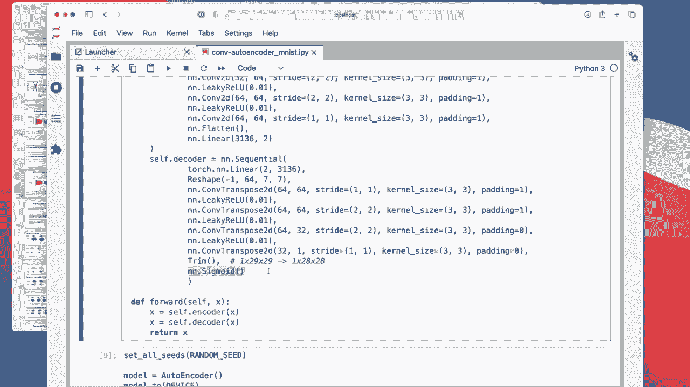

Not showing it here， but by default， if I don't use anything， the input images。

 let me go maybe to my helper data lot function。

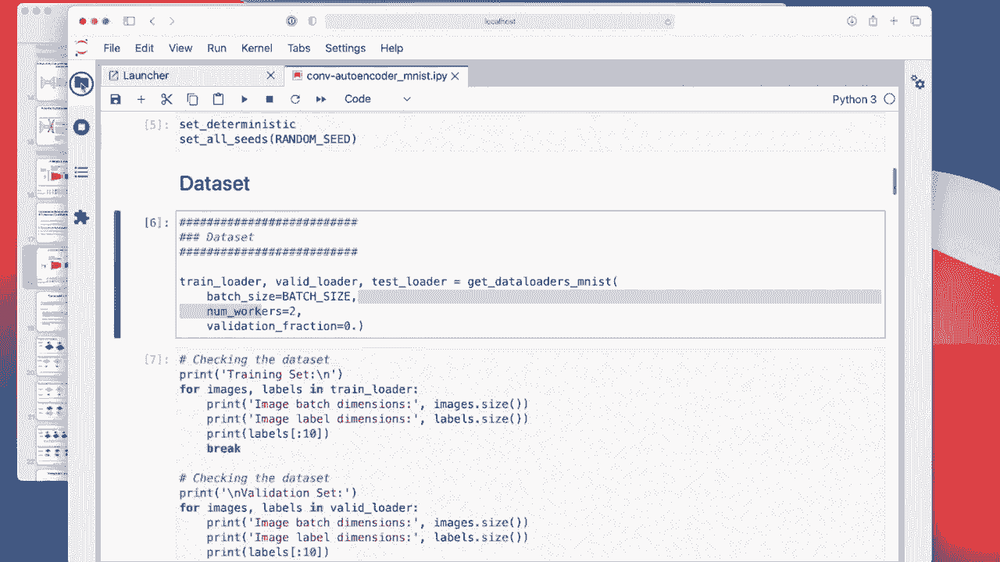

Yeah， so by default， if I don't specify the train transform in my， this is actually say for 10。

A this。 So yeah， if I。Don't specify anything for my train transforms。 I will just use this one。

 And as you know， it will normalize the pixels into a 0，1 range。

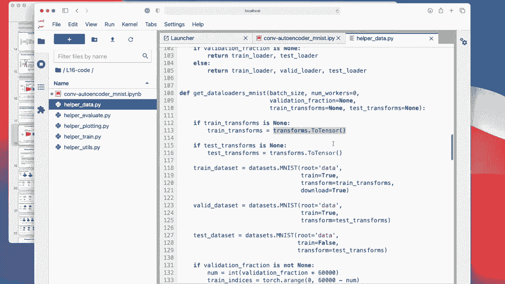

And I want to compare my input to my output pixels。

 So I also want my output pixels in a 0 and one range as as you know， Sigmoid will accomplish that。

 So if you alternatively normalize your inputs for -1 to 1 pixel range。

 you could use a 10 H functioner technically。Okay， and then in the forward method。

 I' am just defining my encodeder and decoder， so just putting together what I have here。

And then I'm initializing it， I'm using Adamom here for simplicity。

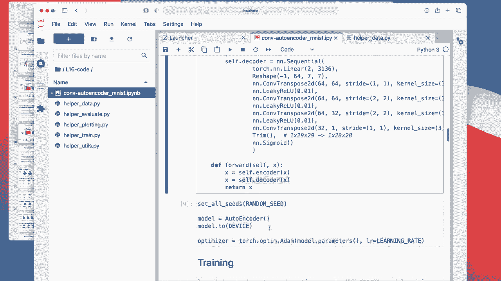

And that I'm calling my train function。 Let's take a look at this train function。

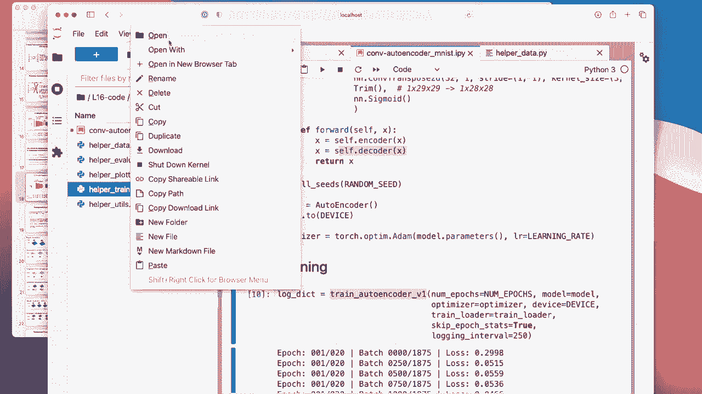

So okay， this is from the previous lectures， the train classifier。Now we have a slight modification。

 I can't。

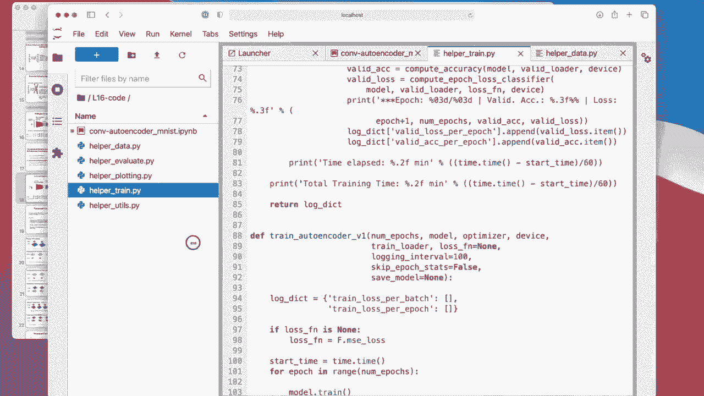

like this。 So the train auto encoder functions is almost identical to this train classifier function except。

 of course we don't compute the cross entropy。 so we compute the means square error loss。

 So I have a MSE here if no loss functions specified。

 some people like to train auto encoders with a binary cross entropy。

 but I don't I I don't like this idea because it's not symmetric。In any case， so。

If you have questions about that， I'm also happy to discuss the small piazza。

 I have some visualizations to show it to you， but I don't want to make the lecture too long if you're interested I can show it to you but it's not essential。

 so we have now the mean squared error loss here。By default。

 if we don't specify anything and this is between the los and the features right。

 so we don't use any class labels。 That's the main difference compared to the classifier Here we are comparing the los which are the reconstructed images with the original images。

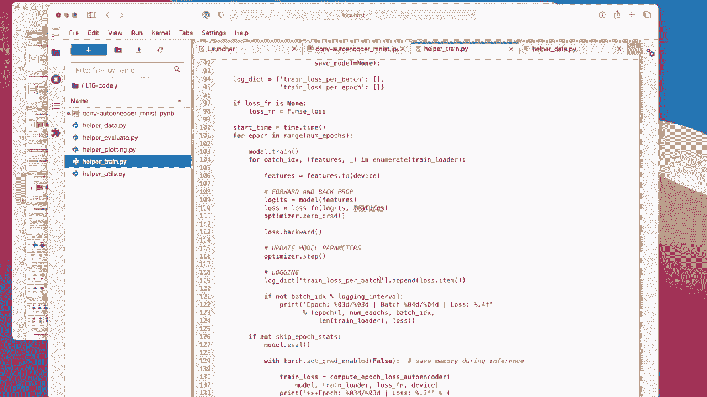

Alright， so this is all that's new。 All that boiler plate here is the same as before。

 It's just for except that we don't compute the accuracy。 Of course。

 we are just computing plotting the loss。 We don't have any accuracy here。

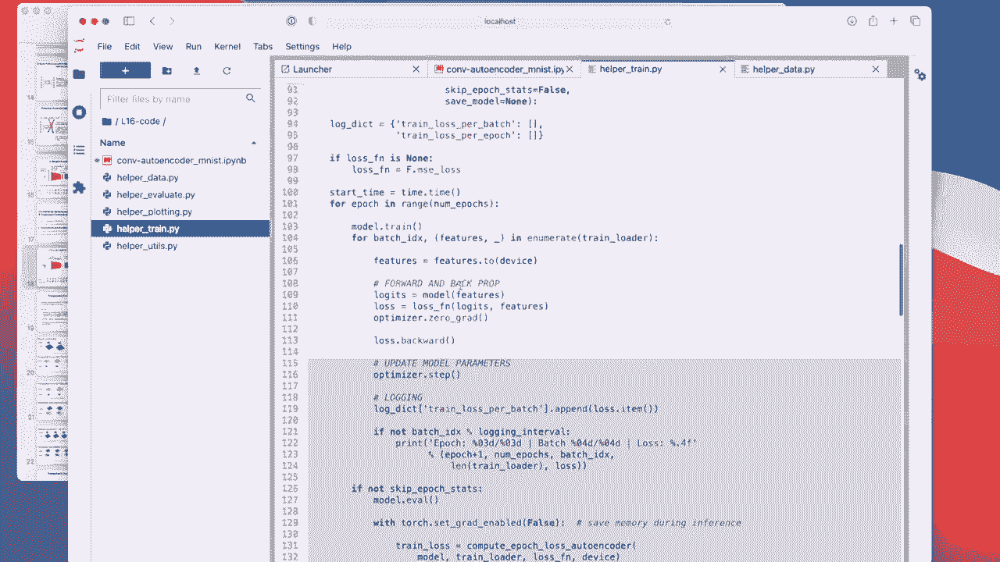

And yeah， this is essentially it， it's pretty simple training function。

 It looks maybe more complicated than it is， but it's just。The class function， simplified。

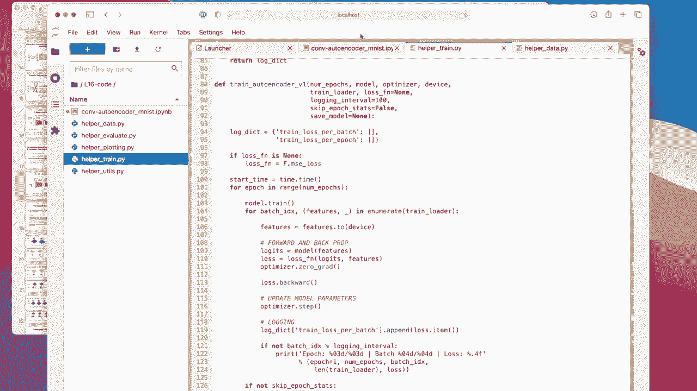

Alright， so。Now here I'm training it。

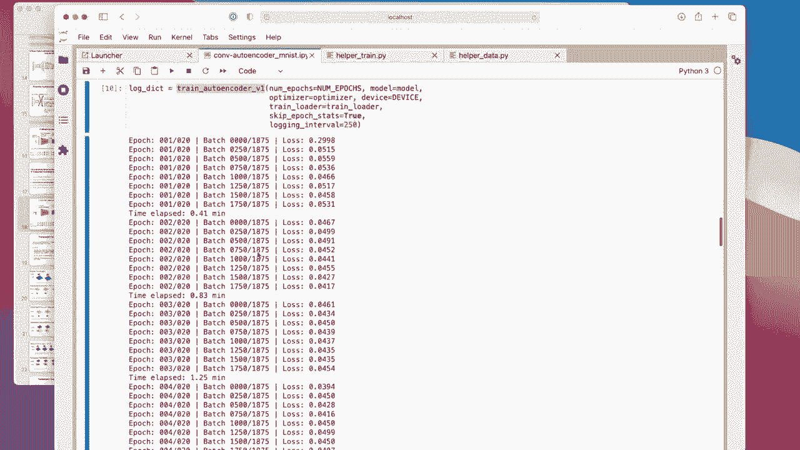

So you can see there's a big jump， and then it only trains slowly。

 So the first iteration already minimizes it a lot。Which is good。It train like fall。

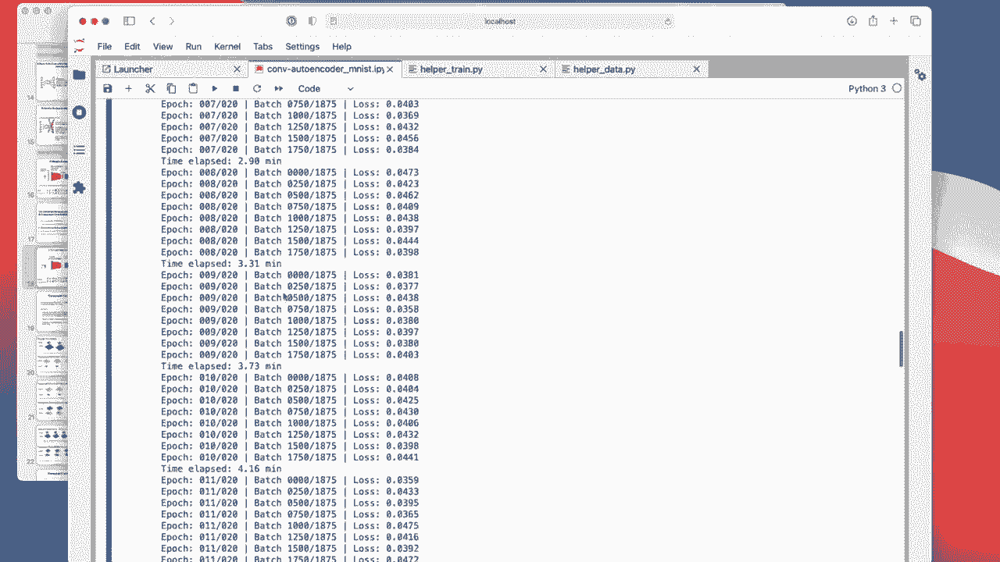

8ight minutes on a GPU。 And then here's a loss。 Maybe I can see maybe training it longer would have helped a little bit。

 but yeah， I was lazy， just trained it for eight minutes。

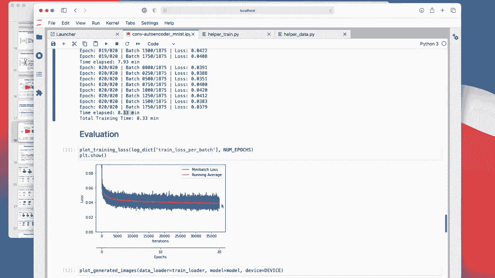

And you can see the results look quite blurry。 So you can。 So at the top。

 So here I have a function on the in the top row。 These are the original images。

 And at the bottom are the reconstructed versions。 and you can see。

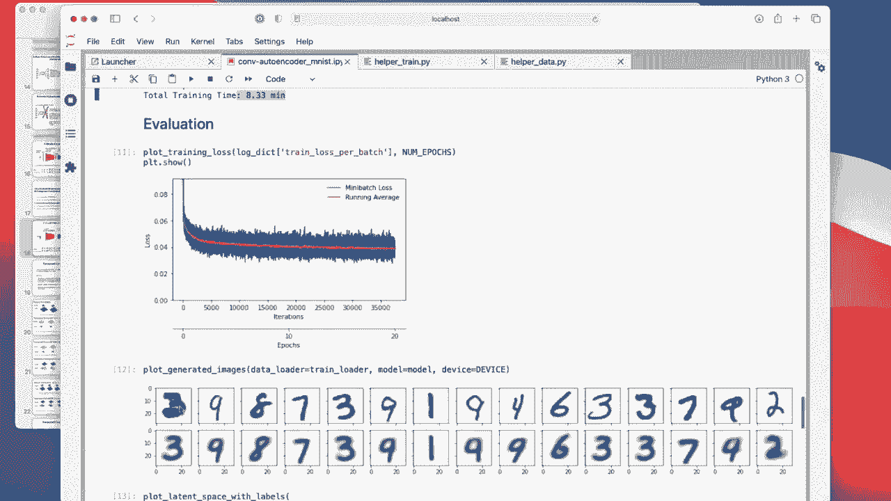

It's all very blurry。So。Why is that， Why is the quality so bad compared to what Ive showed you here？

 So the reason is I'm using only a two dimensional representation here。

 I actually forgot what I used to， I used something higher dimensional。

 So here for the fully connected one I used a 32 dimensional。

 I think I did the same thing for the convolutional one here。

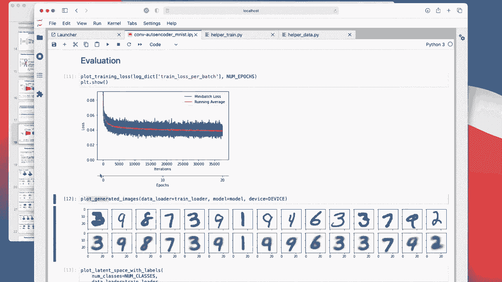

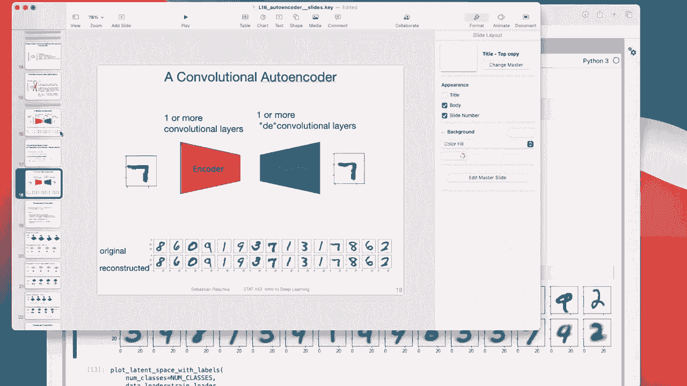

嗯。So here I just want to see what happens if I use it to。Two dimensional1。 It's an extreme reduction。

 So it's kind of impressive that it can reconstruct anything at all from just two pixels， right。

 But then you can also see it makes mistakes here for the4。

 it also thinks it's a 9 because 4 and 9 are sometimes very similar。 And yeah， So it's not perfect。

 you would get much， much， much better results。 if you would， for example， change this number here。

 if I go up。 if you'd change this number， let's say to 100 or let's say。

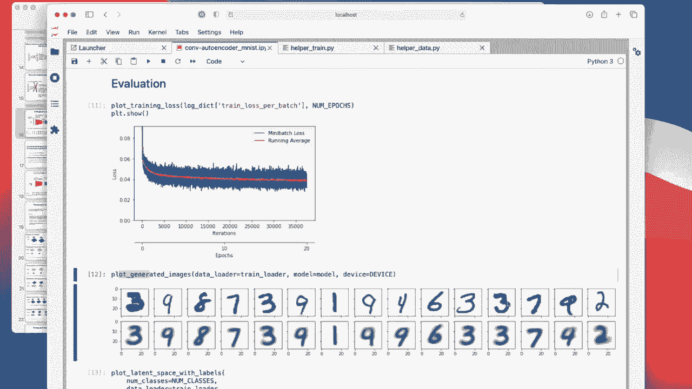

64 and。64， you would get much better results。 I just wanted to show you the extreme case of having two。

 because。A two dimensional space we can visualize。Okay， so because I have some more visualizations。

 So this is how the reconstruction looks like。 Now here I have a visualization of the two dimensional space。

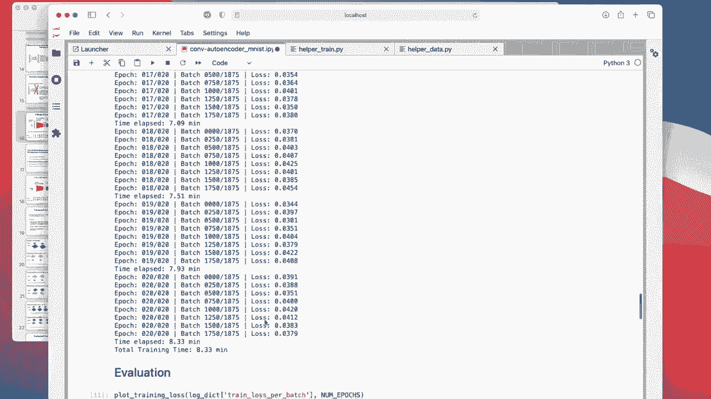

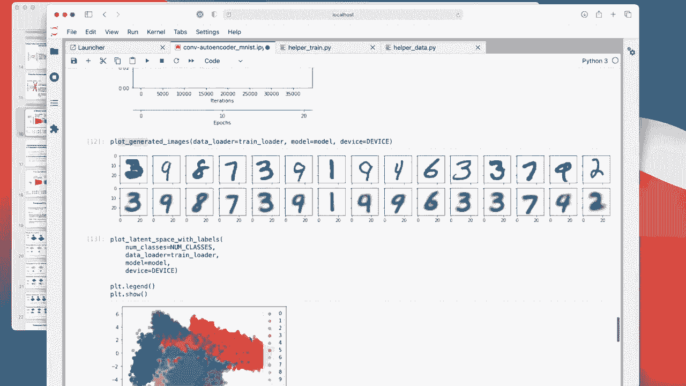

The embedded space for all the training data points。So you can see it's kind of a mess。

 but what you can see is that similar numbers cluster together。

 So I have added the class table information by color so you can see the oranges here are all the all the ones。

The dark blues are all the zeros， and they all cluster together because， yeah。

 they are somewhat similar。 And the auto encodeta is able to capture this similarity in this two dimensional space。

 which is kind of interesting。 But you can also see。That， for example， some are overlapping 8 and 9。

 you can see they are overlapping here。 three is also buried somewhere here。 so it's it's not great。

 certain things are overlapping a lot， so。In that way。

 if you sample a data point here where things overlap， well。

 it's unclear which one it would reconstruct， right， So in that way。

 it loses the information between these classes。 It can also maybe then help explain。

 I think the four might be also burnt here， it might explain that if we have a four here in reconstruct a 9 because。

They are overlapping here。And in the next lecture， we will talk about variational auto encodes。

 which fix this problem a little bit better。

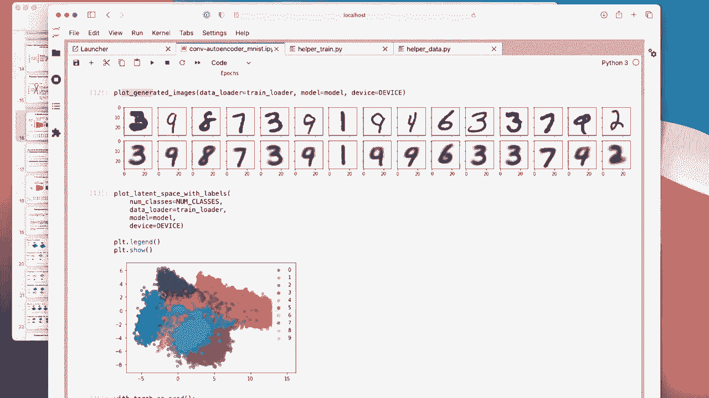

So there it will be a little bit better organized in this space。

Yeah， and here I'm just using the decoder。

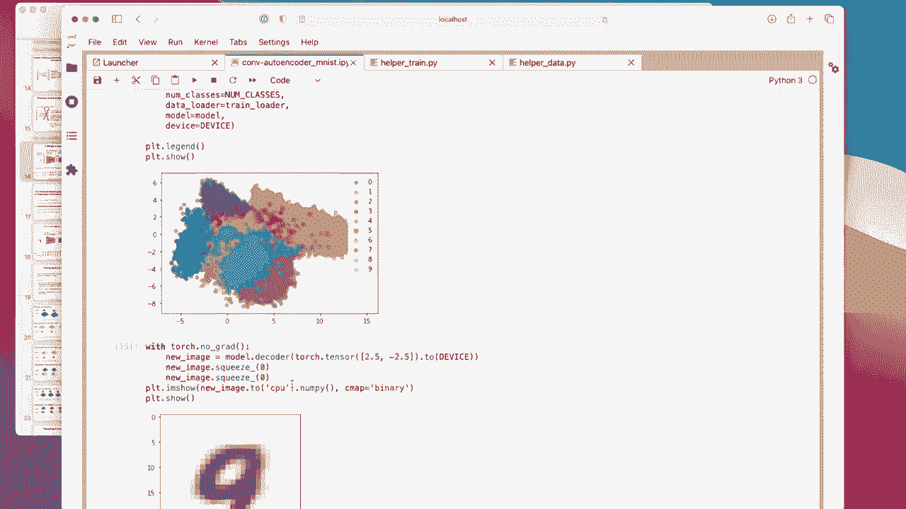

So maybe I can show you the plot latent space function briefly。

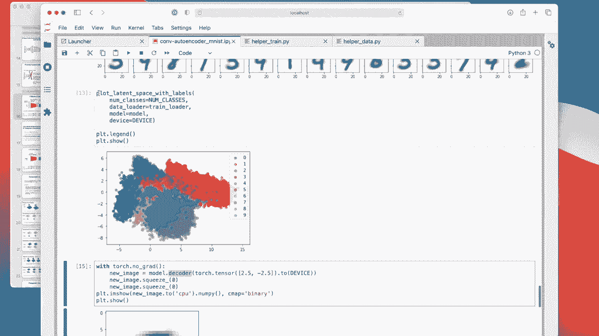

So that helps you understand maybe how I， I did that。So that is plot latent space。

 So here I'm technically just using a data load iterating over the data load。

 and here I'm using only the encoder you can see model dot encoder。Based on the images。

 So features here are the images。From my data set， and then I'm producing these embeddings。

 and then I'm here's just some plotting code for plotting these two dimensional embeddings。 But here。

 see， I'm only using the encoder part。

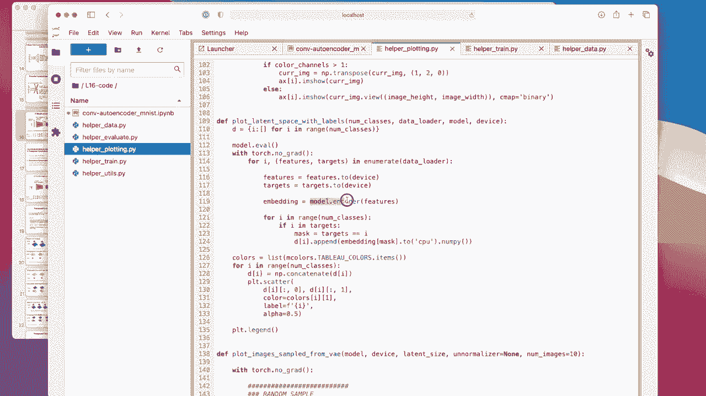

And if I can go back here here， I have another visualization here， I'm using the decoder part。

 so what I'm doing here is I am reconstructing an image。So。I'm taking one point here， let's say。2。

5-2。5。 So if I go here， it should be。Somewhere here in the center and you can see it reconstructs this9 here from from from this vector so this is my input vector and it will reconstruct the 9 I'm just sampling from here。

 So here it looks like a pretty dense space， but you can think of it as that we have now a method for reconstructing or generating new data so I could sample any point here any I can put in some random values and by inputting these random values I will。

Be able to generate data。 And if I take something that is not in my dataset like a point here。

 it I actually don't know what will happen。 It will create some data。 I wish I could show you now。

 but I would have to run this on my laptop。 This will probably take more than 20 minutes。

 But yeah if you're interested， you can just put in some random values a homework exercise or something and see what comes out。

 And you will see the results won't be great。 and you maybe get some fantasy numbers that don't exist。

 And in the next lecture we will see a better method for doing that there's a concept called a variational auto encoder So here this is just a basic introduction in the next lecture。

 I will show you a modification of the auto encoder。

 which is better at or is more designed for sampling from a certain distribution to generate new data。

 Allright， so this is it for this code example in the last video I will go over some other types of auto encoders。

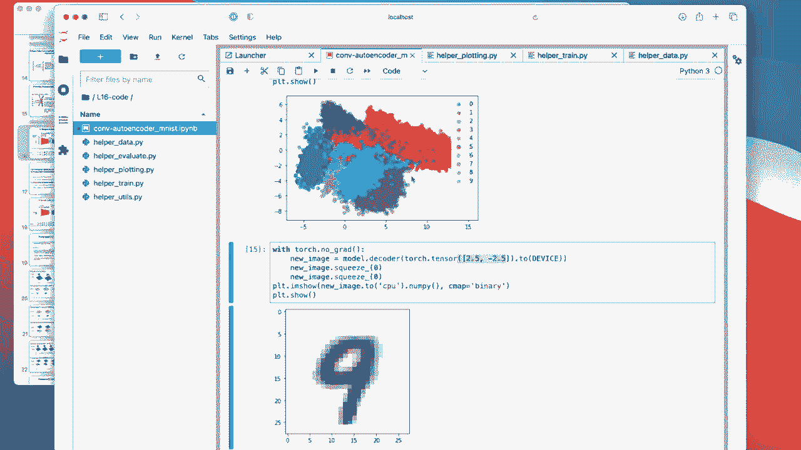

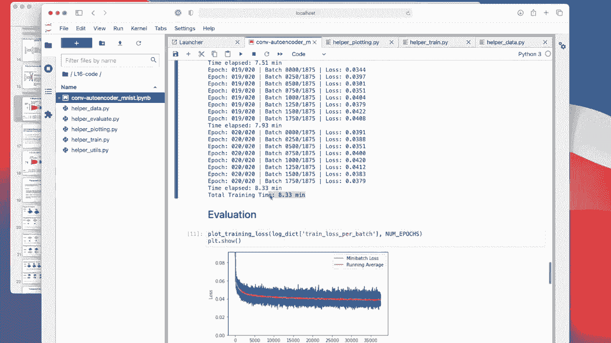

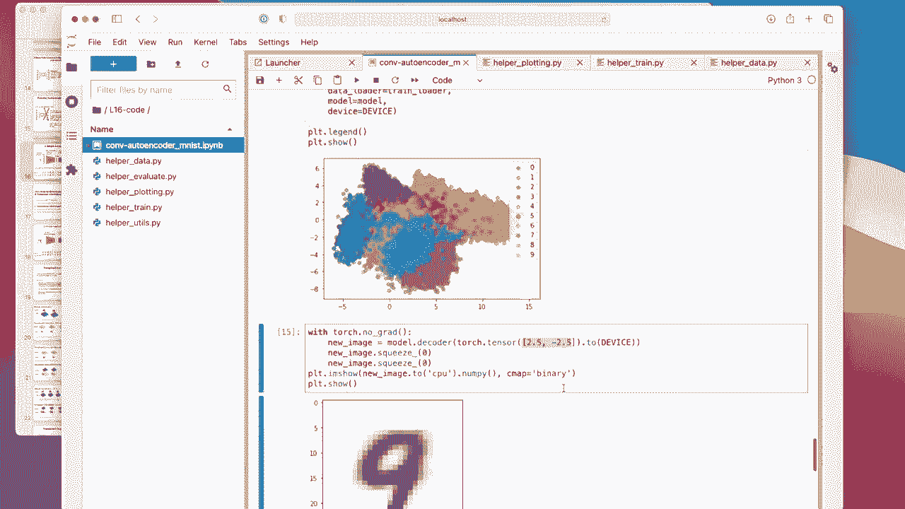

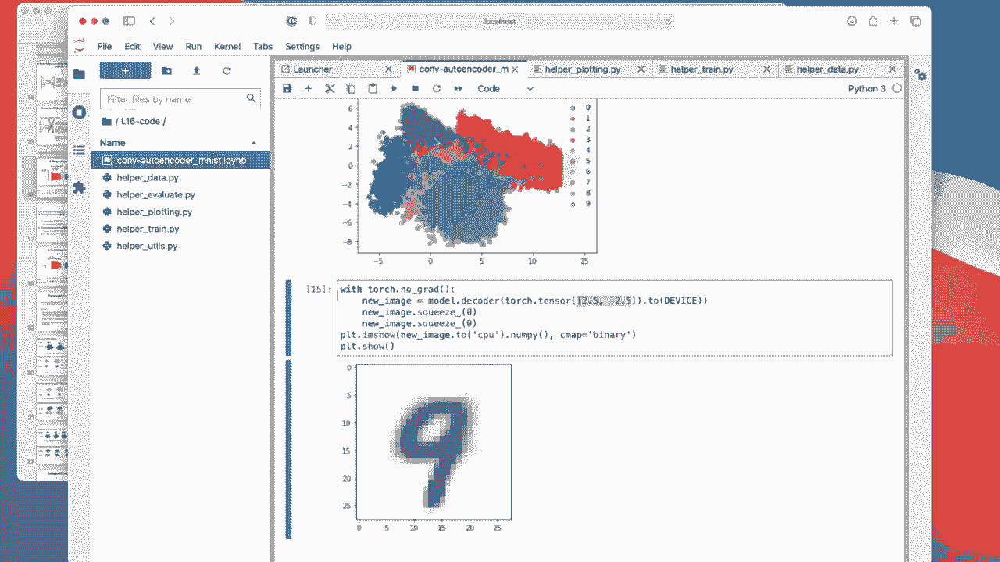

And then we will end this lecture for today。

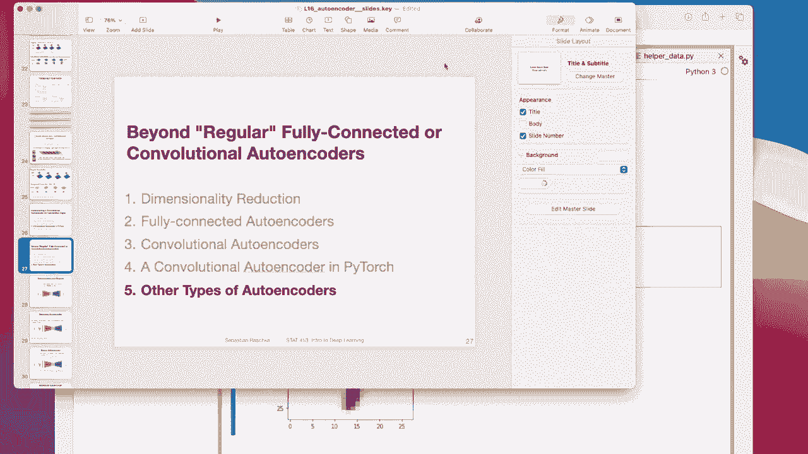