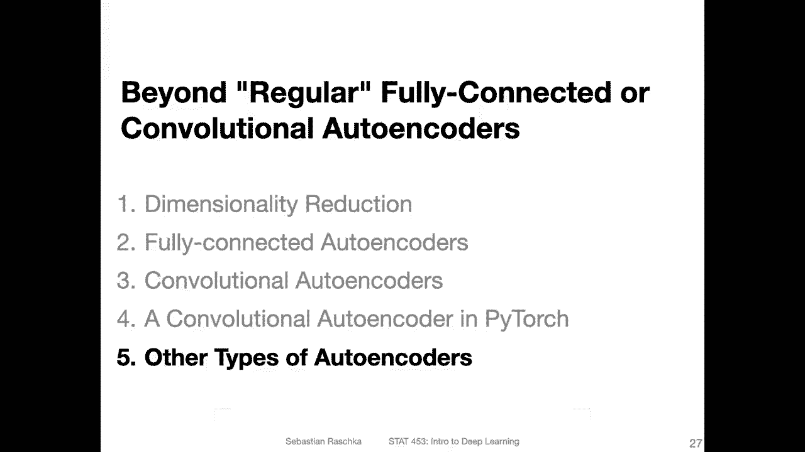

# P137：L16.5- 其他类型的自动编码器 - ShowMeAI - BV1ub4y127jj

All right， as the last video for today， let me briefly highlight some other types or variants of autoenrs。

So we can also add dropout to our out encoder so here if these are fully connected or convolution layers。

 we can enter dropout layers， dropout 1D or 2D， and this will cause yeah the network then coder to learn redundant features same with a decoder because it won't be able now to rely on particular features to be present because yeah as you recall from the dropout lecture。

Features will be dropped randomly， so it can't rely on a certain feature being there。

 and then it will maybe be learn to be more robust。

So you can use the idea of using dropout also to construct a so-called denoing auto encoder。

 So in the very first video of this lecture， I showed you this example where there was an auto encoder denoing medical images。

 So if you add dropout directly after the input it will essentially add noise to your image because right now。

 then half of the pixels will be。Yeah， will be removed， right。

 So you have this noisy representation of this input。

 But if you still have your reconstruction loss between those two。 So if this is your reconstruction。

Most computer between these two。 for instance， the two norm or means square error then。It will learn。

 essentially。How to ignore。The noise， right， Because the auto encoder itself， it only or the encoder。

 it only sees。These noisy images。And then it will learn how to remove the noise because it wants to minimize the  error between the。

Not den noise input and the output。Right， so in this way， you can。

Train auto encoders that to dennoise images。 You can also train it for doing other tricks like colorizing images and so forth。

 So there are different things you can do with these autoenrs。

Yeah， you can also have a sparse auto encoder if it's desired so in a sparse autoenr more than half so by definition a sparse matrix is a matrix where more than half of the entries are0 and you can also have then learn a representation where more than half of these are0 So how you can do that is by adding a L1 penalty So if you recall in the regularization lecture a long time ago we talked about L2 and L1 penalties。

 So if you're familiar from other classes that's similar to how L2 regularization rich regression and lesser regression work in the context of linear regression so we have this penalty term on the weights So here it's the absolute value。

For the L1 and for L 2， it's the square value。And this will。

If you recall cost as constrained optimization。 So we have still here our reconstruction loss between。

The input in the output。 So this is the reconstruction。Los， and now this is the one penalty。

So it will try to keep the weights small。At the same time， it will also try。So here。

 it's not the weights。 here it's the the encoded space。 sorry， So we are。

 it's trying to keep the encoded space。 the values is small while。Also。

 still minimizing the reconstruction loss， and it will result in sparse and beddings if that's desired。

 there might be an application where that's desired。 I don't know。 Okay， so lastly。

 the variation of auto encodeta。 This is more interesting now。

 So I don't want to go over it too much because it would be kind of a spoiler because we will have a whole lecture。

 The next lecture dedicated to this。 So in a nutshell， this is。

Approach where。We essentially。Learn the auto encoder such that this embedded vector will represent a Gausian Gaussian probability density。

And we can achieve that by also having an additional loss。 So here previously。

 we had this L2 pen L1 penalty added to the loss。 Now， what we have is we have。K L divergences term。

 added to the loss。So here this would be a while Well we have a we have both a reconstruction term。

And the KL divergence term。 So for the reconstruction term， we could use like here。

 the binary cross entropy or negative look likelihood。 So it's the same thing。However。

 we could also use the L2 or ME technically， if we will just want to create a good variation auto encode。

 it doesn't matter。 In fact， I would say L2 and ME work even better。And yeah。

 so we will talk about this in more detail than in the next lecture because， well。

 the lecture is already very long and if we have a dedicated lecture to that。

Why talking about it in one slide if I have or if I can have 30 slides， right， so with that。

 this is maybe a teaser for the topic that we will have next week。

 So okay so then that's it for today。

