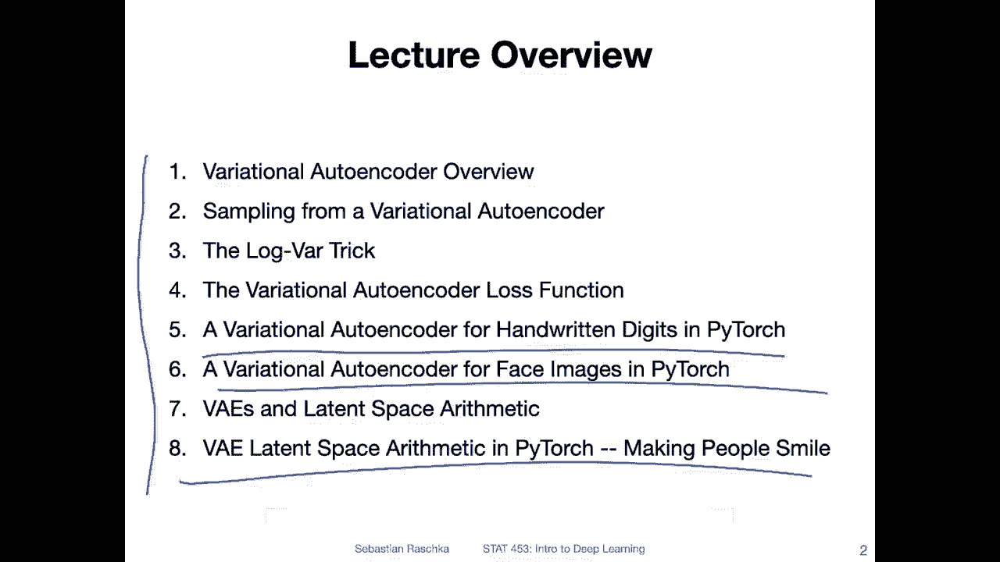
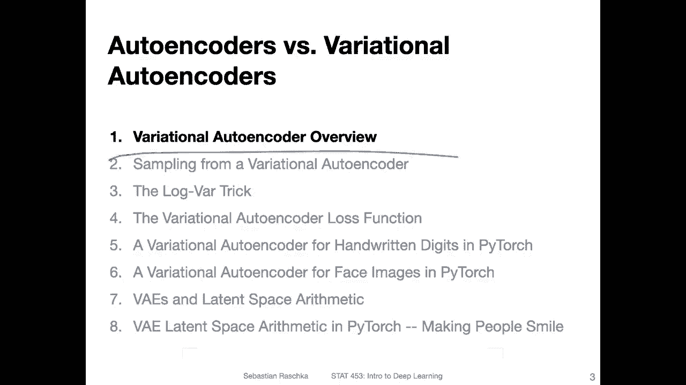

# P138：L17.0- 变分自编码器简介【课程概述】 - ShowMeAI - BV1ub4y127jj

Yeah hi everyone， so last week we learned about auto encoders auto encoders are special types of neural networks that consists of two parts。

 an encoder that takes an input and decompresses it into a smaller dimensional representation and the decoder which takes the smaller dimensional representation and yet reconstructs the input。

I showed you then an example where I was drawing a random coordinate from this lower dimensional space。

 and I was using the decoder to yeah create a new image that is somewhat similar to the training data。

 So in that way， we can think of it as generating new data。However。

 when we talk about higher dimensional spaces。 So if the lower dimensional space is more。

 let's say than more than two dimensions， this method doesn't work very well because yeah there are several challenges with that。

 I will go into more detail about that in this lecture。 So in this lecture overall。

 I want to talk about。Particular type of auto encoder called the variational autoenr。

 and this variational auto encoder is better for sampling new data so you can think of the variational auto encoder as a generative model that we can use to sample from a distribution and generate new data。

So in that way， it's kind of like a modified version of that auto encoder。

 particularly well suited for yeah creating new data。

 And before I go into too much detail about how that works。

 let me give you the lecture overview and then we will learn step by step how this variational auto encoder works。

 and I will show you also， of course， some code examples。 again， the Mist code example。

 but also more interestingly， we will take a look at a data set consisting of face images and then we will also learn how we can make people smile。

 Alright， let's get started。Allright， So yeah， these are our topics for today and really don't to worry。

 I know it looks like a lot 8 topics， but I'm really keeping it short this time。 I know that yeah。

 our lecture days are limited。 There are only a few days left in the semester。

 And you are all busy with， yeah， working on your class projects and other classes as well。

 I am aware of that。 So I don't want to make things too complicated at the end of the semester and just give you big picture overview of what a variational autoenr is here。

 And I only made 25 slides。 I'm very confident that I'm going to be able to finish this lecture within our regular 75 minute lecture time。

 And yeah， I also have code examples of course。 So with that lecture here。

 I'm hoping to give you a big overview， big picture overview of how a variational autoencor works。😊。

And I will also provide you then with some future references if you are interested because yeah there is also a lot of mathematical underpinnings behind variation autos which we can't cover here in this lecture。

 but some of you may be interested in that， so I will also provide further studying resources。

Alright， so in the next video we will start with the overview of what a variational auto encoder is。

