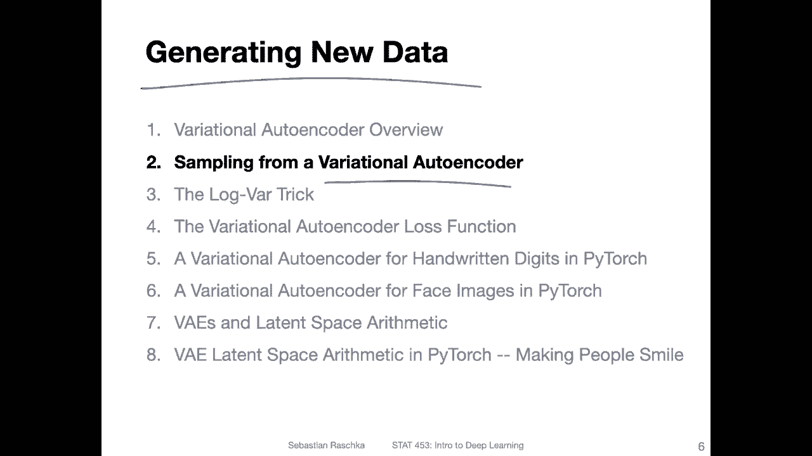
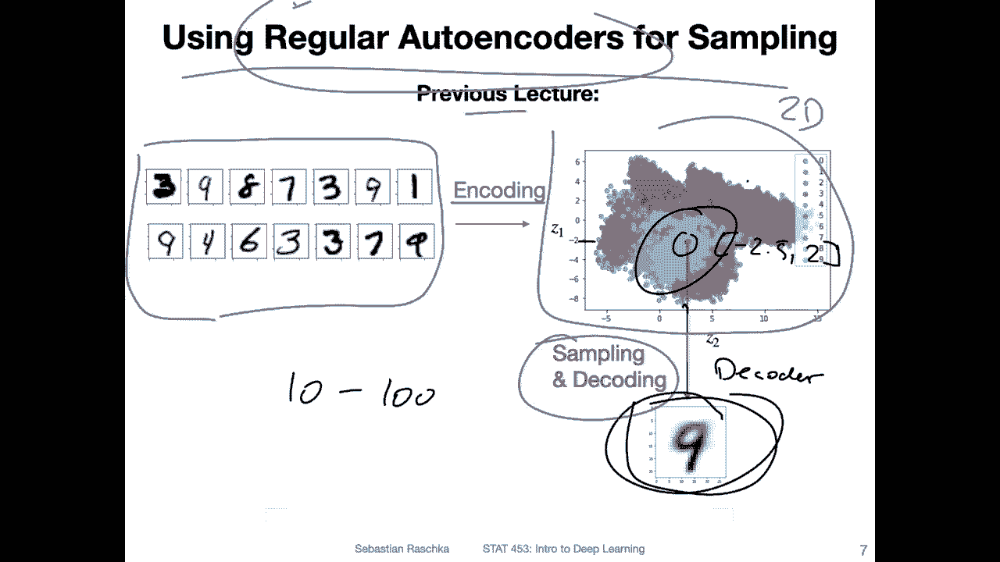
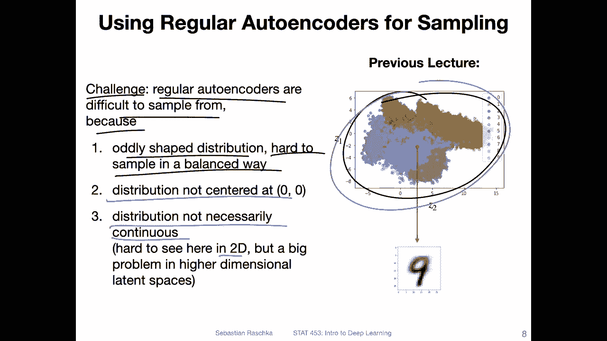
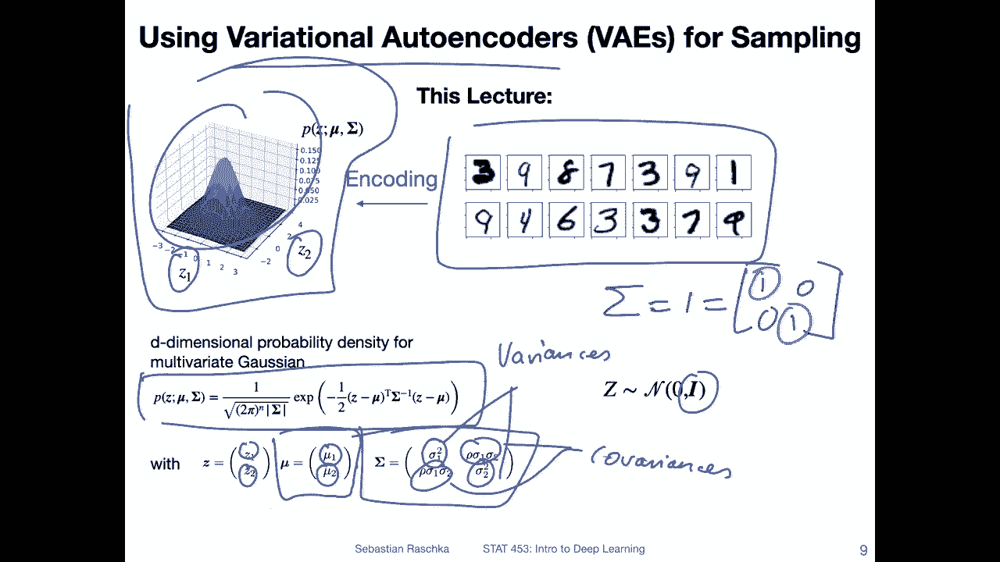
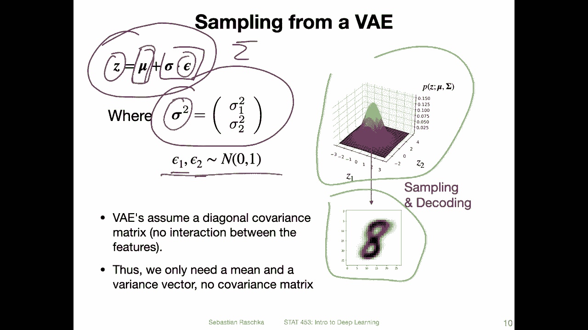
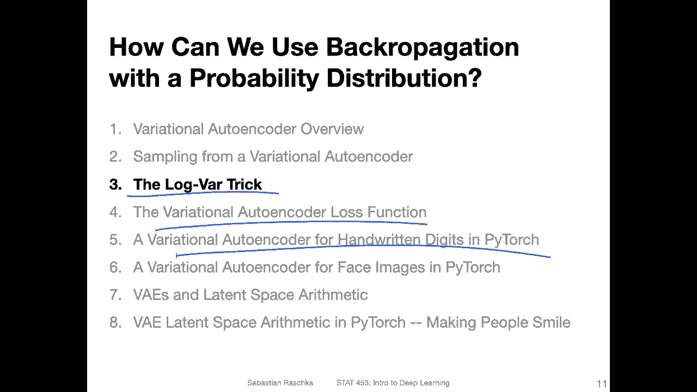
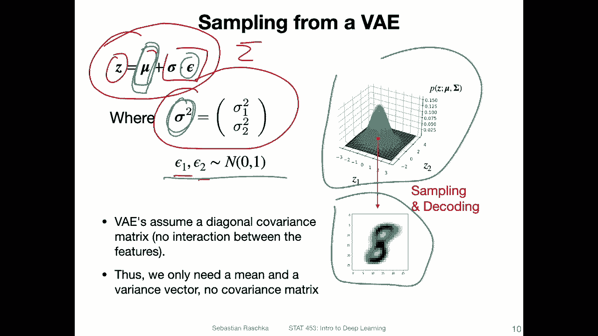
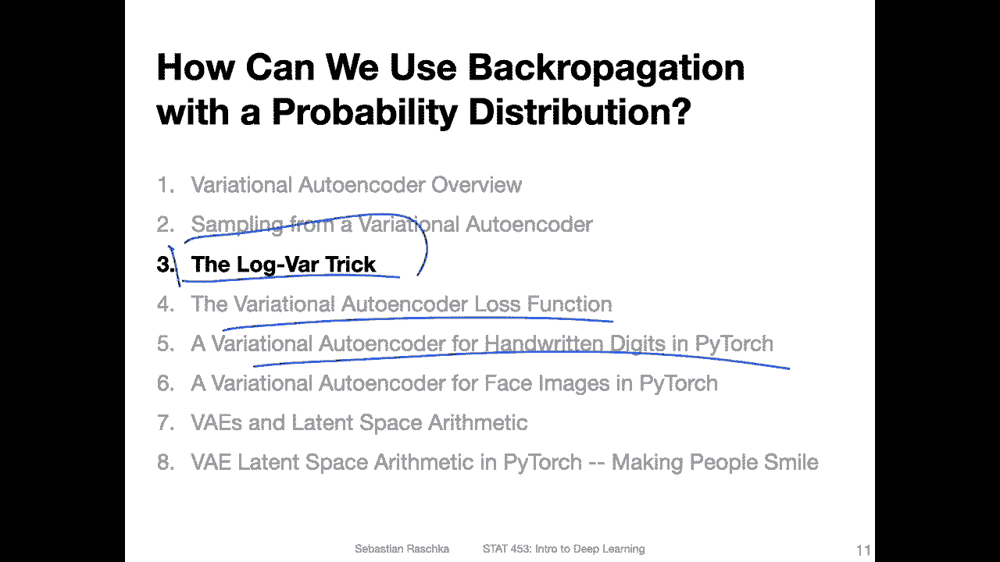

# 【双语字幕+资料下载】威斯康星 STAT453 ｜ 深度学习和生成模型导论(2021最新·完整版) - P140：L17.2- 从变分自动编码器采样 - ShowMeAI - BV1ub4y127jj

Yeah， so in this video， let me try to motivate why it might be better to use a variation auto encoder instead a regular auto encoder。

 And that is because in the variation auto encoder。

Because we force the latent space distribution to be a standard normal distribution。

 It will be easier to sample from that。 So it will be better for generating new data using a variation out encoder compared to a regular out encoder。

 So let me introduce the problem step by step。

So here is an overview of using a regular auto encoder for sampling。

 so the regular auto encoder that we encountered in the previous lecture。

 So what we did in the previous lecture was we took the MN dataset set。

And then use the encoder to encode it into this two dimensional latent space。

 Why did we use a two dimensional latent space？ Well， there was really arbitrary for my side here。

 I just wanted to have a two dimensional so that I can visualize it in a S plot so that you get a feeling of how it looks like。

But of course， the dimensionality is yeah relatively arbitrary。 I could have used a 3D， 4D，5 d。

 100 dimensional latent space representation。But yeah， of course。

 then I wouldn't be able to make a2D scatterap plot。And as a rule of thumb。

 the larger your latent space is usually you pick still something that is smaller than the input size。

 But the larger your latent space is the easier it will be for。The auto code to。

Yet encode the information in the latent space and produce good reconstructions simply because you have or you retain more information or you have the ability to retain more information in this latent space。

So， at the end。Of the previous lecture in one of the code examples。

 what I also did is when we had this latent space， I was just looking at it and picking an arbitrary point。

 think I picked something like say。-2。5 here。 And what's this on 2。So I picked a point。

 and then I put this through the decoder。 And what came out was handwritten digit。そ。

One aspect about this two dimensional space here in this auto code example is that it looks pretty crowded and。

Kind of continuous in this region here。But this is really because we picked a two dimensional space。

 If you have a very large dimensional space， maybe even like， I know，10 to 100。

These points would be already very far apart from each other。

 and this wouldn't be a continuous space at all。 So if you would just pick an arbitrary point in the higher dimensional space。

It would be not really guaranteed that it produces a valid image that looks anything like the input data if you put it through the decoder。

Just to yeah highlight the issues with sampling from a regular outr。 So it's。

 it's actually a challenge because。Yeah， regular output colours are difficult to sample from。

 The reason is that the distribution might be oddly shaped。 So here actually， it looks。To be honest。

 nicer than I expected。 But there's no guarantee that it is anything like that。

 like organized like that。 if you consider different data sets。You may encounter that。

These are really wly shaped distributions and wly shaped distributions make it really hard to sample from in a balanced way。

 right， So if you have Gaussian distribution， you know how to sample from the Gaussian distribution。

 But if you have some arbitrary distribution here like that。

 you don't even know what this distribution is， right。 I mean。

 how do you sample from that in a balanced way， it's kind of challenging。

 Also the fact that the distribution is not centered at 0，0 makes it also additionally higher， so。

Here， this distribution is just at some arbitrary location in some arbitrary fashion distributed。

 So it's really hard to sample from that in a way that we can generate， yeah， valid data points。

 I mean， the regular auto encoder is still good for。Compressing data。

 But if you want to generate new data data that looks similar to the training data， but is new。

 that is usually not so good with a regular encoder。And yeah。

 the distribution is not necessarily continuous and this is kind of hard to see here because it's only two dimensional。

 but if we would imagine a higher dimensional space。

 everything would be pretty far apart from each other and the distribution wouldn't be not continuous。

Let's now consider the variational out encoder so we still have the same MnesT dataset set。

 but now when we are training this variation outenr the latent space will follow standard multivariate Gaussian distribution so here just for example I have only two dimensions but of course like for regular outenr the number of dimensions is arbitrary。

So here this is just the density function of the multivariate Gaussian， so also here for reference。

 but I bet you have already seen that before。And yeah， we now have， in this particular case。

 two dimensions， so。According to that， the parameters are the mean vector and the covariance matrix here。

 So the mean vector with。The mean for each dimension and the covariance matrix with the varianceance。

For each dimension， the variances。And then here the covariances。However， we assume。

That the latent space at the covariance matrix here is a diagonal matrix。 so that it is。

 in particular case， an identity matrix。 So there' is no interaction between the features or in simpler。

Terms， the covariance matrix is an identity matrix。This where we have。

0 covariances and unit variance for each dimension。 So the variance for each dimension is one。

Just a standard， multivariate Gaussian distribution。

Then once we know this distribution and we can sample from this so we can draw samples and because this is a continuous distribution。

 we can expect that the decoder produces something reasonable when we sample from this distribution。

 So there are no gaps in this distribution。 it's a continuous distribution。

How do we sample from this？Here's how we draw a new sample Z。 So we have。

Star deviation times epsilon。Plus， the mean here。So actually。

 we don't need to use the whole covariance for that。 the covariance matrix。 I mean。

 because the of the a nodes are 0， like I showed you before。So， we only need to store。

A vector for the variance just to keep it simple。 So is just the variance vector and。

These epsilons here， they are drawn from a normal distribution。So this is the way we sample。

HowW do we do that， I will go into this in more detail in the next video has something to do with the fact that we are still yeah trying to train a neural network using back propagation。

And how do we back propagate through probability distribution？

 So I'll just give you maybe the short version now。 why not。

 because what we do or simply what we do is we store this mean vector and this let's say variance vector。

 There is a little trick to that。 I will explain that in the next video， but we。We， sorry。

 we store these two vectors here。And。Using those so we can use spec propagation to parameterize these vectors。

And then we use epsilon here。During the forward pass to sample。

It sounds maybe a little bit weird and abstract right now。

 but it will become more clear once I show you also the first code example。

 it will not be too far into the future only finishing up this video there will be a short next video and I will show you the code example。

 and then I think this will become clear。

So let me briefly talk about this lockbar trick， which will be kind of important for implementing the sampling procedure。

And then in the next video after that， oh， there's one more on the loss function。

 But then I will actually show you how this works in Pythtor。

 And I think when you see the whole code。I bet it will make more sense， why。

Why we。Want to store this mean vector and this variance vector。

 And also why we will use this lockbar trick。 Allright。

 so stay tuned for the next video on the lockbar trick。

