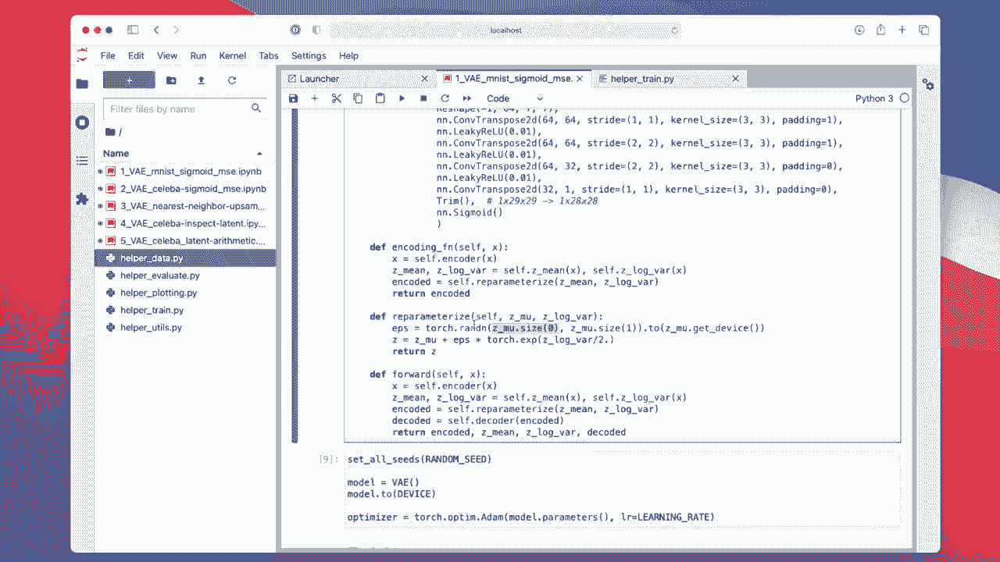
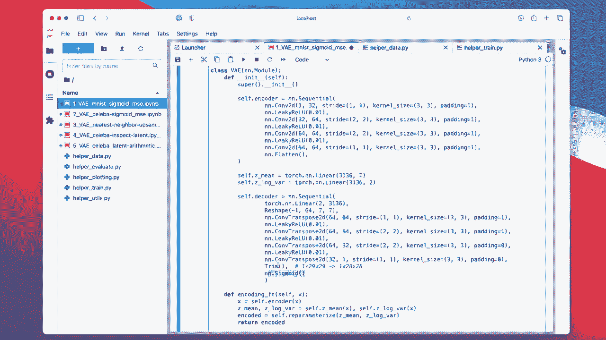
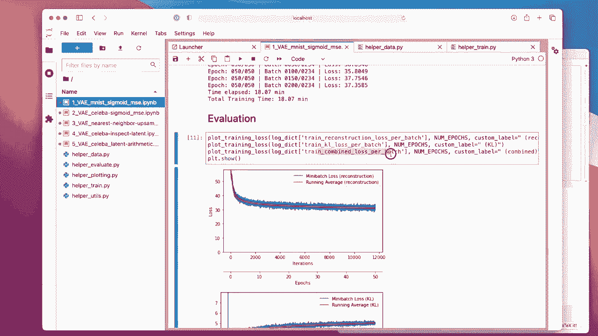
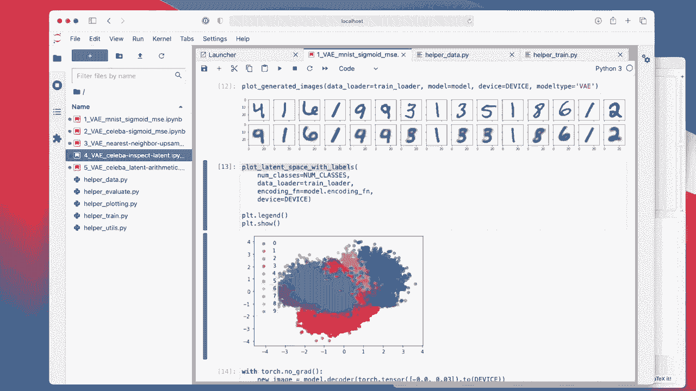
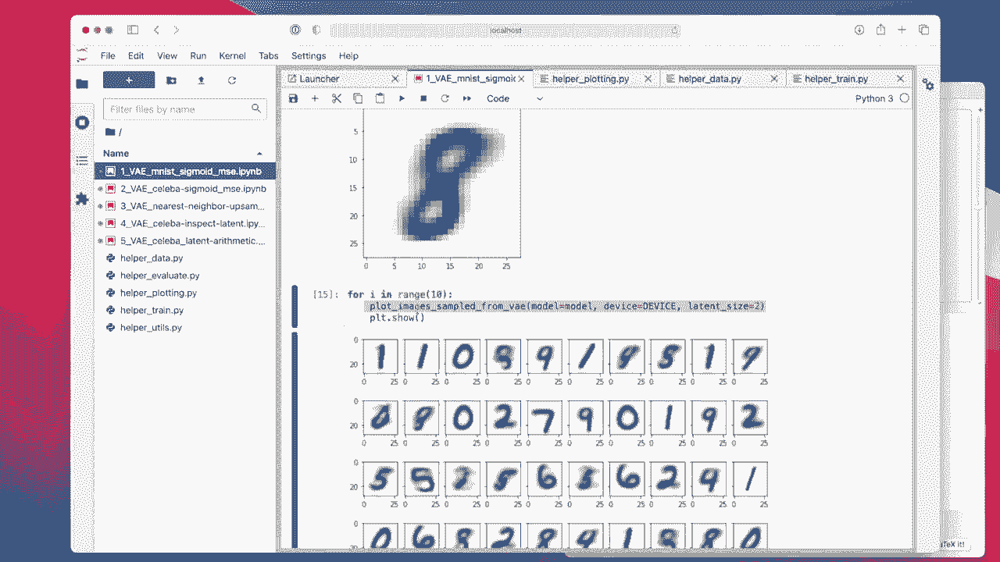

# 【双语字幕+资料下载】威斯康星 STAT453 ｜ 深度学习和生成模型导论(2021最新·完整版) - P143：L17.5- PyTorch 中手写数字的变分自动编码器 - ShowMeAI - BV1ub4y127jj

Al right， let us begin by looking at a variational auto encoder for handwritten digits in Pythtor。

 So this is our Mnines dataset set。 starting simple。 I have a bunch of code examples。

 I will show you one at a time， So starting with the simplest one。

 This is our variation out encoder for Mnes。 And I implemented it as a convolutional variational auto encoder。

 Of course， you can also implement it with fully connected layers。

 But since Mnis is an image dataset。 Why not using convolutional layers。 And also， yeah。

 the structure will be similar to the autoer encoder that I implemented in the previous lecture。

 except， of course， that we have the differences with using this mean and log bar vector。

 And then also having the K divergence term。 instead of just a reconstruction loss。 All right。

 one thing at a time。 So as usual， I have helper function So that the notebook is not too crammed。😊。

Actually， in the last couple of days I received a few questions from students regarding these helper functions。

 whether it's okay to use them in the class project and yes， of course it's okay to use them。 I mean。

 I actually wrote them for this class to keep things more organized because I'm reusing most of them from week to week and instead of copy and pasting the contents always in that notebook here。

 I thought it's more organized to have this as separate functions。

 for instance in my helper train function I have still the classifier function that we used before the autoenr。

 the regular autoenr then the variation autoenr and so forth。

 I feel like instead of copying all that into the main notebook for all the five autoenrs here。

 having it one time here and importing it as kind of cleaner and more organized and you are of course welcome to reuse everything that you can find here。

Also with any kind of code you find on GiHub， chances are that you are free to reuse it。

 usually especially in educational contexts， you just have to cite the source so that it's clear that it's not your code that it is not plagiarized if you make clear where you have the code from。

 but if you show where you have the code from， then it's usually fine to reuse the code。

Of course， there may be certain types of code that have a license that don't permit that。

 but unless it's stated explicitly for educational purposes， it's of course okay to reuse that。

And yet my code is written， Ive wrote this especially for educational purposes。

 so please feel free to use any of that for your class projects。

But yeah， moving on。 So I have my helper functions when the time comes in the code。

 I will explain what they are doing。

嗯。Here， this is like usual we have our boiler plate。

Bge size1 56， small learning rate，50 epochs。 We don't need classes。 Actually。

 I don't know why I headed there。 Probably copy and paste  errors。

And we are using the M data set。 we don't need validation data here， because yeah。

We are only u， I mean， variation auto decors are unsupervised。 We are only using the images。

嗯。Yeah， here I am just checking that the dataset set works。 Again， we don't need the labels。

And here it's the main model where it gets interesting。 So similar to the regular autoer encoder。

 I set it up using an encoder。

And a decoder。Both cases using sequential here。 So this is。Several convolutional layers。

And I should say the latent space is size 2。

So what I'm doing here is I' am compressing it。And then here I am reconstructing it into the original space。

 So Emnes is 28 by 28。

Here I am having a fully connected layer followed by convolutional transpose layers or transpose convolution layers。

And then I have this trim function， the same one that I used in the regular autoenr because it happens that it will be 29 by 29。

 and the original images were 28 by 28。 I'm just trimming the last pixel here。

Okay， so there's one thing I have not talked about that is kind of the essence of this variational auto encoder。

 what makes makes it different from the regular auto encoder。 So for the regular auto encoder。

 we may have had something let me put it like here。We may have had something。Like this。

Where we had30。1 out 36 up to2 if I want to have a two dimensional latent embedding。

 I would have it like this for my encoder。However， since this is not a regular auto encoder。

 it's a variational auto encoder， we are going to work with this。Mean vector， the mu。

And the lobar vector。So both I use for both fully connected layers to compress whatever this is into a two dimensional one。

And the same thing here。 So they are separate， separate models， because if I would use the same one。

 well， then the mean in the log variance would be the same if I use the same linear layers。

 I have to have two linear layers。

And now let me show you how I actually use them。 I think it makes more sense then so。

Let's take a look at the forward method first。 Then I will explain you why I have this method。

So in the forward method， first， like in the regular auto encode， I'm calling the encoder first。

 So this is encoding。My image into the two dimensional space。So let me bring up。

Maybe on。Slides here。说的事实。Encoding into my two dimensional space。But we are not quite here yet。

 We are somewhere here now in that orange part， and then。

What we want to do is we want to get this mean vector and the logvariant vector。

And then we call this。Reparmeterization function。 So here we will have two vectors， so。

It's maybe a little bit unfortunate that I'm showing it as one， but it would be actually two vectors。

 mean and the lo variances。

And then we call the self do repar rise here on these two vectors。

 And what is going on here is that I' am sampling this epsilon from random normal distribution， so。

Here， this is equal to the input size。 So if we yeah if we have a batch size of 256。

 it will sample 256 of those。

Okay。See。So this is where we are here， this epsilon。 So we are sampling now the epsilon。Here。Let's。😔。

This one。

And then we are doing the rippermeterization here， the mean vector。Plus， the epsilon times。

 the standardner deviation。 So this is the standardner deviation。

 Why is that the standard deviation that is。

The lock bar trick， where did I have it。Here。

So this was the lock qua trick because this allows us to have。For this one。

 positive and negative values， instead of just positive values， it is better for back propagation。

And this is essentially， yes， So this whole step is。Is the step here。

Right， so then we are returning Z。 And this Z here is。

Is this Z here in the center that I'm showing you。 So I'm not showing you the mean and lock bar vector。

 I'm only showing you the Z here that。It comes out of here。Okay， so。Reparmeterized。Then returns O Z。

 I called it here and it。 I could have also called it Z。And then。

We are decoding using our deco and our decoder takes this Z back to the 33136 and then runs through the convolutional transpose layers and reconstructs our input here I have the s mite。

 So the pixels are in the01 range and。

And where is it。

I， I have to go up。 I think now it's in a data load and a data loader。 I should probably show you。

And the data orderer that we are that I' am not using any particular train transform and test transform and by default。

 how I implemented this at Cypher 10， sorry。

Where is Mist， US Mist。Same thing I have this torch to tensor it will automatically convert images to 01 range if we use a normalized function that such that let's say the pixels are between minus1 and 1 that would also work。

 but then we have to make sure that we use a 10 h here。

Because we want the pixel ranges between the input and the output to be on the same range because we want to have the MSE。

 right？ So if the input pixels are between 0 and 1。

 then the reconstructed pixels should also be between 0 and 1， so。

Going on here。Again， the forward method。I'm calling the encoder。Do the repromanorization。

To get my latent space， this includes this epsilon from the random normal distribution。

Then I'm calling my decoder and I'm returning a bunch of things here。

That's what I need for my。B proagation， I will show you in the training， I need all four of those。

Later， I will。Do some investigation and some experiments。

I will show you some interesting experiments later for which I implemented also this encoding function。

 So this encoding function is maybe overkill to implement that I yeah。I mean， why not。

 So I in this way， I don't have to run the decoder every time。

 So the encoding function just re returns Z。 So it's basically just it's this part。

 if you take a look at this。If I just copy it below here， you can see that's the same。

Same thing here， right。 So I just decoupled it for some reason。 I could have actually。

Could have called it。Here on。An x， for example。Like this should of also work。

 except that I want these two for the loss function。

 I think that's why I have it as a separate function， instead of doing。doing。This， but yeah。

Just a minor implementation detail。 So I have this also separately if we want to do some investigation later with some functions I've wrote。

 So yeah for here for this notebook， you can actually ignore that it doesn't do anything here。

Okay， so explain to you the thought path。 so which is now encoder。The repermatization。

Oh should probably。Reprimeterization。 and then the decoding。

 and then we returning these things in the regular out quarter， we only had。This， essentially。

This was our regular。Alder corner。Now， we have。

Oops。Also， this reprimeterization， mainly in these two vectors。

Okay， let's initialize everything here and then we run the training。

Now， let's take a look at the training function。I actually here。

So it's my training function here。

We have actually two losses now， so by default amusing them as e loss。

 we discussed this briefly in the video why we don't use the binary cross entropy here。

The rest is boiler plate like before。 So this is just。

What we used every time I just used this one here， the underscoreco。

 instead of usually we had something like labels or targets here。

 where we don't need labels or targets because it's an unsubervised model。

 So I just replace it by underscoreco。 underscoreco and Python is a convention that we use if we don't use the variable。

 But we， but the variable is there。 we just use an underscoreco。

Okay， so we have the features here from our data and then。

Here， I'm calling model。 So model will call。

Execute forward。

Gives us these four vectors here， which this return from here。

And then I'm computing now first， the k KL divergence term。 So this term here， that's computed is。

I had it somewhere。

Here， so is this this term here that I discussed in the video。

And notice that I'm using， I'm summing here over the latent dimension， so。

The sum here is over the latent dimension。 I forgot to have the index under the sum。

 but this is for the latent dimension。

Not for the batch size。We have then if we want to compute the average k divergence over the batch size。

 we call them the mean here。 So if I would。Not have x's here。

You will probably get really bad results because it will sum over everything。I mean。

 sure why not but。You should first sum over the latent dimension。

 and then you can average over over the batches。

Okay。嗯。Yeah， and then we compute the pixel wise mass。 So this is our reconstruction mouse。

Here it's calling loss FN， which is just loss function。 And by default。

 if I don't specify it at my function， it uses the means called error loss。

And the means square error loss is。Between the decoded ones。So the reconstructed ones。

And the inputs。 So this part here is really， yeah， the reconstruction is here。

 This is what you see at the top here。

I'm reshaping it。So that it's the batch size and the vector。 So instead of having a tensor。

 it's now a matrix。

A table， if you will。 And then we first sum over the pixels。 It's。

 this is equivalent to summing here over the latent dimension。

 So we are summing first the square arrow over the pixels。 So this is essentially， yeah this。

 this sum here。

I haven't done a reduction。 Okay， I could have I forgot kind of think it should do it means square。

 I forgot the the square root， but doesn't really matter。

So， I don't have a。There shouldn't be a square root， to be honest。Because it's the square here。

Me change that。

啊，知道。

When you can have a square root， doesn't really matter。Okay。

 so that's not the Euc clan distance anymore， but the square Euclidean distance。

It doesn't really matter here。Anyways。

Okay， so we have no pixel wise here。 with sum over the pixels。

 and then we average over the batch dimension。

That's where our mean comes from。

Okay， then we compute the overall loss and the overall loss consists of two parts。

 the reconstruction。 Oh sorry， the pixel wise loss and the k divergence term。

 And here I have an additional。

Pramat。 So I should probably also have that in the code。So， let's call that。

L 1 is the reconstruction。 Let's call it alpha。Because it can give us a weight because。

It may not be clear。Mean， they may not be in the same scale really depends on the images。

 So it's kind of a hyperparmetera。 It's like saying how much should the model focus on the reconstruction us and how much should it focus on the KL divergence term。

 if we don't use alpha if we if we set alpha to one， then there will be equal weight。

 but might not work well in practice all the time， So it's another hyperparametera。

Okay， yeah， and this is essentially。 And then we can run our big propagation as usual。

So just to recap， compute the Cal divergence term， we compute the pixelwise term。

 and then we add both together。

And we are training it， this is just a logging like usual， nothing new here。

 So let us take a look now how it trains。

You can see it starts with a high loss， and it goes down， which is nice。

Because going more slowly。

Yeah， so I actually have two plots here。 I have this plot training loss function that I used before。

 now I'm doing it with a reconstruction loss per batch。

 the train the k divergence loss and then the combined loss so you can see first is the reconstruction loss it goes down。

The ks。Goes down， But then goes up。

Well。And the combined loss。It's kind of a trade off， right， But the combined loss。Go down。

Yeah， so overall， it goes down。 And what we can see is the auto encoder is able to。

Generate realistic looking images。

I mean， kind of。 So again， we have the same problem。 It's only two dimensional。

 which is kind of extreme。 So you can see sort of top row here is。

Original images in the bottom row is reconstructed images。And you can see， okay。

 it confuses four with a9， but most of the time it looks kind of okay， okay， it's blurry too。

 here have5 and3， it gets confused， but this is really because the space is so cramped。

 So let's take a look at the latent space here。

So I'm also showing the class labels here。 you can see， okay。

 it's a bit cramped because it's two dimensional。I don't like this overlap that thinks overlap。

 but well's。

what happens here， but it looks slightly better than for the regular auto code。 unfortunately。

 I don't have it here for reference。But what you can see also now is that it's centered at 0。Right。

 the distribution centre at 0 and it looks like Ga seeian mixture at some point。 I mean， kind of。

 I mean， we can't go by class tables because it doesn't use the class tables。

 We would have to go by dimensions。It's hard to see here， but I have actually。

 for a high dimension one。Histograms looking at the distributions per dimensions。 it。

 it can be like it's hard to see because， yeah， we can。 it's too much going on here。 It's to dense。

 but it could probably be a。Multivari standard goes in at some point。 I mean， here we have some。

Lets so。Nice。

Shape， but yeah。With a little bit of squinting， it looks quiet， okay。

Yeah， and then we can sample from that distribution so we could just take arbitrary points from a standard normal distribution and then sample。

 So here I'm just taking one point。

The center。Should be。0。03 somewhere here。 and it reconstruct an 8。 So 8 is actually under this 9。

 It's kind of unfortunate。 So it's reconstructing the 8。

And here we are sampling now。 So here， I'm just sampling from random normal distribution。 Let me。

Show you that plotting。哦。

What was this function called plot images sampled from the A E。

It took me a lot of time to implement all that。嗯。Mike， oh， I should be in。

Yeah， the button。So yeah， here what I'm doing is I'm。

Sampling from a random normal distribution。 So R n is a random normal distribution。嗯。

Sampling a given number of images here 10。

L in size。 I'm sending it to2。

Here， because that's how I trained my autoenr。Then。Notice that I'm not using the encodeder here。

 I'm only using the decoder here。

It's all amusing。Yeah， and then I'm plotting。

So heres is some follow loop。

To do the plotting， this is very similar to the regular auto encoder code。

 I just copy and pasted it and made a small modification， but essentially。

This is just plotting these images， and these are just sampled from a random normal distribution。

You can see they look mostly reasonable。

Not all of them。 This is garbage。 this， this， but the ones look O。 the sevenths look O。

It's look okay。 I think many of these problems are that。

Yeah， in our case， we only have a two dimensional space， so things don't look great。

 but it doesn't look terrible either。 So if you make the a latent space a little bit bigger。

 it will look better， but yeah。

Okay， so this is our variational auto encoder here and。

I will stop this video and then I will show you more interesting oneworth face images。

