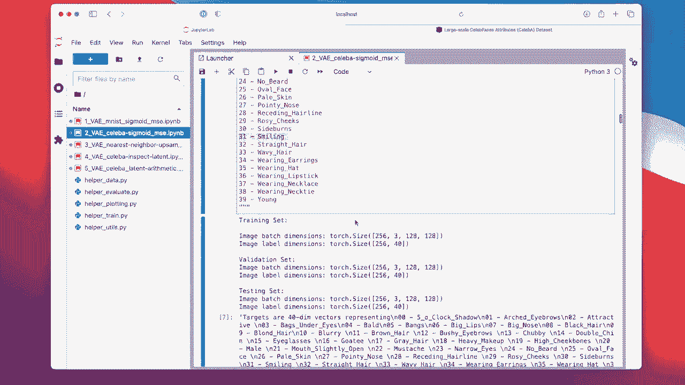
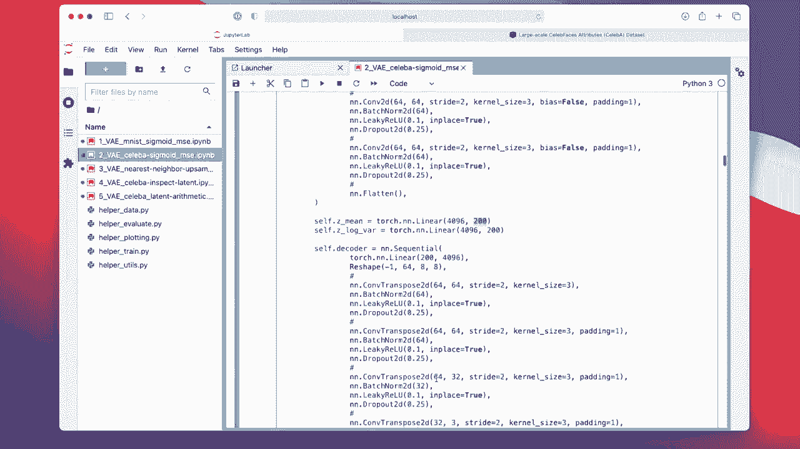
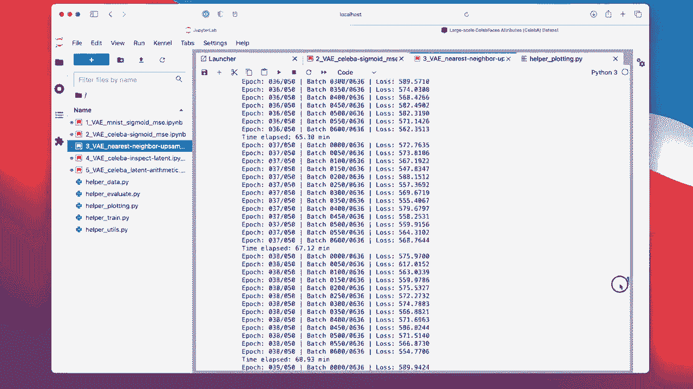

# P144：L17.6- PyTorch 中人脸图像的变分自动编码器 - ShowMeAI - BV1ub4y127jj

All right， let's take a look at another code example。 Now， a more interesting one。

Focusing on face images instead of1written digits。 So we are going to work with the setup a data set。

 Main also， the auto encoder will be a little bit bigger。

 So the variation of encoder is now based on this paper here。 We have three colour channels。

 and we have a much bigger latent。Representation 200 instead of two dimensions。

 That's just because also the data is more complex than just Mnes digits。

 We also have colors and other things。 face images I are more difficult than or more complex than hundredwritten digits。

 And then this also includes batch normal and drop out to get better performance。

Alright， so。He has the code notebook， the second code notebook notebook I will share。

 and we don't need that。 And now we are using the setup a data set。

 which is also part of Torch vision。

So。Can find it here， actually。 So Sllip A is a large scale face image dataset set，202000 face images。

5 landmark locations and 40 binary attributes。We have some examples。So they were scraped from。

 I think， Google， like from the Web， usually most of them are celebrities， and they are。

Available on Google Drive or Baidu Drive。

Dropbox usually doesn't work， because it's。Limited， like there's a do not limit。

 and usually every time I try to download this data set， this do not limit is reached。

 So I think they even don't allow it anymore。

Okay， here here。 Actually， these are the dropbox links。

 but probably want to use the Google Drive or Baidoo drive。

Okay。So。He again， starting with the boiler platelate。Like we had in the regular or corner。

One thing that is new is we are now center cropping。

So that you will see later it's only focusing on， on the center of the face。

I think I forgot actually original dimensions， I think it might be 200 times 240 or something like that。

 so but we are cropping that it's only the face， not the background。

I try to normalize it to -11 range and then use the 10 h。

 but I didn't notice any improvement rather the opposite。 So I kind of deactivated this again。

 So the pixels will be in the 01 range just like before for Mest。Yeah， just testing the data lot。

 Not， Yeah， I just copy pasteed from the readme file， the different。Attributes。

 the 40 binary attributes that they list。 So we can later do some experiments with us。

 So they have yeah different。Attributes as labels。We are going to work with a smiling one later。

But here just for reference。So here in this notebook that we are not using those because yeah。

 auto encoders are unsupervised models， unless we talk about conditional auto encoders。

 but they are not part of this lecture。

Okay， so here's my implementation。 It's fundamentally very similar to what I showed you for the Ms。

 so。Differences that we also have now batch norm and dropout。

And our latent representation is 200 dimensional。

But except that it's the same concept。 So I have actually kept everything the same。

 So I don't have to explain this again。 So this is all the same as before。

The interesting part is really it's just a different data set。

 I actually saving this model this time because I want to do some analysis with that later。

So。It's training。

Training for a long time， It took almost one and a half hours on a GPU。 Yeah。

 it's a large dataset set。Okay， so we can see the losses。

 maybe training further could have helped a little bit， but it looks quite converged。

Yeah， and then here I actually had an anorizer。

For。Basically bringing the images back to 01 range， because the Maclib function doesn't like it。

 the image show if values are negative， So it looked somewhat weird， but since I'm not normalizing。

I don't need that。 I I commented this out so you can actually ignore all of that。

 The pixels will be in 0，1 range。 So here in the top row， these are the original images。

 And at the bottom are the reconstructed ones。 You can see。

They are， of course， not as sharp as the original ones， but it looks quite okay， I mean。

Given that this is like a。Basic model， it kind of。Yeah， reconstructs these face images。

In the next lecture， we will work with GNs， which give us a little bit better results， by the way。

Okay， so this is really reconstructed just to check that the auto encoder is learning。

How to reconstruct images。 Now， let's take a look at the sampled images。

 So here are images that I sampled。

From a random normal distribution。 So again， this is the same function that we took a look at before when we talked about the Mnes one。

So let me just open this again。This is this plot images sampled from VIE。 So I'm here。

 I'm just really。

Sampling from a random distribution。And then these are the reconstructed ones。

 And these are all face images that are not from real people。 They are just randomly generated。

You can see some of them look reasonable。 So this person looks like reasonable。This person。

 some like this one doesn't really look like a face image。This one may be not hard to tell。

 So some look better。 This looks maybe not so good， and this doesn't look so good。

 but many of them look quite okay。Yeah， it took me quite some time to put the code together。

 so I could probably get better results， but it would take me a couple of days。

 it's a very laborious task to do the tuning and every time you have to wait one and a half hours。

Anyways， so I actually also tried using nearest neighbor up sampling instead of the transpo convolutions that's shown here。

So， here I have。TheU sampling， followed by a convolution layer。Compared to。

Let me scroll up again compared to just a trans convol。

Let's see the results personally， I don't think the results are better or worse。

 I think they look pretty much the same。 So because there was a question whether in on Piazza。

 whether the up samplingling that we discussed in the lecture。

Is better than the trans convolution。 It's hard to tell， to be honest， so。I mean， there are。

 of course， different face images， but I wouldn't say。The quality of one is better than the other。

 It's pretty much the same。 So back to the point， it doesn't really matter in practice。

 whether use the trans post convolution or up sampling， followed by convolution。

In the article I linked， they recommend up samplingling because of these checkboard patterns。

 But yeah， if you are careful like here， I don't see any checkupboard patterns。

 so I wouldn't worry about it。And as you see them， then you can always switch to up samplingling or fix the kernel sizes。

Alright， so this is， yeah， the。Variation auto encoder for face images。 added some follow up analysis。

Here， just taking a look at whether the latent space is now indeed or is following a normal distribution since it's now 200 dimensional and not two dimensional。

We can't simply do a scatter block。 but what I did is a histogram。 So here this notebook。

 I'm just having the regular setup。 just copy pasted it from the previous one。 This is my model。

 And remember I saved the model。 So this is just copy and paste it。 So if I go here。

To my training。

I just copy and pasted everything from here。To here。Then initialize the model， but now。

Instead of training it， I'm just loaduding it。 I could have done it at the end of this notebook here。

 but it was already so much information that I made a separate notebook。嗯。Yeah。

 and now I'm just taking a look at the latent dimensions， so。

This is just like a laborist task where I this is why I have this separate encoding function。

 So I'm encoding all the images， but instead of doing it for all I only do it for 10000 because I noticed otherwise it would just take too long。

 So I'm only doing it for 10000 for the first 10000 images， I am encoding them into the embeddings。

And then I am plotting the histograms for each dimension。So， in fact。

 I'm only focusing on the first 25 dimensions because also it's just to because it took too long if I took all images and all 200 dimensions would be large plot。

 So I'm only showing the first 25 dimensions here of the latent space。

And you can see based on the histograms， they look in each dimension。

 like as if it is standard normal distribution。 I mean， quite normal。

 centreed at 0 and roughly variance  one。

Okay， so this was showing you how we can train。

I to encoder on the S a images in the next video， I will show you something interesting how we can do latent space arithmetic。

 So instead of just generating images， I will show you how we can manipulate images。

