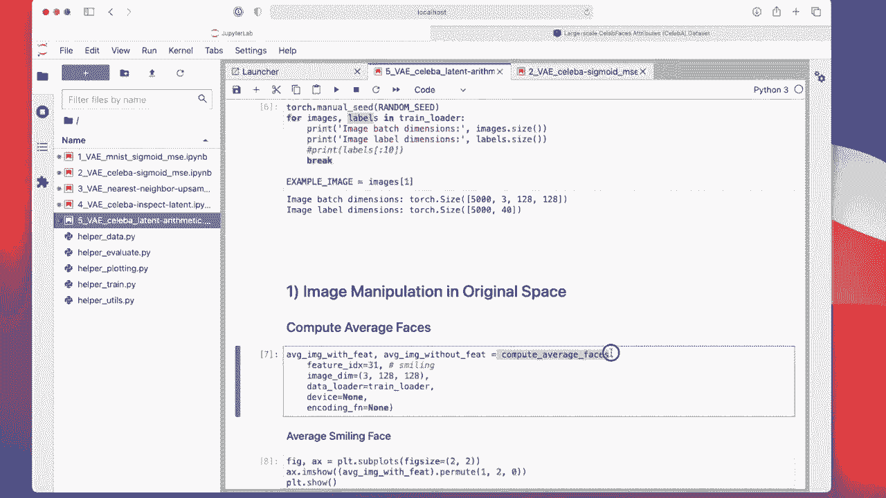
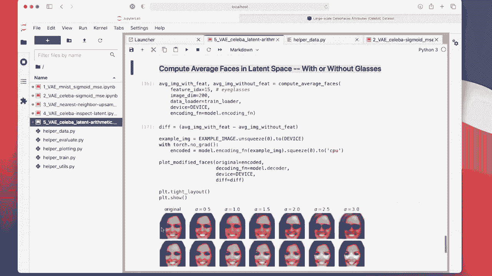

# 【双语字幕+资料下载】威斯康星 STAT453 ｜ 深度学习和生成模型导论(2021最新·完整版) - P145：L17.7- PyTorch 中的 VAE 潜在空间算法 - ShowMeAI - BV1ub4y127jj

Yeah， I'm not sure how that happened， but we are already at 65 minutes in this recording。

 So we only have 10 minutes left。 So things took longer than I expected， like always。 So， but yeah。

 we only really have one more topic left for today that I wanted to talk about because that's more like a fun topic。

 So this topic is on manipulating the latent space or doing some latent space arithmetic。

 We are going， in particular， going to focus on the variational auto encoder that we have trained in the previous video。

 on the setup a face images and what we are going to do as we are going to take some of these face images and making the people smile more。

😊。

So let me give you the brief outline of what we are going to do next in a code example so。

Imagine we have this latent space here。 So， of course， if you recall the previous video。

 we had a two dimensional space at 200 dimensional space。

 and here I'm only showing a two dimensional space。

 This is just because it's easier to draw this in a two dimensional space because I can't draw in a 200 dimensional space。

 So but the concept is the same。 what we are going to do is first we are going to compute a smile vector。

 So we are going to average the embeddings of all the people that are smiling。

We actually know who is smiling because when I go back to my notebook here。

Notebook 2。 we or I told you that there are these 40 target。

Vectctors or attributes。 sorry， in setup A。 So this is provided in this data set。

 And these are these 40 binary vectors。 and one of them is smiling。

So we are going to focus on all images where smiling is true。And then， we are going to average them。

Oops， we are going to average them in this latent space。

 and then we are going to do the same thing with people who are not smiling。

 So people without a smile， we are calling this the no smile vector。Then what we do is we take。This。

😔，Smile vector and subtract the no smile vector and get this difference vector here in green。

So this is a different vector pointing from no smile to smile。And then given a face image。

 let's call that also here these is the embedding。 So let's say we have the embedding of a face image。

 Let's call that original face image。What we are going to do is to this embedding of the original phase image。

 we are going to add this different vector multiplied by scaling vector here。 Al。

 it's a hyperparameter。 It's kind of determining how much。Of the smile vector we want to add。

And then we obtain this new vector， which yeah， is basically a。

The person here that is smiling more if alpha is number， let's say larger than 0。

Okay。Yeah， so let's do this and see how that works。 So here。

 I have a code example where we are working with。The model from notebook 2。

 the variation of auto encoder trained on setup A。 So I'm importing the only three functions this time。

 One is just the data lata。 One is for computing the average paces and one is for plotting these modified faces。

So this is the same as before， just the data loaddown。And here we are now also loading the labels。

 So the labels are 40 dimensional vectors with these 40 binary attributes。This year。

And here I have a function to compute the average phases。

 So I'm starting here in this notebook that are two parts in this notebook1 is the image manipulation in the original space。

 I just want to motivate why we want to do the latent space arithmetic and why we don't manipulate the original face images like in the original space because yeah in the original space it doesn't work quite so well and it will show an example So here this function is computing the average face image with a given feature and without a given feature and this feature here I'm choosing is smiling because I'm using the feature and X 31 31 this is really like smiling here from this list。

So let me just show you how I computed this， how I implemented this compute average faces function。

 So if we go to data here。

Should have it somewhere here。Data on， compute average faces。

 So what I'm doing here is I'm just initializing these to 0。Then， I'm iterating。Over。All the images。

Later， I will do the same thing with embedding， but for now， we don't do any embedding。 We just。

 can ignore this part。 We are just averaging， so。If encoding function is none。

 I just call embeddings the images。When you read here embeddings。

 this is just the original images for now because I don't， I don't set encoding function to anything。

 so I don't。

Have it specified here。I have it to none。This is because later we can reuse the same function with the actual embeddings。

 but for now， we are not using embeddings。 So what I'm doing here is now I'm averaging。

So， I'm averaging。The ones with the feature。So。There is something called index image with feature feature Fe means feature。

 And this is corresponding to all the images in the batch that have that feature。

So that's how I find it out。

It's maybe a little bit complicated to wrap your head around this。 like best just by looking at。

 it might be yeah interesting。 Well， might help to play around with that。

 But like I mentioned before， the label vector here is is actually a matrix。

 It's a 256 times 40 dimensional matrix。 So for each image， we have a vector of 40 binary attributes。

And then this one here。 So what I'm doing is I'm selecting all。Images， and then I only get。

The position of my feature index。 And I set the feature index to。31 to smiling。

And this is either 0 or1。 So 0 means no smiling， and one means smiling。

And then I'm converting it to a bull， a boolean vector。

 which is either true on faults or true true or falses。 And this will be then essentially。

Index of true and false， a mask。 And then I'm selecting， so。

This will be giving me an indicator which images。Smiling at which I'm not smiling。

 It will be eed like true faults， fault， faults， true， false， faults， true。

 And here now I'm selecting。From my images， from the batch， which one are smiling。

 And this one means here this wggly thing。 The tilde means not smiling。 So I'm selecting smiling。

 And here I'm selecting not smiling。 So I'm just adding up。

 So I'm summing them over the batch and then add that to my average image with feature。

 So these are the smiling。 And these are the not smiling ones。 I' just adding them up。😊。

And then I'm also counting the number of images with feature and counting the number without feature。

So the number of smiling and the number， not smiling。

 So and this for loop goes through the whole epoch。 in the end， when this whole thing is completed。

 I have the sum of all smiling ones and all not smiling images。

And then I divide by the number respectively， and this gives me the average。

 And then I'm returning these averages。

Okay， so let's take a look at how the results look like。

So， this is。The average。Image of all people， smiling。It's it looks likes on the average smiling。

And this is the average， not smiling。You can see there's a difference， right。 So this small smiling。

 this is not smiling at all。 So given a face image。Can we manipulate this face image？That。

This person is now more smiling。

Let'll many more。So， smilingness。So I'm computing the different vector here。

Here it's more like a difference matrix。And then， I'm。In the top row， I'm adding， smiling。

 and at the bottom row， I'm removing， smiling for the top row actually looks pretty good。

 so we can actually make this of a person smile more for the bottom， it doesn't work quite so well。😊。

So this is done in the original space。 So we can actually， just by adding this average face。

 we can make this person smile more。 It works actually quite surprisingly well。 You will find。

 though it won't work with all the。Different attributes， you can play around。 I mean。

 instead of using smiling here， you can play around and use。Any of these here， right。

 So we will find for some it will work better or not。

 So we could technically do this in the original space like I'm showing you here。

 But yet now we are doing the same thing in the latent space。 Usually。

 if you have a good high resolution model that can produce good reconstructions。

 you will find in latent space， you can do way more fun things。

So this again， my auto encoder， I'm not training it here。

 I'm just loading it like before I'm loading it for my second notebook。And now I'm doing this。

 computing the face or the averages of the smiling and not smiling。

 using my latent dimension and I'm using here this encoding function。

 So if encoding is set to a function。

It's。Yeah， and it's encoding my images。 So I'm using now the actual embeddings。

 So recall from before， this is my auto encoder here。 So from before we have this encoding function。

 which is calling encoder。

Then doing the repapaterization and so forth。So， here， I'm encoding。

And then what I'm doing is I'm computing the difference vector again between with and without feature。

And now I'm plotting and you can see， of course， the reconstruction is not so great。 but yeah。

 we can actually make the person smile more。 So alpha is how much of the smiling vector I'm adding。

 So you can see person smiling more and more and more。

 And also for this reference here now I'm so the bottom is subtracting the difference vector。

 you can see the person will smile less。 So that's how much I subtract above his addition and at the bottom is subtraction。

To can see here we can make a person smile more and less by manipulating things in the latent space。

 Now， I also have that yeah， with and without glasses。 it's also fun。😊。

So you can see， I can give the person glasses。 And here I can remove glasses since the person doesn't have any glasses to begin with。

 doesn't really work。 But you can see， actually， it's doing something here。 But yeah， it。

 it's quite fun So we can give the person here。 glasses。 Also。

 And you can also do this with hair colour and other things。 Okay， so this was， I hope。

 kind of little fun coat example。 And this is， yeah， the lecture on variational autoenrs。😊。

It wentnt longer than I expected initially， but hopefully not to too long。 And in the next lecture。

 we will talk about alternative。

Late in variable models， a so called generative adversarial network。

All right， so that's it then for today。