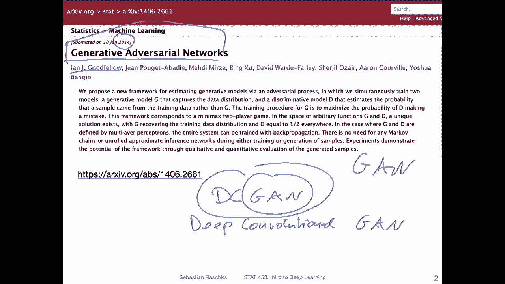
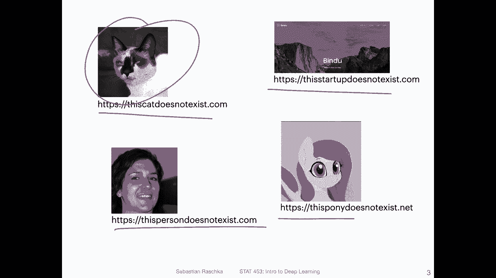
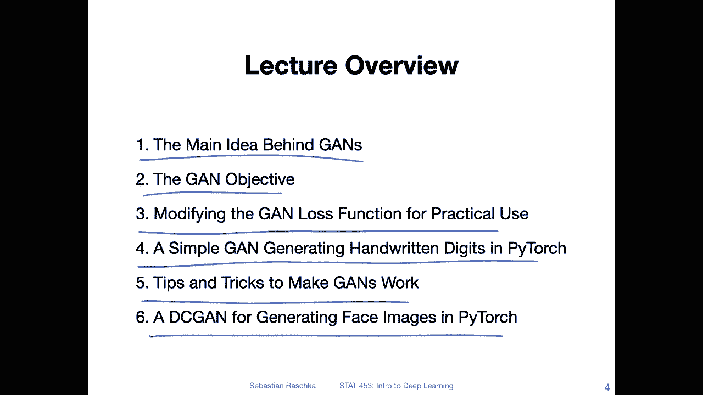

# 【双语字幕+资料下载】威斯康星 STAT453 ｜ 深度学习和生成模型导论(2021最新·完整版) - P146：L18.0- 生成对抗网络简介 - ShowMeAI - BV1ub4y127jj

Yeah， hi， everyone。 Today， we have a pretty exciting topic， generative adversarial networks。

 even if you have maybe not had any background in deep learning before you took this class。

 I'm pretty sure you probably heard about generative adversarial networks。

 They are a very popular model in deep learning。 and they are essentially used for generating new data。

 Nowadays， there are hundreds， if not thousands of different generative adversarial networks around there。

 but yeah， we have to start somewhere。 So we are starting with the introduction discussing the original GN。

 and then also implementing a deep convolutional G GNs， like I said， a pretty exciting topic。

 but I find they are also notoriously hard to train。

 So we will also look at some tips and tricks for training GNs。 And with that， yeah。

's let's get started。😊，Yeah， so in this lecture we are mainly going to focus on the traditional generative adversarial networks approach which was published back in 2014 by Goodfe and alumni and yeah it became really popular around 2016 I would say when there was a famous Europe's workshop where near the generative adversarial networks were discussed and presented extensively so since then there have been literally hundreds if not thousands of different generative adversarial networks so there was actually a GiHub repository listing different types of generative adversarial networks and back then like three years ago there were approximately 150 different types of generative adversarial networks。

And yeah it was not updated since then， unfortunately。

 but I bet there are nowadays probably up to1 thousand different generative adversary networks。

 but yeah we have to start somewhere and today we are going to focus on the original GN。

 the original generative adversary networks model。And also， I will show you a flavor of that later。

 which is called Dgan。 So Dgan stands for deep。Convolutional。Again， so the original， again。

 the original generative adversary networks here was implemented with fully connected layers and。

Approximately a year later or so there was an implementation with convolutional layers。

 So it was called DCcgan nowadays when you hear the wordgan。

 it usually implies that there are convolutions to be used So when people say again usually most of the time people actually mean a type of D G Allright so but to give you some ideas of what we can do with GNs before I give you the lecture overview So here's like a fun overview of different applications of G like these are more like joke or fun applications So there are these different websites。

For example， this cat does not exist and every time you refresh the website。

 you will see a new cat and this cat is yeah generated by adversarial networks。

 generative adversarial networks， and they don't exist in real life。

 These are generated cats as of course， also one for face images。 This person does not exist。

Theres also a fun one。 this pony does not exist and then there's also a recent one。

 this startup does not exist。 So these are all yeah fun applications of GNs。 but of course， yeah。

 there are many， many different things you can do with GNs in this lecture we will focus on the fundamentals and we will see an example。

For handwritten digits and also face images。I must say personally though。

 working with GANs can be both fun but also very， very， very frustrating。 personally。

 I think GANs are among the trickiest things in deep learning to train because you will see there are now two neural networks that we have to train and we have to make sure they really well tuned with respect to each other So before we had to tune only one network。

 now we have to tune two networks and they have to be tuned in context to each other。

 So it's actually really hard personally I think to train a G model but I will also show you some tips for that So the lecture overview for today is as follows。

 I will first give you the big picture behind GNs then we will talk a little bit about the objective So the loss function。

Like it was presented in the original paper and then we will talk about a little modification that makes it a little bit more practical so when we are training it regarding the gradients。

And then I will show you an example how we can， yeah train on neural network or fully connected G for hand of written digits。

And then I will go over some tips and tricks for yeah， makinggans work becauseganNs are really。

 really tricky。 And even with these tricks and tips， it's still hard to traingans。

And then I will show you a DC C G for generating face images。

 which I spent a lot of hours on because yeah， like I said， GNs can be fun but also tricky。

 So these are our topics for today， starting in the next video with the main idea。

