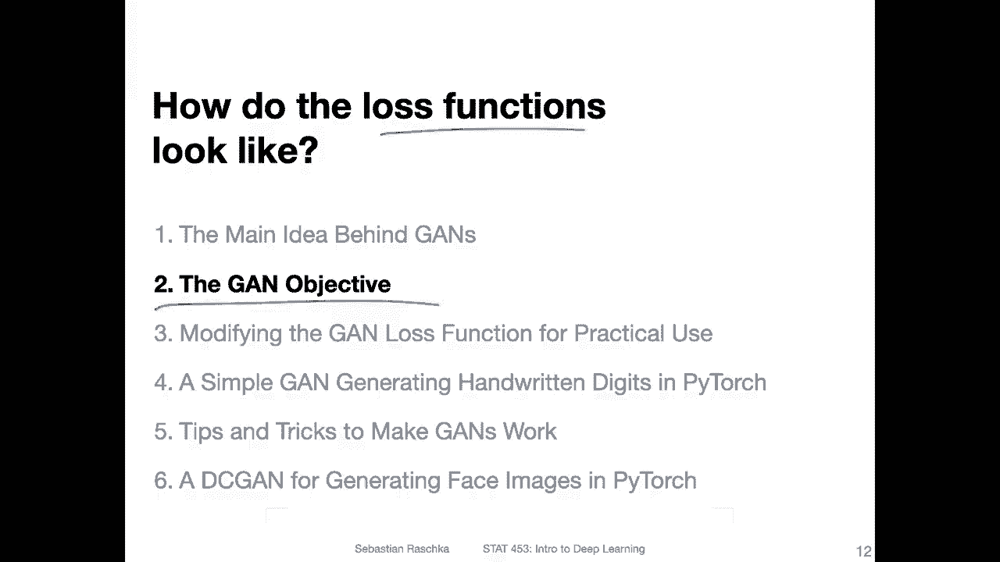
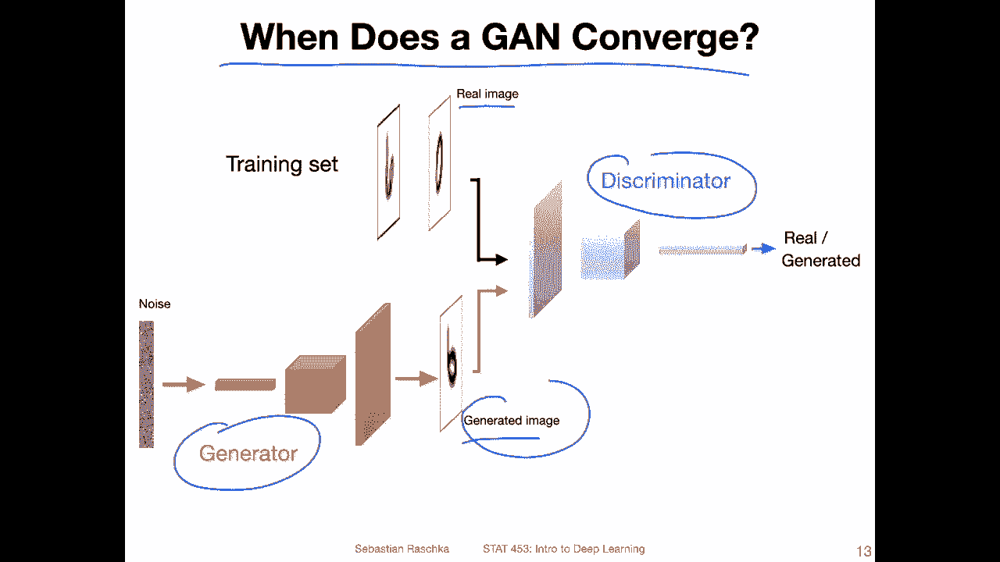
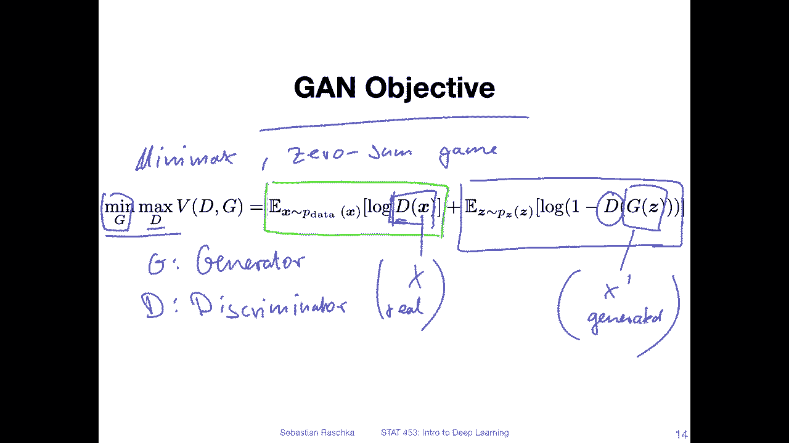
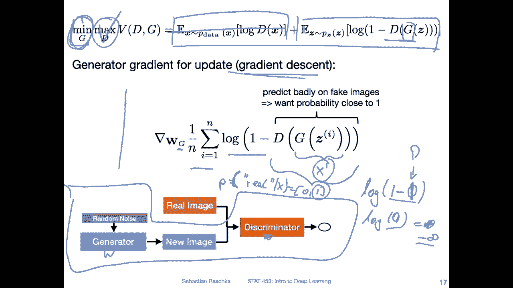
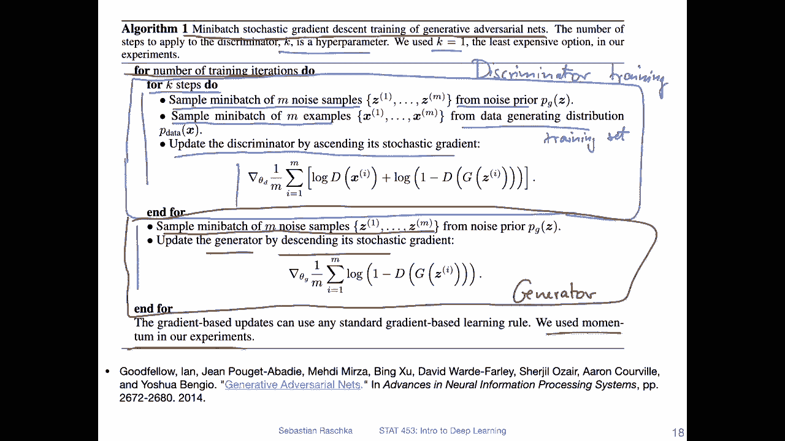
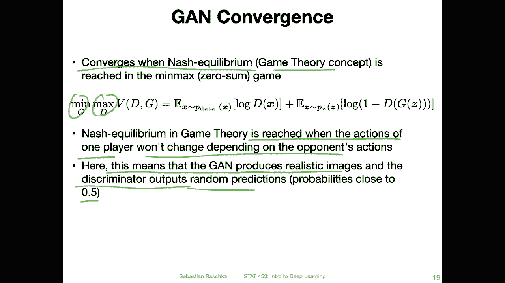
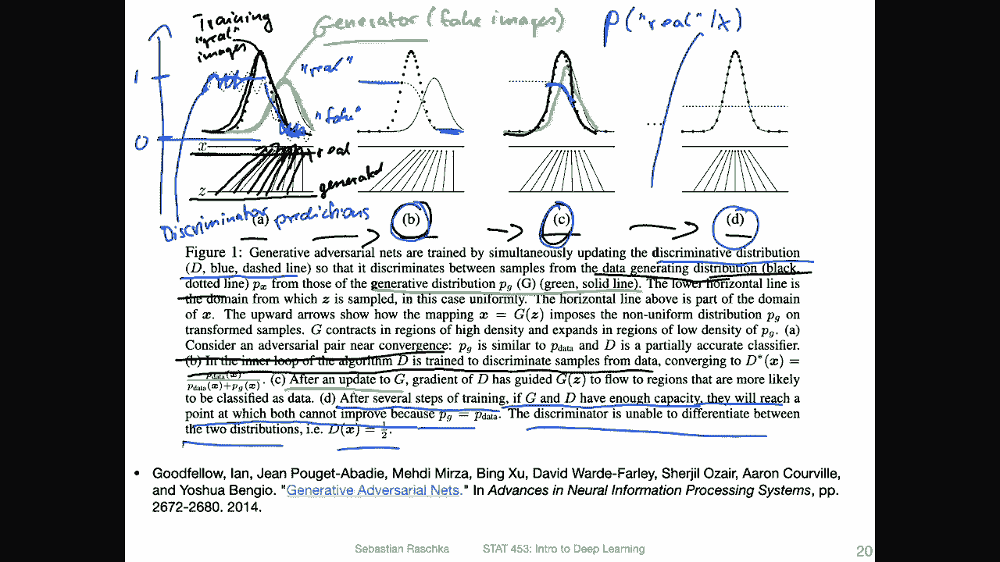
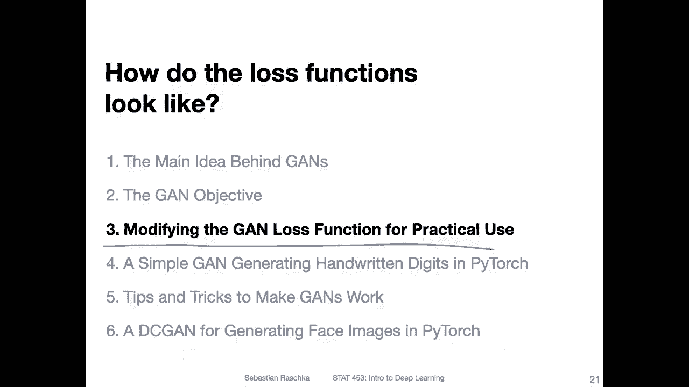

# 【双语字幕+资料下载】威斯康星 STAT453 ｜ 深度学习和生成模型导论(2021最新·完整版) - P148：L18.2- GAN 目标 - ShowMeAI - BV1ub4y127jj

All right， let's now talk about the again objective， essentially how the loss function looks like。

Before we get to that though， just again， the big picture overview and the important question。

 when does again converge because yeah， the answer might not be so obvious。

 so we have the discriminator which is trained to distinguish between real and generated images so essentially the discriminator wants to become better at detecting these generated images while at the same time the generator wants to become better at fooling the discriminator。

Right， so in that way， this like this fine interplay or this back and forth between the generator。

Wanting to be better at fooling the discriminator。 So it kind of wants the discriminator to make wrong predictions and the discriminator wants to make correct prediction。

 So when does it actually converge if it goes back and forth。

 So if you train this and everything is set up properly。 It should at some point。

 reach some point of equilibrium。 So in the context of game theory。

 there what you call the Nsh equilibrium。 So there will be some sweet spot between the two。

 where both are somewhat happy。

So the loss function for the G overall would look like this。 It's essentially a min Max game。

 So some people call it mini Max。哦。0。😔，三 game。And we have two parts here。

 So we want to minimize some G here where G corresponds to， let's say the generator。

Permeters and the D corresponds to。The discriniator。And you can see there are。Two broad parts here。

 One part is here。And the other part is this one here。And in this left part， what we can see here。

 that's。D for the discriminator。这是上。😔，Output or prediction of the discriator。

And this on the right hand side。Mis the output of the generator。 So this is our in input image。

 Let's call it the generated image X prime， whereas。Here that access the real image。So， D。On x prime。

 this is like the prediction of the generated images。 So looking at this， we have two terms。

 One is prediction on the。Real images。And one is the prediction of the discer on the。Generate it。

Images。So let's now in the next couple of slides， walk through this step by step。

 looking at the discriminator part first and then going to the generator part because sort of things going on。

 let's look at it one at a time。

Okay， so there are lots of things going on now at the top。

 I just copied over the equation from the previous slide。And now in this slide。

 we are going to focus only on disc screenator part， So the。Maximization party of the deep。

And since it's a maximization problem， we are going to use or assume we are using gradient ascent before in thes。

 we used gradient descent because we wanted to minimize something。Now。

 because it's a maximization problem here， we are going to maximize something。

 which is why we call this gradient ascent， not descent。But yeah， this is just a minor detail。Okay。

 so we are going to maximize something here。 So going to， for instance， maximize this part。

In this part for the discriminator。 So here at the bottom。

 showing you the gradient of the loss with respect to the discriminator parameters。

 So W is just the weights of the discriminator。And yeah， this is yeah， the loss。

And this is something we want to maximize， though， because， like I said， it's a maximization problem。

 Oh， and by the way。We have a sum here instead of the expectation， because。

In the form here at the top， this is assuming the data generating distribution。

 but in practice we never really have access to that。 We only have a fixed size training set。

 so this becomes more like an empirical loss。So this is why we use the sum here where the sum is over the end training。

So it's an number of training examples。Just a minor detail。嗯。Yeah。

 the interesting part is now we are going to focus。 let's say we are focusing only on。This part here。

 and then I will have a new slide， exactly a duplicate of that slide where we are going to discuss the right hand side here。

 I want to discuss this in two slides because I can imagine it will become very crowded here。Okay。

 focusing on what I highlighted here in purple。At the bottom here， essentially this part。

 the discriinator for the real images。 what we want the discriinator is to predict well on the real images。

 right， So we want this probability。To be close to one。So there is screen data here。

Which colorlo I use with， So the discgraator here is outputting a score。Between。0 and1。

 representing the probability。That an image is。Real。

So it's outputting this probability here between 0 and1。And。Ideally。

The best possible score for the disc， because it's an maximization problem here， is this to be one。

 right， because。If we plug in some values， so there's a lock here。So。Lock of one is。Like this。

Lock of one is 0， and lock。0， that would be the worst case would be minus infinity， right。

The worst case would be when we predict the0 for the real images。

 in the best case would be to break the one。That's how we maximize this term。Okay， so the next slide。

 let me show you the second term here。Allright， let's do this again。

 but now we are going to focus on the right part， so we are going to focus on this one here。

And we are still talking about the discriminator。 So we're still talking about gradient ascent。

 maximizing something。 We're still talking about maximizing something。

And now we are exactly here where we。Consider generated data。 So on G here is the generator。And。

It receives some noise input Z， and it will output X prime the generated。Image。

 if we look at this term， it's actually。Very similar to what we have on the left hand side。

 So there's also a D and the D still outputs the value between 0 and 1。But now， of course。

 based on the generated image instead of the original image， and now we have this one minus here。

So as a consequence， what happens if our discriator is very confident that this image is a real image。

 if it thinks this is real， it will put out a value close to one， right？

So in this case for let's go over here to the left hand side， so。Look。1 minus-1。

 This is if it thinks it's。Real。😔，So this would be。Lock 0， which is minus infinity。 would be a very。

Yeah， bad， very bad loss because。The bigger， the better。

 because we are still here talking about maximizing。

 So the worst case scenario is that our the screen thinks that the generated image is real。

 We' are talking about optimizing the disc screen。 So we want to actually avoid that to maximize this term。

We would put in or the discriminator would predict a0， right， so because then we have lock。1-0。

Which is。😔，Look 1， which is 0。 So this would be our best case scenario for predicting。Gen it。

So here I mean， with a value of 0， this is a low probability for real。 If we set the cutoff at 0。5。

 this would be essentially predicting generated。Okay， so。Putting these two points together。

 what we want for the discriminator when we are training the discriminator here is we want that it outputs a probability close to one for real images。

And we want here it to output a probability close to 0 for these fake or generated images。

 So this is the discriator part In the next slide， we will then focus。Here on。The generator aspect。

All right。 So finally， we are now finished with a discriminator， and we can now focus on。

The generator update。Okay， so。Now we are talking about a minimization problem， so。

We can use gradient descent for training the generator。

We are focusing again on exactly the same part as before， however。

 before we updated the weights of the discriminator。

 now we keep the discriminator as fixed and update the weights of the generator。

It incorporates the prediction of the discriminator， which is why I circled this whole thing here。

So looking at the equation above。If we want to know what we have to update for G。 So the left term。

If you think also calculus of the sum rule， this would be kind of cancelled because there is no G here。

 right， So this is not relevant in the loss。 So we can actually ignore this for now。

 So this has nothing to do with a generator。On the right hand side。We see the generator here。

So let's bring this down here。 This is， again， the empirical lossson。On the training set。

 And this is exactly the same I showed you before in the previous slide。

 except now we are talking about G instead of D。And we are talking about minimizing。

 instead of maximizing。But again， this part。Is still。The generated or fake image。

And the disc screenator here。Predicts on this fake image。

 and the output range is still between 0 and 1。Where one or where this represents the probability for real。

Okay， so in the previous slide， when we talked about the discinator， we wanted to maximize this。

 so we wanted to maximize。The probability。That the discriator predicts real on real images。

And predicts。Fake on these generated images。So。Let me write this part。

 lock 1 minus So in order to maximize this in the previous。Slide。

What we had is or we wanted the discriminator to output。Wanted to output a0 here。

Because then we have lock。1， which is。0， was our best case scenario for maximizing the discriator。No。

Since we talk about a minimization problem。We want actually， the disd output of one here。

Because then we have 1 minus-1， which is 0。Which gives us minus infinity here。Minus infinity is。

 yes you can imagine the most the lowest possible value， right。

 because we talk about minimizing this lost term， gradient descent minimizing。

 So we have minimization here。 And this is minimized if we have a lock 0。 So if the。

The crriminator outputs。A low probability here sorry， high probability here for real。So。

The discriator here， this is P。The probability。The image is real。Some range between 0 and 1。

It is a generated image， so it is not real， but we want the discriminator to think it is real。

 So we want it to output a high score1 because then we have 1 minus-1。Block 0。

 which is minus infinity。 And that is how we minimize the generator。

 So the generator wants the discriminator to output。The prediction that something is real。

 although in reality it's not real。And yeah， this is then now the different parts。

 we we covered the maximization of the screenator and we talked about minimizing the generator。

 So the next couple of slides， I will just add a few more things from the paper。

So this here is a screenshot from the original G paper so this is the training process of what we've discussed in the previous slides。

 just summarizing it into this training procedure， they call this the mini batch stochastic gradient descent training of generative adversarial nets。

 of course also gradient ascent as involved as you have seen in the previous slides for training the discriminator。

In fact， in the next video， I will show you a trick that we can turn this ascent problem into a descent problem。

 It's also recommended in practice， but for now， let's stick to this original outline of the algorithm here。

 So let's， yeah discuss this step by step。There is a follow loop here。 Let me stick with green here。

 There's a follow up here for the number of training iterations。

 You can think of it also as yeah follow loop over the number of epochs。And then， there are。

The discriminator training and the generator training alternating。

So let me box this in so it will be easier to see。So， this is。The generator， sorry。

 the discriator training。And then here at the bottom。This is the generator。Training。Okay。

 let's take a look at the discrial training first。 So it says for K steps。

And the K steps as a hyperparameter and they used k equals 1。

 so they only essentially train the discriminator onces and then they go to the generator and then they go back to the discriminator and so forth。

 but in practice you could update the discriminator several times before you update the generator。

 It's another hyperparameter to consider。嗯。What we do is when we train the discriminator is we sample a mini bitch of M noise samples。

From， let's say， a standard normal distribution。And then we sample a mini batch of M examples from the data generating distribution here。

 this is essentially you are。our training set。So this is essentially just drawing a mini batch。

There's nothing special about that， it's just obtaining a mini batch。😔。

And then we update the discriminator by ascending its stochastic gradient。

 so that is what we talked about in the previous slides， that's how we update the discriminator。

So this is the discriminator part at the bottom， we have the generator part。Again。

 here we sample a mini batch of noise examples。And then we update the generator by descending。

So here that's the SGD that we had on the previous slide。And yeah， for learning。

 So this is it essentially， and for learning， they say they use momentum。Based stochastic。

 gradient descent。Personally I also had good experiences with S GD and momentum and Adamom but I've had seen some comments or people recommended not using momentum because you want the generator and the discriminator to be kind of flexible so the momentum term makes them lag behind a little bit。

 so sometimes people recommend not using momentum， but I find that it works just well with momentum as well。

Yeah， just to recapgan convergence so when does a G converge like I mentioned briefly before。

 it converges when we reach the Nsh equilibrium， which is a term game theory and that is essentially when we we have an equilibrium between。

Maximizing the loss for the discriminator and minimizing the loss for the generator。

So in the game theory jargon， it is basically reached when the actions of one player won't change depending on the opponent's actions。

And here and concretely， this means that the G produces realistic images。

So the generator is able to produce realistic images。

 and the discriminator outputs random predictions， probabilities close to 0。5。

So G is able to produce images that are indistinguishable from the training set images。 I mean。

 they are still new images， but they look very realistic。 While the discriminator yeah。

 can't tell them apart。 The discriminator essentially predicts 05， like a 。

5 probability being unsure whether something is real or fake。

Yeah， so here's another figure from the original G paper。

 This is a really nice figure illustrating the G training process。

 So when it converges when it reaches the Nsh equilibrium。 So there are four steps。To this figure， A。

B，C and D， let's talk through this one by one。 So let's focus on figure a first。

You can see there are multiple lines。 that's lot of things going on。 So let's annotate this first。

 so。What they say here is in the green solid line is the generative distribution。

 or essentially the generator data。 So the outputs of the generator。Let's say the。Fake images。Then。

 what we have is。Here and black。😔，The back dotted line， these are the data generating distribution。

So with this， it means the original training set images。 So let's just call that。Training。😔，我。Real。😔。

Images。Then we have one more line， the blue line， the blue。Ded line here。

 And this is the discriminative distribution。 so you can think of it as。Here has this one。😔，嗯。

Maybe not ideal。 just like here。Disriminator。Predictions。And you know， from the previous slides。

The range is between  one and 0， where 1。Or where the the screenator outputs the probability that an image is real。

Okay， so now we have these different things。 and you can also。You can also。

 also you can think of the black line here as a probability density。 And here， this is the x， the。

Input images so the range of the input images。 Of course， it's only a one dimensional plot here。

Just for simplicity， X are the input images， and z are the generated images。Let's say， real。

And generate it。And what they are trying to show here is where the generated。Images map 2。

 And you can see that， let's say。The training images， the density is highest in this region here。

And the generated images at this first step， they are mostly mapping only to a small。Region。

Over here。So。The highest density for the generated images is here。And。They say the step A here is。嗯。

Near convergence。 So it's not quite converged。 So they are illustrating here the process of converging going from A to B to C and to D。

 So we set。That the distribution of generated images here is different。At this point。

 from the training distribution。 But it's not substantially different。

The discriminator predictions are very confident here for these images， like that they are real。

 So here in this whole region。The generator predicts。Real。Except then when we go down here。

To the generator。Images here。The0， it essentially detects correctly that they are fake。

So this is a region in general where the discriminator is pretty happy。 It's doing good predictions。

 but the generator is not very happy because it's not able to fool the discriminator yet。So。

 next and。B， so as B here。B in the inner loop of the algorithm D is trained to discriminate samples from data。

 so now we have a training step， so B is a training step updating the discriminator。

So you can see after this update。It will become even more confident。

 So after this update so instead step B， now it's consistently around one instead of being fluctuating here and you can see also here in this region。

It's consistently around  zero instead of being fluctuating here。

 So here this updated the discriminator。After the discriminator update comes the generator update。

 right， so now。We have a training step of the generator here in C After this step。

 what you can see is that the generator learns how to make the distribution。

Of the generated data in green here， closer。To the training data。

 So they are now more similar to each other。 And you can see then。That in this region。

 the discriminator。Is somewhere like very confident。 So it's in this case。

 the discriminator is not doing so well anymore。 So here。

 this is a point in see whether the generator is more happy。 And in B。

 the discriminator is more happy。 But in yeah， what we want is we want to find this equilibrium where both are having the sweet spot where both are relatively happy。

 So this is reached in D， when you do many steps。So in D， after several steps of training。

 if G and D have enough capacity， so if they are networks that are able to learn。

 of course you can have maybe networks that are too weak to learn anything useful。

 then of course this would not be the case， but if both have the capacity to learn。

 they will reach a point at which both cannot improve。

Because the data generating distribution is the same as the generator distribution。

And the discator will be unable to differentiate between the two distributions。

 outputting 05 is the prediction。 So this is what we can see here。

 So here we can see the generator has learned to output。

to recreate the training set distribution。And the discriminator will be unable to differentiate between the two。

 So here steps A， B， C and D kind of illustrate the process of traininggans at least conceptually in practice it's way more messy。

 it's not so easy to reach step D， but yet this will be more clear。

 I think when we look at the code example how。How difficult it is to train again， in any case。嗯。

Now we covered the loss function and the again objective。

 the convergence and everything and in the next video I want to briefly tell you about a small modification so that we can use stochastic gradient descent for training both the generator and the discriminator and also how we can improve the gradient。

 the loss gradient for the generator。

