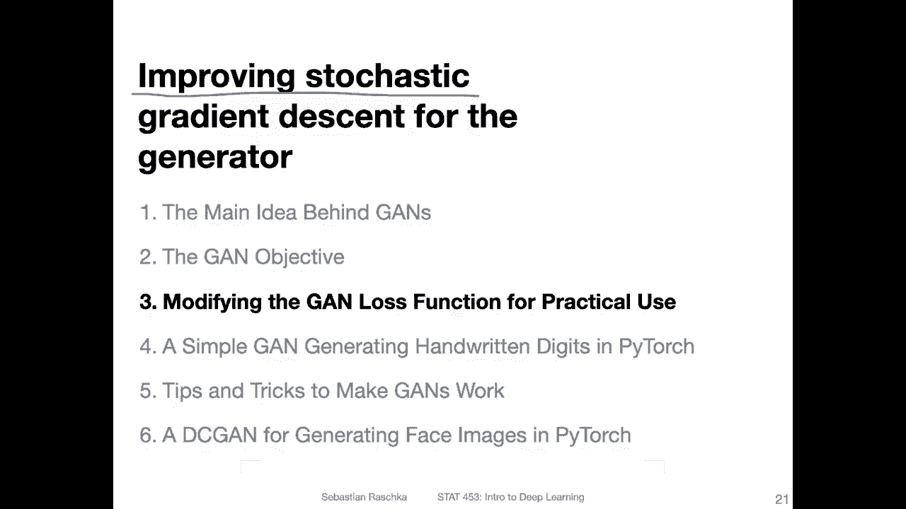
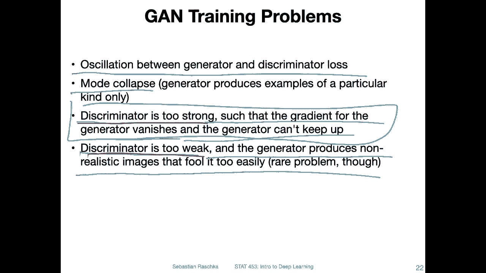
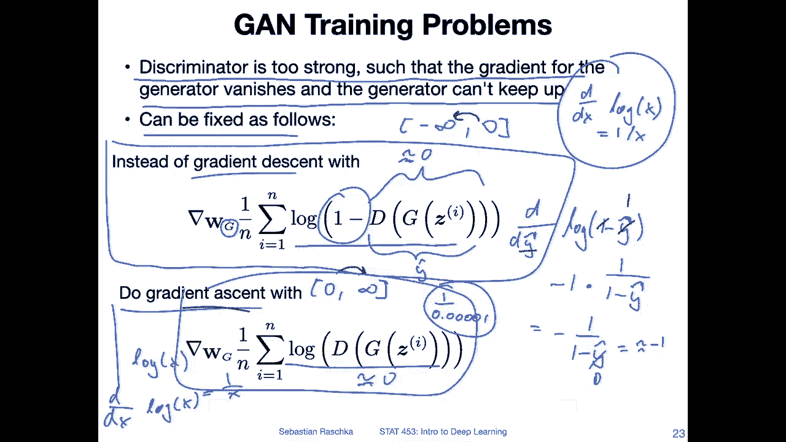
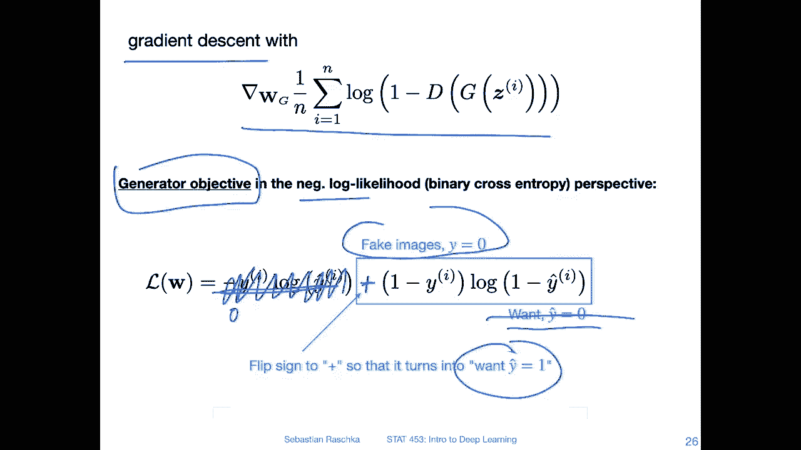
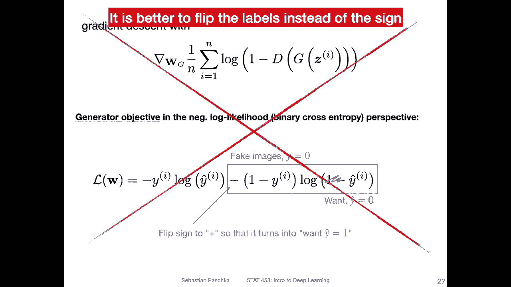
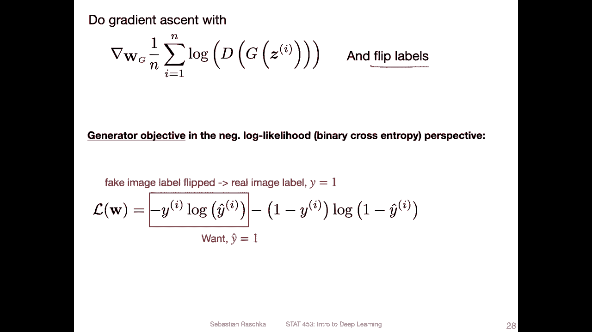
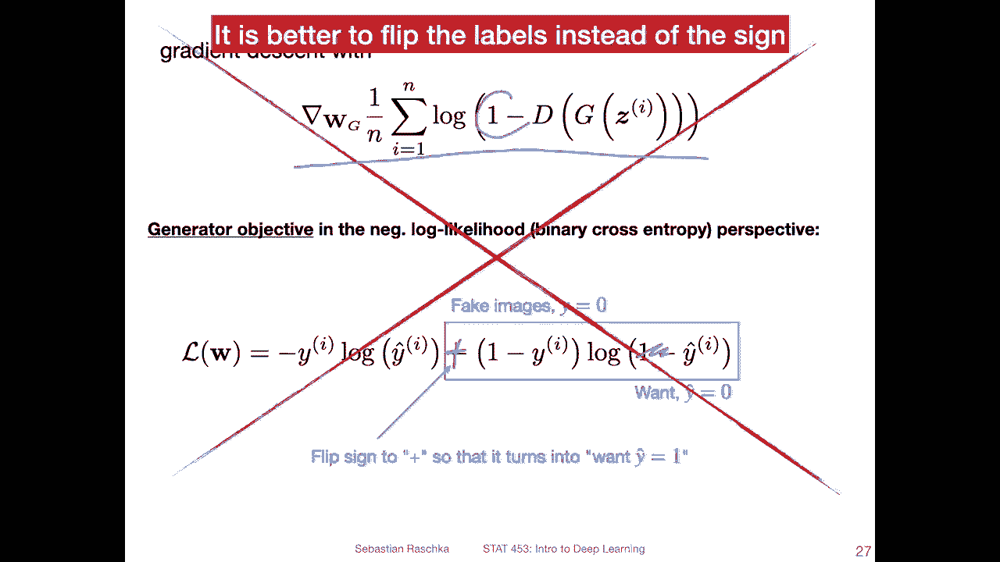

# 【双语字幕+资料下载】威斯康星 STAT453 ｜ 深度学习和生成模型导论(2021最新·完整版) - P149：L18.3- 为实际使用修改 GAN 损失函数 - ShowMeAI - BV1ub4y127jj

So in this video， I want to talk about a small modification that we can make to improve the G training。

 in particular， we are looking at improving stochastic gradientding descent for the generator。

But here， before we get to that， let me highlight or just list some of the problems with G training In a future video。

 I will show you some tricks and tips for yeah addressing some of the problems。

 or at least for improving G training。 But here， let's just take a look at this list of problems。

 So one problem is。The constant oscillation between the generator and discriminness。

 So things never converge， things might just keep oscillating。

Another very common problem is mode collapse， which essentially means that the generator will learn how to generate a particular type of data that is particularly good at fooling the discriinator。

So that is also one problem usually when you see that the generator is only producing one kind of image。

 then this is usually due to this type of mode collapse where the generator just exploits a weakness in the discriminator just producing a particular type of image。

One common problem with a traditional or conventional gtering that I showed you before or that we discussed when we had this minm setup is that the discriminator would be too strong usually or what can happen is that the discriminator is too strong which is a common problem because classification is simpler than generating data so it can easily be that the discriminator is too strong and if this happens in the very beginning that the discriminator starts out very strong and using the loss gradient that I showed you earlier what happens is that the gradient for the generator will vanish it will be too small and the generator can't keep up with a discriminator and then yeah things won't train at all。

Another problem could be that the riskco is too weak and the generator produces non realistic images that fool it too easily。

The difference here between one is that the disc is too strong and here it's too weak and practice it's usually that the disc is too strong because the classification is easier than data generation so。

There is a little trick that we can apply to at least address。This problem， to some extent。

 and that is something I will explain in the next couple of slides。

Okay， let's now focus in on the problem related to the discriminator being too strong。

 such that the gradient for the generator vanishes and the generator can't keep up。

Which can be fixed， or at least mitigated as follows。 So here， what I have is the original。

G formulation that I showed you from the paper earlier， from the algorithm one screenshot。

And what we had is here， the update for the generator。

 So this is the gradient of the loss with respect to the generator weights。 And yeah， if you recall。

 the generator once。The discriinator to output something close to one for these generated images。

 So here， these are the generated images。 And then once the discgrainator to think they are。

 they are real。And then if we have something close to one， then where we lock。1-1。

 which really minus infinity。And。This is where we then maximize。Sorry， minimize this loss function。

 and it is maximizeimd if this is somewhat close to 0， because then we have lock 1-0， which is。0。

 right。 So in this case。What we want is something close to one。But it might happen in the beginning。

 especially that。In the beginning that the output of the discriminator is close to 0。

 because in the beginning， it is kind of hard to generate new images from scratch if the generator hasn't learned anything yet So in the first few iterations。

 So in the beginning， it will be very easy for the discriminator to tell apart real and fake。

 So in the beginning， it will output something close to 0。

This will maximize this loss and we want to minimize it。 so that's actually good。

 But the problem is that the gradient signal will be relatively small and it will be kind of hard this way for the generator to learn efficiently。

 I mean， it will be able to learn， but not very efficiently。

Because the gradient will be relatively small， and it can be improved， like shown at the bottom。

 So but yeah， let me maybe outline the problem first with a gradient here。

 So what we have is lock 1 minus something。 let's call this。Grated image。When not generate image。

 the inside is a generated image。 but let's just call this whole thing X prime。Or maybe。

 maybe something like。Why， why hat， let's call it way hat。So what we have is。Look。

1 minus my head here。What is the derivative of that？So for that， we would need the chain rule。

 So you know that the derivative of。Something like log X would be。1 over。X。

So here we have to use the chain rule， the autota times the inner derivative。 So what we have is for。

 let's do the inner derivative first。 So it's one minus y hat。

 so we are looking at the derivative with respect to Y hat， of course。

So the inner derivative here would be1 minus。 So the derivative of1 minus y hat would be-1， right。

Because with respect to my hat。And this vanishes。 And this becomes a one。 So we have。-1。

Times the outer derivative， like I said before， the outer derivative is， as follows。 So if of log X。

 it would be one over x。 So here the outer derivative would be one over1 minus y hat， right？

 So that derivative then is。-1。let's write it like this。-1。1 or1。😔，W he oh， way。And。Doing premier。

 But I mean， hint， of course。Okay， so this is our derivative。 So if something is close to a 0 here。

 our derivative will be around。-1， if， if this is。Close to 0。And I mean， this is okay。

 but it's not like the strongest。derivative。 So it won't be the best， let's say。

 for learning the generator in the beginning。 So a trick is to。

Turn this gradient asscent problem into the following gradient ascent problem。

 So now what I'm doing here is I'm dropping this one minus here。So。

Then if the discriminator outputs 0 here。The loss would be。Infinitine。And if the generator outputs。

Sorry， if the discriminator outputs are  one， which is what we want， the loss would be 0。

 So now we have the loss between 0 and。Infinity， and before we headed between minus infinity and。0。

 so before we wanted to minimize it。 So before we wanted to。Minimise the loss。Now， it' grain essence。

 We want to maximize this term。And this will give us here a stronger gradient if the initial prediction of the discriminator is that it can detect the generated images。

 So if in the worst case scenario， what we have is that the discriminator outputs something close to a0 right。

 And now if you look at this term here in the whole term。

 it's log x term and the derivative log x is。Is one over x， right？ So in the worst case now。

 we have something close to 0。 And let's say we have one over a very small。Number。

Then what will happen is that the gradient。Will be。

Well the the derivative will be much larger here for。

A discriminator that can successfully detect the generated images。

 So here using this formulation at the bottom， the generator will burn more effectively in the beginning。

Yeah， so by now， we have seen a lot of gradient ascent and descent and flipping between the two and so forth。

 So it might look super complicated， but in practice， actually。

 it's not as complicated as you might think。 It's actually pretty straightforward to implement thegan must function with ir regularular gradient descent。

So we will be using regular gradient descent for both the discriminator and the generator。

 and it will probably be more clear when you see that implemented in code in the next video。

 But yeah， let me briefly。Just finish the section on this trick or just in general。

 how we can turn everything into a gradient decent problem。

 So in an earlier video on the original again， we have seen in the paper that they mentioned gradient accentcent for training the discriinator。

So previously in the paper， they mentioned that they are maximizing the prediction probability of classifying real is real and fake is fake for the discriminator。

 but as you remember from the logistic regression lecture， long time ago， lecture 8， I think。

What we said is that maximizing the lock likelihood is the same as minimizing the negative lock likelihood。

 So the negative lock likelihood， we can also think of it as the。Cross entropy。 So in that way。

 we can actually yeah just use our regular cross entropy binary cross entropy and Pytorch to optimize the discriinator。

 we don't have to do gradient in Ecent。So the same for the generator， so for the generator。

 we first in the original paper， they first said it's about minimizing the likelihood of the discreteator making correct predictions。

And。Minimizing the likelihood is the same as maximizing the cross entropy in that sense。

 It's similar to。Here， maximizing the cross look likelihood and minimizing the cross entropy。

 here had now flipped， minimizing likelihood and maximizing cross entropy。

 But we just talked in the previous slide。That this is actually not ideal because the gradient small gradient issues。

 So we said that it doesn't work well in practice because of these small gradient issues。

 So what we did is we flipped or we didn't flip， but we modified the loss first so that we can use gradient accent。

But in practice， it's even better to just flip the labels and minimize the cross entropy。

So what we are doing is we are forcing the discriminator to output high probabilities。

For a real image。If an image is fake， so a higher probability。For the real label。

 given that the image is fake。If this all is very dense and complicated here on this slide is a lot of information here。

 let me go through the next couple of slides where I will yeah disentangle this a little bit。

 only two more slides， and then we will see a code example in the code example you will see it's actually pretty straightforward。

Okay so now I will just step by step illustrate how everything relates back to our binary cross entropy or minimizing the negative look likelihood So here this is the gradientes step from the original paper from the G paper So again this is for the discriminator and we want the discriminator for the real images to output something close to one here。

And on the right hand side， for the fake images， we want to output something close to 0。

 So this is the original。Again。Objective for the discriminator and。

It's with a gradient in essencecent described in the paper。

 but we can turn this into a great and decent problem by。

 yeah just using our negative look likelihood function。

 the loss function that we have seen from the logistic regression lecture。So here。

This whole thing is I just used it from the logistic regression lecture。

 This is our loss function we used there。 And here I'm just highlighting how the G objective maps to this loss function。

So。Again， we had these two parts。 We had a minus y， and then we had1 minus y。

 So let's just focus on the y here。 So if the true label is one， then we use this turn， right。

 And if the true label is one here Also， then this will become 0。

 So we don't do anything with this one。 So if the true label is one。

 we don't do anything with the right hand side。 We only do something with the left hand side。

If the true label， if the class label is0， then the whole thing will become 0。

 so we don't use this one and this one becomes 0。 So 1 minus-0。 This one becomes1。

 So we are using only this right part。If the class table is 0。

So there are these two parts to the loss function。 This is yeah just from the logistic regression lecture。

So now let's focus on this part here。Right， so we want this to be close to one。

 And this is for the real images。 And we set for the real images。We have class table 1。

 So for the real images， we are looking at， at this part here。

And we want the prediction also be close to one。So， that is。How， yeah。

 how objective maps here to a gradient decentcent problem。

 because here we have also the minus for the negative log likelihood。

 This is a negative log likelihood。 We have minus and minus。

 so we are minimizing trying to minimize this term， right。And for fake images。

 we are looking now at the right hand side， right， because for fake images， we have the label。0。

 so this will become 0 cancel。 So the whole thing will cancel。

 We only look at the right hand side here。So then this one will be one。

And then we look at lock 1 minus y hat。So again， we have a negative look likelihood。

 It's the minimization here。So， we want to。When we do the gradient descent， what happens， we will。

Learn how to output a white head here。 This is the ideal case。 This is what minimizes our。Last year。

Right， because otherwise， minus， if this would be a one， then the whole thing will be oops。

The whole thing will become 0， and minus。Lock of 0 will be minus minus infinity。 It will be infinity。

 right， So this is highlighting how。This one， the gradient essence， becomes a gradient。

Descent in practice when we use our negative lock likelihood。

Yeah， let's now look at the generator objective。 So at the top， this is from the original paper。

 the gradient decent part of the original G paper and。

We can also yeah transfer this to our negative likelihood context so because now we are having the fake images from the generator。

 so we have the fake labels which are0。 So this part is0 so this whole thing cancels we can ignore this part only focusing on the right hand part。

 but if we use a regular negative likelihood if we optimize this。

 but will happen it will wants to optimize the prediction to0 right。However。

 we want the opposite we want to fool。The discriminator， right。

 we don't want to encourage it to detect the fake images。

 We want to fool it so that it thinks these are real。 So how can we do that。

 We can flip this sign here。To a positive sign。 So then instead of this being maximized to y hat 0。

 it will be maximized to y hat equals 1。

Okay， so but we said。Actually， this is bad bad because flipping the sign。 Okay。

 it will correctly achieve our objective， but the gradients will be very small if our discriminator is successful in predicting。

That the generated images are generated。 So we said， okay， this is actually not a good idea。

 We want to modify this loss function where we don't have the one minus here， right？

So that is what we spend a couple of minutes about talking in the previous slides。

 so what we can do instead instead of modifying this label sorry instead of modifying this sign here to a plus sign instead of doing that we can just flip the labels so flipping the labels so instead of doing the gradient descent before so before we had this gradient descent here with this1 minus and we said this is bad so we are removing the one minus here。

We do a great inescent。And we can just flip the labels to turn this into a grain and decent problem。

Okay， so the modified loss function is， or what we are doing is we have usually for the fake images。

 we have the label 0， right。Now we are flipping this。 Now， instead of using label 0。

 we are using label one for the fake images。 This is for the generator。

 and then we can use this part of the loss function because yeah， this one will be one。

 This one will be one here。So this whole thing cancels。And we are looking at this one。

 And then what will happen is if we have a one， it will also。

Try the prediction to make it similar to the one。And then。Because。We provide it as one。

 but in reality， it's actually still the 0。 I mean， it's a fake image。

 What will happen is that it screeninator will be trained to make the wrong prediction。

 So the generator trains。To fool the discriminator， to make wrong predictions。Okay。

 so this was probably super complicated。 Lots of stuff happening。 So in the。

Next video I will show you a code example and you will see we are just using regular binary cross entropy for everything and you the regular stochastic gradient descent or Adamom Opr and it will be pretty clear then afterwards I hope。

