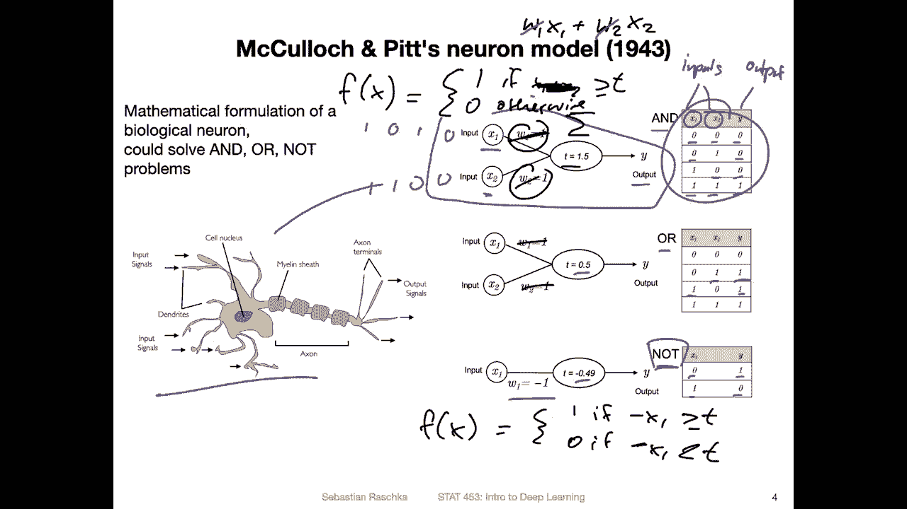
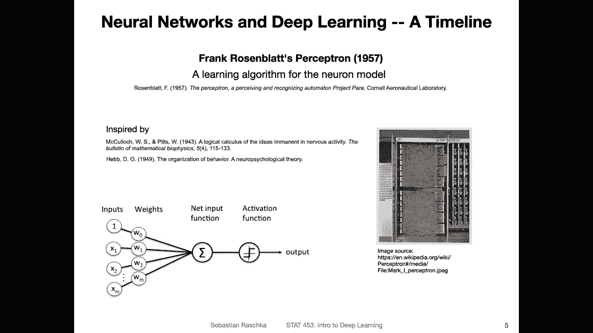
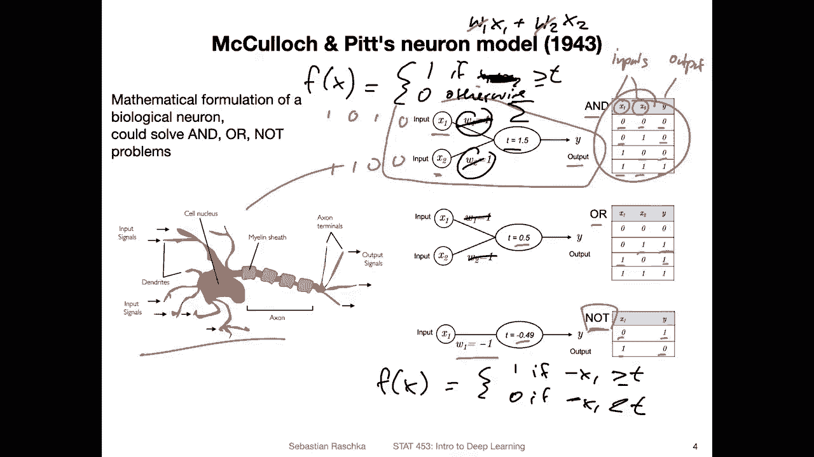
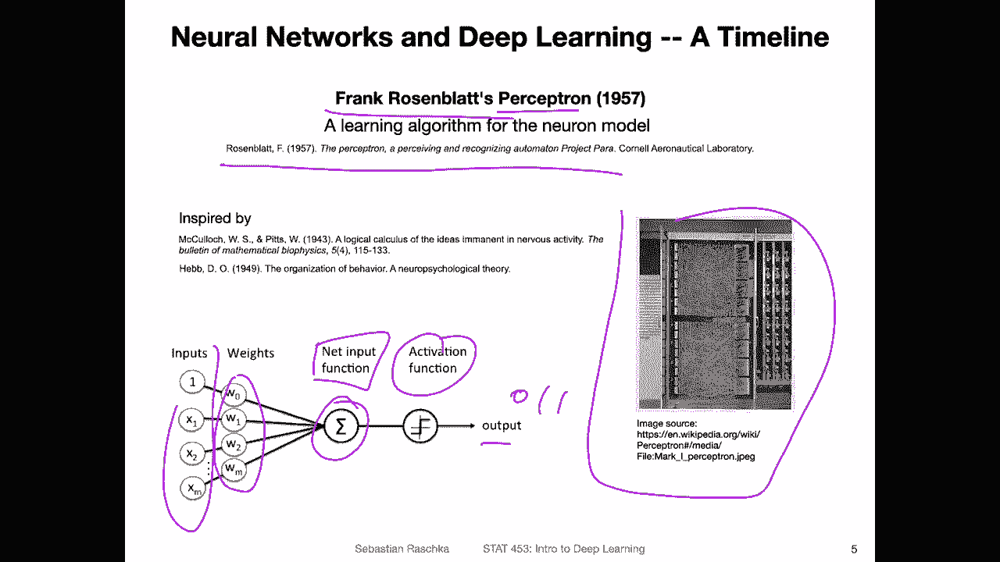
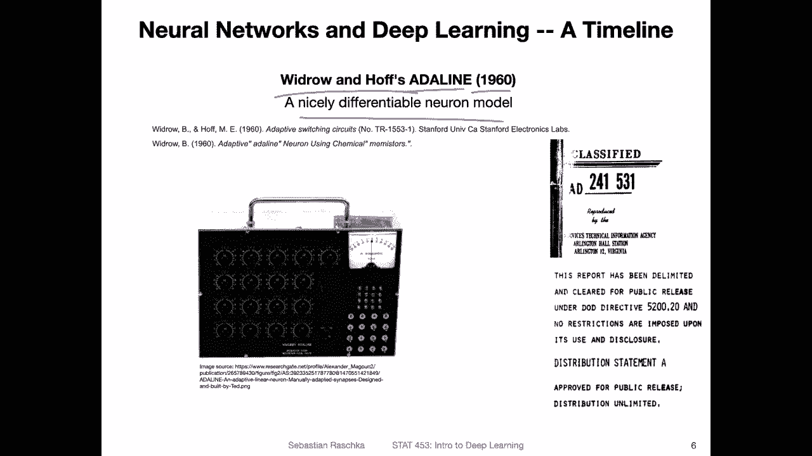
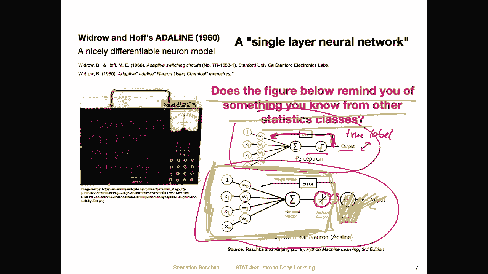
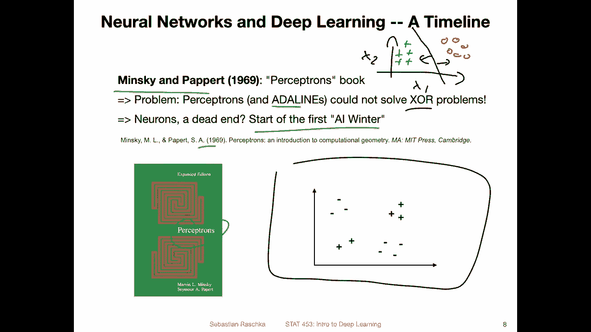
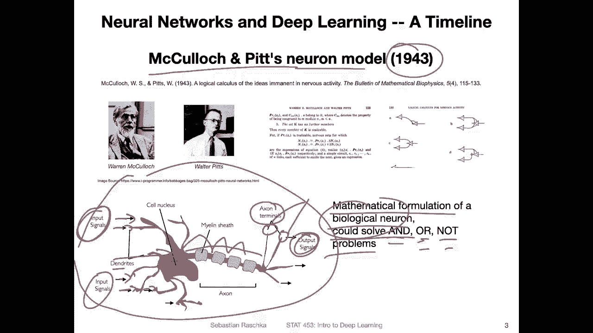

# 【双语字幕+资料下载】威斯康星 STAT453 ｜ 深度学习和生成模型导论(2021最新·完整版) - P14：L2.1- 人工神经元 - ShowMeAI - BV1ub4y127jj

Yeah， just to clarify how the mathematical model of a neuron relates to these first alllogic functions is just a quick overview。

 so here have drawn three tables an and and more and a not table representing these different types of first alllogic functions。

So how this works is you can think of x1 and x2。As the inputs。And as why。As the output。

 So if both the inputs are 0， the output is 0。If。One of the two is 0。 Then the output is still 0。

 and you have to have both inputs equal to one to have an output of one。 That's usually how an end。

Function works for the or function。 It's sufficient for one of the inputs to be one to output a one。

And the node function is， yeah， it's the inverse basic。 So if the input is 0。

 then the output is  one。And if the input is one， the output is 0。

 So here we are talking about binary values。 So the possible values are only zeros and ones here。

 like like a bit function， for example， like representing one bit，1 bit of information So here。

This relates， so this would be the mathematical or one way or mathematical way to implement a and function with analogies to the biological neuronsn。

 So we have these inputs， x 1 and x 2， and then the output。

So we will revisit this in way more detail in the next lecture when we talk about the perceptor models。

 So I mean not in that much more detail， but we will actually implement this also in code in a way that it automatically learns wayss to make classifications here it's just showing that it's actually indeed possible to use this idea of the biological neuron to implement such a function and this would work by having these inputs here and then you integrate these inputs by summing over them So you would have here。

Some over these inputs。And then there is a threshold。 So we can think of the threshold as， yeah。

 something you have to reach in order to fire or not in order to relay a signal or not。

 So in that way， it's， it's basically you can think of it as a piecewise linear function。

 So where it returns one。If the inputs， let's say x1 plus x 2 are greater than the threshold。

 or let's say greater equal to and 0 otherwise。So this would be a one。Of neuron here。

So there are also some weights。Notice that I set them to one here。

 so then they are actually not doing anything， so usually you would compute weighted some of the inputs。

 but we are not worrying about it right here right now。

 so one would basically say that the weights have no function here so we can actually ignore them here。

So otherwise， instead of x1 plus x 2， it would be the weighted input。

 it would be w1 times x1 plus W2 times x2， but since the weights were1。

 they are not doing any things。 So in this case， we can also ignore them later。

 we will actually talk about ways we can actually learn these weights， like parameterize the model。

Yeah， and then I don't want to spend too much time on this， but if you like， you can then just。

Pluck in different values like 0 and 0， 1 and 0，0 and 1 and 1，1。

 and see what the weighted sum is or the the sum x 1 plus x2。

 and see whether it's bigger or smaller than the threshold。

 And then you can real or will realize that this will be implementing on and。And function。

 And similarly， you can implement an or function by changing the threshold to 05。

And you can also implement a not function by， for example。

 changing the threshold to -049 and having the weight。Of minus1。 So you would。Basically。

 computed like this。 so you would have the function as。Or return to one， if。

Mus x 1 is greater than T greater than equal on 0， if minus。X 1 is smaller than T。

 So this would be the。Not function。 So this is already too much detail， maybe。

 but this would be an example of how the mathematical neuron model could represent and or in not functions。

Moving on， so。In the previous slide， I talked about the model。

 but there was no way we could determine the threshold automatically。

 so we would have to handco the threshold for specific functions。

 but now let's say you are given a data set and you want to learn a classifier。

 So you would have to try out a lot of these weights and thresholds to find a good way to classify data。

 So one idea was then by Frank Rosenblt to develop a learning algorithm if I go back one slide a learning algorithm that can find optimal weights and threshold automatically from the data to make a good classification。

 So if we want to classify data。 So for example， if you want to classify spam and not spam email you could use。

 for example， a system that can learn from data to find a good decision threshold。

So this was by Frank Rosenbloo and only yeah a few la one decade later。

 approximately one decade after the McCak and pits neuron。

Also I should have mention there are multiple perceptron algorithms， however。

 in practice usually we say the misceptron algorithm， so although there are multiple ones。

 so there's one popular perceptron algorithm and we will talk about this perceptron algorithm in the next lecture in more detail and also implement it in code so but yeah here is just。

Quick overview of how this works and how it looks like。 So yeah， similar to the previous slide。

 we have multiple inputs。 There are also these weights。And they get combined。

 So this is a weighted sum here at this point。 So it's a。People call it a net input function。

 and then there's an activation function。 This is basically our threshold that I introduced in the previous slide。

 and then it will produce an output So 0 or1。 We will again talk about this in way more detail。

 So it's just a quick overview。 and here would be yeah。

 if you're interested that this would be how it actually looked like in practice because back then。

 yeah computers work quite different。 So it's actually a physical machine and people had to plug in wires to make it work and rearrange wires and stuff like that。

 So yeah， we have come a long way with computations。

Alright， and then also after the perceptron we are still talking about single layer neural networks after the perceptron there was the so-called aline which stands for adaptive linear neuron by Wrow and Hf in 960 it's only three years later and what is different between the perceptron and the aline so this one is now differentiable neuron model so that changes a little bit how we learn the weights so it's a bit more convenient to learn the weights because now we can use calculus to learn the weights we will see next lecture how this learning algorithm works and then in a future lecture we will also talk of course about gradient descent like using calculus to learn the weights。

So here's just a quick last overview of this for this video。

 So this is the perceptron I've shown you。 and now the outline line is actually very similar。

 So it is shown here at the bottom。 and here the only or the main difference is that there is no a linear activation function and。

So in the perceptionceptron， you do a classification， then you get an output here。

 and then based on the error， you compute the error by comparing this output to the true label。

 So you have a。True label。And you， you compare the two。 And based on this。

 you can see whether you make an error or not。 if you make an error， you go back。

And update these weights。So for the end line， the difference is you have this update before you have this threshold function before you compute the actual output。

And I have a question here。 It says， does this figure below remind you of something you know from other statistics classes。

 And by that， I mean， if you only take a look。Let me use a different color。

 Let me use the yellow color here。So if you only look at this part here。

 if you don't look at this threshold threshold function， if you only look at this part。

 thus this one， yeah remind you of something， so maybe that would be a good question for Piazza if you know something from a statistics class。

 probably from a very introductory statistics class，That reminds you of this structure。 Yeah。

 maybe post and Piaz and we can discuss this further。

Alright， so lastly， why do we have deep learning nowadays。

 why didn't we stop now with perceptrons and adeline because apparently we have now classifiers that can be easily parameterized well problem with these is that they can only learn very simple decision boundaries so they can only learn so-called binary decision boundaries。

So a binary decision boundary is a decision boundary that splits a data set into two halves。

 So if we have a classification problem， let me sketch this here up here。

 So if we have a classification problem with two features， x1 and x2。And one class is， let's say。

 these circles here。And the other class are these plus signs here。And I want to classify them。

 So while we can train a binary classifier and it might learn a decision boundary that looks like this here and everything left will be classified as a plus。

And everything to the right will be classified as a circle。 So this is a binary decision boundary。

 But now if we have an， for example， x or problem， So x or is an exclusive R and it might look like this。

 So here I have two classes here I I have minuses and pluses。 So there are these minuses and pluses。

 but look at how they are arranged。 They are kind of like arranged like like an x here， right。

 You can see that。So a binary classifier would not be able to solve this problem because a binary decision boundary。

 you can draw it maybe like this。But then if we draw it like this， we make a lot of mistakes。 right。

 it gets these minuses right to the left and everything to the right， let's say， is a plus。

 but then it gets these here wrong。 So that's the problem。

Another way we can draw this decision boundary might be like this。 let's say like this。 But again。

 we make mistakes here。 So there is no way if you try it out in practice。

 if you try different combinations， there is no way we can classify these points here correctly using a binary classifier。

And there was actually a book called。Perceptrons， I would have brought this to class if we had an in person class and passed it around。

 It's actually a very nice book。 I have a used copy of it。 It's from 1969。

And it was written by Minsky and Pard。 And this was actually very negative。 It's a nice book。

 Of course， like the way it's written is nice， but the message is like very negative towards perceptrons。

 It's basically saying perceptrons。 and for example。

 the Adeline could not solve these X odd problems。 So they are very limited。

 and they are probably not yeah the goal in AI。 So we they still need to develop better methods。

 So this was really like dismissing perceptrons and Adelines at not useful。

 is not useful in practice because they couldn't solve very useful problems because they are limited to these binary binary decision boundary。

 And this started this so-called AI winter where people kind of lost interest in neural network research。

However， yeah things are actually not that bleak because there are yeah ways we can actually develop new networks that can solve the XO problem and I will talk about this in the next video。

All right， let's start with the artificial neuron。 So the single layer neural network。

Yet it all goes back to mecolog and pits。 The neuron model they developed around 1943。

 which is the mathematical formulation of a biological neuron that could solve and or。

And not problems。So these are first auto logic problems or functions。

 and you have maybe heard about them in introductory computer science classes on first auto logic or in mathematical classes。

 so the fundamental end or and not building blocks。

So a biological neuron you don't really have to know about that because yeah。

 deep learning and neural networks were inspired by how the human brain works。 But yeah。

 to be honest， they work quite differently from each other。 So you can also think of it as。

 let's say submarine and a fish。 So humans were inspired how a fish can dive underwater or go underwater。

 And so they developed submarines which can do the same thing。 However。

 a submarine works very differently from a fish overall。 I mean， there are some analogies。 However。

 of course， the submarines very differently from a fish or think about a bird and an airplane。

 So both can fly bird flaps its wings to fly airplane doesn't。 So but there are still some analogies。

 So airplanees are inspired by birds。 but theyre not necessarily the same。 And this also applies。

 of course， to neurons and models of neurons。 but。Yeah。

 the goal of building an airplane is to build something useful。 And if you make it more like a bird。

 it doesn't necessarily makes it more useful and the sames than also true for neural networks。

 We can maybe make them more similar to a neural brain give them some properties that human brains have。

 but it doesn't imply that they would be better at solving certain problems they might。

 but they may not be。 And also， to be honest， the real challenge is。

 no one really knows exactly how the human brain works。 So we can't really replicate it yet。

 But yeah， let me not get distracted。 And let's get back to the topic here。

 So just briefly about the biological neuron。So， the biological neuron。Looks as follows。 So this is。

 of course， a sketch。 I actually made this in PowerPoint a few years ago。

 which is why it doesn't look very nice。 And I can tell you it's a lot of work to make a drawing like that in PowerPoint。

 But yeah the takeaway is that there are some input signals here。

That are received by the neuron so you have these stites where input signals are received。

 there's a cell nucleus where some integration of the information happens。

 some processing of the information and then this information is transferred to the so-called exxon terminal so the signal comes in here there's some computation happening and then it goes to the exon terminal。

 So actually it would jump， it's an electrical signal here。But this detail doesn't really matter。

 what's important is that this results in an output signal。And。In a human brain， for example。

 or in other types of brains of animals， the neurons are connected to other neurons。

 So they are usually like there would be another neuron sitting right here receiving these signals as input。

 so these output signals would be the input signals of another neuron。And so forth。

 But then this would be more like a multi layerer neural network here we are just thinking about a single neuron。

 and of course， also， there are many types of neurons in a brain。

 So there's not only one type here we are just thinking of a very simple version where we have input signals and one。

 let's say， output signal。So we can think of whether the neuron is activated or not。

 whether it fires or not。 and with that concept， we can implement a so called end or or not first order logic。

