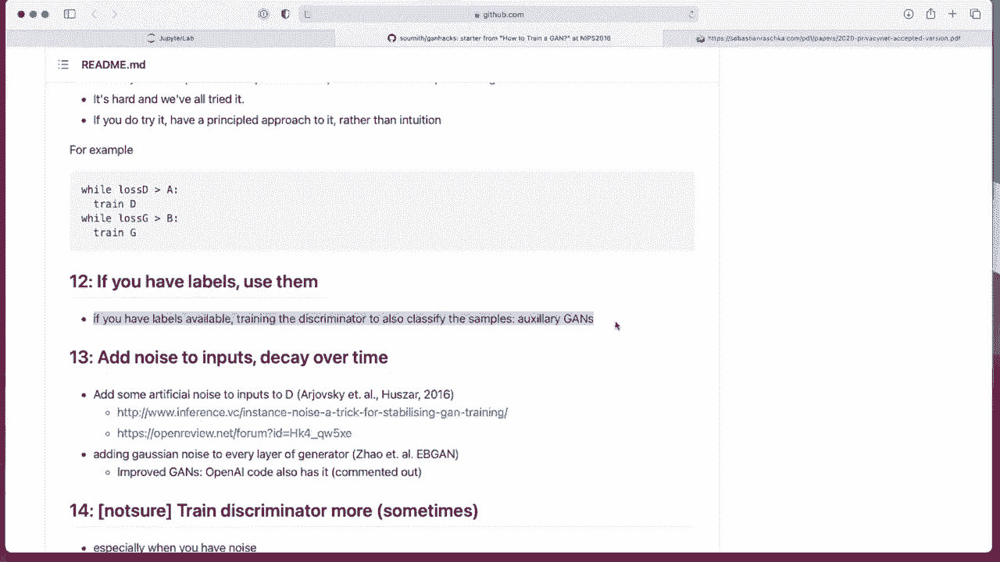
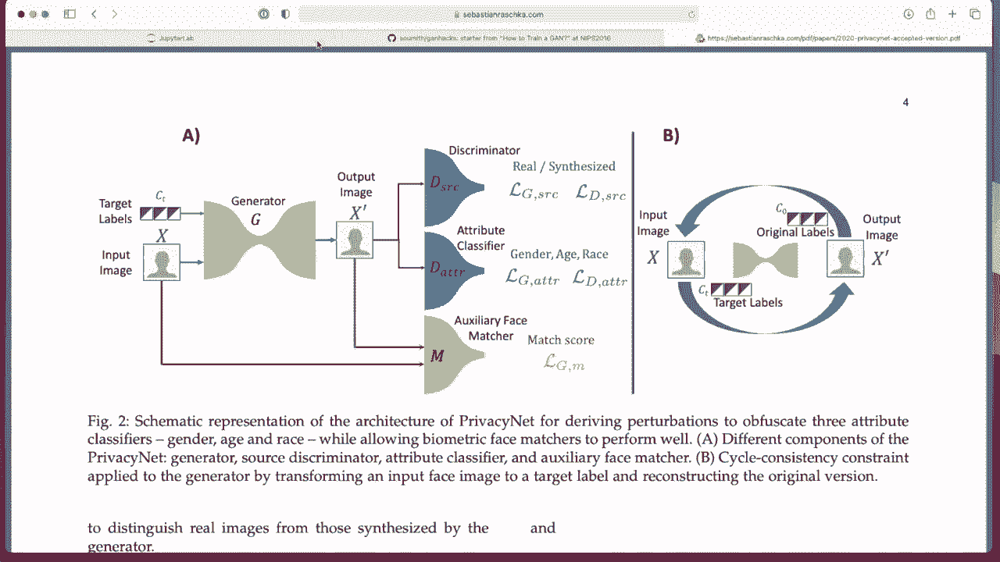

# P151：L18.5- 让 GAN 发挥作用的技巧和窍门 - ShowMeAI - BV1ub4y127jj

Yeah， so instead of making more slides， I thought it might be more fun to do this video on tips and tricks to make ends work a little bit more interactive。

 That is， yeah， I will walk you through a list of very nice list of tips and tricks。

 And then we will see in the code that we seen last video。 How or if I used these tricks。 Okay， so。😊。

This list is based on Gitub repository by Sit Chintala。

 sumit Chintla is a researcher at Facebook AI research and yeah is' also one of the main Pyt developers and also back in 2016 worked on the Vas Daen G which is a very popular version of the G。

So。

Here in this list， there are， I think 17 tips。 so I wanted to walk through them step by step。

 It says that this list is no longer maintained and he says he is not sure whether it's still relevant in 2020。

 but actually most of the tips are still very useful。 So they are really useful starter tips for GNs。

Even though the list is not maintained any more。 So let's look at them one at a time。

So normalizing the inputs， normalize images between -1 and one range and using 10 H in the last layer of the generator output。

 So that is something I actually did。 So here I normalized the images in-11 range and then I also had my 10 h here。

 By the way， I was writing this code before I looked at the list。

 So everything is just a per coincidence。

based on something I've heard before that seems to work well in practice。So then in G papers。

 the loss function is to optimize。It as follows， but in practice we do the maximization and then we flip the labels。

When training the generator， this is for the， the whole thing is for the generator。

 the modified loss function。 And this is also what we extensively talked about。 So when we。

Go back here。 This is， essentially。What we talked about when we flipped this one minus into just。

 yeah， the output。 And then we also flipped the labels that was right here。 So yeah。

 we are also using that trick。

That was also in the code。Using a spherical z。So instead of sampling the noise from a uniform distribution。

 we are sampling from a， yeah， Gaussian distribution。 And as。

 that's also something I it when we revisit。

Training code here， so。I think it was at the bottom somewhere training again。 So yeah。

 we used a random normal distribution and not。

Uniform distribution。Alright， next。Using beon。

So when using batch normm it's so I'm actually not using batch normm in this code。

 but I will show you in the next video my code for the setup a face image dataset set where I was writing a convolutional again and there I used batchn。

And here， the trick or tip is about not mixing the real and generated images， so。

Here the recommendation is keeping them separate。 So training the discriminator on a patch of real and a patch of generated instead of mixing real and generated。

 And that is also something we did。 So when we go back to the code here。

哦。Right。Here， so we have fake images。And we have。Now the real images all appear here。

 real images and fake images， and we feed them to the discriator separately。

 So first we get the real images and then the fake images we don't mix them together。

Okay， next。Avoiding sparse gradients using leaky redo。

So， yeah， like we talked about before， the Relu can have these dead neurons， that's。Lecture。

 I think lecture 5，6， something like that， or was it later could have been9 when we talked about activation functions and we talked about the debt re problem。

 and yeah if we have a generator that should generate something。

 maybe using a regular re is not a great idea。So using relu here。

 actually in both and G and D the generate and this screenator might be a good idea so。

Let's check whether we use that。Yep， I have leaky red here。

Next for dawn sampling， use average pooling。 Okay， this is something I have not done。

 So this is actually it will be in my next。 Let me just double check。

No， I don't have。Done that。Okay， that might be。That might be something to consider to improve my code using average pullinging and for up samplingling con transpo plus strand that is something I used。

 Pix shuffle might also be an additional interesting trick， which we may find here in this paper。

Using soft， noisy labels， that is something I have tried in the past。 it worked a little bit better。

 I think so。Wasn't。That much better about slightly better。

 I haven't done this in this code because yeah， I didn't。 didn't keep in mind everything。

 But if you want to play around with that， it's another interesting thing to do。 So instead of using。

1， for real， we use random numbers between0。7 and1。2 to make the labels a bit softer or not softer。

 but to yeah， instead of having these fixed numbers， having some uncertainty around them。

 And then for the fake ones to use the numbers between 0 and 03。 Actually when I did that。

 I had like a slide。 So I only had the soft labels， not the noisy labels。

 So I only had like instead of1， I had a 0。9 instead of 0， I had a 0。1 and it helped a little bit。

 So I haven't tried this range before or this range0。3。 So it might be something interesting to try。

And there's also another thing here making the labels noisy for the discriminator by occasionally flipping them。

 I also heard this works very well in practice to improve the discriminator so it doesn't become too good。

 So you kind of shake it up sometimes。 and I also have not tried that yet it might be another interesting thing to try。

Yeah using DC again when you can so I okay I mean I intentionally didn't use it here to keep things simple。

 just having the simple regular again with the fully connected layers。

 but in the next code example where we work with face images I will use a DC again So nowadays also like I mentioned before。

In the lecture。It's just called again because nowadays when DC again was new everyone used the abbreviation。

 DC again to distinguish it from the original again。

 but nowadays convolutionalgan are so common that we don't say DC again， we just say again。

Using stability tricks from reinforcement learning， so I'm not a big reinforcement learning person。

 so I haven't used these tricks。But what might be useful is keeping checkpoints。

From the generator and discrimininator， that is like saving them occasionally every few epochs。

 And then also， yeah swapping them sometimes。 So if things go bad。

 swapping in the old versions could also be useful。

Now， yeah， regarding the optimizer。Adam rules。 So， yeah， Adam is usually working。

Most of the time， well out of the box。

And another recommendation is using SGD for the discrimininator and at for the generator。

I think this is due to the fact that momentum may not be ideal for the discriinator because you wanted to react quickly。

Same actually also for the generator， but in practice。

 I still find that training actually both with Adamom is even better。 I tried this actually。

 and it didn't work so well， so I switched back to using Adamom for both the the screenator and the generator。

 But again， this is something you have to try and practice。 Sometimes it may work better。

 sometimes it may work worse。

Trick failures early。Okay， so just。Checking things if the discrimininator loss goes to 0。

 then that's not good。 The discriminator is too strong and then may the generator may not be able to learn anything useful。

 Maybe you have to。Yeah， see well how you can address that。Checking the norms。

So if the norms of the of the gradient norms are too large， then it might also not be good。

 So some people also use something like a gradient penalty。 we haven't talked about this yet。

 It might be， I mean， there are so many infinite， many things to talk about。

 but it's another thing to keep in mind。When things are working。

 the discgraator has a low variance and goes down over time versus having a huge variance in spaniking。

 Let's take a look。

Yeah， it goes down， I mean， goes up and down and then kind of stabilizes looking actually there are no spikes。

 actually looking at the value or also the variance is relatively small compared to the generator so that kind of looks like it's a hearing to what we would expect here。

One thing about that is。This value here is around， I would say maybe 0。5。6 something。

 And if you think about。A random prediction around 0。5。 and then you take the lock of 0。5。

On minus- log 。5， it should be around 。69， something like that。

 So it's actually kind of like a random prediction。 So it's。

 it's actually quite good that it is in that range here。 So for binary prediction。5 managed of 。

5 should be around。69。So in that way， we can see， okay， this is actually close to。69。

 So it's kind of like a random prediction here。

Which is good， okay。

If loss of generator steadily decreases， then it's fullying。D with garbage。So， yeah， okay。

 we don't have this problem here。 I will show you actually a failure case in the next video。

 Let me just double check on that。 I can show it already。

It's not going down。 It's rather going up， but yeah。

There was something interesting happening there we will revisit it in next video。K。

Don't balance the loss via statistics unless you have a good reason to。

So yeah， that is， don't try to find a number of generator number of the updates。嗯。

It usually doesn't work so well in practice it's kind of hard just to find the good recommendation if you recall the original G paper head a hypoparmetera for the number of discriator updates before updating the generator and let's go to the paper。

Just screenshot of that algorithm somewhere。Here。Yeah， the K steps。 So here they used K equals  one。

 one might be tempted to have multiple discriminator updates before updating the generator。 But yeah。

 apparently， this is probably not a great idea。

It's hard。 We've all tried it。Also， yeah， following a more principled approach。Like。

 checking the loss of the losses。Too large。 Or if the loss is very large train。

Dis screener until it goes down with the not for the generator to large train it until it goes down instead of doing a fixed number of updates。

If you have labels， use them。So if you have labels available train。

 it is greater to also classify the samples。So it's kind of like a auxiliary gun。 Actually。

 last year， we worked in the paper。 We actually did that here。 This is we used the cycle again。

 It's more of the advanced concepts， which we won cover in this class。 but part of it， we also。

Had a G here。 I mean， this is like an interesting setup。 We have an auto encoder plus a again。

 So there's also the G aspect that we have a discriator here。 And this is the generator。

 But it happens also in auto encoder。 So it's kind of like a hybrid。

And here we also had attribute classifier and an auxiliary face match。

 which are kind of like auxiliary ones。 So this is really the auxiliary one。

 And this is an additional constraint here。

So it's also， yeah， might be a good idea if you have label information to include that as well。

It also brings me to the topic of how we evaluate Gs。 It's a kind of a tricky question。

 It's still an active research problem。 We haven't really talked about it。

 One is called fresht inception distance。And it's kind of also。

 it's based on essentially comparing so many of these。

Metrics are based on comparing the distribution of the training data to the distribution of the generated data to see how similar the distributions are and sometimes people also use pre-trained models。

 for instance you can train let's say model on let's say MN a classifier on MN and and you do the classification on the original Mnes data and then you do the classification on the generated dataset and you expect approximately that so the better the model is the better the classifier prediction should be because if you train the classifier on the original dataset and then you show a garbage it probably won't perform as well the distribution of predictions will be different。

From the training set distribution predictions。So that that is kind of one way to kind of get a feeling of how good the results are。

 But yeah， there are many other metrics which are also slightly out of the scope of this class。

嗯。Add noise to the inputs decay over time。So adding some noise。 It's kind of， I think。Yeah。

 this is like adding noise to the way of the generator and to the inputs。

 it's kind of like adding if you think back of the denoising out and code we talked about。

 it's kind of like that adding some noise to the input images。

Train the discriator more。 So it's not sure。 So yeah。

There， that is like going back to the tricky part that we also had here in the paper whether we should train the disc screenator what times the a generator。

 It's a not sure thing。

Bched discrimination。 I actually forgot what that is。 Sorry， should look this up again。

Discreet variables。So yeah， so conditional again， is another topic we haven't talked about。

So what you can also do is you can concatenate。The target variable with the input and then also feed it through the network is in a conditional setting。

 and then it also allows you to reconstruct so。If you， I mean， there are， two ways through that。

 some people concatenated with the input。And。Then you concatenated it with a generated output。

And you check the。Sorry you check the reconstruction also So there's more like for an autoenr setting。

 but you include essentially labeling information and that can also help you to generate particular data points of a particular class if you're interested in that and here it appears that it is also maybe a general trick that helps making Gs perform better。

 I haven't done experiments extensively with with that， but it also goes back I mean， not without it。

 but it also goes back to our case here where we add。

Add this to the input the target labels essentially， we provide both essentially。

 and this is for a different context because we want to switch the attributes of the image。 But yeah。

 apparently， maybe it can also help stabilizing G training。

Using dropout both during training and testing。I have used only dropout during training。

Using it during testing is an interesting idea might be something worth trying。

 And now this is Orri it。 By the way，17 is also my favorite and lucky number。

 I always like to have the 17 in soccer back then。Long time ago。 but yeah。 so anyways。

 So that is just maybe an interesting idea of things to try some。

Inial things that work well with Gs notice that this is not longer maintained， but many of these。

Tips are still very relevant in my opinion。 Alright， so the next video。

 I will then talk about our D C again。

