# ã€åŒè¯­å­—幕+资料下载】å¨æ–¯åº·æ˜Ÿ STAT453 ｜ 深度学习和生æˆæ¨¡å‹å¯¼è®º(2021最新·完整版) - P152：L18.6- 在 PyTorch 中生æˆäººè„¸å›¾åƒçš„ DCGAN - ShowMeAI - BV1ub4y127jj

All right， so the last topic in this already very long G lecture is on implementing a D G for generating face images and Pytorch。

And just when I looked at the paper again， actually， I just noticed it's also so much Ch till I hear。

 the author of the G tips and tricks that we discussed in the previous video。So。Essentially。

 the only thing that is different compared to our previous Mist G is that the dataset set is。

 of course， different and that we are now using。

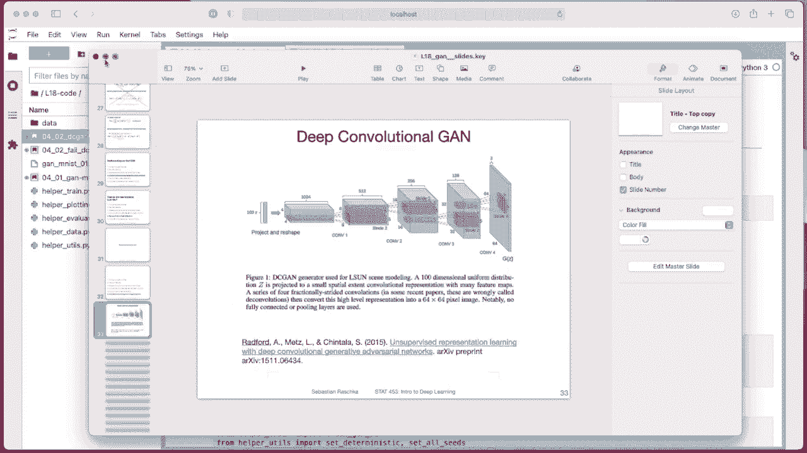

AConvolutionalgan， instead of fully connected layers。So let's go through this step by step。

 again our boiler platelate here。 again notice we have two running rates like before。Now， we have。

Slip a data set。

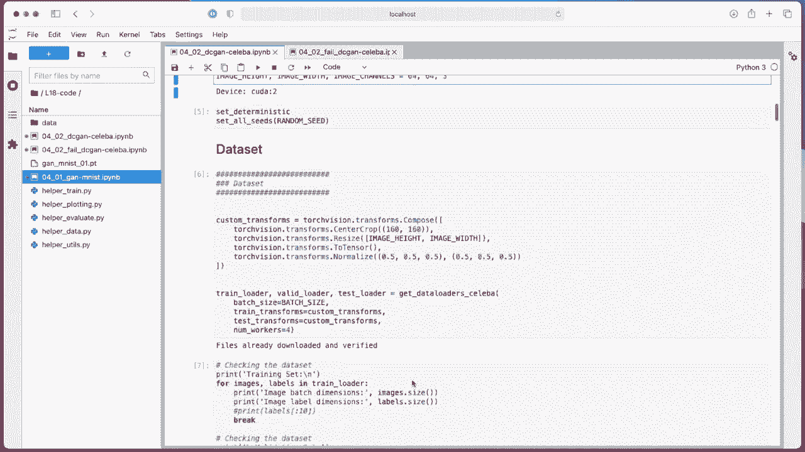

Instead of Mness。And here's an example of some of the images， how they look like。

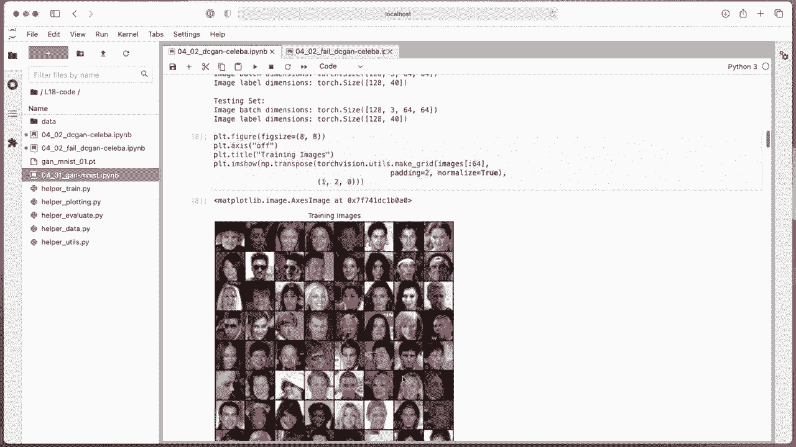

So it's an image data set consisting of celebrities collected from Google， I think。

 from the Google image search。

Yeah， so and this is our deep conutal G here。Los of layers for the generator。

 the con trans post layers because we go from laed dimension by default 100 100 dimensional noise vector。

We go up。Sample it up， so。That it has 64 times 64 dimensional。

 So I should mention I resized if I go back up again， I resize the images here。

 So I first crop them and then I resize them to 64 times 64。

 it's easier to train again with smaller images of course there are GNs with bigger images and if you look there are multiple approaches to that。

 some people train thegan still on lower images and then use super resolution methods some others do that directly but yes you can see these have much higher quality it's just hard to do that and especially with regulargans there are many advanced GNs which we can't all cover in this class。

 but for regular conclusion again like this one it's easier to work with smaller image sizes。

 it also depends really on how large your data set is how many images you have how diverse the images are in terms of colors and view angles and things like that。

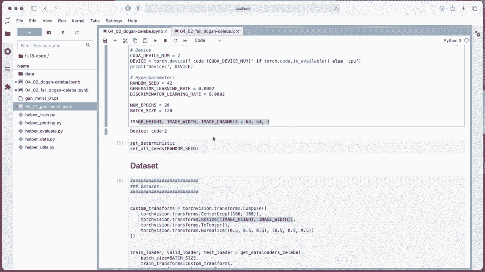

Many many factors to consider。

So here I found 64 times 64 worked much better than 128 times 128， for example。

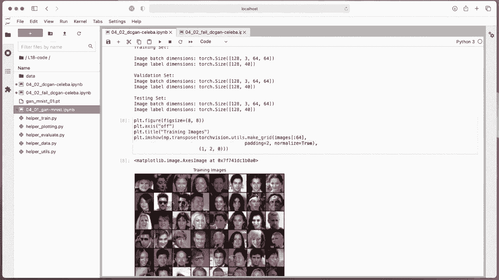

Okay， so it's just a snapshot。

Of some randomly sampled people。And then， here on on。Generator again。

 So here I'm alternating between transpose convolution。Or just transpose convolution。

 I don't use any pooling or something like that。 It's just or no up samplingling is's just transpose a convolution for making it larger。

Then batchome， likirelu transpose， batchome， Liquirelu， same thing， same thing。

 And then the last one with a 10 H function here。So that we get-1 at1 pixel ranges。

And the discriminator is a little bit and not that much simpler， but maybe it's a little bit too big。

 It's also one aspect of the discriminator too good that it's also then challenging for the generator。

 so。They could have been a bit too big， but it happened to work。

 So here the disc screenator has a convolutional layer， leakqui reello， convolution layer， batchome。

 leakki relo， and so forth。 So I'm done sampling with the convolution here instead of using maxpo。

Yeah。And then， there's a flatten。To get from So we don't use any fully connected layer。

 So here this is similar to what we discussed in a convolutional lecture。

 When we said we can actually get rid of the last。嗯。Fully connected layer。 if we make the dimensions。

 So such here， if I have 64 times 64 inputs at this point， when you do the math。

 you will have four times 4 feature maps。 and then I'm applying a convolutional layer with kernel size 4。

 So from 4 to 4， it will go to 1 to 1。And then， I go from。8 channels to one channel。

 So the output will be a 1 by one by one tensor。 And then I'm flattening it into a single value。

 which is my。Probability that this is a real image。Because we are using binary cross entropy。

And this looks like before a little bit simpler now compared to our。

Mnes scan because I wrote all the training function such that it works with images。

 And then when I had my Mnes scan， I had to adjust a little bit to do the reshaping because a fully connected layer works with back tos not with images right so I had to just do this back and forth here to make it work with my training code。

 but you could also always write more elegant training code to have an if else statement。

 whether it's a convolution layer or fully connected layer， but I yet I didn't do that much。

Work because I felt like the code is already complicated enough。Hard to read already。Okay。

 so I'm using Adam again for both。 I tried using SGD for the the screen， but it didn't work so well。

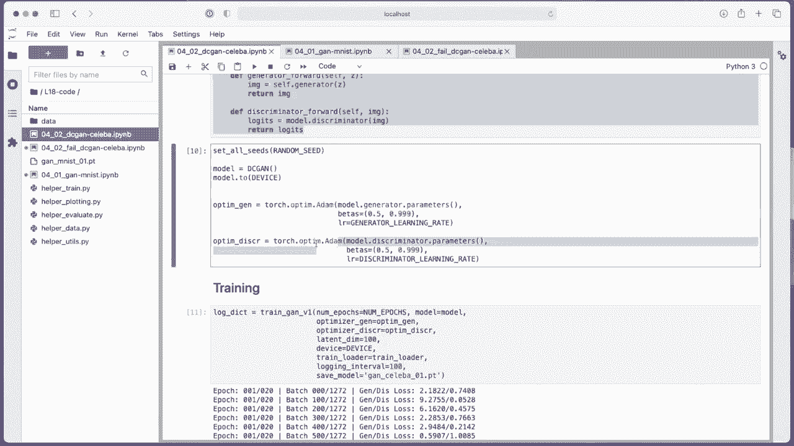

Requires also more learning， great tuning。 And already it took me a long time to get this running well。

So yes， my training function the same as before。 we can take a look at this again。 if you like。

 I mean there's nothing new so nothing has changed。

But there was one thing I wanted to discuss briefly。

 So one thing I was wondering when I was going over the tips in the previous video that I was thinking of one additional tip that is。

Whether we should sample the noise separately for the discriminator and the generator。 So here。

I'm getting the generated fake images。 I was wondering， So here I'm using them again。

 So sorry here I'm using them for the the screenator and here。For the generator。

 I'm using them again。 So I was wondering。Instead of having the noise here。

Like for the screenator and the generator， we could maybe have。So it's pretty clear if I put it here。

 we could have it here。Fake images form。The discreteer。

 but then use different ones for fooling the discreteer。

Find this is maybe also interesting thing to try out。 Actually， I haven't tried as。

 I could run this and see if it performs better because。The rationale could be here。

 we are training the discriminator to recognize these images as fake。Here。

 and then we are training the generator。sTo basically fool the discer with these images。

But I'm wondering if it's just back and forth， because we use the same batch。

 whether it might be better to use a fresh batch， so。Instead of using the same one for both。

 having these two different ones might be another trick to try。

 I haven't tried this might be something else to consider。 Maybe it doesn't make a difference。

 I don't know， okay。So， but except that the whole training function is still the same。

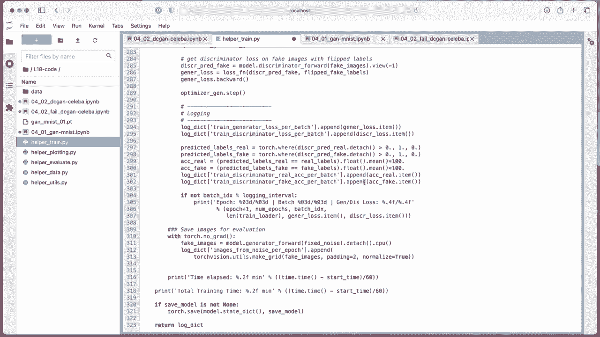

Going back to my code。training it。

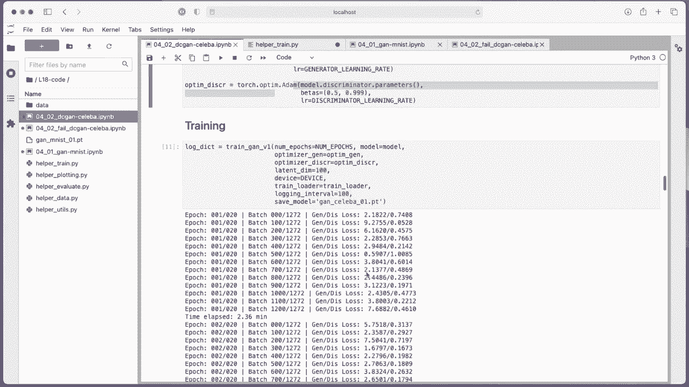

And see kind of stays okay。 So nothing。 So the discscriptator doesn't go to 0， which is bad。

Or yeah，0 loss for the screen。 That means it's way too good。And。😔，Nothing unusual。

 It's training for long time，20 epochs。

Sorry， one hour almost。 I mean， for the grand scheme of things for deepening。

 it's actually pretty fast。 But if you try to code the lecture。

So that I can talk about it。 I was like。Yeah， a little bit on time constraints。

 I was happy that it finished so fast because I also had to try different hyperparmeters。 Yeah。

 so it's， it's a lot of work actually to do these codes。

 So I talk to some people during office hours and some students that it' kind of takes a long time to work on the project。

 But yeah， I can totally understand you because also for research or these even these simple class examples。

 it takes a long time。 it's just the nature of deep learning。😊，So yeah plotting things， I can see。

 that's interesting。 The generator goes up。 the is great S。Kind of low herere actually， to be honest。

 approaching 0。 But when I look at the results， they looked actually quite reasonable。

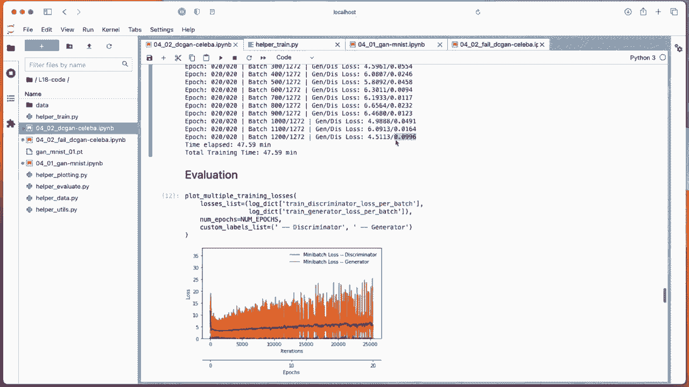

So first epoch can see these don't really look like face images。 but as we go further， epoch 5。

 epoch 10， so。

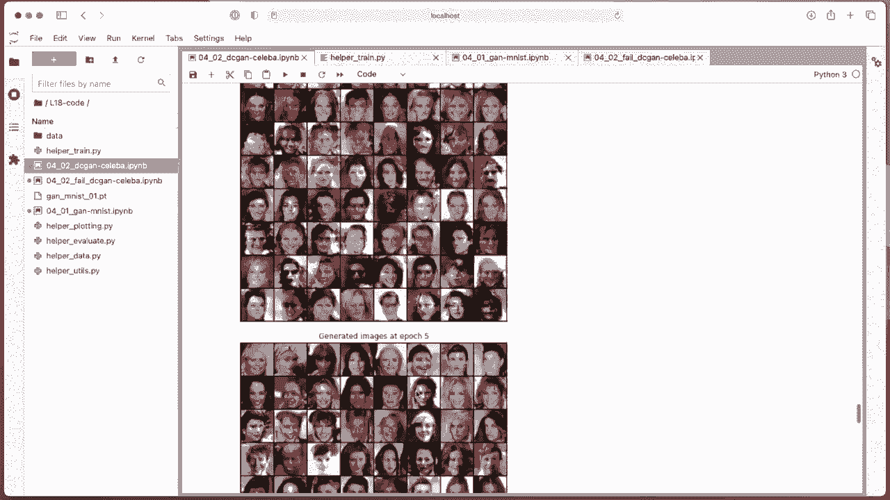

Not all of them look realistic， but this person。

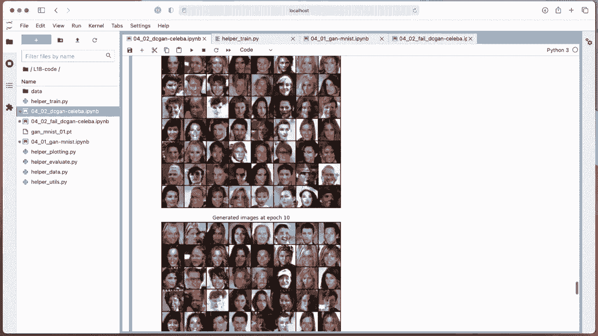

Maybe this personnel， to some extent， start looking more realistic。 I mean， of course。

 you can see they are generated。 They are not that great， but they are also not terrible， right。

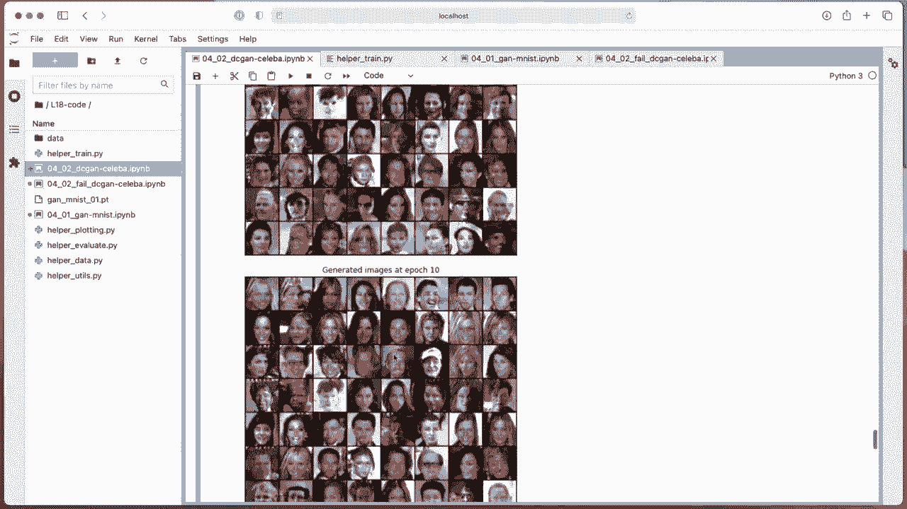

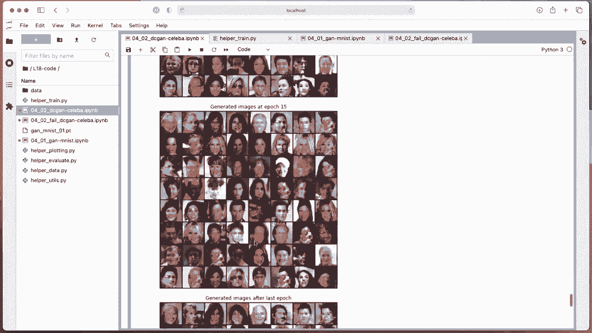

So yeah， it could be better。 The results could be better。 This person looks kind of realistic。

 but yeah， given that this is very simple code， I only trained 20 epochs。

 It doesn't look too terrible， in my opinion。 Actually。

 just wanted to show you one that actually failed。

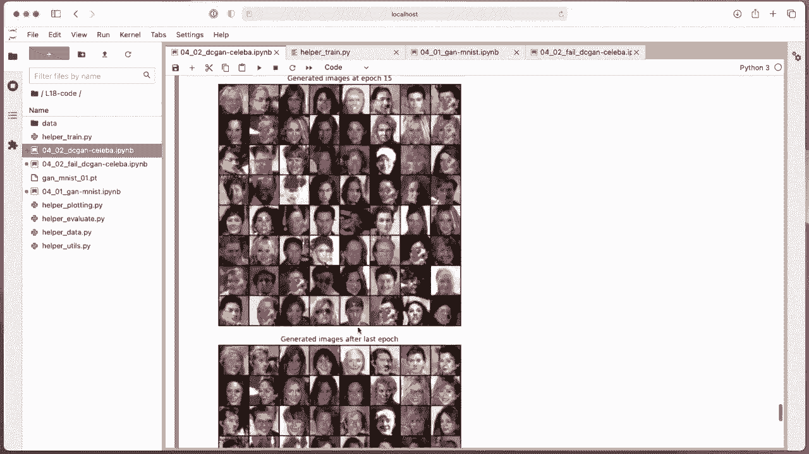

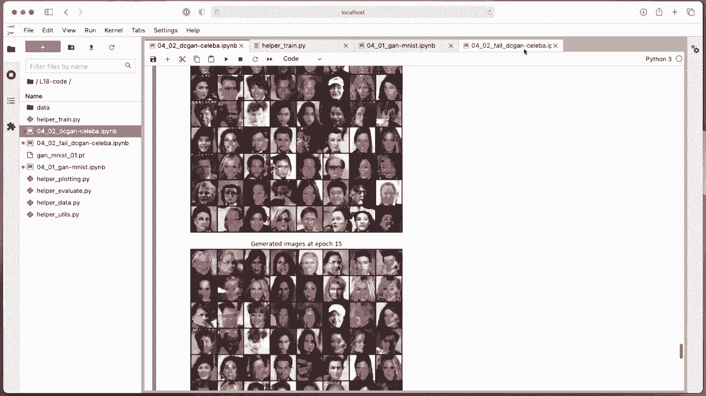

So the difference between the 1 I just showed you and this one is only that here I initially had a regular re。

And when I train it with a regular re。It was first going fine。 And then we had this huge spike here。

 and then suddenly。

Things looked very different。 And now looking at the results first， it looks the same as before。

 right。

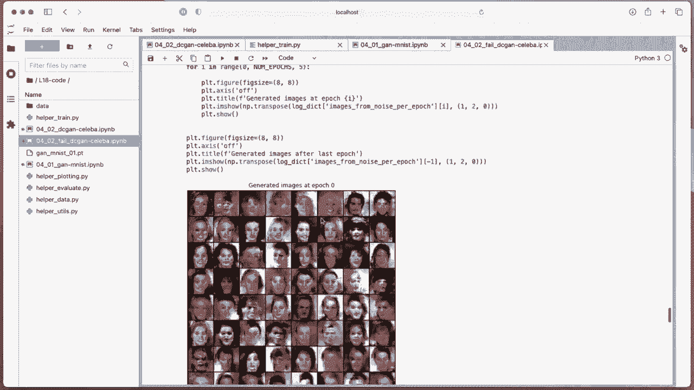

Looks okayish。 But then suddenly there's some mod collapse or something like that。

 You can see they all look the same。 So it looks like mode collapse。

Where。😔。

Theer can be easily probably fooled by the generator or something like that。

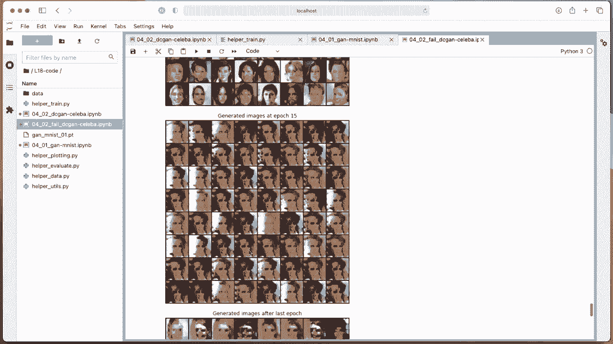

Ger is also very noisy。 It generates the same type of image。

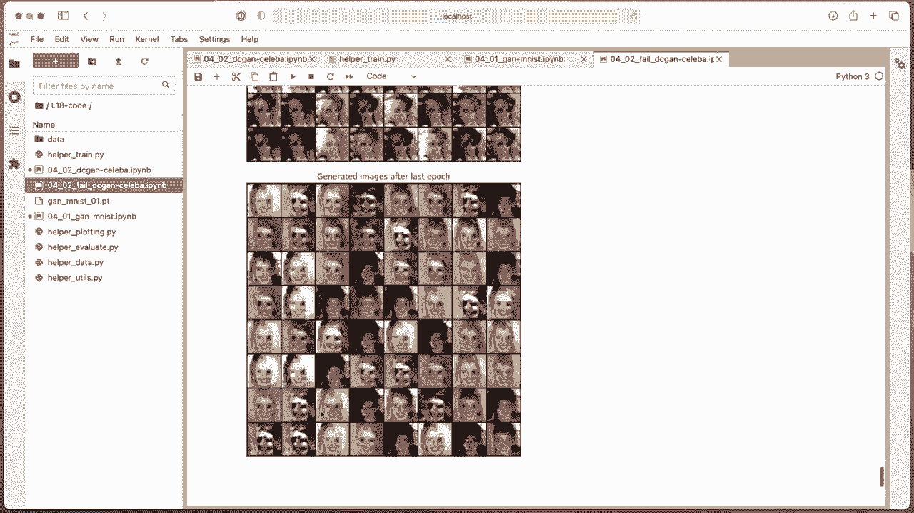

Kind of。 So again， it was also interesting。 Okay， so that is a deep convolution。 Again， it's overall。

 if you look at the code， it's a pretty complicated topic， right， we have a。

Lot of training code。 But that's just yeah， the nature of deep learning。 To be honest。

 it also takes me time to write this， but。

I remember when I was a student when this was all kind of new back then。

 I didn't learn this actually in class because yeah， was finished with classes when Gs came out。

 but was reading the paper looking at some early code examples。

 I think it was the yeah back in the day code was much harder to read compared to Pythtor。

 and it also took me a long time to kind of figure out how the code works。 Now it's for me easier。

 I can write these things myself。 but it I would say it's still one of the more complicated。

Models compared to， let's say， classifier。 So if this looks all complicated to you。

 you just need to give it some time。 You have to maybe implement it yourself or take some code。

 modify it a little bit， maybe apply some of the tricks。 So you could， for instance。

 apply the trick where。You flip the labels for the discriminator or occasionally and just get a bit of feeling for the code and where things are and。

Yeah then with some time you will also become pretty confident reading code。

 but yeah it really takes time so I can imagine just taking one class is not enough to really get confident doing this。

 it takes probably years and what's very important is really working on the projects where where you just work by yourself I mean not totally by yourself you have your team you can ask me for feedback many students or several students by an office hours where I usually help with a coding parts of their errors but ultimately you need to spend time with the code as no kind of textbook or anything like that that helps you really understanding everything it is really through interaction most of it and also doing some search on the internet and this is how everyone who's doing coding learns it's a process。

 it takes practice。All right， so with that， let me then end this already long lecture on generative adversial networks。

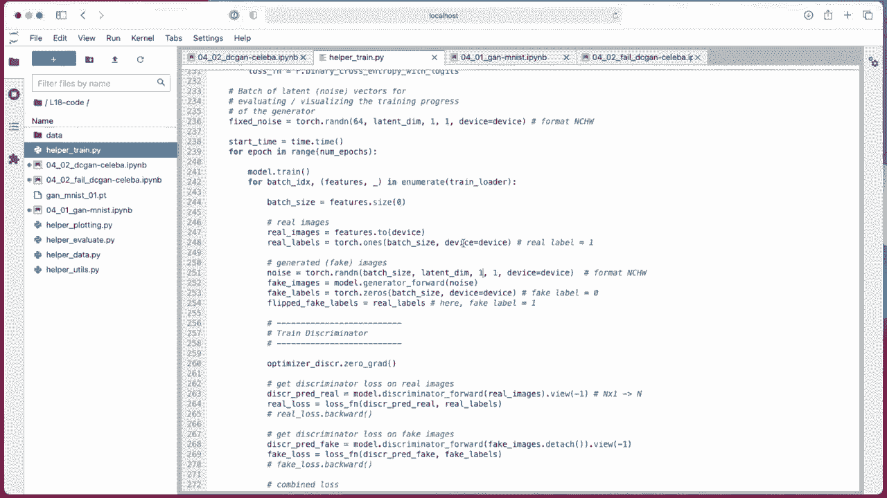