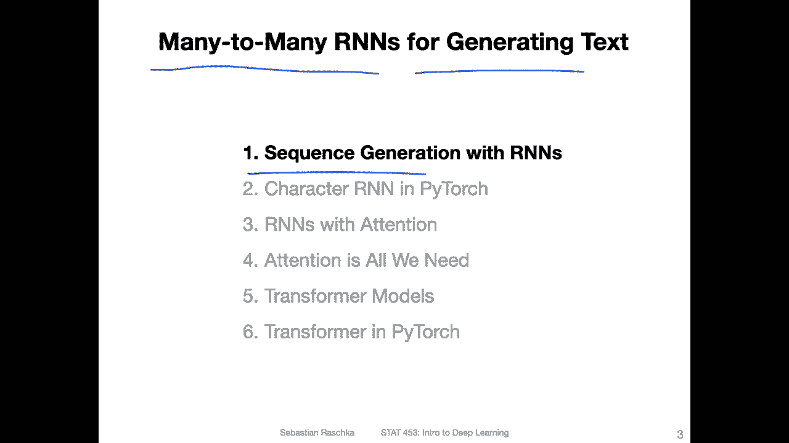
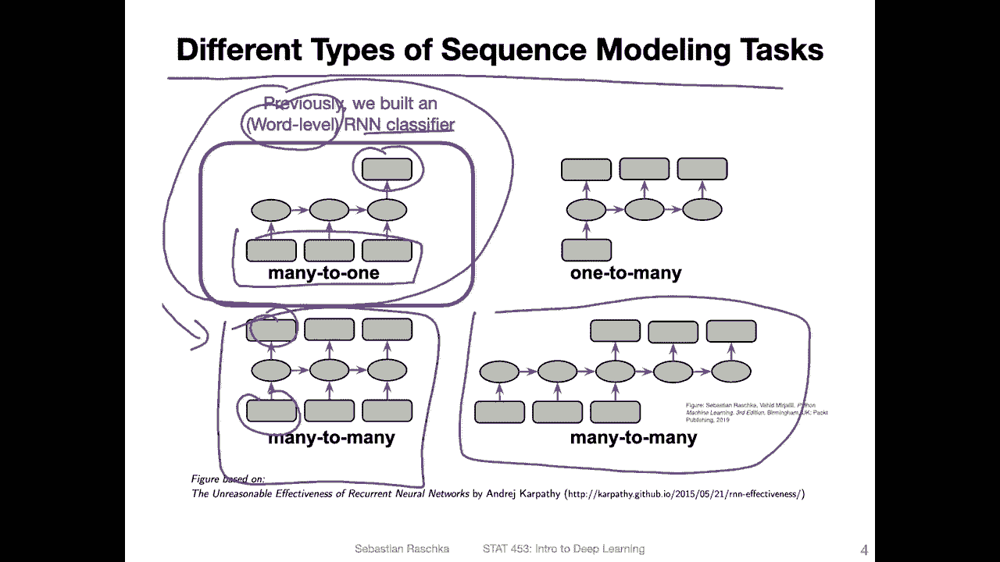
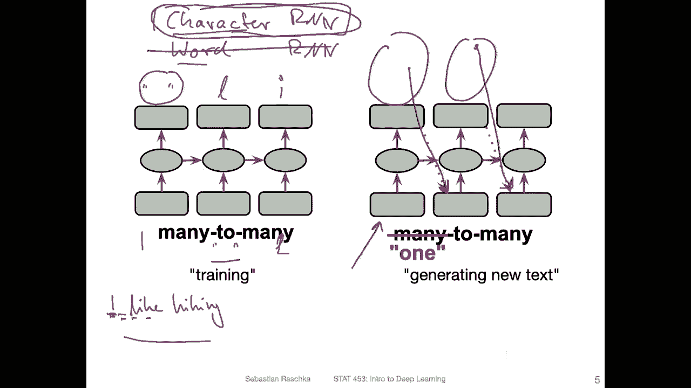

# 【双语字幕+资料下载】威斯康星 STAT453 ｜ 深度学习和生成模型导论(2021最新·完整版) - P154：L19.1- 使用单词和字符 RNN 生成序列 - ShowMeAI - BV1ub4y127jj

Al right， so in this video， let me illustrate the main big picture concepts behind using RNs for sequence generation。

 In particular， we will be briefly talking about many to many R ends for generating texts。

So recall this figure here that I showed you a couple of weeks ago when we talked about recurrent neural networks for text classification。

 So we had this slide on the different types of sequence modeling tasks。 and previously we used。

There's many to one approach where we had text input。

 So many inputs and had one output sentiment label。

 whether the movie review was positive or negative。 So it was essentially a classifier and。

The classifier worked on a word level， so we had an embedding vector that took each word as an input and was converting it into yeah into continuous vector。

Today， we are going to focus on。The many， too many architecture for generating texts。

So there's also a related many to many architecture here。

 this could be for instance used for language translation and we will talk a little bit more about language translation when we talk about R ends with attention。

 but in this video we are going to focus on the many too many approach first that is really like taking one input and producing one output at each time step。

So and when we talk about generating texts with recurrent neural networks。

 there are two main approaches。 One is a so called character level R and N， also just known as。

Character。R and n enter word level， R and n， which we also just call word。R and N。

 And the difference is really what we。Provide as token as one input token。

 So focusing on the left subfi here。So for let's say a word R and N。

 we could have one word would be the input。 So for each time step here， the input would be。

A single word， for instance， let's say I。Like。Hing。And when we train this word R andN。

 what we want to do is we want to predict during training the next word so。

Let's say I like hiking a lot or something with a sentence that would continue like this。Hing a lot。

 So what we would do is in the first time step， we have this I is input， and it should predict。Like。

 and then。Second input is like， it should predict。Or output hiking， And then。I input is a hiking。

 and then it should。Provide an A， and then。So forth。 so we would continue like that。

 so we provide one word as input， and then it should learn how to predict the next word。

 This is usually how a word level RN is trained。For the character level or an N。

It's trained slightly differently。 but following the same concept， let me erase that。

 So instead of giving one word as an input at each position， we would just use one character。 So。

 for example， I。嗯。Space。Like an L and so forth。 So in that way， it predicts one character at a time。

 So we would predict the next character。 So I， if I have， I like。Hiking。

 so I would be the first part， and it predicts the white space。Here。

 and then the next one would be the white space， and then the L。

And then the L and the next letter would be the I and so forth so。Fundamentally， yeah。

 the differences between using a word and a or a character level are an n。 at the end of this video。

 I have just a small comparison slide， like listing the advantages and disadvantages of using。

Each of those two approaches。 So let's focus for now， maybe on the character or an N。

 And I will tell you at the end of this。Video what the advantages are of using a character RnN and what the advantages are of using a word RnN。

But for simplicity， we are focusing now on the character Arn and， not on the word aren'n it。

So now assume we have this character R and N。 This is for training。

 we predict the next word and if we have a sentence like that。

 we know the next label right because we have this letter and then we know all the following letters And that way it is it is a flavor of self-supervised learning where we generate our labels so we don't have to have labels for this training task because the labels are essentially the structure of the sentence right because we we know the next word and。

Here， the prediction is essentially the next word。I will have another slide that maybe makes us a little bit more clear。

 so for now， stay with me so what we are doing here is we are always providing the next ver as input during training or sorry the next character。

But。For testing。 So how do we then generate a new text with that， right？

 So we want to generate a new text and not just regenerate an existing text。

 So how we do that is we provide a random letter as input。Then it predicts the next letter。 Usually。

 there is also some sampling involved。 We are sampling with a certain probability。

 So we would consider all the top predicted letters。 Let's say the。with a certain probability。

 and then we would randomly sample the weighted sampling of these predicted letters and then new type letter is the input for the next one。

And then again， we predict characters and we。Take one of them， and provide。And is input to the next。

Position and so forth。 And with that， we can yeah， predict different or generate different characters and sequences。

 And I think this will also become more clear when we take a look at the code example。

 So essentially， the network learns。The probability that certain letters occur after each other。

 and if we train it like that。It will at some point， be able to， yeah， to generate。

Realistic text with a certain amount of， yeah spelling errors。 But yeah。

 we will see about that in the code example to make this concept a bit more clear。

 I have a slightly different slide here。 That is maybe a little bit more， I would say， concrete。

So this is a character R and N here again。 And just assume it's processing。The text， test。

So it's trained to predict the next character。So here I have the inputs。First one is T， then E。

 and then S。And these letters are represented as a one hot encoding。 So for the letter T。

The last position is a one for the letter E， the first and for the letter S。

 it's the center position Here， we have only a one hot encoding。Vectctor of three elements。

But the number of elements here， the size of this would be equal to the number of possible characters。

 So， for instance， if we only would consider all lowercase English。Alphabet letters， it would be。

 let's say，24。 if we consider lower and upper case， it would be 48 And then if we have punctuation。

 like period comma colon， semicolon， it would be 52 and so forth。 So the size of the。

When including a vector here really depends on how many characters we consider。And this size here。

Of this mono ending vector is equal to the size of the output here。 So the output layer。

 this what's shown here is。A vector of the predicted。Soft mix。Probabilities。

So these are the probabilities， the predicted probabilities for each letter。So in this case。

 position 1 was the letter E right， So it has 70% probability that this is an E。

 20% that this is an S and 10% that this is a T。 correct that has an E。 So in this case。

 the network is making good prediction。So because the highest probability is the correct letter。

For the second one， so it receives an E， it should predict an S。

So the probability that this is an E is 20%。 The probability that this is an。This is an S is 60%。

 and the probability that this is in T is 20%。 so also in this case。

The highest probability is for the is corresponding to the correct letter。 So that's also good。

 And for the last one， yeah， this is also good。 So this is， of course， just a toy example。

 but here essentially the network is trained to output a high probability for the correct word。

And then we can use the Archrcm。To convert this spec into a letter from going from this probability here to to the actual letter。

 we could， for example， use an arcm。So it would give us the index index corresponding to the letter in let's say。

 a vector or dictionary。A few more things so usually we use an embedding layer。

 we have talked about this in the RNN classification lecture we use usually an embedding layer to embed the inputs so there's usually a certain dimensionality of that embedding that comes out of it and then we also usually choose the size of the hidden layer and here it just happens that the hidden layer has three values but it's just a coincidence because it fit nicely here into this box but of course the hidden dimension is arbitrary it could be for example 64128。

200，211， whatever you like。 it's， this is similar to the R and N for classification。 So。

 so these parts are really the same that we have seen before when we talked about R and N classifiers。

The new part is really that the output here is。Softmax probability vector corresponding to the 100 codingding of the input。

 So essentially yeah we are trying to predict letters now rather than class labels。

 So the letters here are essentially our class labels and in that sense。

 since we are predicting something that is in in the data it's kind of like yeah kind of like selfsvised learning because we are generating our labels here ourselves by just。

 yeah using the inputs the text。Yeah， and this is， yeah， the， the broader concept。

 And like I mentioned before during the generation。

 So once we train the network and when we use it for inference for generating new text， we sample。

We sample from， from this output vector here。 So it's not guaranteed that we pick the letter E as input。

For the next。Token。Let us do after train doing testing because if we would guarantee that。

 then of course it would just memorize text， but we want to usually have some variety in our text。

 so there's a certain probability， so the probability is 70% to sample that E for example。

 whereas ass a smaller probability let's say 20% to also choose a different letter。

So we can also in practice， I mean， there are different ways。

 you can also say only consider the top five letters or top three letters and sample them with a given probability and so forth。

 So there are different ways for doing that。But yeah during the generation of new text we usually don't just pick the one with the highest probability。

 we usually pick the one with the highest probability most often。

 but we also occasionally pick another letter and this will become hopefully more clear in the code example where we implement something like that。

Yeah， so here are just。要嗯。For reference， what I talked about， how， how we。

Work with this character R N。 So during training， what we do is usually we ignore the prediction。

 I mean， the prediction is only used for computing the loss。

 but we don't we don't during training feed it into here during prediction we take。

This from the original input text。

And during。To inference stage， we usually then use the prediction as the next input。

 This allows us then to create text with a variety that it's not always the same text。

Yeah I wanted to highlight， of course， this works with both word and character level RNs。

 We talked about character level RNs when I。

Show you this。 But， of course， this would also work with word level rNs。 The difference， though。

 would be that the size here of this mono encoding would be the same size as the number of words that can occur。

 if you consider the English vocabulary， there are millions of words。

 usually so you restrict that So that doesn't become too large。 But even if you have a vocabulary。

 let's say， of 20000 words， it would be way larger than the number of characters。

 which is one of the challenges of working with word r ns。

 So this wasn't a problem that much when we talked about the classifier。

 when we implemented the RN classifier。Cause yeah， I mean， for the em bedding。

 it still works fine if we have a 20000。Meocabulary size。

 But the problem is really when we have these outputs here。

 like we compute the label over these 20000。Possible words and compute the cross entropy between the two right that would be a little bit more challenging because these could be all very small values and there might be no large value among them and so forth。

 So there's there's a field of machine learning called energy based models which kind of borrows ideas from physics like how to make two vectors or how to assess whether or how similar to vectors are。

 but yeah， this is a different topic for maybe a separate lecture。 but。

The fact that in work level RnNs these vectors are very large。

 it's usually easier to train a character level RnN for generating new texts。

So let me summarize things here。 So for character embeddings。

 we usually only have the 24 letters if we consider lower case only if we have up and lower cases different letters。

 we would of course have 48。And in general， it requires less memory compared to word embeddings。And。

And the losses also to have yes， smaller output layers。

The disadvantage of using character RnNs over word RNNs is that it can more easily create weird nonsense words because each character is input so it can put together weird character combinations that don't correspond to real words whereas if you use word level RnN。

 I mean you can still have a weird word order， but each word is kind of fixed so that way you don't at least have a spellingarrows in the words。

And one other disadvantage of character level R and Ns is that they are worse at capturing long distance dependencies。

 That is simply because you have， or we have more tokens， right？ So if each character has a token。

 So if we have the sentence， I。Like。😔，Hiking or something like that。 So if I look at this。

 these are only two tokens apart。 If I consider them as words。 But if I consider each character。

 I have。1，2，3，4，5，6，7，8，8 sequence positions。Are between these two so in that way it becomes more challenging to capture the relationship because this might get lost when we even if we have an LSDM。

 these types of long sequence relationships might get lost。We will talk about。The tension mechanism。

 which can help with longer sequences， but we will take a look at that in a word R and n context。

 For now， since it's the simpler case in the next video。

 I want to yeah implement a character R n in Pytorch because that's also easier to train than a word R and N and。

I will first show you maybe the concepts in the next video because there are also some。

 I would say technical details that are worth noting。

 so I will first show you the big picture concepts how to implement this using LSTMs and LSTM cells and then I will show you in another video the actual code implementation。

